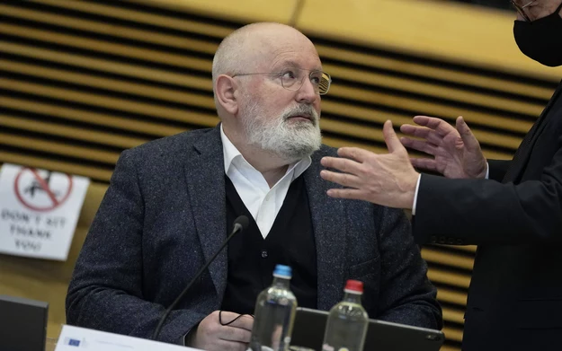
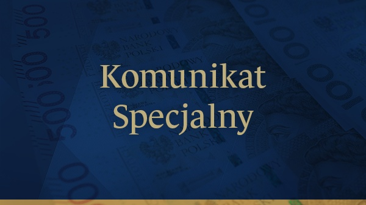
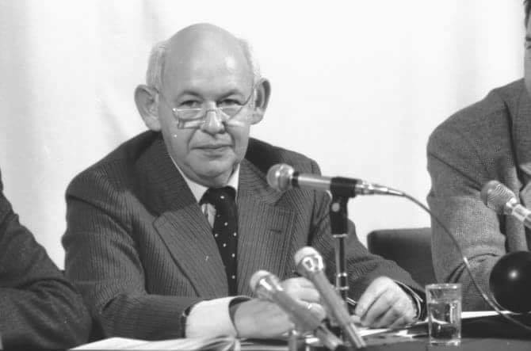
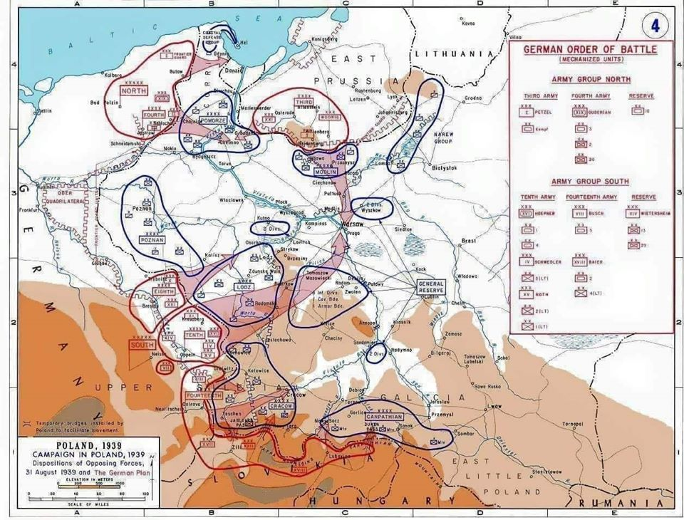
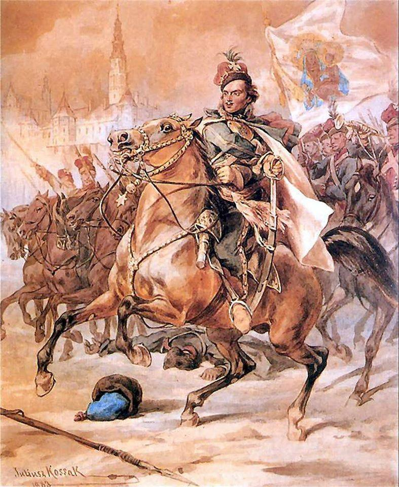

### 2022

> Węgiel zamiast rosyjskiego gazu. Timmermans: Wszystko się zmieniło

  

Wszystko się zmieniło. Tydzień temu historia zatoczyła koło i musimy się z tą historyczną zmianą pogodzić - powiedział Timmermans.

Timmermans odniósł się m.in. do przypadku Polski oraz innych państw, które wykorzystują teraz węgiel. Polska i kilka innych krajów planowało odejście od węgla, tymczasowe wykorzystanie gazu ziemnego, a następnie przejście na odnawialne źródła energii. Jeśli pozostaną dłużej przy węglu, a następnie natychmiast przejdą na źródła odnawialne, może to nadal mieścić się w parametrach, jakie ustaliliśmy dla naszej polityki klimatycznej - powiedział.

---

Komunikat NBP.

  

> W dniu dzisiejszym Narodowy Bank Polski dokonał sprzedaży pewnej ilości walut obcych za złote.

---

### 2021 - Desperacja EBC

Reakcję EBC na wzrost rentowności długu można nazwać niemal paniczną...wyrażali się o rosnących rentownościach niczym o jakimś nowym ruchu separatystycznym – trzeba zdławić za wszelką cenę.
Z jednej strony pozycję EBC można próbować zrozumieć – europejska gospodarka pozostaje w zapaści. W grze kolejne luzowanie.
Zdaniem przedstawicieli EBC oburzający i nieakceptowalny jest wzrost rentowności niemieckiej 10-latki do… -0,25%! Tak, jeśli ktoś chciałby pożyczyć niemieckiemu rządowi 1000 euro na 10 lat i czekać na ich zwrot dostałby po tym okresie ok 970 euro i to zdaniem EBC są niedopuszczalnie dobre warunki dla pożyczającego. Niedawno rentowność wynosiła -0,6%.
Czemu i komu służy desperacka polityka EBC. Z pewnością nie konsumentom, których oszczędności przez ostatnią dekadę straciły realnie ok. 20%. Czy gospodarce? Poprzednie programy EBC nie wywołały szalonej akcji kredytowej i agresywnych inwestycji w lepszym otoczeniu makro.
Służy rządom, które mogą przetrwać z katastrofalnym stanem finansów publicznych i wąskiej grupie najbogatszych, zyskujących na aprecjacji realnych aktywów. Fakt, iż unijna gospodarka przypomina Rzym z końca IV wieku nie powstrzyma EBC przed kolejnymi straceńczymi ruchami.

### 2001

Szwajcarzy w referendum ponownie odrzucili wizję członkostwa w UE, tak jak w grudniu 1992 r. 
Wegług badania z maja 2012 r. aż 82 procent Szwajcarów jest przeciwko przystąpieniu do UE.
Szwajcarię łączy z UE ponad 120 sektorowych traktatów dwustronnych, zawierających praktycznie te same przepisy, co w przypadku prawodawstwa przyjętego przez państwa EOG (Europejski Obszar Gospodarczy) w zakresie swobody przepływu osób, towarów, usług i kapitału.

### 1982

"Oświadczam niniejszym, co potwierdzam własnoręcznym podpisem, że zobowiązuję się ściśle przestrzegać obowiązującego porządku prawnego, a w szczególności nie podejmować jakiejkolwiek działalności szkodliwej dla dobra PRL"
Powyższy tekst to treść tak zwanej deklaracji lojalności, którą 4 marca 1982 roku w czasie stanu wojennego przedstawiono na konferencji Biura Prasowego Rządu. Dokument ten, będący jednym z narzędzi represji, a jednocześnie próbą podporządkowania sobie dziennikarzy dawano do podpisania osobom zwalnianym z ośrodków internowania.
Na zdjęciu ówczwsny rzecznik prasowy rządu Jerzy Urban.

  

### 1939

W Sztabie Głównym Wojska Polskiego rozpoczęły się prace nad tzw. Planem " Zachód". Był to plan przygotowujący Polskę do konfrontacji z Niemcami.
Autorami planu byli: Tadeusz Kutrzeba, Leon Berbecki, Juliusz Rómel i Władysław Bortnowski.
Źródła historyczne mówią,że nieoficjalne prace nad tym planem rozpoczęto już w 1938 roku. Dowódcy zakładali wtedy, że niemieckie natarcie rozpocznie się od Pomorza, a następnie ruszy w stronę Warszawy. Uderzenia od strony Śląska i Prus miały spełniać tylko funkcję pomocniczą. Korektę, a właściwie całkowite opracowanie planu na nowo rozpoczęto jesienią 1938 roku po aneksji Sudetów. Przypuszczano wtedy,że główne niemieckie uderzenie nastąpi od strony Śląska. Od początku zakładano bitwę graniczną na południu wykorzystując do obrony część rejonów umocnionych na Śląsku. Możliwość obrony na Wiśle i Sanie zakładano dopiero po stoczeniu bitwy granicznej.
Dowództwo biorąc też pod uwagę znaczną przewagę niemiecką uwzględniło też w tym planie działania defensywne czyli wycofywanie się na południe w stronę Węgier i Rumunii. Zakładano też długotrwałe działania obronne na morzu,a w przypadku niemożności dalszej walki floty polskiej wycofanie się jej do Wielkiej Brytanii.
Plan jednak się nie powiódł, ponieważ nie przewidziano ataku ze strony ZSRR i biernej postawy Brytyjczyków i Francuzów w pierwszej fazie wojny.

  

### 1768

Zawiązano i zaprzysiężono związek zbrojny konfederacji barskiej założonej 29 lutego.
W dniu św. Kazimierza, 4 marca tego 1768 roku zawiązano i zaprzysiężono związek zbrojny konfederacji barskiej. Wcześniej, 29 lutego w Barze na Podolu zawiązano konfederację w obronie wolności, niepodległości i praw religii katolickiej. Wymierzona była przeciwko innowiercom, cesarzowej Rosji Katarzynie II oraz uległemu jej królowi Stanisławowi Augustowi Poniatowskiemu, który, z pomocą Repnina, narzucił Rzeczypospolitej gwarancję rosyjską.
Konfederacja barska objęła swoim zasięgiem ziemie całej ówczesnej Polski. Swoje cele zamierzała osiągnąć osadzając na polskim tronie członka rodziny Wettinów, by w ten sposób uniezależnić się od Rosji. Przywódcami i inicjatorami konfederacji byli członkowie magnaterii, m.in. K. Pułaski, K. Sołtyk, W. Rzewuski, T. Wessel z biskupem kamienieckim Adamem Stanisławem Krasińskim i marszałkiem nadwornym koronnym Jerzym Augustem Mniszchiem na czele. Związek zbrojny został zorganizowany przez Michała Hieronima Krasińskiego, Joachima Potockiego, Michała Jana Paca, Józefa Sapiehę, Józefa Pułaskiego (marszałek związku wojskowego) – ojca Kazimierza – a także przez Wawrzyńca Potockiego. Marszałkiem generalnym koronnym został A. Krasiński. Karmelita ks. Marek Jandołowicz stał się przywódcą religijnym konfederatów, a ideologami politycznymi S. Czacki i M. Wielhorski.
W 1768 roku konfederaci, popierając Turcję, wypowiedzieli wojnę Rosji. Pomoc militarną i finansową uzyskali od Francji. Polskie siły, tworzone w pośpiechu, składały się z ochotników rekrutujących się spośród szlachty oraz milicji magnackiej i żołnierzy chorągwi komputowych. Walczyły one przeciwko regularnym wojskom rosyjskim i królewskim.
Na Ukrainie walki trwały od kwietnia do czerwca 1768 roku i zakończyły się zdobyciem Baru (20.04.1768 r.) przez siły rosyjskie. Konfederaci przedostali się do Mołdawii. W Krakowskiem walki zakończyły się kapitulacją miasta 22 sierpnia. 26 października nastąpiła kapitulacja Nieświeża, kończąca starcia na Białorusi.
W 1769 dzięki konfliktowi rosyjsko-tureckiemu i wycofaniu z ziem polskich części carskich oddziałów, konfederacja odrodziła się w Krakowskiem i Wielkopolsce.
Wojska konfederatów podjęły wyprawę na Litwę. Jednak, mimo początkowych sukcesów, zakończyła się ona klęską pod Białymstokiem (16 lipca) i Orzechowem (13 września). Początek kolejnego roku przyniósł porażki pod Dobrą (20 stycznia) i Błoniem (12 lutego). Od tej pory konfederaci prowadzili głównie działania obronne w oparciu o sieć punktów warownych. Kolejny rok również nie był pomyślny dla Polaków. Ostatecznie walki zakończyły się 13 sierpnia 1772 po zdobyciu przez Rosjan Jasnej Góry.
Po upadku konfederacji barskiej część z jej przywódców pozostała na emigracji, około 5 tys. jeńców zostało zesłanych na Sybir, a znaczną liczbę konfederatów wcielono do armii carskiej. W 1772 roku, oskarżając Polskę o anarchię i całkowity rozkład państwa, państwa ościenne dokonały jej I rozbioru.

  

---

<a href="https://github.com/TomaszWaszczyk/historia.waszczyk.com/edit/master/src/content/march-4.md" target="_blank">Edytuj tę stronę dzieląc się własnymi notatkami!</a>
