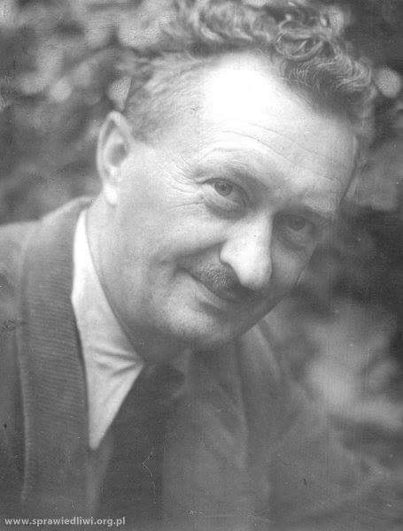
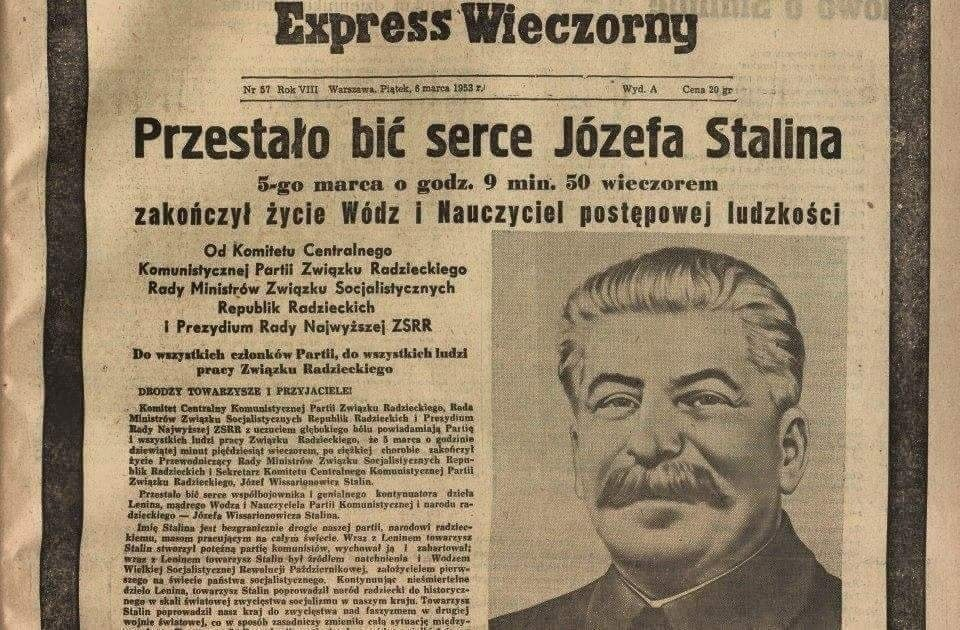
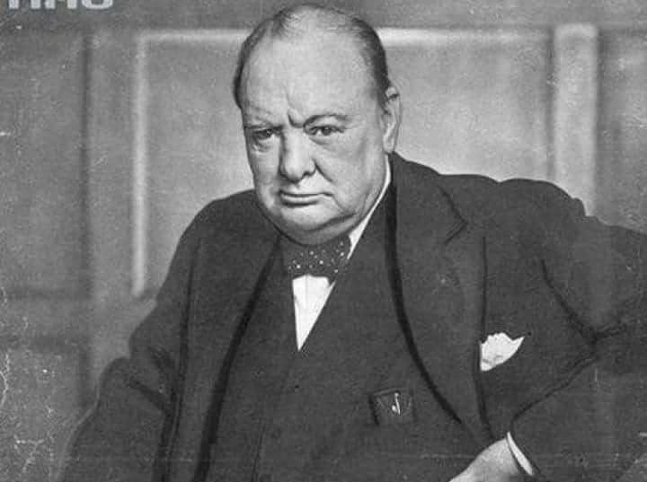
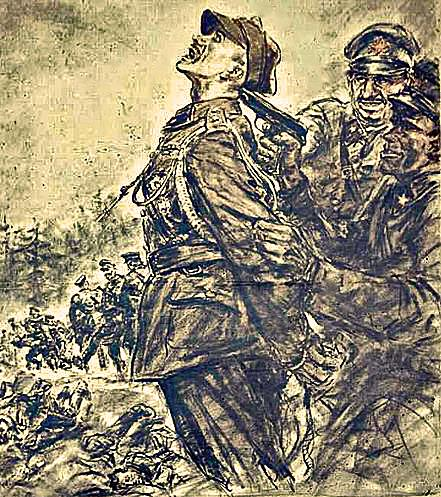
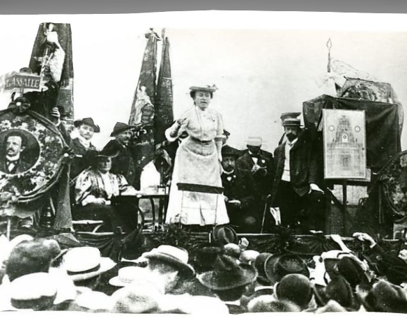
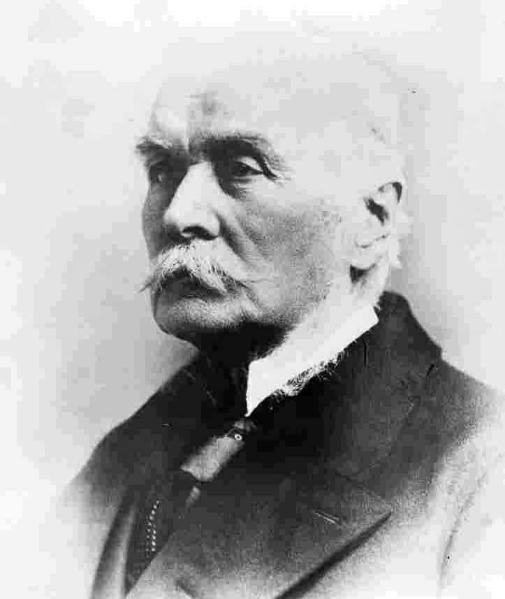

### 2021

Hongkong zniknął z rankingu wolności gospodarczej

Hongkong przez 25 lat z rzędu był na szczycie rankingu wolności gospodarczej, publikowanym corocznie przez Heritage Foundation. W ubiegłym roku został zdetronizowany przez Singapur. W 2021 roku w ogóle nie ma go na liście.
Hongkongu nie ma w opublikowanym w czwartek rankingu, bo tak jak Makau został uznany przez autorów rankingu jako część Chin. A te znalazły się na 107 miejscu, między Ugandą i Uzbekistanem.

---

Trwa galopada cen żywności. Inflacja jeszcze wzrośnie

Luty był kolejnym miesiącem szybkiego wzrostu cen żywności na świecie. Jeśli sytuacja się nie zmieni, to oczekiwania na utrzymanie w ryzach inflacji cenowej w Polsce okażą się mrzonką.

Globalny indeks realnych cen żywności w lutym wzrósł dziewiąty miesiąc z rzędu i osiągnął najwyższą wartość od lipca 2014 roku – poinformowała Organizacja Narodów Zjednoczonych do spraw Wyżywienia i Rolnictwa (FAO).

---

### 1994

W Warszawie zmarł Jan Dobraczyński - pisarz, publicysta, działacz społeczny i narodowy; żołnierz września 1939 (rotmistrz kawalerii w szeregach 2. Pułku Strzelców Konnych) i powstania warszawskiego (kierownik BIP AK); związany z ruchem katolickim Stowarzyszenie ,,Pax''; autor powieści o tematyce okupacyjnej (Najeźdźcy) i biblijnej (Listy Nikodema); w latach 1983-89 przewodniczący Rady Krajowej Patriotycznego Ruchu Odrodzenia Narodowego.
12 września 1993 r. Instytut Yad Vashem przyznał Janowi Dobraczyńskiemu tytuł „Sprawiedliwy wśród Narodów Świata” w dowód uznania za to, że w czasie okupacji niemieckiej narażając własne życie ratował dzieci żydowskie. Relacje potwierdzające działalność Dobraczyńskiego na rzecz pomocy dzieciom żydowskim złożyli: współpracowniczki z referatu dziecięcego w Radzie Pomocy Żydom ,,Żegota'' Irena Sendlerowa i Jadwiga Piotrowska oraz uratowani w zakonie służebniczek starowiejskich w Turkowicach: Katarzyna Meloch i Michał Głowiński.
,,Dlaczego ratowałem żydowskie dzieci? To proste. W moim domu rodzinnym panowała tolerancja. Nie mieliśmy specjalnych kontaktów z Żydami. Skoro jednak do takich kontaktów dochodziło, nie były one niczym niezwykłym. Rozmowy toczyły się na rozmaite tematy, bez żadnej wrogości. Także w szkole miałem kolegów Żydów, a jeden przez lata był moim najlepszym przyjacielem. (...) dla nikogo nie jest tajemnicą, że wywodzę się ze środowisk narodowych. Środowiska te często są oskarżane o antysemityzm. W rzeczywistości (...) trzeba mówić o antysemityzmie ekonomicznym środowisk narodowych. Taki antysemityzm nigdy nie miał nic wspólnego z antysemityzmem rasowym, jaki pojawił się w hitlerowskich Niemczech. Antysemityzm ekonomiczny w polskich środowiskach narodowych brał się stąd, że w Polsce przed wojną był bardzo duży, sięgający 12 % wskaźnik ludności żydowskiej. W dziedzinie handlu udział Żydów był tak duży, że pewne dziedziny były całkowicie w ich rękach. Taka konkurencja ekonomiczna musiała wywoływać konflikty (...) Ale mój antysemityzm nigdy nie sięgnął chęci odebrania komukolwiek życia! Dlatego nie ma sprzeczności pomiędzy moim antysemityzmem a tym, że gdy trzeba było, ratowałem Żydów i żydowskie dzieci. Ratowałem je więc przede wszystkim dlatego, że były dziećmi, ponieważ były prześladowane, ponieważ groziła im śmierć, ponieważ były ludźmi... Ratowałbym każdego zagrożonego śmiercią człowieka. A dziecko - każde dziecko - jest mi szczególnie bliskie. Tak mi nakazuje moja katolicka religia. Nie liczyłem na żadną nagrodę czy choćby tylko słowne uznanie. Jak mogłem ocalić życie kilkuset dzieci, uczyniłem to. Sam ten fakt jest dla mnie najlepszą i wystarczającą nagrodą.'' (źródło cytatu: Ewa Kurek, Dzieci żydowskie w klasztorach. Udział żeńskich zgromadzeń zakonnych w akcji ratowania dzieci żydowskich w Polsce w latach 1939-1945)

  

### 1953

Dziejowa sprawiedliwość poniekąd dokonała się. W wieku niespełna 75 lat zmarł Józef Wissarionowicz Dżugaszwili lepiej znany jak Stalin. Był on odpowiedzialny za śmierć tysięcy Polaków, ale także Rosjan, Ukraińców, Żydów i przedstawicieli wielu innych nacji. Prowadzona przez niego pozwoliła nawet na wymordowanie całego dowództwa Armii Czerwonej wywodzącego się jeszcze z czasów caratu z generałem Tuchaczewskim na czele.
Oficjalną przyczyną śmierci był wylew krwi do mózgu, ale domniemuje się , że w zejściu z tego świata pomogli mu jego partyjni współtowarzysze, którym marzyło się przejęcie władzy.
Efekty rządów Stalina do dziś widoczne są w całej Europie.

  

Prowadzona przez niego polityka pozwoliła nawet na wymordowanie całego dowództwa Armii Czerwonej wywodzącego się jeszcze z czasów caratu z generałem Tuchaczewskim na czele.
Oficjalną przyczyną śmierci był wylew krwi do mózgu, ale domniemuje się , że w zejściu z tego świata pomogli mu jego partyjni współtowarzysze, którym marzyło się przejęcie władzy.
Efekty rządów Stalina do dziś widoczne są w całej Europie.

---

22 letni pilot Polskich Sił Powietrznych podporucznik Franciszek Jarecki (zdjęcie) służący w 28 Pułku Myśliwskim w Redzikowie uprowadził podczas ćwiczeń myśliwski samolot odrzutowy MiG-15 bis.
Była to udana próba ucieczki na Bornholm. Jej taktyka polegała na upozorowaniu przez Jareckiego rozbicia się samolotu, co udało mu się osiągnąć przez obniżenie pułapu lotu do 200 metrów i zrzucenie dodatkowych zbiorników.
Początkowo uwierzono , że samolot uległ katastrofie, ale po pewnym czasie zorientowano się, że była to ucieczka z kraju. Rosjanie szybko podjęli akcję przechwycenia uciekiniera, która zakończyła się niepowodzeniem.
Porucznik doleciał nad wyspę
Bornholm (dokładnie nad Rønne ), gdzie oczekiwał znaleźć się nad dużą amerykańską bazą wojskową. Ku swojemu rozczarowaniu odkrył, że znajduje się tam jedynie małe, tymczasowe lotnisko. Rozważał wprawdzie podjęcie próby ucieczki do
Kopenhagi , jednak ze względu na brak paliwa zdecydował się wylądować na Bornholmie. Cała ucieczka trwała zaledwie kilkanaście minut.
Za ten bardzo odważny i ryzykowny czyn pilot został odznaczony w Londynie przez generała Władysława Andersa Krzyżem Zasługi, a po wyjeździe do USA otrzymał 50 000 dolarów nagrody za sprowadzenie radzieckiego samolotu na Zachód.

---

### 1946

"Od Szczecina nad Bałtykiem po Triest nad Adriatykiem przecina kontynent żelazna kurtyna".
Powyższy cytat to fragment przemówienia premiera Wielkiej Brytanii Winstona Churchilla (zdjecie) wygłoszonego 5 marca 1946 roku w Fulton w Stanach Zjednoczonych.
Churchill odniósł się w ten sposób do kwestii sowieckiej dominacjii nad krajami Europy Wschodniej.

  

### 1940

Stalin podpisał rozkaz zezwalając na rozstrzelanie Polskich oficerów w Katyniu

1940 r.
Biuro Polityczne KC WKP(b) podjęło decyzję o wymordowaniu ok. 25 tysięcy polskich jeńców wojennych. Biuro Polityczne KC WKP(b) uzasadniało to słowami: "[Rozstrzelanie] bez wzywania aresztowanych i bez przedstawiania zarzutów [...] członków różnych kontrrewolucyjnych organizacji szpiegowskich i dywersyjnych".

Autorem pomysłu zlikwidowania Polaków bez sądu był ówczesny Ludowy Komisarz Spraw Wewnętrznych ZSRR, Ławrientij Beria. Pod dokumentem podpisali się czołowi działacze Związku Radzieckiego, Stalin, Woroszyłow, Mołotow i Mikojan. Po kilkunastu dniach wydany został oficjalny rozkaz sygnowany podpisem Berii, który zapoczątkował krwawą likwidację kolejnych obozów. A rozpoczęto ją 3 kwietnia 1940 roku w Kozielsku. Więźniów formowano w transporty, które odchodziły z obozów co 2-3 dni. 5 kwietnia Sowieci przystąpili do likwidacji obozów w Starobielsku i Ostaszkowie. Wszystko odbywało się systematycznie i bardzo... sprawnie. Oficer NKWD zbierał pewną grupę Polaków, nakazując im zabrać ze sobą rzeczy osobiste i udać się w stronę przygotowanego transportu. Pakowano ich do samochodów więziennych, ciężarówek pod silną eskortą enkawudzistów. Początkowo wywożeni Polacy sądzili, iż chodzi o ich rychłą repatriację i nic im nie grozi. Dopiero na widok strażników uzbrojonych po zęby i nie przebierających w środkach odzywała się żołnierska czujność. Następnie żołnierzy ładowano do pociągu, który odchodził w nieznanym kierunku. Transport odbywał się w katastrofalnych warunkach. Jeńców stłoczono w ciasnych przedziałach, kilkukrotnie przekraczając normę ilości pasażerów. Pociąg zatrzymywał się w Gniazdowie, skąd zabierał ich specjalny autobus więzienny. Stamtąd autobus kierował się szosą na Katyń, gdzie rozciągała się ładna polanka. Niestety, tutaj kończyła się podróż polskich oficerów. Jeden z żołnierzy zdążył zanotować w pamiętniku: "Przywieziono mnie gdzieś do lasu, coś w rodzaju letniska. Tu szczegółowa rewizja. Zabrano zegarek, na którym była godzina 6.30, pytano mnie o obrączkę, zabrano ruble, pas główny, scyzoryk...". Relację tę zostawił po sobie mjr Adam Solski, tuż przed śmiercią. Na polanie wykopany był głęboki dół. Polacy mieli zająć miejsce na jego brzegu i uklęknąć. Opornych kneblowano (niektórych nawet trocinami!) i związywano im ręce. Często oprawcy zakładali ofiarom worki na głowy. Śmierć odbywała się przez pojedynczy strzał w tył głowy z niedużej odległości z pistoletów niemieckiej marki Walther kal. 7,65, zapewne sprowadzonych przez radzieckich szpiegów na terenie Rzeszy. Typowa egzekucja. Następnie ciała spychano do rowu i układano w stosy. I tak przybywały kolejne transporty. Z Moskwy przesyłano do obozów starannie dobrane listy nazwisk. Ci, którzy się na nich znaleźli wkrótce mieli spocząć w masowej mogile. W tym samym miejscu, zwanym przez miejscową ludność Laskiem Katyńskim, spoczywały ofiary bolszewickiej rewolucji i prześladowań z lat dwudziestych. Polaków ułożono w ośmiu potężnych dołach, które po zakończeniu likwidacji zostały zasypane i starannie ukryte. Zresztą Sowieci nie musieli się obawiać, iż zbrodnia ujrzy światło dzienne, gdyż był to prywatny teren NKWD i cywile nie mieli tam wstępu. 13 maja 1940 roku zakończono makabryczną operację. Ogółem w Katyniu spoczęło 4400 oficerów polskich. Poszukiwania pozostałych jeńców, więzionych przede wszystkim w Starobielsku i Ostaszkowie zakończyły się dopiero w 1991 roku, kiedy to odkryto kolejne masowe mogiły w Charkowie i Miednoje. W sumie znalazło się tam 22 tys. ludzi. Relację z transportu do Gniezdowa znamy dzięki wspomnieniom Stanisława Swianiewicza, który dotarł do ostatniego peronu likwidowanych w Katyniu, jednakże został stamtąd zabrany przez NKWD i wywieziony do Moskwy. Swoich kolegów, w ich ostatniej drodze, obserwował przez dziurę w ścianie jednego z wagonów. Po wojnie odważył się ujawnić przerażającą prawdę związaną z działalnością NKWD. Oprawcy nie przyznali się do tego strasznego czynu. Być może jeszcze w maju 1940 roku zostali zamordowani przez swoich kolegów z NKWD, co umożliwiało Sowietom zatarcie wszelkich śladów po Polakach i masowej zbrodni.

Po odnalezieniu przez Niemców mogił rozpoczęto ekshumację zwłok. Zidentyfikowano 2914 ciał, w tym zwłoki gen. Bohatyrewicza, Mińkiewicza, Smorawińśkiego, adm. Czernieckiego, 100 pułkowników, 300 majorów i oficerów niższych stopni. Kwiat polskiej wojskowości i inteligencji, gdyż w okresie pokoju większość z rozstrzelanych pełniła ważne funkcje jako cywile. Wśród pomordowanych była jedna kobieta - ppor. Janina Lewandowska zwana "Janką". Najpewniej jej śmierć nastąpiła 21 lub 22 kwietnia 1940 roku, w dniu 32 urodzin... Nikt nigdy ze strony Rosjan, a wcześniej Sowietów, nie przeprosił za zamordowanie tysięcy Polaków. Do dzisiaj nie znalazł się ktoś, kto przyznałby, iż los polskich więźniów w ZSRR był po prostu tragiczny. Słuszne były obawy gen. Andersa, który 15 kwietnia 1943 roku mówił: "Uważam za konieczne wystąpienie Rządu w tej sprawie, celem uzyskania oficjalnych wyjaśnień sowieckich, tym bardziej że nasi żołnierze są przekonani, że i reszta naszych ludzi w Sowietach zostanie zniszczona". Miał rację - wielu zginęło, wielu zaginęło bez wieści. Wielu nigdy nie wróciły na ojczyste ziemie. I nawet teraz, w kilkadziesiąt lat po dokonaniu zbrodni katyńskiej, wielu wciąż cierpi z powodu ogromu zniszczeń wśród ludności polskiej na "nieludzkiej ziemi".

> tylko guziki nieugięte
> potężny głos zamilkłych chórów
> tylko guziki nieugięte
> guziki z płaszczy i mundurów

Katyńskie guziki 1940.

  

### 1871

Urodziła się w Zamościu Rozalia (Róża) Luksemburg - działaczka międzynarodowego ruchu robotniczego, teoretyk socjalizmu, pierwsza Polka z doktoratem z ekonomii, i najczęściej cytowana współcześnie polska autorka.
Odchodząc całkowicie od spiskowych, blankistowskich postaw, częstych dawniej w polskim ruchu socjalistycznym, Róża Luksemburg przekonywała, że najbliższym celem ekonomicznym polskich robotników pod zaborem rosyjskim winna być walka o poprawę warunków ich bytu: o wyższą płacę, 8-godzinny dzień roboczy, ustawodawstwo pracy, najbliższym zaś celem politycznym – masowa walka w sojuszu z robotnikami rosyjskimi o obalenie caratu i o republikę demokratyczną, która zapewni wszystkim wolności obywatelskie, a narodom ujarzmionym pełne równouprawnienie. W ten sposób oczyszczona miała być droga dla dalszej walki o socjalizm, toczonej już wspólnie z całą międzynarodową socjaldemokracją.
W kwestii polskiej Luksemburg wychodziła z trzech zasadniczych założeń: mapę polityczną Europy może zmienić w okresie kapitalizmu tylko wojna europejska, której proletariat głosić nie może; nie jest też zadaniem proletariatu tworzenie nowych państw klasowych, lecz walka o zniesienie państwa klasowego w ogóle; również burżuazja, wskutek zysków, czerpanych z rozległych rynków rosyjskich, nie jest zainteresowana w walce o niepodległość Polski. Walka proletariatu polskiego toczy się, zdaniem Luksemburg, na «istniejącym gruncie historycznym i w istniejących warunkach państwowych», a jedynym realnym celem walki o zmianę polskiej sytuacji narodowej jeszcze w warunkach kapitalizmu jest walka o pełne równouprawnienie narodowe, będąca organiczną częścią walki o demokratyzację państw zaborczych w ogóle. Ta zaś, ze względu na jej efektywność, winna być toczona wspólnie z proletariatem każdego z odnośnych państw, a więc rosyjskim, niemieckim i austriackim. W tym właśnie sensie Luksemburg uważała, że jedynym rzeczywistym obrońcą sprawy narodowej jest proletariat, który – nie mogąc powstrzymać procesów niezależnych od siebie – uświadamia sobie i w toku walki klasowej realizuje ich rewolucyjną stronę. Możliwość likwidacji państw wielonarodowych wiązała więc dopiero z powstaniem międzynarodowej społeczności socjalistycznej nie znającej problemu granic państwowych.

  

Wróg polskiej niepodległości ale i krytyk....Lenina, żydowskiego pochodzenia komunistka.

### 1813

W w Petersburgu urodził się Kazimierz Stanisław Gzowski ( zdjęcie) inżynier budowlany, budowniczy mostów i dróg na terenie Kanady, współtwórca centralnego systemu transportowego w tym kraju, parku Niagara Falls, Instytutu Inżynieryjnego Kanady, twórca kanadyjskiego Związku Strzeleckiego, przedsiębiorca, polityk, prawnik, filantrop, działacz społeczny, administrator prowincji Ontario.
Był absolwentem liceum ogólnokształcącego w Krzemieńcu. W wieku 17 lat wstąpił do Korpusu Inżynierów Wojsk Rosyjskich, w którym został saperem. Z formacji tej zdezerterował w czasie powstania listopadowego, by przyłączyć się do armii polskiej, w której służył w stopniu podporucznika. Po upadku powstania został internowany w Austrii.
W roku 1834 został deportowany do Stanów Zjednoczonych razem z grupą 264 innych powstańców. Ukończył tam studia prawnicze i otrzymał obywatelstwo amerykańskie. Doświadczenie inżynieryjne pozwoliło mu na zdobycie pierwszej pracy jako inżynier nadzoru przy budowie linii kolejowej New York & Erie Railroad biegnącej z Nowego Jorku do rejonu Wielkich Jezior.
W roku 1841 za sprawą ówczesnego gubernatora Kanady Charlesa Bagota przyjął posadę rządowego inżyniera w służbie kanadyjskiej. Był pionierem kolei w Kanadzie, gdzie zbudował setki kilometrów linii kolejowej. W drugiej połowie XIX wieku rozpoczął swój własny biznes, stając się poważnym przedsiębiorcą kanadyjskim. W 1853 roku w Toronto uruchomił firmę budowlaną o nazwie Gzowski&Co.
Dziełem Gzowskiego są także najważniejsze odcinki kanadyjskiej linii kolejowej Grand Trunk Railway biegnącej z Montrealu do granicy amerykańskiej oraz z Toronto do Detroit. W 1890 roku Gzowski został za swoje zasługi odznaczony wysokim brytyjskim odznaczeniem Orderem Św. Michała i Św. Jerzego przez królową Wiktorię. Zmarł 24 sierpnia 1898 roku w Toronto.

  

---

<a href="https://github.com/TomaszWaszczyk/historia.waszczyk.com/edit/master/src/content/march-5.md" target="_blank">Edytuj tę stronę dzieląc się własnymi notatkami!</a>
