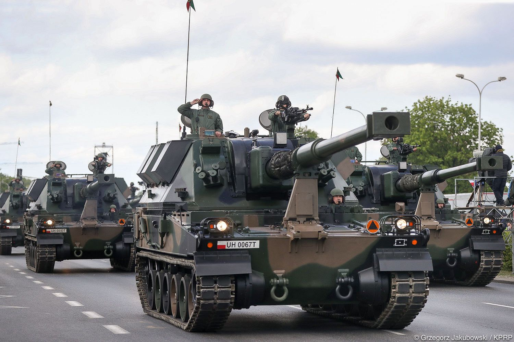
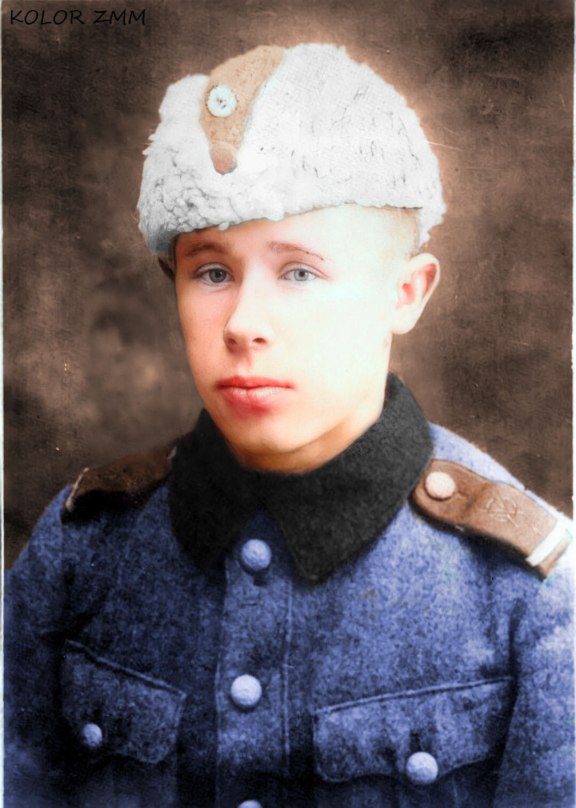
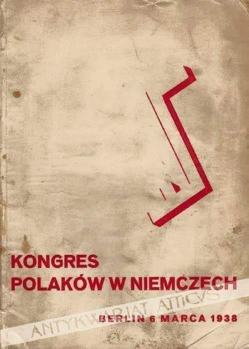
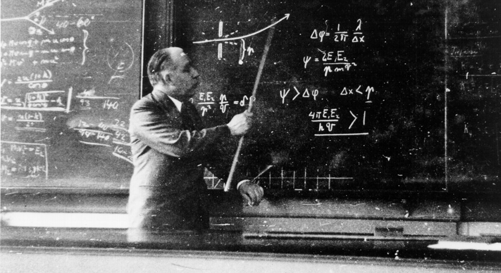
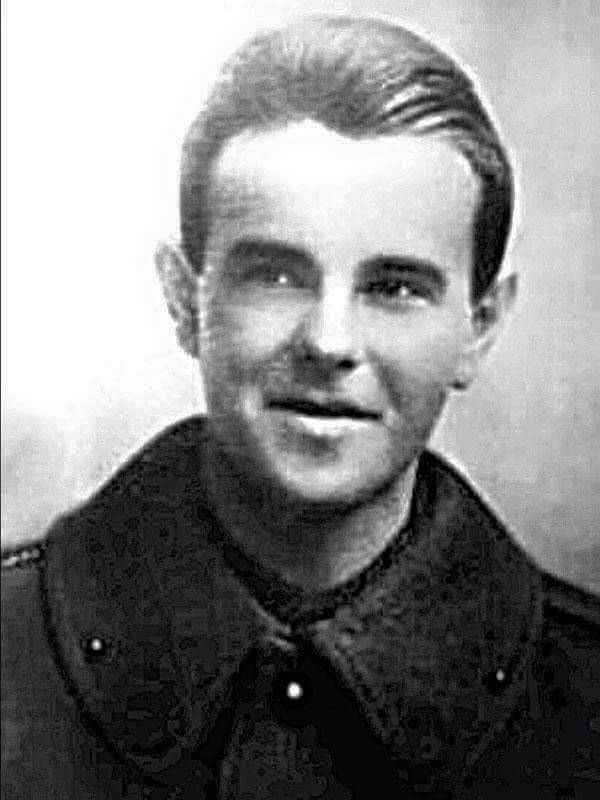
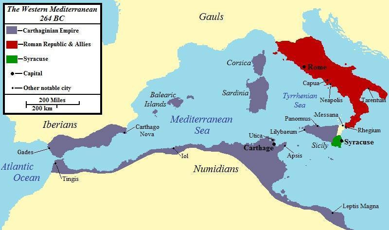
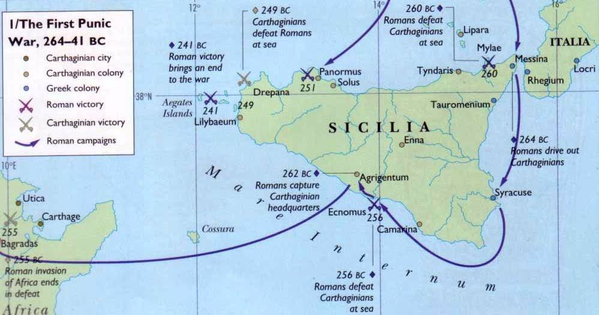

### 2024

> jak kochać, to ideał

---

Victims of the October 7 Hamas attack have brought a lawsuit against Binance under the Anti-Terrorism Act of 1992 and the Justice Against Sponsors of Terrorism Act of 2016.

The Complaint is an interesting and instructive read for anyone engaged in AML/CFT.

<a href="./documents/march/binance.pdf" target="_blank">Binance docs</a>

### 2023

> At the table where it is decided on the defense of the Republic of Poland, we have permanently added a chair for the national armaments industry. Polish state-owned and private companies are beginning to participate in the modernization of the Armed Forces. There is no step back in industry, and the President's plan is foreign armaments expansion. - Jacek Siewiera (Secretary of State, Head of National Security Bureau)

<br><br>

<br><br>

---

<br><br>

---

```
【“#专家”：少喝一杯30元咖啡 为养老准备】
【网民：很多人一天饭钱不到30】
中国养老金融50人论坛秘书长、经济学博士董克用建议年轻人每天少喝一杯咖啡，一天省30元，一个月能省下900元，为养老做准备。这席话被网民批评说，很多人一天的饭钱都不到30!
#砖家
#年轻人少喝咖啡为养老做准备
#30元咖啡
```

<video width="640" height="480" controls>
<source src="./movies/march/kawa.mp4" type="video/mp4">
Your browser does not support the video tag.
</video>

---

### 2022

Anwil SA przygotował nowy cennik swoich nawozów, który ma obowiązywać od 11 marca 2022 r. Cena jest zatrważająca. Tona saletry amonowej kosztuje w nim ok. 6100 zł. Dla porównania w ostatnich dniach tona tego nawozu średnio kosztowała ok. 3 tys. zł, a rok wcześniej 1200 zł.

### 2021

"In 2021, inflation is coming" – this statement is now common knowledge. Everybody knows, that everybody knows, that inflation will rise this year and into the future. As such, what will the market decide is the asset that everybody should buy to protect their portfolios from the ravages of inflation? I came into the meeting with the fund manager determined to find the answer.

### 2008

W Warszawie zmarł 85 - letni Gustaw Holoubek - aktor i reżyser; profesor warszawskiej PWST, członek Polskiej Akademii Nauk; 1970-81 prezes SPATiF-u; 1989-91 senator RP
Jego ojciec był z pochodzenia Czechem, a matka była Polką.
W 1939 na ochotnika zaciągnął się do wojska i uczestniczył w polskiej wojnie obronnej. Dostał się do niewoli. Przebywał w obozach w Magdeburgu i Toruniu. Został zwolniony w 1940, wcześniej w niewoli zachorował na gruźlicę. Do 1945 pracował w krakowskiej gazowni. W 1947 ukończył studia w krakowskim Państwowym Studiu Dramatycznym (przekształconym później w Państwową Wyższą Szkołę Teatralną). W teatrze zadebiutował 1 marca 1947 rolą Charysa w Odysie u Feaków Stefana Flukowskiego w Starym Teatrze w Krakowie. Występował w warszawskich teatrach Nardowym i Dramatycznym. Był dyrektorem Teatru Polskiego. Jego najsłynniejsze role dramatyczne to Król Edyp Sofoklesa, Konrad - Dziady Adama Mickiewicz, Skrzypek - Rzeźnia Sławomira Mrożka, Król Lir - Williama Szekspira. Grał w filmach Pętla, Wspólny pokój, Sanatorium pod klepsydrą, serialach Królewskie sny i w spektaklach w Teatrze Telewizji. Jego Wielka Improwizacja w filmie Lawa do dziś robi ogromne wrażenia. Był dwukrotnym laureatem nagrody państwowej (1966 i 1978). Prywatnie był przez 35 lat żonaty z aktorką Magdaleną Zawadzką, z którą doczekał się syna Jana.

<br><br>

### 1940

Simo Häyhä 🇫🇮 (1905-2002), fiński strzelec wyborowy

Na zdjęciu młody Simo Häyhä ps "Biała śmierć" najskuteczniejszy snajper w historii wojen. Podczas wojny zimowej (1939-1940) zabił 705 żołnierzy Armii Czerwonej. Używał fińskiej wersji karabinu Mosin M28 z muszką i szczerbinką zamiast celownika optycznego, co uzasadniał tym, że przy celowniku optycznym snajper musi podnieść głowę wyżej co zwiększa ryzyko wykrycia, a poza tym nie ma możliwości odbicia się światła od soczewek celownika.
6 marca 1940 roku został postrzelony w twarz, pocisk przeszył jego szczękę na wylot. Zanim stracił przytomność , zdążył zabić jeszcze 
radzieckiego żołnierza, który go postrzelił. Jeden z kolegów opowiadał że po postrzale "brakowało mu połowy twarzy".
Wkrótce po wojnie awansowano go z rangi kaprala do stopnia podporucznika.
Nikt inny w historii Finlandii nie został awansowany tak wysoko w tak krótkim czasie.

<br><br>

### 1938

W Theater des Volkes w Berlinie odbył się Kongres Polaków w Niemczech. Był on odpowiedzią na pogarszające się warunki życia mniejszości polskiej w Niemczech po dojściu Hitlera do władzy oraz na szykany stosowane przez niemieckie władze. W zjeździe uczestniczyło 5 tysięcy delegatów. Była to największa manifestacja polskiej jedności narodowej na terenie Niemiec. Ogłoszono wtedy tzw " Pięć prawd Polaków",które brzmiały:
1) Jesteśmy Polakami.
2)Wiara ojców naszych jest wiarą naszych dzieci.
3)Polak Polakowi bratem.
4)Co dzień Polak narodowi służy.
5)Polska Matką naszą- nie wolno mówić o Matce źle.

<br><br>

### 1913

Tę datę postawił Niels Bohr na liście, wysłanym do swojego mentora, Ernesta Rutherforda. W liście opisał swój słynny model budowy atomu – z jądrem w środku, wokół którego krążą elektrony.
Była to modyfikacja modelu Rutherforda, do której Bohr dodał dwa postulaty, zupełnie niezgodne z ówczesną klasyczną elektrodynamiką. Zgodnie z jednym z nich elektron wokół jądra nie może poruszać się po dowolnej orbicie, lecz tylko po niektórych. Ponadto elektron poruszając się po danej orbicie nie emituje ani nie pochłania energii. Elektron emituje foton, jeżeli spada z orbity wyższej na niższą, a pochłania foton, jeżeli przechodzi z orbity niższej na wyższą. Model Bohra po kilkunastu latach został uznany za przybliżenie rzeczywistości. Obecne teorie są daleko bardziej skomplikowane i znacznie trudniejsze do objaśnienia.

<br><br>

### 1898

Na ulicach Poznania pojawił się pierwszy tramwaj elektryczny.
Pierwsza linia tramwajowa połączyła ze stolicą Wielkopolski wówczas jeszcze podpoznańską wieś Łazarz. Wcześniej mieszkańcy tej wsi i Poznania mogli korzystać z omnibusów konnych.
Budowa sieci trakcyjnej rozpoczęła się 25 pazdziernika 1897 roku. Jej wykonawcą była berlińska firma Elektritäts Gesellschaft. Budowa linii tramwajowej była ogromnym wyzwaniem, ponieważ oprócz nielicznych przydomowych elektrowni nie istniała żadna główna siłownia dostarczająca prąd do Poznania. Takową wybudowano przy ulicy Grobla. Sami mieszkańcy również nie ułatwiali powstania tej inwestycji. Głośno wyrażali swoje obawy przed porażeniem prądem i obawami o zdrowie.
W pierwszych latach po zelektryfikowaniu
tramwajów pasażerowie zaczęli jeździć
wagonami Carl Weyer (zdjęcie) wyprodukowanymi w Dusseldorfie. Służyły one potem w przedsiębiorstwie jeszcze przez pół wieku.

<br><br>

### 264

I wojna punicka
Wojny punickie to seria trzech konfliktów pomiędzy Rzymem i Kartaginą. Toczyły się one z przerwami w latach 264 – 146 p.n.e., kończąc się ostatecznym zwycięstwem Rzymu i doszczętnym zniszczeniem Kartaginy. Nazwa „wojny punickie” pochodzi od łacińskiego słowa Punici (Poenici), oznaczającego Kartagińczyków i wskazującego jednocześnie na ich fenickie pochodzenie.
Początkowo stosunki pomiędzy Rzymem a Kartaginą układały się zgodnie, ponieważ obydwa państwa nie wchodziły sobie w drogę; Kartagina panowała na Morzu Śródziemnym, natomiast Rzym dopiero powoli zdobywał sobie dominującą pozycję na półwyspie Apenińskim. Kilkakrotnie zawierane traktaty wyznaczały strefy wpływów obydwu państw zarówno na morzu, jak i na lądzie (np. dzięki kartagińskiej przewadze na morzu statki rzymskie mogły się zatrzymywać w portach fenickich tylko w przypadku burzy lub konieczności uzupełnienia zapasów, nie mogły natomiast handlować).
Sytuacja uległa zmianie w pierwszej połowie III w. p.n.e., kiedy to Rzym podporządkował sobie niemal cały obszar półwyspu Apenińskiego, pokonując wszystkich rywali, stojących mu na drodze do osiągnięcia tego celu. Najpierw w serii trzech wojen samnickich ujarzmieni zostali Samnici, którzy od dawna sprzeciwiali się Rzymowi Następnie pod władzę Rzymu dostały się miasta Wielkiej Grecji, czyli południowej części półwyspu. Nie pomogła im nawet wyprawa słynnego króla Epiru, Pyrrusa, który nie był w stanie zmienić ich losu mimo kilkakrotnego pokonania wojsk rzymskich. W strefie zainteresowań Rzymu pojawiła się teraz Sycylia, znajdująca się częściowo pod kontrolą Kartaginy. Doszło do konfliktu interesów pomiędzy dwoma największymi potęgami w zachodniej części Morza Śródziemnego.
Pierwsza wojna punicka (264 - 241 p.n.e.):
W przededniu rozpoczęcia konfliktu Kartagina, położona na wybrzeżu dzisiejszej Tunezji, założona przez Fenicjan w połowie IX wieku p.n.e. była potężnym państwem – miastem, posiadającym ogromną marynarkę. Stworzone przez Kartaginę imperium handlowe przynosiło jej ogromne zyski. Jedynym miastem w zachodniej części Morza Śródziemnego, które mogło z Kartaginą rywalizować pod względem potęgi, bogactwa i zaludnienia, był właśnie Rzym. Z kolei jeśli chodzi o wojska obydwu walczących stron, to jak wcześniej powiedziano, Kartagina posiadała największą w tym czasie w całym świecie antycznym flotę, natomiast armia lądowa była nieliczna, i składała się głównie z najemników. Rzym z racji swojej ekspansji na terenach półwyspu Apenińskiego posiadał liczną i silną armię, złożoną w całości z rzymskich obywateli; brak było natomiast marynarki, jednak to miało się z czasem zmienić.
Przyczyny pierwszej wojny punickiej sięgają panowania Agatoklesa, władcy Syrakuz, który wynajął grupę najemników z Kampanii, Mamertynów (czyli „synów Marsa”). Kiedy Agatokles zmarł, zajęli oni w 288 roku miasto Messanę (dzisiejszą Messynę), położoną na północnym wschodzie Sycylii, mordując wszystkich mężczyzn. W tym samym czasie inna grupa najemników zajęła Rhegium (dzisiejsze Reggio), położone po drugiej stronie cieśniny. Taka sytuacja trwała przez kilkanaście lat, aż wreszcie w 270 roku Rzym odzyskał kontrolę nad Rhegium. Z kolei na Sycylii Mamertynowie weszli w konflikt z Hieronem II, tyranem Syrakuz, który pokonał ich w bitwie, a następnie obległ Messanę. Wtedy najemnicy poprosili o pomoc Kartagińczyków. Ci wymogli na Hieronie, by odstąpił od oblężenia, po czym wprowadzili swój garnizon do Messany. Część Mamertynów zwróciła się jednak z prośbą o przymierze do Rzymu. Był to dość trudny orzech do zgryzienia dla Rzymu – z jednej strony bowiem była to szansa na ograniczenie wpływów Kartaginy na Sycylii, ale z drugiej strony bardzo silne było starorzymskie poczucie sprawiedliwości, i związana z tym niechęć do wchodzenia w sojusz z żołnierzami, którzy podstępnie wydarli miasto z rąk prawowitych mieszkańców. Dodatkowym powodem, dla którego Rzymianie się wahali, był fakt, że zawierając taki sojusz, dopuściliby się niekonsekwencji – najpierw bowiem surowo ukarali najemników w Rhegium, a potem zawarli układ z Messaną. Ostatecznie przeważyła opinia, że nie można dopuścić do tego, by Kartagina zdobyła sobie zbyt silną pozycję na Sycylii. Rzym podpisał sojusz z Mamertynami i zdecydował wysłać swoje siły na Sycylię. Tak rozpoczął się konflikt.
W 264 roku dwa legiony pod dowództwem Appiusza Klaudiusza Kaudeksa zostały wysłane na wyspę. Był to pierwszy przypadek działania armii rzymskiej poza terenami półwyspu Apenińskiego. Tymczasem Punijczycy zawarli przymierze z Hieronem, który ponownie obległ Messanę. Rzymianie pokonali jednak wojsko Syrakuz, po czym sami oblegli Hierona, który w 263 roku przeszedł na stronę Rzymu.
Po rozwiązaniu sprawy Syrakuz i pozbawieniu Kartaginy sojusznika, Rzymianie wyruszyli przeciwko Agrygentowi, który zdobyli w 261 roku. Mogło się wydawać, że Rzym uzyska dzięki temu przewagę, ale Punijczycy dzięki swojej silnej flocie byli w stanie przeprawić posiłki z Afryki i umocnić Lilybaeum i Panormus (dzisiejsze Palermo) na zachodnim wybrzeżu Sycylii. Rzymianie zdali sobie jednak sprawę z tego, że jeśli nie będą mieli marynarki, to takie sytuacje będą się powtarzać. Dlatego też wkrótce po zdobyciu Agrygentu rozpoczęła się budowa pierwszej floty w dziejach Rzymu, a okręty budowano w oparciu o zdobyte statki kartagińskie, lub z wykorzystaniem technologii używanej w Syrakuzach. Statki te miały dodatkowe urządzenie – ruchomy pomost abordażowy zwany corvus, czyli „kruk”. Był on zakończony kolcem, który wbijał się głęboko w pokład zaatakowanej jednostki. W ten sposób pomost stawał się bardziej stabilny, co umożliwiało legionistom przejście ze statku na statek. Dzięki „krukowi” możliwe było wykorzystanie przewagi wyszkolenia armii rzymskiej w bitwie morskiej.
Nowa broń wykazała swoją skuteczność w bitwie morskiej pod Mylae, którą Rzymianie wygrali. Wprowadzenie „kruka” było dużym zaskoczeniem dla Kartagińczyków, którzy przez to musieli zmienić swoją taktykę walki na morzu. W miarę nabierania przez Rzymian doświadczenia w wojnie morskiej użycie „kruka” było stopniowo ograniczane; nie należy zapominać o niekorzystnym wpływie pomostu na stateczność okrętów.
Jednak sukces na morzu nie wpłynął specjalnie na koleje wojny na lądzie. Ponieważ walki na Sycylii toczyły się ze zmiennym szczęściem, w 256 roku w Rzymie podjęto decyzję o przeniesieniu działań do Afryki. Zbudowano wielką flotę, złożoną ze statków transportowych oraz wojennych. Kartagina próbowała interweniować, lecz znów została pokonana w bitwie pod przylądkiem Eknomus. Dzięki temu armia rzymska pod dowództwem Marka Atilusza Regulusa bez problemu wylądowała na afrykańskim wybrzeżu. Z początku Regulus opanował dużą część kartagińskich posiadłości, a na jego stronę z obawy przed zniszczeniem przeszły niektóre miasta punickie. Po pokonaniu armii kartagińskiej w bitwie pod Adys na Punijczyków padł strach i poprosili o pokój. Regulus, pewien rychłego zwycięstwa, narzucił Kartaginie tak ciężkie warunki pokoju, że negocjacje zostały zerwane. Kartagina zdecydowała się walczyć dalej. Utworzono nową armię, której wodzem naczelnym został ustanowiony spartański kondotier Ksantippos. Zreorganizował on armię punicką na wzór grecki, a następnie pokonał armię Regulusa w bitwie pod Tunisem. Sam Regulus dostał się do niewoli. Nie był to jednak koniec pecha Rzymian, bowiem powracająca z Afryki z resztkami armii flota rzymska została zniszczona przez burzę. Uważa się, że była to największa katastrofa morska w dziejach – zniszczeniu uległo wtedy według różnych źródeł od 364 do 464 statków, a śmierć mogło ponieść nawet 100 tysięcy Rzymian.
Nadarzającą się okazję wykorzystali Kartagińczycy, którzy odbili Agrygent, ale nie wierząc w możliwość jego utrzymania, spalili to miasto. Tym samym działania wojenne na lądzie znów przeniosły się na teren Sycylii. Rzymianie w 254 roku zdobyli Panormus, a po zbudowaniu nowej floty na miejsce tej straconej podczas sztormu, rozpoczęli też ataki na Lilybaeum, jednak bez większych efektów. Podjęli też serię wypadów na wybrzeża afrykańskie, lecz w 253 roku powtórzyła się historia sprzed dwóch lat – flota powracająca do Italii została zniszczona przez sztorm, w którym zatonęło 150 statków.
Zdecydowanie lepiej powodziło się Rzymianom na lądzie. Do końca 251 roku opanowali północną część Sycylii i większość centralnej części wyspy. Następnie skierowali się przeciwko Lilybaeum, tym samym dając do zrozumienia Kartagińczykom, że chcą opanować całość wyspy. Ta wyprawa była jednak nieudana, a co więcej, w 249 roku flota rzymska poniosła klęskę w bitwie pod Drepanum, a dodatkowe straty znów spowodował sztorm. Trudno więc się dziwić, że w Rzymie pomysły budowania nowych, kosztownych flot, nie spotykały się z ciepłym przyjęciem.
W tym samym roku na Sycylię przybył kartagiński wódz Hamilkar Barkas, ojciec słynnego Hannibala. Spowodowało to zmianę charakteru działań wojennych na bardziej partyzancki, bez większych bitew i oblężeń; można powiedzieć, że doszło wtedy do impasu, ponieważ żadna ze stron nie była w stanie przechylić szali zwycięstwa na swoją stronę. Na rozkaz Hamilkara flota kartagińska przeprowadziła serię morskich rajdów na wybrzeża Italii.
W Kartaginie do władzy doszła tymczasem grupa sprzeciwiająca się dalszemu prowadzeniu wojny, na której czele stał arystokrata Hannon Wielki. Ze względu na brak jakiegokolwiek zdecydowanego przeciwdziałania ze strony Rzymu wobec rajdów punickiej floty uznał on, że wojna ma się już ku końcowi. Aby więc nie tracić niepotrzebnie pieniędzy, w 244 roku nakazał demobilizację większej części marynarki. Jak się okazało już niedługo, był to duży błąd. Rzymianie zdobyli się na jeszcze jeden zbiorowy wysiłek i zbudowali kolejną flotę. Wobec impasu na Sycylii wojnę można było rozstrzygnąć tylko na morzu – w przypadku zwycięstwa Rzymian ich flota mogła odciąć dostawy zaopatrzenia na wyspę, co pozwoliłoby na jej całkowite opanowanie, a ich porażka oznaczała konieczność dalszego prowadzenia wojny w niesprzyjających warunkach, lub zaakceptowanie dotychczasowego status quo.
Taka rozstrzygająca bitwa morska została stoczona w marcu 241 roku pod Wyspami Egadzkimi, gdzie pośpiesznie zbudowana i obsadzona niepełnymi załogami flota kartagińska została zniszczona przez Rzymian dowodzonych przez Gajusza Lutacjusza Katullusa. Ponieważ Kartaginy nie było już stać na zbudowanie nowych statków, Rzymianie z łatwością opanowali Drepanum i Lilybaeum, odcinając jednocześnie Hamilkara od posiłków. Kartagina musiała poprosić o pokój…
W wyniku porażki pod wyspami Egadzkimi Kartagina nie miała zbyt silnej pozycji negocjacyjnej i była zmuszona przyjąć takie warunki, jakie podyktowali jej zwycięscy Rzymianie. Pierwotna wersja układu pokojowego została odrzucona przez lud rzymski, który domagał się znacznego zaostrzenia warunków. Ostateczne ustalenia zawarte w układzie pokojowym Lutacjusza są przedstawione poniżej.
Na mocy tego układu Kartagina miała:
- ewakuować swoje wojska z Sycylii i wysp na zachód od niej (Egady);
- zwrócić swoich jeńców wojennych bez jakiegokolwiek okupu; jeśli chciałaby wykupić jeńców posiadanych przez Rzymian, musi zapłacić sowity okup;
- zakaz atakowania Syrakuz oraz sojuszników tego miasta;
- oddać Rzymowi wyspy leżące na północ od Sycylii;
- wycofać się z wysp leżących między Sycylią i Afryką;
- zapłacić trybut w wysokości 3200 talentów w ciągu 10 lat, z czego 1000 talentów natychmiast.
Dalsze warunki szczegółowo określały stosunki pomiędzy Rzymem a Kartaginą; jednym z postanowień było, że sprzymierzeńcy obydwu stron nie mogą być atakowani przez państwa zawierające traktat. Jak się okazało w przyszłości, ten zapis stał się przyczyną drugiej wojny punickiej.
Jednym ze skutków konfliktu trwającego 23 lata było uzyskanie przez Rzym dominacji na Morzu Śródziemnym, bowiem Kartagina, zmuszona do spłacenia ogromnego trybutu, nie mogła sobie pozwolić na odtworzenie silnej marynarki. Dzięki uczestnictwu dużej części społeczeństwa w wysiłku wojennym Rzym utworzył tak potężną flotę, że możliwa była jednocześnie ochrona wybrzeży Italii, szlaków handlowych, oraz ataki na wybrzeża wrogich państw. Koniec pierwszej wojny punickiej oznaczał jednocześnie początek zdecydowanej ekspansji Rzymu poza półwyspem Apenińskim.
Po wielu latach wojny obydwa państwa były wyczerpane, zarówno finansowo, jak i demograficznie. Ilość strat ludzkich nie jest możliwa do dokładnego określenia, jednak były one bez wątpienia znaczne (Rzymianie stracili wielu ludzi wskutek katastrof morskich, tracąc całe floty). Polibiusz, antyczny historyk, oceniał, że konflikt ten spowodował więcej ofiar, niż bitwy Aleksandra Wielkiego.

<br><br>

<br><br>

---

<a href="https://github.com/TomaszWaszczyk/historia.waszczyk.com/edit/master/src/content/march-6.md" target="_blank">Edytuj tę stronę dzieląc się własnymi notatkami!</a>
