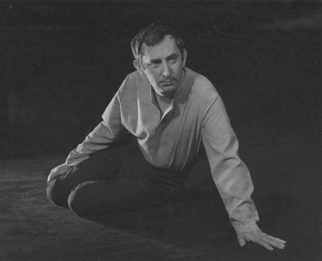

### 2008

W Warszawie zmarł 85 - letni Gustaw Holoubek - aktor i reżyser; profesor warszawskiej PWST, członek Polskiej Akademii Nauk; 1970-81 prezes SPATiF-u; 1989-91 senator RP
Jego ojciec był z pochodzenia Czechem, a matka była Polką.
W 1939 na ochotnika zaciągnął się do wojska i uczestniczył w polskiej wojnie obronnej. Dostał się do niewoli. Przebywał w obozach w Magdeburgu i Toruniu. Został zwolniony w 1940, wcześniej w niewoli zachorował na gruźlicę. Do 1945 pracował w krakowskiej gazowni. W 1947 ukończył studia w krakowskim Państwowym Studiu Dramatycznym (przekształconym później w Państwową Wyższą Szkołę Teatralną). W teatrze zadebiutował 1 marca 1947 rolą Charysa w Odysie u Feaków Stefana Flukowskiego w Starym Teatrze w Krakowie. Występował w warszawskich teatrach Nardowym i Dramatycznym. Był dyrektorem Teatru Polskiego. Jego najsłynniejsze role dramatyczne to Król Edyp Sofoklesa, Konrad - Dziady Adama Mickiewicz, Skrzypek - Rzeźnia Sławomira Mrożka, Król Lir - Williama Szekspira. Grał w filmach Pętla, Wspólny pokój, Sanatorium pod klepsydrą, serialach Królewskie sny i w spektaklach w Teatrze Telewizji. Jego Wielka Improwizacja w filmie Lawa do dziś robi ogromne wrażenia. Był dwukrotnym laureatem nagrody państwowej (1966 i 1978). Prywatnie był przez 35 lat żonaty z aktorką Magdaleną Zawadzką, z którą doczekał się syna Jana.

  

### 1940

Simo Häyhä 🇫🇮 (1905-2002), fiński strzelec wyborowy

Na zdjęciu młody Simo Häyhä ps "Biała śmierć" najskuteczniejszy snajper w historii wojen. Podczas wojny zimowej (1939-1940) zabił 705 żołnierzy Armii Czerwonej. Używał fińskiej wersji karabinu Mosin M28 z muszką i szczerbinką zamiast celownika optycznego, co uzasadniał tym, że przy celowniku optycznym snajper musi podnieść głowę wyżej co zwiększa ryzyko wykrycia, a poza tym nie ma możliwości odbicia się światła od soczewek celownika.
6 marca 1940 roku został postrzelony w twarz, pocisk przeszył jego szczękę na wylot. Zanim stracił przytomność , zdążył zabić jeszcze 
radzieckiego żołnierza, który go postrzelił. Jeden z kolegów opowiadał że po postrzale "brakowało mu połowy twarzy".
Wkrótce po wojnie awansowano go z rangi kaprala do stopnia podporucznika.
Nikt inny w historii Finlandii nie został awansowany tak wysoko w tak krótkim czasie.

  

### 1938

W Theater des Volkes w Berlinie odbył się Kongres Polaków w Niemczech. Był on odpowiedzią na pogarszające się warunki życia mniejszości polskiej w Niemczech po dojściu Hitlera do władzy oraz na szykany stosowane przez niemieckie władze. W zjeździe uczestniczyło 5 tysięcy delegatów. Była to największa manifestacja polskiej jedności narodowej na terenie Niemiec. Ogłoszono wtedy tzw " Pięć prawd Polaków",które brzmiały:
1) Jesteśmy Polakami.
2)Wiara ojców naszych jest wiarą naszych dzieci.
3)Polak Polakowi bratem.
4)Co dzień Polak narodowi służy.
5)Polska Matką naszą- nie wolno mówić o Matce źle.

  

### 1898

Na ulicach Poznania pojawił się pierwszy tramwaj elektryczny.
Pierwsza linia tramwajowa połączyła ze stolicą Wielkopolski wówczas jeszcze podpoznańską wieś Łazarz. Wcześniej mieszkańcy tej wsi i Poznania mogli korzystać z omnibusów konnych.
Budowa sieci trakcyjnej rozpoczęła się 25 pazdziernika 1897 roku. Jej wykonawcą była berlińska firma Elektritäts Gesellschaft. Budowa linii tramwajowej była ogromnym wyzwaniem, ponieważ oprócz nielicznych przydomowych elektrowni nie istniała żadna główna siłownia dostarczająca prąd do Poznania. Takową wybudowano przy ulicy Grobla. Sami mieszkańcy również nie ułatwiali powstania tej inwestycji. Głośno wyrażali swoje obawy przed porażeniem prądem i obawami o zdrowie.
W pierwszych latach po zelektryfikowaniu
tramwajów pasażerowie zaczęli jeździć
wagonami Carl Weyer (zdjęcie) wyprodukowanymi w Dusseldorfie. Służyły one potem w przedsiębiorstwie jeszcze przez pół wieku.

  

---

<a href="https://github.com/TomaszWaszczyk/historia.waszczyk.com/edit/master/src/content/march-6.md" target="_blank">Edytuj tę stronę dzieląc się własnymi notatkami!</a>
