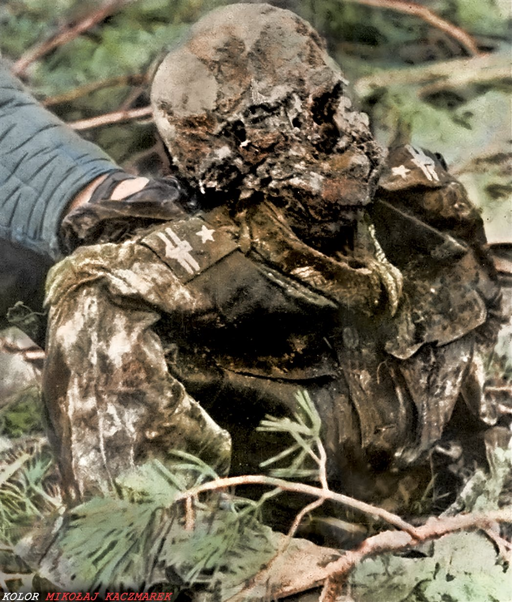

### 2023

  

  

---

Bill Gates Dismisses the COVID Lab Leak Theory & Warns of Coming 'Unnatural Epidemics'

"The evidence is very clear that it's naturally caused – it's a bat virus. We're going to have natural epidemics and sadly we may have some unnatural epidemics in the future..."

<video width="640" height="480" controls>
<source src="./movies/march/next_pandemy.mp4" type="video/mp4">
Your browser does not support the video tag.
</video>

---

### 2022

  

  

---

The Russian Central Bank has decided not to pay interest on bonds worth US $ 29 billion (default). After a few days of war, Russia became economically bankrupt. The financial markets will never forget it. Even if Putin withdraws its troops today - the markets will be demanding enormous risk premiums for many, many years. The price that every Russian will pay for the rest of his life.

  

---

### 2021

> Rozpuszczanie własności

### 2013

ukazało się polskie wydanie książki ,,Ocalały. Auschwitz, marsz śmierci i walka o wolność'' - autorstwa Sama Pivnika.

Sam Pivnik ocalał ze świata, którego już nie ma. Mógł zginąć kilkanaście razy, ale dzięki szczęściu, sile i determinacji przeżył i mógł opowiedzieć swoją nadzwyczajną historię.
W dniu jego trzynastych urodzin, 1 września 1939 roku, nazistowskie Niemcy najechały na Polskę, a wraz z tym wydarzeniem życie Pivnika zmieniło się nieodwracalnie. Przeżył będzińskie getto, a potem przez sześć miesięcy pracował jako więzień na osławionej rampie w obozie Auschwitz-Birkenau, gdzie dokonywano selekcji ludzi z kolejnych transportów, kierując niektórych do obozu, a innych wprost do komór gazowych.
Po tych traumatycznych doświadczeniach trafił do obozu przy kopalni Fürstengrube (dzisiaj kopalnia „Wesoła”). Przeżył morderczy „marsz śmierci” po obozach w głębi upadającej III Rzeszy i jest jednym z niewielu, którzy wyszli cało z ataku samolotów RAF na statek więzienny Cap Arcona, o którym sądzono mylnie, że przewozi uciekających esesmanów. W końcu dotarł do Londynu.
Teraz Sam Pivnik, już po osiemdziesiątce, opowiada, jak wyratował się z najbardziej niebezpiecznych i przerażających opresji wojennych.

Poniżej fragment zaczerpnięty z tejże książki, opisujący egzekucję niedoszłych uciekinierów z obozu pracy przy kopalni Furstengrube:
,,Przyszła niedziela. Chrześcijański szabat. (...) Wczesnym popołudniem kazano nam ustawić się na placu, jak do apelu. Szubienica pięła się w szare niebo(...) Przed szubienicą stał rząd krzeseł. Cyrk - przedstawienie urządzone ku uciesze esesmanów. (...) Od strony bramy odezwał się warkot silników i nadjechał konwój samochodów SS - z chorągiewkami ze swastyką. Mężczyźni, którzy z nich wysiedli, nosili srebrne epolety wyższych oficerów z Auschwitz. Zaczęło się długie salutowanie i strzelanie obcasami w pruskim stylu (...) W roli perfekcyjnego gospodarza występował Schmidt. Uśmiechał się i kiwał głową, jakby prowadził jakieś garden party. Znałem tych niedoszłych uciekinierów. Trzech z nich przyjechało wraz ze mną z Auschwitz. Patrzyłem, jak wyprowadzają ich z wartowni; mieli związane ręce i puste spojrzenia. Był wśród nich Leon z Francji; beztroski Blockaltester Maurice z Belgii i mój kolega Natan, przedwojenny gangster z Łodzi. Był jeszcze czwarty więzień, którego imienia już nie pamiętam (...) Teraz cała czwórka wyglądała na muzułmanów (...) Przez ostatnie dni przeszli przez istne piekło bicia. Z poprzecznej belki zwisały cztery stryczki z szorstkiego konopnego sznura. Pod każdym stało zwykłe, drewniane krzesło, a z boku stała drabina. Schmidt i jego goście zajęli miejsca. (...) Prowadzący show - Unterscharfuhrer Anton Lukoschek bez wątpienia chciał zrobić wrażenie na swych przełożonych. Stanął przed nami z jedną ręką założoną za plecy i drugą wyciągniętą przed siebie, z wycelowanym palcem wskazującym. Powiedział, że potrzebuje pięciu z nas. Obrzucił nas morderczym spojrzeniem i wyliczał szczekliwie. W końcu palec wskazał na mnie. Spojrzeliśmy po sobie. Wszyscy byliśmy jeszcze nastolatkami. Wszyscy się znaliśmy. Wiedzieliśmy na czym polegało życie w Fürstengrube.
A teraz mieliśmy się stać ,,plutonem egzekucyjnym'' - niczym jakaś Einsatzgruppen. Nie mieliśmy na to najmniejszej ochoty, najmniejszej motywacji - i żadnej alternatywy. - Ty - powiedział Lukoschek do jednego z nas - założysz im pętle na szyje. A wy (...) na mój rozkaz wykopiecie spod nich te krzesła. Esesmani postawili skazańców na krzesłach. Lukoschek wskazał chłopakowi, którego wybrał, drabinę. - Właź na górę i załóż im stryczki. Reszta ma stanąć przed krzesłami. - Zrobiłem, jak mi kazano. Stanąłem przed Mauric'em, tym Belgiem. Nie mogłem na niego patrzeć. Przeniosłem wzrok na Leona, stojącego na lewo, i obserwowałem pętlę zaciśniętą się na jego szyi. W straszliwej ciszy tych sekund słyszałem, jak łapczywie łapie powietrze, desperacko walczy o każdy oddech. Kiedy Maurice załkał cicho, wbiłem wzrok w ziemię, a potem spojrzałem na krzesło - patrzyłem na wszystko tylko nie na człowieka, którego za chwilę miałem zamordować. Jeden ze skazańców wzniósł jakiś polski okrzyk wojenny (...) Widziałem jak Lukoschek czeka na na sygnal od Schmidta. Wśród widzów nie było żadnych rozmów, żadnej reakcji. - Dobra. - szczeknął Lukoschek do chłopaka stojącego przed Leonem. -Ty pierwszy! Widziałem jak noga tego chłopaka unosi się i uderza w krzesło, ale to ledwie się zachwiało. Unterscharfuhrer pouczył go , że musi to zrobić mocniej, i chłopak kopnął ponownie, ale znów za słabo - stopy Leona wciąż tkwiły na krześle. Słyszałem jak wstrzymal oddech z przerażenia, ale tym razem chłopak z całych sił przyłożył w nogi krzesła. Lina wydała lekki trzask i napięła się, a krzesło spadło z rusztowania. Stopy Leona zatrzepotały jeszcze w desperackiej próbie znalezienia podparcia. Szczękę miał zaciśniętą, a wybałuszone oczy patrzyły dziko gdzieś w dal. Trwały to sekundy, ale mnie wydawało się, że minęły lata. Wtedy Lukoschek wycelował palcem we mnie (...) spojrzałem w górę. Bóg wie, dlaczego to zrobiłem, ale spojrzałem prosto w twarz Maurice'a. Po policzkach spływały mu łzy. (...) Usłyszałem jak mówi: ,,Długiego życia...'' Inni dostrzegli w tym ostatni dumny gest odważnego człowieka, ale ja usłyszałem szept skierowany tylko do mnie - do głupiego, naiwnego szczeniaka, któremu kazano skrócić czyjeś życie. Schyliłem się i wyszarpnąłem krzesło spod jego nóg. Stopy umierającego tańczyły w powietrzu, raz po raz kopiąc mnie w ramię. Potem przyszła kolej na Natana i tego mężczyznę od gołębi. Z nimi poszło gorzej. (...) Natan i człowiek od kurczaków dusili się długie minuty. Kiedy widzowie z pierwszego rzędu podnieśli się, nie zwracając uwagi na wiszące ciała, nam kazano wrócić do szeregu. Tymczasem goście przeszli do budynku administracyjnego, gawędząc o tym i owym. Zapewne spodziewali się sznapsa - w końcu tłukli się taki kawał drogi z Auschwitz. Zasłużyli na kielicha. Odwróciliśmy się od ludzi, których właśnie zabiliśmy i wróciliśmy do naszych baraków(...) twarz Maurice'a do dziś pojawia się w moich snach. ,,Długiego życia...''.
(źródło cytatu: Sam Pivnik, Ocalały, 176-179 s.)

  

### 1985

Umiera Arkady Fiedler, autor książki Dywizjon 303

### 1984 - Founded BlackBerry, Waterloo, Canada

BlackBerry Limited is a Canadian multinational company specialising in enterprise software and the Internet of things. Originally known as Research In Motion, it is best known to the general public as the former developer of the BlackBerry brand of smartphones, and tablets. Wikipedia

### 1949

Został zamordowany Hieronim Dekutowski: https://pl.wikipedia.org/wiki/Hieronim_Dekutowski

---

w Warszawie został zamordowany major Wojska Polskiego Hieronim Dekutowski ps. Zapora. Żołnierz Polskich Sił Zbrojnych na Zachodzie, cichociemny, dowódca oddziałów partyzanckich Armii Krajowej (AK), Delegatury Sił Zbrojnych na Kraj (DZS) oraz Zrzeszenia Wolność i Niezawisłość (WiN). Żołnierz podziemia
antykomunistycznego. Odznaczony: Krzyżem Srebrnym Orderu Wojennego Virtuti Militari, Krzyżem Wielkim Orderu Odrodzenia Polski
(Pośmiertnie), Krzyżem Walecznych. Wpadł 16 września 1947 roku zadenuncjowany przez swojego zastępcę Stanisława Wnuka. Od 1 czerwca 1948 roku był brutalnie przesłuchiwany. 3 listopada tego samego roku jego los podzieliło 6 jego współpracowników.
15 listopada sędzia Józef Badecki wydał na niego 7 krotny wyrok śmierci. Matka Dekutowskiego bezskutecznie interweniowała u samego Bieruta.
Wyrok wykonano 7 marca 1949 roku oprócz Dekutowskiego stracono również sześciu jego podkomendnych. W chwili śmierci, pomimo tego, że miał tylko 30 lat, wyglądał jak starzec z siwymi włosami, wybitymi zębami, połamanymi rękami, nosem i żebrami oraz zerwanymi paznokciami. Jego ostatnie słowa
brzmiały: „Przyjdzie zwycięstwo! Jeszcze
Polska nie zginęła!” Miejsce pochówku Zapory długo nie było znane lecz kilkuletnie poszukiwania zostały zwieńczone sukcesem w 2012 roku. Szczątki Zapory znaleziono podczas prac ekshumacyjnych na terenie Kwatery na Łączce, na warszawskich Powązkach.

  

### 1945

W Milanówku został aresztowany przez NKWD generał August Fieldorf "Nil". Aresztowanie było dziełem przypadku, a sam aresztowany posiadał wtedy nazwisko Walenty Gdanicki, co sprawiło, że Rosjanie nawet nie zdawali sobie sprawy kto trafił w ich ręce. Fieldorf trafił do jednego z obozów pracy na Uralu, gdzie przebywał do roku 1947. Po powrocie ze zesłania osiedlił się w Białej Podlaskiej.
Poniżej przedstawiam fragment wspomnień Janiny Fieldorf- wdowy po generale:
" Po dwu i pół letnim pobycie, Emil, ciężko chory na dystrofię, wraca do Warszawy. 26 października 1947 roku wysiada opuchnięty, z gorączką na dworcu w Warszawie. Nie wie do kogo się udać, gdzie jest jego rodzina. I oto na szczęście spotyka swojego byłego podoficera z Trok. Prawie omdlałego ten zacny człowiek zabiera do siebie, najtroskliwiej się nim opiekuje i leczy. Emil bowiem miał zapalenie płuc. Dzięki tej troskliwej pielęgnacji przychodzi do zdrowia i udaje się do Krakowa".

  

### 1944

1944 w Warszawie, Niemcy wraz z funkcjonariuszami polskiej granatowej policji odkryli prawdopodobnie największą żydowską kryjówkę po tzw. "aryjskiej stronie” okupowanej Warszawy, czyli Bunkier ,,Krysia'' przy ulicy Grójeckiej 77, w którym rodzina Wolskich - miejscowych ogrodników ukrywała przez 2 lata około 40 żydowskich uciekinierów z warszawskiego getta, wśród których był m.in. twórca tajnego archiwum warszawskiego getta doktor Emanuel Ringelblum wraz z rodziną. Na skutek denuncjacji złożonej prawdopodobnie przez Jana Łakińskiego wszyscy ukrywający się tam Żydzi zostali aresztowani przez gestapo i przewiezieni na Pawiak. Tam też zostali rozstrzelani. Niemcy aresztowali wówczas także opiekuna wspomnianej kryjówki, czyli ogrodnika Mieczysława Wolskiego razem z jego siostrzeńcem Januszem, których następnie rozstrzelali.
Na Janie Łakińskim wykonano później wyrok śmierci za „współdziałanie z okupantem w prześladowaniu i tropieniu obywateli polskich pochodzenia żydowskiego". Wyrok wydał Sąd Specjalny Okręgu Warszawskiego Armii Krajowej.

Na zdjęciu dr Emanuel Ringelblum i jego syn Uri.

  

### 1941

[Sym] Mieszkał na czwartym piętrze przy ul. Mazowieckiej 10. O godzinie 7.10 zapukaliśmy do drzwi. Otworzyła służąca.
– „Czy pana dyrektora Syma możemy prosić?”
W tej chwili ukazał się Sym.
– „Czy pan Igo Sym?”
– „Tak. Czym mogę panom służyć?”
W tej chwili wystrzeliłem, mierząc z Visa prosto w serce. Strzał był celny. Szpicel upadł na twarz bez jęku. Ze schodów zbiegliśmy pędem. Później spokojnie rozeszliśmy się do domów.
(fragment wspomnień porucznika Romana Rozmiłowskiego ,,Zawady'')

7 marca 1941 roku kolaborujący z Niemcami aktor Julian Karol Sym (znany lepiej jako Igo Sym) został zastrzelony w swym mieszkaniu przy ulicy Mazowieckiej 10 w Warszawie z wyroku Wojskowego Sądu Specjalnego ZWZ. Akcję wyrokową przeprowadziła 3-osobowa grupa specjalna ZOM pod dowództwem podporucznika Rogolińskiego ps. ,,Szary''. Na początku wojny Igo Sym pomógł zorganizować zasadzkę, w której Niemcy pojmali ukrywającą się Hankę Ordonównę. W czasie okupacji niemieckiej został dyrektorem tzw. Theater der Stadt Warschau i otrzymał koncesję na T. Komedia i kino Helgoland (Polonia). W 1940 podjął się werbunku polskich aktorów do antypolskiego filmu propagandowego ,,Heimkehr''. Film opowiadał o prześladowanej przez Polaków mniejszości niemieckiej, której z pomocą przychodzi kanclerz Rzeszy Adolf Hitler. Po śmierci Igo Syma Niemcy zamordowali 21 osób, aresztowali i wysłali do KL Auschwitz m. in. Leona Schillera i Stefana Jaracza, rozesłano również listy gończe za Dobiesławem Damięckim i Ireną Górską.

  

### 1940

80 lat temu Stalin podpisał rozkaz wymordowania blisko 22 tysięcy oficerów wojska Polskiego i jeńców wojennych️
Na zdjęciu zwłoki ️Majora Adama Solskiego z 57 Pułku Piechoty, zidentyfikowane w 1943 roku w Katyniu.
Prowadził w obozie jenieckim dziennik, który został odnaleziony po jego ekshumacji w 1943 i opublikowany przez Józefa Mackiewicza, a następnie w wielu źródłach historycznych poświęconych Zbrodni Katyńskiej.
Notatnik majora Solskiego zawierał takie oto  słowa końcowe :
          Niedziela. 7.IV.1940. Rano. Po wczorajszym dniu przydział do „Skitowców”. Pakować rzeczy! do 1140, na odejście do klubu na rewizję.. Obiad w klubie… (nieczytelne) Po rewizji, o godzinie 1655 (nasz polski czas 14 55) opuściliśmy mury i druty obozu Kozielsk Wsadzono nas do wozów więziennych. Takich wozów, jakich w życiu nie widziałem. [mówią] że 50 % wagonów w SSSR spośród osobowych, to wozy więzienne. Ze mną jedzie Józek Kutyba, kapitan Paweł Szyfter i jeszcze major, pułkownik i kilku kapitanów, razem dwunastu. Miejsca najwyżej dla siedmiu.
8.IV. godz. 330 wyjazd ze stacji Kozielsk na zachód. 945 na stacji Jelnia.
8.IV.40 od godziny 12 stoimy w Smoleńsku na bocznicy.
9.IV. rano paręnaście minut przed 5-tą pobudka w więziennych wagonach i przygotowanie się do wychodzenia. Gdzieś mamy jechać samochodami. I co dalej?
9.IV 5 rano
9.IV od świtu dzień rozpoczął się szczególnie. Wyjazd karetką więzienną w celkach (straszne). Przywieziono gdzieś do lasu, coś w rodzaju letniska. Tu szczegółowa rewizja. Zabrano zegarek, na którym była godzina 63o (830) pytano mnie o obrączkę, którą […] zabrano ruble, pas główny – scyzoryk…
Na tym pamiętnik się urywa...

  

---

Marsz przez instytucje

https://pl.wikipedia.org/wiki/Rudi_Dutschke

---

### 1919

W wieku niespełna 23 lat w Torczynie zmarł Leopold Lis-Kula, major Piechoty WP, pośmiertnie awansowany na stopień podpułkownika, kawaler Orderu Virtuti Militari. Był jednym z najbardziej utalentowanych polskich oficerów, ulubieńcem Józefa Piłsudskiego oraz niezwykle odważnym żołnierzem. Walczył m.in. pod Krzywopłotami, Łowczówkiem, Jastkowem, Kamionką, Kostiuchnówką i Kuklą, mimo młodego wieku szybko zdobywał zaufanie podwładnych. Powierzano mu najtrudniejsze odcinki walki m.in. na Ukrainie. Nocą z 6 na 7 marca 1919 r. przeprowadził na czele polskich żołnierzy atak na zajęte przez Ukraińców miasteczko Torczyn. Po jego zdobyciu został ciężko ranny i po kilku godzinach zmarł z upływu krwi. Jego pogrzeb stał się wielką manifestacją patriotyczną.

  

### 1913

W Hanaczowie w województwie tarnopolskim urodził się Kazimierz Wojtowicz (zdjęcie) podporucznik Armii Krajowej, dowódca obrony Hanaczowa przed napadami Ukraińskiej Powstańczej Armii, za pomoc ludności żydowskiej odznaczony medalem Sprawiedliwy Wśród Narodów Świata.
Był absolwentem Szkoły Podoficerskiej 14. Pułku Ułanów Jazłowieckich we Lwowie. W czasie wojny obronnej we wrześniu 1939 roku, już w stopniu wachmistrza walczył koło Zbąszyna pod Kutnem. Brał również udział w walkach w Warszawie, za co został odznaczony Krzyżem Walecznych.
Po upadku wojny obronnej wyjechał do Lwowa, gdzie jako członek Służby Zwycięstwu Polski udzielał się w konspiracji. Działał na rzecz ludności polskiej i żydowskiej Hanaczowa, którą chronił przed wywózkami na Syberię. W czerwcu 1941 roku przeprowadził udaną akcję odbicia polskich jeńców wojennych z rąk NKWD, przed wywozem do łagrów i niechybną śmiercią. 10 kwietnia 1944 roku dał się poznać jako doskonały dowódca obrony Hanaczowa przed bandą UPA. W decydującej fazie walki poprowadził kontratak, który przyczynił się do niepowodzenia upowskich planów. Za czyn ten został awansowany do stopnia podporucznika, a w czerwcu 1944 roku odznaczony czterokrotnie Krzyżem Walecznych.
Po wojnie, aż do roku 1989 był obiektem zainteresowania Urzędu Bezpieczeństwa Publicznego, NKWD i Służby Bezpieczeństwa. Zmarł w styczniu 1996 roku.
W roku 1942 wystąpił do ludności Hanaczowa z inicjatywą obrony ukrywających się w jego okolicach Żydów.
W roku 1993 za ratowanie Żydów Kazimierz Wojtowicz wraz z braćmi – Alojzym i Antonim (pośmiertnie) został odznaczony medalem Sprawiedliwy wśród Narodów Świata.

  

### 1909

W Dębicy urodził się Ryszard Siwiec (zdjęcie)-żołnierz Armii Krajowej, filozof, absolwent Uniwersytetu Jana Kazimierza we Lwowie.
8 września 1968 roku, nie mogąc pogodzić się z udziałem oddziałów Wojska Polskiego w interwencji na Czechosłowację dokonał samospalenia podczas centralnych uroczstości dożynkowych zorganizowanych na Stadionie X lecia.
W swoich ostatnich słowach w gescie rozpaczy napisał testament, w którym czytamy:
" Ludzie, w których może jeszcze
tkwi iskierka ludzkości, uczuć ludzkich,
opamiętajcie się! Usłyszcie mój krzyk, krzyk szarego, zwyczajnego człowieka, syna narodu, który własną i cudzą wolność ukochał ponad wszystko, ponad własne życie, opamiętajcie się!
Jeszcze nie jest za późno!".

  

### 321 r. n.e.

Cesarz rzymski Konstantyn I Wielki wydał edykt ustanawiający niedzielę („dies Solis”) dniem wolnym od pracy w urzędach, rzemiośle i handlu, natomiast nie zakazujący pracy w rolnictwie. Zarządzenie zmieniało długość tygodnia (do tej chwili obowiązywał tydzień 8 dniowy, tzw. nundinae) i sankcjonowało przyjęty w chrześcijaństwie zwyczaj święcenia pierwszego dnia tygodnia (niedzieli).

Oto fragmenty o Konstantynie i niedzieli z pism tamtego czasu:

Euzebiusz z Cezarei (ur. 260) - „Konstantyn zarządził, by dzień, który jest czcigodny i pierwszy, dzień Pana i zbawienia, był uważany za dzień modlitwy. Jego słudzy, a równocześnie ludzie poświęceni Bogu, godni podziwu z powodu ich życie i wszelkiej cnoty, odpowiedzialni za prowadzenie całego domu, a także pretorianie, wierna straż osobista, uzbrojeni w charakter życzliwy i wierny, biorąc cesarza za nauczyciela prawideł pobożności, czcili nie mniej Pański dzień zbawienia, wznosząc w tym dniu modlitwy ulubione przez cesarza.

Do tej praktyki błogosławiony człowiek zachęcał wszystkich, gdyż ślubował doprowadzić wszystkich ludzi do pobożności. Dlatego też nakazał prawem, aby wszyscy obywatele cesarstwa rzymskiego powstrzymywali się od pracy w dzień zwany Pańskim, a również, by świętowali dzień przed szabatem, aby upamiętnić, jak sądzę, wspominane wypełnienie zbawienia, jakie w tym dniu nastąpiło.

Pragnąc nauczyć żołnierzy czci, w ten dzień zbawienia, który słusznie nazywa się dniem światła i słońca, zwolnił tych, którzy przystąpili do wiary w Boga, aby mogli bez przeszkód wiernie iść do kościoła i modlić się.

Tym, którzy nie nawrócili się jeszcze na wiarę w Boże Słowo, osobnym prawem nakazał, by w niedzielę udawali się poza obszar zamieszkały, na otwarte pole, i tam razem zwracali się do Boga modlitwą, którą recytowali z pamięci. Nie powinni bowiem pokładać nadziei ani we włóczni, ani w całym uzbrojeniu, ani we własnej sile fizycznej, ale [powinni] poznać Boga, który jest ponad wszystkim, dawcę wszelkiego dobra i samego zwycięstwa, do którego należy się zwracać ustalonymi modlitwami, podnosząc ręce ku niebu, zwracając w górę oczy duszy, ku Królowi nieba i wzywając Dawcę zwycięstwa, Zbawiciela, Opiekuna i Pomocnika. Wszystkich żołnierzy on sam nauczył jednej modlitwy i kazał im tak mówić w języku Rzymian...” (Vita Constantini IV; cytat za „Dzień Święty” H. Pietras SJ, Kraków 1992, s. 128-9).

Sozomen (V w.) - „Co zaś do tak zwanego dnia Pańskiego, który Hebrajczycy nazywają pierwszym dniem tygodnia. a poganie poświęcają czci słońca, i co do dnia poprzedzającego szabat, cesarz Konstantyn zarządził, aby wtedy wszyscy wolni byli od sądów i od innych zajęć urzędowych i czcili Boga przez nabożeństwa i modły. a szanował ów dzień Pański dlatego, że tego właśnie dnia Chrystus zmartwychwstał, a ten drugi dlatego, że w tym dniu Chrystus został ukrzyżowany” („Historia Kościoła” I:8,22; cytat za „Dzień Święty” H. Pietras SJ, Kraków 1992, s. 130).

Konstantyn Wielki (zm. 337) - „Wszyscy sędziowie i ludność miejska oraz wszelkiego rodzaju rzemieślnicy mają wstrzymać się od pracy w czcigodnym dniu słońca. Jednakże ludność wiejska może swobodnie i bez przeszkód zajmować się uprawą roli, ponieważ często się tak zdarza, że w innym dniu nie da się tak dogodnie zasiać zboża czy obrobić winnicy; nie może więc przepaść dogodna okazja dana przez niebieską Opatrzność” („Cesarz Konstantyn do A. Helpidiusza [prefekta Rzymu] z 3 III 321. Kodeks Justyniana III:12,2 [529]”; cytat za „Dzień Święty” H. Pietras SJ, Kraków 1992, s. 127).

„Jak ze wszech miar niegodne było w czcigodnym, z powodu oddawanego kultu, dnia słońca zajmować się rozpatrywaniem sporów i kłótni procesujących się stron, tak miłe i chwalebne jest w dzień ten wypełniać przyrzeczenia. Dlatego wszyscy otrzymują pozwolenie na dokonywanie emancypacji [Przypis: oficjalny akt wyzwolenia syna spod władzy ojca] i wyzwalania niewolników w dniu świętym, i nie zakazuje się podejmowania związanych z tym czynności” („Cesarz Konstantyn do A. Helpidiusza [prefekta Rzymu] z 3 VII 321. Kodeks Teodozjański 2:8,1 [438]”; cytat za „Dzień Święty” H. Pietras SJ, Kraków 1992, s. 127).

  

---

<a href="https://github.com/TomaszWaszczyk/historia.waszczyk.com/edit/master/src/content/march-7.md" target="_blank">Edytuj tę stronę dzieląc się własnymi notatkami!</a>
