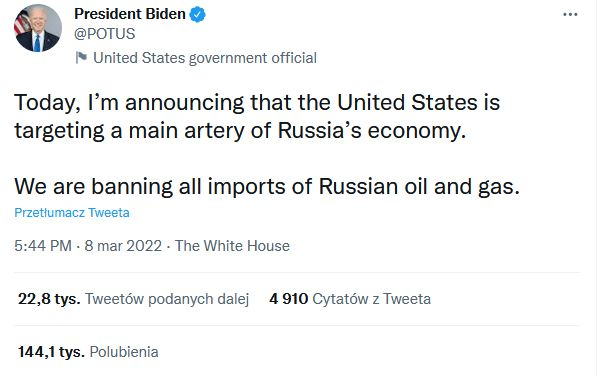
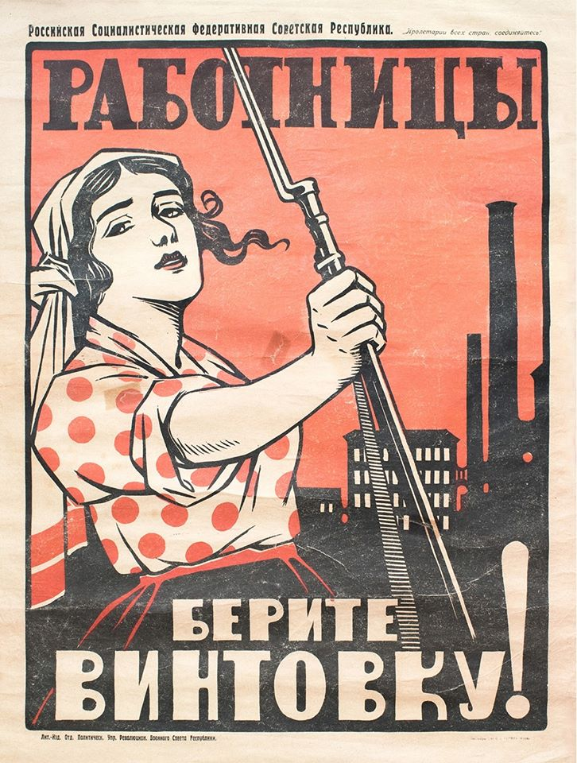
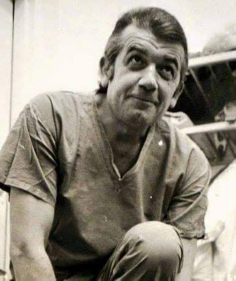
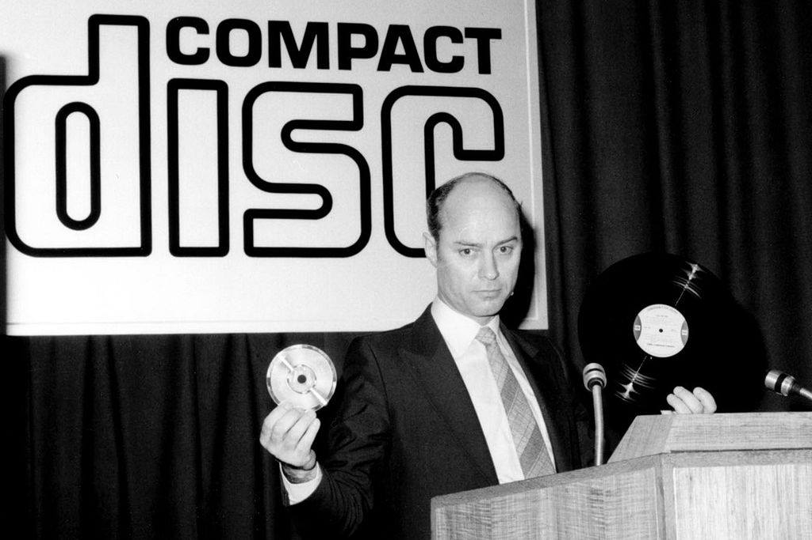
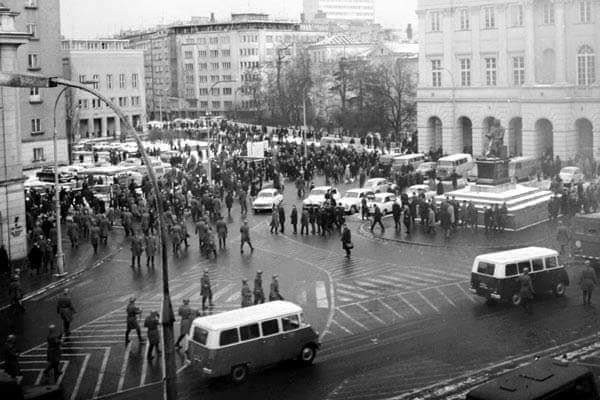
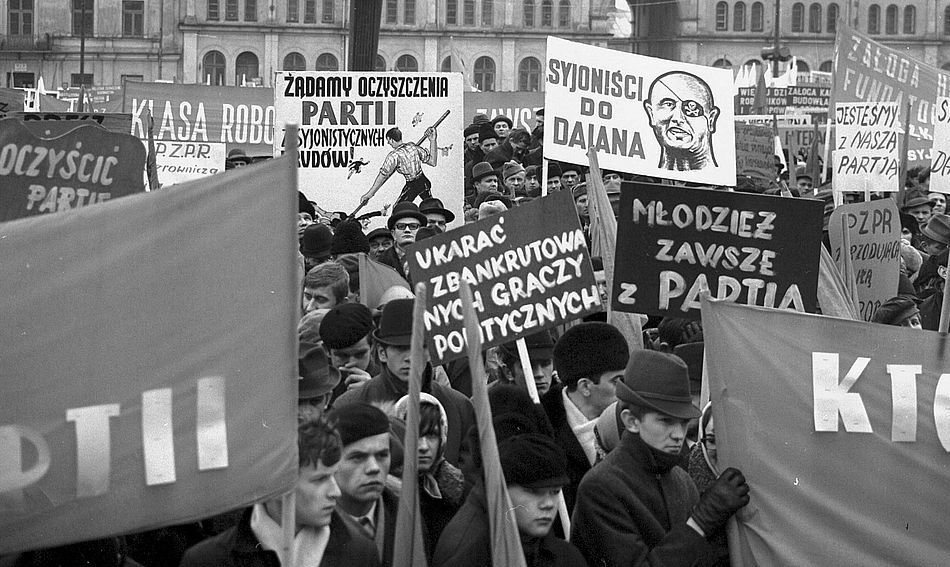
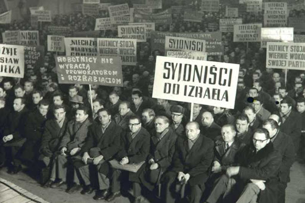
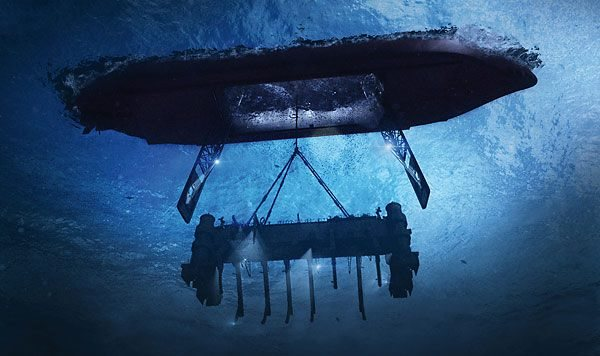
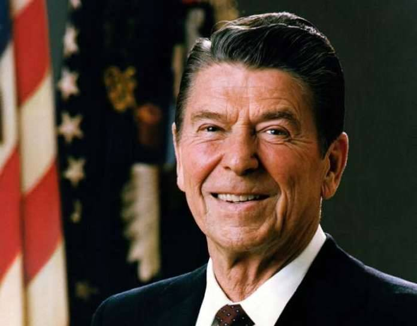

### 2022

Polacy stoją w kolejkach do kantoru w celu sprzedaży **twardej waluty PLN**

  

---

Komunikat NBP:

Od dziś, 8 marca, do nabycia nowa moneta kolekcjonerska NBP – srebrna o nominale 10 zł „200. rocznica urodzin Ignacego Łukasiewicza”.
Na rewersie monety znajduje się wizerunek Ignacego Łukasiewicza, domniemany prototyp lampy naftowej oraz widok na założoną przez Łukasiewicza najstarszą na świecie kopalnię ropy naftowej w Bóbrce.

<a href="./documents/march/2022_05___lukasiewicz_pl.pdf" target="_blank">Opis monety</a>

---

> Prezes NBP: Stagflacja w Polsce? Chyba meteoryt musiałby w Ziemię uderzyć.

---

  

---

  

---

### 2021 = 1918

  

> "Female workers, take the rifle!" Soviet poster, 1918

---

  

---

### 2009

Zmarł w wieku 70 lat znany kardiochirurg profesor Zbigniew Religa. Był twórcą nowoczesnej polskiej transplantoligii. W 1985 roku w klinice w Zabrzu dokonał pierwszego w historii polskiej medycyny udanego przeszczepu serca. Był także ministrem zdrowia w rządzie Kazimierza Marcinkiewicza

  

### 1983

W przemówieniu do Narodowego Stowarzyszenia Ewangelików prezydent USA Ronald Reagan nazwał ZSRR „imperium zła”.
Te dwa słowa określające Związek Sowiecki wypowiedziane 36 lata temu przez prezydenta USA Ronalda Reagana zelektryzowały cały świat.
Nic nie wskazywało na to, że 8 marca 1983 r. na Narodowym Zgromadzeniu Ewangelików w Orlando na Florydzie, padnie określenie, które zyska sławę podobną do Churchillowskiej „żelaznej kurtyny”. Po raz pierwszy Zachód usłyszał tak jednoznacznie negatywne określenie Związku Radzieckiego i to z ust jednego z najważniejszych polityków tamtych czasów. Reagan powiedział m.in.:
„To oni mówią o wyższości państwa, o jego wyższości nad jednostką i przewidują, że państwo obejmie władzę nad całym światem. To oni koncentrują na sobie całe zło tego świata. Więc kiedy dyskutujecie o zamrożeniu potencjałów nuklearnych, postarajcie się uniknąć grzechu pychy, która mogłaby was popchnąć do stwierdzenia, że obie strony tego sporu mają rację, że – ignorując fakty i historię – zignorujecie agresywne działania imperium zła i stwierdzicie, że wyścig zbrojeń jest po prostu nieporozumieniem, a nie walką prawdy z kłamstwem i dobra ze złem”.
Słowa prezydenta USA cytowały na drugi dzień gazety na wszystkich kontynentach. Historycy uważają dziś, że był to jeden z najważniejszych gestów, który pomógł zakończyć zimną wojnę.

### 1979

Przedsiębiorstwo Philips zaprezentowało płytę kompaktową.
Dzisiaj obchodzimy szczególne urodziny! Dokładnie 41 lat temu 8 marca 1979 roku - narodziła się płyta kompaktowa (COMPACT DISC). Aż trudno w to uwierzyć. W ciągu tych 41 lat, nieprzerwanie przez co najmniej 3 dekady, płyty CD towarzyszyły niemal każdemu człowiekowi na świecie. To nie przesada, technologia płyt CD to jedno z rozwiązań najdłużej utrzymujących się na rynku.
Ówcześnie, 8 marca 1979 roku podczas konferencji prasowej Joop Sinjou, szef CD Lab w Philipsie, zaprezentował pierwszy w historii cyfrowy dysk audio o średnicy 115 mm (1 godzina odtwarzania) oraz odtwarzacz PHILIPS "Pinkeltje", czyli prototyp odtwarzacza wykorzystującego nazwę i logo Compact Disc. Zbudowano 10 takich prototypów "Pinkeltje" Philipsa z wykorzystaniem prototypowego mechanizmu laserowego CDM-0.
W tym samym czasie firma Sony prowadząc podobne badania, zaproponowała zapis danych na krążku o średnicy 30 cm, co odpowiadało ok. 2,5-godzinnemu nagraniu. Płyta CD była nadal dopracowywana we współpracy firm Philips (znanej wówczas jako Royal Philips Electronics) i Sony. Obie firmy podpisały porozumienie także w 1979 roku. Sony i Philips utworzyły wspólny zespół inżynierów do zaprojektowania nowej cyfrowej płyty audio. Po roku eksperymentów i dyskusji, standard CD-DA Red Book został opublikowany w 1980 roku.
Dodajmy, że Philips rozpoczął prace nad tą technologią już w 1974 roku, ale podstawy technologii zapisu na nośniku optycznym opracował James T. Russell już pod koniec lat 60-tych, zanim jeszcze ludzka stopa stanęła na powierzchni Księżyca.
Niemniej dopiero w wyniku współpracy między SONY i PHILIPS ustalono nowy standard cyfrowego dysku optycznego o średnicy 120 mm, który znamy dzisiaj jako Compact Disc. Inne firmy również pracowały nad własnym formatem płyt. W 1981 roku powstał m. in. prototyp cyfrowego dysku audio SHARP z płytką 135 mm (dodajmy, że istniał też prototyp SONY Goronta, który wykorzystywał płyty CD 120 mm).
Pierwsze publiczne prezentacje odbyły się w Saizburgu w kwietniu 1981 roku, gdzie zarówno firma PHILIPS, jak i SONY zaprezentowały swoje prototypy odtwarzające ten sam dysk CD 120 mm. Ciekawostką jest fakt, iż pierwsze płyty gramofonowe z końca XIX wieku miały 12,5 cm średnicy.
Obie firmy przez lata spierały się o to, jaki rozmiar, kształt i technologię powinna obsługiwać płyta CD. Ostatecznie stanęło na 74 minutach muzyki.
Dlaczego 74 minuty? Wielu świadków tamtych wydarzeń twierdzi, że taki rozmiar wymusił sam Norio Ōga (dyrektor generalny Sony Corporation w latach 1982–1995) po to, żeby dysk pomieścił całą IX Symfonię Beethovena, na co nalegał austriacki dyrygent Herbert von Karaja. Ōga był jednym z "ojców płyty kompaktowej" i jednym z głównych twórców Playstation. Zaprzeczył temu później współtwórca systemu Kees Immink, ale nie ma pewności kto ma rację.
Wiadomo na pewno, że uzgodniona przez oba koncerny wersja płyty kompaktowej została zaprezentowana w kwietniu 1981 roku przez tych trzech panów: Joopa Sinjou (PHILIPS), Herberta von Karajana (dyrygent) i Akio Moritę (SONY). Prezentujemy tę chwilę i te postaci na załączonym zdjęciu.
Grubość zaprezentowanej wtedy płyty CD wynosiła 1,2 milimetra i wirowała z prędkością około 500 obr./min na wewnętrznej stronie dysku.
Pierwszą testową płytą było nagranie "Eine Alpensinfonie" Richarda Straussa. Pierwsze płyty kompaktowe zostały wytłoczone na skalę przemysłową w sierpniu 1982 roku. Była to płyta zespołu ABBA "The Visitors". Premiera tej płyty CD miała miejsce 17 sierpnia 1982 r. w Langenhagen, w fabryce firmy PolyGram, należącej do Philipsa. Natomiast pierwszą masowo sprzedawaną płytą CD był album Billy'ego Joela "52nd Street". Trafił on do sklepów w Japonii w październiku 1982 roku.
Kiedy kolejne płyty CD dotarły na półki sklepowe w listopadzie 1982 roku, dostępnych było już 150 tytułów. Albumy ABBY i Billy'ego Joela były wśród nich, dołączyły do nich także liczne tytuły muzyki poważnej. Na zdjęciu zespół ABBA i ich pierwsza płyta CD podczas premiery.
Pierwszym odtwarzaczem CD, przeznaczonym do sprzedaży detalicznej, był ówcześnie bardzo modny Sony CDP-101 oferowany za szaloną cenę 730 dolarów (równowartość dzisiejszych 1750 dolarów). Było to postrzegane jako zbyt kosztowne, by przeciętny konsument mógł go kupić, ale był to pierwszy przenośny, wytrzymały odtwarzacz CD, jaki kiedykolwiek widział świat.
Płyty CD zostały wydane po raz pierwszy w Japonii, a do marca 1983 r. trafiły do Stanów Zjednoczonych i Europy. W tym czasie na płycie kompaktowej znalazło się ponad 1000 tytułów, a rewolucja cyfrowa była już w toku. Płyty CD audio kosztowały wtedy 15 dolarów (obecnie równowartość 35 dolarów).
Pomimo wysokiej ceny, w latach 1983-1984 i w samych Stanach Zjednoczonych, sprzedano ponad 400 000 odtwarzaczy CD - głównie Sony.
Jeszcze w 1985 roku Dire Straits, jeden z największych zespołów na świecie w tym czasie, wydał swój album "Brothers in Arms" na kompakcie tylko w celu promowania nowego formatu. Jednak w rezultacie tego posunięcia, była to pierwsza płyta, która kiedykolwiek sprzedała się jednorazowo w nakładzie ponad miliona egzemplarzy.
To był punkt zwrotny dla skromnego jeszcze dysku CD. Płyta CD oznaczała przejście od technologii analogowej do dźwięku cyfrowego i utorowała drogę do rozwoju muzyki rozrywkowej. Nad sukcesem płyty kompaktowej zaważył też ogromny przyrost danych w ostatnich latach XX wieku. Standardowe nośniki, tj. dyskietka czy dysk twardy, miały zbyt małą pojemność, więc coraz częściej wybierano płytę CD.
Do 1988 roku sprzedaż płyt CD w Stanach Zjednoczonych przewyższyła sprzedaż płyt winylowych, a do roku 1992 sprzedaż płyt CD przewyższyła sprzedaż nagranych kaset muzycznych.
W ciągu następnych 20 lat sprzedano 200 miliardów płyt CD, a jednocześnie technologia szybko ewoluowała, aby pasować do nowych celów, takich jak wideo.
Sukces tej kompaktowej płyty został zdyskontowany w szczególności przez firmy Philips i Sony, które wspólnie uzgodniły i opracowały kompatybilny sprzęt. Zunifikowana konstrukcja dysku CD pozwoliła konsumentom kupić dowolną płytę lub odtwarzacz od dowolnej firmy i pozwoliła płycie CD na dominację na domowym rynku muzycznym bez żadnych przeszkód.
Pierwszą polską płytę kompaktową pt. "Chopin-Tausig-Wieniawski" (symbol WCD-001) wydał w styczniu 1988 r. WIFON. Zawierała ona nagrania koncertu fortepianowego e-moll op.11 Fryderyka Chopina oraz koncert fortepianowy op.20 Józefa Wieniawskiego w wykonaniu Orkiestry Symfonicznej Filharmonii Bałtyckiej pod dyrekcją Wojciecha Rajskiego. Pierwszym polskim albumem kompaktowym z muzyką rozrywkową była płyta z 1988 r. pt. „The Best of Urszula & Budka Suflera”.
Pomimo tego, że płyty CD zdobywały popularność na całym świecie, wiele zespołów nadal wydawało swoje utwory w wielu formatach (kasety magnetofonowe, płyty winylowe i płyty CD) aż do drugiej połowy lat 90.
Co ciekawe, pierwsze płyty CD audio, cechowała bardzo wysoka trwałość zapisu. Płyty muzyczne nagrane ponad 20 lat temu nadal można używać bez obaw.
Płyta CD spotkała się z tradycyjną techniką komputerową już w 1991 roku, kiedy to wynaleziono format CD-i. Płyta CD-i została zaprojektowana do przechowywania wideo, tekstów, animacji i innych treści interaktywnych, które można odtwarzać za pomocą kompatybilnego odtwarzacza. W ciągu roku dostępnych było ok. 50 tytułów w formacie CD-i.
Płyta Video CD wystartowała w 1994 roku, wydawane przez współzałożyciela Sony. Mało kto słyszał o Video CD, ponieważ lepszy format - DVD - szybko zdobył większą popularność.
Digital Versatile Disc wygrał wojnę formatową przeciwko Video CD i kilku innym formatom w 1995 roku, aby stać się najpopularniejszym sposobem dystrybucji płyt wideo. Został wymyślony przez firmy Philips, Sony, Toshiba i Panasonic i ostatecznie zabił skromną taśmę VHS, tak jak CD zabiła przed nią analogowy dźwięk.
Zaletą dysków była bardzo duża pojemność (odpowiednik około 450 dyskietek 3,5 cala 1,44 MB), a zarazem wygoda korzystania.
Tymczasem ludzie w domach chcieli nagrywać sami CD. Zatem w 1997 r. na rynek trafiła pierwsza płyta CD-RW do wielokrotnego zapisu. Ponownie pojawił się problem ceny. Po tym, gdy współzałożyciel formatu, czyli Philips, wypuścił w tym samym roku nagrywarkę płyt CD-RW, dyski do wielokrotnego zapisu były sprzedawane w cenie 5,45 EUR za sztukę.
Formaty stopniowo ewoluowały i nagrywalne płyty CD zostały zastąpione nagrywalnymi płytami DVD.
Następnie wszedł na rynki światowe najnowocześniejszy (do dzisiaj) format płyt Blu-ray, które, mimo kilkudziesięciokrotnie większej pojemności, są potomkami tradycyjnych płyt kompaktowych. Nośniki te, podobnie jak pierwsze płyty CD, mają 12 cm średnicy.
Sprzedaż płyt CD zaczęła spadać w 2000 roku ze względu na rosnące piractwo oraz rosnącą popularność nowego formatu cyfrowego znanego jako MP3.
Wytwórnie płytowe odnotowały znaczny spadek sprzedaży, a w 2003 r. wiele z nich poparło wsparcie pomysłu Steve'a Jobsa i firmy Apple. Pomysł polegał na scentralizowanym sklepie, w którym można by było sprzedawać muzykę i pobierać ją na komputer użytkownika. W ciągu pierwszych 24 godzin od otwarcia usługi, sklep iTunes Store, sprzedał prawie 300 000 utworów, w bardzo krótkim czasie uzyskując wynik ponad 1 miliard piosenek.
Przez cały ten czas płyty CD przeżywały jesień swojego życia, podobnie jak sklepy płytowe, które zbudowały swój model biznesowy na CD.
Od kilku lat i to stało się przeszłością. Serwisy streamingowe, takie jak Spotify, Apple Music czy Tidal zastąpiły jakikolwiek obrót plikami mp3. Efekt ten spotęgowały także wielkie platformy internetowe, takie jak Youtube czy Facebook. Sprzedaż płyt CD spada, streaming rośnie lawinowo, powracają płyty winylowe.
Tymczasem, głównie dzięki szybkiemu rozwojowi serwisów streamingowych, rynek muzyczny ponownie rośnie, w dodatku coraz szybciej, by wg prognoz Goldman Sachs z grudnia 2018 roku - już za 6 lat osiągnąć swój rekordowy poziom z 1999 roku. Zaś za kolejne 10 lat ta rekordowa wartość - podwoi się.
Dzisiaj płyty CD znikają z rynku, jednak niektórzy obserwatorzy rynku muzycznego wieszczą powrót płyt kompaktowych w przyszłości i to z hukiem!
Być może dzisiaj wieczorem wrócicie do domu, odkopiecie swoje ulubione płyty CD i dacie im zabrzmieć tak, jak za "starych, dobrych czasów". Ja tak uczynię!

  

### 1968

Studenci Uniwersytetu Warszawskiego zorganizowali wiec, który stał się początkiem tak zwanych "wydarzeń marcowych"czyli kryzysu politycznego powstałego w kręgach Polskiej Zjednoczonej Partii Robotniczej, a mającego podłoże antysemickie.
Bezpośrednim impulsem do powstania tej serii wydarzeń było zdjęcie ze sceny Teatru Narodowego w Warszawie spektaklu "Dziady" Adama Mickiewicza w reżyserii Kazimierza Dejmka. Ówczesny kierownik Wydziału Kultury Wincenty Kraśko (dziadek Piotra Kraśki) oświadczył na spotkaniu z reżyserem, że spektakl jest zdecydowanie antyrosyjski, antyradziecki i religiancki.
Ostatni spektal odbył się 30 stycznia 1968 roku.
Protestujący 8 marca 1968 roku przeciwko zdjęciu "Dziadów" ze sceny studenci wydali rezolucję, w której czytamy między innymi:
" "My studenci uczelni warszawskich, (...) oświadczamy: Nie pozwolimy nikomu deptać Konstytucji Polskiej Rzeczypospolitej Ludowej. Represjonowanie studentów, którzy protestowali przeciwko haniebnej decyzji zakazującej wystawienia Dziadów w Teatrze Narodowym, stanowi jawne pogwałcenie art. 71 Konstytucji. Nie pozwolimy odebrać sobie prawa do obrony demokratycznych i niepodległościowych tradycji Narodu Polskiego.
Nie umilkniemy wobec represji".
Władza dosyć szybko znalazła sposób na roprawienie się ze studentami. Do stolicy sprowadzono oddziały ZOMO i ORMO,które brutalnie rozpędzały protestujących. Wydarzenia te z kolei oburzyły niemal całe środowisko akademickie, co wywołało kolejną falę protestów trwających do 28 marca 1968 roku. To właśnie wtedy odbył się ostatni wiec,na którym przyjęto "Deklarację Ruchu Studenckiego". Studenci zażądali w niej wolności opinii, swobody zrzeszania się, zniesienia cenzury, wprowadzenia jawności życia publicznego, społecznej kontroli własności państwowej oraz przestrzegania konstytucyjnych praw obywatelskich.
W odpowiedzi władze rozwiązały sześć
kierunków studiów, m.in. ekonomię, filozofię i socjologię. Z listy studentów skreślono 34 osoby.
Po ponownym otwarciu tych kierunków 70 osób nie uzyskało zgody na kontynuowanie studiów.

Przypomnę, że przez Polską przetoczyła się obrzydliwa kampania antysemicka. Gomułka podzielił Polaków na trzy kategorie  nacjonalistów, kosmopolitów oraz tych którzy uznali Polskę za jedyną ojczyznę. Przyczyn wydarzeń doszukiwano się w spisku Izraela i RFN - teoria wroga zewnętrznego. Rozpętano kampanię nacjonalistyczną, wymieroną w elity polskiego narodu - studentów, pracowników wyższych uczelni. Imiennie atakowano Janusza Szpotańskiego, Stefana  Kisielewskiego, Pawła Jasienicę- ten ostatni praktycznie został skazany na  śmierć cywilną. Organizowano obrzydliwe spektakle nienawiści - Śląsk pogruchocze kości mącicielom, jak głoszono na wiecach organizowanych przez Gierka, rozwiązano wydziały Ekonomii i Filozofii, cały trzeci rok na Wydziale  Matematyczno-Fizycznym oraz psychologię na Wydziale Pedagogicznym UW. Na  mocy tej decyzji 1616 osób przestało być studentami. Z PZPR wyrzucono ponad 8 tysięcy osób.Jako jedyni z władz centralnych protestowali przeciw tej politycznej breji Adama Rapacki i Edward Ochab.W efekcie tych wydarzeń z Polski wyjechało  od 13 do 20 tys osób.Aby uzyskać wówczas pozwolenie na wyjazd, najpierw należało zrzec się polskiego obywatelstwa.Polskę opuścili wówczas Bronisław Baczko, Zygmunt Bauman, Włodzimierz Brus, Aleksander Ford, Jan Kott, Leszek Kołakowski, Krzysztof Pomian, Arnold Słucki, Witold Wirpsza, Stanisław Wygodzki. Wyjechały też za granicę osoby zatrudnione w aparacie  bezpieki i sądownictwa w latach 40-tych i 50-tych XX wieku.
DO 1969 roku  roku Polska spostrzegana była na międzynarodowej arenie jako kraj antysemicki.
Dopiero w 1988 roku można było pisać oficjalnie o wydarzeniach marcowych.
Symbolem tych wydarzeń na zawsze pozostanie Dworzec Gdański w Warszawie, skąd przyszli emigranci udawali się w podróż jedną stronę.

  

  

  

---

Na północny zachód od Hawajów zatonął radziecki okręt podwodny o napędzie diesel-elektrycznym K-129, w wyniku czego zginęło 86 członków załogi. Poniżej omówię również operacje wydobycia okrętu przez CIA i US Navy w operacji o kryptonimie Projekt Azorian.

Historia, która w konsekwencji doprowadzi do utworzenia ściśle tajnego i najdroższego projektu wywiadowczego podczas zimnej wojny, rozpoczyna się pod koniec lutego 1968 roku. Właśnie wtedy na swój trzeci z kolei patrol z Pietropawłowska Kamczackiego wyrusza radziecki okręt podwodny K-129. Zbudowana dziewięć lat wcześniej w stoczni Komsomolska nad Amurem dieslowo-elektryczna jednostka, należała do natowskiej klasy Golf II, którą w rodzimej marynarce wojennej oznaczano mianem "projektu 629A". Tego typu okręty przeznaczone do celów strategicznych przenosiły na swoim pokładzie trzy pociski balistyczne R-21 uzbrojone w głowice jądrowe - każda o sile megatony.

Podobna atomowa flota po obu stronach żelaznej kurtyny czekała w nieustannej gotowości pod wodami Oceanu Spokojnego i Atlantyckiego. To właśnie w kierunku tego pierwszego akwenu, a dokładnie na północny-wschód od Hawajów, kierował się K-129. Po pierwszym próbnym zanurzeniu przesłał do bazy komunikat o dobrym stanie technicznym, następnie zamilkł. Zaniepokojone władze ponawiały próby kontaktu - bez powodzenia. Pod koniec marca, kiedy było już jasne, że na pokładzie musiało dojść do niewyjaśnionego wypadku i zatonięcia okrętu, ZSRR skierował znaczne siły do poszukiwań wraku na dnie Pacyfiku. Tak duże skupisko statków i łodzi w jednym rejonie nie uszło uwadze amerykańskiemu wywiadowi, który słusznie zaczął podejrzewać, że Rosjanie przeprowadzają akcję poszukiwawczą jednego ze swoich okrętów atomowych. Rok 1968 był pod tym względem wyjątkowo pechowy, ponieważ w tajemniczych okolicznościach Francja (Minerve), USA (USS Scorpion) i Izrael (INS Dakar) również utraciły swój cenny arsenał.

Kiedy Marynarka Wojenna ZSRR dała za wygraną, do gry wkroczyli Amerykanie, którzy dzięki specjalnemu systemowi głębinowej obserwacji akustycznej SOSUS ustalili, że faktycznie 8 marca 1968 w rejonie Hawajów doszło do zarejestrowania dźwięku przypominającego eksplozję, a po nim do uderzenie dużego obiektu o dno oceanu. Wysłany na miejsce USS Halibut potwierdził istnienie wraku niemal nienaruszonego okrętu na głębokości niespełna 5 tys. metrów. Po wykonaniu tysięcy fotografii stało się jasne, że musi to być zagoniona radziecka jednostka, u której widoczna była jedynie wyrwa po eksplozji przy kiosku, spowodowana najprawdopodobniej wybuchem ładowanych przy wynurzeniu baterii, z których zaczął wyciekać wodór. W środku natomiast musiały znajdować się nienaruszone głowice jądrowe, książki z kodami startowymi, depesze, systemy komunikacji, systemy przeciwpożarowe, silnik... istne eldorado dla każdego oficera wywiadu. Na decyzję CIA nie trzeba było długo czekać, zarówno Departament Obrony jak i prezydent Richard Nixon

dali zielone światło misji z pozoru niemożliwej - wydobyciu K-129 z dna oceanu. Tak narodził się projekt Azorian.

Howard Hughes wkracza do akcji:

Azorian stanowił największe wyzwanie, przed jakim od momentu swojego utworzenia stanął wywiad USA - oczywiście o ile jakiś większy nieujawniony jeszcze projekt nie zalega nadal w amerykańskich archiwach. Podnieść ogromny, liczący 100 m długości i ważący 2,7 tys. ton wrak okrętu z głębokości 5 tys. metrów i zrobić to w całkowitej tajemnicy, zarówno przed Rosjanami, ale przede wszystkim własną opinią publiczną i mediami - to wydarzenie bez precedensu. W razie wykrycia przedsięwzięcia, w powietrzu wisiała wojna, ponieważ oba państwa porozumiały się wcześniej, że w przypadku utraty okrętu podwodnego przeciwnika, nie będą starały się go wydobywać. Amerykanie złamali tę zasadę. W 1970 po dokładnych studiach, zespół złożony z inżynierów zatrudnionych w CIA oraz niezależnych specjalistów pracujących pod najwyższą kontrolą ustalił, że jedyną możliwą technicznie metodą wydobycia tak dużego obiektu będzie skonstruowanie nowego typu statku z otwieranym dnem i ogromnym dźwigiem z chwytakiem. Tak narodził się projekt

jedynego w swoim rodzaju Glomar Explorera.

Oczywiście budowa tak dużego statku nie mogła przejść niezauważona, dlatego postanowiono zastosować inną strategię. Ustalono, że oficjalną przykrywką Glomar Explorera będzie komercyjne wydobycie złota oraz bogatych w pierwiastki rzadkie konkrecji manganowych z dna oceanu. Oficjalnym właścicielem i pomysłodawcą projektu, a także faktycznie jego sponsorem, został kontrowersyjny miliarder Howard Hughes. Konstruowany przez następne cztery lata statek posiadał wieże charakterystyczne dla platform wiertniczych, dźwig oraz ogromny chwytak, który potrafił umieścić wydobyty okręt w doku wewnątrz Glomar Explorera. Również sama procedura podnoszenia K-129 przemyślana została w taki sposób, aby zdjęcia satelitarne czy przepływające jednostki nie były w stanie poznać właściwego celu misji.

Wrak wciągano do doku poprzez otwierane dno, które z góry było w pełni zadaszone. Niemniej jednak tak złożona operacja obarczona była ogromnym ryzykiem, związanym nie tylko z dekonspiracją, ale przede wszystkim z samą logistyką. Chwytak, który w rzeczywistości przypominał zdalnie sterowanego robota, musiał być opuszczany niezwykle wolno, dodatkowo walcząc z silnymi prądami oceanicznymi. Miejsce samego wydobycia należało na dnie zabezpieczyć dodatkowym rusztowaniem, następnie krok po roku przytwierdzić poszczególne ramiona chwytaka do kadłuba K-129 i pod niewyobrażalnie dużym ciśnieniem dopilnować, aby okręt nie urwał się z zaczepów wydobywany z prawie pięciu kilometrów pod wodą.

O włos od tragedii:

Na swoją dziewicza misją Glomar Explorer wyruszył z portu w Long Beach, na miejsce docierając 4 lipca 1974 roku. Pomimo kilkukrotnego kontaktu z jednostkami radzieckimi, które starały się wybadać faktyczne przeznaczenie jednostki, ponad miesiąc pracowano bez dekonspiracji. Ponieważ ryzyko abordażu CIA uznała za prawdopodobne, Glomar Explorer posiadał zbrojownię pełną karabinów maszynowych oraz specjalny system niszczenia dokumentów na mostku, który miał być broniony do momentu pozbycia się wszystkich wrażliwych danych. Podczas operacji wiele rzeczy i mechanizmów zawodziło, ale wyspecjalizowana załoga była w stanie korygować je na bieżąco, zapewniając równomierne i stabilne wznoszenie się wraku K-129 z głowicami jądrowymi nadal umieszczonymi w lukach rakietowych. Niestety, najprawdopodobniej poprzez błąd w obliczeniach wyporności okrętu, w około jednej trzeciej drogi na powierzchnię, puściły przednie zaczepy, a radziecka maszyna przerwała się na dwie części. Część dziobowa zaczęła gwałtownie opadać na dno i

przez kilkadziesiąt długich sekund załoga Glomar Explorera zamarła, oczekując podwodnej eksplozji.

Na szczęście detonacja nie nastąpiła, ale zdecydowana większość wydobywanego ładunku ponownie legła na dnie Pacyfiku. Raporty CIA dotyczące zawartości wyciągniętej części rufowej do tej pory nie ujrzały światła dziennego. Według różnych wersji, udało się wydobyć niezwykle cenną księgę kodów i rakietę balistyczną, pewne jest natomiast, że wraz ze szczątkami K-129 wydobyto również ciała sześciu radzieckich marynarzy. Przy pełnych honorach oraz odtworzonym hymnie ZSRR, pochowano ich na morzu, a w 1992 roku w geście dobrej woli, ówczesny dyrektor Centralnej Agencji Wywiadowczej ofiarował kasetę wideo z ceremonii prezydentowi Borysowi Jelcynowi.

Niepowodzenie pierwotnej misji nie ostudziło apetytów Amerykanów, którzy błyskawicznie rozpoczęli przygotowania do kolejnej wyprawy, mającej na celu odzyskanie większej części przełamanego okrętu albo przynajmniej jego głowic. Podobna operacja przeprowadzona na mniejszej głębokości przy pomocy batyskafów udała się już raz w 1966 roku pod Palomares, na miejscu katastrofy przenoszącego bomby atomowe samolotu B-52. Niestety, w wyniku serii niefortunnych wypadków, które zapoczątkowało włamanie do siedziby firmy Howarda Hughesa, wyciekły dokumenty wiążące go bezpośrednio z tajną operacją wywiadu. Pomimo zaangażowania CIA i FBI, dochodzenie prowadzone z Los Angeles zataczało coraz szersze kręgi, wzbudzając zainteresowanie lokalnej prasy. Jesienią 1974 było już jasne, że dziennikarze powoli wpadają na dobry trop.

Ostatnią próbę zatamowania przecieków i mediacji z dziennikarzami podjął dyrektor CIA Wiliam Colby, osobiście przekonując redaktorów, aby nie ujawniali prawdy o projekcie Azorian. Niestety, coraz większe zainteresowanie Glomar Explorerem powodowało, że projekt utracił swoją największą zaletę - idealną przykrywkę, która nie budziła skojarzeń z faktycznym przeznaczeniem. 18 lutego 1975 pierwszy artykuł sugerujący powiązania pomiędzy Hugesem a wywiadem USA opublikowano w Los Angeles Times, a tą drogą sensacyjna wiadomość o tajnej operacji trafiła do telewizji. Projekt mylnie nazywany Jennifer (w rzeczywistości był to kryptonim zespołu pracującego przy Azorianie), uznano za marnotrawstwo pieniędzy podatników. Pomijając jego faktyczne znaczenie wywiadowcze, było w tym ziarno prawdy. Cała operacja kosztowała 800 milionów dolarów, które przy obecnej wartości przekładałoby się na prawie 4 miliardy dolarów. Pomimo wygaszenia misji, Glomar Explorer do tej pory służy Stanom Zjednoczonym w operacjach przeprowadzania

podmorskich odwiertów. Nie ulega wątpliwości, że jego konstrukcja oraz plan wyciągnięcia z dna Pacyfiku całego okrętu podwodnego, stanowi najambitniejszą operację zimnej wojny.

  

### 1940

Władze III Rzeszy wprowadziły obowiązek noszenia przez polskich robotników zatrudnionych na robotach w Niemczech specjalnych opasek z literą "P".
Przypomnijmy, że przymusowy nabór do pracy w Niemczech organizowały w Polsce niemieckie urzędy pracy ( Arbeitsamty). Za uchylanie się od tak zwanej branki groziły surowe kary, łącznie z wywiezieniem najbliższej rodziny do obozu pracy lub obozu koncentracyjnego, konfiskatą mienia, aż do kary śmierci włącznie.
Grafika: Niemiecki plakat propagandowy namawiający Polki do wyjazdu do pracy w Rzeszy.

  

### 1938

W przemówieniu do Narodowego Stowarzyszenia Ewangelików prezydent USA Ronald Reagan nazwał ZSRR „imperium zła”.
Te dwa słowa określające Związek Sowiecki wypowiedziane 36 lata temu przez prezydenta USA Ronalda Reagana zelektryzowały cały świat.
Nic nie wskazywało na to, że 8 marca 1983 r. na Narodowym Zgromadzeniu Ewangelików w Orlando na Florydzie, padnie określenie, które zyska sławę podobną do Churchillowskiej „żelaznej kurtyny”. Po raz pierwszy Zachód usłyszał tak jednoznacznie negatywne określenie Związku Radzieckiego i to z ust jednego z najważniejszych polityków tamtych czasów. Reagan powiedział m.in.:
„To oni mówią o wyższości państwa, o jego wyższości nad jednostką i przewidują, że państwo obejmie władzę nad całym światem. To oni koncentrują na sobie całe zło tego świata. Więc kiedy dyskutujecie o zamrożeniu potencjałów nuklearnych, postarajcie się uniknąć grzechu pychy, która mogłaby was popchnąć do stwierdzenia, że obie strony tego sporu mają rację, że – ignorując fakty i historię – zignorujecie agresywne działania imperium zła i stwierdzicie, że wyścig zbrojeń jest po prostu nieporozumieniem, a nie walką prawdy z kłamstwem i dobra ze złem”.
Słowa prezydenta USA cytowały na drugi dzień gazety na wszystkich kontynentach. Historycy uważają dziś, że był to jeden z najważniejszych gestów, który pomógł zakończyć zimną wojnę.

  

### 1769

Konfederacja barska: Rosjanie zdobyli twierdzę Okopy Świętej Trójcy.
Niewielka wioska położona niedaleko Kamieńca Podolskiego na trwałe zapisała się w historii Polski i w… rodzimej literaturze. Wszystko zaczęło się po utracie przez Polskę Kamieńca Podolskiego. Hetman Stanisław Jan Jabłonowski zwrócił uwagę króla Jana III Sobieskiego na to, że znajdujący się w Okopach niewielki szaniec jest doskonale położony i świetnie nadaje się na twierdzę, która będzie mogła blokować Turków czy Tatarów. Król wyraził aprobatę i niewielka miejscowość szybko zmieniła się w ufortyfikowane orle gniazdo. W roku 1699 właśnie tutaj zatrzymała się podążająca do odzyskanego Kamieńca ludność Polska. Powstał wtedy pomysł aby uczynić z Okopów miasto. Pozyskano nawet przychylność Augusta II Sasa, ale niestety czasy nie sprzyjały rozwojowi miast. Osada bardzo szybko się wyludniała i nic nie mogło zmienić tego stanu rzeczy.
Podczas konfederacji barskiej bohaterską obroną twierdzy dowodził Wawrzyniec Potocki. Kiedy sytuacja stała się krytyczna wojsko polskie wycofało się za Dniestr. Błędne informacje w raportach rosyjskich (zaniżone straty własne i brak informacji o jeńcach) mogą dowodzić, że część polskich żołnierzy została dobita przez wrogów. Ruiny twierdzy zwiedził jako dziecko Zygmunt Krasiński. Można domniemywać, że historia bohaterskiej obrony, jaką przyszły poeta wtedy usłyszał, tak mocno zapadła mu w pamięć, że uczynił on Okopy bastionem arystokratów w swym dramacie "Nie-boska komedia". Pisze on o zamku tymi słowami:
"Na wyspie granitowej, nagiej stoją wieże zamku, wbite w skałę pracą dawnych ludzi i zrosłe ze skałą, jak pierś ludzka z grzbietem u centaura. Ponad niemi sztandar się wznosi, najwyższy i sam jeden wśród szarych błękitów."
Jeszcze pod koniec XIX wieku zamek był w stosunkowo dobrym stanie. Kamieniecki historyk Antoni J. Rolle wspominał w 1880 roku, że wprawdzie wały porastają wiekowe drzewa, ale "mury utrzymane są dobrze". W okresie międzywojennym wieś należała do Polski. W jej pobliżu zbiegały się trzy granice - polska, rumuńska i radziecka.

  

### 1618

Niemiecki matematyk i astronom Johannes Kepler sformułował swoje trzecie prawo.
Prawami Keplera nazywamy trzy prawa astronomiczne, odkryte przez Jana Keplera i opisujące ruch planet wokół Słońca. Kepler sformułował je w oparciu o dane obserwacyjne, pozostawione przez Tychona Brache, nadwornego astronoma cesarza Rudolfa II. Wynikało z nich jednoznacznie, że planety nie mogą krążyć wokół Słońca po okręgach, jak chciał tego Kopernik.
Wierząc jednak w zasadniczą słuszność teorii Polaka, Kepler poszukiwał innej nieskomplikowanej krzywej, po której mógłby odbywać się ruch planet – kilka lat wytrwałych obliczeń i poszukiwań prowadzonych metodą prób i błędów (Kepler rozpoczął współpracę z Brachem w roku 1600) doprowadziło go do wniosku, że odpowiednią krzywą jest elipsa. Rezultaty swe opublikował w roku 1609 w dziele Astronomia nova ... (Nowa astronomia... – pełny tytuł księgi jest znacznie dłuższy). Po kolejnych kilku latach uzupełnił je trzecim prawem, opublikowanym w roku 1619 w Harmonice Mundi (Harmonia świata)
Pierwsze prawo Keplera głosi, że:
Każda planeta Układu Słonecznego porusza się wokół Słońca po elipsie, w której w jednym z ognisk jest Słońce.
Drugie prawo Keplera:
Drugie prawo Keplera mówi, że w równych jednostkach czasu, promień wodzący planety poprowadzony od Słońca zakreśla równe pola. Wynika stąd natychmiast, że w peryhelium (w pobliżu Słońca), planeta porusza się szybciej niż w aphelium (daleko od Słońca).
Trzecie prawo Keplera:
Trzecie prawo Keplera głosi, że stosunek kwadratu okresu obiegu planety wokół Słońca do sześcianu średniej arytmetycznej największego i najmniejszego oddalenia od Słońca jest stały dla wszystkich planet w Układzie Słonecznym.

  

---

<a href="https://github.com/TomaszWaszczyk/historia.waszczyk.com/edit/master/src/content/march-8.md" target="_blank">Edytuj tę stronę dzieląc się własnymi notatkami!</a>
