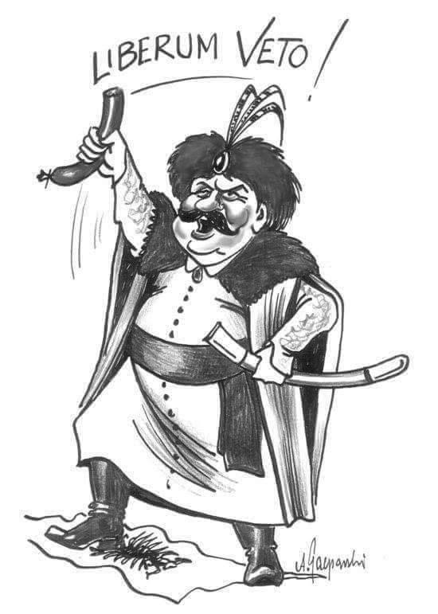

### 2021

  

### 1995

https://en.wikipedia.org/wiki/Edward_Bernays

### 1953

1953 roku czyli dwa dni od ukazania się i 4 dni po śmierci Józefa Stalina weszła w życie uchwała, na mocy której nazwę miasta Katowice zmieniono na Stalinogród, a województwo katowickie przemianowano na stalinogrodzkie.
W treści tego dokumentu zapisano:
„Dla uczczenia pamięci Wielkiego Wodza i Nauczyciela mas pracujących i Jego wiekopomnych zasług dla Polski, Rada Państwa i Rada Ministrów Polskiej Rzeczypospolitej Ludowej uchwalają, co następuje: miasto Katowice przemianować na miasto Stalinogród, a województwo katowickie na województwo stalinogrodzkie”
Według oficjalnej propagandy zmiana nazwy Katowic została dokonana na prośbę ich mieszkańców, co oczywiście było kłamstwem. Prawdopdobnym autorem tego pomysłu był ktoś z trójki: Bolesław Bierut, Jakub Berman i Hilary Minc.
Katowice były Stalinogrodem do 20 grudnia 1956 roku.

  

### 1943

Adolf Hitler zalegalizował w Polsce aborcję. Dążył on do utworzenia czystej, biologicznie mocnej „rasy panów”. Doprowadził w 1933 roku do legalizacji zabijania niemieckich nienarod­zonych dzieci, które posiadały lub mogły posi­adać wady wrodzone. Po podbiciu narodów słowiańskich niemieccy zbrodniarze opracow­ali „Planost” – plan wyniszczenia narodów podbitych, w ramach którego okupowanym nar­odom szeroko zalecali antykoncepcję i legaliza­cję aborcji . Zbrodnicze plany hitlerowców najlepiej charakteryzuje wypowiedź Martina Bormana, szefa kancelarii Hitlera: „Obow­iązkiem Słowian jest pracować dla nas. Płod­ność Słowian jest niepożądana. Niech używają prezerwatyw albo robią skrobanki – im więcej, tym lepiej. Oświata jest niebezpieczna ” .
Po II wojnie światowej, w krajach tzw. obozu socjalistycznego, dyktatorzy komunistyczni wprowadzili w połowie lat pięćdziesiątych prawną dopuszczalność tzw. przerywania ciąży.

### 1652

Data przyjęta jako pierwsze zastosowanie w polskim Sejmie zasady liberum veto. Ale to tylko data umowna, bo chociaż w 1652 roku podstarości upicki Władysław Siciński uważany jest za tego, który zastosował ją pierwszy raz, to w rzeczywistości był to tylko brak zgody z jego strony na wydłużenie obrad Sejmu po za ustawowy termin 6 tygodni. Pierwsze prawdziwe zerwwanie Sejmu miało miejsce w 1669 roku podczas obrad w Krakowie. Zrobił to poseł wołyński Adam Olizar.
Liberum veto było zasadą ustrojową Rzeczpospolitej Obojga Narodów dającą prawo każdemu posłowi zerwania obrad i unieważnienia wszystkich podjętych już ustaleń. Wywodziła się ona z przekonania szlachty, że gdy w jej szeregach zapanuje totalna korupcja, która pozwoli na wprowadzanie w życie uchwał niekorzystnych dla państwa, to zawsze znajdzie się jeden uczciwy poseł, który przeciwstawi się temu.

  

---

<a href="https://github.com/TomaszWaszczyk/historia.waszczyk.com/edit/master/src/content/march-9.md" target="_blank">Edytuj tę stronę dzieląc się własnymi notatkami!</a>
