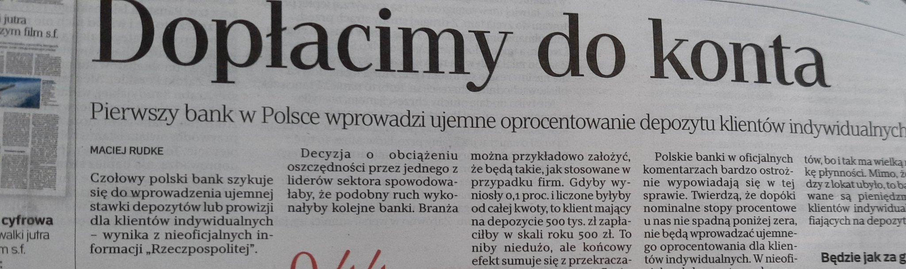

### 2023

Prezes NBP Adam Glapiński: na koniec roku będzie inflacja jednocyfrowa

> Mam dobre wiadomości. Na koniec roku inflacja będzie jednocyfrowa – zapowiedział na czwartkowej konferencji prezes NBP Adam Glapiński. Jak stwierdził, wraz z hamowaniem inflacji, hamować będzie gospodarka, ale czeka nas tzw. miękkie lądowanie.
> ...wojna nie może się powtórzyć...

### 2022

Ukraine has "biological research facilities," says Undersecretary of State Victoria Nuland, when asked by Sen Rubio if Ukraine has biological or chemical weapons, and says she's worried Russia may get them. But she says she's 100% sure if there's a biological attack, it's Russia.

---

<video width="640" height="480" controls>
<source src="./movies/O_wladzy_w_Kosciele_abpGrzegorzRys.mp4" type="video/mp4">
Your browser does not support the video tag.
</video>

---

> Will Inflation Stay High for Decades? One Influential Economist Says Yes
> Charles Goodhart sees an era of inexpensive labor giving way to years of worker shortages—and higher prices. Central bankers around the world are listening. 

---

Wyobraź sobie, że jesteś rosyjskim normikiem aspirującym do oskariatu.  Żyjesz kurwa w Moskwie, pracujesz w niemieckim korpo-iwanexie i do tej  pory zarabiałeś miesięcznie 125 000 rubli, czyli jakieś 1 500 euro. Jak  na warunki rosyjskie bardzo dobrze. Nie był to twój jedyny dochód bo  grałeś trochę na giełdzie. Szło ci całkiem nieźle. Wjebałes tam łączną  sumę rubli odpowiadającą jakimś 5000 euro. Ale niech to chuj upali, bo  znasz się na tym i tradeowałeś tak, by nie stracić. Jeszcze tydzień temu  wartość twoich akcji w rublach wynosiła równowartość 20 000 euro.
Masz już wykupione wakacje w Hiszpanii, ale myślisz, żeby jeszcze  pojechać na Dominikanę... bo cię k**** stać a twoja Julka bardzo  chciałaby wstawić fotkę na instagramie z palmą i mokebe. W tym samym  czasie śmiejesz się z gnijącego zachodu, a zwłaszcza z Polski i tego  PIS-a, czy jakoś tak, i tego Dudu oszalałego. Zdrawstwuj, zdrawstwuj, żyzń krasiwaja.
Wybucha wojna na Ukrainie. Cieszysz się, że twój kraj wreszcie wyzwoli  Małorosję spod władzy nazistów. Zdrawstwuj, zdrawstwuj, żyzń krasiwaja.  Nagle okazuje się, że kurs rubla dramatycznie spada. Dalej zarabiasz 125  000 rubli, ale to jest już równowartość 1000 euro. Myślisz sobie, że to  tymczasowe, bo przecież Wielikaja Rossija, ale nie wiesz jak powiedzieć  Julce, że wyjazdu na Dominikanę nie będzie. Tymczasem ona płacze, bo  mogą wyłączyć Instagram w Rosji.
Logujesz się na konto maklerskie. Nie działa. W końcu się udało i  okazało się że wartość twoich inwestycji spadła do 30 euro. Suka,  bliat', sobaka. Wydaje ci się że to błąd, ale dzwoni Alosza i mowi że u  niego to samo. Myslisz sobie: a niech to chuj upali, był spadek,  przyjdzie wzrost, trzeba żyć dalej. Idziesz do pracy w Iwanexie. Myslisz  sobie, że to firma z kapitałem zagranicznym, więc chuj cię to obchodzi,  ale mają dać ci podwyzke waloryzacyjną albo odchodzisz z Iwanexu.
Przypominasz sobie, że masz kupić opiekacz Russel Hobs "3 w 1", bo Julka  przestawia się na Instagramie na cooking content. Coś tam słyszałeś jak  Małafiejew pierdolił z Arapatowem, że w bankomatach nie ma gotówki.  Zaglądasz do portfela a tam 4500 rubli. A niech to chuj upali. Wystarczy  na opiekacz i jeszcze zostanie na kilogram cukierków "Jesienny Walc".  Na przerwie lunchowej idziesz do Media Marktu i widzisz, że opiekacz  kosztuje, suka jobannyj w rot, 18 000 rubli. Nie potrafisz sobie tego  wytłumaczyć. Wiesz, że rubel spada i w ogóle, ale dlaczego ceny rosną  nieproporcjonalnie do spadku rubla? Myslisz sobie: ach ta Gejropa i  Amerikanci, chcą ci życie uprzykrzyć.
Wracasz do biura, woła cię szef. Myślisz sobie: no to teraz pokażę  Iwanowi, podwyżka i chuj. Iwan oznajmia ze Iwanex wychodzi dzisiaj z  Rosji i likwidowane są wszystkie placówki. Od jutra nie masz pracy, a  właściwie już od teraz. Iwan próbuje cię wyprosić z gabinetu żartując i  mówi "russkij wojennej, korabl idi na chuj". Nie wiesz o chuj mu chodzi,  bo w TV ani internecie nie słyszałeś tych słów. Być może jakiś nowy  boomerski mem.
Wracasz do mieszkania i zastajesz zrozpaczoną Julkę, która płacze bo  dzwonili z biura podróży i w związku z sankcjami, wykluczeniem Rosji z  systemu SWIFT i zamknięciem przestrzeni lotniczej dla rosyjskich  samolotów obawiają się, że ty i Julka nie będziecie w stanie uregulować  reszty rachunku i skorzystać z oferty, więc ja odwołują. Zaliczkę  zabierają, bo i tak nie ma jak oddać. Myślisz: Ni chuja siebie...  Pocieszasz Juloczku, mówiąc że będzie dobrze. Kiedy ta dowiaduje się ze  straciłeś robotę w Iwanexie, to zaczyna się pakować i mówi, że wraca do  siebie na wiochę do Siewieropiździecka. Próbujesz ją przekonać, by  została, ale ona tylko odpowiada "ty szto? jebanułsja?".
Widzisz, że pakuje ze sobą twoje rzeczy: smart watch, laptop i krossowki  Air Max. Mówi, że to rekompensata za jej iPad, który wczoraj  niszczyliście młotkiem u niej na live w ramach protestu przeciw  sankcjom. Julka cię opuszcza i wyjeżdża do Siewieropiździecka, ty  zostałeś z wiplerem w ręku, a Rosja dalej nie może zdobyć Charkowa i  Kijowa. Zdrawstwuj, zdrawstwuj, żyzń krasiwaja

---

### 2021

  

---

  

---

### 1995

https://en.wikipedia.org/wiki/Edward_Bernays

### 1968

Marzec '68: Na Politechnice Warszawskiej odbył się wiec, wyrażający poparcie dla studentów UW i potępiający brutalne działania milicji.

  

W odpowiedzi na kłamliwe informacje prasy dotyczące studenckich protestów, palono gazety i wznoszono okrzyki „Prasa kłamie!”.

  

---

Lata 60, Bronisław Geremek w TVP prowadzi cykl programów historycznych, potępiających Armię Krajową i ruchy niepodległościowe.

  

  

  

  

  

  

> "Są ludzie niezastąpieni, straciliśmy takiego człowieka" - mówił z kolei Aleksander Kwaśniewski. "Wierzę, że w tej sali, (...) pod patronatem profesora, będą wykuwały się idee i wartości - oby mu najbliższe - będziemy potrafili pokazać, że jesteśmy godni spuścizny Bronisława Geremka" - mówił były prezydent po śmierci Geremka.

---

### 1953

1953 roku czyli dwa dni od ukazania się i 4 dni po śmierci Józefa Stalina weszła w życie uchwała, na mocy której nazwę miasta Katowice zmieniono na Stalinogród, a województwo katowickie przemianowano na stalinogrodzkie.
W treści tego dokumentu zapisano:
„Dla uczczenia pamięci Wielkiego Wodza i Nauczyciela mas pracujących i Jego wiekopomnych zasług dla Polski, Rada Państwa i Rada Ministrów Polskiej Rzeczypospolitej Ludowej uchwalają, co następuje: miasto Katowice przemianować na miasto Stalinogród, a województwo katowickie na województwo stalinogrodzkie”
Według oficjalnej propagandy zmiana nazwy Katowic została dokonana na prośbę ich mieszkańców, co oczywiście było kłamstwem. Prawdopdobnym autorem tego pomysłu był ktoś z trójki: Bolesław Bierut, Jakub Berman i Hilary Minc.
Katowice były Stalinogrodem do 20 grudnia 1956 roku.

  

### 1943

Adolf Hitler zalegalizował w Polsce aborcję. Dążył on do utworzenia czystej, biologicznie mocnej „rasy panów”. Doprowadził w 1933 roku do legalizacji zabijania niemieckich nienarod­zonych dzieci, które posiadały lub mogły posi­adać wady wrodzone. Po podbiciu narodów słowiańskich niemieccy zbrodniarze opracow­ali „Planost” – plan wyniszczenia narodów podbitych, w ramach którego okupowanym nar­odom szeroko zalecali antykoncepcję i legaliza­cję aborcji . Zbrodnicze plany hitlerowców najlepiej charakteryzuje wypowiedź Martina Bormana, szefa kancelarii Hitlera: „Obow­iązkiem Słowian jest pracować dla nas. Płod­ność Słowian jest niepożądana. Niech używają prezerwatyw albo robią skrobanki – im więcej, tym lepiej. Oświata jest niebezpieczna ” .
Po II wojnie światowej, w krajach tzw. obozu socjalistycznego, dyktatorzy komunistyczni wprowadzili w połowie lat pięćdziesiątych prawną dopuszczalność tzw. przerywania ciąży.

### 1936

W Przytyku koło Radomia miał miejsce pogrom lub według niektórych źródeł starcia pomiędzy ludnością polską i żydowską. Ich bezpośrednią przyczyną był incydent między polskimi i żydowskimi kupcami handlującymi na odbywającym się tego dnia na rynku w Przytyku jarmarku. W wyniku przepychanki żydowscy kupcy przewrócili kram należący do polskiego kupca, który rzekomo zajął miejsce ich kolegi. Zajście próbowała uspokoić policja, wyznaczając zwaśnionym stronom ś ciśle określone miejsca. Jednak nie był to koniec konfliktu, ponieważ wkrótce po godzinie 15 przed jednym z żydowskich straganów pojawił się Józef Strzałkowski, działacz Stronnictwa Narodowego, który zaczął głośno nawoływać do bojkotu żydowskich kupców. Poirytowany tym Żyd, przed którego stoiskiem krzyczał Polak, kopnął w laskę, na której ten się podpierał, a którą następnie Strzałkowski zdzielił Żyda po głowie. Żydowski handlarz udał się ze skargą na policję, która przybywszy na miejsce , wobec odmowy wylegitymowania się, aresztowała Strzałkowskiego. W jego obronie stanęła kilkudziesięcioosobowa grupa
włościan , która zmusiła policjantów do wycofania się na posterunek, gdzie zostali zablokowani. Wezwano telefonicznie posiłki z Radomia. Po około 20 minutach nerwowa atmosfera uspokoiła się znacznie i ludzie zaczęli się rozchodzić. Resztę, zarówno okupujących komisariat chłopów, jak i zbierające się w różnych miejscach rynku grupki żydowskiej młodzieży, rozpędzili policjanci. Odsiecz odwołano. Jednak jeszcze tego samego dnia w innym rejonie miasta doszło do kolejnego incydentu, w którym samowolnie interwencję podjęły oddziały żydowskiej samoobrony. Prawdopodobnie – gdyż nie udało się ustalić szczegółowego przebiegu wypadków – była to interwencja w obronie kilku handlujących tam Żydów napadniętych przez trzech chłopów. Samoobrona zaczęła atakować również włościan uciekających ulicą. Wielu zostało dotkliwie pobitych i poranionych, w tym kobiety i dzieci. Jak ustalił Sąd Okręgowy w Radomiu do ataku przyłączyli się spontanicznie inni przedstawiciele żydowskiej części mieszkańców Przytyku, w tym miejscowa elita. Punktem kulminacyjnym, który już całkowicie zaognił zajscia było postrzelenie w plecy jednego z Polaków przez członka samoobrony. Chcący wziąć rewanż polscy chłopi, którzy mieli liczebną przewagę zaatakowali wkrótce żydowskie kramy, wywracając je i niszcząc towary. Do akcji wkroczyła również policja, która według relacji kontrowersyjnego dziennikarza Juliana Bruna "kierowała broń przeciwko gromionym Żydom".
Kiedy policja usuwała chłopów z miasteczka, powoli opanowując zamieszki, z wybitego okna jednego z domów padły strzały. Jeden z niebiorących w ogóle udziału w zamieszkach chłopów – Stanisław Wieśniak, został zastrzelony przez Żyda o nazwisku Szulim Chil Leska, członka nacjonalistyczno-religijnej partii Mizrachi , który strzelił z okna swojego mieszkania. Policjanci wymierzyli z karabinów w okno, lecz Leska oddał pistolet koledze i zbiegł. Strzały spowodowały natychmiastową ucieczkę chłopów z rynku na drugą stronę rzeki. Śmiertelnie rannego Wieśniaka zaniesiono do domu lekarza, znajdującego się w pobliżu kościoła, gdzie ponownie gromadzili się uciekający Polacy. W tym momencie policja straciła całkowicie kontrolę nad sytuacją. Rozwścieczony zabiciem kolegi tłum chłopów, liczący około 1000 osób, zaatakował i zdemolował kilkadziesiąt żydowskich domów, bijąc ich mieszkańców
kłonicami , drągami i kamieniami. W trakcie ataku zniszczono m.in. dom Sury Borensztajn, w którym schroniło się kilkanaście osób. Trzech napastników weszło do środka po wyłamaniu okna, pobiło właścicieli i zniszczyło wyposażenie domu. Zniszczono też kilka sklepów i warsztatów rzemieślniczych, m.in. sklep Fajgi Szuchowej, którą kilku napastników pobiło pałkami. Całkowicie zniszczono mieszkanie Altera Kozłowskiego, które, po wyłamaniu okien, obrzucone zostało kamieniami przez grupę około 30 osób. Część domów i warsztatów zniszczono pod nieobecność właścicieli. W następstwie tego ataku śmierć poniosły dwie osoby – małżeństwo Chaja i Josek Minkowscy mieszkający naprzeciw domu doktora. Szewc Josek zginął w sieni swojego mieszkania, z którego wybiegł w czasie ataku, zabity prawdopodobnie ciosem siekierą. Chaja została ciężko pobita na podwórzu domu i zmarła po przewiezieniu do szpitala w Radomiu. W wyniku ataku tłumu na żydowskie domy ranne zostały 24 osoby.
Wydarzenia w Przytyku były efektem rosnącego od kilku lat napięcia w stosunkach polsko-żydowskich.

  

### 1652

Data przyjęta jako pierwsze zastosowanie w polskim Sejmie zasady liberum veto. Ale to tylko data umowna, bo chociaż w 1652 roku podstarości upicki Władysław Siciński uważany jest za tego, który zastosował ją pierwszy raz, to w rzeczywistości był to tylko brak zgody z jego strony na wydłużenie obrad Sejmu po za ustawowy termin 6 tygodni. Pierwsze prawdziwe zerwwanie Sejmu miało miejsce w 1669 roku podczas obrad w Krakowie. Zrobił to poseł wołyński Adam Olizar.
Liberum veto było zasadą ustrojową Rzeczpospolitej Obojga Narodów dającą prawo każdemu posłowi zerwania obrad i unieważnienia wszystkich podjętych już ustaleń. Wywodziła się ona z przekonania szlachty, że gdy w jej szeregach zapanuje totalna korupcja, która pozwoli na wprowadzanie w życie uchwał niekorzystnych dla państwa, to zawsze znajdzie się jeden uczciwy poseł, który przeciwstawi się temu.

  

---

<a href="https://github.com/TomaszWaszczyk/historia.waszczyk.com/edit/master/src/content/march-9.md" target="_blank">Edytuj tę stronę dzieląc się własnymi notatkami!</a>
