### 2023

  

### 2021

Trwa akcja #wyszczepsie

> No właśnie jade po szczepienie 200km zeby dostac pierwsza dawkę dziś a nie za 3-4 tygodnie jak to w moim mieście. Oczywiście wypadki i korki... ech organizacja - Warszawa

  

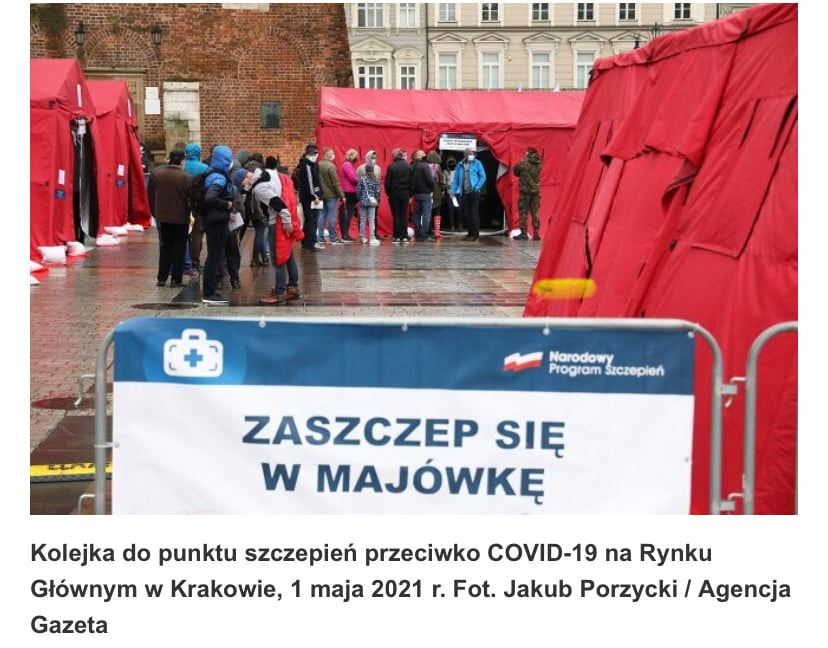  

Szczepienia jednak nie odbyły się na Śląsku, ludzie czekali sobie i jednak nie wyszczepili się - widocznie nie mają co robić z czasem/sobą.

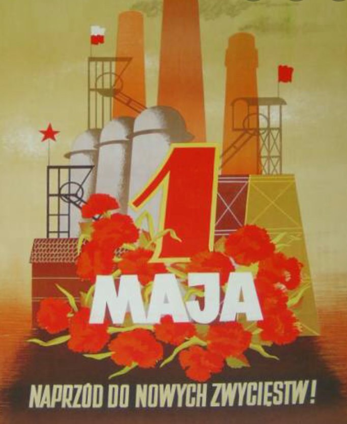  

### 2020

Liczba bezrobotnych w USA przekroczyła 30 milionów.

Liczba osób poszukujących pracy w Niemczech wzrosła o blisko 400 tysięcy.

---

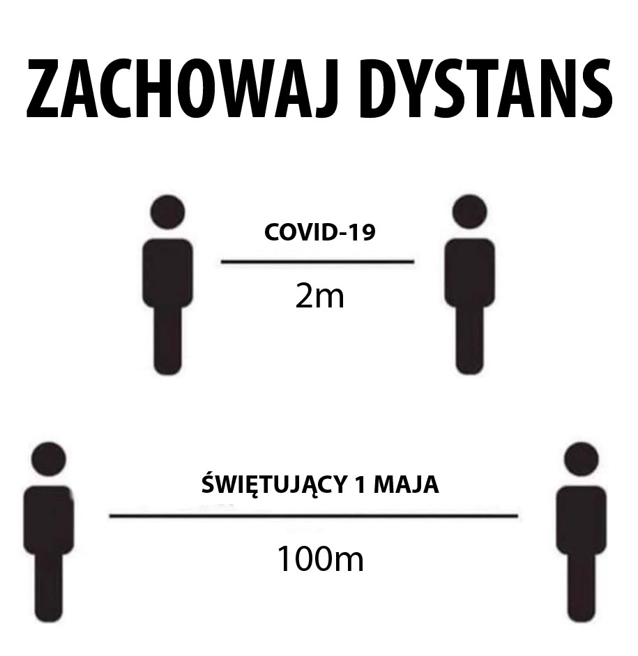  

---

Linux/Kernel

<a href="./documents/may/KnowHowKernel.pdf" target="_blank">KnowHowKernel.pdf</a>

<a href="./documents/may/KnowKT.pdf" target="_blank">KnowKT.pdf</a>

<a href="./documents/may/linux.pdf" target="_blank">linux.pdf</a>

<a href="./documents/may/linux24-nat.pdf" target="_blank">linux24-nat.pdf</a>

<a href="./documents/may/podst_pracy_w_konsoli.pdf.pdf" target="_blank">podst_pracy_w_konsoli.pdf.pdf</a>

<a href="./documents/may/sle_PL.pdf" target="_blank">sle_PL.pdf</a>

---

### 2004

Polska stała się pełnoprawnym członkiem Unii Europejskiej.

Polska złożyła wniosek o członkostwo w UE w dniu 8 kwietnia 1994 roku. Podczas szczytu Rady Europejskiej w Essen (9-10 grudnia 1994 r.) polski rząd potwierdził wolę przystąpienia do struktur europejskich i przyjął strategię przedakcesyjną.

W maju 1997 roku Sejm przyjął Narodową Strategię Integracji, która formułowała zadania stojące przed Polską na drodze do pełnego członkostwa w Unii Europejskiej oraz określała czas ich realizacji.

Negocjacje akcesyjne rozpoczęły się 31 marca 1998 roku. Pierwszym etapem było zbadanie zgodności prawa państw starających się o wejście do UE z prawem wspólnotowym. W drugiej fazie negocjacji, w oparciu o przeprowadzony przegląd ustawodawstwa państwa kandydujące przygotowały swoje stanowiska negocjacyjne w poszczególnych obszarach negocjacyjnych i przedkładały je aktualnej Prezydencji Unii Europejskiej .

Od 16 kwietnia 1999 r. zaczęły odbywać się regularne spotkania dyrektorów politycznych i korespondentów europejskich krajów stowarzyszonych i państw członkowskich UE w ramach dialogu politycznego. Polskim delegacjom przewodniczyli Jacek Saryusz-Wolski (w latach 1997-2001) i Danuta Hübner (w latach 2001-2004). Do 2000 roku Polska zakończyła 25 z 30 obszarów negocjacyjnych, 5 kolejnych zamknięto do 2002 roku.

Oficjalne zakończenie negocjacji nastąpiło podczas szczytu w Kopenhadze 13 grudnia 2002 roku.

Po podpisaniu w 2003 roku traktatu akcesyjnego, 9 kwietnia 2003 roku zgodę na jego podpisanie traktatu wyraził Parlament Europejski, a 14 kwietnia został przyjęty przez Radę Unii Europejskiej.

W dniach 7-8 czerwca 2003 roku odbyło się w Polsce ogólnonarodowe referendum, w którym 77,45% Polaków, którzy oddali swój głos, opowiedziało się za przystąpieniem Polski do Unii Europejskiej.

Piśmiennictwo: Oficjalna strona Prezydenta RP.

---

https://de.wikipedia.org/wiki/Erster_Mai

---

### 1991

https://en.wikipedia.org/wiki/Centesimus_annus

### 1987

  

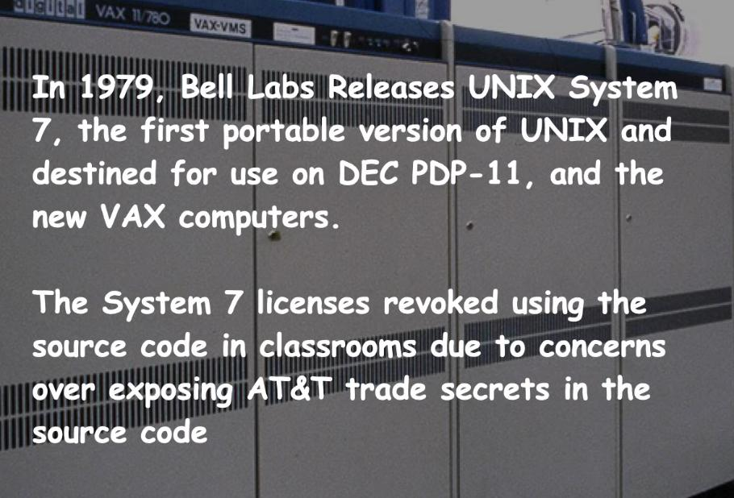  

  

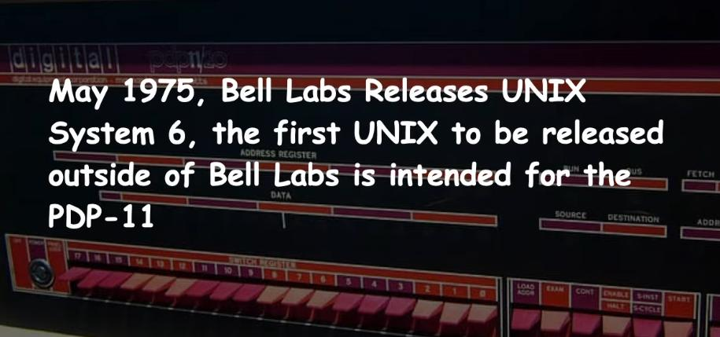  

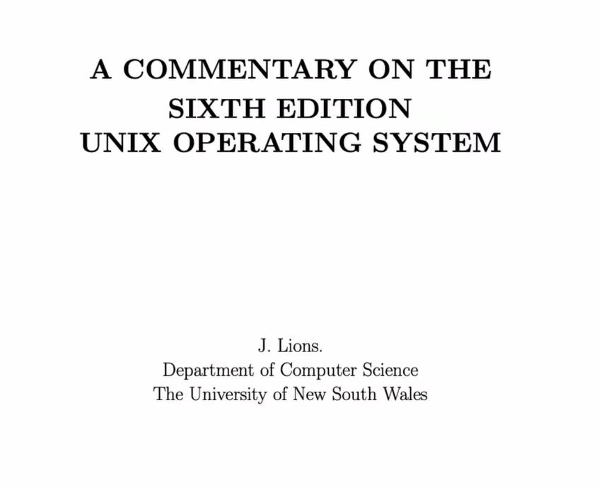  

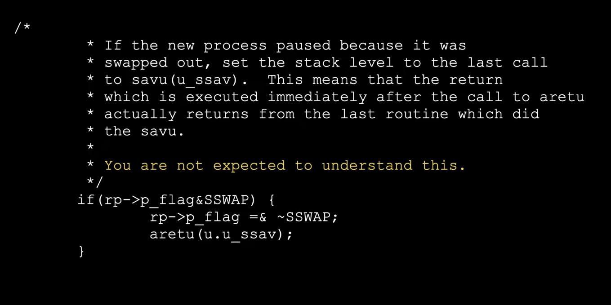  

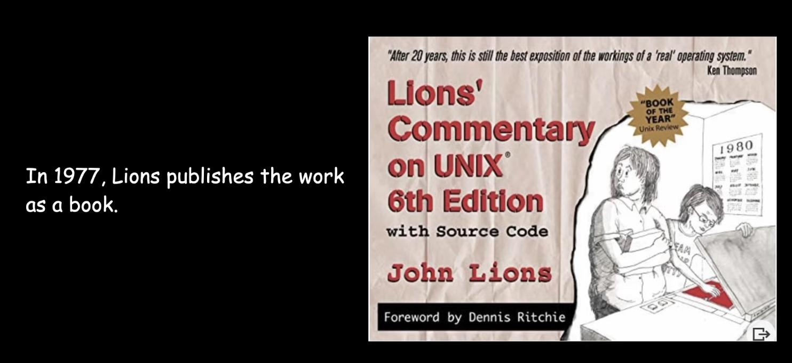  

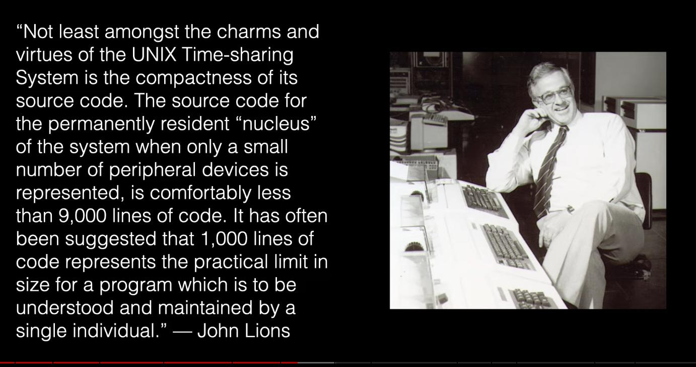  

  

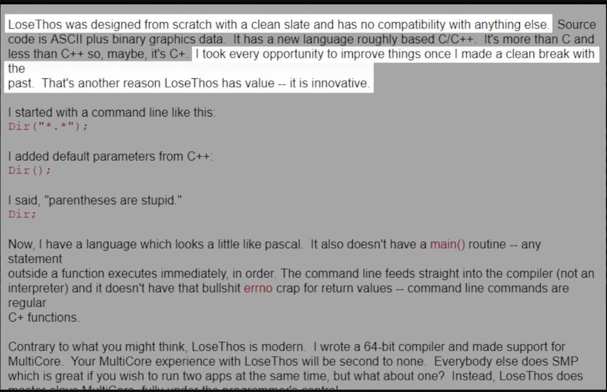  

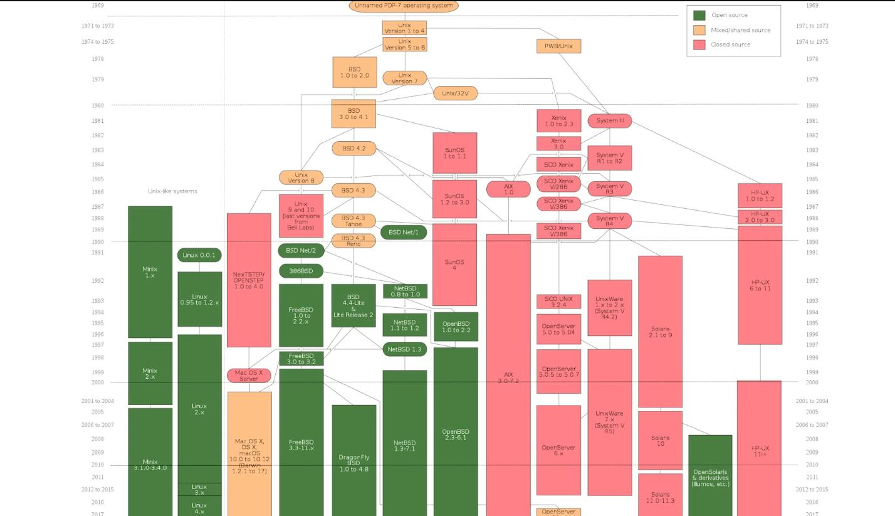  

### 1982

Na warszawskim Starym Mieście miała miejsce wielotysięczna demonstracja zorganizowana przez Niezależny Samorządny Związek Zawodowy Solidarność. Kolejna tego typu demonstracja odbyła się dwa dni później.

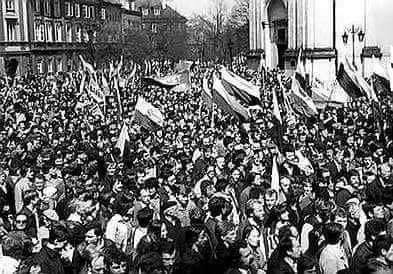  

### 1949

W Warszawie odbyły się główne obchody Święta Pracy. Nie byłoby pewnie w tym wydarzeniu nic szczególnie wartego uwagi, gdyby nie fakt, że na drodze do jego zrealizowania stanął prozaiczny, chociaż jak się później okazało bardzo istotny problem. Władza musiała stawić czoła brakowi materiału potrzebnego do uszycia odpowiedniej ilości flag i szturmówek oraz transparentów potrzebnych nie tylko na warszawskie uroczystości. Przyczyną tego dylematu były organizowane w grudniu 1948 roku uroczystości z okazji scalenia Polskiej Partii Socjalistycznej i Polskiej Partii Robotniczej. Na te właśnie obchody władza zamówiła 600 tysięcy metrów kwadratowych tkanin, a już drugie tyle zamówiły komitety organizacyjne święta 1. Maja.
Inną ciekawostką związaną z tym dniem jest incydent, który miał miejsce podczas szczecińskich obchodów Święta Pracy. Jeden z chłopów biorących udział w pochodzie wiózł na taczkach dwa pełne worki z napisami »podatek« i malutki z napisem »to dla biednego chłopa«. Organizatorzy szybko zwrócili na to uwagę, co spowodowało wystąpienie z maszerującego szeregu innych chłopów, którzy zaczęli krzyczeć " Nie chcecie, abyśmy pokazali prawdę".

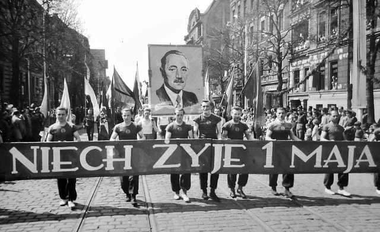  

---

### 1948

https://pl.wikiquote.org/wiki/Tomasz_Turowski

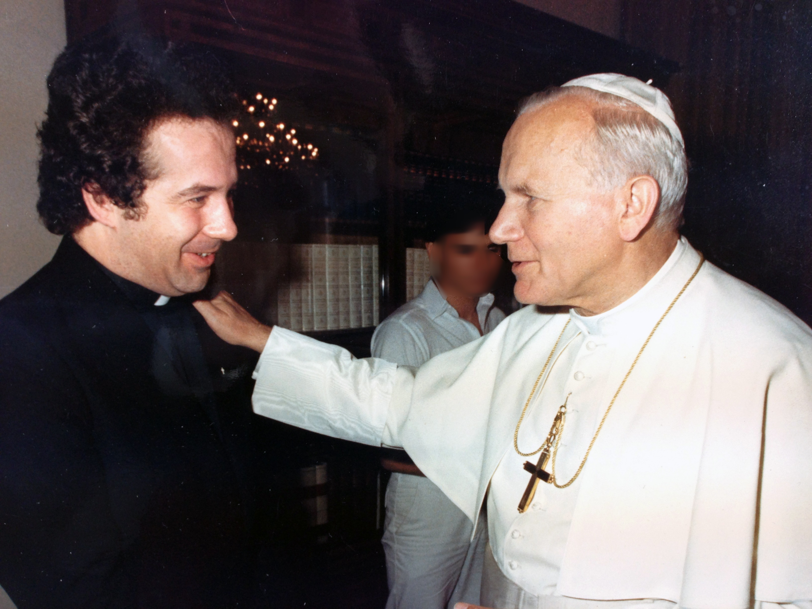  

### 1945

https://pl.wikipedia.org/wiki/Magda_Goebbels

### 1941

On Red Square tells a different story than the one russia is trying to tell on May 9, 2023. The footage below shows a different military parade and shows the guests that the current russian rulers wish were not there. The footage shows the Soviet People’s Commissar of Defense greeting special guests - a high ranking military delegation of Nazi Germany whom Stalin is trying to impress.

Let’s remember what happened about two years earlier. The Molotov-Ribbentrop Pact, called the “Treaty of Non-Aggression between Germany and the USSR”, was signed on August 23, 1939. The pact gave Germany the confidence it wanted, and it invaded Poland a week later, on September 1, 1939. The Soviet Union then invaded Poland on September 17, 1939.

World War II started. Far from a victim, in the early days of the war, the Soviet version of the russian colonial empire was the enabler and a willing participant in the aggression until Hitler turned farther east in June 1941. Russian invasion of Ukraine and the current nine-year war is the continuation of the same colonial policies and of the same fascist mindset.

World War II brought massive devastation and suffering, including to the Soviet Union, and the Soviet Union was a key contributor to the victory in World War II. But russia today wants everyone to forget that Ukraine suffered from World War II enormously, with casualties and destruction among the highest in the former Soviet Union and with more Ukrainian civilians killed than Russian, and that 1.7 million of Ukrainian servicemen died fighting Nazis. In recognition of Ukraine’s contribution to the victory in World War II, Ukraine (apart from the Soviet Union) became a founding member of the United Nations in 1945.

By various estimates, 5-7 million people living at the time in Ukraine died in World War II, 700 cities and 28,000 villages were destroyed, the material losses amounted to an estimated 40% of Ukraine’s national wealth (data from Encyclopedia Britannica; other sources put Ukraine’s casualties even higher). Russia today would rather not have anyone remember that, and invokes the horrors of World War II to justify the horrors it has brought to the people of Ukraine in this war, and to fool its own people into dying for and living under tyranny because of a made-up “threat”.

With limited space, this note does not address the events preceding 1939, including the disastrous and shameful policies of appeasement pursued by Western powers leading to the 1938 Munich Agreement under which they thought they “bought” peace for themselves at the expense of Czechoslovakia. Decision makers should remember history and not make the same devastating mistakes today - appeasement never works.

Watch the footage from May 1, 1941.

<video width="640" height="480" controls>
<source src="./movies/may/russia1941.mp4" type="video/mp4">
Your browser does not support the video tag.
</video>

### 1940

Pismo konspiracyjne "Polska Żyje!" opublikowało 10-punktowy Dekalog Obywatelski. W pierwszych dwóch punktach zapisano:

1) Twoim językiem ojczystym jest język polski. Nie masz się uczyć pod batem języka wroga. A jeśli znasz jego mowę, nie używaj jej. Nie ułatwiaj najeźdźcy nieproszonego pobytu w twej ojczyźnie. Na wszelkie zapytania odpowiadaj po polsku "Nie rozumiem". Nie wolno ci wskazywać wrogowi adresu ani drogi (chyba fałszywie). Pohamuj wrodzoną polską uprzejmość i gościnność: Niemiec i bolszewik to nie gość ani turysta.

2) Hańbą jest wywieszenie dwujęzycznych szyldów i ogłoszeń. Hańbą jest reklamowanie się w gadzinowych pismach polskich i niemieckich. Uczciwy Polak omija takie lokale i firmy. Należny bojkotować wydawnictwa, książki i mapy niemieckie. Nie wolno kupować gazet wrogich, szczególnie szmatławca, który ulica warszawska nazwała Kur-Warem.

Grafika; niemiecki polskojęzyczny dziennik informacyjno-propagandowy Kurier Warszawski wydawany przez władze okupacyjne Generalnego Gubernatorstwa.

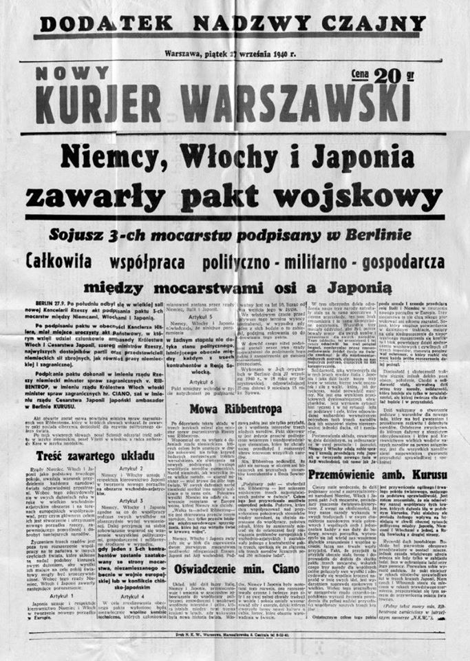  

### 1939

Krystyna Skarbek aka Christine Granville, was born in Trzepnica.
She was a Polish agent of the British Special Operations Executive (SOE) during the Second World War. She became celebrated for her daring exploits in intelligence and irregular-warfare missions in Nazi-occupied Poland and France. Journalist Alistair Horne, who described himself in 2012 as one of the few people still alive who had known Skarbek, described her as the "bravest of the brave."
Thanks to her, British knew the approximate date of #OperationBarbarossa. She was once called #Churchill’s favourite spy.

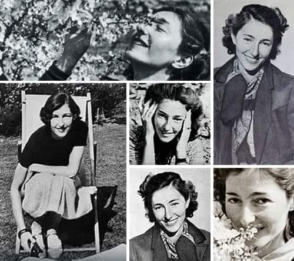  

### 1932

https://en.wikipedia.org/wiki/Donald_Kagan

### 1906

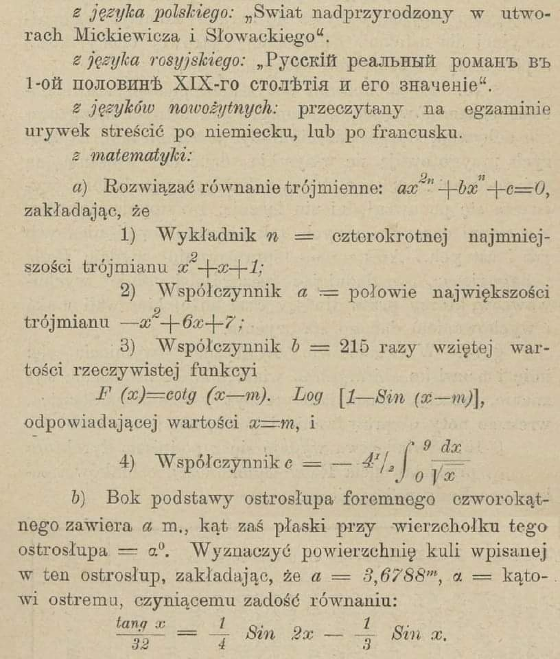  

### 1905

Odbyła się w Warszawie wielka manifestacja robotnicza. Wojska rosyjskie brutalnie rozprawiły się z protestującymi ludźmi.
Aleje Jerozolimskie zostały nagle ostrzelane
bez ostrzeżenia przez wojsko. Pierwsze rzędy
zostały zdziesiątkowane, pozostali rzucili się
w popłochu do ucieczki, gonieni przez
żołnierzy i policjantów. Zginęło 37 osób,
kilkadziesiąt zostało rannych.

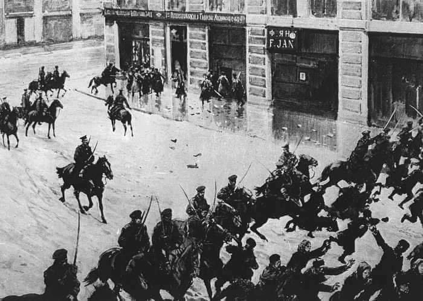  

### 1889

1 maja obchodzimy Międzynarodowe Święto Pracy.

Święto zostało ustanowione w 1889 r. na pierwszym kongresie Drugiej Międzynarodówki, który to miał miejsce w Paryżu. Miało ono upamiętniać masakrę robotników, do której doszło w 1886 r w, Chicago (Stany Zjednoczone) podczas demonstracji przeciw złym warunkom pracy, a w szczególności przeciw zbyt długiemu czasowi pracy. W Polsce pierwsze obchody Święta Pracy miały miejsce już w 1890 r. i były zorganizowane (wbrew zaborcom) przez działaczy Socjalno-Rewolucyjnej Partii Proletariat. Późniejsze obchody święta również inicjowane były głównie przez partie i organizacje socjalistyczne. Po II Wojnie Światowej święto obchodzono bardzo hucznie poprzez organizowanie różnego rodzaju pochodów, wieców i spotkań, podczas których eksponowano hasła o treści politycznej i ideologicznej. Uczestnictwo w pochodach było nierzadko wymuszane przez szkoły, czy zakłady pracy.

Po 1989 r. obchody Święta Pracy stały się mniej popularne, co wynika zapewne nie z samej niechęci do podstawowej idei święta, ale raczej do związanej z nim otoczki polityczno-ideologicznej.

Ze względu na bliskość Święta Konstytucji 3 Maja do Święta Pracy, z których oba są ustawowo dniami wolnymi od pracy, jest to świetna okazja do kilkudniowego wypoczynku, czyli przysłowiowej majówki. Przy sprzyjającym układzie dat w kalendarzu wystarczy wziąć jeden lub dwa dni urlopu i otrzymujemy najdłuższy wolny od pracy weekend w roku.

W Kościele katolickim 1 maja obchodzone jest wspomnienie św. Józefa Rzemieślnika.

### 1808

Na terenie Księstwa Warszawskiego i Wolnego Miasta Gdańska wszedł w życie Kodeks Napoleoński.
Na mocy tego prawa utworzonego cztery lata wcześniej we Francji utrzymana została kara śmierci, ograniczone zostały prawa kobiet, w szczególności dotyczące ich praw w związku małżeńskim. Przykładowo, mąż mógł żądać rozwodu, gdy żona cudzołożyła, lecz jeśli dopuszczał się tego mąż, żona miała prawo do rozwodu tylko wtedy, gdy kochanka była utrzymywana we wspólnym domu małżonków; kobieta pozostawała przez całe życie pod opieką najbliższego męskiego krewnego lub męża i nie mogła rozporządzać swoim majątkiem ani majątkiem małżeńskim; mężowi została powierzona rola wychowania potomstwa.

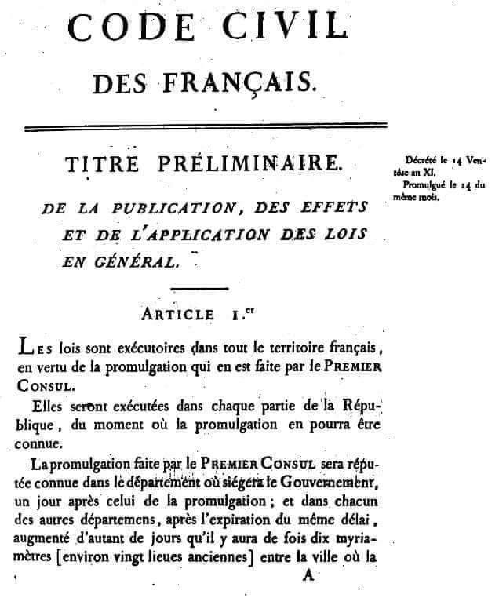  

---

<a href="https://github.com/TomaszWaszczyk/historia.waszczyk.com/edit/master/src/content/may-1.md" target="_blank">Edytuj tę stronę dzieląc się własnymi notatkami!</a>
