### 2020

W weekend weszło w życie nowe rozporządzenie w sprawie przekazywania danych spisu wyborców gminnej obwodowej komisji wyborczej oraz operatorowi wyznaczonemu w związku z przeprowadzeniem wyborów na Prezydenta RP.

---

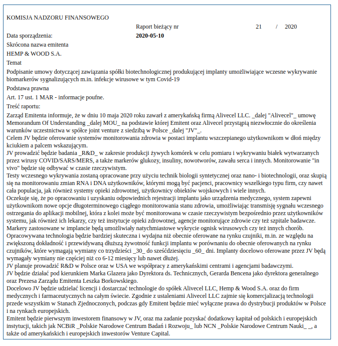  

---

"O ponad 40 proc. spadł udział miasta w podatku PIT, a o 52 proc. w podatku CIT" - poinformował stołeczny ratusz.

Zdaniem prezydenta miasta Rafała Trzaskowskiego tak duży i nagły spadek jest "całkowicie niezrozumiały". "Dlatego wspólnie z innymi samorządami będziemy domagać się od rządu pilnych wyjaśnień" - podkreślił.

---

Stało się coś, czego jeszcze nie było. Nie odbyły się zarządzone wybory prezydenckie. Odebrano nam prawo do wyboru prezydenta. Zlikwidowano możliwość realizacji podstawowego prawa obywatelskiego.

Sprawców tej sytuacji musi spotkać odpowiedzialność karna. O tym innym razem.

Jednocześnie wieczorem Państwowa Komisja Wyborcza wydała uchwałę "w sprawie twierdzenia braku możliwości głosowania na kandydatów w wyborach Prezydenta Rzeczypospolitej Polskiej".

Dokument ten też nie ma precedensu.

PKW stwierdza, że nie było dziś możliwości głosowania na kandydatów (no fakt, nie było takiej możliwości). Wyprowadza jednak z tego wniosek, że skutki tej sytuacji są równoważne jak "w przypadku braku kandydatów" (art. 293 § 3 Kodeksu wyborczego).

Zauważmy, że PKW nie stwierdza, czy kandydaci byli czy nie, lecz pisze, jakie są skutki innej sytuacji faktycznej - są one takie jak gdyby nie było kandydatów.

Co istotne, w art. 293 Kodeksu wyborczego określone są 2 sytuacje, w których PKW mogłaby wydać tego typu uchwałę:

- gdy głosowanie miałoby być przeprowadzone tylko na jednego kandydata,
- w przypadku braku kandydatów.

O żadnej z tych sytuacji nie ma mowy w treści uchwały! A sytuacja faktyczna była przecież taka, że kandydaci w tych wyborach byli...

Czyli PKW stwierdziła coś, co jest nieistotne z punktu widzenia przytoczonego przepisu i nie stwierdziła zaistnienia stanu faktycznego, o jakim mówi ten przepis.

W uchwale jest też mowa o tym, jakie są dalej idące "skutki" tego, że nie można było głosować na kandydatów. Te "skutki" to możliwość zarządzenia nowych wyborów, co określa art. 293 § 2 k.w.: "Marszałek Sejmu ponownie zarządza wybory nie później niż w 14 dniu od dnia ogłoszenia uchwały Państwowej Komisji Wyborczej w Dzienniku Ustaw".

Niestety, PKW nie ma żadnej kompetencji, by przesądzać, jakie są skutki podjętej przez siebie uchwały. Stwierdzenie to jest niewiążące dla Marszałka Sejmu, tym bardziej, że w uchwale nie została wskazana żadna okoliczność faktyczna, która uzasadniałaby zaktualizowanie się kompetencji do zarządzenia nowych wyborów prezydenckich.

Teraz Marszałek Sejmu musi sama ocenić, czy w zaistniałym stanie faktycznym zachodzą przesłanki do zarządzenia nowych wyborów. Zachodzą, jeśli był tylko 1 kandydat albo nie było żadnego. Oczywiście żadna z tych sytuacji nie nastąpiła, bo kandydaci byli. Żadnej z tych sytuacji nie stwierdziła też PKW.

Decyzja Marszałek obciąża ją i tylko ją za ewentualne zarządzenie wyborów bez podstawy prawnej. "Podkładka" wydana przez PKW nie ma w tym zakresie znaczenia prawnego.

Odebranie nam możliwości głosowania na kandydatów w sytuacji, gdy kandydaci ci byli wskazani i gotowi do udziału w wyborach, nie aktualizuje żadnej nowej kompetencji Marszałka. Nie jest to bowiem ani sytuacja 1 kandydata, ani sytuacja braku kandydatów, o których mówi Kodeks wyborczy. Rozpisanie nowych wyborów nie jest możliwe.

Ta uchwała jest po prostu nie na temat.

Słowem: obiektywnie rzecz biorąc uchwała PKW wypełniła "pakt" polityczny Jarosława Kaczyńskiego i Jarosława Gowina. Przypomnijmy, że chodziło w nim o jak najszybsze rozpisanie nowych wyborów.

Prawnie jest to jednak krok bezskuteczny.

---

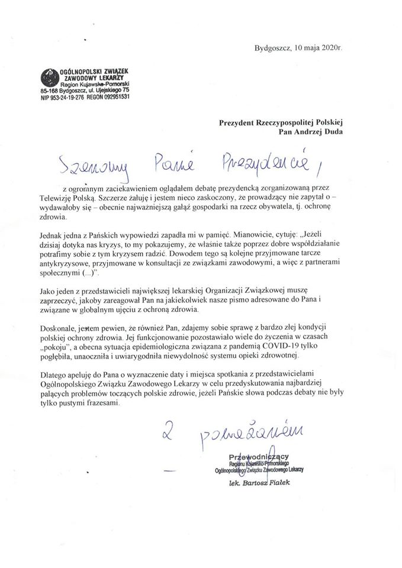  

---

Fun fact on Bitcoin - there are less BTC in existence (max. 21 million) than USD millionaires in the world (2019: 47 million).

---

> "By wprowadzić dyktaturę konieczne jest odczlowieczenie mas, by jeden czlowiek został ich boskim panem.Myslenie i dzialanie, najbardziej charakterystyczne cechy czlowieka jako takiego, stałybyby się wyłącznym przywilejem jednej osoby" - L.von Mises

### 1978

W Emilcinie w woj. lubelskim miało miejsce wydarzenie, które do dziś budzi spore emocje. Miało tam miejsce rzekome lądowanie UFO.
Wracający do domu wozem konnym z pola Jan Wolski, ujrzał na drodze
dwie dziwne postaci. Istoty były niewysokie
(1,4-1,5 m wzrostu), miały oliwkowozielone
twarze, skośne oczy i wystające kości
policzkowe. Ich ciała pokrywał czarny
kombinezon, odsłaniający tylko twarze i
dłonie. Na karku mieli swego rodzaju
wybrzuszenia przypominające garby, zaś
ich palce połączone były błoną pławną.
Wydarzenie to od dawna jest przedmiotem badań i rozważań naukowców,budzi kontrowersje, a nawet uśmiechy politowania.
Ówczesne władze nie umiały poradzić sobie z tą sprawą, a samego Wolskiego potraktowały serią przesłuchań na komendzie MO i badaniami psychiatrycznymi.

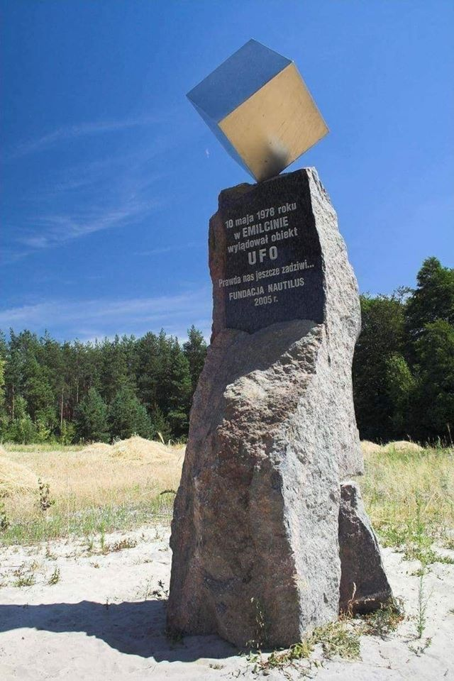  

### 1943

Konspiracyjny dziennik popołudniowy Dzień Warszawy opublikował wiersz Juliana Tuwima pod tytułem "Lekcja"

Ucz się, dziecko, polskiej mowy:

To przed domem - to są groby,

Małe groby, wielki cmentarz,

Taki jest twój elementarz.

Ustawiły się w szeregu

Czarne krzyże w brudnym śniegu.

Na Warszawie mrok żałoby,

Ucz się pięknej polskiej mowy.

Pod zwaloną kamienicą

Leży upiór z upiorzycą,

Wyją żółte upiorzęta...

Zapamiętasz... Zapamiętam

Nocą gniewnie przez sen krzyczysz,

Straszne ptaki w niebie liczysz,

Rano - w ziemi rozoranej

Szukasz piąstki oderwanej.

Ucz się mogił, gruzów ucz się.

Z upiorami siądź przy uczcie.

W świat potężny, w świat plugawy

Pieśń warszawskich dzieci zawyj!

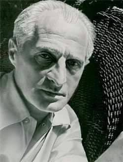  

---

W 1933 obiecał Niemcom; „Dajcie mi 10 lat a nie rozpoznacie Niemiec!”
Faktycznie...

10 Maja 1943 roku, kanclerz Rzeszy Adolf Hitler, przedłużył na czas nieokreślony Akt Upoważniający z 1933, potwierdzający dekrety nadane w tymże akcie 23 Marca 1933 przez Reichstag.
Akt Upoważniający został stworzony wedle konstytucji i podpisany przez prezydenta Rzeszy Paula Von Hindenburga jako akt stanu wyjątkowego po pożarze Reichstagu w Lutym 1933 roku.
W ciągu jednego posiedzenia 23 Marca zniesiono prawo wypowiadania się, publikacji, krytyki władzy, wolności głoszenia przekonań politycznych i działania i przynależności związków zawodowych.
W ciągu jednej nocy, Rzesza stała się państwem policyjnym z władzą dyktatorską.
Przedłużenie Aktu 10 Maja 1943 nastąpiło nielegalnie, albowiem Führer nigdy nie zwołał posiedzenia Reichstagu co było niezbędne do jego zalegalizowania, i sam sobie przekazał władzę całkowitą.
Akt został unieważniony przez władze okupacyjne 20 września 1945, pozbawiając w ten sposób legalnie władzy prezydenta Rzeszy Admirała Dönitza, i nie ma dziś podobnego zapisu w konstytucji Niemieckiej; ażeby podobna sytuacja nigdy już nie miała miejsca.
Czy Reichstag i wszyscy ludzie poszli by w 1943 za Hitlerem równie ochoczo co w 1933?
Raporty Głównego Urzędu Bezpieczeństwa Rzeszy wydziału III Służby Bezpieczeństwa SD wywiadu wewnętrznego, mogą wskazywać, ze gdyby mieli wybór nie byłoby to aż tak jasne. Na początku stycznia 43’ zaczęto odnotowywać pierwsze poważne niepokoje społeczne, niezadowolenie, i obawy. Po katastrofie Stalingradzkiej, kapitulacji Afryki i codziennych bombardowaniach, ciężko było znaleść w Niemczech kogokolwiek nie dotkniętego jeszcze wojną, kogoś kto nie straciłyby kogoś z przyjaciół bądź znajomych, lub samej rodziny.
Tak czy owak, Fuhrer jeszcze przez 2 lata sprawował swój urząd, bynajmniej nie obalony przez własne społeczeństwo.

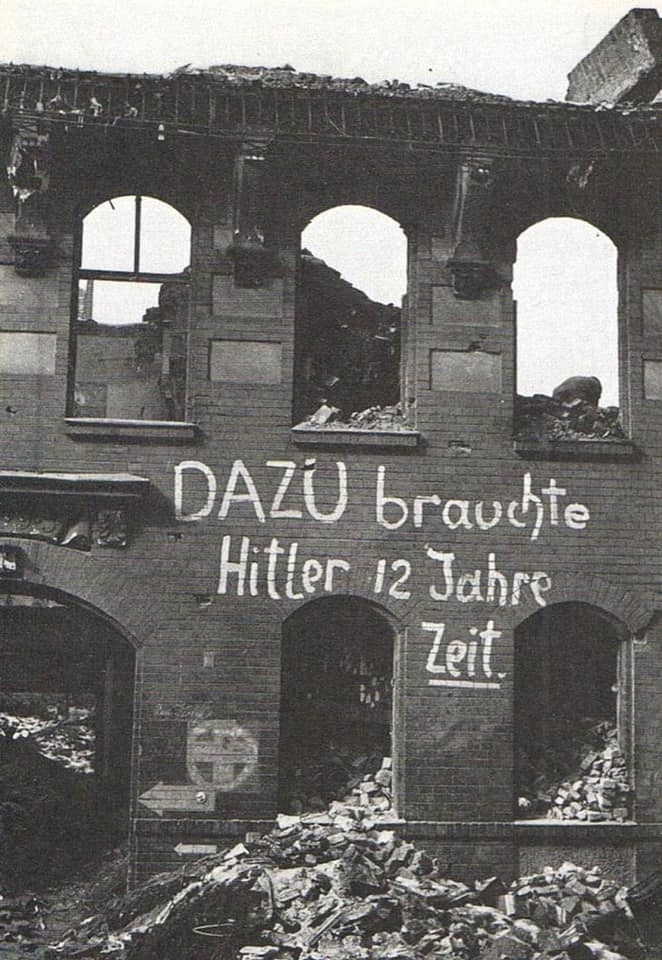  

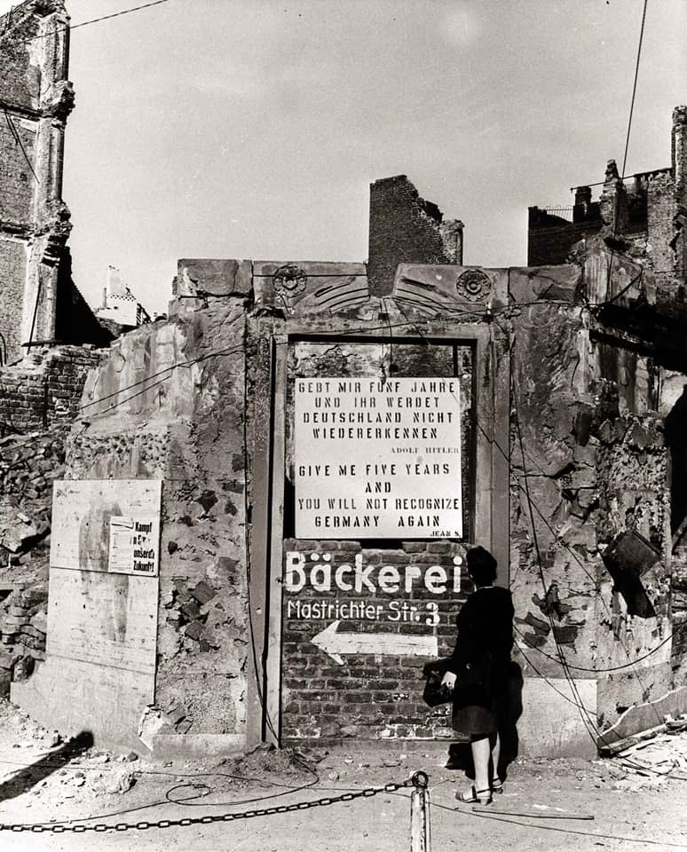  

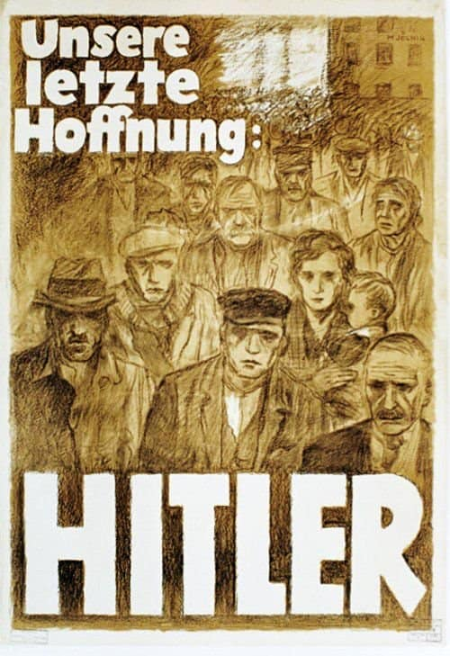  

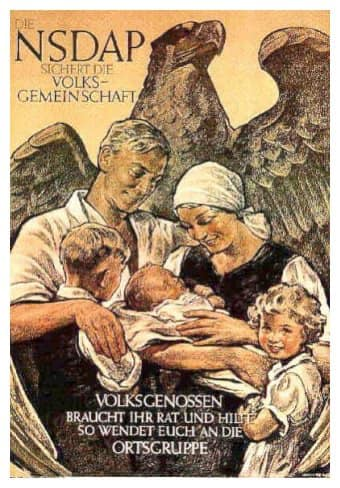  

### 1941

Sąd Związku Radzieckiego zamienił Ryszardowi Kaczorowskiemu (zdjęcie) wyrok śmierci na karę 10 lat zsyłki na Kołymę i pobytu w łagrach.
Kaczorowski był w czasie okupacji komendantem chorągwi Szarych Szeregów. Został aresztowany przez NKWD 17 czerwca 1940 roku pod zarzutem prowadzenia tajnej działalności, a następnie osadzony w więzieniach w Białymstoku i Mińsku.
Wypuszczony z więzienia po wejściu w życie układu Sikorski-Majski, w marcu 1942 roku zasilił szeregi tworzonej w ZSRR przez gen. Władysława Andersa Armii Polskiej i wyszedł wraz z nią do Palestyny. Jako żołnierz 2. Korpusu w Batalionie Łączności 3. Dywizji Strzelców Karpackich walczył w kampanii włoskiej, pełniąc podczas bitwy pod Monte Cassino funkcję dowódcy ośrodka łączności 2. Brygady Strzelców Karpackich.

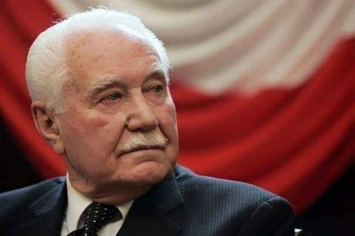  

### 1936

Szaleństwo wojny domowej w Hiszpanii. Wyrzucanie z trumien zmarłych, bezczeszczenie zwłok, niszczenie obiektów kultu religijnego, terror, samosądy i wiele innych. Na zdjęciach żołnierze strony republikańskiej i ich dzieło

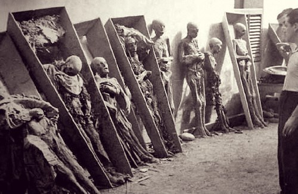  

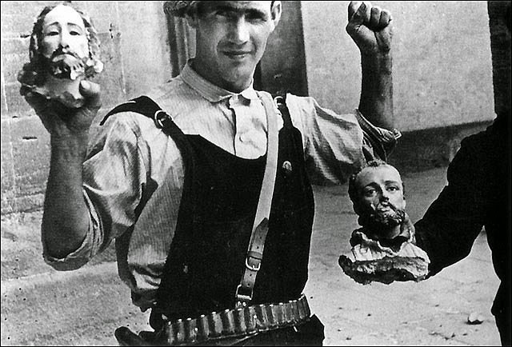  

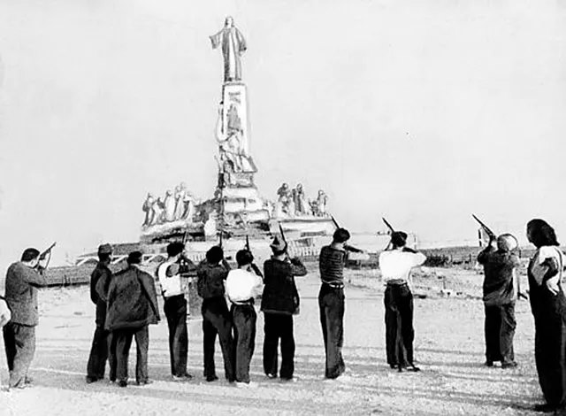  

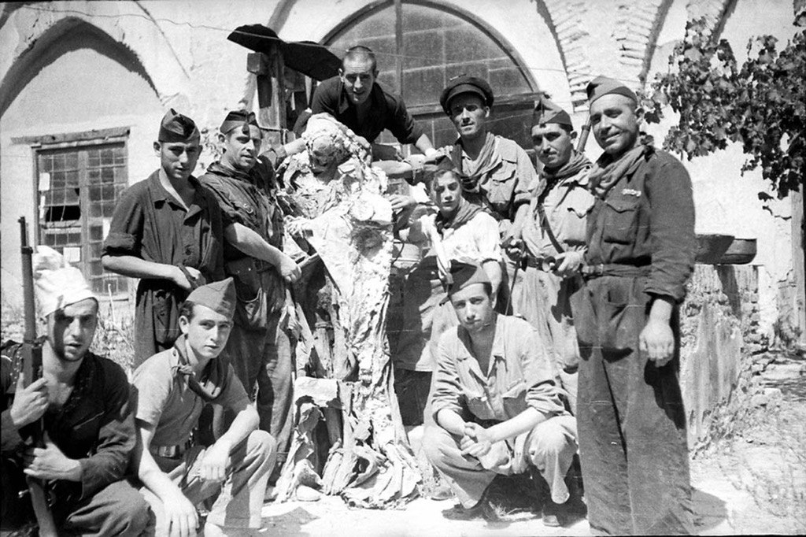  

### 1934

W Gorkach pod Moskwą zmarł Wacław Miężyński - wysoki funkcjonariusz policji politycznej i bezpieczeństwa, zastępca szefa Czeka Feliksa Dzierżyńskiego, szef Zjednoczonego Państwowego Zarządu Politycznego OGPU w latach 1926–1934. Polak z pochodzenia. Z wykształcenia był prawnikiem. Po przejęciu władzy przez bolszewików zajmował ważne stanowiska w państwie m.in. był konsulem generalnym w Berlinie, kierownikiem Narkomatu Finansów. Od 1919 roku zasiadał w kierownictwie ZCzK - w tym czasie do jego zadań należało kierowanie masowymi akcjami represyjnymi wobec zbrojnej opozycji antybolszewickiej. Po powstaniu OGPU został jego vice-przewodniczącym, a po śmierci Dzierżyńskiego w 1926 roku - przewodniczącym. Od 1927 roku był członkiem KC WKP (b) Wg. sowieckich źródeł został podstępnie zamordowany na polecenie hersztów antybolszewickich, kontrewolucyjnego bloku prawicowo-trockistowskiego.

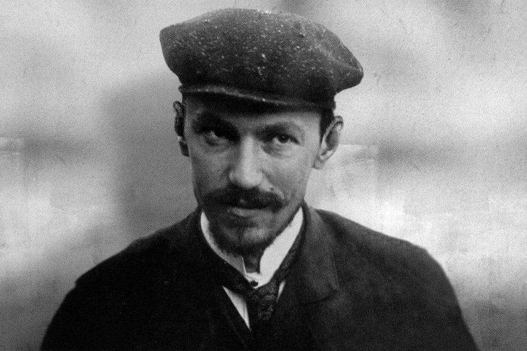  

### 1926

Powstał trzeci rząd Wincentego Witosa stworzony z koalicji PSL "Piast", Związku Ludowo-Narodowego, Chrześcijańskiej Demokracji i Narodowej Partii Robotniczej.
Rząd Witosa nie przetrwał długo, ponieważ już cztery dni później w skutek przewrotu majowego przeprowadzonego przez Józefa Piłsudskiego.

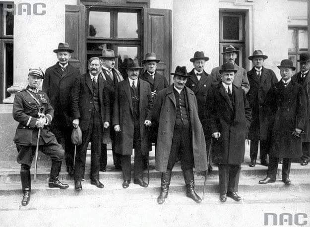  

### 1794

Z inicjatywy naczelnika Tadeusza Kościuszki (grafika) powołana została do życia Rada Najwyższa Narodowa. Był to organ centralnej władzy cywilnej w czasie powstania kościuszkowskiego, w skład którego wchodziło osiem wydziałów, z których każdy miał do wypełnienia odpowiednie zadania.
Na czele Wydziału Porządku stanął podstoli Alojzy Sulistrowski. Wydziałem Bezpieczeństwa kierował generał Tomasz Wawrzecki. Wydziałem Sądownictwa Franciszek Myszkowski. Wydziałem Skarbu Hugo Kołłątaj. Na czele Wydziału Żywności stał chorąży poznański Ignacy Wyssygota Zakrzewski. Szefem Wydziału Potrzeb Wojskowych był generał major Stanisław Wielowiejski. Wydziałem Interesów Zagranicznych kierował były członek Komisji Edukacji Narodowej Narodowej Ignacy Potocki. Zaś szefem Wydziału Instrukcji Narodowej był nadworny lekarz króla Stanisława Augusta Jan Dominik Jaśkiewicz.
Zamiar przystąpienia do Rady wyraził również sam wspomniany wyżej władca, który zadeklarował, iż "ojczyzny i narodu nie odstąpi". Kościuszko jednak nie wyraził na to zgody.

  

### 1789

Francuski pionier lotów baloniarskich Jean Pierre Blanchard (grafika) odbył pierwszy lot nad Polską.
Francuz przybyły do Polski na zaproszenie króla Stanisława Augusta Poniatowskiego wystartował z ogrodu Foksal w Warszawie, by po 49 minutach wylądować w Białołęce. Udało mu się osiągnąć pułap dwóch kilometrów wysokości.

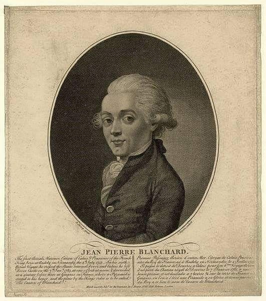  

---

<a href="https://github.com/TomaszWaszczyk/historia.waszczyk.com/edit/master/src/content/may-10.md" target="_blank">Edytuj tę stronę dzieląc się własnymi notatkami!</a>
