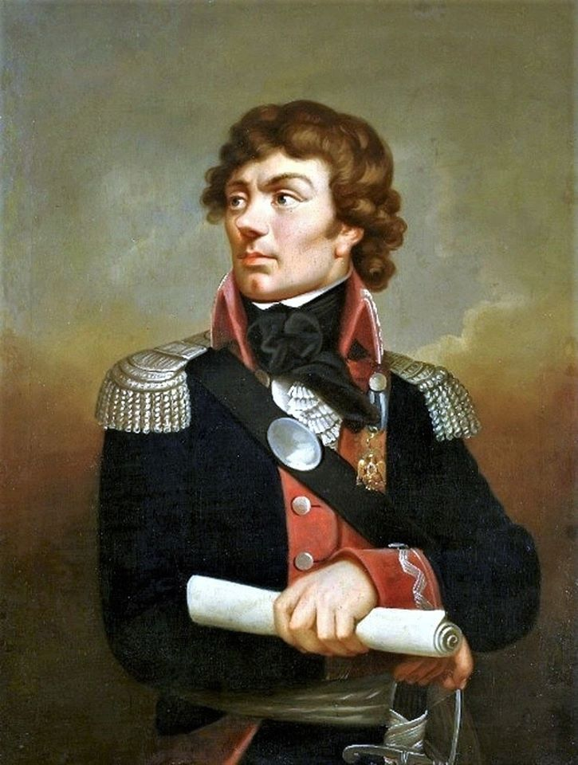

### 2020

  

### 1978

W Emilcinie w woj. lubelskim miało miejsce wydarzenie, które do dziś budzi spore emocje. Miało tam miejsce rzekome lądowanie UFO.
Wracający do domu wozem konnym z pola Jan Wolski, ujrzał na drodze
dwie dziwne postaci. Istoty były niewysokie
(1,4-1,5 m wzrostu), miały oliwkowozielone
twarze, skośne oczy i wystające kości
policzkowe. Ich ciała pokrywał czarny
kombinezon, odsłaniający tylko twarze i
dłonie. Na karku mieli swego rodzaju
wybrzuszenia przypominające garby, zaś
ich palce połączone były błoną pławną.
Wydarzenie to od dawna jest przedmiotem badań i rozważań naukowców,budzi kontrowersje, a nawet uśmiechy politowania.
Ówczesne władze nie umiały poradzić sobie z tą sprawą, a samego Wolskiego potraktowały serią przesłuchań na komendzie MO i badaniami psychiatrycznymi.

  

### 1943

Konspiracyjny dziennik popołudniowy Dzień Warszawy opublikował wiersz Juliana Tuwima pod tytułem "Lekcja"

Ucz się, dziecko, polskiej mowy:
To przed domem - to są groby,
Małe groby, wielki cmentarz,
Taki jest twój elementarz.
Ustawiły się w szeregu
Czarne krzyże w brudnym śniegu.
Na Warszawie mrok żałoby,
Ucz się pięknej polskiej mowy.
Pod zwaloną kamienicą
Leży upiór z upiorzycą,
Wyją żółte upiorzęta...
Zapamiętasz... Zapamiętam
Nocą gniewnie przez sen krzyczysz,
Straszne ptaki w niebie liczysz,
Rano - w ziemi rozoranej
Szukasz piąstki oderwanej.
Ucz się mogił, gruzów ucz się.
Z upiorami siądź przy uczcie.
W świat potężny, w świat plugawy
Pieśń warszawskich dzieci zawyj!

  

### 1941

Sąd Związku Radzieckiego zamienił Ryszardowi Kaczorowskiemu (zdjęcie) wyrok śmierci na karę 10 lat zsyłki na Kołymę i pobytu w łagrach.
Kaczorowski był w czasie okupacji komendantem chorągwi Szarych Szeregów. Został aresztowany przez NKWD 17 czerwca 1940 roku pod zarzutem prowadzenia tajnej działalności, a następnie osadzony w więzieniach w Białymstoku i Mińsku.
Wypuszczony z więzienia po wejściu w życie układu Sikorski-Majski, w marcu 1942 roku zasilił szeregi tworzonej w ZSRR przez gen. Władysława Andersa Armii Polskiej i wyszedł wraz z nią do Palestyny. Jako żołnierz 2. Korpusu w Batalionie Łączności 3. Dywizji Strzelców Karpackich walczył w kampanii włoskiej, pełniąc podczas bitwy pod Monte Cassino funkcję dowódcy ośrodka łączności 2. Brygady Strzelców Karpackich.

  

### 1934

W Gorkach pod Moskwą zmarł Wacław Miężyński - wysoki funkcjonariusz policji politycznej i bezpieczeństwa, zastępca szefa Czeka Feliksa Dzierżyńskiego, szef Zjednoczonego Państwowego Zarządu Politycznego OGPU w latach 1926–1934. Polak z pochodzenia. Z wykształcenia był prawnikiem. Po przejęciu władzy przez bolszewików zajmował ważne stanowiska w państwie m.in. był konsulem generalnym w Berlinie, kierownikiem Narkomatu Finansów. Od 1919 roku zasiadał w kierownictwie ZCzK - w tym czasie do jego zadań należało kierowanie masowymi akcjami represyjnymi wobec zbrojnej opozycji antybolszewickiej. Po powstaniu OGPU został jego vice-przewodniczącym, a po śmierci Dzierżyńskiego w 1926 roku - przewodniczącym. Od 1927 roku był członkiem KC WKP (b) Wg. sowieckich źródeł został podstępnie zamordowany na polecenie hersztów antybolszewickich, kontrewolucyjnego bloku prawicowo-trockistowskiego.

  

### 1926

Powstał trzeci rząd Wincentego Witosa stworzony z koalicji PSL "Piast", Związku Ludowo-Narodowego, Chrześcijańskiej Demokracji i Narodowej Partii Robotniczej.
Rząd Witosa nie przetrwał długo, ponieważ już cztery dni później w skutek przewrotu majowego przeprowadzonego przez Józefa Piłsudskiego.

  

### 1794

Z inicjatywy naczelnika Tadeusza Kościuszki (grafika) powołana została do życia Rada Najwyższa Narodowa. Był to organ centralnej władzy cywilnej w czasie powstania kościuszkowskiego, w skład którego wchodziło osiem wydziałów, z których każdy miał do wypełnienia odpowiednie zadania.
Na czele Wydziału Porządku stanął podstoli Alojzy Sulistrowski. Wydziałem Bezpieczeństwa kierował generał Tomasz Wawrzecki. Wydziałem Sądownictwa Franciszek Myszkowski. Wydziałem Skarbu Hugo Kołłątaj. Na czele Wydziału Żywności stał chorąży poznański Ignacy Wyssygota Zakrzewski. Szefem Wydziału Potrzeb Wojskowych był generał major Stanisław Wielowiejski. Wydziałem Interesów Zagranicznych kierował były członek Komisji Edukacji Narodowej Narodowej Ignacy Potocki. Zaś szefem Wydziału Instrukcji Narodowej był nadworny lekarz króla Stanisława Augusta Jan Dominik Jaśkiewicz.
Zamiar przystąpienia do Rady wyraził również sam wspomniany wyżej władca, który zadeklarował, iż "ojczyzny i narodu nie odstąpi". Kościuszko jednak nie wyraził na to zgody.

  

### 1789

Francuski pionier lotów baloniarskich Jean Pierre Blanchard (grafika) odbył pierwszy lot nad Polską.
Francuz przybyły do Polski na zaproszenie króla Stanisława Augusta Poniatowskiego wystartował z ogrodu Foksal w Warszawie, by po 49 minutach wylądować w Białołęce. Udało mu się osiągnąć pułap dwóch kilometrów wysokości.

  

---

<a href="https://github.com/TomaszWaszczyk/historia.waszczyk.com/edit/master/src/content/may-10.md" target="_blank">Edytuj tę stronę dzieląc się własnymi notatkami!</a>
