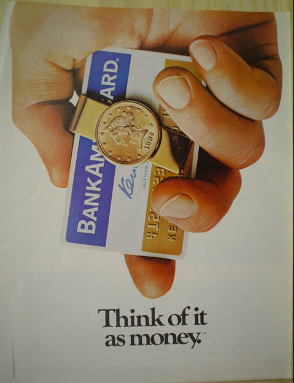
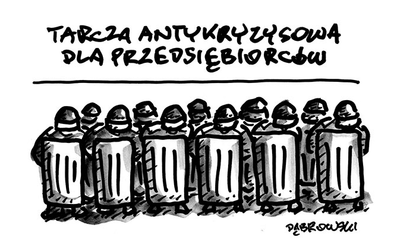
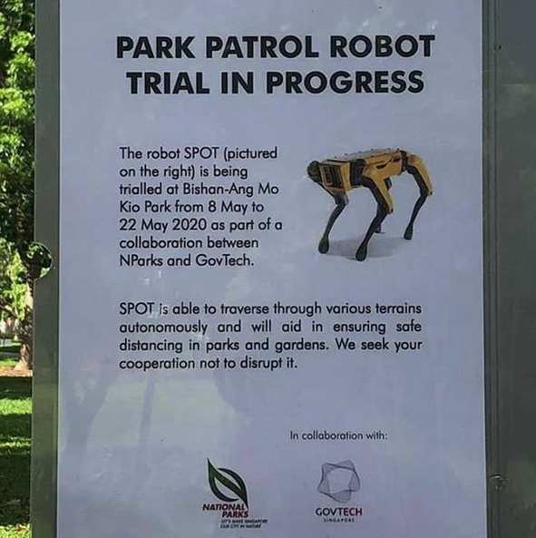
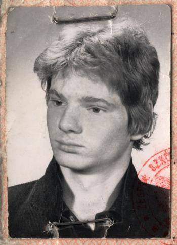
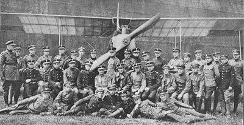
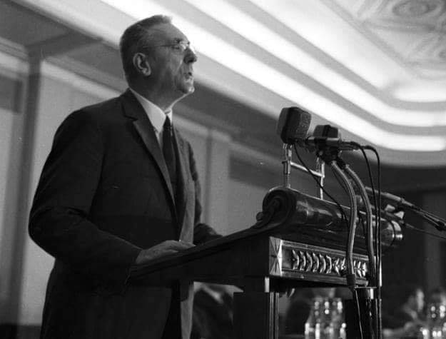
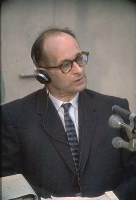
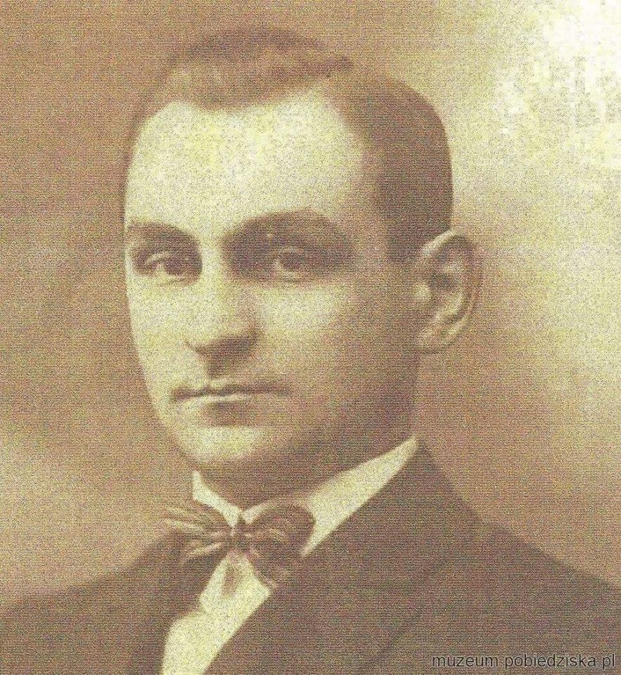
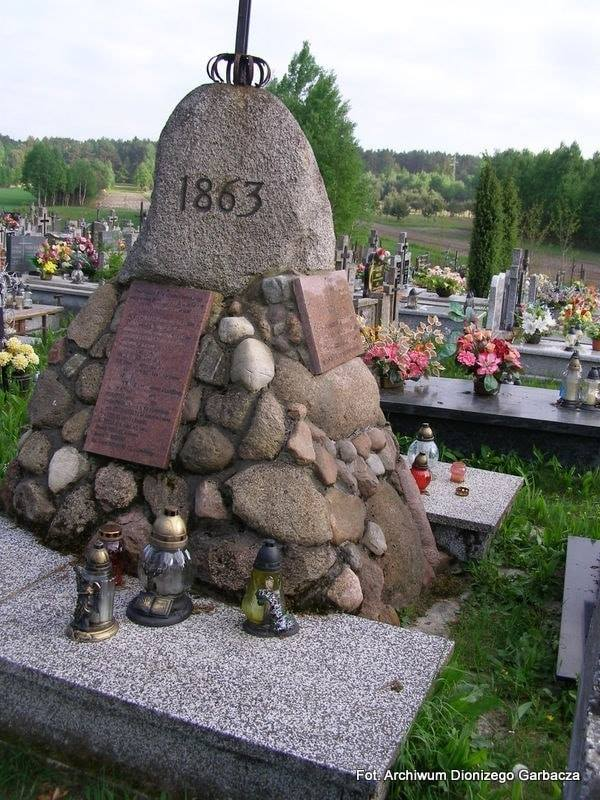

### 2021

If every military aged Palestinian male were disarmed tomorrow, what would happen?

There would be peace.

If every military Israeli male were disarmed tomorrow, what would happen?

Palestinian males would come to Israeli, and kill every Jewish man woman and child they can find.

### 2020

Ziobro chce konfiskować majątki przedsiębiorców bez wyroku sądu. Mają udowadniać, że nie są oszustami. Rada Przedsiębiorczości protestuje.

Mimo pandemii Sejm pracuje nad przepisami o tzw. konfiskacie prewencyjnej forsowanej przez resort sprawiedliwości kierowany przez Zbigniewa Ziobrę. Jeśli posłowie poprą ten pomysł, organy ścigania nie będą już musiały udowadniać, że dany majątek służył do popełniania przestępstw lub był nabyty w sposób nielegalny. To przedsiębiorca będzie musiał udowodnić, że jest niewinny.

- Ustawodawca chce przerzucić ciężar udowodnienia, że majątek pochodzi z legalnych źródeł na właściciela. Oznacza to de facto wprowadzenie domniemania winy! – ostrzega Rada Przedsiębiorczości, współtworzona przez największe organizacje gospodarcze w Polsce: Business Centre Club, Konfederacja Lewiatan, ABSL, Federacja Przedsiębiorców Polskich, KIG, Polska Rada Biznesu, Pracodawcy RP, Związek Banków Polskich i Związek Rzemiosła Polskiego. I apeluje do Sejmu o odstąpienie od dalszego procedowania tych zmian.

- Konfiskata majątku i zmierzające do niej działania prokuratury stoją w sprzeczności z art. 46 Konstytucji RP – podkreśla Marek Goliszewski, prezes BCC.

---

I am reading a book on the history of the VisaPayment network (formerly BankAmericard) and I can't stop seeing parallels with crypto

1) Memes

Dee Hock, the founding father of Visa knew he had to do first get people accustomed to electronic payments

"Think of it as money"

  

---

### Joanna Franaszek (SGH) rapuje o rzeczywistości (bo mówić już ciężko)

<video width="640" height="480" controls>
  <source src="./movies/may/DnP.mp4" type="video/mp4">
Your browser does not support the video tag.
</video>

---

  

---

"The digitization of the world clearly benefits bitcoin," says Paul Tudor Jones on BTC. "We are clearly digitizing the global economies...and bitcoin will be that much more accessible by that universe of people that could own it as a stored value."

---

  

---

> Jak się krzyczało co tydzień o końcu demokracji i państwa prawa, to nie dziwota, że teraz - kiedy realnie ten koniec nadchodzi - nikogo to nie rusza.

### 1997

Garri Kasparow poddał mecz z Deep Blue.
Po raz pierwszy w historii komputer pokonał aktualnego Mistrza Świata 3½–2½.
Mimo, że Kasparow "odegrał się" blaszanemu przyjacielowi, do dziś to wydarzenie jest jednym z kamieni milowych w szachach.

### 1995

The signatories to the Non-Proliferation Treaty (NPT) met in New York City for the Review Conference and decided, by consensus, to extend the treaty indefinitely and without conditions.

### 1982

Miał 19 lat. Za wpięty w ubranie opornik - symbol sprzeciwu wobec władz PRL – został 𝘀𝗸𝗮𝘁𝗼𝘄𝗮𝗻𝘆 𝗽𝗿𝘇𝗲𝘇 𝗽𝗮𝘁𝗿𝗼𝗹 𝗭𝗢𝗠𝗢. Piotr Majchrzak trafił do szpitala nieprzytomny z obrażeniami czaszki. Zmarł tydzień później. Rodzinę, która na własną rękę próbowała dociec prawdy zastraszano. Oficjalne śledztwo w sprawie pobicia z 11 maja 1982 roku zostało umorzone „z powodu niewykrycia sprawców przestępstwa”❗

  

### 1919

Została powołana do życia Krakowska Szkoła Pilotów.
Placówka ta powstała jako odpowiedź na rosnące zapotrzebowanie armii polskiej na niemieckie i austriackie samoloty, których sposób politowania w znacznym stopniu różnił się od obsługi maszyn francuskich i angielskich, czego uczono w warszawskiej Francuskiej Szkole Pilotów.
Dowódcą szkoły został mianowany wereran pierwszej wojny światowej, w 1914 roku obserwator frontu serbskiego, dowódca I Grupy Lotniczej w Warszawie kspitan Roman Florel.
Szkoła szkoliła w pilotażu na samolotach szkolnych i przejściowych pomiędzy szkolnymi a bojowymi. Dopiero po skończeniu szkoły pilot mógł przejść do Wyższej Szkoły Pilotów w Ławicy pod Poznaniem.
Szkolenie opierało się na zasadach obowiązujących tego samego typu instytucjach austriackich. Polegały one na podzieleniu kandydatów na pilotów na trzy grupy ;A, B i C. Pierwszy etap szkolenia polegał na odbyciu 100 lotów instruktorem oraz kilku samodzielnie na samolocie szkolnym dwusterowym. Etap ten kończył się egzaminem, po zaliczeniu którego uczeń przechodził do grupy B, gdzie do wykonania było 15 lotów lotów samodzielnych na samolocie szkolnym i 75 lotów samodzielnych mających na celu szkolenie w lądowaniu, także z wyłączonym silnikiem. Ostatnią częścią kursu B było 15 lotów szkolących w trudnych lądowaniach: np. na sygnał, "w polu", w kole oraz loty spiralne. Także ta część kursu kończyła się egzaminem. Etap C polegał na odbyciu 20 lotów o podobnej trudności jak w części B tylko na samolotach o mocniejszym silniku 160 KM.
Na zdjęciu Dowództwo, instruktorzy i uczniowie Krakowskiej Szkoły Pilotów maj 1920 roku.

  

### 1972

Zakończyło się trwające dwa dni V Plenum Komitetu Centralnego Polskiej Zjednoczonej Partii Robotniczej.
Głównym tematem było omówienie perespektyw rozwoju budownictwa i polityki mieszkaniowej.
I Sekretarz Komitetu Centralnego Polskiej Zjednoczonej Partii Robotniczej Edward Gierek powiedział wówczas:
" Idzie o wielką sprawę – o to, aby w okresie życia jednego pokolenia zbudować drugą Polskę – Polskę zasobniejszą, odpowiadającą aspiracjom obywateli nowoczesnego kraju przemysłowego (...) Nasz podstawowy cel - odrębne mieszkanie dla każdej rodziny chcemy osiągnąć już w połowie lat osiemdziesiątych (...) Musimy w najbliższym 20-leciu oddać do użytku 5 razy więcej mieszkań niż zbudowaliśmy w latach 1951-1970. Oznacza to, że już w końcu lat siedemdziesiątych powinniśmy corocznie oddawać do użytku 11-12 nowych mieszkań na każdy tysiąc mieszkańców"

  

### 1960

Nazistowski zbrodniarz wojenny Adolf Eichmann został porwany przez Mosad w Argentynie i wywieziony do Izraela.

11 maja 1960 roku, agenci Mossadu uprowadzili z Buenos Aires, Ricardo Klementa. Pod tym nazwiskiem ukrywał się w Argentynie jeden z czołowych hitlerowskich zbrodniarzy, SS-Obersturmbanf?hrer Adolf Eichmann.

Podczas II wojny światowej Adolf Eichmann był szefem sekcji żydowskiej w Głównym Urzędzie Bezpieczeństwa Rzeszy. Był odpowiedzialny za organizację transportów do obozów zagłady. Uczestniczył w konferencji w Wannsse (20.01.1942 r.), podczas której zapadła decyzja o tzw. ?ostatecznym rozwiązaniu kwestii żydowskiej?. Po wojnie udało mu się uciec do Argentyny, gdzie mieszkał od 1950 r. Początkowo ukrywał się w małej wiosce La Cocha, leżącej w Andach, a następnie przeniósł się do Buenos Aires. Po wojnie, rząd argentyński wspierał zbiegłych nazistów, zgadzając się na ich pobyt oraz zaopatrując w niezbędne dokumenty. 3 sierpnia Adolf Eichmann stał się Ricardo Klementem. Gdy uznał, że jest bezpieczny sprowadził z Europy swoją żonę i synów.

Pierwsze informacje o miejscu pobytu Eichmanna wywiad izraelski otrzymał w 1957 roku. Jednakże zbagatelizowano je na początku. Dopiero wskutek interwencji prokuratora generalnego Hesji, Kurta Bauera sprawa poszukiwań hitlerowskiego zbrodniarza ruszyła do przodu. W marcu 1960 r. do Buenos przyleciał agent izraelskiego wywiadu, Zvi Aharoni. Skorzystał z informacji, że pod adresem Chacabuco 4261 mieszka Eichmann. Okazało się, że informacja jest już nieaktualna, ale przy pomocy miejscowych pomocników udało mu się trafić na ślad jakiegoś Niemca, którym okazuje się syn Eichmann, Dito (Dieter). Pracuje on w warsztacie samochodowym. Po kilku próbach śledzenia Dito, Aharoni dotarł do dzielnicy San Fernando, gdzie przy ulicy Garibaldiego 14. wraz z rodziną mieszkał Adolf Eichmann. Izraelski agent ustala, że właścicielką obserwowanego domu jest niejaka Veronica Catarina Liebl de Fichmann. Człon Liebl do nazwisko panieńskie żony Eichmanna. Po upewnieniu się, że Ricardo Klement to w rzeczywistości poszukiwany SS-Obersturmbanf?hrer Adolf Eichmann, Aharoni wrócił do Izraela, gdzie rozpoczęły się prace nad planem uprowadzenia nazisty. Mossad wiedział, że jakakolwiek próba ?dyplomatycznego? rozwiązania będzie nieskuteczna, a esesman zniknie po raz kolejny.

Pod koniec kwietnia w Buenos Aires pojawiła się grupa agentów Mossadu. W jej skład wchodzili: Zvi Aharoni, Jakow Gat, Avraham Shalom, Efraim Ilani, Icchak Nesher, Zeev Keren, Zvi Malchin, Rafi Eitan oraz nieznany z nazwiska lekarz. Na miejsce przybył również ówczesny szef wywiadu, Iser Harel. Agenci rozpoczęli obserwację ?obiektu?, poznali jego plan dnia i zwyczaje. Wynajęli dwa domy, jeden stanowił centrum dowodzenia, a w drugim miał być przetrzymywany Eichmann. Posiadali także dwa samochody. 11 maja 1960 r. Izraelczycy przystąpili do akcji. O godzinie 2007 wracający z pracy Eichmann został znienacka zaatakowany przez Zvi Malchina i powalony na ziemię. Po chwili przy szamoczących się mężczyznach zatrzymał się samochód i pozostali biorący udział w akcji agenci wepchnęli nazistę do środka. Eichmannowi zostały nałożone ciemne gogle i pod groźbą zastrzelenie, jeśli stawiałby opór uspokoił się. Po dotarciu do kryjówki, Eichmann został rozebrany i poddany badaniu przez lekarza, który posiadał szczegółowe dane dotyczące jego fizjonomii. Po kilkunastu minutach potwierdził, że człowiek znajdujący się w pokoju to Adolf Eichmann. Pierwsze przesłuchanie również potwierdziło, że porwali właściwego mężczyznę. Nazista zapewnił agentów Mossadu, że nie będzie robił problemów i uda się z nimi z własnej woli. 19 maja w Buenos Aires wylądował samolot izraelskich linii lotniczych, na pokładzie którego znajdował się minister spraw zagranicznych Izraela Abba Eban. Operacja była tak tajna, że nawet on nie wiedział, kogo zabierze w drodze powrotnej. 20 maja agenci Mossadu przetransportowali Eichmanna, ubranego w mundur członka załogi samolotu na lotnisko. Więzień był pod wpływem środka uspokajającego. 22 maja 1960 r. maszyna wylądowała w Tel Awiwie.

Proces rozpoczął się w 1961 roku. Eichmann plątał się w zeznaniach, starał się ukryć oczywiste zaangażowanie w proces deportacji i eksterminacji ludności żydowskiej. Tyle że sprawa była oczywista, a dowodów aż nadto, by wydać wyrok skazujący na śmierć. 15 grudnia 1961 roku wreszcie odczytano werdykt. Szymon Wiesenthal odnotował, iż po każdym z dwudziestu punktów oskarżenia na pytanie o winę Eichmann odpowiadał: ,,Niewinny". Izraelski ,,łowca nazistów" stwierdził, iż zbrodniarza należało zapytać sześć milionów razy, co symbolizowałoby każdą z ofiar systemu, którego był znaczącą częścią. Apelacja Eichmanna nie przyniosła efektów.

31 maja 1962 r. po trwającym osiem miesięcy procesie, którego przebiegiem interesował się cały świat, Adolf Eichmann stanął przed katem. Został powieszony, a jego ciało skremowano i rozrzucono nad Morzem Śródziemnym.

  

### 1900

W Pobiedziskach urodził się Antoni Palluth-podporucznik rezerwy łączności Wojska Polskiego, uczestnik powstania wielkopolskiego, inżynier i kryptolog.
Był absolwentem Wydziału Inżynierii Lądowej na Politechnice Warszawskiej. Należał także do Polskiego Klubu Radionadawców- był właścicielem prywatnej stacji krótkofalowej.
Za sprawą doskonałej znajomości języka niemieckiego, a także jego dialektów rozpoczął pracę w Biurze Szyfrów Sztabu Głównego Wojska Polskiego.
Obok Jerzego Różyckiego,Mariana Rajewskiego i Henryka Zygalskiego -Palluth był współautorem polskiego złamania szyfrów niemieckiej maszyny kodującej "Enigma".
Aresztowany w 1942 roku przez Niemców na granicy francusko-hiszpańskiej, a następnie osadzony w KL Sachsen Hausen- Oranienburg.
Zmarł 18 kwietnia 1944 roku.

  

### 1863

W czasie powstania styczniowego miała miejsce bitwa pod Hutą Krzeszowską w województwie podkarpackim. Oddział powstańczy dowodzony przez generała Antoniego Jeziorańskiego uległ siłom rosyjskim, a natępnie został zmuszony do wycofania się w stronę granicy z Galicją.

  

---

<a href="https://github.com/TomaszWaszczyk/historia.waszczyk.com/edit/master/src/content/may-11.md" target="_blank">Edytuj tę stronę dzieląc się własnymi notatkami!</a>
