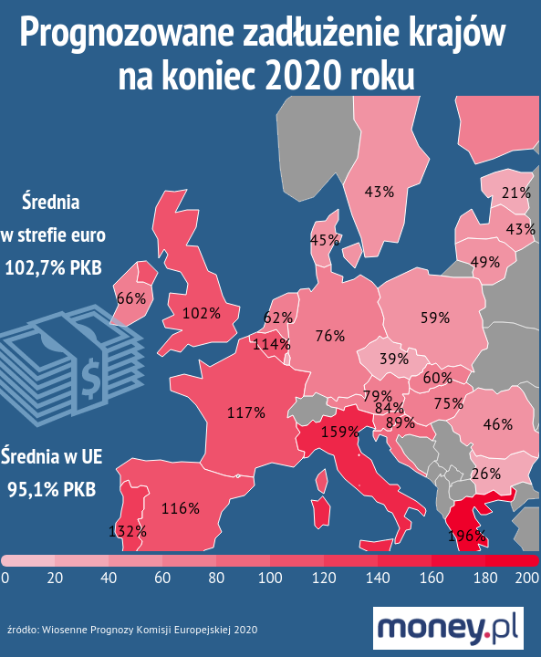

### 2020

  

  

  

Inflacja w bitcoinie spada o połowę. Z około 3,6% do około 1,8%. Zostało do tego wydarzenia już tylko kilka bloków. Nigdy już ta inflacja się nie zwiększy, zawsze będzie się zmniejszała (o połowę, co 210 000 bloków). W tym wyjątkowo niestabilnym ekonomicznie okresie, bitcoin chodzi jak szwajcarski zegarek, nie obchodzą go wydarzenia ze świata, działa tak, jak został zakodowany, oferując jasne, przejrzyste zasady. Szereg wiadomych w świecie niewiadomych. Z każdym dniem coraz silniejszy. Nadchodzi jego czwarta epoka, zobaczymy, co przyniesie

---

Spirala zadłużenia się nakręca. Walka z koronawirusem pochłonie ogromne pieniądze, które w większości rządy będą musiały pożyczyć. Według KE, na koniec roku średnie zadłużenie w strefie euro przekroczy 100 proc. PKB. Statystyki zawyża nie tylko Grecja, ale także Włochy czy Portugalia.

Epidemia koronawirusa jest wyzwaniem nie tylko dla służby zdrowia, ale i całej gospodarki. Rządy wszystkich krajów Europy na walkę z jej skutkami opracowały tarcze antykryzysowe warte setki miliardów euro. Problem w tym, że takimi pieniędzmi żaden rząd nie dysponuje. Trzeba będzie je pożyczyć. W efekcie zadłużenie krajów bardzo mocno wzrośnie, a już i tak w wielu przypadkach przekracza wszelkie limity.

  

### 1926

Obchodzimy niezwykle smutną i w skutkach tragiczną rocznicę. A dzisiaj szczególnie warto ja przypominać.

Grupa spiskowców w Wojsku Polskim pod dowództwem Józefa Piłsudskiego zorganizowała zamach na legalny rząd Rzeczypospolitej Polskiej.

W wyniku, którego oficjalnie straciło życie 379 osób (215 żołnierzy i 164 cywilów) A około 1000 zostało rannych. Rząd Wincentego Witosa podał się do dymisji, a prezydent Wojciechowski złożył urząd. Zamach rozpoczął 13-letnie autorytarne rządy sanacji, którym kres położył wybuch II wojny światowej. Symbolem tych rządów był obóz w Berezie Kartuskiej i klęska wrześniowa.

Generał T.Jordan Rozwadowski został otruty (nie ma pewności co do tego).

TODO: Zbadać temat produkcji pieniądza w tym czasie!

---

https://pl.wikipedia.org/wiki/Przewr%C3%B3t_majowy

### 1900

https://en.wikipedia.org/wiki/Joseph_Rochefort

---

https://pl.wikipedia.org/wiki/Porozumienie_Centrum

---

<a href="https://github.com/TomaszWaszczyk/historia.waszczyk.com/edit/master/src/content/may-12.md" target="_blank">Edytuj tę stronę dzieląc się własnymi notatkami!</a>
