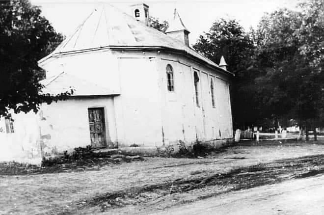

### 2021

> Mieszkaniowe szaleństwo. "Hipoteczny boom ogarnął banki i Polaków"

### 2020

  

---

USA zaraportowało rekordowy deficyt budżetowy. 738 miliardów dolarów.

  

---

Właśnie padła Stadnina w Janowie Podlaskim. Byłem tam wielokrotnie, pomagając przy organizacji pokazów i aukcji koni.

150 lat tradycji i dumy narodowej nie zniszczyli ani Moskale, ani faszyści, ani komuniści. Przyszli barbarzyńscy staliniści z PiS i rozjebali w 4 lata.

---

### Bitcoin’s Halving Is Nothing Like Quantitative Tightening

  

  

  

Inflacja w bitcoinie spada o połowę. Z około 3,6% do około 1,8%. Zostało do tego wydarzenia już tylko kilka bloków. Nigdy już ta inflacja się nie zwiększy, zawsze będzie się zmniejszała (o połowę, co 210 000 bloków). W tym wyjątkowo niestabilnym ekonomicznie okresie, bitcoin chodzi jak szwajcarski zegarek, nie obchodzą go wydarzenia ze świata, działa tak, jak został zakodowany, oferując jasne, przejrzyste zasady. Szereg wiadomych w świecie niewiadomych. Z każdym dniem coraz silniejszy. Nadchodzi jego czwarta epoka, zobaczymy, co przyniesie

  

---

O godz. 12.00 Prezydent zatwierdził Strategię Bezpieczeństwa Narodowego RP. W sferze cyberbezpieczeństwo zakłada ona m. in. podniesienie poziomu odporności na cyberzagrożenia oraz zwiększenie poziomu ochrony informacji w sektorze publicznym, militarnym, prywatnym.

  

---

Prezes Naczelnej Rady Lekarskiej: Nie możemy się zamykać i siać paniki
Musimy się nauczyć jak żyć z wirusem. Bo my się go nie pozbędziemy przez najbliższy czas. Nie możemy się zamykać w czterech ścianach bo dojdzie do różnych stanów depresyjnych, różnych niepotrzebnych wydarzeń, które w skutkach mogą okazać się nie tyko kosztowne, ale tragiczne z punktu widzenia zdrowotnego – podkreślił w wywiadzie dla Radia Zet prezes Naczelnej Rady Lekarskiej prof. Andrzej Matyja.
Niepotrzebne są także skrajności w podejmowanych przez ministerstwa decyzjach. – Najpierw się z tych maseczek wyśmiewano, teraz jest obowiązek ich noszenia (…) trzeba też zapytać jaka to maska? Mam wrażenie, że nosi się maski jedynie, by spełnić obowiązek prawny. A że ta maska była używana wielokrotnie czy była źle zakładana? Że może być siedliskiem zarazków? – zauważa.
Sytuacja z koronawirusem obnażyła kryzys w polskiej służbie zdrowia. - Tych kadr jeszcze ubywa. Czy ilość zasobów kadrowych we Włoszech czy Hiszpanii była niższa? Nie! Musimy być więc jeszcze bardziej ostrożni, bo nas jest zdecydowanie mniej. Dojdzie do strasznych rzeczy, niepowetowanych strat, niepotrzebnych zgonów z innych powodów – podkreślał prof. Andrzej Matyja.

  

---

Spirala zadłużenia się nakręca. Walka z koronawirusem pochłonie ogromne pieniądze, które w większości rządy będą musiały pożyczyć. Według KE, na koniec roku średnie zadłużenie w strefie euro przekroczy 100 proc. PKB. Statystyki zawyża nie tylko Grecja, ale także Włochy czy Portugalia.

Epidemia koronawirusa jest wyzwaniem nie tylko dla służby zdrowia, ale i całej gospodarki. Rządy wszystkich krajów Europy na walkę z jej skutkami opracowały tarcze antykryzysowe warte setki miliardów euro. Problem w tym, że takimi pieniędzmi żaden rząd nie dysponuje. Trzeba będzie je pożyczyć. W efekcie zadłużenie krajów bardzo mocno wzrośnie, a już i tak w wielu przypadkach przekracza wszelkie limity.

  

### 2008

> Uratować dziecko to tak jakby ocalić kilka światów. W najmłodszych bowiem, tak jak w kwiatowych pąkach czekają w utajnieniu nieznane jeszcze możliwości, aby rozwinąć się i rozkwitnąć.

Zmarła Irena Sendlerowa - Sprawiedliwa wśród Narodów Świata, Dama Orderu Uśmiechu, laureatka Nagrody imienia Jana Karskiego - Za Odwagę i Serce.
Postać bezprzykładnego heroizmu i najwyższej czci. Podczas drugiej wojny światowej razem z organizacją "Żegota" pomagała w przetrwaniu warszawskim Żydom.
Pani Irena i współpracujące z nią osoby przez trzy lata uchroniły od Zagłady blisko 2,5 tysiąca żydowskich dzieci i niemałą ilość osób dorosłych. Dzieci z getta warszawskiego przy pomocy zaufanych osób szmuglowała na tzw. ,,aryjską'' stroną, a następnie umieszczała je najczęściej przy polskich zaufanych rodzinach, a także w zakonnych zakładach sióstr Rodziny Maryi i służebniczek starowiejskich, sierocińcach oraz w innych placówkach. Dla całej społeczności żydowskiej była bezcennym darem. Dla nas wszystkich była symbolem tolerancji, miłosierdzia i kwintesencją najszlachetniejszych wartości humanistycznych.

Przemawiając nad grobem Ireny Sendlerowej ocalony przez Nią profesor Michał Głowiński powiedział: ,,Umarła, ale żyje! Żyje, póki żyć my będziemy, skazani na gazowe komory, my, którym uratowała życie, których wyprowadziła zza murów getta, czyli z piekła - i zapewniła schronienie w miejscach, dających nadzieję ratunku. Żyje i żyć będzie także później - za sprawą potomstwa tych, którym pomogła, a także - dzięki pamięci, która jest jedną z największych wartości w ludzkim świecie. Dokonała dzieła niezwykłego, którego z niczym nie da się porównać. Przy współpracy ludzi dzielnych i pełnych dobrej woli uchroniła przed niechybną śmiercią dwa i pół tysiąca dzieci, ale nie tylko, bo pomogła - o czym się rzadziej wspomina - również wielu dorosłym. Od lat najwcześniejszych była wspaniałą i ofiarną działaczką społeczną, wywodzącą się z kręgów polskiej lewicowej inteligencji, troszczyła się o biednych, opuszczonych i upokorzonych. Ale to, kim jest i co potrafi, ujawniła w czasie najstraszniejszym, w czasie okupacji i Zagłady. Do ratowania istnień ludzkich w skali tak ogromnej, wręcz nieprawdopodobnej, nie wystarczała wszakże tylko dobroć, współczucie, ofiarność. Za ich sprawą uratować można było dwoje dzieci, troje, może pięcioro. Trzeba było geniuszu Ireny Sendlerowej i Jej energii, by dokonać czegoś co zakres ma tak wielki. Nie obawiam się tych słów, nie ma w nich przesady. Dzieło tej drobnej i kruchej kobiety, która nigdy nie wypowiadała wielkich słów i z pozoru niczym się nie wyróżniała, świadczą o geniuszu, geniuszu wielorakim. Geniuszu odwagi i poświęcenia. Ale także geniuszu organizacyjnym. Powtarzam, tu nie wystarczały dobre chęci, tu nie wystarczały także inne cnoty. To wielkie dzieło ratowania wymagało geniuszu organizacyjnego. Irena Sendlerowa go posiadała, umiała zaplanować działania w strasznej rzeczywistości okupacyjnej, a także przewidzieć ich skutki, umiała stworzyć zespół współpracowników i nim kierować, a także współdziałać z ludźmi z wielu kręgów społecznych i politycznych, religijnych i towarzyskich. To dzięki tym niezwykłym talentom mogła dokonać tego, czego dokonała. I dzięki odwadze wprost niebywałej. Była człowiekiem czynu, którego celem nieustannym stało się niesienie dobra. Człowiekiem czynu, który nie bał się narażania własnego życia dla ratowania życia innych.

Żegnamy bohaterkę. Bohaterkę, która o swoim heroizmie mówić nie zwykła. Bohaterkę przez długie lata pozostającą w cieniu, bo o Jej czynach pamiętali nieliczni. Trochę przyjaciół, którzy Ją znali z dawnych lat, kilku historyków, jakieś poszczególne jednostki, do których wieść doszła o tej niezwykłej kobiecie i Jej czynach. osób takich, jak amerykański nauczyciel, który dokonał rzeczy zdumiewającej: przy pomocy kilku uczennic uświadomił światu, ale też Polakom, że w Warszawie żyje osoba, która uratowała przed niechybną śmiercią tak dużą grupę dzieci.

Należę do tych ocalonych, którzy znali Irenę Sendlerową od wielu dziesięcioleci, niemal od zawsze; wielu z tych, którzy dzięki niej przetrwali, nie są świadomi, ile Jej właśnie zawdzięczają. Bohaterska i obdarzona niezwykłą pamięcią, często powracała do lat, w których dokonała tego, co było ponad ludzkie siły. Ale o rozgłos nie dbała. Na szczęście świat o Niej sobie przypomniał. Odznaczenia i wyrazy hołdu zaczęły nadchodzić z różnych stron świata. Od drzewka posadzonego w Izraelu do Orderu Orła Białego. O ile wiem, szczególnie ceniła nagrodę imienia Jana Karskiego, może dlatego, że jej patron równie silnie jak ona zaangażował się w sprawy mordowanych Żydów i chciał o tej zbrodni powiadomić świat cały. Myślę jednak, że szczególną radość Jej sprawiały objawy serdeczności ze strony tych, którzy Ją odwiedzali i do Niej pisali, ze strony osób, które uratowała, ale też tych późno urodzonych, jakim najstraszniejsze doświadczenia zostały oszczędzone. W czasie jednego z ostatnich z Nią spotkań, powiedziała mi, że dla niej nagrodą Nobla jest to, że szkoły nazywane są jej imieniem. Los bywa reżyserem nieprzewidywalnym, zmarła w dniu, w którym odbywała się piękna uroczystość powołania Jej na patronkę warszawskiego gimnazjum. Do chwil swoich ostatnich zachowała jasność umysłu, orientowała się w tym, co się dzieje, nadal ciekawa była świata, z zainteresowaniem i niepokojem obserwowała wydarzenia krajowe. O tym też nie wolno zapominać, była niezwykle sympatycznym, życzliwym, otwartym człowiekiem, takim, z którym rozmowa stanowi prawdziwą przyjemność. W ostatnich latach, słaba i zmęczona, mówiła cicho, warto było wszakże wysilać słuch, by uchwycić każde jej słowo. Wydawałoby się, że być powinna na codzień osobą z pomnika, bo nią w istocie była, ale była też po prostu uroczą i mądrą kobietą, z którą rozmowa była przyjemnością.. Nie dziw, że do pokoju numer 15 w Centrum Ojców Bonifratrów na Sapieżyńskiej zmierzało tak wielu, by choć chwilę przebywać w Jej towarzystwie.

Słaba i schorowana była niezwykle duchem silna, dzielnie znosiła rodzinne kłopoty, dotknęło Ją nieszczęście największe: śmierć syna. W każdej sytuacji pokazywała niezwykłą ludzką klasę. Dotrwała do późnej starości, żyła dokładnie dziewięćdziesiąt osiem lat i trzy miesiące (bez trzech dni). My wszyscy, tutaj zebrani, opłakujemy Jej odejście, opłakujemy szczerze, świadomi, jak wielką ponieśliśmy stratę. Chciałbym jednak - wbrew zwyczajom obowiązującym w mowach nad grobem wygłaszanych - zakończyć akcentem optymistycznym. Nie tylko wyrażę przekonanie, że wielkie dzieło Ireny Sendlerowej pozostanie w pamięci na zawsze i przejdzie do historii, bo to wątpliwości nie ulega, chciałbym wyrazić radość, że była z nami tak długo, że opuściła nasz ziemski padół, dożywszy wieku sędziwego.''

  

### 1987

https://pl.wikipedia.org/wiki/James_Jesus_Angleton

### 1982

W Fatimie podczas pielgrzymki dziękczynnej miała miejsce druga próba dokonania zamachu na życie papieża Jana Pawła II. Tym razem atakującym był Hiszpan Juan Fernandez Krohn (zdjęcie) były ksiądz lefebrysta wyrzucony z Bractwa świętego Piusa X za nieposłuszeństwo i problemy psychiczne.
O próbie dokonania tego zamachu mówił w filmie "Świadectwo" kardynał Stanisław Dziwisz:
"Dziś mogę to powiedzieć, do tej pory utrzymywaliśmy to raczej w dyskrecji. On poranił Ojca Świętego. Niemniej w ten sposób, że Ojciec Święty mógł zakończyć całe nabożeństwo. Dopiero gdy wrócił do pokoju, widzieliśmy, że sutanna jest zakrwawiona, że go jednak tym nożem poranił”.
Za próbę zamordowania Jana Pawła II Krohn został skazany na 6 lat więzienia.

  

### 1970

W Londynie zmarł generał broni Władysław Albert Anders.
Przyszedł na świat 11 sierpnia 1892 roku w Błoniu koło Kutna.
Był jednym z czterech synów Alberta Andersa zarządcy majątku Krośniewice.W 1910 roku został powołany do służby wojskowej w rosyjskiej armii,w której służbę ukończył rok później w stopniu oficera.W 1911 roku wyjechał do Rygi,gdzie studiował na tamtejszej Politechnice. Wybuch I wojny światowej zmusił go do przerwania studiów. Został powołany do wojska. Trzykrotnie ranny, zostaje
odznaczony najwyższym orderem,
Krzyżem Św. Jerzego. Kończy kurs
Akademii Sztabu w Petersburgu i w roku
1917 zostaje szefem sztabu 7-ej Dywizji
Piechoty. W czasie rewolucji rosyjskiej
dołącza on do tworzącego się w Rosji
Polskiego Korpusu generała Dowbór-
Muśnickiego. Bierze udział w
formowaniu Pułku Ułanów
Krechowieckich, zostając mianowany
dowódcą szwadronu, a następnie szefem
sztabu.
W kwietniu 1919 roku został dowódcą 15 Pułku Ułanów Poznańskich,z którym wyruszył na wojnę polsko-bolszewicką.Tam również odznaczył się wielką odwagą,a jego działania dowódcze zyskały miano bardzo przemyślanych.Za taką postawę Józef Piłsudski odznaczył go krzyżem Virtuti Militari.
W roku 1921 Władysław Anders zostaje
wysłany do Paryża na studia w Ecole
Superieure de Guerre, którą kończy w
dwa lata później. Po powrocie do kraju
obejmuje szefostwo sztabu gen.
Rozwadowskiego. W roku 1926, w czasie
zamachu majowego marszałka
Piłsudskiego, stanął Władysław Anders
po stronie rządu i prezydenta
Rzeczypospolitej, wyprowadzając tego
ostatniego z Belwederu do Wilanowa.
Mimo takiej postawy politycznej,
marszałek Piłsudski, doceniając jego
zdolności wojskowe, mianował go
wkrótce dowódcą Wołyńskiej Brygady
Kawalerii. W roku 1934 Władysław
Anders zostaje mianowany generałem
brygady.Jakieś zaufanie marszałka do Władysława Andersa sprawiało,że mimo pewnych tarć nadal był on uważany przez Piłsudskiego za wzorowego żołnierza.
W 1939 roku już jako dowódca Brygady Nowogródzkiej brał udział w wojnie obronnej.Mimo odniesionych podczas obrony Płocka ran nadal był skutecznym dowódcą,który swoją Brygadę doprowadził aż do Lwowa,gdzie w wyniku okrążenia przez Armię Czerwoną znowu został dwukrotnie ranny,by następnie trafić do sowieckiej niewoli.Namawiany w tym czasie do zdrady Wojska Polskiego kosztem wstąpienia do Armii Czerwonej nie ugiął się pod rosyjską presją. Tak o tym fakcie mówił sam Józef Czapski:
"Zaledwie parę dni temu
przybył do nas na kilka godzin do obozu
gen. Anders, wypuszczony z Łubianki i
mianowany przez gen. Sikorskiego
dowódcą mającej się tworzyć na terenie
Sowietów Armii Polskiej. Przybył
samolotem, odwiedził nasz obóz,
otoczony usmiechnętymi oficerami
NKWD, i zrobił przegląd jeńców
griazowieckich. W słoneczny, mglisty i
mokrą ziemią pachnący, już jesienny
dzień obszedł nasze szeregi w wytartych,
z trudem do możliwego wyglądu
doprowadzonych mundurach. Szedł o
kiju, lekko utykając (wiedzieliśmy, że
ciężko rannego we wrześniu 1939 roku
włóczono po więzieniach Lwowa, Kijowa
i Moskwy), miał cerę ziemistą, wzrok
nadzwyczaj uważny i skupiony."
Dnia 30 lipca 1941 roku rząd polski
zawiera z ZSRR umowę, w wyniku której
zostają ponownie nawiązane stosunki
dyplomatyczne między obu krajami.
Władze sowieckie ogłaszają amnestię dla
deportowanych w Rosji Polaków, w
ramach której generał Anders zostaje
wypuszczony na wolność, po 20-tu
miesiącach pobytu w więzieniach
sowieckich. Dnia 14 sierpnia tegoż roku
zostaje podpisana polsko-sowiecka
umowa wojskowa, przewidująca
utworzenie w Rosji Armii Polskiej.
Dowództwo tej armii powierzono
generałowi Andersowi, mianowanemu w
międzyczasie generałem dywizji.
Generał Anders, obejmując funkcję
naczelnego dowódcy wojsk polskich w
Rosji, stanął przed kapitalnym
zagadnieniem, na jakie efekty wy wojska
może liczyć i ile jednostek zdoła z nich
utworzyć. Organ Armii Czerwonej
"Krasnaja Zwiezda" z dnia 17 września
1940 roku podawał, że w wyniku
kampanii polskiej znalazło się w niewoli
sowieckiej 12 generałów, 8000 oficerów i
ponad 200.000 szeregowych wojska
polskiego. W miarę formowania się
wojska i napływania do punktów
zbornych żołnierzy, niepokojącą rzeczą
stał się nikły stan kadry oficerskiej, a
przecież była tak liczną w niewoli
sowieckiej.
W obozie w Griazowcu odnaleziono
zaledwie kilkuset oficerów i to
przeważnie w starszym wieku. W czasie
rozmowy generała Andersa z sowieckim
generałem Panfiłowem, tenże miał
oświadczyć, że w niewoli znajduje się
20.000 szeregowych i 1000 oficerów,
natomiast według informacji polskich, w
obozach Starobielsk, Kozielsk i
Ostaszków przebywało ponad 11.000
oficerów polskich. Gdzież się więc
podziała reszta? Gdy 3 grudnia 1941 r.
generał Anders miał spotkanie ze
Stalinem, ponowił pytanie co do losów
oficerów polskich. Otrzymał lakoniczną
odpowiedź, że jeśli ich nie ma, to znaczy
uciekli do Mandżurii.
Dziś już dobrze wiemy,że była to wierutna bzdura. Stalin kłamał,grając na zwłokę. Zgodził się jednak na utworzenie Armii Polskiej w ZSRR.
8 czerwca 1942 r. kieruje generał Anders
telegram do gen. Sikorskiego, celem
uzyskania pozwolenia na dalszą
ewakuację Polaków z Rosji. 12 czerwca
otrzymuje odpowiedź, że "wojsko dla
wyższych celów politycznych musi
pozostać w ZSRR". Stanowisko władz
polskich świadczyło o zupełnej
nieznajomości sytuacji w Rosji i stosunku
Stalina do Polaków. Politycy polscy w
naiwności swojej przypuszczali, że po
ogłoszonej amnestii Polacy będą dobrze
traktowani i że nie będą im robione
trudności w powrocie do swego kraju.
Jakże bardzo mylili się w swojej ocenie!
16 stycznia 1943 roku sowiecki wydaje notę,w której napisano,że wszyscy Polacy zamieszkujący tereny ZSRR stali się jego obywatelami. Decyzja ta zamknęła definitywnie możliwość powrotu do Polski im wszystkim. Ewakuacja objęła
niespełna 115.000 ludzi, w tem około
72.000 wojskowych i 43.000 ludności
cywilnej. Z ogólnej liczby 1.500.000
Polaków wywiezionych do Rosji, połowa
zmarła na zesłaniu, a z pozostałych przy
życiu tylko 115.000 zdołano ewakuować.
Jak przystało na prawdziwego wodza,
ratuj ącego swych żołnierzy, gen. Anders
wyjechał z Rosji jako ostatni z
ewakuowanych w dniu 19 sierpnia 1942
roku.
Po przybyciu z wojskiem do Persji,
rozwinął generał Anders całą energię
nad doprowadzeniem swoich żołnierzy
do pełnej formy fizycznej i wojskowej.
Armia Polska opuszcza wkrótce Persję,
przechodzi przez Irak, potem Syrię i
wreszcie udaje się do Palestyny,
poświęcając cały czas na szkolenie.
W międzyczasie dwa tragiczne
wydarzenia wstrząsają życiem polskim.
14 kwietnia 1943 r. komunikat radiowy
donosi o odkryciu masowych grobów
oficerów polskich w Katyniu koło
Smoleńska, w Rosji. Tak więc złe
przeczucia gen. Andersa co do losów
zaginionych polskich oficerów znalazły
swoje tragiczne wyjaśnienie. I gdy rząd
polski zwrócił się do Międzynarodowego
Czerwonego Krzyża z prośbą o wysłanie
na miejsce grobów komisji, dla zbadania
zbrodni, władze sowieckie zerwały w
dniu 25 kwietnia 1493 r. stosunki
dyplomatyczne z Polską.
W parę miesięcy później, bo 5 lipca 1943
r. ginie w katastrofie lotniczej w
Gibraltarze generał Sikorski ze swoją
świtą.
6 lutego Korpus Palestynę i ląduje we Włoszech,gdzie zostaje przydzielony do 8 Armii Brytyjskiej generała Leese,który powierzył Polakom zadanie zdobycia opanowanego przez Niemów wzgórza Monte Cassino i znajdującego się na nim klasztoru,co jak wiemy zakończyło się sukcesem.
l sierpnia 1944 r. wybucha w Warszawie
powstanie. Polacy walczący w stolicy
zwrócili się z apelem do dowództwa
alianckiego o pomoc w zaopatrzeniu w
broń i o osłonę lotniczą. Generał Anders
był od początku przeciwny powstaniu w
Warszawie, bo go uczono, że każda akcja
bez nadziei zwycięstwa winna być
odwołana, a taka była sytuacja
powstańców w Warszawie. Niemniej
jednak, z chwilą rozpoczęcia walk,
apeluje do najwyższych dowódców
alianckich we Włoszech i Anglii w
sprawie zrzutów lotniczych dla walczącej
stolicy. Uzyskuje zgodę, kres lotom
kładzie Stalin, odmawiając zgody na
lądowanie samolotów na sowieckich
lotniskach. 12 lutego 1945 zostaje
ogłoszony układ aliantów w Jałcie,
według którego Wielka Brytania, Stany
Zjednoczone i Rosja wyznaczyły Polsce
granicę wschodnią na linii Curzona,
zostawiając wytyczenie granicy
zachodniej do załatwienia na
konferencji pokojowej.
Nie mogący pogodzić się z tym Anders wystosował wkrótce pismo do prezydenta Raczkiewicza,w którym czytamy:
"wobec
tragicznego komunikatu ostatniej
konferencji trzech w Jałcie, melduję, że
2-gi Korpus nie może uznać
jednostronnej decyzji, oddającej Polskę i
naród na łup bolszewikom. Zwróciłem
się do władz sojuszniczych o wycofanie
korpusu z odcinków bojowych, bo nie
mam sumienia żądać w obecnej chwili
od żołnierza ofiary krwi."
26 lutego 1945 r. generał Anders
obejmuje obowiązki Wodza Naczelnego,
w miejsce generała Bór-Komorowskiego,
który, będąc w niewoli niemieckiej, nie
mógł wykonywać swoich obowiązków.
Z chwilą zakończenia działań
wojennych, troska gen. Andersa kieruje
się ku losom Polaków, przebywających
na terenie Niemiec, rekrutujących się
spośród byłych więźniów obozów
koncentracyjnych, jenieckich i
deportowanych na przymusowe roboty,
10 maja generał Anders spotyka generała
Eisenhowera i jego szefa sztabu,
generała Smitha, dla omówienia spraw
związanych z opieką nad polskimi
uchodźcami.
W końcu maja 1945 r. generał Anders
przekazuje swe funkcje Naczelnego
Wodza wracającemu z niewoli
niemieckiej gen. Bór-Komorowskiemu i
udaje się z powrotem do Włoch.
Po zakończeniu wojny Anders stał się obiektem oszczerczych ataków ze strony propagandy komunistycznej.Do momentu śmierci 12 maja 1970 roku był aktywnym działaczem polonijnych organizacji kombatanckich w Wielkiej Brytanii.
W 1995 roku Władysław Anders został
odznaczony pośmiertnie Orderem Orła
Białego.

  

### 1946

Papież Pius XII konsekrował Stefana Wyszyńskiego na biskupa diecezji lubelskiej.
Sakry biskupiej udzielił mu wtedy prymas Polski August Hlond.
W okresie pełnienia tej funkcji zainicjował nauczanie partnerskie odnoszące się do problematyki społecznej. . Szerokim
echem odbiły się zwłaszcza jego listy
pasterskie O chrześcijańskim wyzwoleniu
człowieka i O katolickiej woli życia. Rozwinął
również działalność charytatywną w diecezji
lubelskiej, a także przyczynił się do rozwoju
KUL jako jego wielki kanclerz.

  

### 1945

Konstruktor niemieckich pocisków rakietowych Wernher von Braun poddał się wraz ze swymi współpracownikami wojskom amerykańskim.

W historię rakiet od samego początku wpisany był tragiczny paradoks. Z jednej strony symbolizowały postęp technologiczny i odwieczne marzenie człowieka o dosięgnięciu kosmosu, z drugiej wykorzystywane jako broń – przynosiły śmierć. Takie też było życie Wernera von Brauna – zawieszone pomiędzy programem Apollo a V-2 – „cudowną bronią” Hitlera. Jednym z największych osiągnięć ludzkości, a zbrodnią. Von Braun sam do końca twierdził, że wszystko co robił, miało go przybliżać do gwiazd. Pytanie, czy można zmierzać do nich po trupach?

„Ludzie w XVI i XVII wieku sądzili, że aby posiąść kontrolę nad światem, trzeba kontrolować morza i oceany. Tak i my dzisiaj, aby kontrolować Ziemię, musimy mieć władanie nad przestrzenią kosmiczną, która ją otacza” – mówił Wernher von Braun pod koniec lat 50. do amerykańskich polityków, przekonując ich do rozpoczęcia misji załogowej na Księżyc. Jeszcze kilkanaście lat wcześniej jako Sturmbannführer SS obserwował, jak to samo dążenie przyczynia się do konstrukcji rakiet, które zamiast podbijać kosmos, miały zapewnić istnienie Tysiącletniej Rzeszy. Jak wiodła droga życia człowieka, którego geniusz zaprowadził do takich skrajności?

Wernher Magnus Maximilian baron von Braun urodził się 23 marca 1912 r. w niewielkiej miejscowości Wirsitz w prowincji pruskiej. Jego ojciec, baron Magnus von Braun, był nie tylko arystokratą i człowiekiem interesu, ale również ministrem rolnictwa w Republice Weimarskiej. W 1920, kiedy na mocy traktatu wersalskiego Wirsitz przeszedł w ręce polskie i został przemianowany na Wyrzysk, rodzina von Braunów podjęła decyzję o przeprowadzce do Berlina. Co ciekawe, młody Wernher nie był matematycznym orłem na początku swojej nauki. Przełom nastąpił w wieku 13 lat po lekturze książki „Rakieta w przestrzeni międzyplanetarnej” pioniera astronautyki Hermanna Obertha. „W roku 1925 od matki dostałem w prezencie mały teleskop. Od tego czasu spędzałem z nim długie godziny, wpatrując się wieczorami w Księżyc i gwiazdy” – tak po latach opisał jedno z kluczowych doświadczeń, które obok lektury wspominanej pracy sprawiły, że całe swoje życie marzył o jednym – dosięgnięciu gwiazd. Od tej pory w szkole wybierał tylko te przedmioty, które mogły go przybliżyć do realizacji swojego celu.

Z czasem wiedzą o fizyce prześcignął nawet swoich nauczycieli, którzy w zastępstwie pozwalali mu prowadzić lekcje. We wrześniu 1929 17-letni von Braun wstąpił do Niemieckiego Stowarzyszenia Rakietowego (Verein für Raumschiffahrt), w którym zapaleńcy podobni do niego konstruowali pierwsze rakiety. To właśnie tam pod okiem swojego mentora Hermanna Obertha, którego poznał w Berlinie, prowadził prace nad silnikami napędzanymi paliwem płynnym. W latach 30. niemiecki rząd zaczął wykazywać duże zainteresowanie militarnym rozwojem technologii rakietowej, dlatego widząc postępy młodego naukowca, zaproponowano mu współpracę. W tym czasie w 1931 r. Wernher zyskał tytuł magistra za pracę z inżynierii aeronautycznej, a dwa lata później obronił doktorat na Uniwersytecie Berlińskim. Jego dysertacja zatytułowana „Projekt oraz teoretyczne i eksperymentalne podejście do problemu konstrukcji rakiet napędzanych paliwem ciekłym” okazała się na tyle ważna dla przyszłości niemieckich sił zbrojnych, że postanowiono zakamuflować jej oryginalny tytuł i przemianować na enigmatyczne „O próbach spalania”. Von Braun miał wtedy 22 lata, uczył się pilotażu i był na prostej drodze do Peenemünde – tajnego ośrodka badań nad rakietami ulokowanego nad Morzem Bałtyckim.

Peenemünde: marzenia mają swoją cenę

Od tego momentu jego kariera w III Rzeszy przebiegała błyskawicznie. W 1936 nadal młody nawet jak na ówczesne czasy Wernher wstępuje do Luftwaffe i zostaje dyrektorem technicznym Peenemünde. Na początku swojej pracy zajmuje się badaniami nad silnikami odrzutowymi instalowanymi w samolotach. Dosyć szybko, po wybuchu wojny, okazało się jednak, że straciły one priorytet na rzecz rakiet balistycznych A-4, które do historii przeszły jako V-2 – „cudowna broń” Hitlera. Co ciekawe, jak przyznał sam von Braun już po wojnie, podczas konstrukcji swojej rakiety wiele pomysłów zaczerpnął od amerykańskiego inżyniera i fizyka Roberta Goddarda.

Nie zmienia to jednak faktu, że właściwie pod każdym względem prześcigał on pionierów, którymi się inspirował. Pierwszym krokiem milowym jego pogoni za gwiazdami był dzień 3 października 1942 r., kiedy eksperymentalna rakieta A-4 została pierwszym skonstruowanym przez człowieka obiektem, który opuścił atmosferę ziemską wznosząc się na pułap 80 km. Od tego momentu był już tylko krok do wykorzystania rakiet w celach militarnych.

V-2 mierzyła 14 metrów, jej masa startowa wynosiła prawie 13 ton, a w 80 sekund była w stanie rozpędzić się do prędkości ponaddźwiękowej. Maksymalny zasięg 380 km oraz udźwig 975 kg sprawił, że z ogromnym entuzjazmem na cały projekt zaczął spoglądać Adolf Hitler. Miał on nadzieję, że rakiety typu V będą siały terror najpierw w brytyjskich, a później amerykańskich miastach jako odwet za alianckie bombardowania. Stąd nazwa Vergeltungswaffe, czyli „broń odwetowa”. Jej pierwszy start odbył się 7 września 1944 r., a pociski spadły na Londyn i Paryż. Do 27 marca 1945, kiedy ostatnia rakieta opuściła pozycję startową w Peenemünde, ponad 3 tys. V-2 trafiło w cele w pięciu krajach (kilkaset eksplodowało w powietrzu). Przez ponad siedem miesięcy ponad 1660 rakiet uderzyło w Belgię a 1400 w Anglię. W samym tylko Londynie ponad 2700 osób, głównie cywilów, zginęło w wyniku ataków rakietowych. Jeśli dodać do tego ofiary na kontynencie, okaże się, że konstrukcja Wernhera von Brauna pochłonęła niemal 10 tys. ofiar. Nie były to jednak wszystkie mroczne strony niemieckiego programu rakietowego. Dodatkowe tysiące istnień ludzkich kosztowała mordercza praca więźniów z podziemnej fabryki obozu koncentracyjnego Mittelbau-Dora.

Talent nie ma narodowości:

Paradoksalnie, choć von Braun był osią napędową programu pocisków rakietowych III Rzeszy, został aresztowany przez Gestapo za sianie defetyzmu. W marcu 1944 r. na suto zakrapianym przyjęciu powiedział przed zgromadzonymi, że od samego początku miał nadzieje, że produkowane przez niego konstrukcje będą jedynie wynosiły ludzi w kosmos, a wojna dla Niemiec skończy się tragedią. Po dwóch tygodniach w więzieniu został zwolniony na oficjalne polecenie Hitlera. Był zbyt ważny, aby można było marnować jego cenny talent, a III Rzesza nie miała czasu do zmarnowania.

Nawet jednak sukces militarny V-2 nie był w stanie odwrócić nieuchronnego końca nazizmu, do którego Wernher starannie się przygotowywał. Dokumenty konstrukcyjne, które rozkazano mu zniszczyć, ukrył w górach Harzu, a przerażony opowieściami o żołnierzach radzieckich, postanowił poprowadzić swoich podwładnych do kapitulacji przed wojskami amerykańskimi, jeszcze przed złożeniem broni przez III Rzeszę. SS, do którego sam należał, wysłało za grupą uciekinierów patrol z rozkazem zabicia ich i zniszczenia wszelkich dokumentów, von Braun zdołał jednak dotrzeć 2 maja do oddziałów patrolowych US Army i tam oficjalnie oddać się w ich ręce.

Wiedział, że umiejętności, które posiada to jego przepustka do wolności. Nie mylił się. Stany Zjednoczone, które miały w perspektywie konflikt ze Związkiem Radzieckim, nie wypuściły z ręki żadnego naukowca, który mógł się przysłużyć do rozwoju ich potencjału militarnego. Bez względu na jego przeszłość. Nie było czasu do stracenia, dlatego już w czerwcu 1945 w ramach operacji Paperclip Wernher von Braun wraz ze współpracownikami został odesłany do Fort Bliss w Teksasie. W ślad za nimi powędrowało 150 przejętych przez amerykanów rakiet V-2. Dosyć szybko, bo już 16 stycznia 1946 roku, na poligonie w White Sands w Nowym Meksyku przeprowadzono pierwsze testy ogniowe niemieckiej broni odwetowej. Pomimo pewnych problemów z celnością (jedna z rakiet spadła na terytorium Meksyku), testy przeprowadzano sukcesywnie aż do 1949 roku, kiedy pociski po prostu się skończyły.

Rok później zespół Wernhera von Brauna został skierowany do niewielkiego miasta Huntsville w Alabamie, gdzie uczestniczył w projektowaniu pocisków balistycznych średniego zasięgu Redstone, na bazie których skonstruowano Jupitera C. Rakieta ta 31 stycznia 1958 roku wyniosła na orbitę Explorera 1 – pierwszego amerykańskiego satelitę. Nie uprzedzajmy jednak faktów. W Huntsville, które za sprawą przemysłu zbrojeniowego z czasem zaczynało się dynamicznie rozrastać i zdobyło przydomek Rocket City, von Braun poświęcał swoją uwagę nie tylko konstruowaniu, ale również popularyzowaniu idei lotów kosmicznych. Walnie przyczynił się do zorganizowania pierwszego Sympozjum Lotów Kosmicznych w 1951 roku w Nowym Jorku, w którym uczestniczyła ówczesna śmietanka naukowa oraz – na co już wtedy kładł duży nacisk – liczni przedstawiciele prasy.

Najciekawsze prace naukowe zostały opublikowanej w kolejnym roku w specjalnym wydaniu magazynu „Collier” pod zbiorczym tytułem „Człowiek niedługo podbije kosmos”. Tekst, który zamieścił tam Wernher von Braun, z fantastycznymi ilustracjami statków kosmicznych, planami budowy stacji orbitalnej i skolonizowania Księżyca, pobudził wyobraźnię Amerykanów. W programach „Tomorrowland” produkcji Walta Disneya niemiecki uczony z pasją pokazywał, że kosmos jest bliżej niż się wydaje. Poczucie to, szczególnie po wystrzeleniu pierwszego sztucznego satelity Ziemi przez Związek Radziecki, było w Ameryce na wagę złota. Minorowych nastrojów nie poprawiła nawet wspomniana misja Explorera 1, który w odróżnieniu od Sputnika dokonał przełomowego odkrycia, dowodząc istnienia tzw. radiacyjnego pasa Van Allena. Kolejny wielki sukces von Brauna – wyniesienie na orbitę dwóch astronautów podróżujących rakietą Redstone w ramach projektu Merkury, również odbyło się w cieniu radzieckiego sukcesu Jurija Gagarina.

Saturn V i program Apollo:

Wernher von Braun i jego zespół nie zamierzali się jednak poddawać. W 1960 r. wraz z transferem do utworzonej dwa lata wcześniej Narodowej Agencji Aeronautyki i Przestrzeni Kosmiczne (NASA), już po przyznaniu obywatelstwa jako pełnoprawny Amerykanin, von Braun rozpoczął pracę w Marshall Space Center w Huntsville. Jako jego pierwszy dyrektor kontynuował rozwój projektu budowy rakiety, która miała wynieść człowieka na Księżyc w programie Apollo, ogłoszonym przez Johna Kennedy’ego podczas przemówienia w Kongresie w 1961 roku. Cel ten potwierdził w słynnym przemówieniu na Uniwersytecie Rice, zwracając się pośrednio w kierunku ZSRR: „(…) oczy świata skierowane są teraz w kosmos – ku Księżycowi i dalszym planetom. Przyrzekliśmy sobie, że nie będzie nad nim panować wroga flaga podboju, lecz sztandar wolności i pokoju”. Wernher von Braun miał pomóc w realizacji tego ambitnego zadania. Całe jego życie zmierzało do tego momentu.

Mając przed oczami – dosłownie i w przenośni – cel misji Apollo, von Braun rozpoczął prace nad Saturnem I, największą rakietą jaką kiedykolwiek zbudowano. W 1966 roku Saturn IB dostarczył lądownik Apollo na orbitę okołoziemską aby po licznych poprawkach, ogromny Saturn V w 1969 wyniósł załogę Apollo 11 na powierzchnię Srebrnego Globu. Von Braun powiedział kiedyś, że rakieta uwolni człowieka z kajdan grawitacji, które przykuwają go do tej planety. A kiedy ten dzień nadejdzie, „otworzą się przed nim bramy do nieba”. Być może o tym właśnie myślał, kiedy Neil Armstrong stawiał pierwsze kroki na Księżycu. Kiedy Wernher von Braun wrócił do Hunstville, uradowani mieszkańcy wnosili go na rękach, a transparenty głosiły „Teraz zabierz nas na Marsa!”. W ramach uznania od prezydenta otrzymał Medal za Wybitną Służbę, jedno z najważniejszych odznaczeń przyznawanych w USA, a 16 marca 1970 został zastępcą dyrektora NASA ds. planowania. Był to już jednak okres, w którym kolejne loty na Księżyc nie budziły tak wielkiego zainteresowania, a von Braun być może żądny nowych wyzwań, po dwóch latach zdecydował się na wyjazd do Waszyngtonu, gdzie objął stanowisko wiceprezesa w firmie lotniczej Fairchild Industries.

Ręka Stwórcy:

Kiedy wyjeżdżał z miasta jako jego honorowy obywatel, mówił na pożegnanie: „Wszyscy zdajemy sobie sprawę, że pierwsze lądowanie na Księżycu było wydarzeniem, po którym ciężko będzie zrobić coś równie spektakularnego. Jest tylko jeden Księżyc i obawiam się, że w nadchodzących latach nie będziemy w stanie tego lądowania przyćmić. Kiedy zainteresowanie programem kosmicznym będzie maleć, musimy jednak zrobić wszystko, aby technologię, które przy tym powstała, wykorzystać w codziennym życiu, do rozwoju ludzkości”. Być może właśnie w tych słowach w całej pełni objawił się pragmatyzm Wernher von Brauna.

Choć nigdy nie poleciał w kosmos, to za jego sprawą po raz pierwszy opuściliśmy orbitę okołoziemską. Czas wyścigu i przełomu powoli się jednak kończył, a z wyprodukowanej technologii trzeba było zrobić użytek. Niedługo po swoim wyjeździe dowiedział się, że zdiagnozowano u niego raka, mimo tego pracował i nadal popularyzował wiedzę o programach kosmicznych. „Niektórzy mówią, że dzięki temu teleskopowi będziemy umieli zajrzeć daleko w głąb kosmosu, że dostrzeżemy rękę Stwórcy” – mówił o planach budowy Hubble’a, pracując na emeryturze w Fairchild. Siwy, wyraźnie szczuplejszy przez walkę z chorobą, ale nadal z błyskiem w oku. Dr. Wernher von Braun zmarł po nieudanej operacji 16 czerwca 1977 w Alexandrii w stanie Virginia. Do dziś postać konstruktora V-2 i Saturna V jest jedną z najbardziej kontrowersyjnych figur w historii nauki.

  

  

### 1944

W Korolówce w obwodzie tarnopolskim Armia Czerwona zorganizowała pobór do wojska mężczyzn w wieku od 18- 65 lat, na który nikt nie chciał się stawić. Skutecznym impulsem był jednak przemarsz przez wieś grupy mężczyzn z miejscowości Juriampol prowadzonych pod bronią, którzy również odmówili stawienia się do poboru. Dodatkowo jeszcze w nocy sowieci okrążyli Korolówkę i wyciągnęli z domów wszystkich mężczyzn kwalifikujących się do poboru. Następnego dnia wszystkich zaprowadzono na stację kolejową. Polacy, których oddzielono tam od Ukrańców przydzieleni zostali do 1. Dywizji imienia Tadeusza Kościuszki oraz 2. Armii Wojska Polskiego. Ukraińcy trafili w szeregi Armii Czerwonej.
Na zdjęciu ościół filialny w Juriampolu, parafia Korolówka.

  

### 1943

W proteście przeciwko bierności świata wobec Zagłady Żydów członek Rady Narodowej RP w Londynie Szmul Mordka Zygielbojm popełnił samobójstwo, odkręcając gaz swoim mieszkaniu. W swoim pożegnalnym liście napisał: ,,Nie mogę pozostać w spokoju. Nie mogę żyć, gdy resztki narodu żydowskiego w Polsce, którego jestem przedstawicielem, są likwidowane. Moi towarzysze w getcie warszawskim polegli z bronią w ręku w ostatnim bohaterskim boju. Nie było mi sądzonym zginąć tak jak oni, razem z nimi. Ale należę do nich i do ich grobów masowych. Śmiercią swoją pragnę wyrazić najsilniejszy protest przeciw bierności, z którą świat przygląda się i dopuszcza zagłady ludu żydowskiego (...)Odpowiedzialność za zbrodnię wymordowania całej narodowości żydowskiej spada przede wszystkim na sprawców, ale pośrednio obciąża ona ludzkość całą, Narody i Rządy Państw Sprzymierzonych, które do dziś dnia nie zdobyły się na żaden czyn konkretny w celu ukrócenia tej zbrodni. Przez bierne przypatrywanie się temu mordowi milionów bezbronnych i zmaltretowanych dzieci, kobiet i mężczyzn, stały się jego współwinowajcami.''

Władysław Broniewski

pamięci Szmula Zygielbojma

Z polskich miast i miasteczek nie słychać krzyków rozpaczy,
padli, jak hufiec bojowy, warszawscy obrońcy getta...
Słowa me we krwi nurzam, a serce w ogromnym płaczu,
dla was, o Żydzi polscy, polski tułaczy poeta.

Nie ludzie, lecz psy okrwawione, i nie żołnierze, lecz kaci
przyszli, by śmiercią porazić was, wasze dzieci i żony:
gazem w komorach wydusić, wapnem w wagonach wytracić
i szydzić z umierających, bezbronnych i przerażonych.

Lecz wyście podnieśli kamień, by cisnąć nim kanoniera,
który nastawiał działo, by dom wasz zburzyć do szczętu...
Synowie Machabeuszów! i wy potraficie umierać,
podjąć bez cienia nadziei walkę, we Wrześniu zaczętą.

Oto, co trzeba wyryć, jak w głazie, w polskiej pamięci:
wspólny dom nam zburzono i krew przelana nas brata,
łączy nas mur egzekucyj, łączy nas Dachau, Oświęcim,
każdy grób bezimienny i każda więzienna krata.

Wspólne zaświeci nam niebo ponad zburzoną Warszawą,
gdy zakończymy zwycięstwem krwawy nasz trud wieloletni:
każdy człowiek otrzyma wolność, kęs chleba i prawo
i jedna powstanie rasa, najwyższa: ludzie szlachetni.

*

z tomiku "Żydzi polscy" z 1943

  

### 1926

Obchodzimy niezwykle smutną i w skutkach tragiczną rocznicę. A dzisiaj szczególnie warto ja przypominać.

Grupa spiskowców w Wojsku Polskim pod dowództwem Józefa Piłsudskiego zorganizowała zamach na legalny rząd Rzeczypospolitej Polskiej.

W wyniku, którego oficjalnie straciło życie 379 osób (215 żołnierzy i 164 cywilów) A około 1000 zostało rannych. Rząd Wincentego Witosa podał się do dymisji, a prezydent Wojciechowski złożył urząd. Zamach rozpoczął 13-letnie autorytarne rządy sanacji, którym kres położył wybuch II wojny światowej. Symbolem tych rządów był obóz w Berezie Kartuskiej i klęska wrześniowa.

Generał T.Jordan Rozwadowski został otruty (nie ma pewności co do tego).

Około godziny 16:00 siły Józefa Piłsudskiego zajęły pozycje przy warszawskich mostach Poniatowskiego i Kierbedzia. Rozpoczął się przewrót majowy mający na celu nakłonić prezydenta Stanisława Wojciechowskiego do zmiany rządu.
Opinie na temat przerotu majowego są rozbieżne; jedni historycy uważają, że był to zamach na demokrację, drudzy, że była to konieczność, aby uratować Polskę. Ostatecznie prezydent razem z rządem uciekł do Wilanowa. Wbrew woli generałów, którzy chcieli kontynuować walkę prezydent Wojciechowski ustąpił ze stanowiska. Pucz zakończył się 15 maja. Podzas walk poległo około 350 żołnierzy, a 900 osób odniosło rany. Obóz sanacji przejął władzę.

  

  

TODO: Zbadać temat produkcji pieniądza w tym czasie!

### 1919

Swoją działalność w Polsce rozpoczęła Francuska Szkoła Pilotów.
Została ona utworzona we Francji przy Armii generała Józefa Hallera.
Jej pierwszym dowódcą został major Mangera de Verne.
W momencie przybycia do Polski szkoła była
wyposażona w 20 samolotów Caudron G.3 (10
z podwójnym sterem i 10 z pojedynczym), 20
Nieuport 23m (10 dwusterowych i 10
jednosterowych), 10 jednosterowych Nieuport
18m, a także w 5 Morane-Saulnier Rouler ,
które służyły do nauki kołowania na lotnisku,
ich niewielka moc oraz zmniejszona
powierzchnia skrzydeł uniemożliwiały wzbicie
się w powietrze. Ze względu na zbytnie
zagęszczenie jednostek lotniczych na lotnisku
mokotowskim w maju 1920 roku Francuską
Szkołę Pilotów przeniesiono do Dęblina.
Ponowne uruchomienie procesu szkolenia
trwało około miesiąc. W lipcu 1920 roku
przyszedł rozkaz usunięcia wszystkich
Francuzów ze szkoły. Rzecz jasna było to
niewykonalne i pozostawiono kilku
najlepszych instruktorów. 1 sierpnia 1920
roku nowym komendantem Francuskiej Szkoły
Pilotów został por. pil. Jerzy Garbiński, a
dotychczasowy dowódca mjr de Chivré
pozostał w szkole w charakterze doradcy
technicznego. Obok Garbińskiego ważne
stanowiska w szkole pełnili między innymi
następujący oficerowie: kpt. pil. Zygmunt
Baranowski, rtm. pil. Czesław Łupiński, por.
pil. Stanisław Gogoliński, por. pil. Stanisław
Jakubowski, por. pil. Adam Wojtyga , ppor. pil.
Wiktor Ryl, por. pil. Tadeusz Dziewoński,
Sytuacja na froncie w sierpniu 1920 roku
wymusiła przeniesienie szkoły do Bydgoszczy i
dopiero tam udało się rozpocząć szkolenie
pilotów z maksymalną wydajnością. We
wrześniu 1920 roku w Bydgoszczy znalazła
się także I. Niższa Szkoła Pilotów z Krakowa.
Istnienie dwóch szkół o bardzo podobnym
programie nauczania w jednej miejscowości
było pozbawione sensu. Nie sprzyjało to
ujednoliceniu wyszkolenia. W związku z tym 1
grudnia 1920 roku Francuską Szkołę Pilotów
połączono z I. Niższą Szkołą Pilotów jako
Niższą Szkołę Pilotów w Bydgoszczy
System szkolenia pilotów w tej uczelni oparty był na modelu francuskim. Nauka odbywała się trzyetapowo . Pierwszy etap to było zapoznanie się z budową samolotu,drugi etap polegał na nauce prowadzenia go w linii prostej,natomiast trzeci to było szkolenie na dwusterowych samolotach Caudron. Tutaj uczeń pilot odbywał około 70 - 80 lotów o zwiększanym stopniu trudności, które kończyły się egzaminem.
Od maja 1919 do grudnia 1920 w szkole
wykonano 31027 lotów ćwiczebnych, 5360
godzin w powietrzu. Wyszkolono 43 pilotów.

  

### 1817

Powstała w Warszawie Giełda Papierów Wartościowych.
Pierwsze organizowane w niej sesje odbywały się między godziną 12 a 13, a przedmiotami handlu były akcje i obligacje.
W okresie międzywojennym giełdy w Polsce
działały na podstawie rozporządzenia
prezydenta o organizacji giełd. Oprócz giełdy
warszawskiej istniały także giełdy papierów
wartościowych w Katowicach, Krakowie,
Lwowie, Łodzi, Poznaniu i Wilnie, ale na
giełdzie w Warszawie koncentrowało się 90
proc. obrotów. W 1938 r. na parkiecie w stolicy
notowano 130 papierów: obligacje (państwowe, bankowe, municypalne), listy zastawne oraz akcje.
W transakcjach giełdowych pośredniczyli
meklerzy. Ustanowiono sześciu meklerów,
którzy otrzymali nominację od króla. Mekler
musiał umieć czytać oraz pisać po polsku, a
także przedstawić dowody na to, że był już
"Meklerem, Bankierem lub Kupcem albo, że
pracował przez cztery lata przy Bankierze lub
domu handlowym". Poza tym powinien mieć
ukończone 24 lata i nieskazitelną opinię. Po
otrzymaniu nominacji meklerzy składali
przysięgę w Trybunale Handlowym według roty
ułożonej przez Komisję Rządową Spraw
Wewnętrznych i Policji. Dodatkowo, po
zaprzysiężeniu musieli oni złożyć kaucję w
wysokości 1800 złotych.
Giełda miała kilka siedzib.Najpierw była ona w Pałacu Saskim, potem przeniesiono ją do Marywilu, następnie na krótki czas do Ratusza Głównego i znów do Marywilu, gdzie funkcjonowała przez 10 lat. Z chwilą przejęcia instytucji giełdowych przez Bank Polski giełda uzyskała lokum w gmachu banku. W 1854 roku, przez chwilę mieściła się w Resursie Kupieckiej, aby potem wrócić do gmachu bankowego. Kolejne lata to kolejne
zmiany lokalizacji.
Giełda w Warszawie została zamknięta z chwilą wybuchu II wojny światowej. Reaktywowano ją przeszło pół wieku później. Pierwsza powojenna sesja na GPW odbyła się 16 kwietnia 1991 roku.

  

---

https://pl.wikipedia.org/wiki/Przewr%C3%B3t_majowy

### 1900

https://en.wikipedia.org/wiki/Joseph_Rochefort

---

https://pl.wikipedia.org/wiki/Porozumienie_Centrum

---

<a href="https://github.com/TomaszWaszczyk/historia.waszczyk.com/edit/master/src/content/may-12.md" target="_blank">Edytuj tę stronę dzieląc się własnymi notatkami!</a>
