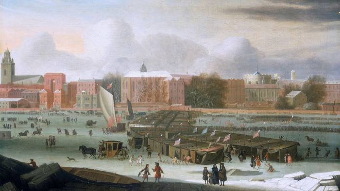

### 2020 - BoE warns UK set to enter worst recession for 300 years Central bank predicts 30 per cent drop in output in first half of 2020 but opts against new stimulus

The Bank of England has forecast that the coronavirus crisis will push the UK economy into its deepest recession in 300 years, with output plunging almost 30 per cent in the first half of the year, but it decided not to launch a new stimulus.

In its monetary policy report, the central bank presented rough and ready predictions for the economy, suggesting that output would slip 3 per cent in the first quarter followed by a further 25 per cent fall in the second. This would mean an almost 30 per cent drop overall in the first half of 2020, the fastest and deepest recession since the “great frost” in 1709.

The economic projections came with a warning to Britain’s banks that if they tried to stem losses by restricting lending, they would make the situation worse.

Andrew Bailey, the BoE governor, said a failure to lend would create a vicious circle of more bankruptcies and higher losses on loans that would come back to hit the banks themselves.

Speaking to journalists, Mr Bailey said: “The better path for banks is to keep lending . . . we keep banging this message home. If the system [ensures a good supply of loans], we’ll get a better outcome.”

  

Commercial banks responded that they were committed to lending through the crisis. Alison Rose, NatWest chief executive, said the bank was “committed to providing our customers, communities and colleagues with the support they need”.

Speaking at Barclays’ annual general meeting on Thursday, Jes Staley, chief executive, pledged that his bank would emerge with “a reputation as having stood with the citizens of Great Britain in this time of crisis”.

António Horta-Osório, chief executive of Lloyds Banking Group, last week said the bank was working with government and regulators “to ensure that we play our part in supporting our customers and the UK economy”.

But the BoE cautioned that, even with adequate lending, the economy was bound to take a big hit; household spending has dropped about 30 per cent since early March.

The central bank forecast that the UK’s unemployment rate was likely to rise to 9 per cent in 2021, even with the government’s job retention scheme protecting many employees from being laid off. That would mean a higher rate of joblessness than after the 2008-09 financial crisis.

The central bank also forecast that inflation would dip to 0.5 per cent in 2021, before returning to the 2 per cent target the following year.

In contrast to the gloomy assessment of the current economic position, the longer-term economic projections were more upbeat, with the BoE expecting “only limited scarring to the economy”.

The bank’s back-of-the-envelope scenarios assumed long-term damage to the economy would be only 1.5 per cent of gross domestic product and would come from missed business investment in 2020. Otherwise it predicted the economy would bounce back in a V-shaped recovery.

Mr Bailey said the economic rebound was likely to happen “much more rapidly than the pullback from the global financial crisis”.

> Britain needs a New Deal-style recovery model

The BoE said it stood ready to put more money into the economy should it be needed and had further meetings planned for June — before the £200bn it pledged in March to support economic activity by buying government bonds was likely to run dry.

Mr Bailey defended the decision not to take more immediate action, saying the measures announced in March had not been exhausted. “It’s a very aggressive [asset] purchasing programme . . . [and] we have made a very clear commitment to do what it takes to support the economy consistent with [meeting] the inflation target.”

Not all Monetary Policy Committee members supported the majority decision. Two of the nine members, Jonathan Haskel and Michael Saunders, voted to increase quantitative easing by another £100bn immediately, seeking more stimulus to prevent greater scarring of the economy later.

All MPC members agreed that more stimulus might be needed in future. In the minutes, the committee said: “For all members of this group, the prospective weakness in employment and inflation, and downside risks around aspects of the medium-term outlook, might necessitate further monetary policy action.”

Along with most economists, Paul Dales, chief UK economist at Capital Economics, said he thought the central bank was signalling that “more QE is coming, if not in June, then in August”.

The BoE also undertook an exercise to test whether the financial system could cope with the expected once-in-a-century recession.

It assessed that banks would lose less money than in its latest stress test and concluded that “the core banking system has capital buffers more than sufficient to absorb losses”.

It did, however, stress the pandemic would severely hit corporate cash flow. It said that while UK companies normally operate with a cash flow deficit of £80bn, the crisis would raise that to £190bn. Government support would plug some of the gap, but there remained a £60bn additional deficit that banks would need to cover to stop viable businesses from going under.

In the financial stability section of its report, the central bank warned that if high-street lenders failed to provide credit to their business customers, they might see a short-term benefit in reduced losses, but would cause more companies to fail and unemployment to rise another 2 percentage points, ultimately leading to larger losses.

---

Grupa 70 rosyjskich akademików podpisała protest wobec sposobu, w jaki władze Federacji Rosyjskiej „uczciły” właśnie rocznicę zbrodni katyńskiej. Tym „sposobem” było zdemontowanie tydzień wcześniej tablicy na dawnym więzieniu NKWD w Kalininie, w którym odbyła się trzecia część operacji katyńskiej: zamordowanie ponad 6 tysięcy polskich żołnierzy Korpusu Ochrony Pogranicza i policjantów. Prokuratura rosyjska obecnie „bada legalność” tablicy, która od 1991 roku przypominała prawdę o tej i innych zbrodniach sowieckiego systemu terroru. Znalazło się w rosyjskim świecie akademickim 70 odważnych ludzi, którzy nie dali się zastraszyć nowej fali agresywnego kłamstwa. Wiedzą, że chodzi o prawdę o systemie, który najbardziej zniewolił i wyniszczył samych Rosjan. Dlatego protestują. Nie dali złamać swej duszy strachowi. Piszę o znaczeniu tego ważnego gestu w najnowszym numerze tygodnika „DoRzeczy”:

---

Powell: There will be NO negative interest rates.

---

Dworzec główny w Bern, Szwajcaria, w każdym biletomacie można kupić Bitcoin

  

### 1981

W rocznicę objawień fatimskich, doszło do zamachu na życie papieża Jana Pawła II. Był to pierwszy przypadek w historii, kiedy przeprowadzono zamach na życie następcy świętego Piotra. Sprawcą zamachu był turecki fanatyk Mehmet Ali Agca, który już wcześniej miał kłopoty z prawem i był winny pozbawienia życia tureckiego dziennikarza. Kule dosięgły papieża i trafiły go w brzuch i rękę. Życie papieża ocalili lekarze i pielęgniarki z kliniki Gemelli. Po zamachu papież powiedział - ,,Modlę się za brata, który zadał mi cios, i szczerze mu przebaczam''. Jan Paweł II nigdy nie powrócił do pełnej sprawności. Do dzisiaj nie wiadomo kto był zleceniodawcą zamachu na życie Jana Pawła II. Istnieje wiele domysłów na ten temat. Sam zamachowiec wyznał w swojej książce, że za zleceniem stał Ajatollah Chomeini. Władze Watykanu zaprzeczają tym rewelacjom, a książkę Agcy określają mianem kłamstwa. Prawdopodobnie za zamachem na papieża stali przedstawicielekomunistycznego reżimu.

  

### 1946

W Poznaniu studenci Uniwersytetu Poznańskiego i Akademii Handlowej zorganizowali demonstrację sprzeciwu wobec władzy. Przczyną protestu poznańskich studentów były działania władz państwowych, które doprowadziły do dramatycznych wydarzeń w Łodzi, Krakowie, gdzie również aresztowano studentów tamtejszych uczelni i Włocławku, gdzie krwawo stłumiono prostesty sprzeciwiające się odwołaniu święta 3 maja.
1500 poznańskich studentów przeszło przez plac Cyryla Ratajskiego, plac Wolności, ulice Święty Marcin, Wały Batorego i ul. Fredry. Na placu Mickiewicza demonstracja została otoczona przez konne oddziały milicji. Aresztowano ponad 600. Władze postawiły zarzuty kilku osobom, wobec których zastosowały kilkumiesięczne areszty i pozbawienie prawa do udziału w głosowaniach. Jednak prawdziwych organizatorów protestu nigdy nie udało się ustalić.
Protesty z roku 1946 zaowocowały ponadto stworzeniem instrukcji rozpraszania demonstracji, którą po raz pierwszy wcielono w życie podczas wyborów w 1947 roku.

  

### 1940

Fragment pamiętnika Anny Hinel (zdjęcie) zamordowanej w wieku 19 lat w KL Auschwitz Birkenau harcerki i działaczki konspiracji niepodległościowej.

Przerwana nauka i wiążąca się z tym bezpośrednio sprawa wywozu do Niemiec, używam celowo tego wyrazu „wywóz” ponieważ lepiej on maluje sytuację niż „wyjazd na przymusowe roboty”. Tak, wywóz ludzi, tak jak wywóz bydła na odkrytych platformach i gonionych, wyłapywanych na ulicach, zabijanych i zakłuwanych bagnetami przy każdej próbie ucieczki. Granica wieku od 16 do 25 lat zaznaczona w odpowiednim ogłoszeniu nie jest wcale przestrzegana. Widziałam ludzi powyżej lat 50 i dzieci poniżej 14 ciągniętych do zakrytych wozów dziwnie podobnych do karawanów przynajmniej w moich oczach. Krążą pogłoski o morderczych transfuzjach krwi, dokonywanych na dzieciach, które to wypadki kończą się w większej części śmiercią ofiar. Wypijają z nas krew dosłownie. Dobrze, że nie jestem okazem kwitnącego zdrowia. Nędzny wygląd też czasem się przyda, ale z drugiej strony szepcą sobie na ucho takie okropne wieści o samym wywozie, że robi mi się na przemian to zimno to gorąco, gdy myślę o tym. W ogóle ogarnia mnie to okropny zwierzęcy strach przed mającym nastąpić nieszczęściem, to znów obojętność, jakby to wszystko zupełnie mnie nie dotyczyło. Mówią, że wszystko zależy od losu szczęścia i przypadku. Więc cała moja przyszłość zależy tylko i jedynie od przypadku, więc mało znaczące głupstewko zadecyduje o moim życiu?

  

### 1916

Rocznica przywrócenia nazwy Dęblin.

Twierdza Dęblin, nazywana również Iwangorod to zespół obiektów fortecznych wzniesionych przez Rosję w XIX wieku u ujścia Wieprza do Wisły. Pierwszymi osobami, które zwróciły uwagę na dogodne miejsce do budowy twierdzy byli Napoleon Bonaparte i gen. Ignacy Prądzyński. Po upadku powstania listopadowego, na stanowisko namiestnika Królestwa Polskiego powołany został Iwan Paskiewicz, któremu car, obok wielu godności i tytułów, przyznał prawo do przejęcia w dziedziczną własność ziem wchodzących w skład klucza dęblińskiego. Ponadto Skarb Królestwa Polskiego obciążony został przez Rosję wysoką kontrybucją pieniężną, obowiązkiem utrzymania armii okupacyjnej oraz kosztami rozbudowy twierdzy  w Modlinie i budowy w Dęblinie, którą to miejscowość, w związku  z imieniem nowego właściciela, przemianowano na Iwangorod. 

### 1901 roku urodził się Witold Pilecki

Rodzina Pileckich pochodzi z okolic Nowogródczyzny. W wyniku represji za udział w Powstaniu Styczniowym, część majątku uległa konfiskacie, a młodzi Pileccy zmuszeni do szukania pracy na stanowiskach rządowych rosyjskiego imperium. Ojciec Witolda, Julian Pilecki po ukończeniu studiów w Instytucie Leśnym w Petersburgu, przyjął posadę leśnika na północy Rosji w Karelii. Po wstąpieniu w związek małżeński z Ludwiką Osiecimską zamieszkali w Ołońcu. Tam urodziło się im pięcioro dzieci: Maria, Józef /zmarł w wieku 5 lat/, Witold, Wanda i Jerzy. W tym czasie rodzina Pileckich co roku wyjeżdżała na kilka tygodni do Sukurcz oraz na Mohylowszczyznę dla podtrzymania więzi rodzinnych a także dla pogłębiania znajomości języka polskiego i historii kraju przodków. Niski poziom nauczania w miejscowych szkołach i rusycyzmy w mowie małych Pileckich wpłynęły na decyzję rodziców o konieczności wyjazdu młodzieży z Ołońca. Ze względów materialnych, Julian Pilecki nadal pracował w Zarządzie Lasów Państwowych w Ołońcu, na stanowisku starszego rewizora, natomiast Ludwika Pilecka wraz z dziećmi w 1910 r. zamieszkała w Wilnie. Witold rozpoczął naukę w szkole handlowej - tzw. gimnazjum komercyjnym. Po rozpoczęciu nauki związał się też z nielegalnie działającym skautingiem.

Wybuch wojny w 1914 r. zaskoczył rodzinę Pileckich na wakacjach w Druskiennikach. Nie mogąc wrócić do zagrożonego niemiecką okupacją Wilna, ani do dalekiego Ołońca, gdzie pracował ojciec, Ludwika Pilecka w sierpniu tegoż roku pojechała do swej matki mieszkającej w Hawryłkowie na Mohylowszczyźnie i tam posłała dzieci do szkół w Orle. W tym małym kresowym miasteczku Witold założył pierwszy zastęp harcerski i zaczął też współorganizować kółka samokształceniowe.

Rok 1918 przyniósł kolejną zmianę w życiu Pileckich. Powstające po rewolucji w Rosji tzw. Komitety Fornalskie i Komitety Robotniczo-Chłopskie, podburzane przez nasłanych agitatorów, zaczęły rozgrabiać majątki ziemskie i likwidować złapanych właścicieli. Ludwika Pilecka, ostrzeżona przez okoliczną życzliwą ludność wiejską, wyjechała z rodziną do Wilna, pozostając tam praktycznie bez środków do życia, gdyż nie miała kontaktu z mężem pracującym w Ołońcu. Zaistniała sytuacja zmusiła ją do wyjazdu z miasta i zamieszkania w majątku Sukurcze zrujnowanym przez nieuczciwych dzierżawców i niemiecką grabież.

Jesienią 1918 r. Witold Pilecki powrócił do Wilna, by kontynuować przerwaną naukę tym razem w gimnazjum im. Joachima Lelewela. Na wieść o wycofywaniu się Niemców z miasta i zbliżaniu się wojsk bolszewickich, ochotnicy pod komendą gen. Władysława Wejtki, przystąpili do organizowania oddziałów samoobrony. W skład tych oddziałów weszła grupa starszych harcerzy, w której był Witold. Na przełomie 1918 i 1919 r. oddziały gen. W. Wejtki przejęły władzę w mieście. Nadciągające wojska bolszewickie były jednak o wiele silniejsze i zmusiły obrońców do opuszczenia miasta. 5 stycznia 1919 r. Witold Pilecki wraz z obrońcami Wilna, klucząc między niemieckimi pozycjami przedostali się przez Białystok do Łap, gdzie spotkali zorganizowany oddział Wojska Polskiego dowodzony przez braci Władysława i Jerzego Dąmbrowskich. W tym oddziale ułanów dowodzonym przez słynnego Jerzego Dąmbrowskiego „Łupaszkę” Witold walczył do jesieni 1919 r., a po ustabilizowaniu się frontu został zdemobilizowany i wrócił do nauki w wileńskim gimnazjum. Na wieść o polsko-bolszewickiej wojnie w lipcu 1920 r. ponownie wstąpił w szeregi wojska polskiego. W sierpniu 1920 r. pod komendą rtm. Jerzego Dąmbrowskiego walczył na przedmieściu Warszawy, później został skierowany do oddziałów gen. Lucjana Żeligowskiego.

Na początku 1921 r. został zwolniony z wojska, wrócił do Wilna , by kontynuować naukę w gimnazjum oraz działać w harcerstwie i prowadzić prace w Związku Bezpieczeństwa Kraju, do którego wstąpił w lutym 1921 r. W maju tegoż roku złożył egzamin maturalny przed Komisją Egzaminacyjną dla Byłych Wojskowych. Po ukończeniu kursów podoficerskich ZBK, Pilecki został komendantem-instruktorem Oddziału ZBK w Nowem-Święcianach. Na przełomie 1921 i 1922 r. odbył 10-miesięczny kurs w Szkole Podchorążych Rezerwy Kawalerii w Grudziądzu.

W 1922 r. Witold Pilecki rozpoczął studia na Uniwersytecie im. Stefana Batorego jako nadzwyczajny słuchacz Wydziału Sztuk Pięknych. Brak środków utrzymania, ciężka choroba ojca Juliana, zadłużenie majątku Sukurcze zmusiły Witolda do rezygnacji z ambitnych planów studiowania i podjęcia pracy zarobkowej. We wrześniu 1926 r. został właścicielem majątku, zaczął więc go modernizować i rozwijać aby był przykładem dla okolicznych właścicieli ziemskich i osadników wojskowych.

W 1929 r. Witold Pilecki poznał Marię Ostrowską, młodą nauczycielkę miejscowej szkoły, pochodzącą z Ostrowi Mazowieckiej. 7 kwietnia 1931 r Maria i Witold zawarli związek małżeński i zamieszkali w Sukurczach, gdzie urodził się im syn, a następnie córka.

Swojej działalności nie zawęził do pracy w majątku i opieki nad rodziną. Jako obywatel ziemski działał na rzecz innych, starając się przyciągnąć do pracy społecznej swoich przyjaciół i sąsiadów. Założył kółko rolnicze i mleczarnię, której był prezesem. Zajmował się także opieką społeczną. Oprócz tych rozlicznych zajęć znajdował czas na działalność artystyczną; pisał wiersze i malował. Do dziś w kościele parafialnym w Krupie wiszą dwa obrazy pędzla Witolda Pileckiego. W dworku w Sukurczach powstało kilka obrazów religijnych tworzonych techniką fresku. Zachowały się także baśniowe obrazy i rysunki namalowane dla dzieci: własnych i znajomych.

Dźwiganie rodzinnej schedy z ruiny, założenie rodziny, szeroka praca społeczna nie przesłoniły Witoldowi zauroczenia wojskiem. Jeszcze w 1925 r. odbył praktykę w 26 pułku Ułanów Wielkopolskich. W 1926 r. otrzymał promocję do stopnia podporucznika rezerwy ze starszeństwem z 1923 r. W późniejszych latach prawie corocznie uczestniczył w ćwiczeniach rezerwy w 26 pułku ułanów, a od 1931 r.- w Centrum Wyszkolenia Kawalerii w Grudziądzu. W 1932 r. w lidzkim powiecie utworzył z okolicznych osadników wojskowych Konne Przysposobienie Wojskowe „Krakus”. Został mianowany dowódcą Lidzkiego I Szwadronu PW. W 1937 r. KPW pow. lidzkiego zostało podporządkowane 19 Dywizji Piechoty. W 1938 r. Witold Pilecki otrzymał za swoją pracę społeczną i zaangażowanie społeczne Srebrny Krzyż Zasługi.

W końcu sierpnia 1939 r. 19 Dywizja Piechoty pod dowództwem gen. bryg. Józefa Kwaciszewskiego z włączonym doń szwadronem Witolda, została skierowana w okolice Piotrkowa Trybunalskiego do osłony szosy Piotrków – Tomaszów Mazowiecki. W nocy 5/6 września niemiecki XVI Korpus pancerny rozbił polską dywizję, więc rozproszeni żołnierze, wśród których był także Pilecki, po przejściu Wisły włączyli się w szeregi odtwarzanej 41 Dywizji Piechoty Rezerwy. Komendantem kawalerii dywizyjnej mianowano mjr. Jana Włodarkiewicza, a jego zastępcą został ppor. Witold Pilecki. Walcząc z Niemcami, żołnierze 41 D.P.Rez. kierowali się na południowy wschód w celu utworzenia przedmościa rumuńskiego. Po agresji ZSRR 17 września, dowództwo polskie chciało umożliwić przejście jak największej ilości żołnierzy na Węgry i do Rumunii, stąd w dalszym ciągu kierowano się na południe. 22 września dywizja została rozbita, żołnierze zaś otrzymali rozkaz złożenia broni. Żołnierze w większości nie skapitulowali. Część z nich uciekła na Węgry i podjęła dalszą walkę u boku sojuszniczej Francji. Inni, wśród których był Witold Pilecki, wrócili do kraju, by prowadzić podziemną walkę z okupantem.

Natomiast najbliższa rodzina Witolda mieszkająca w Sukurczach, po 17 września znalazła się pod okupacją sowiecką. By uniknąć losu polskich rodzin aresztowanych i wywożonych na Syberię przez NKWD, Maria Pilecka wraz z dziećmi ukrywała się wśród miejscowej ludności, poszukując możliwości przedostania się na teren Generalnego Gubernatorstwa. Dopiero w kwietniu 1940 r. udało się jej przekroczyć granicę sowiecko-niemiecką i dotrzeć do rodziców w Ostrowi Mazowieckiej. Dopiero tutaj dowiedziała się że jej mąż żyje i mieszka w Warszawie.

Witold Pilecki i żołnierze mjr. Jana Włodarkiewicza po dotarciu do okupowanej stolicy utworzyli organizację wojskową – Tajną Armię Polską przyjmując 9 listopada 1939 r. za początek jej działalności. W tym okresie działały już inne podziemne organizacje wojskowe, z których najstarszą, powstałą 26 września 1939 r. była Służba Zwycięstwu Polski przemianowana na Związek Walki Zbrojnej. Na czele TAP stanął mjr Włodarkiewicz ps. „Drawicz”. Witold Pilecki z wielkim zaangażowaniem włączył się w pracę TAP: pełnił rolę inspektora organizacyjnego, szefa Sztabu Głównego, szefa zaopatrzenia, szefa oddziału organizacyjno-mobilizacyjnego, szefa zaopatrzenia i służb specjalnych. Tajna Armia Polska obejmowała swoim zasięgiem Warszawę, Siedlce, Lublin, Radom i Kraków. W początkowym okresie TAP działała samodzielnie, równolegle do innych działających organizacji podziemnych. Po upadku Francji, gdy polskie władze wojskowe na emigracji poprzez swoich emisariuszy zachęcały i wzywały podziemne organizacje wojskowe do scalania, dowództwo TAP podjęło współpracę ze Związkiem Walki Zbrojnej, a w 1941 r. całkowicie się jej podporządkowało.

Witold Pilecki działając aktywnie w konspiracji, od 1940 r. pracował jako ajent hurtowni kosmetycznej „Raczyński i Ska”, co pozwalało mu na w miarę swobodne poruszanie się po Warszawie. Pomimo tylu różnorodnych zajęć zawsze starał się znaleźć czas dla swoich najbliższych. Z żoną kontaktował się stosunkowo często, z dziećmi o wiele rzadziej; wspólnie udało się im spędzić zaledwie kilka dni.

W 1940 r. władze niemieckie zaczęły organizować na ziemiach polskich obozy koncentracyjne. Obok zastraszenia społeczeństwa chodziło również o wyzyskanie darmowej siły roboczej i grabież mienia, oraz eksterminację więźniów.

Aresztowania wśród żołnierzy Tajnej Armii Polskiej, osadzanie coraz większej liczby skazańców w obozie koncentracyjnym Auschwitz i rozszerzająca się jego zła sława w miarę zwiększania jego funkcji eksterminacyjnych - wpłynęły na decyzję Witolda Pileckiego, by tam dobrowolnie się udać. Zamiar ten zrealizował 19 września 1940 r. podczas łapanki na Żoliborzu, skąd pod nazwiskiem Tomasza Serafińskiego dostał się do Auschwitz jako więzień nr 4859. Jesienią 1941 r. otrzymał awans na porucznika, który potwierdził fakt, że Pilecki poszedł do obozu ochotniczo, żeby tam zorganizować konspirację wojskową i zdobyć wiarygodne dane o zbrodniach popełnianych przez Niemców. W ZWZ-AK obowiązywała pragmatyka, iż z zasady nie awansowano więźniów.

Po przekroczeniu bramy z napisem „Arbeit macht frei”, niezależnie od przygotowania i wyobrażeń, każdy przybyły przeżywał szok. Tak samo zareagował Witold Pilecki. W czasie pobytu w Auschwitz trzykrotnie poważnie zachorował, ale pod opieką dr Jana Deringa, żołnierza TAP powrócił do sił. Obozowe przeżycia nie tylko nie załamały Pileckiego psychicznie, ale jakby dodatkowo mobilizowały do walki i do działania. Pierwsza grupa konspiracyjna, którą zawiązał wśród więźniów przywiezionych z Warszawy nosiła nazwę Tajnej Organizacji Wojskowej; tworzyły ją tzw. piątki. W miarę włączania kolejnych grup organizacji zmieniono nazwę na Związek Organizacji Wojskowych, który swoich żołnierzy miał we wszystkich komandach obozu oświęcimskiego. Nieco później, równolegle do konspiracyjnej działalności „Tomasza Serafińskiego” tę pracę zaczęły rozwijać inne organizacje wojskowe i polityczne z ZWZ-AK na czele.

Następnym celem, jaki Pilecki postawił przed sobą było połączenie grup konspiracyjnych w Auschwitz i przygotowanie do powstania. Rozmowy prowadzone z wyższymi uwięzionymi w obozie oświęcimskim wojskowymi były trudne, ale ideowość Witolda, widoczny brak żądzy władzy doprowadziła do scalenia wszystkich odłamów konspiracyjnych pod dowództwem płk Kazimierza Heilmana-Rawicza z ZWZ-AK. „Tomasz Serafiński” nadal zajmował się rozwijaniem sieci konspiratorów. Gdy Niemcy wywieźli płk Rawicza do obozu w Mauthausen, na czele organizacji postawiono płk pilota Juliana Gilewicza. Oprócz porozumienia i zjednoczenia organizacji wojskowych, Witoldowi Pileckiemu, po wielu rozmowach i przekonywaniu udało się doprowadzić do swoistego porozumienia politycznego między poszczególnymi partiami i nurtami politycznymi. Wyrazem tego porozumienia była wigilia zorganizowana w 1941 r., na której spotkali się przedstawiciele różnych ugrupowań ze Stanisławem Dubois i Janem Mosdorfem na czele. Po utworzeniu obozu Birkenau również tam zaczęto wciągać nowych ludzi w krąg konspiracji obozowej.

Po osiągnięciu zamierzonych celów więźniowie-konspiratorzy zaczęli prowadzić nasłuchy radiowe oraz przygotowywać plan aktywnej samoobrony i ewentualnego buntu na wypadek, gdyby Niemcy postanowili zlikwidować obóz. Witold Pilecki wespół z towarzyszami opracowywał szczegółowe przygotowania do akcji militarnej w różnych sytuacjach. Magazyn broni ZOW umieszczono i zamaskowano pod barakiem biura budowlanego. Ważnym polem działania Pileckiego w obozie było przekazywanie meldunków do Komendy Głównej ZWZ-AK w Warszawie. Początkowo przekazywał je za pośrednictwem zwalnianych więźniów-członków ZOW. Później, gdy Niemcy znieśli zbiorową odpowiedzialność za ucieczki, sam Związek Organizacji Wojskowych zaczął je organizować i przekazywać ważne informacje. Pierwsza ucieczka miała miejsce w maju 1942 r.

Wiosną 1943 r. rozpoczęły się aresztowania wśród najbliższych współpracowników „Tomasza Serafińskiego”. Gestapo miało coraz więcej danych o obozowej konspiracji. Władze Auschwitz zdecydowały się na przerzucenie „starych” polskich aresztantów do obozów na teren III Rzeszy. Gdy udało się uzyskać potwierdzenie tych decyzji, Witold Pilecki podjął plan ucieczki z Auschwitz. Wraz z dwoma więźniami: Janem Redzejem i Edwardem Ciesielskim dokonał tego w czasie świąt wielkanocnych z 26 na 27 kwietnia 1943 r. Chciał osobiście w Komendzie Głównej AK przedstawić sytuację w KL Auschwitz i uzyskać zgodę na akcję zbrojną i wyzwolenie więźniów. Po ucieczce, podczas pobytu w Wiśniczu poznał osobiście autentycznego Tomasza Serafińskiego, z którym nawiązał dozgonną przyjaźń i korespondował niemal do końca informując o sobie i współtowarzyszach ucieczki. W czasie oczekiwania na łączność z podziemiem Witold Pilecki namalował dwa obrazy, które podarował panu Tomaszowi, otrzymując w zamian dwie pozycje historyczne dotyczące Kresów. Tomasz Serafiński ps. „Lisola” będąc wówczas zastępcą komendanta placówki AK w Wiśniczu, przesłał meldunek o ukrywających się zbiegach komendantowi Okręgu Krakowskiego z prośbą o nawiązanie łączności ze zbrojnym podziemiem. Przedstawił też szczegółowy raport o zbrodniach popełnianych w Auschwitz oraz precyzyjny plan akcji zbrojnej w celu uwolnienia więzionych w obozie. Jednak dowództwo Okręgu Krakowskiego, obawiając się prowokacji, bardzo podejrzliwie potraktowało trójkę uciekinierów. Nie mogąc podjąć współpracy z Krakowem, Pilecki nawiązał łączność z Warszawą i 22 sierpnia 1943 r. wyjechał do stolicy licząc na zgodę KG AK i na przyspieszenie momentu przeprowadzenia akcji odbicia więźniów oświęcimskich.

Trzeba wspomnieć, że załoga obozu oświęcimskiego złożona z oddziałów SS liczyła powyżej 3 tysiące ludzi. Wokół Auschwitz Niemcy skoncentrowali liczne jednostki Wehrmachtu oraz siły policyjne i funkcjonariuszy administracyjnych. Przy tej ilości niemieckich oddziałów przewidywano, że siły partyzanckie mogłyby je powstrzymać i otworzyć obóz koncentracyjny na około pół godziny, a przez ten czas mogłoby uciec 200 – 300 więźniów. Reszta musiałaby szukać ratunku na własną rękę a to byłoby równoznaczne z zagładą. Podtrzymano jednak wcześniejszy wniosek o ataku na obóz, gdyby Niemcy zamierzali dokonać masowego mordu na więźniach i w takiej wersji został zatwierdzony przez Komendanta Głównego AK, gen. Tadeusza Komorowskiego ps. „Bór”. Witold Pilecki poznawszy różne aspekty sprawy, uznał powściągliwość KG AK i zupełny brak podstaw do optymistycznej oceny możliwości uwolnienia uwięzionych ludzi. Posiadane informacje przekazał konspiracyjnym kanałem żołnierzom w Auschwitz, a sam włączył się aktywnie w pracę konspiracyjną pod przybranym nazwiskiem „Romana Jezierskiego”. Nadal żył sprawami oświęcimiaków otaczając opieką ich rodziny, udzielając im – w miarę ówczesnych możliwości – wsparcia materialnego. Aż do wybuchu Powstania Warszawskiego żywo interesował się samym obozem i cały czas był w kontakcie z tamtejszym podziemiem. Było to dla niego o tyle łatwiejsze, że od stycznia 1944 r. komórką więzienną Oddziału II KG-kryptonim „Kratka” kierował współuciekinier z Auschwitz Jan Redzej ps. „Klemens”. 23 lutego 1944 r. Witolda Pileckiego awansowano na rotmistrza ze starszeństwem od listopada 1943 r.

W 1944 r. coraz wyraźniej zdawano sobie sprawę, iż tereny kraju zostaną zajęte przez Armię Czerwoną, która dobrowolnie ich nie opuści. Wobec niebezpieczeństwa okupacji przez ZSRR, którą obliczano na 5 – 10 lat zaczęto przygotowania do możliwości pozostania w konspiracji przez dłuższy czas. Zaistniała więc potrzeba stworzenia nowej organizacji podziemnej o charakterze polityczno-wojskowym, która miałaby uodpornić społeczeństwo na komunistyczną propagandę, mobilizować siły ducha narodu i chronić osoby i instytucje konspiracyjne przed inwigilacją. Do utworzenia organizacji konspiracyjnej pod kryptonimem „NIE” – Niepodległość gen. Tadeusz Komorowski ps. ”Bór” skierował płk Augusta Emila Fieldorfa. Była to konspiracja w konspiracji. Do tej działalności oddelegowano też Witolda Pileckiego. Współpracując ze Stefanem Miłkowskim odpowiedzialnym za polityczną stronę powstającej organizacji, „Witold” miał organizować strukturę planowania akcji bojowych. Dalszą pracę |nad rozwojem i udoskonaleniem „NIE” przerwało Powstanie Warszawskie.

Chociaż Witold Pilecki ze względu na pracę w organizacji „NIE” nie powinien się włączyć czynnie do walk powstańczych, nie pozostał biernym świadkiem. Początkowo walczył jako szeregowy żołnierz w Zgrupowaniu „Chrobry II” starając się zachować anonimowość. Jednak w miarę upływu czasu, gdy coraz bardziej potrzebni byli oficerowie ujawnił swój stopień wojskowy. W pierwszych dniach powstania walczył w 1 kompanii „Warszawianka” w budynku Wojskowego Instytutu Geograficznego. W miarę toczonych walk powstańczych został zastępcą, a następnie dowódcą 2 kompanii I batalionu broniącej rejonu ulic Towarowej i Srebrnej ze składami Hartwiga. Podczas walk nawiązał przyjaźń z kapelanem Zgrupowania „Chrobry II” ks. kpt. Antonim Czajkowskim ps. „Badur”. Spotkał też towarzysza ucieczki z Auschwitz – Edwarda Ciesielskiego ps. „Beton”. Od niego dowiedział się o śmierci Jana Redzeja przy zdobywaniu WIG.

Po 63 dniach walki Powstanie Warszawskie upadło. Powstańcy musieli złożyć broń i udać się do niewoli. 5 października 1944 r. rtm. Witold Pilecki wraz z żołnierzami Zgrupowania „Chrobry II” wyruszył do Ożarowa, skąd po kilku dniach pojechał do Lamsdorf, a 19 października skierowano go do Murnau. Tam przebywał do wyzwolenia opiekując się młodymi powstańcami, za co otrzymał wdzięczne miano „Taty”. 9 lipca 1945 roku Witold Pilecki wyjechał z obozu w Murnau do II Korpusu Polskich Sił Zbrojnych we Włoszech, gdzie oficjalny przydział do służby otrzymał równocześnie z urlopem, który miał wykorzystać na przygotowanie się do powrotu do Polski. Zamieszkał w San Giorgio i dzielił czas na spisywanie wspomnień oświęcimskich i na rozmowy z wyższymi dowódcami PSZ o czekających go zadaniach i sposobach ich realizacji. W drugiej połowie października 1945 r. wyruszył do kraju razem z Marią Szelągowską, współpracownicą z okresu okupacji i Bolesławem Niewiarowskim, przyjacielem z walk powstańczych. Do Warszawy dotarł 8 grudnia 1945 r. z dokumentami wystawionymi na nazwisko Romana Jezierskiego, gdyż taką kennkartę miał w Powstaniu Warszawskim i z nią poszedł do niewoli.

W kraju panował chaos. W lutym 1945 r. Rząd Tymczasowy przeniósł się do Warszawy. Na terenie całego obszaru trwała akcja organizowania sił bezpieczeństwa i milicji, które uzupełniały działający na rdzennych ziemiach polskich radziecki aparat NKWD. Rozwiązanie Armii Krajowej rozkazem z 19 stycznia 1945 roku oznaczało formalne przejęcie aktywności konspiracyjnej przez szkieletową organizację „NIE”. Tymczasem brak kontaktu ze zwierzchnikami, porwane sieci łączności, odcięcie od informacji sprawiły, iż z konieczności powstały nowe grupy polityczne i wojskowe, nowe ośrodki oporu. Ludzie zagrożeni uwięzieniem i wywozem na Syberię uciekali do lasu tworząc nowe oddziały partyzantki niepodległościowej, która przechodziła od samoobrony do pojedynczych wypadów na posterunki MO czy placówki UBP, biorąc odwet za represje.

Po powrocie do kraju Witold Pilecki podobnie jak i cały naród był przekonany, że „polscy” (pełniący obowiązki Polaków) komuniści są agentami wrogiego mocarstwa. Stąd wierność złożonej przysiędze nakazywała mu służyć prawowitemu rządowi Rzeczypospolitej Polskiej i jej dowództwu wojskowemu. Zaczął nawiązywać kontakty organizacji „NIE”, która jednak faktycznie nie rozwinęła działalności. Poza tym została ujawniona jej struktura działania w czasie moskiewskiego procesu 16 przywódców Polski Podziemnej w kwietniu 1945 r. Gen. Władysław Anders 15 kwietnia 1945 r. rozwiązał organizację „NIE”.

Podjęta decyzja nie rozwiązywała nabrzmiałych problemów: troski o los tysięcy żołnierzy AK, przeciwstawienie się propagandzie dążącej do zniszczenia dorobku Polskiego Państwa Podziemnego, powstrzymanie odruchów determinacji i wskazania obywatelskiej postawy ideowej w nowych warunkach odbudowy kraju. Próbując temu sprostać płk Jan Rzepecki wraz ze współpracownikami delegatury Sił Zbrojnych 2 września 1945 r. powołali do istnienia „Ruch oporu bez wojny i dywersji – Wolność i Niezawisłość”. Była to organizacja społeczno-polityczna, która wzywała do opozycji ale bez broni w ręku. Po aresztowaniu prezesa płk Rzepeckiego, WiN kontynuowało działalność pod kierownictwem płk Józefa Rybickiego oraz płk Franciszka Niepokólczyckiego.

Rozwiązanie „NIE” zmusiło Witolda Pileckiego do zaczynania od początku: lokalizacji w nowych warunkach i powolnego, systematycznego montowania siatki łączności. Współpracowników dobierał z byłych żołnierzy TAP i oświęcimskiej konspiracji. Przy ich pomocy zdobywał tajne i poufne informacje na temat życia gospodarczego kraju, działania NKWD i komunistów, narastania terroru, fałszerstw w polityce, sytuacji oddziałów leśnych, z którymi kontaktował się osobiście lub przez kurierów. Cały materiał był fotografowany i przekazywany kurierom, którzy oddawali go w II Korpusie.

W tym czasie „Roman Jezierski” wiele uwagi poświęcał także gromadzeniu i opracowywaniu wspomnień o organizacji konspiracyjnej w obozie KL Auschwitz. Do tej pracy zmusiło go fałszywe przedstawianie obozowej rzeczywistości z czym zaczął się spotykać na co dzień.
Z żoną kontaktował się tylko co dwa tygodnie, w czasie przyjazdu do Warszawy, gdy dokonywała zakupu książek do księgarni prowadzonej w Ostrowi Mazowieckiej. Nocowała wtedy w mieszkaniu wynajmowanym przez męża. Na swoje utrzymanie „Roman Jezierski” sam zarabiał prowadząc z Marią Szelągowską wytwórnię wód perfumowanych i projektując do nich etykietki. Pracował też na etacie magazyniera w firmie budowlanej Swobodzińskiego przy ul. Kaliskiej.

Władze komunistyczne kontynuowały akcje przeciw polskiemu podziemiu. W ciągu kilku miesięcy 1946 r. stracono ogółem 120 członków różnych organizacji podziemnych. Aresztowania dotykały żołnierzy, którzy ujawnili się po kolejnej amnestii ogłoszonej 2 sierpnia 1945 r. rozpropagowanej jako akt „dobrej woli” Tymczasowego Rządu Jedności Narodowej.

W czerwcu 1946 r. Witold Pilecki otrzymał za pośrednictwem emisariuszki z Włoch wydany przez gen. Andersa rozkaz wyjazdu na Zachód, gdyż jest spalony i poszukiwany. W sierpniu tę wiadomość potwierdził Bolesław Niewiarowski. Jednak „Roman Jezierski” ociągał się z podjęciem decyzji z dwóch powodów: tu miał rodzinę, a żona odmówiła wyjazdu z dziećmi, choć sama nalegała na jego wyjazd; oraz nie było odpowiedniego kandydata na jego miejsce. Na początku 1947 r. szef sztabu II Korpusu gen. Kazimierz Wiśniowski odwołał poprzedni rozkaz i zatwierdził pracę Witolda Pileckiego w kraju.

Tymczasem „władza ludowa” dążąc do całkowitego zwycięstwa na ziemiach polskich posługiwała się zdradą i prowokacją, które stanowiły główny atut sukcesów sił bezpieczeństwa „Polski Lubelskiej”. W drugiej połowie 1946 r. rozbite zostały większe oddziały partyzanckie (Kurasia, Bernaciaka), w listopadzie aresztowano płk Niepokólczyckiego. Aresztowania dotykały nie tylko ludzi podziemia, ale także członków stronnictw politycznych szczególnie Polskiego Stronnictwa Ludowego. Środkiem służącym zastraszeniu społeczeństwa były pokazowe procesy działaczy podziemia zakończone wyrokami śmierci. W styczniu 1948 r. stracono przywódców Narodowego Zjednoczenia Wojskowego, w marcu członków Komendy Głównej NSZ, w sierpniu płk Niepokólczyckiego i jego współpracowników.

Również w przypadku Witolda Pileckiego i jego bliskich współpracowników użyto tych wypróbowanych sposobów. Do WiN wprowadzono agenta, Leszka Kuchcińskiego, byłego żołnierza TAP i poddano ją dłuższej inwigilacji. Przy jego pomocy MBP chciało rozpoznać siły i środki jakimi dysponowała grupa Pileckiego, by skutecznie skompromitować podziemie „bandycką działalnością”, przez próbę podsunięcia likwidacji filarów MBP: J. Różańskiego, J. Brystygierowej, R. Romkowskiego, J. Czaplickiego, G. Korczyńskiego – tzw. raport „Brzeszczota”. Ów raport miał politycznie i moralnie zniszczyć całą organizację. Prowokacja się jednak nie udała; „Roman Jezierski” przesłał raport na Zachód i czekał na instrukcje z II Korpusu.

Wobec zaistniałej sytuacji Wydział II Departamentu III MBP przystąpił do aresztowań: Witolda Pileckiego zatrzymano 8 maja 1947 r., a od 6 do 22 maja 1947 r. uwięziono 23 osoby, z których tylko 7 zostało uznanych za niewinne i zwolniono. Od 9 maja Pilecki znajdował się w X Pawilonie więzienia mokotowskiego w całkowitej izolacji. Śledztwo przeciwko niemu nadzorował płk R. Romkowski i na protokołach przesłuchań znajdują się dopiski i polecenia pisane jego ręką (dokumenty ze śledztwa są zgromadzone w Archiwum Głównej Komisji Badania Zbrodni przeciw Narodowi Pilskiemu, Instytucie Pamięci Narodowej).

Przesłuchiwany był przez: por. S. Łyszkowskiego, por. Krawczyńskiego, ppor. J. Kroszela, por. T. Słowianka, ppor. E. Chimczaka i por. S. Alaborskiego, którzy słynęli z okrucieństwa. Koszmar przesłuchiwania trwał pół roku. 4 listopada 1947 r. w obecności oficera śledczego MBP por. M. Krawczyńskiego i prokuratora Naczelnej Prokuratury Wojska Polskiego mjr Rychlika, Witold Pilecki potwierdził złożone w śledztwie zeznania, składając podpis pod formułą o ich dobrowolności i bez represyjności.

Tymczasem rtm. Pilecki był torturowany! Potwierdzają ten fakt zeznania więźniów – współtowarzyszy i informacje księży Jana Stępnia i Antoniego Czajkowskiego, którzy w tym czasie też znajdowali się w więzieniu Rakowieckim. Jednak podpisanie spreparowanych materiałów śledczych zamykało śledztwo i można było odpocząć od tortur i udręki przesłuchań. Ponadto oczekiwanie na proces dawało nadzieję na możliwość odparcia wymuszonych zeznań i spreparowanych, absurdalnych zarzutów.

Zaraz po uwięzieniu Pileckiego, jego oświęcimscy przyjaciele zwrócili się do innego współwięźnia – premiera Józefa Cyrankiewicza z prośbą o interwencję. Zamiast odpowiedzi, Cyrankiewicz wystosował pismo do przewodniczącego składu sędziowskiego, w którym sugerował, by nie brano pod uwagę działalności „Tomasza Serafińskiego” w Auschwitz, lecz by rozprawiono się z nim jako „wrogiem ludu i Polski Ludowej”.

Proces Witolda Pileckiego i jego towarzyszy: Marii Szelągowskiej, Tadeusza Płużańskiego, Szymona Jamontta-Krzywickiego, Maksymiliana Kauckiego, Jerzego Nowakowskiego, Witolda Różyckiego i Makarego Sieradzkiego rozpoczął się 3 marca 1948 r. w siedzibie warszawskiego Rejonowego Sądu Wojewódzkiego przy ul. Nowowiejskiej. Na ten „jawny” proces wpuszczono za specjalnymi biletami część najbliższej rodziny oraz ludzi z resortu. Sądowemu składowi przewodniczył mgr ppłk Jan Hryckowian, a członkami składu byli: sędzia wojskowy mgr kpt. Józef Badecki, ławnik kpt. Stefan Nowacki i protokolant por. Ryszard Czarkowski. Oskarżycielem „Witolda” był wiceprokurator Naczelnej Prokuratury Wojska Polskiego mjr Czesław Łapiński. Oskarżał go o posiadanie broni, którą Pilecki po upadku powstania – podobnie jak większość powstańców – ukrył w skrytce i nie używał. Kolejne oskarżenie dotyczyło przygotowywania zamachów zbrojnych na prominentów reżimu, ale częściowo je utajniono, gdyż opierało się na materiale pozostałym po nieudanej prowokacji. Ostatnim zarzutem było oskarżenie o posługiwanie się fałszywymi dokumentami wystawionymi na nazwisko Romana Jezierskiego. Podczas rozprawy prokurator nie dopuścił do przesłuchania świadków oskarżenia przebywających w większości w więzieniach oraz zrezygnował ze świadków obrony.

Rozstrzygnięcia zapadały poza salą sądową. Proces w swym założeniu miał dostarczyć materiału propagandowego na potwierdzenie tezy o szpiegowskiej działalności grupy „Witolda” i współpracy z Niemcami w czasie okupacji. Ponadto miał stać się środkiem sterroryzowania społeczeństwa w jego odruchach niepodległościowych. Dlatego oskarżyciel żądał dla oskarżonych kary śmierci. W ostatnim słowie oskarżeni odrzucili zarzut szpiegostwa i świadomego uczestnictwa w działalności tego typu, podkreślali natomiast postawę żołnierskiej służby w dobrej sprawie.

15 marca 1948 r. w południe ogłoszono wyrok: W. Pilecki, M. Szelągowska i T. Płużański zostali skazani na karę śmierci, M. Sieradzki na dożywocie, a pozostali na kilkanaście lat więzienia. W uzasadnieniu wyroków śmierci sąd wojskowy podał: „dopuścili się najcięższej zbrodni stanu i zdrady narodu, cechowało ich wyjątkowe napięcie złej woli, przejawiali nienawiść do Polski Ludowej i reform społecznych, zaprzedali się obcemu wywiadowi i wykazali szczególną gorliwość w akcji szpiegowskiej”. Można zauważyć, że to uzasadnienie potwierdza polityczny i propagandowy charakter procesu u wyroku.
Skarga rewizyjna jaką złożyli obrońcy oskarżonych przyczyniła się do zmiany kary śmierci Marii Szelągowskiej na dożywocie – tylko ze względu na jej płeć. Karę śmierci zamieniono na dożywocie także Tadeuszowi Płużańskiemu. Prośby o ułaskawienie skierowane do prezydenta Bolesław Bieruta przez obrońcę, przez przyjaciół oświęcimskich i przez Marię, żonę Pileckiego zostały odrzucone.

25 maja 1948 r. o godz. 21.30 w obecności Wiceprokuratora Naczelnej Prokuratury Wojska Polskiego mjr S. Cypryszewskiego, Naczelnika więzienia Mokotowskiego – por. Ryszarda Mońko, lekarza por. dr lek. Kazimierza Jezierskiego, duchownego – ks. kpt. Wincentego Martusiewicza rozstrzelano Witolda Pileckiego, a ciało potajemnie pogrzebano prawdopodobnie na tzw. „Łączce” dziś kwatera „Ł” cmentarza Powązkowskiego.
Dopiero we wrześniu 1990 r. Sąd Najwyższy uniewinnił rotmistrza i jego towarzyszy, ukazał niesprawiedliwy charakter wydanych wyroków, uwypuklił patriotyczną postawę skazanych w tym procesie.

W lipcu 2006 r. Prezydent RP Lech Kaczyński w uznaniu zasług Witolda Pileckiego i jego oddania sprawom ojczyzny odznaczył go pośmiertnie Orderem Orła Białego.

Autor: Lidia Świerczek. Muzeum Woli.

  

### 1949

"Ksiądz mógł Dachau przeżyć, ale UB ma lepsze metody i tu ksiądz nie przeżyje".
Takie tragicznie prorocze słowa usłyszał od jednego z łódzkich ubeków ksiądz Roch Łaski (zdjęcie) kapelan major Polskich Sił Zbrojnych na Zachodzie, kapłan Diecezji Łódzkiej, uczestnik wojny polsko- bolszewickiej odznaczony „Medalem Pamiątkowym za Wojnę 1918-1921.
Ksiądz Łaski został ostentacyjnie aresztowany przez funkcjonariuszy UB w Wielki Piątek 15 kwietnia 1949 roku podczas odprawiania nabożeństwa w kościele Witowie w województwie łódzkim, gdzi był proboszczem. Wielokrotnie był był brutalnie przesłuchiwany i namawiany do współpracy. Nikogo nie wydał, nic nie zdradził, nie dał się złamać. Został zamordowany przez łódzkie UB 13 maja 1949 roku.
Miał 47 lat.

  

### 1940

Gubernator generalny Hans Frank stwierdził:
" . W rezultacie (akcji AB) będzie musiało się rozstać z życiem kilka tysięcy Polaków, głównie ze sfer ideowych przywódców polskich... Ludzi podejrzanych należy natychmiast likwidować.
Więźniów wysyłanych z Generalnej Guberni do obozów koncentracyjnych w Rzeszy powinno się albo dostarczyć nam z powrotem, abyśmy mogli objąć ich akcją AB, albo zlikwidować na miejscu."

  

### 1906

Maria Skłodowska-Curie została pierwszą w 650 letniej historii paryskiej Sorbony kobietą z tytułem profesora fizyki. Miała wtedy 38 lat.
Wiele osób nie chciało do tego dopuścić, ponieważ paryska prasa oskarżała ją o liczne romanse. Wiele z tych oskarżeń nigdy się nie potwierdziło. Na jej niekorzyść przemawiało również to, że pochodziła z Polski, co w okresie panującej wtedy we Francji ksenofobii nie mogło dobrze jej wróżyć. Skłodowską w niektórych kręgach traktowano jako osobę co najmniej podejrzaną. Jednak władze Sorbony nie miały wyjścia. Skłodowska była już wtedy osobą bardzo znaną. Była laureatką Nagrody Nobla za odkrycie nowych pierwiastków. Odrzucenie jej wywołałoby w świecie naukowym skandal.

  

> Niczego w życiu nie należy się bać, należy to tylko zrozumieć.

---

### 1863

Odbyła się bitwa pod Kietlanką. Oddział powstańczy pułkownika Ignacego Mystowskiego starł się z rosyjską formacją generała- majora Tolla.
Powstańcy urządzili tu zasadzkę na rosyjski pociąg pancerny wiozący żołnierzy generała Tolla do Małkini.
Zasadzka się nie udała. W wyniku zdrady
konduktora Suchodolskiego pociąg z wojskiem
rozpoczął wcześniej hamowanie i wykolejeniu
uległa jedynie jego przednia część. Powstańcy
zaatakowali jadący pociąg z prawej strony
toru z lasu zwanego Rukieciną. Rosjanie
przygotowani wyciągnęli ciężką broń.
Powstańcy popełnili ciężki błąd, obsadzając
jedną tylko stronę torów, co umożliwiło
wojskom carskim skuteczne prowadzenie
ostrzału zza wagonów. Zaalarmowany w
Czyżewie większy oddział rosyjski przybył
pospiesznie i wezwał z Małkini drugi oddział,
który nadjechał pociągiem. Zaatakowani z
dwóch stron powstańcy zaczęli wycofywać się
i zgrupowali się do walki wśród zabudowań i
drzew Kietlanki, oddzielonej od torów
podmokłym terenem bagnistym. Powstańcy
walczyli dzielnie i długo, ale bitwa zakończyła
się ich klęską. Nie pomogły podciągnięte
rezerwy ani zwerbowani w najbliższej okolicy
ochotnicy, którzy na odgłos walki chwycili za
broń. Powstańcy rozproszyli się potem po
okolicznych lasach i wioskach lub schronili się
za Bugiem.
Bitwa zakończyła się klęską. W walce zginęli
wszyscy dowódcy batalionów wraz z dowódcą
ppłk Ignacym Mystkowskim oraz 40
powstańców, 25 było rannych. Ignacy
Mystkowski został pochowany na cmentarzu w
Zarębach Kościelnych, o czym świadczy akt
zgonu znajdujący się w księdze parafialnej.W
bitwie zginął też Piotr Mystkowski, krewny
pułkownika, urodzony w 1822 roku.

  

---

<a href="https://github.com/TomaszWaszczyk/historia.waszczyk.com/edit/master/src/content/may-13.md" target="_blank">Edytuj tę stronę dzieląc się własnymi notatkami!</a>
