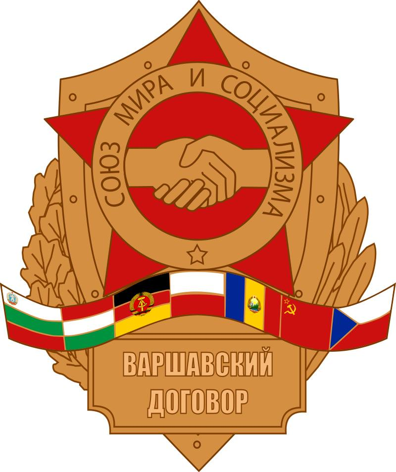
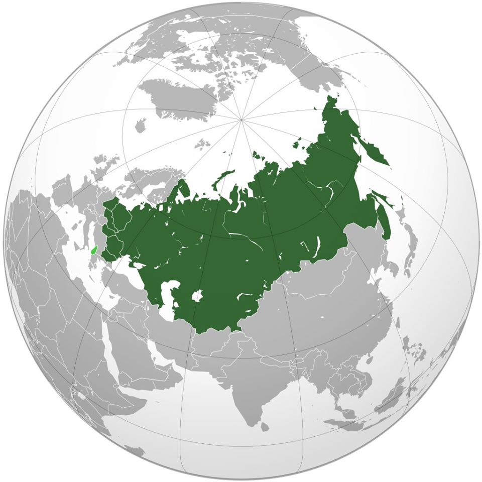
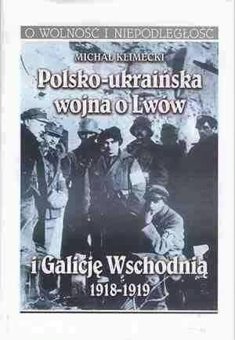
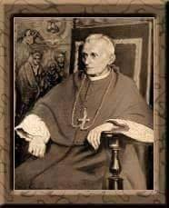
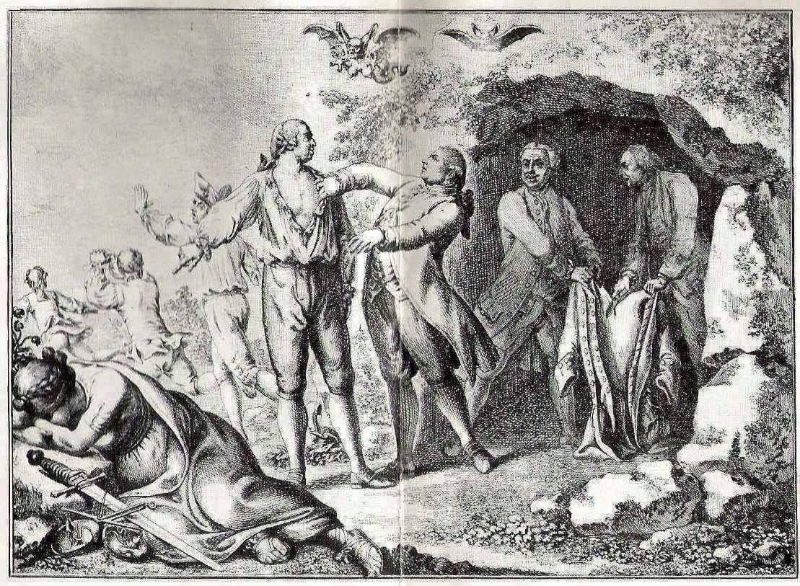

### 2021

Politycy PiS coraz częściej mówią o konieczności przywrócenia poboru wojskowego. Za podjęciem tej decyzji przemawia rosnące niebezpieczeństwo ze strony Rosji i Białorusi oraz niestabilna sytuacja w Europie. Czy przywrócenie tego obowiązku jest możliwe?

Zasadnicza służba wojskowa została zawieszona w 2009 roku po jednogłośnej decyzji Sejmu, którą następnie zatwierdził ówczesny prezydent Lech Kaczyński. Obecnie część polityków oraz ekspertów uważa, że te zarządzenie było błędem.

Największą zwolenniczką powrotu służby zasadniczej jest sędzia TK oraz była posłanka PiS, Krystyna Pawłowicz. Jak twierdzi, nakazuje tego nawet konstytucja, której jeden z artykułów głosi, że "obowiązkiem obywatela polskiego jest obrona Ojczyzny". Podobnego zdania jest również były szef MON Antoni Macierewicz.

Obecnie już wiadomo, że decyzja o likwidacji obowiązku odbywania zasadniczej służby wojskowej była nieprzemyślana i spowodowała tak duże szkody, że naprawić je można tylko poprzez powrót do przymusowego poboru - stwierdził w rozmowie z Defence24.pl, kmdr ppor. rez. Maksymilian Dura.

### 2020

🔴78 mld zł, aż 3 proc. polskiego PKB, to dług, jaki polski rząd zaciągnął w ciągu zaledwie dwóch tygodni.
🔴W tym tempie III RP jeszcze się zadłużała. Smaczku całej sprawie dodaje zachowanie resortu finansów, który do tej pory nie poinformował o operacjach, które do tego doprowadziły.
🔴Z rejestrów Krajowego Depozytu Papierów Wartościowych wynika, że w kwietniu wyemitowane zostały trzy serie obligacji Skarbu Państwa na 31,7 mld zł. 🔴Z jakiegoś powodu Ministerstwo Finansów nie poinformowało o tym.

‼Podało tylko, że przeprowadziło jedną emisję 2 kwietnia.‼

🔴Skarbówkę wyręczył amerykański Bloomberg i Polska Agencja Prasowa. 🔛Powołując się na dane KDPW, wykazali, że przeprowadzone zostały trzy inne emisje:

1. DS1029 na 16,7 mld,

2. DS0725 – na 10 mld,

3. WS0428 na 5 mld zł.

Z nowej Strategii Bezpieczeństwa Narodowego, o tym, że RP zamierza: "Rozwijać współpracę strategiczną ze Stanami Zjednoczonymi Ameryki, szczególnie w obszarach bezpieczeństwa i obronności (w tym w formie stałej obecności sił zbrojnych Stanów
Zjednoczonych Ameryki w Polsce), technologii, handlu i energetyki."

Także dobrze by było rozumieć amerykańskiego sojusznika i jego historię, a nie bazować na mitach i pozorach, opowieściach o Pułaskim i Kościuszce. Trzeba wiedzieć ile w głowie Wuja Sama jest idealizmu, ile realizmu, a ile myślenia mocarstwowego, ile przesady, a ile rzeczywistych obaw. "Historia jest dla narodów tym, czym charakter dla poszczególnych ludzi" - mawia Henry Kissinger.

---

Co jeszcze ukryto w tarczy?

Najpierw wersja skomplikowana:

- "Art. 39 Tarczy Antykryzysowej zmienił treść artykułu 19 ust. 1 ustawy o Służbie Więziennej, przyznając tej formacji prawo do stosowania broni umożliwiającej obezwładnianie osób za pomocą energii elektrycznej (np. paralizatorów typu taser). Funkcjonariusze Służby Więziennej mogą teraz używać broni elektrycznej w przypadkach określonych w art. 11 pkt 1–6, 8, 9 i 11–14 ustawy o środkach przymusu bezpośredniego i broni palnej (Dz. U. z 2019 r., poz. 2418), czyli m.in.

1. do wyegzekwowania zachowania zgodnie z wydanym poleceniem,
2. do pokonania oporu – biernego i czynnego,
3. do przeciwdziałania autoagresji,
4. do ochrony i przeciwdziałania naruszeniu porządku lub bezpieczeństwa publicznego;
5. do przeciwdziałania niszczeniu mienia;
6. do zapewnienia bezpieczeństwa konwoju lub doprowadzenia;

Zmiana ta jest ukryta w art. 39 ustawy z 31 marca 2020 r. (o zmianie specustawy z 2 marca o szczególnych rozwiązaniach związanych z zapobieganiem, przeciwdziałaniem i zwalczaniem COVID-19, Dz. U. z 2020 r., poz. 568)".

Choć właściwie wystarczyłoby zostawienie pierwszego punktu.

A teraz wersja prosta. Możnaby ustalić prawo mówiące po prostu:

- "Służba Więzienna ma prawo uzyć paralizatora kiedy tylko poczuje taką ochotę.

---

### NBP wypuszcza właśnie nowe złote monety

  

---

### Senate Votes to Allow FBI to Look at Your Web Browsing History Without a Warrant

The government just got even more power to spy on your internet habits as millions remain quarantined at home.

The US Senate has voted to give law enforcement agencies access to web browsing data without a warrant, dramatically expanding the government’s surveillance powers in the midst of the COVID-19 pandemic.

The power grab was led by Senate majority leader Mitch McConnell as part of a reauthorization of the Patriot Act, which gives federal agencies broad domestic surveillance powers. Sens. Ron Wyden (D-OR) and Steve Daines (R-MT) attempted to remove the expanded powers from the bill with a bipartisan amendment.

But in a shock upset, the privacy-preserving amendment fell short by a single vote after several senators who would have voted “Yes” failed to show up to the session, including Bernie Sanders. 9 Democratic senators also voted “No,” causing the amendment to fall short of the 60-vote threshold it needed to pass.

“The Patriot Act should be repealed in its entirety, set on fire and buried in the ground,” Evan Greer, the deputy director of Fight For The Future, told Motherboard. “It’s one of the worst laws passed in the last century, and there is zero evidence that the mass surveillance programs it enables have ever saved a single human life.”

The vote comes at a time when internet usage has skyrocketed, with tens of millions of Americans quarantined at home during the COVID-19 pandemic. Privacy advocates have warned for over a decade that allowing warrantless access to web search queries and browsing history allows law enforcement to easily crack down on activists, labor organizers, or anyone else the government deems a threat.

“Today the Senate made clear that the purpose of the PATRIOT Act is to spy on Americans, no warrants or due process necessary,” Dayton Young, director of product at Fight For the Future, told Motherboard. “Any lawmaker who votes to reauthorize the PATRIOT Act is voting against our constitutionally-protected freedoms, and there’s nothing patriotic about that.”

### 2017

Richard Stallman - American Capitalism has turned into Plutocracy

### 1983

W Warszawie w wieku 19 lat zmarł Grzegorz Przemyk (zdjęcie)- uczeń XVII Liceum Ogólnokształcącego imienia Modrzewskiego.
Do śmierci doszło na skutek pobicia przez milicjantów, którzy aresztowali go 12 maja 1983 roku na Placu Zamkowym w Warszawie, kiedy to świętował on razem z kolegami zakończenie egzaminów maturalnych.
Przemyk został pobity przez 3 milicjantów po przewiezieniu go na pobliski komisariat. Zmarł w wyniku ciężkich obrażeń uszkodzenia jamy brzusznej.
Śmierć Grzegorza Przemyka oraz jej okoliczności stały się przedmiotem kombinacji i dezinformacji ze strony komunistycznych władz i podległej im propagandy. Na skutek fałszywych całą winę zrzucono na sanitariuszy pogotowia ratunkowego, a generał Czesław Kiszczak przyznał funkcjonariuszom Ministerstwa Spraw Wewnętrznych nagrody za "ujawnienie wobec opinii publicznej rzeczywistej prawdy".
Grzegorz Przemyk jest pochowany na warszawskim Cmentarzu Powązkowskim w kwaterze 100.

  

https://pl.wikipedia.org/wiki/Oficyna_Wydawnicza_%E2%80%9ERytm%E2%80%9D

### 1955

Podpisano Układ Warszawski.

W maju 1955 r. do Organizacji Paktu Północnoatlantyckiego przyjęto Republikę Federalną Niemiec. Wydarzenie to dało impuls do działań Związku Radzieckiego i bloku państw pozostających w zasięgu jego wpływów. 14 maja w Warszawie został zawarty układ podpisany przez 8 państw: Związek Socjalistycznych Republik Radzieckich, Albańską Republikę Ludową, Bułgarską Republikę Ludową, Socjalistyczną Republikę Rumunii, Niemiecką Republikę Demokratyczną, Węgierską Republikę Ludową, Polską Rzeczpospolitą Ludową i Czechosłowacką Republikę Socjalistyczną. Organizacja miała charakter polityczno-wojskowy i skierowana była przeciwko NATO. Układ nabrał mocy obowiązującej 4 czerwca 1955 r., kiedy to sygnatariusze złożyli rządowi PRL wszystkie dokumenty ratyfikujące. Organizacja została powołana na dwadzieścia lat z automatycznym przedłużeniem o dalszych dziesięć.

Do paktu nie przystąpiła Jugosławia, a od 1962 r. w pracach organów Układu nie uczestniczyła również Albania, która ostatecznie wycofała się 13 września 1968 r. W ramach Układu działały dwa główne organy, tj. Doradczy Komitet Polityczny oraz Zjednoczone Dowództwo Sił Zbrojnych. Później powstały dalsze ciała organizacyjne, z których najważniejsze były Komitet Ministrów Spraw Zagranicznych i Komitet Ministrów Obrony. Powołano również wspólne dowództwo Układu w Moskwie.

Układ Warszawski przyczynił się do umocnienia pojałtańskiego porządku międzynarodowego w Europie i dominacji ZSRS we wschodniej Europie. Struktury polityczne Układu zostały rozwiązane 1 lipca 1991 na posiedzeniu Doradczego Komitetu Politycznego państw w Pradze.

  

  

### 1919

W czasie wojny polsko-
ukraińskiej rozpoczęła się ofensywa wojsk polskich w Galicji Wschodniej.
Natarcie rozwijało się pomyślnie, oddziały
polskie, z wyjątkiem pozycji wokół Lwowa, nie
natrafiły na poważniejszy opór nieprzyjaciela.
Słabe liczebnie, niedostatecznieuzbrojone
oddziały UAG unikały walki. Z dnia na dzień
polska ofensywa nabierała tempa. Na Wołyniu
oddziały gen. Iwaszkiewicza poważnie
zachwiały południowym skrzydłem frontu UAG.
Broniący tego odcinka frontu III Korpus UAG
nie wytrzymał polskiego uderzenia. Nastąpił
chaotyczny odwrót, między wycofującymi się
jednostkami powstawały luki. Uzyskana przez
stronę polską przewaga pozwalała na
kontynuowanie szybkich działań ofensywnych.

  

### 1867

Pozostanie wśród nas duchem swych czynów, bo te czyny żyją i wywołują go przed oblicze stęsknionego narodu, który łaknie wspaniałych wzorów życia, który w każdym wieku musi mieć swych wielkich mężów, obrazy godnego
życia..."
Stefan kard. Wyszyński, 1951
Tymi słowami Wyszyński określił urodzonego 14 maja 1867 w Krasiczynie kardynała Adama Sapiehę.
Był on absolwentem Instytutu Katolickiego w Lille oraz Uniwersytetu Jagiellońskiego. W 1890 roku.
rozpoczął studia teologiczne na Uniwersytecie w Innsbrucku, które od 1892 roku kontynuował we Lwowie.
1 października 1893 roku przyjął święcenia kapłańskie. Po ukończeniu studiów teologicznych krótko pracował w parafii w Jazłowcu, skąd w 1895 roku wyjechał po dalszą naukę do Rzymu. Rok później na Papieskiej Akademii Kościelnej uzyskał stopień doktora obojga praw. Jednocześnie kształcił się w dziedzinie dyplomacji w Kościelnej Akademii Szlacheckiej. Do kraju powrócił w 1897 roku.
Przez kolejne cztery lata był wicerektorem lwowskiego Seminarium Duchownego, a następnie wikariuszem parafii św. Mikołaja we Lwowie. W 1905 roku został wezwany do Rzymu, gdzie objął godność szambelana papieskiego.
8 listopada 1911 roku cesarz Franciszek Józef wyznaczył go na ordynariusza krakowskiego.
Sakrę biskupią przyjął z rąk Piusa X w Kaplicy Sykstyńskiej 7 grudnia 1911 roku Jako Biskup aktywnie działał na rzecz ofiar I wojny światowej, zakładając Książęco – Biskupi Komitet Pomocy dla Dotkniętych Klęską Wojny. Po zakończeniu wojny ks. biskup
Sapieha pozostawał gorącym zwolennikiem niezależności Kościoła polskiego, wspierając ideę postawienia na jego czele biskupa warszawskiego, jako prymasa.
Po odzyskaniu niepodległości przez Polskę został wybrany senatorem z listy
Chrześcijańskiego Związku Jedności
Narodowej, jednak mandat złożył po zaledwie kilku miesiącach (9 marca 1923 r.), wobec papieskiego zakazu sprawowania funkcji publicznych przez hierarchów kościelnych. W
1925 r., kiedy diecezję krakowską podniesiono do rangi archidiecezji, został mianowany arcybiskupem.
W czasie okupacji wykazał się bardzo niezłomną postawą godnie zastępując przebywającego wtedy we Francji prymasa Hlonda. To on również był inicjatorem powstania "Tygodnika Powszechnego",którego pierwsze wydanie ukazało się marcu 1945 roku. 18 lutego 1946 roku otrzymał kapelusz kardynalski. W PRL – u wciąż stał na pozycjach niepodległościowych. Był jednym z inicjatorów listów protestacyjnych Episkopatu Polski,
potępiających represje władz wobec polskiego Kościoła.
Ks. kard. Adam książę Sapieha zmarł 23 lipca 1951 r. Został pochowany w krypcie pod katedrą wawelską. Za swoją działalność niepodległościową, duszpasterską i społeczną był wielokrotnie nagradzany. W 1936 r. został odznaczony Orderem Orła Białego, otrzymał też doktoraty honorowe Uniwersytetu
Jagiellońskiego (1926 r.) oraz KUL (1949 r.).

  

### 1772

Wojska austriackie przekroczyły granicę Polski.
Dokonano I rozbioru Rzeczypospolitej.
Bezpośrednim i wygodnym uzasadnieniem
dokonania rozbioru stał się zamach i próba
porwania (do porwania nie doszło) 3
listopada 1771 r. króla Stanisława Augusta
Poniatowskiego przez spiskowców,
związanych z konfederatami barskimi.
Wszystkie trzy dwory rozpętały kampanię,
jakoby był to dowód na niezdolność
Rzeczypospolitej do utrzymania porządku i
jedności wewnętrznej oraz że jej stan
anarchii jest zagrożeniem dla trzech
sąsiednich państw.
Decyzja o rozbiorze Polski zapadła w
Petersburgu już w połowie 1771 roku,
jednak ambasador rosyjski Kasper von
Saldern miał polecone trzymanie Polaków
w nieświadomości. 18 września 1772 roku
Rosja, Austria i Prusy notyfikowały
Rzeczypospolitej fakt rozbioru, żądając
zwołania sejmu dla przeprowadzeniacesji .
Opór łamały groźby i dokuczliwa okupacja
kraju przez wojska trzech mocarstw.
Austriacy zagarnęli Małopolskę.
Na zdjęciu obraz autorstwa Daniela Mikołaja Chodowieckiego "I rozbiór Polski.

  

---

<a href="https://github.com/TomaszWaszczyk/historia.waszczyk.com/edit/master/src/content/may-14.md" target="_blank">Edytuj tę stronę dzieląc się własnymi notatkami!</a>
