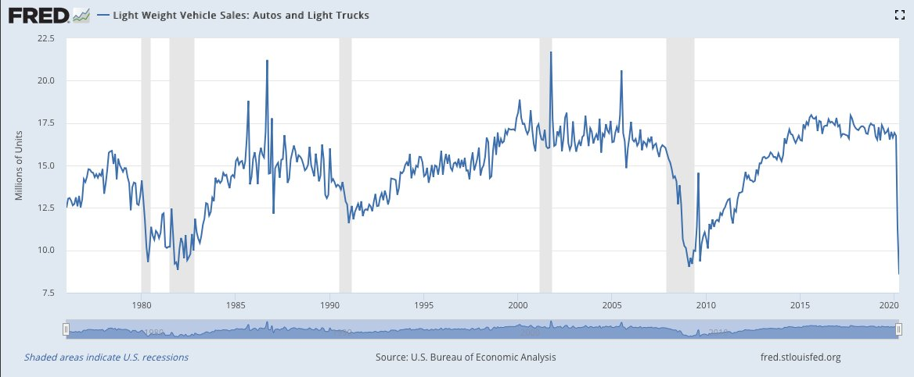
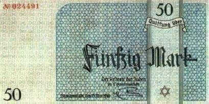
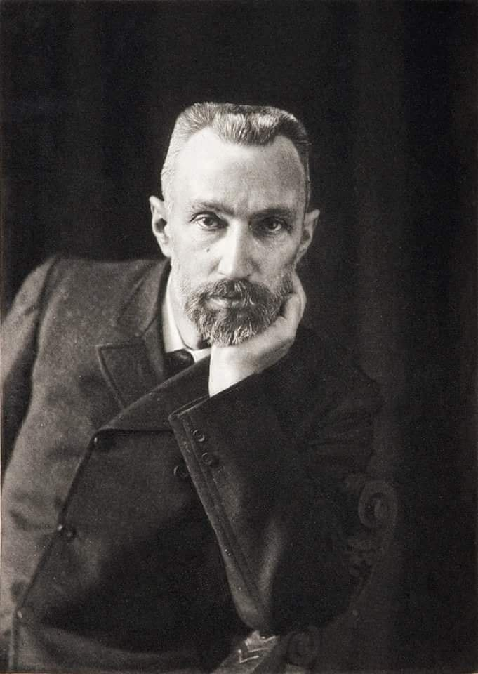
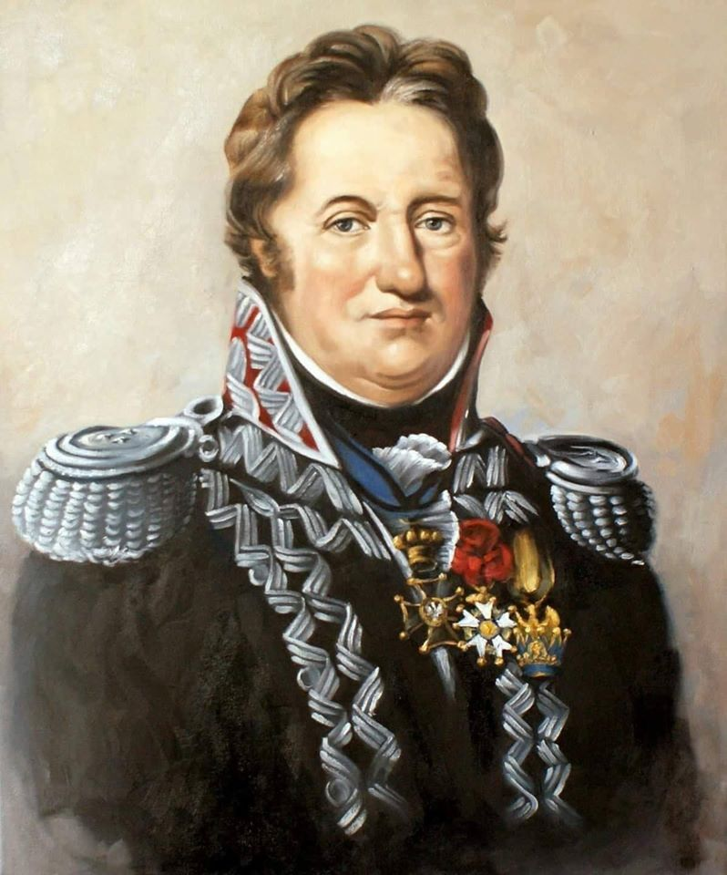

### 2023

  

---

Quite the interesting disclosure here that; "At third quarter end, 722 banks reported unrealized losses exceeding 50% of capital 31 of these banks report negative tangible equity levels"

This is all due to interest rate hikes and underwater bonds that, if needed to be sold today would be worth less than at maturity. So as long as the game of musical chairs continues, "the banking system being “sound and resilient"."

<a href="./documents/may/board-briefing-on-impact-of-rising-interest-rates-and-supervisory-approach-20230214" target="_blank">FED Report</a>

### 2022

Jeff Bezos:

> In fact, the administration tried hard to inject even more stimulus into an already over-heated, inflationary economy and only Manchin saved them from themselves. Inflation is a regressive tax that most hurts the least affluent. Misdirection doesn’t help the country.

---

  

  

---

### 2021

Nowy Ład:

Polskie państwo do obywatela: bogać się, ale jak przekroczysz 8 tys. netto, to cię dojedziemy, wyciśniemy i ograbimy. Dla ambitnych, niezależnych, wybijających się ponad przeciętność w tym planie miejsca brak. To wielki plan łapówkowy dla grupy wyborców, których PiS uznał za swój potencjalny cel.

Wg PiSu polski oligarcha mieszka w 70-metrowej rezydencji z płaskim dachem i zarabia 10 tysięcy złotych brutto. 30 lat przemian, w tym 6 "dobrej zmiany" i dorobiliśmy się kilku procent bogaczy zarabiających miesięcznie 2.200€, których trzeba opodatkować, bo im się w dupach z nadmiaru poprzewraca.

No cóż - tak właśnie działa d***kracja.
Właściwie to już ochlokracja.

### 2020

Worst auto sales since 1983, in the depth of the early 1980's recession.

  

  

### 1993

  

### 1983

Zmarł 19-letni maturzysta,poeta Grzegorz Przemyk.Został skatowany przez milicjantów na komisariacie-bito tak,że nie było obrażeń zewnętrznych.W szpitalu lekarze odkryli,że otrzewną chłopca wypełniały 2 l brązowej treści płynnej-kał,ropa,krew.Przemyk był bity fachowo.

  

### 1953

W więzieniu Urzędu Bezpieczeństwa przy ulicy Rakowieckiej w Warszawie zamordowany został Dionizy Sosnowski "Zbyszek" (zdjęcie) radiotelegrafista, kapral podchorąży zrzeszenia Wolność i Niezawisłość, tajny agent w szeregach Związku Młodzieży Polskiej. Zwerbowany przez UB do udziału w operacji "Cezary" czyli pozorowanym przez Ministerstwo Bezpieczeństwa Publicznego stworzeniu struktur V Komendy WiN. Aresztowany przez UB w ramach likwidacji operacji "Cezary" po powrocie z Monachium, gdzie brał udział w zorganizowanym przez Delegaturę Zagraniczną WiN kursie radiotelegrafistów z elementami szkolenia dywersyjnego. Odznaczony Brązowym Krzyżem Zasługi z Mieczami. 18 lutego 1953 roku został skazany na karę śmierci przez skład sędziowski Wojskowego Sądu Rejonowego w Warszawie pod przewodnictwem pułkownika Mieczysława Widaja. Miał 24 lata.

  

### 1940

Wyemitowany został nowy banknot o nominale 50 marek polskich.
Jego projektantami byli Ignacy Gutman i Pinkus Szwarc. Banknot był drukowany w znajdującej się na terenie łódzkiego getta drukarni Manitiusa.
W obiegu znajdował się od 9 lipca 1940 roku do sierpnia 1944 roku.
Boguś15 maja 1940 roku wyemitowany został nowy banknot o nominale 50 marek polskich.
Jego projektantami byli Ignacy Gutman i Pinkus Szwarc. Banknot był drukowany w znajdującej się na terenie łódzkiego getta drukarni Manitiusa.
W obiegu znajdował się od 9 lipca 1940 roku do sierpnia 1944 roku.

  

---

Fragment memoriału pt "Kilka myśli o traktowaniu obcoplemiennych na wschodzie" opublikowanego przez Heinricha Himmlera 15 maja 1940 roku.
" Musimy starać się uznawać i podtrzymywać jak najwięcej odrębnych narodowości, a więc obok Polaków i Żydów także Ukraińców, Białorusinów, Górali, Łemków i Kaszubów. Jeśli gdziekolwiek jeszcze się da znaleźć jakieś odłamy narodowościowe - to te także.(...) Chcę przez to powiedzieć, że najbardziej zainteresowani jesteśmy nie tym, ażeby ludność wschodu jednoczyć, lecz przeciwnie, ażeby ją rozbić na możliwie wiele części i odłamów. Nie leży w naszym interesie doprowadzanie wymienionych narodowości do jedności i wielkości i stopniowe budzenie wśród nich świadomości narodowej i rozwijanie kultury narodowej, lecz przeciwnie,rozbicie ich na niezliczone małe odłamy i cząstki. (...) W ciągu (...) 4 do 5 lat np. pojęcie Kaszubów musi stać się nieznane, ponieważ wówczas kaszubskiego narodu już nie będzie (odnosi się to szczególnie do Prus zachodnich). Musi być także możliwe w okresie nieco dłuższym spowodowanie zniknięcia na naszym obszarze narodowych pojęć Ukraińców, Górali i Łemków. To co zostało powiedziane o tych odłamach narodowych, odnosi się w odpowiednio większych rozmiarach także do Polaków".

  

### 1926

W czasie Przewrotu Majowego dobiegły końca walki wojsk rządowych ze zwolennikami Józefa Piłsudskiego.
Na skutek trwającej dwa dni rewolty życie straciło prawie 400 osób, a prezydent Stanisław Wojciechowski złożył swój urząd.

  

### 1922

W Kozienicach w województwie mazowieckim urodziła się Irena Gut- Opdyke ps. ,,Mała'' - Sprawiedliwa wśród Narodów Świata, która poświęciła swoją godność i zgodziła się zostać kochanką niemieckiego oficera, by ten nie wydał Żydów, których ukrywała. Życie zawdzięczają Jej: Ida Lazar, Roman Haller, Tomas, Clara Bauer, Zosia, Moise Lifschitz, Alex Rosen, Abram Klinger, Joseph Weiss, Marion Willer, Franka Silberman, Henry Weinbaum

W 1939 roku uczęszczała do szkoły pielęgniarskiej.
Po wkroczeniu Armii Czerwonej do Polski została uwięziona, pobita i zgwałcona przez sowieckich żołdaków, potem przymuszona do pracy jako pomoc medyczna w szpitalu polowym. W 1940 uciekła do rodziny przebywającej w Radomiu, ale wkrótce zatrzymana w łapance przez Niemców, którzy skierowali ją do pracy w fabryce amunicji; stamtąd trafiła do lżejszej pracy jako pomoc kuchenna w niemieckim hotelu garnizonowym w Radomiu. W 1942 oficer SS, major Edward Rugemer zabrał ją ze sobą do Tarnopola, gdzie pracowała jako kierowniczka pralni i pomoc domowa w jego willi. W pralni pracowali Żydzi z pobliskiego getta. Irena Gut pomagała im m.in. poprzez dostarczanie żywności. Podczas likwidacji getta w Tarnopolu latem 1943 pomogła uciec 12 Żydom, ratując ich przed wywózką do obozu zagłady i śmiercią: piątkę ukryła w pralni, a pozostałą siódemkę ukryła w piwnicy willi należącej do majora Rugemera. Jedna z ukrywanych kobiet spodziewała się dziecka. Irena Gut nie dopuściła, by kobieta dokonała aborcji. Takim sposobem uratowała trzynaste ludzkie istnienie.
Major Rugemer odkrył po pewnym czasie fakt, że Irena Gut ukrywa w jego domu Żydów, ale zgodził się na dalsze ich pozostawanie pod warunkiem, że Gut oprócz pomocy domowej zostanie jego kochanką.
W marcu 1944, na krótko przed wkroczeniem Armii Czerwonej, Irena została aresztowana przez gestapo. Zdołała uciec. Trafiła do radzieckiego obozu jenieckiego, skąd wyprowadzili ją – spotkani przypadkowo – uratowani przez nią Żydzi.
W obozie przejściowym poznała swojego przyszłego męża pełnomocnika ONZ Williama Opdyke, z którym wyjechała do Stanów Zjednoczonych.
Zmarła 17 maja 2003 roku.
25 września 2008 r. w synagodze East Park na Manhattanie odbyła się uroczystość przekazania Krzyża Komandorskiego Orderu Zasługi Rzeczypospolitej Polskiej nadanego pośmiertnie przez Prezydenta RP Lecha Kaczyńskiego Irenie Gut-Opdyke.który otrzymała za bohaterską postawę i niezwykłą odwagę wykazaną w ratowaniu życia Żydom podczas II wojny światowej, za wybitne zasługi w obronie godności człowieczeństwa i praw ludzkich, za działalność na rzecz rozwijania współpracy i przyjacielskich stosunków między Polską i Stanami Zjednoczonymi Ameryki oraz Izraelem. W imieniu zmarłej mamy order odebrała córka.

  

### 1909

W Krakowie powstał Akademicki Związek Sportowy.
Jest to obecnie największa organizacja
zajmująca się sportem w polskim
środowisku akademickim , zrzeszająca
blisko 50 tysięcy osób na ponad 200
uczelniach. Studenci w AZS mogą uprawiać
ponad 30 dyscyplin sportowych, zarówno
rekreacyjnie , jak i zawodowo. Sportowcy
AZS stanowią około 25% ogółu polskiej
reprezentacji narodowej.
Do najsłynniejszych wychowanków AZS należa między innymi:
Halina Konopacka, Waldemar Baszanowski i Jacek Wszoła.

  

### 1859

W Paryżu urodził się Pierre Curie- francuski fizyk, profesor zwyczajny Uniwersytetu Paryskiego na Wydziale Matematyczno-Fizycznym, członek francuskiej Akademii Nauk. Prywatnie mąż Marii Skłodowskiej-Curie, z którą w 1903 r. otrzymał Nagrodę Nobla za prace nad promieniotwórczością. Ojciec Eve Curie i Irène Joliot-Curie.
Zmarł 19 kwietnia 1906 roku. Powodem śmierci było przejechanie przez konny wóz ciężarowy.

  

### 1850

W Beyzymach Wielkich, położonych nad rzeką Chomoren na Wołyniu urodził się Jan Beyzym - polski misjonarz, jezuita, błogosławiony Kościoła katolickiego.

Po ukończeniu gimnazjum w Kijowie w 1872 r. wstąpił do Towarzystwa Jezusowego (jezuitów). 26 lipca 1881 r. w Krakowie przyjął święcenia kapłańskie. Przez wiele lat był wychowawcą i opiekunem młodzieży w kolegiach Towarzystwa Jezusowego w Tarnopolu i Chyrowie.
W wieku 48 lat podjął decyzję o wyjeździe na misje. Prośba, którą 23 października 1897 roku skierował do generała zakonu jezuitów, o. Ludwika Martina, świadczy o tym, że była ona głęboko przemyślana: Rozpalony pragnieniem leczenia trędowatych, proszę usilnie Najprzewielebniejszego Ojca Generała o łaskawe wysłanie mnie do jakiegoś domu misyjnego, gdzie mógłbym służyć tym najbiedniejszym ludziom, dopóki będzie się to Bogu podobało. Wiem bardzo dobrze, co to jest trąd i na co muszę być przygotowany; to wszystko jednak mnie nie odstrasza, przeciwnie, pociąga, ponieważ dzięki takiej służbie łatwiej będę mógł wynagrodzić za swoje grzechy. Generał wyraził zgodę. Początkowo o. Beyzym miał jechać do Indii, ale nie znał języka angielskiego. Udał się więc na Madagaskar, gdzie językiem urzędowym był francuski, którego Beyzym uczył się już w Chyrowie. Tam oddał wszystkie swoje siły, zdolności i serce opuszczonym, chorym, głodnym, wyrzuconym poza nawias społeczeństwa; szczególnie dużo uczynił dla trędowatych. Zamieszkał wśród nich na stałe, by opiekować się nimi dniem i nocą. Stworzył pionierskie dzieło, które uczyniło go prekursorem współczesnej opieki nad trędowatymi. Z ofiar zebranych głównie wśród rodaków w kraju (w Galicji) i na emigracji wybudował w 1911 r. w Maranie szpital dla 150 chorych, by zapewnić im leczenie i przywracać nadzieję. W głównym ołtarzu szpitalnej kaplicy znajduje się sprowadzona przez o. Beyzyma kopia obrazu Matki Bożej Częstochowskiej. Do dzisiaj chorzy Malgasze otaczają Maryję z Jasnej Góry wielką czcią. Szpital bowiem istnieje do dziś.

Wyczerpany pracą ponad siły, o. Beyzym zmarł 2 października 1912 roku, otoczony nimbem bohaterstwa i świętości. Śmierć nie pozwoliła mu zrealizować innego cichego pragnienia - wyjazdu na Sachalin do pracy misyjnej wśród katorżników.

Proces beatyfikacyjny o. Jana Beyzyma SJ - "posługacza trędowatych" - rozpoczął się w 1984 roku. Dekret Kongregacji Spraw Kanonizacyjnych dotyczący heroiczności życia i cnót o. Beyzyma został odczytany w obecności św. Jana Pawła II w Watykanie 21 grudnia 1992 roku. W marcu 2002 r. kard. Macharski zamknął dochodzenie kanoniczne w sprawie cudownego uzdrowienia młodego mężczyzny za wstawiennictwem Jana Beyzyma. Jego beatyfikacji dokonał podczas swej ostatniej pielgrzymki do Polski św. Jan Paweł II.

  

### 1814

Car rosyski Aleksander I powołał do życia Komitet Wojskowy, którego zadaniem miało być przekształcenie Armii Księstwa Warszawskiego w Armię Królestwa Kongresowego. W jego skład weszli generałowie: Jan Henryk Dąbrowski (grafika), Józef Wielhorski, Józef Zajączek, Józef Sierakowski, Stanisław Skarbek -Woyszczyński, Antoni Paweł Sułkowski i Franciszek Maksymilian Paszkowski.
Komitet miał miał kierować całą formacją wojska polskiego oraz zbadać stany służby wszystkich oficerów, przedstawić cesarzowi do zatwierdzenia kandydatów na generałów i pułkowników, wybierając ich większością głosów.

  

### 1702

Anglia, Holandia i Austria wypowiedziały wojnę Francji i Hiszpanii – początek wojny o sukcesję hiszpańską.

Ten krwawy konflikt toczony w latach 1702 – 1714 przez wszystkie kraje Europy Zachodniej stanowił kulminację ery hegemonii francuskiej i był ostatnią z serii wielkich wojen Ludwika XIV Burbona z koalicją państw opierających się jego potędze. Bezpośrednią przyczyną była bezdzietna śmierć w 1700 roku Karola II Habsburga, władcy Hiszpanii.

Imperium ze stolicą w Madrycie stanowiło konglomerat terytoriów, nad którymi „nigdy nie zachodziło słońce”. Obejmowało Niderlandy Południowe (dzisiejsza Belgia i Luksemburg), Mediolan, Neapol, Sycylię, Sardynię, olbrzymie kolonie w Ameryce Północnej i Południowej oraz posiadłości na azjatyckich Filipinach. Wprawdzie rządzona przez Habsburgów Hiszpania była pogrążona w kryzysie i dawno utraciła status pierwszego mocarstwa w Europie, jaki miała w XVI stuleciu, ale nadal była łakomym kąskiem dla europejskich rodów panujących. Ten, kto zasiadłby na tronie w Madrycie, automatycznie wszedłby do wąskiego grona najpotężniejszych władców na świecie.

O hiszpańską koronę zabiegało dwóch poważnych kandydatów: ks. Filip Andegaweński, wnuk Ludwika XIV, oraz arcyksiążę Karol Habsburg z austriackiej linii rodu, młodszy syn cesarza Leopolda I. Po długich przetargach dyplomatycznych Ludwik XIV i Wilhelm Orański uzgodnili podział imperium hiszpańskiego: Filip miał dostać posiadłości w Europie (Niderlandy Południowe, Mediolan, Neapol, Sycylię i Sardynię), a arcyksiążę tron w Madrycie i kolonie. Jednak na ten układ nie zgodzili się Hiszpanie. Karol II zapisał tron Filipowi, ale pod warunkiem zachowania niepodzielności państwa. Ludwik XIV początkowo nie chciał przyjąć tego „prezentu”, ale po dłuższych namowach namaścił wnuka na króla Hiszpanii. Obrażony Leopold I nie zaakceptował faktów dokonanych przez francuskich Burbonów i w 1701 roku wybuchła wojna francusko-hiszpańsko-austriacka. Wkrótce dołączyły do niej Anglia i Holandia zaniepokojone wzrostem potęgi francuskiej.

W 1702 roku Francja, Hiszpania i Kolonia (w 1703 roku doszlusowała do nich Bawaria) wypowiedziały wojnę Wielkiemu Sojuszowi, czyli Anglii, Holandii, Austrii, Prusom, Hanowerowi, Hesji, Palatynatowi i innym mniejszymi państewkom niemieckim (niebawem przyłączyły się do niego Portugalia i Sabaudia). Najlepszy angielski wódz John Churchill ks. Marlborough został głównodowodzącym sił angielsko-holenderskich walczących we Flandrii.

Zapowiadały się długie zmagania gigantycznych armii, ponieważ Francja wysłała w pole 300 tys. żołnierzy, Hiszpania i Bawaria po 50 tys., a Kolonia ok. 15 tys. – łącznie ponad 400 tys. zbrojnych. Wielki Sojusz dysponował 60 tys. wojsk angielskich lub pozostających na angielskim żołdzie, 100 tys. holenderskich, 100 tys. austriackich, 50 tys. sabaudzkich, 50 tys. portugalskich i ok. 150 tys. niemieckich. Razem było to prawie 0,5 miliona ludzi oraz niemal 200 okrętów liniowych. Poza tym kapitały tzw. państw morskich – Anglii i Holandii, pozwalały na finansowanie wysiłków zbrojnych innych sojuszników.

  

---

<a href="https://github.com/TomaszWaszczyk/historia.waszczyk.com/edit/master/src/content/may-15.md" target="_blank">Edytuj tę stronę dzieląc się własnymi notatkami!</a>
