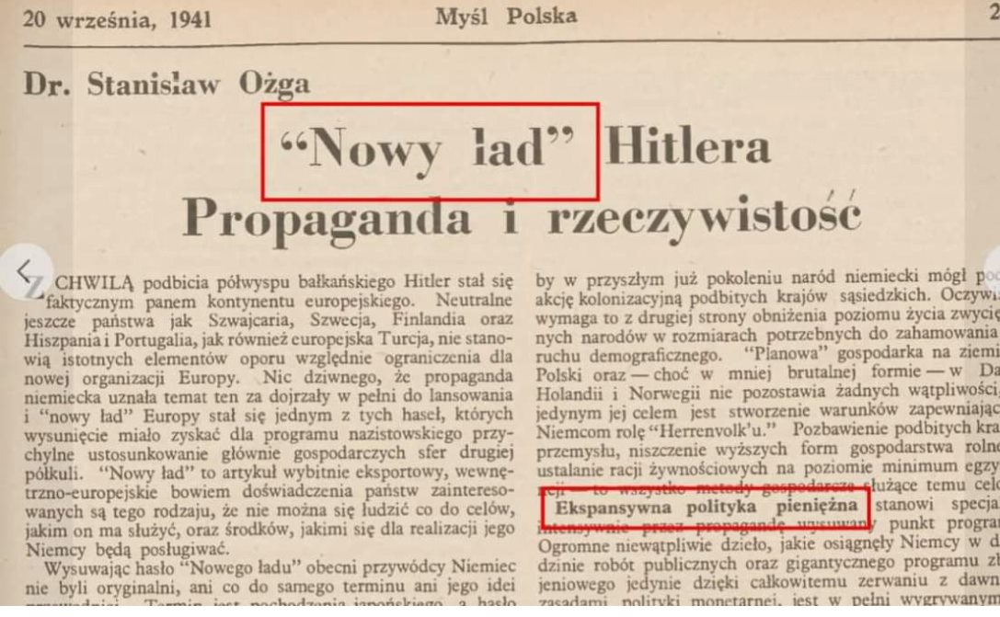
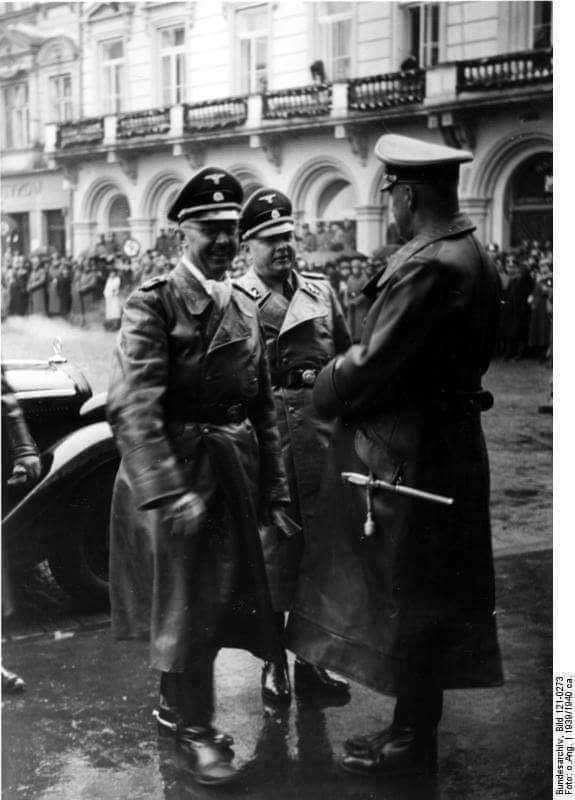
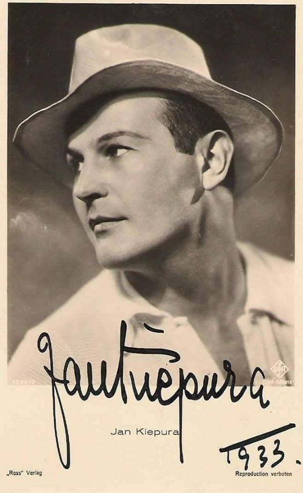
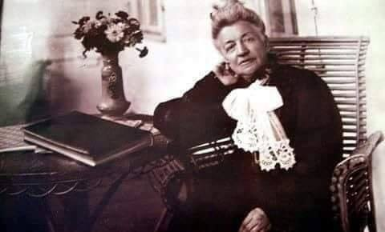
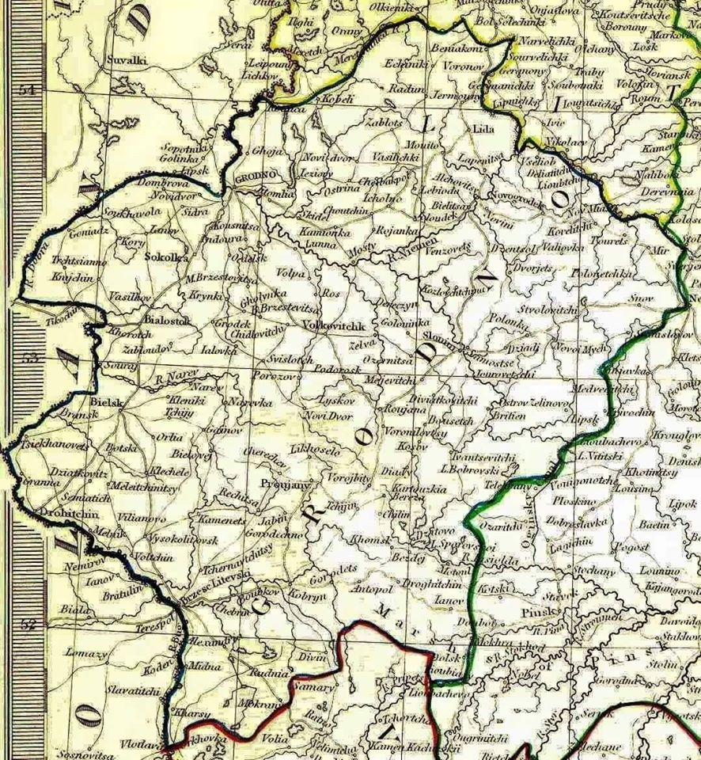
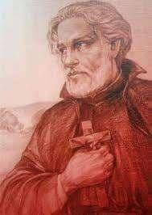

### 2021

  

### 1994

https://en.wikipedia.org/wiki/Bielefeld_Conspiracy

### 1968

Karol Kot - był pierwszym powojennym mordercą, który wzbudził masowy lęk. Nazywano go Wampirem z Krakowa. Jednak on nie wyglądał na wampira, lecz na zwykłego, przeciętnego chłopca. Atakował kobiety, zanim jeszcze skończył 18 lat.
Kot na przestrzeni tych lat zabił dwie osoby, a dziesięć usiłował zamordować. Poza tym był odpowiedzialny za cztery podpalenia. Takie usłyszał zarzuty. Policja trafiła na jego trop dzięki koleżance, której Kot się zwierzał. Na początku czerwca został aresztowany, niewiele wcześniej zdał maturę.
Gdy uklękła, podszedłem do niej, wyjąłem bagnet i ciosem od dołu dźgnąłem ją silnie w plecy, mierząc na wysokości serca, tak aby cios był śmiertelny - zeznawał po czasie. Kobieta poczuła uderzenie i ukłucie w plecy. Upadając, zdążyła zauważyć wybiegającego młodego chłopaka. Karol Kot wówczas nie miał skończonych 18 lat. Niedoszła ofiara Helena Węgrzyn wyszła z kościoła o własnych siłach. Lekarz stwierdził niewielką ranę ciętą. Próba zabójstwa się nie powiodła, ale dla zwyrodnialca z Krakowa to był dopiero początek. Karol Kot został stracony przez powieszenie 16 maja 1968 roku. Rzekoma sekcja zwłok miała wykazać rozległego guza mózgu.

### 1960

The first laser light was sparked by young US engineer Theodore Maiman, paving the way into the new shining age of a laser in machine tools.

### 1940

W Krakowie odbyła się konferencja w "sprawie nadzwyczajnych posunięć koniecznych dla zabezpieczenia spokoju i porządku w Generalnym Gubernatorstwie".
Udział w tym wydarzeniu wzięli
generalny gubernator Hans Frank oraz SS- Brigadeführer Bruno Streckenbach, dowódca SD i policji bezpieczeństwa w Generalnym Gubernatorstwie. Jeszcze tego samego dnia wydane zostało zarządzenie, w którym Frank
zlecił Streckenbachowi przeprowadzenie
„nadzwyczajnej akcji pacyfikacyjnej” (Außerordentliche
Befriedungsaktion – AB). Jej celem było
zastraszenie polskiego społeczeństwa oraz pozbawienie ruchu oporu bazy społecznej, którą zdaniem Niemców była w pierwszym rzędzie polska inteligencja.
Do realizacji tego celu przystąpiono w czerwcu 1940 roku.
Największa i najgłośniejsza ze wszystkich egzekucji tam przeprowadzonych miała
miejsce w dniach 20-21 czerwca 1940 r.
Trzema transportami wywieziono wówczas na śmierć 358 więźniów warszawskiego Pawiaka – w tym wielu przedstawicieli polskiej elity
politycznej, intelektualnej i kulturalnej. Wśród rozstrzelanych znaleźli się m.in.: politycy - Maciej Rataj, Mieczysław Niedziałkowski, prawnicy - Władysław Dziewałtowski-Gintowt i Tadeusz Fabiani oraz sławny sportowiec
Janusz Kusociński.
Akcja AB była jedną z najkrwawszych akcji przeprowadzonych przez Niemców w okupowanej Polsce. W wyniku masowych mordów zginęło około 3,5 tys. polskich intelektualistów oraz działaczy społecznych i
politycznych.
Na zdjęciu Bruno Streckenbach w środku,po lewej Heinrich Himmler.

  

---

### 1902

1902 roku w Sosnowcu przy ulicy Majowej 6 urodził się Jan Wiktor Kiepura - polski śpiewak operowy, międzynarodowy talent.

Przez lata rodzina Kiepurów żyła na skraju nędzy, oszczędzając każdą kopiejkę. Dzieciństwo upłynęło Janowi na nauce w Szkole Handlowej i pracy w rodzinnej piekarni. Mały Jan od najmłodszych lat nie miał kłopotów z wykazaniem, iż śpiew jest dla niego czymś bardzo łatwym i chętnie prezentował swoje umiejętności, nawet w czasie pracy w piekarni. Jak pisał Jerzy Waldorff - "[w] owej czeredzie uczniowskiej, grasującej po całym pograniczu trzech cesarzy Janek Kiepura znany był pod szydliwie a proroczo nadanym mu mianem Carusa. Rozwydrzona (jak mawiali starsi) uczniakeria traktowała Janka pasję śpiewu jako coś w owych czasach tak osobliwie zaskakującego, że aż zasługującego na wytknięcie". Kiepura brał za młodu aktywny udział w walkach o wolność Śląska jako członek Polskiej Organizacji Wojskowej oraz uczestnik I powstania śląskiego. W 1921 r. otrzymał świadectwo maturalne w Gimnazjum Państwowym im. Stanisława Staszica w Sosnowcu. Następnie, zgodnie z wolą rodziców, rozpoczął studia na Uniwersytecie Warszawskim na wydziale Prawa. Równolegle zaczął pobierać lekcje śpiewu u Władysława Brzezińskiego, a także Tadeusza Leliwy. Pierwszy jego publiczny koncert odbył się w 1923 roku w sali kina „Sfinks" w Sosnowcu. W 1924 r. Emil Młynarski zaangażował go do opery w Warszawie, gdzie miał miejsce pierwszy głośny incydent z jego udziałem. Oto na przedstawieniu Halki, gdzie kreował epizodyczną postać górala, po krótkiej wstawce solowej, przyjaciele i koledzy Kiepury z Wydziału Prawa zorganizowali mu prawdziwą owację. Za ten wybryk śpiewak został zwolniony z pracy. Nie na długo jednak. W 1925 roku udaje się do Lwowa, gdzie 15 stycznia debiutuje, w tym razem już głównej partii, w operze Faust Ch.Gounoda. Powtarza swój debiut także na deskach Opery w Poznaniu. W tym samym jeszcze roku powraca do Warszawy, aby zaśpiewać partię Fausta w teatrze, z którego przed paroma miesiącami został wyrzucony zastępując niedysponowanego tego dnia Adama Dobosza. W Warszawie nie zabawia jednak na długo. Przyczynia się do tego w dużym stopniu krytyka, która nie ocenia talentu Kiepury zbyt wysoko.

Zarzucano mu wiele niedostatków technicznych, błędy intonacyjne i wadliwą wymowę. Po występie Kiepury Jan Kiepuraw roli Księcia Mantui w Rigoletcie G.Verdiego, Stanisław Niewiadomski stwierdził, że „[...] młody tenor jest jeszcze we wszystkim po prostu surowy, technicznie nie gotów, w smaku nie wyrobiony". Takie przyjęcie tak mocno uraziło ambicję młodego sosnowiczanina, że postanawia on opuścić kraj i szukać poza jego granicami zrozumienia dla swego talentu. Nie pierwszy to zresztą, i nie ostatni przypadek w dziejach polskiej wokalistyki, kiedy młodzi adepci sztuki wokalnej zmuszeni są szukać uznania poza granicami naszego kraju, zyskując gorące przyjęcie przez rodzimą krytykę dopiero po sukcesach odniesionych w innych krajach.

Tak więc Kiepura w 1926 roku wyjechał do Wiednia, gdzie występy zaczął od Theater an der Wien. Tam wystawiano właśnie Zemstę Nietoperza Johanna Straussa, gdzie w scenie balu u księcia Orłowskiego jest w zwyczaju wstawiać niewielkie koncerty okolicznościowe. Kiepura zaśpiewał wtedy, jako taką właśnie wstawkę, arię Księcia z opery Rigoletto G.Verdiego -"La donna e mobile". Wtedy usłyszał go Franz Schalk, dyrektor Opery Wiedeńskiej i zaproponował młodemu śpiewakowi występy na tej znanej scenie. Kiepura debiutował we wrześniu 1926 r. jako Cavaradossi w "Tosce" Pucciniego u boku samej Marii Jeritzy. Po kolejnych występach dostał stałe angagment, oferujące także, jak pisał Kiepura, „[...]mieszkanie w pałacu cesarzy Austrii, gdzie mieszkają najznakomitsi artyści tutejsi".

Wielkim wydarzeniem, które utorowało Kiepurze drogę do największych scen świata była premiera Turandot G.Pucciniego. Partia Kalafa z opery Turandot była jedną z największych - obok Księcia w Rigoletcie - kreacji artystycznych Jana Kiepury. Po raz pierwszy zaśpiewał ją w Wiedniu w roku światowej prapremiery tego dzieła, zaś dwa lata później - w 1928 roku tą partią debiutuje w mediolańskiej La Scali, odnosząc tam ogromny sukces. I chociaż w samej La Scali wystąpił zaledwie kilkanaście razy, to występ ten stał się początkiem wielkiej kariery operowej artysty, który począł święcić tryumfy także w innych słynnych teatrach operowych, takich jak Opera w Paryżu, Covent Garden w Londynie, Teatro Colón w Buenos Aires. Występował na scenach Berlina, Monachium, Paryża, Buenos Aires, Brukseli, Budapesztu, Pragi, Brna, Hawany, Rio de Janeiro, Sao Paulo. Występował także i w Polsce, do której tęsknił i wciąż wracał.

Kolejnym przełomem w jego karierze był rok 1930. Wtedy to po raz pierwszy Kiepura pojawił się na planie filmowym - był to film Neapol, śpiewające miasto, zrealizowany w trzech wersjach językowych - niemieckiej, francuskiej i angielskiej. Potem posypały się kolejne propozycje. Tak oto będąc u progu kariery operowej Kiepura postanawia swoje życie związać z rozkwitającym w owym okresie przemysłem filmowym. Nie znaczy to, że zupełnie zaprzestaje występów scenicznych. Kontakt z publicznością „na żywo" był mu niezwykle potrzebny. O potrzebie tego kontaktu najdobitniej świadczą jego słynne występy na balkonach, dachach samochodów, czy po prostu na placach. Jerzy Waldorff tak opisuje tę cechę Kiepury: "Niech żyje!", "Sto lat!", "Wiwat!", "Jasiu śpiewaj!". Na to czekał. Krótkim ruchem uciszał tłum tak nagle, jakby gałką wyłączał dźwięk z głośnika radiowego, i plac przed dworcem - chociaż o przenośnych mikrofonach nikomu się jeszcze wtedy nie śniło! - wypełniał jego niewiarygodnie potężny, metaliczny, jasny głos: "Brunetki, blondynki, ja wszystkie was, dziewczynki, całować chcę..." - Potem się tak samo powtarzało przed Bristolem, na dachu taksówki, z hotelowego balkonu. Bez końca.". W latach trzydziestych powstają kolejne filmy z udziałem Jana Kiepury. Są wśród nich te, które na zawsze weszły do repertuaru światowego kina muzycznego: Pieśń nocy (1932), Zdobyć cię muszę (1933), Dla ciebie śpiewam (1934), Kocham wszystkie kobiety (1935), Pieśń miłości (1936), W blasku słońca (1936), Czar cyganerii (1937). Większość jego filmów, wzorem Śpiewającego miasta, powstała w dwóch, lub nawet trzech wersjach językowych. Wartym podkreślenia jest fakt, że niemal w każdym filmie jedną piosenkę wykonywał w języku polskim. Na planie filmu Dla ciebie śpiewam poznał Kiepura Marthę Eggerth, śpiewaczkę pochodzenia węgierskiego, która dwa lata później zostaje jego żoną. Ich związek, wspólne życie i praca, to zresztą całkiem osobny temat. Ukoronowaniem kariery scenicznej Jana Kiepury staje się debiut na deskach nowojorskiej Metropolitan Opera 10 lutego 1938 roku w partii Rudolfa w Cyganerii G.Pucciniego. Przez następne trzy sezony jest związany z tą sceną, śpiewając m.in. partie Don Josego w Carmen G.Bizeta, Cavarodossiego w Tosce G.Pucciniego, kawalera de Grieux w Manon Lescaut, czy wreszcie księcia Mantui w Rigoletcie G.Verdiego. Ta ostatnia rola została w 1939 roku upamiętniona poprzez nagranie z transmisji radiowej stacji NBC przeprowadzonej 11 marca 1939 roku. JJan Kiepuraest to zresztą jedyny zapis sceniczny śpiewu Jana Kiepury. Słuchając tego właśnie nagrania (zostało ono wydane przez kilka firm m.in. przez Myto Records - 2 MCD 921.56) łatwo można zrozumieć, na czym polegał fenomen tego głosu. Nie tylko na tym, jak pisał cytowany już wcześniej J.Waldorff „[...]że drugiego głosu tenorowego takiej siły, pełni i blasku jak gdyby nasyconej słońcem złota w dziejach dzisiejszej wokalistyki nie było", ale przede wszystkim na nieprawdopodobnej wręcz radości śpiewania, którą czuje się w każdej nucie. Kariera sceniczna jednak zdawała się już Kiepury nie pociągać. Kilka lat później - w 1943 roku - odchodzi ze sceny. Powodów takiej decyzji było z pewnością wiele. Nie bez znaczenia zdawały się być kwestie finansowe. Kiepura często powtarzał, że „opera - to zajęcie dla żebraków", a powszechne jest mniemanie, że lubił pieniądze. Niektórzy nawet wytykają to jako wielką wadę. Ci, co go znali, twierdzą jednak, że wynikało to raczej z panicznego lęku przed biedą, jakiej zaznał, nim stał się sławny. Jak słusznie zauważa Jacek Marczyński (Rzeczpospolita 13 maja 2002) dodać do tego trzeba świadomość niepewności operowej kariery, pogłębionej chronicznym nieżytem jamy nosowej i krtani oraz tym, że jako człowiek bez wcześniejszego wykształcenia muzycznego, nowych ról musiał uczyć się nie z nut, lecz ze słuchu. Nie da się ukryć, że repertuar operowy Kiepury był stosunkowo skromny, jak na tenora o takich możliwościach głosowych. Od połowy lat trzydziestych właściwie nie dodawał już do niego żadnych nowych ról, powielając jedynie wcześniejsze kreacje. Film dawał Kiepurze ponadto jeszcze jedno: światową sławę i rozgłos, jakiego nie zapewniał żaden teatr operowy. Pomimo odejścia ze sceny nie rozstaje się Kiepura ze śpiewaniem. Powstają kolejne jego filmy, m.in. Jede Frau hat ein süsses Geheimnis (1939), Addio Mimí! (1947), Valse brillante (1948), Absender unbekannt (1950), Das Land des Lächelns (Kraina uśmiechu) (1952). W 1944 r. razem z żoną inwestują w spółkę, która wystawiła na Broadwayu Wesołą wdówkę - operetkę F.Lehara. Sukces był ogromny, inscenizacja utrzymała się na afiszu przez dwa lata i osiągnęła ponad 900 przedstawień.

Bardzo wielu przeciwników Kiepury zarówno jemu współczesnych, jak i dzisiejszych zarzucało śpiewakowi, że porzucił kraj, by robić karierę za granicą i przesadnie dbał o swoją popularność. Zapominają oni jednak, że rozsławiając swój talent na świecie, Kiepura sławił także nasz kraj, gdyż na każdym kroku podkreślał, że jest Polakiem - "chłopakiem z Sosnowca". Demonstrował swą polskość w wielu drobiazgach. Przy lada okazji podkreślał że nosi polskie buty, zapraszał na polski obiad, także ślub z Martą Eggerth wziął w Polsce. Adam Czopek w swoim artykule w Naszym Dzienniku z dnia 11 maja 2002 polskości Kiepury poświęca bardzo dużo miejsca pisząc m.in., „[...]że Jan Kiepura zawsze podkreślał swój polski rodowód i chętnie w kraju koncertował. Nawet zarobione w świecie pieniądze starał się - w części - lokować w rodzinnych stronach. Już w 1927 r. zapowiedział budowę luksusowego pensjonatu "Patria" w Krynicy.

Otwarto go w grudniu 1933 r., a zarządzał nim jego ojciec. Starał się też odpowiadać na każde zaproszenie na występy w kraju. [...] Koncertował na rzecz powodzian i budowy gmachu Muzeum Narodowego w Krakowie. Na dziedzińcu wawelskim śpiewał dla blisko 20 tys. słuchaczy, w Poznaniu słuchał go jeszcze większy tłum.[...] Kiedy sytuacja polityczna jasno wskazywała, że wybuch wojny jest już nieunikniony, Jan Kiepura w czerwcu 1939 r. koncertował na warszawskim rynku Starego Miasta na rzecz Funduszu Obrony Narodowej. Wybuch wojny zastał go w Paryżu. [...] W 1942 r. przekazał 100 tys. dolarów na Fundusz Pomocy Polsce, w 1946 r. sumą tysiąca dolarów wspomógł nowo powstały Fundusz Chopina." Po wojnie Kiepura kilkakrotnie odwiedził ojczyznę. W czasie swojego pobytu w 1958 roku odwiedził swoją dawną szkołę w Sosnowcu pozostawiając w tamtejszej kronice wiele mówiący wpis „Trzymajcie wysoko sztandar muzyki polskiej".

Po raz ostatni wystąpił na publicznym koncercie dla polonii amerykańskiej 13 sierpnia 1966 roku w Portchester. Dwa dni później, 15 sierpnia 1966 roku w swojej posiadłości w Harrison w stanie Nowy Jork zmarł nagle na atak serca. Pogrzeb odbył się w Warszawie. Zgodnie z ostatnią wolą artysty pochowano go na Powązkach. Kiepura był nie tylko wielkim śpiewakiem, czy fenomenem głosowym, ale także ogromną osobowością. Jako jeden z pierwszych artystów na świecie doceniał potęgę mediów i był niesłychanie wrażliwy na punkcie swojego wizerunku przez nie kreowanego. Przywiązywał ogromne znaczenie do tego, co pisze o nim prasa. Wiedział, że publiczność natychmiast rozpoznaje, czy przyjeżdża się tylko zrealizować kontrakt, czy po to, by się z nią spotkać. Nie znosił papierosów i palaczy w swoim otoczeniu. Nawet w umowach wymagał aby było zaznaczone, że nie wolno palić na planie filmu. Pod tym względem był absolutnym prekursorem walki z paleniem. Był też znanym miłośnikiem krawatów i kapeluszy, które zaczął nosić, aby ukryć oznaki łysienia.

  

### 1881

Eliza Orzeszkowa pisze o pogromach Żydów w Rosji w liście do Leopolda Mėyeta z 16 maja 1881 r. ,,Straszne rzeczy dzieją się na świecie. Jestem pełna przerażenia i oburzenia. Jeżeli burza rozszalała się na południu, dojdzie do nas, będzie to nie tylko akt barbarzyństwa przeciwny całej cywilizacji i wszystkim tradycjom naszym, ale fakt historyczny ogromnej, a fatalnej dla kraju naszego wagi. Ludność izraelską uważałam zawsze za żywioł społeczny, niezmierne znaczenie mający nie tylko dla teraźniejszości, ale także i bardziej jeszcze dla przyszłości naszej. Jest to materialna i umysłowa potęga, mogąca w mierze nieobrachowanej przyczynić się do zmartwychpowstania i ostatecznego upadku naszej wspólnej sprawy. Potęgę tę zjednać sobie [...] jest jedyną zdrową polityką. Uczynić względem niej to, co uczynili inni, byłoby nie tylko nieludzkością, ale szalonym bezrozumem. Takim jest uczucie i przekonanie moje, podzielane przez wszystkich, z którymi żyję. Dlatego w wypadku zaburzeń, które i tu u nas są mocno prawdopodobne, postanowiliśmy bronić i osłaniać krzywdzonych wedle wszelkiej naszej siły i możliwości. Głupie i ciemne masy popełnić mogą zbrodnie i szalone głupstwo, ale niech przynajmniej garść inteligencji polskiej zaprotestuje przed ludzkością i historią, nie tylko słowami i czynami, ale choćby życiem swoim. Ja przynajmniej i parę jeszcze osób zdecydowani jesteśmy zginąć choćby, a stać pomiędzy rozhukaną falą a drzwiami napastowanych.''

  

### 1863

Rozpoczęły się w Guberni Grodzieńskiej ośmiodniowe walki powstańców styczniowych pod dowództwem Romualda Traugutta z wojskami rosyjskimi.
Pierwszego dnia walk Polacy urządzili
zasadzkę na grobli. Rosjanie, w sile 1 roty piechoty i 40 kozaków, zostali okrążeni i wzięci w krzyżowy ogień, ponosząc ciężkie straty. Kolejne starcie, które nastąpiło 4 dni później, zakończyło się również sukcesem Polaków. Dopiero 25 maja połączone siły gen. Artura Eggera i płk. Ehrnberga okrążyły i
rozbiły partię powstańczą. Po trzygodzinnej walce Polacy stracili 13 ludzi oraz obóz z 20 wozami i 50 końmi.

  

### 1657

W Janowie Poleskim Kozacy zamęczyli Andrzeja Bobolę – pochodzącego ze szlacheckiej rodziny jezuitę, kaznodzieję. Kozacy traktowali go jako wroga z powodu nawracania ruskiej ludności prawosławnej na katolicyzm. Zdarli z niego szaty, przywiązali do słupa i bili nahajami, zmuszając go do wyparcia się wiary. Następnie z gałązek wierzbowych upletli wieniec na wzór korony cierniowej Chrystusa i zaciskali mu ją na głowie. Kapłana zawleczono do rzeźni miejskiej, rozłożono na stole i poddano dwugodzinnym torturom. Powieszony twarzą do dołu otrzymał śmiertelne uderzenie szablą w głowę.
W 1853 roku miała miejsce beatyfikacja Andrzeja Boboli.
Ostatecznie Andrzej Bobola został kanonizowany przez papieża Piusa XI w dniu 17 kwietnia 1938 roku. Andrzej Bobola jest uważany za patrona Polski.

  

---

<a href="https://github.com/TomaszWaszczyk/historia.waszczyk.com/edit/master/src/content/may-16.md" target="_blank">Edytuj tę stronę dzieląc się własnymi notatkami!</a>
