### 2023

> Russia has "already lost geopolitically" its war in Ukraine war and is effectively becoming a vassal state of China, French President Emmanuel Macron

### 2022

Marek Suski spotkał się z ambasadorem ChRL w Polsce. W Radiu Zet mówił, że 🇨🇳 miałyby udzielić pomocy „🇵🇱 dla 🇺🇦 i również dla 🇺🇦”. „🇵🇱 może dostać prędzej pomoc humanitarną od Chin, które są tak nielubiane przez Brukselę".

<!-- Cezary Gmyz: Mamy w Polsce partię rosyjską. Padły nazwiska polityków
16.05.2022 18:02
– To kolejne potwierdzenie faktu, że rząd Donalda Tuska kooperował z Rosjanami – zauważa w rozmowie z portalem DoRzeczy.pl korespondent TVP Cezary Gmyz w kontekście ujawnienia dokumentów dot. planów prywatyzacji spółki Lotos.

Prowadzący wywiad wskazał, że prywatyzacja spółki Lotos, jaką planowali politycy Platformy podczas jej rządów, mogła doprowadzić do przejęcia kapitału firmy przez Rosjan, o których Tusk miał mówić, że nie należy ich wykluczać z grona potencjalnych nabywców Lotosu. 

    – To kolejne potwierdzenie faktu, że rząd Donalda Tuska kooperował z Rosjanami i że nowe dokumenty ukazujące się w ostatnich dniach – i nie tylko te dotyczące polskich rafinerii, ale również polityki, jaka miała być prowadzona za rządów Donalda Tuska – wskazują jasno, że Platforma Obywatelska, którą wówczas kierował Donald Tusk, była najbardziej przyjazną Rosji partią na polskiej scenie politycznej

– zwraca uwagę Cezary Gmyz.
Gmyz: Mamy do czynienia z partią rosyjską w Polsce

    – Obaj panowie rządzili w koalicji, a wiele na to wskazuje, że mieliśmy bądź mamy nadal  do czynienia z partią rosyjską w Polsce

– podkreśla korespondent TVP, mając na myśli Donalda Tuska i Waldemara Pawlaka.

Cezary Gmyz wskazał, że wspólnikiem PO na tym polu było również PSL z Waldemarem Pawlakiem, który odpowiada za podpisanie niekorzystnych dla Polski umów dot. zakupu gazu od Rosji.

CZYTAJ TEŻ: Ukraina w NATO? Rzecznik Kremla grozi: To mogłoby doprowadzić do sporu terytorialnego

CZYTAJ TEŻ: Kolejny duży pożar w Rosji. Płonie moskiewski wieżowiec [WIDEO]

Gmyz mówił również, że Tusk nie był politykiem samodzielnym, a jego polityka w istocie wspierała kanclerz Angelę Merkel. W tym kontekście podkreślił, że Tusk nie był przeciwnikiem budowy gazociągu Nord Stream 2.

    – Dziś to wszystko składa nam się w jedną spójną całość, choć cały czas starano nas się przekonać, że Nord Stream 2 nie jest projektem politycznym, że będzie to wsparcie prywatnego sektora biznesu. (…) Pierwszą osobą, która określiła Nord Stream 1 i 2 wcieleniem w życie paktu Ribbentrop–Mołotow, był Radosław Sikorski -->

### 2021

> „Dobrze by było, gdyby odpowiednie instytucje przejrzały umowy hipotek złotowych i sprawdziły, czy niosą zagrożenia” – powiedział Zbigniew Jagiełło, odchodzący właśnie prezes PKO BP. Bo ostatnio Polacy zaciągają te kredyty jak szaleni, a jak wzrosną stopy procentowe i będą mieli kłopot z ich spłatą, zaczną szukać haczyków prawnych i zrobi się cyrk jak frankowiczami."

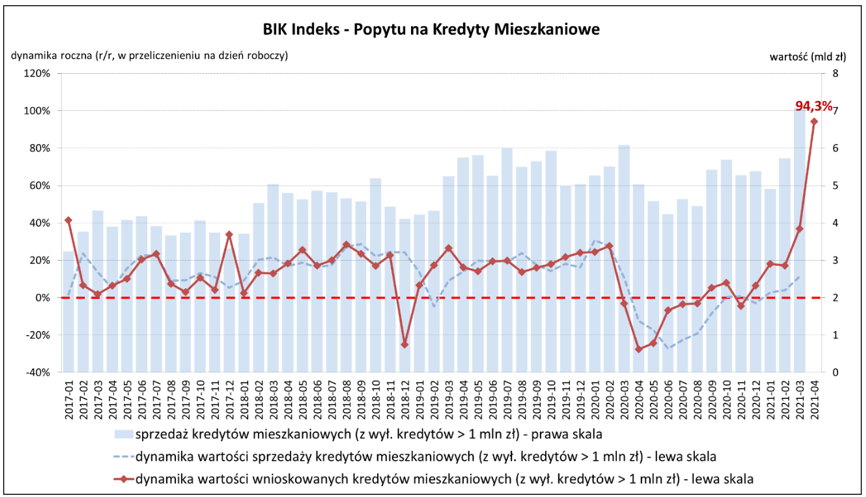  

### 2020

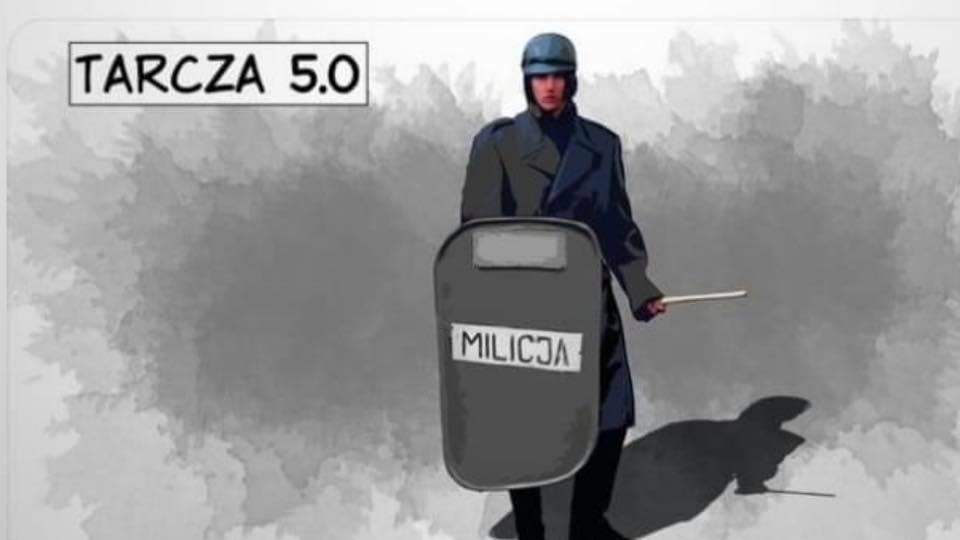  

---

Któraś z amerykańskich gazet zauważyła już miesiąc temu, że coś się dzieje nie tak z ekonomią: rynki finansowe idą w górę, ale sfera reala - w dół. To dziwne. Rośnie bezrobocie, ale giełda w górę.

---

17 maja Siesta – po dziesięciu tygodniach odsunięcia od anteny – zabrzmiała w Trójce po raz ostatni. Wróciłem, żeby się pożegnać.
Radio, które miałem zaszczyt i szczęście współtworzyć przez całe pokolenie, od dnia przełomu roku 1989, w ostatnich latach zmieniło swoją twarz. Dziś już jej nie poznaję. I nie jest to znajomość, którą chciałbym kontynuować.
W Trójce zostaje wciąż kilka bliskich mi osób. Prosiłbym, by ich nie osądzać, bo każdy z nas jest w innej życiowej sytuacji. Dla mnie decyzja o odejściu – choć w świetle wydarzeń ostatnich miesięcy oczywista – jest trudna. Dla nich może być niemożliwa.
Gandhi pocieszyłby nas: „patrząc na historię świata widzimy, iż tyrani, jakkolwiek okrutni i bezmyślni, zawsze w końcu upadają. Zawsze”.
Dodam od siebie, że warto im w upadku pomóc. Zaczynając od niezgody na ich szaleństwo.
I nie zaszkodzi pamiętać: w Portugalii Rewolucja Goździków, która obaliła dyktatora, też zaczęła się od włączonej w radiu piosenki Paola de Carvalho.

---

[Pedagogika wstydu](https://pl.wikipedia.org/wiki/Pedagogika_wstydu)

---

Wieloletni dziennikarz Trójki Polskiego Radia - Marek Niedźwiecki odchodzi z publicznej rozgłośni. Decyzja jest protestem w związku z aferą dotyczącą piosenki Kazika Staszewskiego "Twój ból jest lepszy niż mój'.

O decyzji Niedźwieckiego poinformował w mediach społecznościowych kompozytor Zbigniew Preisner.

- Wczoraj w Programie Trzecim Polskiego Radia wydarzyła się historia, która nawet w najgorszych czasach PRL byłaby nie do pomyślenia. Kazik ze swoją piosenką „Twój ból jest lepszy niż mój“ wygrał notowanie Listy przebojów Marka Niedźwieckiego. Kilka godzin później tak zwany redaktor naczelny Trójki Tomasz Kowalczewski ogłosił, że redakcja unieważniła głosowanie, informując, że „wprowadzono piosenkę spoza listy, nadto dokonano manipulacji przy liczeniu głosów oddawanych na poszczególne piosenki, co zafałszowało wynik końcowy“.
Miarka się przebrała!

Marek Niedźwiecki jest kolejną osobą, która dzisiaj odeszła z Trójki. Nasza Trójka już nie istnieje.
Nie możemy się dać zniewolić tej bolszewickiej polityce, musimy bronić naszej wolności, inaczej zostanie nam „zniewolony umysł”" - oświadczył Preisner na swoim Facebookowym profilu.

***

Oświadczenia wydali dzisiaj także muzycy; "Organek" oraz Dawid Podsiadło.

Organek: "Z ogromnym żalem i smutkiem informujemy, iż zespół ØRGANEK zawiesza współpracę z Trójka - Program 3 Polskiego Radia na czas nieokreślony. Trójka była naszym domem od samego początku istnienia zespołu, dzięki niej mogliśmy przeżyć wiele wzruszeń i radości. Niegdyś gwarant jakości i wolności artystycznej, dziś, na naszych oczach staje się symbolem dewastacyjnej polityki obecnych władz Polskiego Radia.

Bezpośrednim powodem naszej decyzji jest usunięcie piosenki "Twój ból jest lepszy niż mój" Kazika z ostatniego notowania LP3. Zwalnianie niezależnie myślących dziennikarzy, polityczna ingerencja w ramówkę, atmosfera nagonki i zastraszenia oraz cenzura, to standardy mediów reżimowych z krajów niedemokratycznych.

Nigdy się na to nie zgodzimy. Czekamy aż wróci NASZA Trójka. NO PASARAN".

Dawid Posiadło: "Trudno bez emocji patrzeć na kolejny przykład demolowania kultury. Trójka miała zawsze specjalne miejsce w moim sercu, a o istnieniu kultowej listy słyszałem od urodzenia. Muzyczna redakcja Trojki od początku bardzo wspierała mnie i moją twórczość, za co zawsze będę wdzięczny.

Ale jeżeli na dzisiejszej antenie PR3, polityka jest ważniejsza niż muzyka, jeżeli piosenka powoduje powrót najgorszych komunistycznych praktyk, które znam tylko z książek i opowieści, to myślę, że moje utwory też nie powinny być grane na tej antenie, dopóki twórcza wolność słowa nie wróci na fale Trójki".

### 1989

Sejm PRL przyjął pakiet ustaw o gwarancjach wolności sumienia i wyznania oraz o stosunku państwa do Kościoła katolickiego.
Były one pokłosiem porozumień zawartych pomiędzy ugodową stroną opozycji solidarnościowej, a komunistami, najpierw w Magdalence, a następnie przy Okrągłym Stole.
W punkcie 2. art 19 zapisano:
"Obowiązkowe zajęcia szkolne i nauczanie religii nie mogą z sobą kolidować. Uwzględniając zarówno potrzeby zajęć szkolnych jak i nauczania religii Minister Edukacji Narodowej w porozumieniu z Sekretariatem Episkopatu Polski wyda rozporządzenie określające zasady i sposób godzenia rozkładu nauczania religii z rozkładem zajęć szkolnych".

  

### 1981

Ulicami Krakowa przeszedł tak zwany "Biały Marsz"zorganizowany po zamachu na życie Jana Pawła drugiego.
Ponad pół miliona ludzi przeszło z Błoń do Rynku Głównego, gdzie pod kościołem Mariackim kardynał Franciszek Macharski odprawił mszę w intencji Karola Wojtyły.

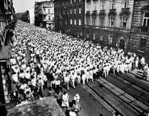  

### 1972

W Bonn Bundestag zatwierdził ustalenia podpisanego w Warszawie 7 grudnia 1970 roku przez premiera Józefa Cyrankiewicza i kanclerza Willy Brandta układu między Polską Rzeczpospolitą Ludową, a Republiką Federalną Niemiec o podstawach normalizacji ich wzajemnych stosunków” . 
Postanowienia tego układu, w którym zapisano, iż obie strony uzają granicę na Odrze i Nysie Łużyckiej nigdy nie zostały oficjalnie zapisane w konstytucji RFN, a co za tym idzie, oznaczało to brak oficjalnego uznania przez Zachodnie Niemcy oddania Polsce swoich wschodnich terenów.

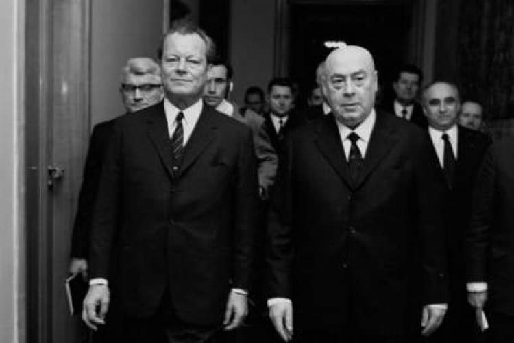  

RFN GmbH

### 1944

Wywizje 2 Korpusu Polskiego pod dowództwem generała Władysława Andersa przystąpiły do rozpoczęcia głównego szturmu na opanowane przez Niemców wzgórze Monte Cassino i znajdujący się na nim klasztor.
Do walki zmobilizowano absolutnie wszystkich, łącznie z kucharzami i mechankami.
Rozpoczęła się ostatnia faza bitwy, która na stałe okryła chwałą żołnierzy polskich walczących na froncie włoskim.

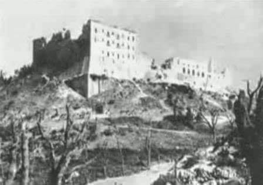  

### 1943

Dramatyczny zapisek jednej z kobiet uwięzionych w obozie w Majdanku.
17 maja 1943 r. w szpitalu obozowym
pola kobiecego zmarła Janina Modrzewska, absolwentka Szkoły Sztuk Pięknych w Warszawie, ur. w 1903 r. Aresztowano ją jesienią 1942 r. w Warszawie, przewieziono na
Pawiak, a stąd na Majdanek. Po pewnym
czasie trafiła do szpitala obozowego. Dzięki opiece personelu (m.in. dr Perzanowskiej) wracała do zdrowia. Na początku maja zdarzył się tragiczny wypadek. Podczas alarmu lotniczego jedna z kobiet opuściła barak. Wartownik z wieży strzelił w jej
kierunku, ale nie trafił. Strzelił w barak
szpitalny i trafił w brzuch Janinę Modrzewską, która leżała na 3 piętrze pryczy. Władze obozowe nie zezwoliły na przeniesienie jej na chirurgię rewiru męskiego w celu przeprowadzenia operacji. Po przeszło tygodniu Janina Modrzewska zmarła. Przed śmiercią napisała jeszcze kilka słów do swoich
najbliższych. "Muncia, Myszko umieram 5.V.34 Ranna przypadkiem w brzuch, strzał. Całuję Was i kocham. Janka"

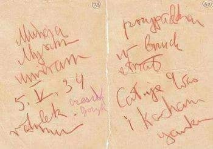  

Zródło: Państwowe Muzeum na Majdanku

---

W czasie powstania w getcie Niemcy zburzyli Wielką Synagogę w Warszawie.
Obiekt ten wybudowano w 1878 roku.
Była miejscem nie tylko nabożeństw ściśle religijnych. Odprawiano tam również nabożeństwa z okazji świąt państwowych takich jak rocznice 3 maja czy rozpoczęcie roku szkolnego. Tam też w 1935 roku odbyło się nabożeństwo żałobne po śmierci Józefa Piłsudskiego.
Wysadzenia dokonał osobiście SS - gruppenfuhrer Jurgen Stroop.
Akt ten mający ogromne dla ludności żydowskiej znaczenie psychologiczne był oficjalnym końcem powstania w gettcie.
Do dziś nie odnaleziono żadnych planów architektonicznych tej budowli.

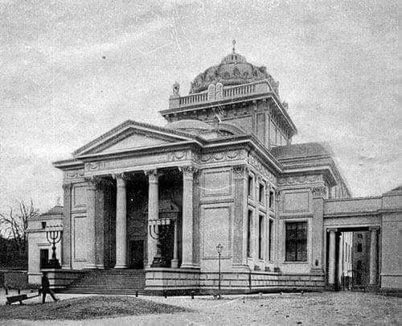  

---

### 1939

Sąd polski skazazał na 15 lat więzienia i 200 tysięcy złotych grzywny asa wywiadu majora Jerzego Sosnowskiego (zdjęcie) w latach 1926-1934 kierownika placówki wywiadowczej w Berlinie o kryptonimie IN-3.
Sosnowskiemu zarzucono, że we wspomnianym okresie współpracował z kontrwywiadem niemieckim, co miało zagrażać interesom Państwa Polskiego, oraz że celowo wprowadzał w błąd wywiad polski, podając fałszywe informacje preparowane przez Niemców.
W rzeczywistości, zorganizowana przez niego berlińska placówka, najwyższe dowództwo niemieckie , dostarczyła dowodów na nierespektowanie przez Republikę Weimarską postanowień traktatu wersalskiego , która we współpracy z ZSRR od lat 20. XX w. prowadziła wysokobudżetowy program intensywnego rozwoju ofensywnych broni: lotniczych, pancernych i chemicznych, niedozwolonych szkoleń kadry oficerskiej i wspólnych manewrów wojskowych.
Nie są jasne dalsze losy majora Sosnowskiego. Prawdopodobnie spędził on w więzieniu tylko 3 miesiące. Jedna z wersji mówi, że został on zastrzelony na polecenie Służb Więziennych 17 września 1939 roku przez konwojentów podczas ewakuacji więzienia. Chodziło mianowicie o to, że w razie wybuchu wojny należało zlikwidować wszystkich więźniów, których istnienie mogłoby zagrażać państwu polskiemu.

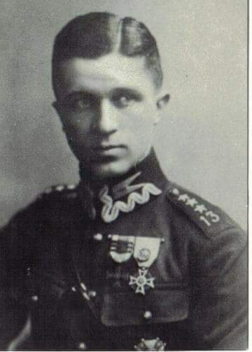  

---

### 1918

W Paryżu zmarł Bronisław Piłsudski - brat Józefa Piłsudskiego, lingwista, etnograf, zajmujący się ludami i kulturami Dalekiego Wschodu, głównie ludem Ajnów, który obserwował na Sachalinie a później na wyspie Hokkaido. Do dziś Piłsudski uważany jest na świecie za jednego z najważniejszych badaczy tamtych terenów.

Po śmierci matki (1884) w 1886 wyjechał do Sankt Petersburga, gdzie zdał egzamin na bakałarza i wstąpił na Wydział Prawa miejscowego uniwersytetu. W 1887 został wciągnięty w przygotowania Woli Ludu do zamachu na cara Aleksandra III. Wśród zamachowców znajdował się między innymi Aleksander Uljanow, starszy brat Włodzimierza znanego potem jako Lenin. Po wsypie, za udział w spisku został skazany na 15 lat zesłania i ciężkich prac na wyspę Sachalin. Na Sachalinie w 1891 poznał Lwa Jakowlewicza Sternberga, znanego już etnografa, który także znajdował się na zesłaniu.

W 1896 ukazała się jego praca o obserwacjach klimatycznych. Został wówczas wysłany z misją meteorologiczną na południową część wyspy, gdzie zetknął się z Ajnami. Po 10 latach zesłania reszta wyroku została zamieniona na nakaz osiedlenia się bez prawa opuszczania rosyjskiego Dalekiego Wschodu. 3 lata później otrzymał propozycję cesarskiej akademii nauk, aby udać się na badania kultury Ajnów, Gilaków (Niwchów), Oroków i Mangunów na Sachalinie. W tym samym roku osiedlił się - już jako wolny człowiek - w wiosce Ai, gdzie zakochał się w pięknej Chuhsamma, krewnej wodza Kimur Bafunke, która urodziła mu syna o imieniu Sukezo.

W 1903 wraz z innym zesłańcem, pisarzem Wacławem Sieroszewskim udał się na badania kultury Ajnów na wyspie Hokkaido (wówczas zwanej Yesso). Jednym z efektów jego pracy są unikalne nagrania dźwiękowe zarejestrowane na 100 wałkach woskowych. Obecnie można je oglądać w Centrum Kultury i Techniki "Mangha" w Krakowie. Na początku lat 80. XX w. wałki te zostały wypożyczone z Polski przez Japończyków, a firma SONY skonstruowała specjalny laserowy odpowiednik urządzenia do ich odczytu (fonografu Edisona), dzięki któremu udało się po wielu latach znów usłyszeć zapisane na nich dźwięki. Jego dorobkiem jest stworzenie słowników, w których przetłumaczył ponad 10 tys. słów z języka ainu, 6 tys. z języka gilackiego oraz 2 tys. z języka orockiego i języka Mangunów, bogate opisy ich kultury i obyczajów, w tym także kultury muzycznej, spisał wiele podań i legend tych kultur, oraz wykonał ok. 300 fotografii, na których utrwalał głównie typy mieszkających tam ludzi.

Utrwalił fonograficznie pieśni i mowę Ajnów. Do Polski przybył przez Japonię i Stany Zjednoczone w 1905 i zamieszkał w Krakowie. Później przeprowadził się do Zakopanego i prowadził badania etnograficzne Podhala. Po wybuchu I wojny światowej wyjechał do Szwajcarii włączając się w nurt działalności niepodległościowej. Pod koniec 1917 r. wyjechał do Paryża, gdzie w roku 1918 utonął w Sekwanie. Podejrzewa się, że była to śmierć samobójcza.

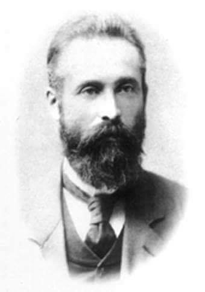  

Źródło: NBP / Mennica Polska S.A

### 1897

Został zwodowany USS „Holland”, pierwszy okręt podwodny pełniący służbę w US Navy i jednocześnie pierwszy na świecie wcielony do służby, w którym zastosowano napęd spalinowy na powierzchni i elektryczny w zanurzeniu.
Część opracowań określa USS Holland (SS-1) mianem pierwszego okrętu podwodnego US Navy. Inne zaś są zdania, że honor ten przysługuje jednostce o nazwie Alligator, zwodowanej w roku 1862, którą zaprojektował francuski inżynier Brutus de Villeroi. Alligator nie wszedł jednak oficjalnie do służby w US Navy i dlatego nie przysługuje mu prefiks USS. Drugą z kolei jednostką podwodną będącą własnością marynarki amerykańskiej był Inteligent Whale.
Okręt, nazwany później USS USS Holland , wybudowano w ramach prywatnych przedsięwzięć konstrukcyjnych w stoczni Crescent Shipyard w Elizabeth (New Jersey). Autorem projektu był znany w końcu XIX wieku inżynier i wynalazca irlandzkiego pochodzenia, John Philip Holland. W piśmiennictwie znany jako USS Holland VI, zyskał akceptację komisji rządowej i zakupiony został dla amerykańskiej marynarki wojennej za kwotę 150 000 dolarów. Oficjalnie wszedł do służby 12 października 1900 pod nazwą USS Holland . Po paru latach otrzymał oznaczenie alfa- numeryczne SS-1.
USS Holland służył w US Navy jako jednostka szkolna w Akademii Floty w Annapolis do 17 lipca 1905. Skreślony z listy floty z dniem 21 listopada 1910. Odkupiła go od US Navy za 100 dolarów firma Henry A. Hitner & Sons z Filadelfii (Pennsylvania). Ciekawostką jest fakt, że musiała ona wpłacić kaucję w wysokości 5000 dolarów, mającą gwarantować, że USS USS Holland nigdy nie będzie już pływać i nikomu przed złomowaniem nie zostanie sprzedany.
USS Holland aż do roku 1932 eksponowany był publicznie w miejskim parku w Paterston w stanie New Jersey nim wreszcie uległ złomowaniu.u rozpoczęto w listopadzie 1896, zaś ceremonia wodowania miało miejsce pół roku później, 17 maja 1897 roku.
Widoczny na dziobie otwór wylotowy dla pneumatycznej armaty pocisków dynamitowych kalibru 213 mm. Warto zwrócić uwagę także na uderzające podobieństwo tej jednostki do budowanych w czasie II wojny światowej brytyjskich miniaturowych okrętów podwodnych, zwanych X-crafts.

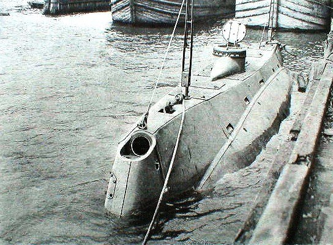  

### 1792

W Bonn Bundestag zatwierdził ustalenia podpisanego w Warszawie 7 grudnia 1970 roku przez premiera Józefa Cyrankiewicza i kanclerza Willy Brandta układu między Polską Rzeczpospolitą Ludową, a Republiką Federalną Niemiec o podstawach normalizacji ich wzajemnych stosunków” .
Postanowienia tego układu, w którym zapisano, iż obie strony uzają granicę na Odrze i Nysie Łużyckiej nigdy nie zostały oficjalnie zapisane w konstytucji RFN, a co za tym idzie, oznaczało to brak oficjalnego uznania przez Zachodnie Niemcy oddania Polsce swoich wschodnich terenów.

  

### 1561

W Wiewiórce koło Dębicy zmarł hetman Jan Tarnowski - reformator armii polskiej,wizjoner i strateg. Stworzył służby sztabu
generalnego nowoczesnej armii, artylerię
konną, szpitale polowe finansowane z
funduszy królewskich, korpus
Szancknegchtów, tzn. saperów, oddziały
logistyczne, zajmujące się kierowaniem
ruchem taborów i zakładaniem obozów,
którymi dowodził Probantmaster, zwany
później oboźnym. Wprowadził kodeks
dyscypliny wojskowej – „akty hetmańskie;
sądy wojskowe oraz instytucję kapelanów wojskowych. Inwestował też w wydobycie i obróbkę metali w Polsce, co mogło mieć znaczenie dla zdolności
obronnych.
W roku 1535 w czasie wojny z Moskwą
hetman Jan Tarnowski, dowodząc wojskami polsko-litewskimi zdobył Homel i Starodub.
29 lipca tegoż roku, po czterech tygodniach oblężenia padła silna twierdza rosyjska Starodub, broniona przez załogę liczącą około 1400 żołnierzy. Dzięki tym zwycięstwom Jan
Tarnowski zyskał opinię niezwyciężonego wodza, a jego sława sięgała daleko poza granice Rzeczypospolitej. 20 października
1535 roku król Zygmunt Stary mianował
hetmana Tarnowskiego wojewodą krakowskim, a 15 marca 1536 roku został on kasztelanem krakowskim. W 1545 roku słynny Leliwita otrzymał od arcybiskupa gnieźnieńskiego.
Jan Tarnowski dbał także o nauczanie i
kształcenie dzieci mieszczańskich. W wydanej w 1559 roku ordynacji dla szkoły miejskiej w Tarnowie wyznaczył jej wyraźny cel: „aby talenty i młodzież w szkołach publicznych mogły być kształcone, należycie kierowane i
wychowywane”. Dzięki mecenatowi, dwór kasztelana krakowskiego Jana Tarnowskiego słynął jako jeden z najświetniejszych ośrodków
renesansowych w całej Rzeczypospolitej.

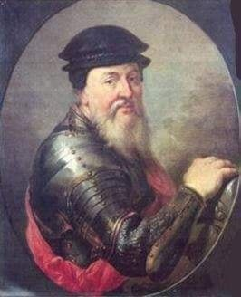  

Źródło : TOHT

### 1490

W Ansbach we Frankonii, urodził się książę Albrecht Hohenzollern - ostatni wielki mistrz zakonu krzyżackiego i pierwszy książę pruski.

Staranne wykształcenie religijne i humanistyczne zdobył na dworze arcybiskupa Kolonii. W 1511 r. został przyjęty do zakonu krzyżackiego i w tym samym roku został wybrany wielkim mistrzem. Państwo krzyżackie przeżywało wówczas poważne problemy wewnętrzne, pogłębione przegraną w 1521 r. wojną z Polską. Rozmowy z ks. Marcinem Lutrem doprowadziły do projektu utworzenia dziedzicznego państwa pruskiego w oparciu o luteranizm. W 1522 r. Albrecht, pod wpływem wysłuchanych w Norymberdze kazań Andreasa Osiandera, przyjął naukę Lutra. Na mocy układu krakowskiego z kwietnia 1525 r. Albrecht otrzymał od króla Zygmunta Starego Księstwo Pruskie jako lenno dziedziczne. Na bazie luteranizmu Albrecht stworzył nową organizację administracyjną, polityczną i religijną państwa, tzw. Landeskirchentum. Luteranizm przyjmował się w Prusach niesłychanie szybko. Książę Albrecht miał w tym wielki udział, przede wszystkim ze względu na osobiste zaangażowanie w organizowanie działalności kościelnej poprzez normowanie liturgii, tworzenie pieśni religijnych, modlitw i rozmyślań, również wizytowanie parafii i udział w dyskusjach teologicznych. Wielkie znaczenie dla rozwoju nauki reformacyjnej miało erygowanie uniwersytetu w Królewcu na mocy dekretu Zygmunta Starego z 1544 roku; dekret ten obdarzał nową uczelnię tymi samymi prawami, jakie posiadała Akademia Krakowska. Książę Albrecht wywarł ogromny wpływ na rozwój Reformacji w Polsce i na Litwie: w Królewcu nie tylko drukowano pierwsze polskie dzieła reformacyjne, ale tu ukazał się jeden z pierwszych przekładów Nowego Testamentu, tu kształcili się przyszli duchowni luterańscy, tu również zdobywali wiedzę przyszli luminarze polskiej kultury. Zmarł 20 marca 1568 roku w Tapiewie. Pochowany został w Królewcu.

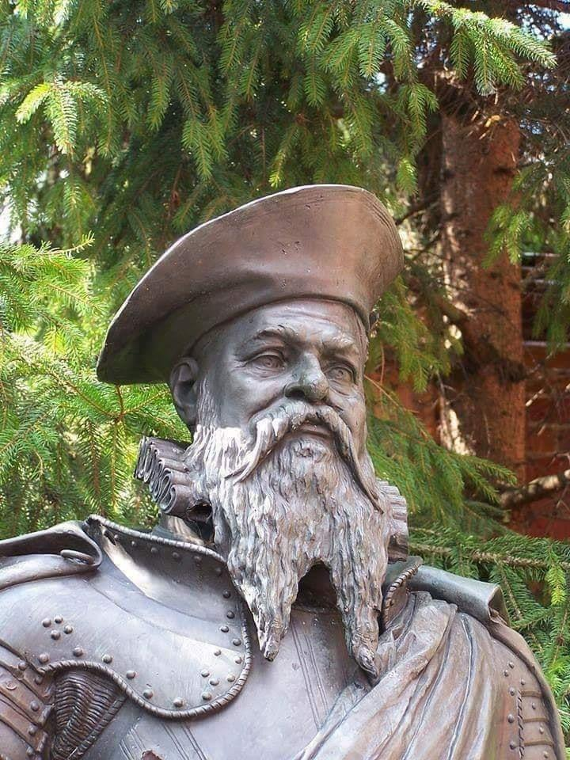  

---

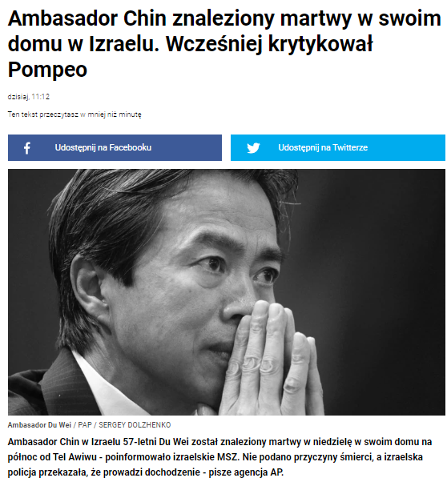  

---

<a href="https://github.com/TomaszWaszczyk/historia.waszczyk.com/edit/master/src/content/may-17.md" target="_blank">Edytuj tę stronę dzieląc się własnymi notatkami!</a>
