### 2020

Szef amerykańskiego banku centralnego udzielił obszernego wywiadu, w którym odniósł się do obecnej i przyszłej kondycji amerykańskiej gospodarki. Padła także odpowiedź na pytanie „Czy Fed drukuje pieniądze?”.

W emitowanym przez stację CBS popularnym programie publicystycznym „60 minutes” Jerome Powell, stojący na czele amerykańskiego banku centralnego, poruszył szereg wątków związanych z trwającym kryzysem. Poniżej przedstawiamy najważniejsze z nich.

- W długim, a nawet średnim okresie, nie grałbym przeciwko amerykańskiej gospodarce. Odbudujemy się, a ludzie wrócą do pracy. To może chwilę potrwać, może się przeciągnąć do końca następnego roku. Nie wiemy tego dokładnie, mamy nadzieję, że stanie się to szybciej.

- Niektóre sektory gospodarki odbudują się dopiero po pojawieniu się szczepionki. Nie wiemy, kiedy to będzie, nie zatrudniamy wirusologów w Rezerwie Federalnej. Zewnętrzni eksperci ostrzegają, że nie ma pewności, kiedy powstanie szczepionka. Pozostaje mieć nadzieję, że będzie to jak najszybciej.

- Bezrobocie może wzrosnąć do 20-25 proc. Nie sądzę jednak, aby obecny kryzys był powtórką Wielkiego Kryzysu. Istnieje wiele fundamentalnych różnic. Po pierwsze, obecnie jeszcze dwa miesiące temu mieliśmy zdrową gospodarkę. Nasz system finansowy nie zawiódł, w przeciwieństwie do tamtego kryzysu. Ponadto nasza odpowiedź jest zdecydowanie inna niż w latach 30., kiedy rządy i banki centralne starały się podnieść stopy procentowe i utrzymać standard złota. Trzeba było zrobić dokładnie odwrotnie. Obecnie właśnie to robimy.

- Trudno mówić o ożywieniu V-kształtnym, ponieważ zależy to od przebiegu pandemii. Racjonalnym jest zakładać, że w drugiej połowie roku gospodarka znów zacznie rosnąć, a bezrobocie spadać.

- Drugi kwartał przyniesie bezprecedensowy spadek PKB. Pamiętajmy jednak, że jako społeczeństwo zrobiliśmy to wszystko, aby chronić się przed wirusem. Nie był to wynik jakiegoś wewnętrznego problemu, bańki nieruchomościowej czy kondycji systemu finansowego. Gospodarka była zdrowa, więc kiedy wirus ustąpi, wrócimy na odpowiednie tory, choć zajmie to nieco czasu.

- U ujęciu annualizowanym, czyli czterokrotnie większym od kwartalnego, w drugim kwartale spadek PKB może sięgnąć 20-30 proc. Kluczowy będzie kwartał trzeci, jest szansa, że już wtedy rozpocznie się ożywienie i wzrost PKB.

- Nie mamy na celu popychania rynków w określonym kierunku. Chcemy jedynie, aby funkcjonowały. Chcemy, aby ludzie mogli kupować i sprzedawać. W trakcie krachu czuliśmy, że musimy zareagować i to zrobiliśmy.

- !!! Tak, drukujemy pieniądze cyfrowo. Jako bank centralny, mamy zdolność do kreowania pieniądza w sposób cyfrowy. Robimy to kupując obligacje skarbowe lub inne gwarantowane przez rząd papiery dłużne. W ten sposób zwiększa się podaż pieniądza. Drukujemy też fizyczną walutę i rozprowadzamy ją poprzez banki Rezerwy Federalnej.
W porównaniu do 2008 r., nasze obecne działania są prowadzone na istotnie większą skalę. Kupujemy o wiele więcej aktywów niż poprzednio. Tym razem jest inaczej – w poprzednim kryzysie problemem był sektor finansowy, więc potrzebne było wsparcie dla systemu bankowego. Obecnie problemy pochodzą z tzw. realnej gospodarki, dotyczą firm wytwarzających towary i usługi. Staramy się im pomóc przejść przez ten trudny okres.

- Zrobiliśmy dużo, ale nie powiedziałbym, że brakuje nam już amunicji. Nie ma żadnego limitu dla programów pożyczkowych, które uruchomiliśmy. Możemy więc jeszcze dużo zrobić, aby wesprzeć gospodarkę i jesteśmy zdeterminowani robić to tak długo, jak będzie trzeba.

- Wielu rzeczy nie mogę zagwarantować, ale mogę zapewnić, że Rezerwa Federalna zrobi wszystko co w jej mocy, aby wspomóc ludzi, którym służymy. Oznacza to zapewnienie pewnego rodzaju ulgi i stabilizacji. Oznacza to wsparcie ożywienia gospodarczego i ograniczenie negatywnego wpływu kryzysu na zawodową przyszłość wielu osób i dalsze istnienie przedsiębiorstw tworzących naszą gospodarkę.

- Od dłuższego czasu USA wydają więcej niż zarabiają. Musimy się z tym zmierzyć. Jednak czas na to, aby gospodarka rosła szybciej niż zadłużenie jest wtedy, kiedy koniunktura jest dobra, bezrobocie niskie, aktywność ekonomiczna wysoka itp. Obecnie nie jest więc na to czas.

- Dolar jest walutą rezerwową świata. Mamy możliwość pożyczania po niskich kosztach, jesteśmy w stanie obsługiwać nasz dług. Obecnie jest czas, aby wykorzystać naszą siłę do uzyskania długoterminowych korzyści. Oczywiście, przez kilka najbliższych lat deficyty będą wysokie. Będziemy musieli sobie z tym poradzić, kiedy gospodarka wróci na właściwe tory.

---

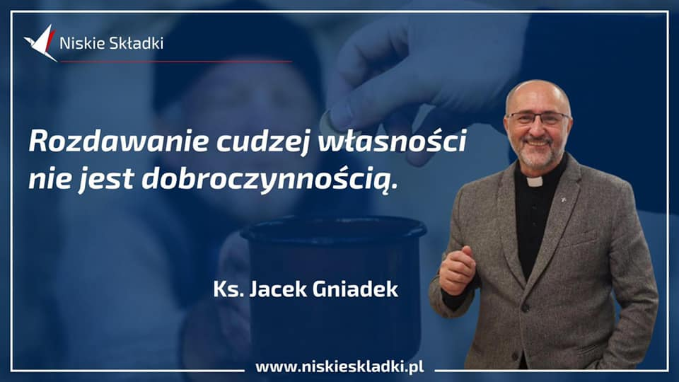  

---

<a href="./documents/may/usdollar.pdf" target="_blank">US Digital Dollar</a>

---

### 2011

W wieku 100 lat zmarła Włada Majewska (zdjęcie)-wybitna polska dziennikarka radiowa,aktorka, piosenkarka i działaczka emigracyjna, w czasie drugiej wojny światowej żołnierz 10 Brygady Kawalerii Pancernej 1 Dywizji Pancernej.
Z wykształcenia była prawnikiem, ale to radio stało się jej największą życiową pasją. Karierę radiową zaczynała w roku 1930 w lwowskiej rozgłośni Polskiego Radia, gdzie obok słynnych Szczepka i Tońka występowała jako parodystka w programie "Wesoła Lwowska Fala". Po agresji sowieckiej na Polskę wyjechała do Rumunii, a następnie do Włoch. Po wojnie wyemigrowała do Wielkiej Brytanii, gdzie od początku lat 50 aż do lat 80 tych prowadziła londyńskie biuro sekcji polskiej Radia Wolna Europa.
Zmarła w Chislehurst w Anglii.
Odznaczona między innymi Złotym Krzyżem Zasługi i Krzyżem Komandorskim Orderu Odrodzenia Polski.

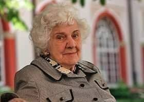  

---

### 2003

Papież Jan Paweł II kanonizował siostrę zakonną Urszulę Ledóchowską.

Julia Maria urodziła się w wielodzietnej rodzinie hrabiowskiej 17 kwietnia 1865 r. w Loosdorf koło Wiednia. Była rodzoną siostrą Marii Teresy Ledóchowskiej, powszechnie nazywanej matką czarnej Afryki, założycielki sióstr klawerianek, beatyfikowanej przez Pawła VI w 1975 roku. W latach 1874-1883 Julia Maria kształciła się w Instytucie Najświętszej Maryi Panny prowadzonym przez Panie Angielskie w austriackim Sankt Polten. W roku ukończenia nauki przybyła wraz z rodziną do nabytego przez ojca majątku w Lipnicy Murowanej koło Bochni.
Jako 21-letnia dziewczyna wstąpiła do klasztoru urszulanek w Krakowie i w dniu obłóczyn, 17 kwietnia 1887 r., przyjęła zakonne imię Maria Urszula. Wyróżniała się gorliwością w modlitwie i umartwieniach. Pierwszą profesję zakonną złożyła 28 kwietnia 1889 roku. Następnie pracowała w krakowskim internacie sióstr. W 1904 roku jako przełożona domu kierowała internatem. Dwa lata później założyła pierwszy na ziemiach polskich internat dla studentek szkół wyższych. Swoje powołanie do wychowania młodzieży i opieki nad nią odkryła jeszcze w nowicjacie.
W 1907 r. z błogosławieństwem papieża Piusa X, z dwiema siostrami, w świeckim stroju wyjechała do pracy dydaktycznej w Petersburgu. Objęła tam kierownictwo zaniedbanego polskiego internatu i liceum św. Katarzyny. Już w rok później została erygowana w Petersburgu autonomiczna placówka urszulańska. Następnie przeniosła się do Finlandii, gdzie otworzyła gimnazjum dla dziewcząt. Podczas I wojny światowej apostołowała w krajach skandynawskich, wygłaszając odczyty o Polsce, organizowała pomoc dla osieroconych polskich dzieci. Jednocześnie nie zaniedbywała swego zgromadzenia, rozrastał się nowicjat i dom zakonny w Szwecji. Pod koniec wojny Urszula Ledóchowska przeniosła go do Danii, gdzie założyła również szkołę i dom opieki dla dzieci polskich.
W roku 1920 Urszula wróciła do Polski. Osiedliła się w Pniewach koło Poznania, gdzie - z myślą o pracy apostolskiej w nowych warunkach - założyła zgromadzenie Sióstr Urszulanek Serca Jezusa Konającego, zwane urszulankami szarymi. Kiedy poprosiła papieża Benedykta XV o zatwierdzenie nowego zgromadzenia, otrzymała je od razu, w dniu 7 czerwca 1920 r. Włodzimierz Ledóchowski - rodzony brat Urszuli - ówczesny generał jezuitów, był rzecznikiem dzieła swojej siostry wobec Stolicy Apostolskiej. Całe życie s. Urszuli było ofiarną służbą Bogu, ludziom, Kościołowi i ojczyźnie. Matka Urszula wiele podróżowała, wizytowała poszczególne domy, kształtowała w siostrach ducha ewangelicznej radosnej służby. "Naszą polityką jest miłość. I dla tej polityki jesteśmy gotowe poświęcić nasze siły, nasz czas i nasze życie" - powtarzała często.
Umarła 29 maja 1939 r. w Rzymie. Tam też została pochowana w domu generalnym mieszczącym się przy via del Casaletto. Beatyfikowana została przez św. Jana Pawła II 20 czerwca 1983 roku w Poznaniu. W 1989 zachowane od zniszczenia ciało bł. Urszuli zostało przewiezione z Rzymu do Pniew i złożone w kaplicy domu macierzystego.

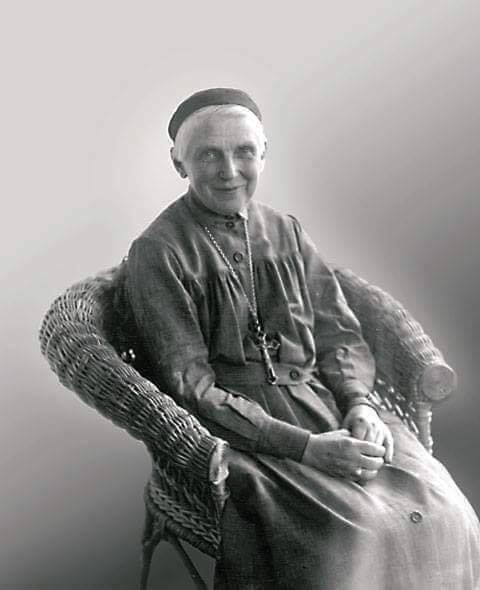  

---

### 1981

Odbyła się pierwsza próba zespołu rockowego Lombard. Próba odbyła się w sali Estrady Poznańskiej. Data uważana jest za dzień powstania zespołu. Liderem zespołu od początku jego istnienia jest Grzegorz Stróżniak - wokalista, klawiszowiec, kompozytor i aranżer. Lombard nagrał kilkanaście płyt, które sprzedały się w nakładzie kilku milionów egzemplarzy: Śmierć dyskotece, Live, Szara maść, Anatomia, Wolne od cła, Kreacje, Największe przeboje ’81-’91, Afryka, Deja’Vu , Live 20 lat - Przeżyj to sam. W 2008 roku na rynek trafiło pierwsze DVD w historii zespołu W hołdzie Solidarności – drogi do wolności. W 2010 roku ukazała się płyta ShowTime zawierająca 10 kompozycji związanych z zaangażowaniem zespołu w sprawy społeczne, a najnowszym wydawnictwem jest LOMBARD SWING - przygotowana specjalnie na jubileusz zespołu płyta zawiera wybrane przeboje zespołu Lombard w swingowych i jazzowych aranżacjach. Zespół Lombard wylansował wiele przebojów: Przeżyj to sam, Szklana pogoda, Nasz ostatni taniec, Droga Pani z Telewizji, Kto mi zapłaci za łzy, Kryształowa, Taniec Pingwina na szkle, Adraiatyk, ocean gorący, Deja’Vu, Patrz!Patrz!, Road to freedom, Musical, Życzę Ci miłego dnia i wiele innych.
Najdłużej istniejący skład w historii zespołu Lombard tworzą: Grzegorz Stróżniak – wokal, instr. klaw. , Marta Cugier – wokal, Daniel Gola Patalas – gitara, Michał Guma Kwapisz – bas, Mirek Kamiński – perkusja. Byłymi członkami zespołu są m.in. Wanda Kwietniewska - wokal (1981–1982) i Małgorzata Ostrowska - wokal (1981–1991, 1997–1999).

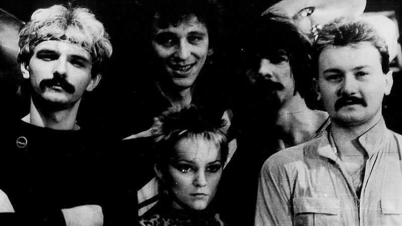  

---

### 1974

Oddano do użytku maszt radiowy nadajnika długofalowego w Konstantynowie Programu Pierwszego Polskiego Radia. Budowla ta przez licząca 646 metrów wysokości przez wiele lat była najwyższą budowlą na Ziemi.
8 sierpnia 1991 roku na skutek błędów podczas prac konserwacyjnych maszt runął na ziemię.

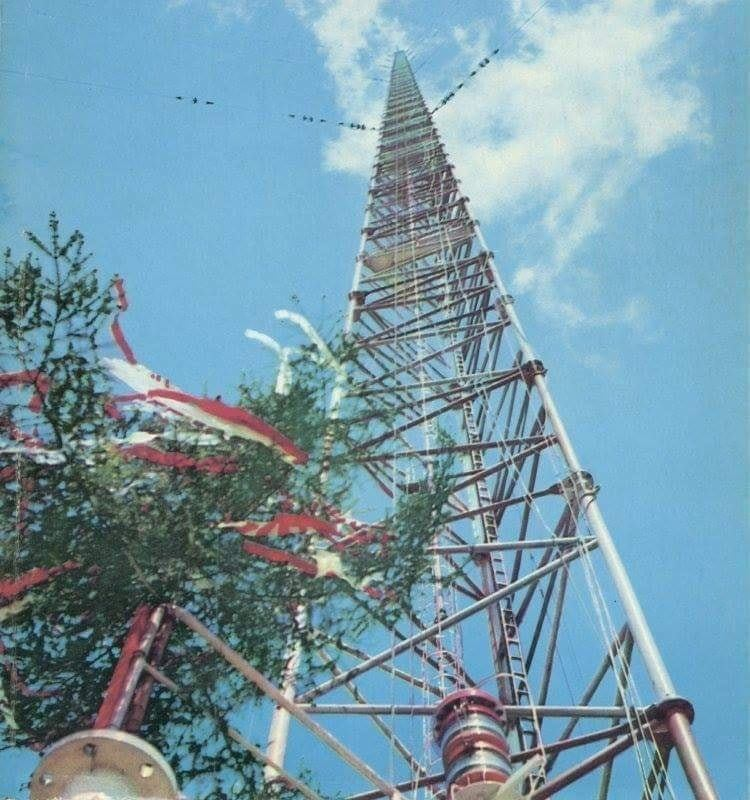  

### 1965

Powieszono Eli Cohena https://en.wikipedia.org/wiki/Eli_Cohen

### 1944

W czasie powrotu z misji nad terytorium Francji, Supermarine Spitfire pilotowany przez Mieczysława Adamka - porucznika pilota z 317 Dywizjonu Myśliwskiego ,,Wileńskiego'' został omyłkowo zestrzelony przez brytyjską obronę przeciwlotniczą. Myśliwiec wodował na Kanale La Manche i zatonął. Ciało pilota wyłowiono i pochowano na cmentarzu w Northwood. Mieczysław Adamek był polskim asem myśliwskim.
Był odznaczony Srebrnym Krzyżem Orderu Virtuti Militari, Krzyżem Walecznych - czterokrotnie,
Medalem Lotniczym - trzykrotnie,
brytyjskim Distinguished Flying Medal - dwukrotnie,
Na liście Bajana zajmuje 36 pozycję z 5 9/20 zestrzeleń pewnych i 1 prawdopodobnie.

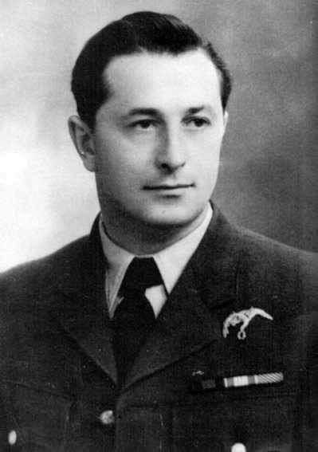  

---

Polacy zdobyli wzgórze Monte Cassino.
Już poprzedniego dnia do ataku na to zajęte przez niemieckich spadochroniarzy miejsce przystąpiły dwie dywizje 2 Korpusu Polskiego; 5 Dywizja Kresowa, która atakowała wzgórze San Angelo i 3 Dywizja Strzelców Karpackich atakująca bezpośrednio masyw górski Monte Cassino.
Wobec tak zmasowanego ataku Niemcom pozostało jedynie wycofanie się z zajmowanych pozycji, tym bardziej, że obawiali się oni również alianckich nalotów.
18 maja 1944 roku na murach znajdującego się na wzgórzu klasztoru żołnierze 12 Pułku Ułanów Podolskich pod dowództwem podporucznika Kazimierza Grubiela zatknęli proporzec i biało -czerwoną flagę.
W walkach w rejonie Monte Cassino II Korpus stracił 924 żołnierzy, 2930 zostało rannych, a za zaginionych uznano 345.
Po bitwie gen. Władysław Anders wystosował depeszę do Naczelnego Wodza, gen. Kazimierza Sosnkowskiego:
> BÓG DAŁ ZWYCIĘSTWO. CHORĄGIEW POLSKA ZOSTAŁA WYWIESZONA O GODZ. 10.30 DNIA 18 MAJA B.R. NA RUINACH KLASZTORU MONTE CASSINO. ŻOŁNIERZ PRZESZEDŁ PIEKŁO OGNIA, UMOCNIEŃ I NIESPOTYKANYCH TRUDNOŚCI TERENOWYCH WALCZĄC Z NAJLEPSZYMI ODDZIAŁAMI NIEMIECKIMI. ZWYCIĘSTWO ZOSTAŁO OSIĄGNIĘTE DZIĘKI BOHATERSTWU ŻOŁNIERZA. DOWÓDCY NASI ŚWIECILI PRZYKŁADEM. JESTEŚMY Z PEŁNYM UZNANIEM DLA GEN. LEESE DOWÓDCY VIII ARMII. W CIĄGU WALKI ZADZIERZGNIĘTE ZOSTAŁY NADZWYCZAJNA KOLEŻEŃSKOŚĆ I BRATERSTWO BRONI Z KORPUSAMI BRYTYJSKIMI. CAŁY CZAS MIELIŚMY WSPANIAŁĄ POMOC LOTNICTWA. POMIMO STRAT I STRASZLIWEGO ZMĘCZENIA PO 22-CH DNIACH WALKI POD CASSINEM ORAZ 7 DNI NATARCIA - DUCH I MORALE WOJSKA NA NAJWYŻSZYM POZIOMIE. NIECH ŻYJE POLSKA!
(W oryginale nie było polskich czcionek)
Bitwa o Monte Cassino zwana również "Bitwą o Rzym" jest jedną z najważniejszych bitew drugiej wojny światowej, a także jednym z najbardziej chwalebnych i spektakularnych zwycięstw w historii oręża polskiego.

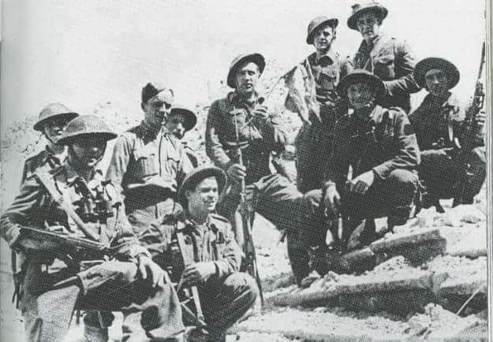  

### 1940

W szef Dystryktu Krakowskiego Otto Wachter wydał zarządzenie, na mocy którego 45 tysięcy krakowskich Żydów, z dniem 15 sierpnia 1940 roku musiało razem z rodzinami opuścić miasto. W Krakowie miało pozostać
zaledwie 15 tysięcy robotników żydowskich. Wysiedlanym, dla których zorganizowano obóz przejściowy przy ulicy Szlak pozwolono zabrać jedynie majątek ruchomy. Następnie wszystkich przetransportowano na Dworzec Główny.

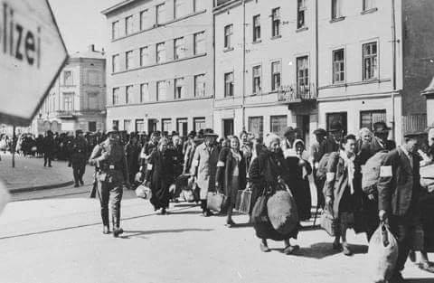  

### 1939

Dokonano oblotu polskiego szybowca PWS-102 " Rekin".
Szybowiec PWS-102 ”Rekin” był
najnowocześniejszym szybowcem
wysokowyczynowym zbudowanym w Polsce przed II wojną światową. Na PWS-102 zastosowano, kilka interesujących rozwiązań konstrukcyjnych. Z powodu wybuchu wojny szybowiec nie zdążył wejść do użytku. Po wybuchu wojny, w pierwszych dniach września 1939 r., prototyp PWS-102 został przyholowany z ITL z Warszawy do Lwowa.
Został on przejęty przez lotnictwo radzieckie wraz z dwoma egz. PWS-102 bis, budowanymi w LWL. Budowę drugiego egzemplarza ukończono na wiosnę 1940 r. w LWL, które zostały przemianowane na Płaniernyj Zawód nr
5 Osoawiachima. Szybowce zostały
przetransportowane do Moskwy i były tam użytkowane.

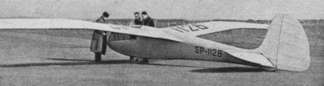  

### 1935

Adolf Hitler wziął udział we mszy żałobnej za duszę zmarłego Józefa Piłsudskiego. Msza odbyła się w katedrze św. Jadwigi w Berlinie. Z tyłu za kanclerzem III Rzeszy siedział m.in. Joseph Goebbels. Na zdjęciu widać symboliczną trumnę Józefa Piłsudskiego. W tym samym czasie trwał również pogrzeb Piłsudskiego w Krakowie.

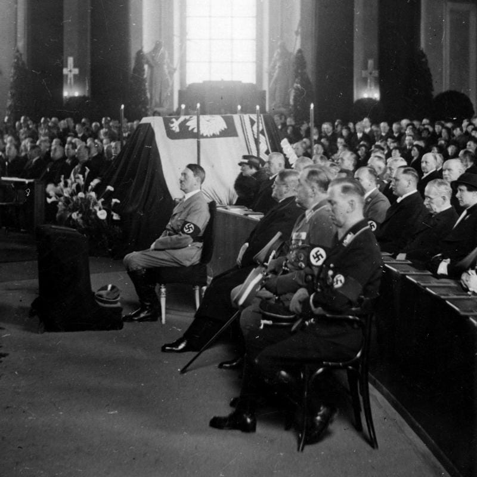  

Uroczystości te stały się dla Polaków okazją do zamanifestowania swojej patriotycznej postawy i kultu marszałka spotęgowanego jeszcze bardziej po jego śmierci.
18 maja do Krakowa od godziny 5 rano
zaczęły przyjeżdżać inne pociągi z osobami spieszącymi na uroczystości pogrzebowe, w tym pociąg pancerny "Pierwszy Marszałek", którym przyjechali oficerowie i żołnierze w pełnym uzbrojeniu. Inne składy przywiozły
korpus dyplomatyczny i delegatów obcych państw. O 7 rano na dworzec zajechał pociąg z prezydentem RP Ignacym Mościckim, którego na dworcu powitał premier Walery Sławek. Przyjechała także delegacja Polaków z Litwy, którzy przywieźli ziemię z grobu matki Piłsudskiego.
Ogromne obciążenie krakowskiego dworca doprowadziły do opóźnienia rozpoczęcia uroczystości pogrzebowych, które według
pierwotnego planu miały zacząć się 18
maja o 8 rano.
Uroczystości pogrzebowe zakończyły się 18 maja ok. godziny 14. W całym pogrzebie udział wzięło ok. 250 tys. osób. W krakowskim pochodzie uczestniczyli przedstawiciele 16 państw, niesiono w nim 60 wieńców, m.in. z Japonii, Chin, Abisynii, Meksyku i od kawalerów maltańskich.
Porządek utrzymywało ok. 5 tys. żołnierzy, a cała uroczystość transmitowana była przez Polskie Radio. Stanisław Mackiewicz pisał o atmosferze podczas pogrzebu
marszałka: "Piłsudski miał fanatycznych
wielbicieli, którzy go kochali więcej niż
własnych rodziców niż własne dzieci, ale
było wielu ludzi, którzy go nienawidzili, miał całe warstwy ludności, całe dzielnice Polski przeciwko sobie, potężną nieufność do siebie. I oto nie znać było tego w dniu pogrzebu".

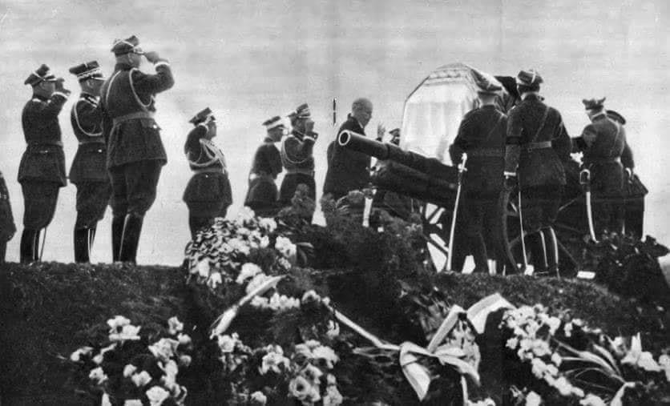  

---

### 1938

Z szybowiska w Bezmiechowej na szybowcu PWS-101 (nr rej. SP-1004) wystartował Tadeusz Góra. Lot zakończył się w Małych Solecznikach pod Wilnem. W czasie lotu Tadeusz Góra przemierzył 578 km. Za swój wyczyn otrzymał – jako pierwszy pilot na świecie - medal Lilienthala, czyli najwyższe odznaczenie szybownicze.

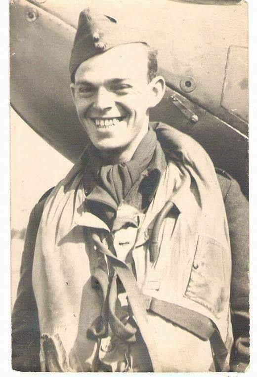  

---

### 1920

W Wadowicach urodził się Karol Wojtyła, przyszły papież Jan Paweł II.
Uznałem, że zamiast jego kolejnego życiorysu przytoczę tu fragment tego, co sam o sobie powiedział.
"Urodziłem się w tym czasie, kiedy bolszewicy szli na Warszawę. Polska była bardzo zagrożona. Wtedy się urodziłem i wtedy mnie ochrzczono tym imieniem, które niosę z sobą przez całe życie… Na imię mam Karol.
Kiedy patrzę wstecz, widzę, jak droga mojego życia, poprzez środowisko, poprzez parafię, poprzez moją rodzinę, prowadzi mnie do jednego miejsca: do chrzcielnicy w wadowickim kościele parafialnym. Przy tej chrzcielnicy zostałem przyjęty do łaski Bożego syno-stwa i do wiary Odkupiciela mojego, do wspólnoty Jego kościoła, w dniu 20 czerwca 1920 roku.
Wiadomo, jak wiele dla rozwoju ludzkiej osobowości i charakteru znaczą pierwsze lata życia, lata dziecięce, a potem młodzieńcze. Te właśnie lata łączą się dla mnie nierozerwalnie z Wadowicami… Miasto mojego dzieciństwa, dom rodzinny, kościół parafialny… Wszędzie dobrze, a najlepiej w domu... Wiele wspomnień…
Ja z rodu jestem człowiekiem gór… Chociaż moją Ojczyzną jest cała Polska, wszędzie, gdzie jest Polska, i wszystko, co jest polskie – to jednak z tą częścią Ojczyzny byłem szczególnie związany, bo tam się urodziłem, bo tam spędziłem prawie całe moje życie, tam zostałem powołany do kapłaństwa, do biskupstwa – byłem góralskim biskupem, góralskim kardynałem, a na końcu zostałem góralskim papieżem."

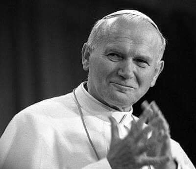  

### 1863

W trakcie powstania styczniowego rozegrała się krwawa bitwa o twierdzę Fraulin we wsi Gołębiów koło Grójca.
Wojska generała Władysława Grabowskiego stawiły czoła carskiej armii generała Mellera Zakomelskiego.
Niestety jak większość bitw tego powstania i ta zakończyła się porażką powstańców. Zginęło około 180 Polaków, prawdopodobnie około 30 wzięto do niewoli.

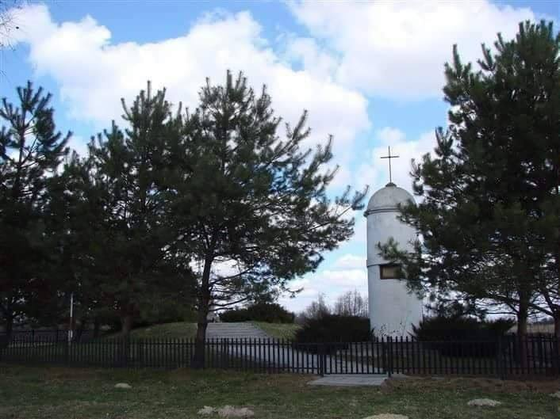  

### 1809

W czasie wojny polsko-austriackiej wojska polskie zdobyły Sandomierz.
Zdobycie tego miasta pozwoliło księciu Józefowi Poniatowskiemu na dalsze działania w tak zwanej "starej Galicji"polegające na szeroko zakrojonej akcji przeciwko wojskom księcia Ferdynanda.
Plany te nawet udawało się dosyć skutecznie realizować, ponieważ już dwa dni póżniej Polacy zdobyli Zamość, a 27 maja Lwów.
Radośc z sukcesu nie trwała jednak długo, ponieważ już 18 czerwca siódmy korpus austriacki odbił Sandomierz. Jednak znowu pod polskim naciskiem musiał wycofać się w stronę Krakowa.

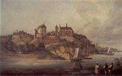  

### 1792

Rozpoczęła się wojna polsko-rosyjska zwana także wojną w obronie Konstytucji 3 maja.
Pzeciwko wkraczającym do Polski Rosjanom stanęły; korpus koronny księcia Józefa Poniatowskiego w liczbie 104 tysięcy żołnierzy oraz korpus litewski księcia Ludwika Wirtermberskiego sile 35 tysięcy ludzi. Katarzyna drug wysłała do Polski 97 tysięcy żołnierzy sformowanych w korpusach mołdawskim i białoruskim.
Mimo iż Polacy odnieśli w tej wojnie zwycięstwa w bitwie pod Zieleńcami to i tak sama wojna zakończyła się przegraną wojsk polskich.
24 lipca 1792 roku król Stanisław August Poniatowski ogłosił złożenie broni przez Polaków. Zapoczątkowało to drugi rozbiór Polski.

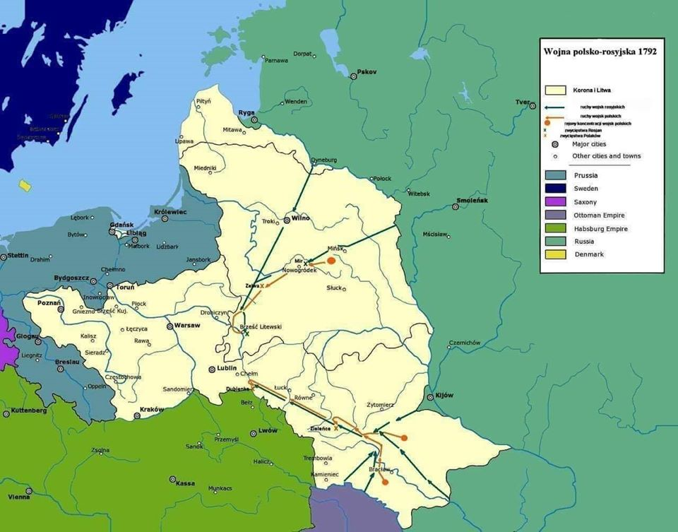  

---

<a href="https://github.com/TomaszWaszczyk/historia.waszczyk.com/edit/master/src/content/may-18.md" target="_blank">Edytuj tę stronę dzieląc się własnymi notatkami!</a>
