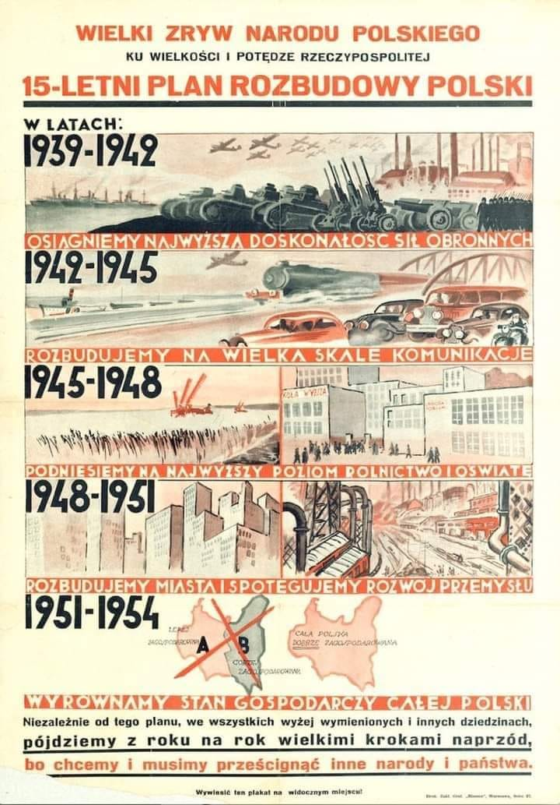
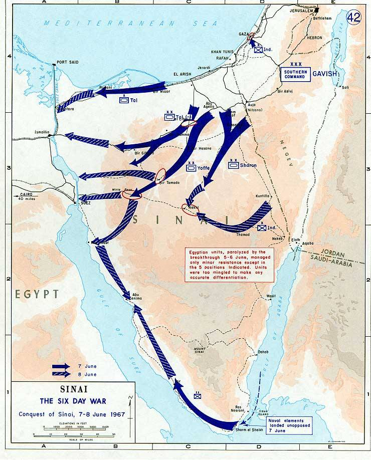
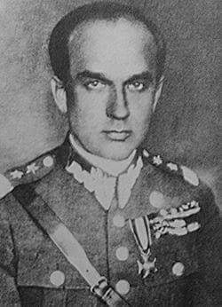
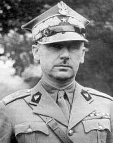
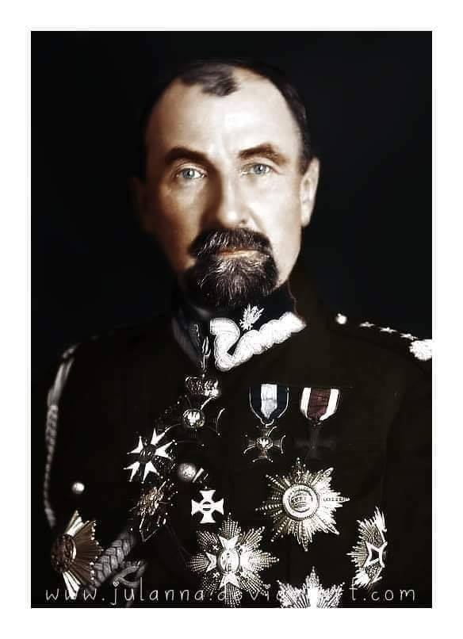

### 2022

- Jak jest różnica między teorią spiskową a rzeczywistością? 
- Sześć miesięcy.
Bezwarunkowy dochód gwarantowany (BDG) nie jest już teorią spiskową. Będzie testowany w Polsce https://tiny.pl/96nzg. BDG to idea, która w swoim założeniu ma zapewnić każdemu obywatelowi stałą „pensję” wypłacaną przez państwo.
Zdrowy rozsądek podpowiada, że pomysł ten jest niebezpieczny. Skoro ten dochód ma być gwarantowany, to ktoś musi go zagwarantować. Gwarantuje go rząd, a rząd nie ma swoich pieniędzy tylko te, które odbierze podatnikom, więc ktoś musi pracować. Jeśli ktoś musi na kogoś pracować, to staje się on niewolnikiem tego, na którego pracuje.
Tradycyjne nauczanie społeczne Kościoła kładzie nacisk na znaczenie i godność ludzkiej pracy dla osobowego rozwoju. Płacenie ludziom, niezależnie od tego, czy pracują, czy też nie, może wydawać się obrazą takiej etyki. Prawdziwe niebezpieczeństwo jest jednak o wiele większe. Ktoś próbuje podmienić nam tradycyjną antropologię nową wizją człowieka, który nie jest już osobą, mającą swoją godność, wyjątkowość i swoje prawa. Socjalizm traktował ludzką osobę jako element machiny społecznej. Eksperyment z BDG idzie znacznie dalej. Świat nie wie, co zrobić z człowiekiem. Widzi w nim nawet klimatyczne zagrożenie. 
Kiedyś w wywiadzie dla "Obserwatora finansowego" powiedziałem, że bardziej niż transhumanizmu boję się urzędników i państwa w obecnej postaci, które stale ingerującego w moje życie. Transhumanizm, jak trafnie zauważa to Magdalena Ziętek-Wielomska w nagraniu "Kim jest człowiek? Najważniejsze pytanie XXI wieku!" https://youtu.be/6TCVFTlBXUI rodzi się na uniwersytetach. Problem polega na tym, że ten eksperyment jest przeprowadzany za nasze pieniądze. 
Co możemy zrobić, by stanąć w obronie wyjątkowości i godności ludzkiej osoby? Należy bronić instytucji własności prywatnej. Nic lepszego nie wymyślimy.  
"Wszyscy chcą naszego dobra. Nie dajcie go sobie zabrać." 
- Stanisław Jerzy Lec.

  

### 2021

  

> Bitcoin nie zdechnie, bo gangsterka musi mieć możliwość anonimowego handlu bronią i kokainą w dark-necie. Oczywiście BTC sam w sobie jest bezwartościowy i nie ma znaczenia po jakim kursie chodzi, bo i tak jest niemal natychmiast wymieniany na prawdziwą walutę. Tylko frajerzy myślą, że to jest prawdziwe aktywo i da się na nim zarobić.

### 1967

Egipt rozpoczął remilitaryzację półwyspu Synaj po wycofaniu na jego żądanie międzynarodowych sił pokojowych UNEF.

Dużą rolę w rozpoczęciu konfliktu miało ZSRR. Dnia 13 maja 1967 przewodniczący Prezydium Rady Najwyższej Związku Socjalistycznych Republik Radzieckich Nikołaj Podgorny przekazał egipskiemu wiceprezydentowi Anwar Sadatowi fałszywą depeszę o rzekomej o koncentracji 12 izraelskich brygad przy granicy z Syrią. Jednocześnie Związek Radziecki zapewniał o pomocy wojskowej, która będzie przekazana dla Syryjczyków. Jak wynika z późniejszych dokumentów informacje radzieckie były całkowicie pozbawione podstaw, w tym czasie na granicy przebywały zaledwie dwie brygady izrealskie.

Wprowadzeni w błąd Egipcjanie byli przekonani, że Izrael przygotowuje się do inwazji na Syrię. Dlatego reakcja Egiptu była natychmiastowa i zdecydowana. 14 maja prezydent Gamal Abdel Naser zarządził mobilizację egipskiej armii i rozpoczęto przerzucanie wojsk na Półwysep Synaj. 30 maja 1967 zawiązało się porozumienie wojskowe Egiptu i Jordanii. Armia jordańska została podporządkowana Egiptowi. Jednocześnie Irak, Kuwejt, Tunis, Sudan, Maroko i Algieria zgodziły się skierować swoje wybrane oddziały przeciwko Izraelowi. Po stronie arabskiej opowiedziały się: Pakistan, Indonezja, ZSRR i Chiny.

Dążąc do rozpoczęcia konfliktu 6 maja 1967 szef sztabu egipskiej armii generał Mohammed Fawzy zażądał wycofania międzynarodowych sił pokojowych UNEF z Synaju.

Napisał w liście do dowódcy sił UNEF: "Do twojej wiadomości, wydałem rozkaz wszystkim siłom zbrojnym Egiptu być gotowym do działań przeciwko Izraelowi, który może przeprowadzić agresywne działania przeciwko jakiemukolwiek państwu arabskiemu. Z powodu tego rozkazu nasze wojsko już jest skoncentrowane na Synaju na naszej wschodniej granicy. Przez wzgląd na bezpieczeństwo wojsk ONZ, które stacjonują wzdłuż naszych granic, proszę abyś wydał rozkaz natychmiastowego ich wycofania”. Po opuszczeniu przez wojska UNEF, 19 maja Egipt przystąpił do remilitaryzacji Synaju. Celem była blokada Cieśniny Tirańskiej. Chodziło oczywiście o niedopuszczenie do przepływania statków pod izraelską banderą. Państwo to jednak już wcześniej uznało, że tego typu obostrzenia zostaną uznane za casus beli.

Dla Izraela obrona swobody żeglugi miała charakter nie tylko prestiżowy, ale istotnie stanowiła podstawowy interes narodowy. Izrael jest jedynym, obok Libanu, państwem bliskowschodnim całkowicie pozbawionym złóż ropy. Swoje zapotrzebowanie energetyczne realizowano przez import z Iranu. Rządzący szach Rezda Pahlavi związany był sojuszem z amerykanami. Ze względu na interesy USA na bliskim wschodzie sprzedaż irańskiej ropy odbywała się po preferencyjnych cenach. Zamknięcie cieśniny oznaczało całkowite odcięcie Izraela od strategicznego surowca. Oznaczałoby to katastrofę zarówno dla gospodarki kraju, jak i osłabienie militarnych możliwości. Jeszcze w maju Wielka Brytania i Francja wystosowały deklarację poparcia dla wolnej żeglugi w cieśninie. Państwa te musiały jednak stosować ostrożną retorykę. 28 maja prezydent Naser zagroził zamknięciem Kanału Sueskiego w wypadku interwencji państw trzecich. Liban, Kuwejt, Algieria, Libia zagroziły natomiast wstrzymaniem dostaw ropy do państw zachodnich. Dodatkowo w maju 1967 roku prezydent Francji Charles de Gaulle na spotkaniu z ministrem spraw zagranicznych Izraela Abba Ebanem ostrzegał przed podejmowaniem jakichkolwiek zaczepnych działań militarnych.

Z drugiej strony Syria, a więc pośrednio jej sojusznicy, cieszyła się szerokim wsparciem ZSRR. Po kwietniowym rajdzie samolotów izraelskich Związek Radziecki oskarżył Izrael o chęć zniszczenia prosowieckiego reżimu w Damaszku.

Odpowiedzią izraelską była przeprowadzona w dniach 16-23 maja mobilizacja wojskowa. 1 czerwca premier Izraela Lewi Eszkol utworzył rząd jedności narodowej. W jego skład wszedł nawet Menachem Begin lider prawicy jako minister bez teki. Powołany rząd trzy dni później wydaje decyzję o przeprowadzeniu operacji wojskowej. Atak miał jednocześnie uderzyć w terytoria Egiptu, Syri i Jordani. Konflikt nazwany później Wojną Sześciodniową  stał się nieunikniony.

  

> W PRL- wojna 6-dniowa dała asumpt do rozpoczęcia prześladowań resztek naszej społeczności żydowskiej i do wypędzenia Żydów z kraju (1968/9).

### 1944

Kilka słów o polskim personelu medycznym ratującym życie żołnierzy pod Monte Cassino.

Melchior Wańkowicz - Monte Cassino
(Fragment książki)

>Teraz pracujemy z Polakami. Jest wielce zabawne czasem, jak się próbujemy porozumieć. Mimo to są bardzo pomocni i nic nie jest dla nich trudnością. Wierz mi, że oni wkładają serce i duszę w swą pracę i są przejęci myślą o walce wspólnie z angielskimi chłopakami. Oni mieli dwie sekcje chirurgiczne, wielu z nich zginęło i to jest powodem, że jesteśmy z nimi razem.

Korpus Polski bijący się o Monte Cassino miał na każdym szczeblu sanitarnym od GPO w górę oficera transfuzyjnego. Korpus miał dwie czołówki transfuzyjne, rozporządzające składnicami-chłodnicami. Krew w butelce jest dobra tylko przez 3 tygodnie. Co dzień przed punktami pobierającymi krew w dalekiej mglistej Anglii stoją kolejki brytyjskich dziewcząt bezinteresownie oddających swoją krew. Co dzień z angielskiego Blood Bank we Włoszech przyjeżdżał do polskich czołówek transfuzyjnych łazik, z termosem zawierającym butelki ,,Bristol''.

Nieprzyjaciel bezzwłocznie pokwitował wysunięcie do przodu głównego punktu opatrunkowego - przed trzema dniami na tym posterunku GPO polegli lekarze Grabner, Napora, ksiądz Huczyński i sanitariusz, ranni byli lekarze Mozes, Mazanowski i Pancer - i kilkunastu sanitariuszy. Nie dał się zachwiać pułkownik Dietrich - odciągnął GPO o parę stajań - tu w ten wąwozik i kazał mu zostać. Przed akcją naczelny chirurg Korpusu - generał Szarecki - sam przyjechał i stanął do pracy na tym najbardziej wysuniętym posterunku operacyjnym. Znowu spotykam doktora Rymkiewicza, znowu krew na lekarzach - mówi mi, że doktor Szarecki, liczący 70 lat, stoi już całą noc przy stole operacyjnym ( stał tak i cały dzień i całą noc następną). Przy GPO z powodu jego masakry, pracuje dodana czołówka operacyjna angielska. Na stole operacyjnym strzelec Kaca, twardy Ślązak z 15. baonu. Ręka poszarpana, kość strzaskana - leży na stole bez narkozy, pali papierosa w czasie operacji. Doktor Szarecki operuje.

Foto: doktor generał Bolesław Szarecki

  

### 1939

Minister spraw wojskowych generał dywizji Wojska Polskiego Tadeusz Adam Kasprzycki (na zdjęciu) podpisał w Paryżu tajny protokół Kasprzycki-Gamelin, w którym Francja zobowiązała się do niezwłocznej pomocy Polsce w przypadku agresji ze strony III Rzeszy.
W protokole czytamy:
I. W wypadku agresji niemieckiej przeciwko Polsce lub w wypadku zagrożenia żywotnych interesów Polski w Gdańsku, co wywołałoby zbrojną akcję Polski, Francuskie Siły Zbrojne
rozpoczną automatycznie działania w sposób następujący:
1. Francja podejmie natychmiast działania powietrzne zgodne z uprzednio ustalonym
planem.
2. Gdy tylko część sił francuskich będzie gotowa (około trzeciego dnia) Francja stopniowo przystąpi do działań ofensywnych o ograniczonych celach.
3. Gdy tylko zaznaczy się główny wysiłek niemiecki przeciw Polsce, Francja głównymi siłami rozpocznie działania ofensywne przeciwko Niemcom (poczynając od piętnastego dnia) 
II. W pierwszej fazie wojny Polska zaangażuje całość swych sił w działaniach obronnych przeciwko Niemcom, przechodząc do działań ofensywnych, gdy tylko okoliczności pozwolą, na ogólnych warunkach uzgodnionych przez oba Dowództwa.
III. Na odwrót, jeśli gros sił niemieckich zaatakuje Francję, w szczególności przez Belgię lub Szwajcarię, co pociągnie za sobą wszczęcie działań zbrojnych przez armię francuską, Wojsko Polskie będzie dokładać wszelkich starań, by związać możliwie największą część sił niemieckich, na ogólnych warunkach uzgodnionych przez oba Dowództwa.
IV. Aby wzmocnić uzbrojenie i wyposażenie Polskich Sił Zbrojnych, oba Dowództwa naczelne uznają za konieczne we wspólnym interesie natychmiastowe przyjście przez Francję z pomocą materiałową i finansową rządowi polskiemu. Pomoc ta pozwoli wydatnie zwiększyć siły Wojska Polskiego i rozwinąć w Polsce przemysł wojenny, tak na potrzebny Wojska Polskiego, jak i na potrzeby jego sojuszników na wschodnim teatrze działań wojennych.
V. Oba Dowództwa Naczelne uważają za niezbędne kontynuowanie bardziej szczegółowych rokowań, mających na celu rozpracowanie wytycznych zawartych w niniejszym protokole.

  

### 1895

W Petersburgu urodził się Stanisław Kopański- dowódca Samodzielnej Brygady Strzelców Karpackich walczącej w Tobruku.
Tak o tym mówił.generał Władysław Sikorski:
"Przyjmuję z zadowoleniem meldunek Pana Generała o objęciu przez Brygadę
najpoważniejszego odcinka obrony Tobruku.
Ten dowód zaufania, jak i wasze przejście do Tobruku wykorzystałem w całej pełni na najwyższym szczeblu stosunków polsko- brytyjskich, powodując przerwanie milczenia o naszym udziale w tej walce.
Daje to dzisiaj doskonałe rezultaty dla
sprawy. (...) Dziękuję w imieniu służby
narodowej Panu Generałowi i dowodzonej przez niego Brygadzie za wspaniałą, prawdziwie polską postawę żołnierską"
Kopański zmarł 10 marca 1976 roku w Londynie.

  

### 1866

W miejscowości Babin urodził się Tadeusz Jordan-Rozwadowski, herbu Trąby - marszałek polny porucznik (niem. feldmarschalleutnant) Cesarskiej i Królewskiej Armii, generał broni Wojska Polskiego.

Pochodził z rodziny o dużych tradycjach wojskowych i niewątpliwych zasługach dla ojczyzny. Rycerz Maciej Rozwadowski wykazał się męstwem w bitwie pod Wiedniem w 1683 roku. Pradziad Tadeusza, Kazimierz Rozwadowski, był kościuszkowskim brygadierem, dziad Wiktor walczył w powstaniu listopadowym, a ojciec Tomisław w powstaniu styczniowym. Od najmłodszych lat Tadeusz wychowywany był w duchu patriotyzmu. Najwcześniejszy okres dzieciństwa spędził w otoczeniu dworu szlacheckiego w Babinie. Jednak już jako dziecko pokochał Lwów, to uczucie przetrwało do końca jego dni.
Tadeusz Rozwadowski rozpoczął naukę wojskową w szkole realnej w Hranicach. Następnie w latach 1882-1886 studiował w Wojskowej Akademii Technicznej we Wiedniu, którą ukończył w stopniu podporucznika jako najlepszy na roku. Następnie odbył studia w Szkole Wojennej w Wiedniu, która była przeznaczona dla elity korpusu oficerskiego. Po ukończeniu tej szkoły w 1891 roku Rozwadowskiemu powierzono stanowisko adiutanta sztabu w 3 Brygadzie Kawalerii w Mariborze. Po dwóch latach został przeniesiony do Budapesztu, gdzie przydzielono go do sztabu 31 Dywizji Piechoty. Podczas służby w stolicy Węgier w 1894 roku ożenił się z Marią hrabianką Komorowską.
W październiku 1896 roku Rozwadowskiego mianowano attaché wojskowym przy poselstwie austriackim w Bukareszcie. Miał wszelkie predyspozycje by objąć to stanowisko, znał bowiem pięć języków – polski, francuski, niemiecki, czeski i rosyjski, a z czasem także rumuński. Ponadto posiadał niezwykły urok osobisty, wrodzony optymizm i nienaganne maniery, co ułatwiało obcowanie z ludźmi. Pierwszym sukcesem było wynegocjowanie przez niego korzystnej dla Austro-Węgier umowy celnej. Rozwinął także współpracę austriacko-rumuńską na polu wojskowym, co wiązało się z modernizacją zacofanej armii rumuńskiej i miało sprzyjać zacieśnieniu sojuszu polityczno-wojskowego z Rumunią. Działalnością na tym polu Rozwadowski zjednał sobie sympatię i uznanie króla rumuńskiego Karola, a także rumuńskiego następcy tronu księcia Ferdynanda. Przyjacielskie relacje z rodziną panującą Rozwadowski wykorzystał już w odrodzonej Polsce, walnie przyczyniając się do podpisania sojuszu polsko-rumuńskiego. W Rumunii przyszły na świat jego dzieci. W 1898 roku urodziła się córka Melania, rok później syn Józef, a w 1906 roku najmłodszy Kazimierz.
Bukareszt Rozwadowski opuścił w 1907 roku w stopniu podpułkownika. Powrócił do Galicji do niewielkiego Stanisławowa, gdzie został dowódcą 31 pap i awansowano go na pułkownika w maju 1908 roku. Do wybuchu wojny poświęcił się pracy wojskowej i społecznej. W 1913 roku roku jako jedyny z wyższych polskich oficerów służących w armii austriackiej nawiązał współpracę z ruchem strzeleckim, dla którego okazał się bardzo cenną osobą, ponieważ dzięki swoim znajomościom ratował go z różnych opresji.

Konstruktor i wynalazca
Jako znawca konstrukcji artyleryjskich płk Rozwadowski dokonał kilku cennych wynalazków. Sporządził bardzo prosty, ale niezwykle skuteczny przyrząd celowniczy. Znacznie ważniejszym wynalazkiem był nowy rodzaj pocisku artyleryjskiego, tzw. granato-szrapnel. Pocisk ten działał podwójnie, eksplodował raz w powietrzu jako szrapnel, zasypując cel kulkami i drugi raz, kiedy eksplodowała głowa (granat) pocisku po zetknięciu z celem. Granato-szrapnel, dzięki swojemu działaniu, wskazywał obserwatorom dwa punkty końca swego toru (tj. chmurkę szrapnelową i miejsce wybuchu głowy), ułatwiając tym samym szybsze wstrzeliwanie się w obiekty ukryte za przeszkodą (np. za wzgórzem). Ta zaleta spowodowała, że pocisk Rozwadowskiego znalazł zastosowanie w I wojnie światowej. Używała go artyleria austriacka i niemiecka, zwłaszcza do niszczenia sprzętu artyleryjskiego przeciwnika. Jednak wstrzeliwanie się granato-szrapnelem wymagało doświadczonych dowódców baterii. Pocisk posiadał bowiem tę wadę, że przy większych wysokościach rozprysku głowa granato-szrapnela nie zawsze wybuchała, czasami koziołkowała w powietrzu i zapalnik nie zderzał się z ziemią. Prace nad pociskami artyleryjskimi Rozwadowski prowadził do końca swojego życia. Współczesnym odpowiednikiem tych projektów są pociski artyleryjskie o działaniu odłamkowo-burzącym.

I wojna światowa
9 sierpnia 1914 roku już jako generał objął stanowisko dowódcy 12 Brygady Artylerii w 12 "Krakowskiej" Dywizji Piechoty armii Austro-Węgier. Rozwadowski odegrał jedną z kluczowych ról w bitwie pod Gorlicami w maju 1915 roku. Za główne źródło sukcesu 12 DP w pierwszym dniu bitwy pod Gorlicami należy bezsprzecznie uznać współdziałanie artylerii z piechotą. Zrobiony przez artylerię 12 DP wyłom w linii obronnej wroga zaczął się rozszerzać, co umożliwiło zdobycie Gorlic. Rozwadowski zastosował nowy sposób użycia artylerii i bez wątpienia należy do twórców i prekursorów tzw. ruchomej zasłony ogniowej, polegającej na tym, że ogień artyleryjski postępował tuż przed atakującą piechotą. Metoda ta bardzo szybko weszła na trwałe do niemieckiego regulaminu walki jako tzw. Feuerwalze, a do francuskiego jako barrage roulant i zastąpiła stosowane wcześniej wielogodzinne ostrzeliwanie pozycji wroga, po których następował pochłaniający liczne ofiary szturm wojsk. 17 maja pod Jarosławiem Rozwadowski samym ogniem artylerii powstrzymał kontrnatarcie Rosjan. Wprawiło to w zachwyt cesarza niemieckiego Wilhelma II i miało przynieść Rozwadowskiemu Krzyż Żelazny I Klasy, ostatecznie jednak nie otrzymał tego odznaczenia. W następnej ofensywie uczestniczył już jako dowódca 43 DP. Za wybitne czyny wojenne podczas kampanii 1915 roku Rozwadowski otrzymał najwyższe odznaczenie austro-węgierskie order Marii Teresy. W drugiej połowie 1915 roku coraz częściej zaczął popadać w konflikty z Naczelnym Dowództwem, krytykował sposób prowadzenia wojny, a czarę goryczy przelało wstawianie się za prześladowaną ludnością polską w Galicji. 1 lutego 1916 roku Rozwadowski został przeniesiony na emeryturę. Bezpośrednią przyczną dymisji było samowolne opuszczenie dywizji (związane z wyjazdem Rozwadowskiego na polowanie w czasie gdy jego jednoska została zaatakowana). W armii austriackiej dosłużył się stopnia marszałka polnego porucznika (polski odpowiednik generała dywizji).

Organizator Wojska Polskiego i obrońca Lwowa
Jeszcze w 1916 roku nawiązał współpracę z Tymczasową Radą Stanu, a następnie z będącą jej kontynuatorką Radą Regencyjną. Głównym powodem była próba utworzenia armii polskiej. Jednak idea ta mogła zostać zrealizowana dopiero 25 października 1918 roku, gdy Rada Regencyjna powołała urząd szefa Sztabu Generalnego Wojska Polskiego. Stanowisko to objął oficjalnie 28 października gen. Rozwadowski. Od razu rozpoczął organizowanie centralnych instytucji wojskowych oraz nowych oddziałów Wojska Polskiego. W konsekwencji tych działań jeszcze za rządów Rozwadowskiego powstał zalążek polskiej marynarki wojennej. Wbrew tym faktom, propaganda piłsudczykowska później starała się dowodzić jednak, że początki marynarki wojennej wiążą się ściśle z postacią Józefa Piłsudskiego. 30 października z rozkazu szefa sztabu i w porozumieniu z Ministerstwem Aprowizacji powstał też pierwszy oddział Straży Gospodarczo-Wojskowej, formacji, której zadaniem było strzec granic Polski i będący swoistym pierwowzorem Korpusu Ochrony Pogranicza. Natomiast 4 listopada generał wydał rozkaz o utworzeniu dywizji jazdy, co dało początek kawalerii Wojska Polskiego. 31 października gen. Rozwadowski przedstawił "schemat organizacji polskich władz wojskowych". Według tego projektu Rada Regencyjna pełniła funkcję naczelnego dowództwa nad wojskiem, a podlegały jej: minister spraw wojskowych, szef sztabu i sądownictwo wojskowe. Szef sztabu był równoważny ministrowi. Praca wykonana przez Sztab Generalny była ogromna i co najważniejsze, że okazała się stosunkowo trwała. "Tymczasowa ustawa o powszechnym obowiązku służby wojskowej" pomimo swojej tymczasowości w nazwie przetrwała do 1924 roku. Instytucje wojskowe powołane przez sztab odegrały ważną rolę w toczonych później wojnach o granice. 15 listopada Rozwadowski ustąpił ze stanowiska szefa sztabu generalnego. Powodem dymisji był spór z Piłsudskim o sposób tworzenia polskiej armii. Dotychczasowy szef sztabu był za przymusowym poborem, zaś Piłsudski za ochotniczym.
Po zdaniu stanowiska przyglądał się nieudolnej pomocy dla walczącego z Ukraińcami Lwowa. W końcu zażądał dla siebie dowództwa nad wojskami polskimi w Małopolsce Wschodniej, grożąc, że w przeciwnym razie pójdzie walczyć pod Lwów jako szeregowiec-ochotnik. 17 listopada Piłsudski mianował go Naczelnym Dowódcą Wojsk Polskich w Galicji Wschodniej (Armii "Wschód"). W nocy z 21 na 22 listopada Lwów został wyzwolony przez wojska ppłk Michała Tokarzewskiego-Karaszewicza. Rozwadowski przybył do oblężonego miasta w nocy z 24 na 25 listopada i objął dowództwo. Od razu stwierdził, że polskie siły są zbyt słabe i zaczął domagać się posiłków. Niestety jego prośby nie spotykały się z odzewem Warszawy. Ponadto generał od początku był atakowany przez utworzony 22 listopada we Lwowie Tymczasowy Komitet Rządzący, w którego skład wchodzili w większości narodowi demokraci. Endecy nasilili nagonkę na Rozwadowskiego, gdy ten nie dopuszczał do pogromów, jakich próbowano dokonywać na Żydach. Generał znajdował się w niezwykle trudnej sytuacji, poza skomplikowanymi zadaniami militarnymi, musiał sobie radzić z atakami na swoją osobę ze wszystkich niemal stron, a mianowicie Naczelnika Państwa Józefa Piłsudskiego, szefa sztabu gen. Stanisława Szeptyckiego oraz członków TKR. Na początku dowódca Armii "Wschód" zaczął przekształcać niezdyscyplinowane i nierówne liczebnie oddziały ochotnicze w jednostki regularnego wojska, równocześnie prowadząc szkolenie. Do połowy grudnia wojna z Ukraińcami miała charakter partyzancki. Bardzo niebezpieczne były oddziały uzbrojonych chłopów ukraińskich, w związku z czym generał Rozwadowski rozkazał "uzbrojonych chłopów rozstrzeliwać". Pod koniec grudnia 1918 roku Naczelna Komenda Ukraińska zaplanowała decydującą ofensywę. Rozpoczął się zmasowany szturm na Lwów. Wojska ukraińskie dysponowały trzykrotną przewagą liczebną. Atak się nie powiódł, generał utrzymał miasto. Wobec niepowodzenia Ukraińcy rozpoczęli ostrzał artyleryjski Lwowa. TKR próbował negocjować pokój, ale Rozwadowski nie chciał nawet o tym słyszeć. W styczniu 1919 roku Warszawa zdecydowała się wreszcie wysłać znaczne posiłki pod dowództwem gen. Jana Romera. Nie na wiele zdały się te posiłki - gen. Rozwadowski krytycznie oceniał wartość bojową oddziałów, którymi dysponował określając je mianem "dyletankich". Na krótki czas sytuacja się poprawiła, ale na przełomie stycznia i lutego Lwów znowu został odcięty i otoczony przez kilkakrotnie liczniejszego wroga. Rozwadowski wobec kończącej się amunicji i braku ludzi apelował o wsparcie, ale nie przyniosło to skutku. Nasiliły się natomiast ataki endeków na generała, który poza kwestią żydowską, bronił także duchownych i ludność prawosławną, starając się nie dopuszczać do zamieszek na tle religijnym w mieście. Z każdym dniem położenie obrońców się pogarszało. Przed odciętą od wody i światła ludnością stanęło widmo głodu. Komitet Obrony Narodowej Lwowa domagał się odwołania gen. Rozwadowkiego. Naczelne Dowództwo w Warszawie 7 marca w telegramie nakazywało przebić się przez oblężenie i wycofać do Przemyśla. Gen. Rozwadowski odpowiedział "Powziąłem niezłomną decyzję raczej zginąć z załogą niż w myśl rozkazu Naczelnego Dowództwa opuścić Lwów". Bohaterska obrona osamotnionego Lwowa zaczęła urastać do rangi dużego problemu dla Warszawy. Opinia publiczna domagała się udzielenia natychmiastowej pomocy dla walczącego miasta. 12 marca ruszyła odsiecz pod dowództwem gen. Wacława Iwaszkiewicza-Roduszańskiego. Po odbiicu linii kolejowej do Przemyśla zastąpił on gen. Rozwadowskiego na stanowisku dowódcy Armii "Wschód". 19 marca 1919 roku wojska wielkopolskie gen. Franciszka Aleksandrowicza połączyły się z oddziałami płk. Władysława Sikorskiego w Gródku Jagiellońskim. Tam przywitał ich gen. Rozwadowski. Oblężenie Lwowa zostało zlikwidowane. Gen. Iwaszkiewicz wręczył Rozwadowskiemu rozkaz przenoszący go na stanowisko szefa Polskiej Misji Wojskowej w Paryżu. Generał wobec możliwości przeprowadzenia wielkiej ofensywy przeciwko Ukraińcom poczuł się urażony tą decyzją Naczelnego Dowództwa. Opuszczał Lwów owacyjnie żegnany przez mieszkańców miasta i żołnierzy swojej armii.

Szef Polskiej Misji Wojskowej w Paryżu
Przyczyny powierzenia Rozwadowskiemu tego stanowiska nie są do końca jasne. Wydaje sie, że popularny generał wyraźnie wadził Piłsudskiemu. Zwłaszcza domaganie się zwiększenia pomocy dla Wschodniej Galicjii nie było na rękę marszałkowi, który chciał skupić się na działaniach w okolicy Wilna. Wyjazd generała do Francji nastąpił w kwietniu 1919 roku. Rozwadowski nie chciał tego stanowiska. W listach do Piłsudskiego domagał się przeniesienia na front. Jednak Dowództwo było zadowolone z kierowanej przez generała misji i nie miało zamiaru przychylić się do jego prośby. Dużo udało się uzyskać Rozwadowskiemu w sporach o Galicję Wschodnią, przekonując państwa zachodnie do polskiego punktu widzenia. Zabiegał szczególnie gorąco o zbliżenie polsko-rumuńskie. W czerwcu 1919 Rzeczpospolita mianowała swego posła w Bukareszcie. Nie było przypadkiem, że został nim były adiutant Rozwadowskiego hr. Aleksander Skrzyński.
Generał interweniował u marszałka Ferdynanda Focha w czasie zagrożenia ze strony niemieckiej. Szef Polskiej Misji Wojskowej postulował utworzenie u boku armii polskiej Legionu Amerykańskiego. Dla swych planów pozyskał dowódcę Amerykańskich Sił Ekspedycyjnych we Francji gen. Johna Pershinga. Gorącego zwolennika idea ta znalazła w osobie premiera Ignacego Jana Paderewskiego. Okazało się jednak, że największym przeciwnkiem tych planów był Józef Piłsudski. Nie dał się przekonać nawet, gdy szef PMW dowodził, że wyszkolone amerykańskie jednostki wojskowe (lotnicy, czołgiści, korpus medyczny i wojska inżynieryjne) będą olbrzymim wsparciem dla młodej armii polskiej. Pomysł werbunku Amerykanów do Legii nabrał rozgłosu. Masowo zaczęli się zgłaszać ochotnicy. Rozwadowski cały czas starał się wyjednać zgodę polskich władz wojskowych na stworzenie chociaż niewielkiej jednostki. Gdy to zawiodło, zdecydował się postawić dowództwo przed faktem dokonanym. Amerykańskich pilotów wcielono do 7 Eskadry Myśliwskiej, pod dowództwem mjr. Cedrica Faunta-Le-Roya, która przyjęła imię Tadeusza Kościuszki. W kwestii utworzenia tej eskadry Rozwadowski bez wątpienia znajdował się pod wpływem Meriana Coopera, znanego generałowi z czasów walk o Lwów.
Wobec zagrożenia Polski przez bolszewicką Rosję, generał starał się uzyskać zdecydowane wsparcie państw zachodnich. Udało mu się pozyskać poparcie Ferdynanda Focha, ale już w styczniu 1920 roku zdał sobie sprawę, że Polska nie ma co liczyć na zbrojną pomoc Francji, czy Wielkiej Brytanii. Na przełomie kwietnia i maja 1920 roku udał się do Bukaresztu, gdzie wynegocjował wstępne założenia przyszłego sojuszu polsko-rumuńskiego. W końcu maja wyjechał do Włoch gdzie rozmawiał z przedstawicielami generalicji włoskiej i stolicy apostolskiej na temat sytuacji na froncie polsko-bolszewickim. Pod koniec czerwca wrócił do kraju, gdzie wziął udział 1 lipca w pierwszym posiedzeniu Rady Obrony Państwa. Z Warszawy udał się do Spa, gdzie jako jedyny z przedstawicieli Polski oficjalnie zaprotestował przeciwko postanowieniom konferencji. Rozmowy w Spa były ostatnią czynnością generała jako szefa PMW. Z Belgii Rozwadowski został wezwany do Warszawy gdzie mianowano go 22 lipca 1920 roku szefem Sztabu Generalnego Wojska Polskiego.
Działalność generała na paryskiej placówce była zdecydowanie pozytywna. Dzięki jego staraniom utrzymano systematyczne dostawy broni dla walczących wojsk polskich, nawiązano dobre stosunki z Rumunią i utworzono polsko-amerykańską Eskadrę im. Kościuszki.

Na ratunek Warszawie
Rozwadowski wrócił do Polski w najtrudniejszym momencie wojny z bolszewikami. Polacy znajdowali się w bezładnym odwrocie, a w dowództwie szerzyły się defetystyczne nastroje. Powierzenie Rozwadowskiemu 22 lipca 1920 roku stanowiska szefa Sztabu Generalnego należy uważać za punkt zwrotny w wojnie z bolszewikamiSzablon:Spekulacja. Generał natychmiast przystąpił do pracy. Od początku wykazywał także daleko idącą lojalność wobec Naczelnego Wodza i stanowczo bronił godności i czci marszałka Piłsudskiego, atakowanego niemal ze wszystkich stron. Nowy szef Sztabu Generalnego przyczynił się do zmian personalnych. Dowódcą Frontu Północnego został pełen zapału gen. Józef Haller, a Ministrem Spraw Wojskowych świetny organizator gen. Kazimierz Sosnkowski- zaufany Piłsudskiego. Rozwadowski przystąpił do reorganizacji sztabu i wprowadził swoją wypracowaną w czasie I wojny światowej koncepcję prowadzenia wojny. Zrezygnował z zasady walki ciągłymi frontami i postawił na wojnę manewrową z zachowaniem ekonomii sił, cechującą się dużą mobilnością wojsk. Odmienne stanowisko zajął przysłany do Polski 25 lipca gen. Maxime Weygand zwolennik wojny pozycyjnej. Pomimo początkowych spięć ich współpraca ułożyła się dobrze, choć posądzenia o wzajemną niechęć obu generałów wysuwane przez Piłsudskiego są dobrze udokumentowane w materiałach źródłowych. Rozwadowski poszedł na rękę Weygandowi i wzorem sztabu francuskiego wszystkie przemyślenia przekazywali sobie na piśmie. Rozwadowski wniósł niesamowity optymizm i wiarę w zwycięstwo, które udzieliło się innym dowódcom. Pierwszym celem podjętym przez generała było uporządkowanie bezwładu i przeprowadzenie kontrnatarcia. Plan był tożsamy z wcześniejszymi założeniami Piłsudskiego i St. Hallera i zakładał przeciwnatarcie na przedpolu Bugu i Narwi - po uprzednim pobiciu Konarmii Budionnego w okolicach Brodów, z wyjściem rezerw ( ściągnietych z południa) zgromadzonych w Brześciu na skrzydło i tyły armii sowieckiej. Walki z bliska obserwował Naczelny Wódz. Bitwa nad Bugiem zaczęła się korzystnie dla Polaków, jednak po upadku Brześcia Piłsudski przerwał walki i powrócił do Warszawy, w samotności przygotowując koncepcję zwrotu zaczepnego odwracającego losy wojny. Jednocześnie generał Rozwadowski przygotowywał plan polegający na oderwaniu oddziałów od nieprzyjaciela i przegrupowaniu ich na linii Wisły. Równocześnie miano wyklinować odpowiednie rezerwy niezbędne do kontruderzenia. W nocy z 5 na 6 sierpnia Rozwadowski przedstawił Naczelnemu Wodzowi dwa warianty miejsc koncentracji, skąd miało wyjść kontrnatarcie. Pierwszy, ostrożniejszy popierany przez gen. Weyganda zakładał uderzenie z okolic Karczewa w kierunku na Mińsk Mazowiecki. Drugi, popierany przez szefa sztabu, przewidywał ograniczona akcję manewrową, wychodzącą z okolic Garwolina, z równoczesnym uderzeniem wojsk wzmocnionego Frontu Północnego. Piłsudski zaakceptował drugie rozwiązanie, zmieniając dyslokacje wojsk na rejon dolnego i górnego Wieprza ( Dęblin-Lubartów)z tym, że zrezygnował z ofensywy na północy i zwięszył siły grupy uderzeniowej o jednostki wycofane z frontu południowego. Podjęte decyzje znalazły swój wyraz w rozkazie podpisanym przez Rozwadowskiego do przegrupowania nr 8358/III. Przegrupowanie wojsk wchodzących w skład 3 Armii do bitwy warszawskiej było zadaniem niebywale trudnym, Piłsudski stwierdził nawet, że "przerastało ludzkie siły", a zostało ono wykonane perfekcyjnie, co nie powinno dziwić, bowiem najtrudniejsze zadanie zostało wykonane przez jednostki elitarne ( 1 i 3 Dyw. Piechoty Legionów)

Rozkaz operacyjny specjalny nr 10 000
Gen. Rozwadowski cały czas był zaniepokojony sytuacją na północy. Jego zdaniem 5 Armia Sikorskiego była zbyt słaba, a dodatkowo obawiał się, że polskie plany zostały przechwycone przez bolszewików. W takiej sytuacji Rozwadowski pod wpływem sugestii oficerów Francuskiej Misji Wojskowej (Weyganda, Henrysa i Billota) , w nocy z 8 na 9 sierpnia, wydał rozkaz operacyjny specjalny oznaczony fikcyjnym numerem 10 000, będący ostatecznym planem bitwy warszawskiej. Zakładał on wzmocnienie armii Sikorskiego, której poza obroną wyznaczono w następnej fazie zadania ofensywne, co było pewnym nawiązaniem do pierwotnej koncepcji Rozwadowskiego. 5 Armia po wypełnieniu zdań defensywnych miała uderzyć na północne skrzydło wroga, częściowo obejść go z północy i zepchnąć na południe. Plan ten przewidywał zatem podwójne uderzenie na bolszewików z północy, znad Wkry i z południa, znad Wieprza. Miał to być klasyczny manewr kanneński i chociaż nie wszystkie zadania w nim zawarte udało się zrealizować (zadania dla 5 armii w okresie 6-14 siernia były zmieniane 7-krotnie) , to idea wzmocnienia 5 Armii i podwójnego dwuskrzydłowego uderzenia miała kolosalne znaczenie {tak pozytywne jaki i negatywne) dla przebiegu bitwy. Rozkaz operacyjny specjalny nr 10 000, nie był powtórzeniem rozkazu 8358/III, ale jego wariantową modyfikacją, uzależnioną od zachowania nieprzyjaciela.

Wygrana wojna
10 sierpnia marszałek naciskany przez zachodnich przywódców obradujących na konferencji w Hythe, zaproponował Weygandowi objęcie funkcji szefa Sztabu Generalnego. Francuski generał stwierdził, że plany są gotowe i nie można zmieniać szefa sztabu w przeddzień bitwy. Powodem odmowy była też obawa, że w razie klęski Polacy będą próbowali zrzucić winę na Francję. 12 sierpnia Rozwadowski odbył naradę z Piłsudskim i Weygandem. Naczelny Wódz, wbrew zasadom sztuki wojennej postanowił udać się do Puław, by objąć dowództwo nad grupą uderzeniową, ponadto ostro skrytykował Rozwadowskiego za dokonany przez niego rozdział wojsk i wzmocnienie armii Sikorskiego kosztem 4 Armii zgrupowanej nad Wieprzem. Uwagi te, jak pokazała bitwa, były bezzasadne i tylko potwierdzają one tezę, że Piłsudski nie czuł się autorem planów.
Przed wyjazdem z Warszawy Piłsudski spotkał się z premierem Wincentym Witosem i wręczył mu dymisję ze stanowiska Naczelnika Państwa i Naczelnego Wodza. Premier bojąc się upadku morale wojska dymisji nie ogłosił publicznie, a podczas następnego spotkania zwrócił list Piłsudskiemu. Koordynatorem wszystkich działań wojennych po stronie polskiej został Rozwadowski. Co więcej jako szef Sztabu Generalnego po dymisji marszałka automatycznie stał się Naczelnym Wodzem, prawdopodobnie nawet o tym nie wiedząc. Nie zmienia to faktu, że w razie klęski cała odpowiedzialność spadłaby na Rozwadowskiego, a nie na Piłsudskiego jak utrzymują apologeci marszałka.
Bitwa rozpoczęła się 13 sierpnia. Główne udrzenie Sowietów poszło na Front Północny. Michaił Tuchaczewski próbował powtórzyć manewr paskiewiczowski i obejść lewe skrzydło Polaków. W najtrudniejszej sytuacji znalazła się 5 Armia Sikorskiego atakowana przez 3 armie nieprzyjaciela. Przez cały czas nieobecności Piłsudskiego w Warszawie Rozwadowski wszystkie posunięcia lojalnie z nim konsultował. Potwierdza to przypuszczenie, że Witos nie poinformował generała o dymisji marszałka. Wymiana korespondencji z 15 sierpnia przytaczana jest przez większość historyków jako dowód, że Rozwadowski realizował tylko plany Piłsudskiego. Wydaje się jednak, że świadczy ona tylko o lojalnej postawie generała wobec w jego przekonaniu wciąż Naczelnego Wodza.
15 sierpnia armie polskie pod Warszawą i nad Wkrą, rozbiły trzy z czterech armii wroga. Decydującą rolę odegrała 5 armia Sikorskiego, która nie dość, że wytrzymała napór 3 armii bolszewickich, to jeszcze zdołała przejść do planowanego kontrataku. Armia Czerwona rozpoczęła odwrót. Rozwadowski wspierany przez Weyganda domagał się przyspieszenia ofensywy znad Wieprza, obawiając się, że Sowietom uda się wycofać. Piłsudski uległ tym naciskom i przesunął termin ofensywy z 17 na 16 sierpnia. Początkowe uderzenie 4 Armii trafiło w próżnię. Dopiero 17 sierpnia, co potwierdza relacja Piłsudskiego w książce "Rok 1920", dogoniło wycofujące się wojska radzieckie. Rozpoczęły się walki pościgowe.
Operacja warszawska okazała się wielkim sukcesem. Tuż po jej zakończeniu rozgorzały spory o autorstwo bitwy warszawskiej. Endecy podkreślali zasługi raz gen. Weyganda, innym razem gen. Józefa Hallera. Zwolennicy marszałka twierdzili, że cała chwała należy się tylko i wyłącznie Piłsudskiemu. Rozwadowski cały czas milczał, jak sam później wyznał "dla dobra Polski, dla dobra stosunków z Francją, dla podtrzymania prestiżu marszałka Piłsudskiego jako głowy państwa, gdy ten stroił się w częściowo niezasłużone wawrzyny".
Piłsudski z chwilą zakończenia bitwy poczuł zawiść w stosunku do szefa sztabu, świadka jego depresji i duchowego upadku. 18 sierpnia, po odebraniu od Witosa dymisji, znowu zaczyna występować w roli Naczelnego Wodza, przejmuje całkowite dowodzenie nad wojskiem walczącym na północy. Rozwadowski w tym czasie stanął na czele frontu południowego, odnosząc błyskawiczne zwycięstwa, szybko posuwał się na wschód. W przededniu bitwy niemeńskiej armie południowe wysunęły się daleko poza front. Rozwadowski w swoim nowym planie chciał użyć je do ataku na skrzydło bolszewików zgrupowanych nad Niemnem. Piłsudski odrzucił ten pomysł i rozegrał bitwę według swojej koncepcji. Walki zakończyły się zwycięstwem, ale Polacy ponieśli ciężkie straty. Błędnie założono bierność bolszewików. W decydującym momencie bitwy zaistniała możliwość współdziałania 4 armii sowieckiej operującej na Polesiu z armiami walczącymi nad Niemnem, co mogło przerodzić się w kontrofensywę i przekreślić rezultaty zwycięstwa pod Warszawą. Wtedy Rozwadowski rzucił na prawe skrzydło 4 armii radzieckiej Grupę gen. Franciszka Krajowskiego, która po przedarciu się przez poleskie bagna zmusiła bolszewików do odwrotu.
Wojna 1920 roku zakończyła się zwycięstwem Polaków. Radość z wygranej zakłóciła Rozwadowskiemu wiadomość o śmierci jego ojca, z którym był bardzo zżyty.

Generalny Inspektor Jazdy
W kwietniu 1921 roku Rozwadowskiemu jako Inspektorowi Armii nr 2 powierzono naczelną inspekcję jazdy. Gdy w końcu 1921 roku uformował się Generalny Inspektorat Jazdy, generał stanął na jego czele. Szczególną wagę przywiązywał do rozwoju szkół kawaleryjskich, działających w ramach utworzonej 15 sierpnia 1920 roku Centralnej Szkoły Jazdy w Grudziądzu. Tę placówkę otoczył szczególną opieką, czuwając nad szkoleniem kadry kawaleryjskiej. W kwietniu 1924 roku Rozwadowski we współpracy ze Sztabem Generalnym zreorganizował polską jazdę. Wprowadzono zmianę nazwy tej broni na kawaleria. Reforma miała prowadzić do tworzenia wojsk szybkich o znaczeniu operacyjnym.
Gen. Rozwadowski postulował potrzebę stworzenia dziesięciu czteropułkowych brygad wzmocnionych batalionami strzelców zmotoryzowanych, samochodami i pociągami pancernymi oraz lotnictwem. Generał przedstawił plan utworzenia dziesięciu pułków pancernych, dowodząc, że budżet jest w stanie podołać kosztom przeznaczonym na ich tworzenie. Plany te odrzucono, a tworzenie jednostek pancernych rozpoczęto dopiero w 1937 roku.
W 1925 roku Rozwadowski dowodził manewrami na Wołyniu. Zaproszeni z zagranicy goście byli pod wrażeniem organizacji i postawy Wojska Polskiego. Ćwiczenia odbiły się echem w Europie. Rozwadowski w tym czasie miał duży wpływ na ukształtowanie tej miary dowódców jak Władysław Sikorski, Stanisław Sosabowski, Franciszek Kleeberg i Tadeusz Kutrzeba, będąc ich mentorem, czuwał nad rozwojem ich karier wojskowych.
W międzyczasie Rozwadowski uczestniczył w konflikcie z obozem piłsudczykowskim. Jako przeciwnik upolitycznienia armii, był ostro zwalczany przez marszałka. Generała niepokoiły podziały w wojsku i rozkład moralny, które doprowadziły w rezultacie do wydarzeń z maja 1926 roku.

Wierny przysiędze
12 maja 1926 roku marszałek Piłsudski rozpoczął trzydniową wojnę domową, tzw. zamach majowy. O godz. 14.45 Rozwadowski spotkał się z ministrem spraw wojskowych, gen. Juliuszem Malczewskim. Po rozmowie zgodził się objąć stanowisko dowódcy obrony Warszawy. Obrońcy rządu znajdowali się w niezwykle trudnej sytuacji, nie wiedzieli bowiem w przeciwieństwie do zamachowców na kogo można liczyć. Rozwadowski odbył naradę z gen. Malczewskim, płk. Władysławem Andersem oraz nowo powołanym szefem Sztabu Generalnego gen. Stanisławem Hallerem i podjął decyzję o przeniesieniu dowództwa do Belwederu. Była to niezbyt fortunna decyzja, bo pozbawiała łączności z krajem. Utrzymywano ją jedynie drogą powietrzną. Obrońcy dysponowali siłą około 1700 ludzi. Wojska buntownicze dowodzone przez gen. Gustawa Orlicz-Dreszera, miały znaczną przewagę, liczyły bowiem ok. 4300 żołnierzy.
Rozwadowski wydał rozkaz bezwzględnego rozprawienia się z zamachowcami, nawet nie oszczędzając ich życia. Dla generała, wielkiego zwolennika legalizmu i demokracji, Piłsudski był zwykłym buntownikiem. Drugiego dnia walk Rozwadowski zaplanował większą akcję. Ważną rolę miały odgrywać oddziały z Cytadeli płk. Izydora Modelskiego. Akcja obrońców powiodła się tylko częściowo, ponieważ wojska z Cytadeli przeszły na stronę marszałka i uwięziły Modelskiego. Zamachowcy uzyskali przewagę, rozpoczęli również ostrzał artyleryjski Belwederu, lekko ranny został m.in. płk. Anders. W odpowiedzi Rozwadowski wydał rozkaz dowódcy lotnictwa gen. Włodzimierzowi Zagórskiemu użycia bomb przeciwko oddziałom buntowniczym zmierzającym do Warszawy w celu ich rozproszenia. Zbombardowano wybrane cele w mieście m.in. Plac Saski. Była to demonstracja siły. Pomoc dla obrońców legalnej władzy nie nadchodziła, ponieważ strajk na kolei opóźnił przybycie wiernych pułków wielkopolskich i pomorskich. Sytuacja stała się dramatyczna. Rząd i dowództwo wycofało się do Wilanowa.
Do Rozwadowskiego dochodziły informacje o nadchodzących na pomoc oddziałach. Starał się przekonać prezydenta Stanisława Wojciechowskiego o konieczności przeprowadzenia w oparciu o nie kontrofensywy. Prezydent jednak 15 maja zdecydował się podać do dymisji i rozkazał zaprzestania walk. Zebrani dowódcy z Rozwadowskim na czele natychmiast przyjęli rozkaz, tylko płk Anders nie chciał się podporządkować. Rozwadowski zdał dowództwo gen. Kędzierskiemu i wraz z kilkoma innymi oficerami został internowany. Walki dobiegły końca.

Bezprawne więzienie
Co prawda wojska gen. Rozwadowskiego zostały wyparte z Warszawy, ale nie rozbite i stanowiły nadal znaczną siłę. W takich okolicznościach Rozwadowski i Stanisław Haller liczyli na honorowe zakończenie konfliktu. Ponadto 22 maja Piłsudski wydał rozkaz do wojska, w którym przyznał racje obu walczącym stronom, zapowiadając niewyciąganie konsekwencji wobec pokonanych oraz zgodę i pojednanie. Jednak najbliższe dni zweryfikowały obietnice marszałka. Niebawem część internowanych oficerów zwolniono. Natomiast generałów: Rozwadowskiego, Zagórskiego, Malczewskiego i Jaźwińskiego oskarżono o przestępstwa natury kryminalnej i odstawiono do Wojskowego Więzienia Śledczego nr I przy ul. Dzikiej 19 w Warszawie. Stamtąd 26 maja przetransportowano ich do WWŚ nr III na Antokolu w Wilnie.
Więzienne warunki egzystencji gen. Rozwadowskiego i jego towarzyszy były ciężkie, cele stanowiły jedną wielką ruinę, nie były ogrzewane, a ambulatorium zamknięte. Po interwencji jednego z zastępców komendanta, dawnego podwładnego generała z czasów obrony Lwowa, wyremontowano cele dla generałów. Zdaniem niektórych badaczy to właśnie wtedy postanowiono otruć gen. Rozwadowskiego, malując ściany jego celi farbą z arszenikiem.
Pomimo braku jakichkolwiek dowodów, które miałyby świadczyć o przestępstwach Rozwadowskiego, cały czas odraczano terminy rozprawy. W prasie piłsudczycy rozpętali nagonkę. W broszurze "Zbrodniarze" dezawuowano wieloletnią pracę generała nad organizacją, wyszkoleniem i modernizacją polskiej kawalerii. Przez wiele miesięcy władze zwlekały z przedstawieniem Rozwadowskiemu, jak również Zagórskiemu aktu oskarżenia. W październiku 1926 roku Wojskowy Sąd Okręgowy nr 1 wydał orzeczenie, że wobec braku dowodów nie ma powodu utrzymywania aresztu śledczego nad Rozwadowskim. Jednak generał nie wrócił na wolność. Z polecenia prokuratora wojskowego, za którym stał Piłsudski, był nadal przetrzymywany z powodów "interesów wojska pierwszorzędnej wagi".
Z dniem 30 kwietnia 1927 przeniesiony został w stan spoczynku [1]. W tym samym terminie zwolnionych z czynnej służby zostało 8 generałów dywizji i jeden wiceadmirał (Kazimierz Porębski) oraz 19 generałów brygady i jeden kontradmirał (Jerzy Zwierkowski).
W społeczeństwie nasiliła się akcja petycyjna w obronie uwięzionych generałów. W kwietniu 1927 roku sympatyk Piłsudskiego, rektor Uniwersytetu Wileńskiego prof. Marian Zdziechowski napisał w obronie generałów broszurę "Sprawa sumienia polskiego". 18 maja 1927 roku Rozwadowskiego dość nieoczekiwanie zwolniono, dokonując przy tym licznych uchybień prawnych.

Ostatnie miesiące
Więzienie spowodowało, że generał wyraźnie podupadł na zdrowiu. Ponadto dużym ciosem było dla niego zaginięcie gen. Zagórskiego. Władze oskarżyły, go o dezercję, ale Rozwadowski znając generała, wiedział że jest to oszczerstwo i że Zagórski najprawdopodobniej padł ofiarą mordu politycznego. Rozwadowski obwiniał się o los Zagórskiego, jego zdaniem powodem zgładzenia towarzysza niedoli, było to, iż przy zwalnianiu wyjawił, że Zagórski pisze pamiętniki, w których to demaskuje agenturalną działalność Józefa Piłsudskiego z czasów I wojny światowej.
Rozwadowski coraz częściej przebywał w Jastrzębiej Górze, gdzie próbował się leczyć, z nasilających się bólów brzucha, połączonych z krwawieniem i silnymi torsjami. Lekarze byli bezradni. Schorowanemu generałowi spokoju nie dawało ciągłe przesuwanie terminu rozprawy jaka się miała przeciw niemu zacząć. W okresach lepszego samopoczucia Rozwadowski pracował nad nowymi wynalazkami i pisał rozprawy wojskowe.
W 1928 roku napisał referat poświęcony "Problemowi dzisiejszej obrony Państwa", nazywany również "Testamentem wojskowym generała Rozwadowskiego". Postulował w nim utworzenie specjalnej formacji, tzw. armii wysokiego pogotowia, zdolnej do błyskawicznej mobilizacji w obliczu najazdu ze strony Rosji lub Niemiec. W jej skład miały wchodzić specjalnie wyszkolone jednostki, potrafiące działać w ekstremalnych warunkach. Armia ta miała być doskonale wyposażona w lotnictwo, kawalerię i samodzielne grupy specjalnej broni pancernej i samochodowej. Rozwadowski zdawał sobie sprawę z nieuchronności konfliktu z Rosją i Niemcami. Jego przewidywany termin określał na rok 1936. Pomylił się zaledwie o 3 lata.
Gen. Rozwadowski umarł 18 października 1928 roku o godz 13.40, w lecznicy św. Józefa przy ul. Hożej w Warszawie. W ostatnich dniach życia towarzyszyli mu jego krewni i przyjaciele, m.in. były adiutant por. Marceli Kycia, gen. Władysław Sikorski, Maria Bobrzyńska oraz Emilia Jędrzejowiczowa. Ostatnią wolą generała było pochowanie go na Cmentarzu Obrońców Lwowa – wśród swoich żołnierzy. Nie brakowało domysłów i podejrzeń, co do przyczyn śmierci. Jednak władze zabroniły sekcji zwłok. Płk dr Bolesław Szarecki, który odbył konsylium z lekarzami badającymi zwłoki generała stwierdził jako więcej niż pewne otrucie. Podobnie uważał słynny chirurg lwowski, prof. Tadeusz Ostrowski, badający generała na krótko przed jego śmiercią. Zakaz przeprowadzenia sekcji zwłok, nie pozwolił ustalić przyczyny zgonu na 100%. Sam generał twierdził, że gdy eskortowano go z Wilna, podano mu dziwnie smakujący posiłek. Podejrzewano, że w kanapkach znajdowało się włosie końskie, powodujące owrzodzenie jelit, lub zmielone szkło.
Msza żałobna w Warszawie odbyła się 20 października o godz. 11.30. Następnie trumnę z generałem przeniesiono na Dworzec Główny, skąd przetransportowano do Lwowa. Uroczystości pogrzebowe rozpoczęły się w poniedziałek 22 października o godz. 10.00. Władze celowo narzuciły tak wczesną porę, aby przyszło jak najmniej ludzi. Mimo to generała żegnały tłumy. Nabożeństwo odprawił w kościele oo. Bernardynów ks. arcybiskup metropolita Bolesław Twardowski. Gdy kondukt żałobny dotarł do Cmentarza Obrońców Lwowa, trumnę na swych barkach ponieśli aż do miejsca spoczynku usunięci z armii generałowie: Stanisław Haller, Roman Żaba, Walery Maryański, Franciszek Meraviglia-Crivelli, Robert Franciszek Walenty Lamezan de Salins i Filip Siarkiewicz. Nad grobem poruszającą mowę wygłosił były legionista ks. Józef Panaś: "Był to prawdziwie chrześcijański, wielki Wódz, który umiał zwyciężać bez podniesienia się w pychę i bez pastwienia się nad pokonanym przeciwnikiem, a gdy poniósł klęskę, poniósł ją nie tylko bez upodlenia się, ale nawet bez chęci zemsty i nienawiści do chwilowego zwycięzcy".

Otrzymane ważniejsze odznaczenia
Order Virtuti Militari II klasy
Order Virtuti Militari V klasy
Krzyż Walecznych – czterokrotnie
Krzyż Komandorski Orderu Odrodzenia Polski
Krzyż Komandorski Legii Honorowej (Francja)
Order Korony Rumunii I klasy, (Wielki Krzyż)
Estoński Krzyż Wolności I klasy
Order Korony Italii I klasy (Wielki Krzyż)
Gwiazda Orderu Białego Lwa
Krzyż Rycerski Orderu Marii Teresy (jako jeden ze 110 oficerów armii Austro-Węgierskiej podczas I wojny światowej. To najwyższe wojenne odznaczenie austriackie zostało mu wręczone podczas tzw. 184 promocji dnia 17.08.1918. W spisie kawalerów tego orderu figuruje jako: Generalmajor Thaddäus Ritter Jordan-Rozwadowski von Groß-Rozwadow.)

Wymazany z pamięci narodu
Dokonania generała Tadeusza Rozwadowskiego stawiają go wśród najwybitniejszych ojców naszej wolności, niestety przeciętny Polak nie wie o nim nic, albo bardzo niewiele. Wymazywanie generała z historiografii zaczęło się w 1926 roku i trwało do lat 90. XX wieku. Na początku robiły to władze sanacyjne, później władze PRL. Również w III RP o Rozwadowskim pisze się niechętnie, bo jego osoba stoi na drodze w budowaniu legendy Piłsudskiego. Z tego też powodu, gdy sławiono zasługi mężów stanu, on jeden pozostał na uboczu, opuszczony i zapomniany. W Warszawie próżno szukać choćby ulicy noszącej jego imię. Ponadto utrwalany jest wizerunek gen. Rozwadowskiego jako endeka, co jest kompletną bzdurą, bo jedyne co go z nią łączyło to osoba kuzyna Jana Emanuela Rozwadowskiego sekretarza Komitetu Narodowego Polskiego w Paryżu. Przeświadczenie takie wzięło się z faktu, że postać gen. Rozwadowskiego wielokrotnie była wykorzystywana w grach politycznych. Przed wojną przez endecję, a obecnie przez jej kontynuatorkę LPR. W rzeczywistości gen. Rozwadowski był apolityczny, wielokrotnie wypowiadał się, że nie czuje związku z żadną z polskich "marnych partyjek". Niestety nie doczekał się sprawiedliwego osądu przez historię, nigdy nie został zrehabilitowany, a jego grób jeszcze w pierwszych latach XXI wieku był sprofanowany.
Bardzo trafną charakterystykę, która oddaje złożoną naturę generała nakreślił pisarz i adiutant gen. Sikorskiego Mieczysław Lisiewicz: "Rozwadowski był umysłem żywym i błyskotliwym przy dużej głębi ideowej. Człowiekiem gołębiego serca, chcąc zadowolić wszystkich często zrażał wielu. Jego żywotność i energia mogłyby być przysłowiowe, podobnie zresztą, jak jego niczym nieugaszony optymizm, nie opuszczający go aż do końca, mimo ciężkich przeżyć, jakie mu u schyłku życia los zesłał. Jednocześnie religijny i wolnomyślny – umiał te dwie cechy godzić instynktem człowieka o wysokiej kulturze. Nigdy nie zapomniał o godności człowieka, choćby na najniższym stopniu społecznym. Gniew jego był groźny, lecz nigdy prostacki. W radości, jak i w zabawie nie szukał wrzaskliwego hałasu. Był hojny aż do lekkomyślności i niezwykle łatwowierny wobec tych, których uważał za przyjaciół. Był doskonałym wodzem. Posłuch wyrabiał sobie u ludzi bez trudu, nie gwałtem, lecz umiejętnością przewidywania. Popularność zyskiwał osobistym czarem i umiejętnością podejścia do każdego. Ów optymizm cechujący najgłębiej jego istotę umiał narzucać innym. Nawet w najgorszych momentach, ci którzy z nim rozmawiali, wychodzili pod wrażeniem, ze wszystko dzieje się doskonale i właściwie po myśli Rozwadowskiego. Było to skutkiem również i tego, że polot jego myśli a zwłaszcza niesłychanie żywa wyobraźnia operacyjna, często kazały koncepcjom w błyskawicznym rozwoju wybiegać poza rzeczywistość, która nie mogła za nimi nadążyć. Mówił i pisał piękną polszczyzną, której nie popsuły ani długie lata służby w wojsku austriackim, ani wiele lat pobytu za granicą. Pozostał gorącym patriotą polskim. Wysoko cenił swój honor żołnierski, nigdy go nie splamił. Cokolwiek robił, czynił z myślą o Polsce...".

Piśmiennictwo: bitwawarszawska.pl

  

### 1634

Na rozkaz namiestnika cesarza Ferdynanda III - Sebastiana von Rostocka podczas wojny polsko- szwedzkiej zostało doszczętnie spalone miasto Oława.
Spalono 1333 domy.
Była to kara za to, że mieszkańcy nie chcieli złożyć przysięgi na wierność cesarzowi

---

<a href="https://github.com/TomaszWaszczyk/historia.waszczyk.com/edit/master/src/content/may-19.md" target="_blank">Edytuj tę stronę dzieląc się własnymi notatkami!</a>
