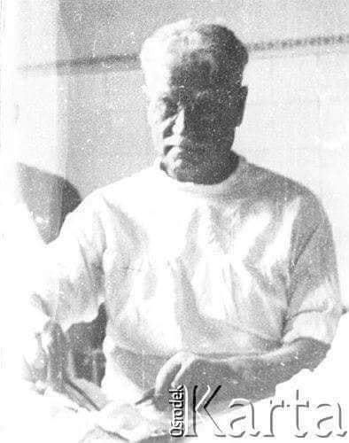

### 1944

Kilka słów o polskim personelu medycznym ratującym życie żołnierzy pod Monte Cassino.

Melchior Wańkowicz - Monte Cassino
(Fragment książki)

,,Teraz pracujemy z Polakami. Jest wielce zabawne czasem, jak się próbujemy porozumieć. Mimo to są bardzo pomocni i nic nie jest dla nich trudnością. Wierz mi, że oni wkładają serce i duszę w swą pracę i są przejęci myślą o walce wspólnie z angielskimi chłopakami. Oni mieli dwie sekcje chirurgiczne, wielu z nich zginęło i to jest powodem, że jesteśmy z nimi razem.''

Korpus Polski bijący się o Monte Cassino miał na każdym szczeblu sanitarnym od GPO w górę oficera transfuzyjnego. Korpus miał dwie czołówki transfuzyjne, rozporządzające składnicami-chłodnicami. Krew w butelce jest dobra tylko przez 3 tygodnie. Co dzień przed punktami pobierającymi krew w dalekiej mglistej Anglii stoją kolejki brytyjskich dziewcząt bezinteresownie oddających swoją krew. Co dzień z angielskiego Blood Bank we Włoszech przyjeżdżał do polskich czołówek transfuzyjnych łazik, z termosem zawierającym butelki ,,Bristol''.

Nieprzyjaciel bezzwłocznie pokwitował wysunięcie do przodu głównego punktu opatrunkowego - przed trzema dniami na tym posterunku GPO polegli lekarze Grabner, Napora, ksiądz Huczyński i sanitariusz, ranni byli lekarze Mozes, Mazanowski i Pancer - i kilkunastu sanitariuszy. Nie dał się zachwiać pułkownik Dietrich - odciągnął GPO o parę stajań - tu w ten wąwozik i kazał mu zostać. Przed akcją naczelny chirurg Korpusu - generał Szarecki - sam przyjechał i stanął do pracy na tym najbardziej wysuniętym posterunku operacyjnym. Znowu spotykam doktora Rymkiewicza, znowu krew na lekarzach - mówi mi, że doktor Szarecki, liczący 70 lat, stoi już całą noc przy stole operacyjnym ( stał tak i cały dzień i całą noc następną). Przy GPO z powodu jego masakry, pracuje dodana czołówka operacyjna angielska. Na stole operacyjnym strzelec Kaca, twardy Ślązak z 15. baonu. Ręka poszarpana, kość strzaskana - leży na stole bez narkozy, pali papierosa w czasie operacji. Doktor Szarecki operuje.

Foto: doktor generał Bolesław Szarecki

  

---

<a href="https://github.com/TomaszWaszczyk/historia.waszczyk.com/edit/master/src/content/may-19.md" target="_blank">Edytuj tę stronę dzieląc się własnymi notatkami!</a>
