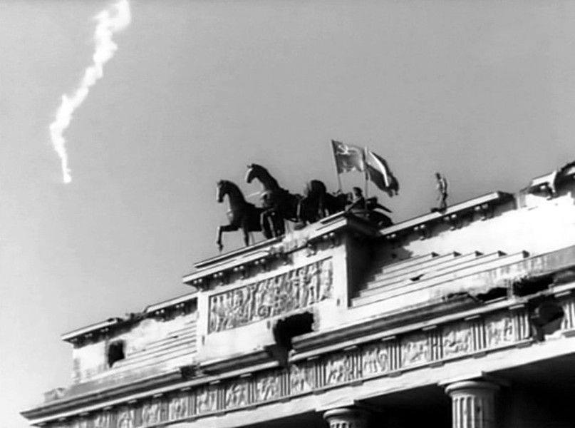

### 2022

  

  

---

Wicekanclerz przedstawia "gorzką prawdę" Niemcom. Trzeba będzie zaciskać pasa

Ceny będą rosły, a państwo nie będzie mogło zawsze pomagać, na przykład refundując podwyżki energii – powiedział wicekanclerz Niemiec na spotkaniu z małymi i średnimi przedsiębiorcami.

– Będziemy musieli nadal oczekiwać wyższych cen – stwierdził Robert Habeck, wicekanclerz Niemiec oraz szef resortu finansów. – Taka jest gorzka i twarda prawda – podkreślił.

Jak zaznaczył, nie tylko inflacja sprawia, że perspektywy dla niemieckiej gospodarki są coraz gorsze. – Problemy piętrzą się jeden na drugim – przyznał, wspominając o przerwanych łańcuchach dostaw, ale i o braku wystarczającej liczby pracowników. Do tego dochodzi jeszcze ciągnąca się pandemia COVID-19. – Wszystkie te kłopoty łączą się ze sobą. I niestety łączą się w bardzo niedobry sposób – przyznał.

---

### 2020

Umiera Stefan Hambura

---

Polish state becoming authoritarian, top judge Gersdorf says

 
The outgoing head of Poland's Supreme Court says the nationalist ruling Law and Justice Party (PiS) is moving the country towards an authoritarian state.

Prof Malgorzata Gersdorf, retiring after a six-year term, was speaking to broadcaster TVN24.

Asked if Poland was an authoritarian state, she said "not yet I hope, but we're moving towards one fast".

She cited the party's determination to hold a presidential election next month by postal vote only.

The controversial election, expected to go ahead despite the coronavirus lockdown, sidelines the state electoral commission.

Mrs Gersdorf has defended the supreme court's independence and rebuffed accusations by the governing party and its ally President Andrzej Duda that Polish judges are a privileged and corrupt "caste" that protect their own interests, not the peoples'.

"I paid for defending judicial and judges' independence, becoming the target of both petty and brutal attacks. I wasn't prepared," Mrs Gersdorf wrote in a farewell letter to her colleagues.

With the country under lockdown, Mrs Gersdorf did not convene a general assembly of the court to nominate her successor.

President Duda on Thursday appointed Kamil Zaradkiewicz, a former Justice Ministry official during the previous PiS government, as her interim successor to organise that process.

Judge Zaradkiewicz was appointed to the Supreme Court in 2018 by President Duda.

"In my opinion, Professor Gersdorf gave up. I think she and the others are tired of having to deal with this constantly for four years," Patryk Wachowiec, legal analyst for the Civil Development Forum think tank told the BBC.

On Wednesday, the European Commission launched the latest in a string of legal challenges against the government's judicial reforms.

With Mrs Gersdorf's departure and the retirement of four other judges, critics of the reforms say the governing camp will move swiftly to politically capture the Supreme Court, just as they say it has already packed the Constitutional Tribunal and the body that appoints judges - the National Council of the Judiciary - with loyalists.

PiS justifies its wide-ranging changes by citing opinion polls that show Poles are frustrated with the judicial system's slowness and complexity, with trials regularly dragging on for months. However, there is no evidence the procedures are more efficient now after four years of reform.

The governing camp denies the reform has eroded judicial independence and the rule of law, arguing that the courts are more democratic because they are now better equipped to defend citizens' interests. The European Commission, the OSCE international security body, the Council of Europe, and legal associations from the US, the UK and across Europe disagree.

The European Commission says new legislation broadens the disciplinary measures that can be taken against judges and can be used as "a system of political control of the content of judicial decisions".

Mr Wachowiec is pessimistic about the future of the Supreme Court's independence partly because of the European Commission's lack of decisive action.

"Acting always too late and trying to engage in debate in the face of blatant violations of the rule of law, the 'new' Supreme Court will eventually share the fate of its counterpart, the Constitutional Tribunal - loyal to the government, hostile to the public and not impartial," he said.

<!-- Telefon do Smoka (vide 2 lutego) zapytać czy robi coś ciekawego.. -->

---

### Deutsche Bank : Cost of negative interest rates to German households

For many, the nominal interest rate is an easy indicator to grasp and they use it to make comparisons over time and across countries. However, inflation-adjustedrates are a more accurate indicator to identify the real returns and the impact of negative rates on household portfolios.

Cash and deposits account for 40% of Germans' financial assets. In Q1 2019, real returns on these stood at -1.2%.Claims on insurance schemes accounted for 37% of the total financial assets, with real returns of 1% in 2019, down from 3% in 2014.

Germans lost around EUR 150 in real terms in 2019 per person due to negative rates on their cash and deposits, compared to the 1991-2014 average. The aggregate loss including claims on insurance for a representative household was roughly EUR 540 per year. The perception that negative rates punish German savers is therefore not unfounded but actually not that unusual when looking at real rates. The richest 10% of Germans hold 60% of the financial wealth (alt- hough deposits and life insurances make up a smaller share of their portfolios) and probably have significantly higher losses.

Bank lending and deposits of households in Q4 2019

In 2019, net lending to private households in Germany reached a new record of EUR 59.5 bn (+4.8% yoy). Mortgages saw a record increase of EUR 53 bn (5.3% yoy). In Q4, new mortgages of EUR 15.4 bn accounted for almost the entire credit growth. At EUR 6.8 bn (3.9% yoy) in 2019 as a whole, consumer lending lagged significantly behind the previous three years and slumped to EUR 46 m in Q4.

Deposits rose by EUR 41.1 bn in the seasonally strong final quarter. In the full year 2019, private households added a net amount of EUR 111 bn to their bank accounts, a bit more than in the previous years. However, the annual growth rate fell slightly to 5.0% on account of base effects.

In 2020, mortgage growth is likely to slump, even stagnate. The driving forces of excess demand and low interest rates should continue to support the market. But the corona virus pandemic causes significant uncertainty and will probably lead to a reduction in household income and possibly to bottlenecks in the issuance of building permits.

Cost of negative interest rates to German households

### 1952

Wprowadzono reglamentację mydła, proszków do prania, cukru i cukierków.
Władze wprowadzony system reglamentacji
uznały jednak za niewydolny. Dodatkowo jego
mechanizm, który wyłączał z systemu
przydziału kartek znaczną część ludności,
zamiast uspokajać nastroje społeczne –
przyczyniał się do ich zaogniania.
Zlikwidowano ją więc 3 stycznia 1953 roku
Rezygnacji z kartek towarzyszyły jednak
znaczne podwyżki cen. Wspomniana wyżej
decyzja zamykała na ponad 23 lata sprawę
reglamentacji artykułów powszechnego
użytku.

  

### 1945

Kapitan Antoni Jabłoński, będący jednym z polskich żołnierzy, szturmujących stolicę III Rzeszy, wywiesił naszą flagę na Kolumnie Zwycięstwa w Berlinie.

W latach PRL właśnie w tym dniu zdejmowano po 1 maja flagi państwowe, aby nie były eksponowane w dniu zniesionego przez władze komunistyczne Święta Konstytucji 3 Maja.

Kilka wspomnień Antoniego Jabłońskiego:

"Dotarliśmy do niej w nocy, do świtu siedzieliśmy pod schodami wewnątrz Kolumny, kryjąc się przed ostrzałem. Dopiero rano weszliśmy na górę, zobaczyliśmy, że Niemcy składają broń, i nasz dowódca zadecydował, że musimy wywiesić flagę.

Pytany, co polscy żołnierze robili 8 maja - w dniu, w którym hitlerowskiego Niemcy podpisały kapitulację, mówił, że "nie było żadnego świętowania". Byliśmy głodni, bo bardzo słabo tam karmili, a zaraz potem wsiedliśmy do pociągu i ruszyliśmy do Polski. Czułem ulgę, że już po wszystkim. Gdy wróciłem, nie chciałem już być wojskowym" - opowiadał.

Po wojnie kpt. Antoni Jabłoński był sprzedawcą i listonoszem. W swoich rodzinnych stronach był najbardziej rozpoznawalną osobą, często zapraszaną na lekcje historii do okolicznych szkół.

Zmarł w 2015 w wieku 97 lat.

  

  

Więcej

 
Operacja berlińska: Armia Czerwona wraz z oddziałami 1. Armii Wojska Polskiego zdobyła Berlin. Polacy zawiesili biało-czerwony sztandar na Kolumnie Zwycięstwa.

Ciężar walk pierwszych dni operacji berlińskiej spoczął na barkach żołnierzy 1. Frontu Białoruskiego i Ukraińskiego. Przełamanie trzech pasów obrony miasta umożliwiłoby rozwinięcie natarcia w celu okrążenia stolicy. Już 20 kwietnia oddziały 1. Frontu Białoruskiego włamały się w zewnętrzny obwód obrony Berlina. Nazajutrz przełamany został już wewnętrzny obwód. 79. korpusowi 3. armii uderzeniowej udało się nawiązać walki o północno-wschodnią część miasta. 22 kwietnia wszystkie oddziały 1. Frontu Białoruskiego osiągnęły wewnętrzny obwód obrony, natomiast 1. Front Ukraiński rozpoczął działania w kierunku kanału Teltow. Być może obrona niemiecka miałaby większe szanse powodzenia, gdyby nie rozbieżność zdań pomiędzy dowódcami frontowymi a Adolfem Hitlerem. Konflikt, wynikający z niezachwianej pewności führera o jego własnej nieomylności, znacznie wypłynął na sukcesywność działań. Obłędne decyzje nie pozostawiały najmniejszych wątpliwości, iż Hitler był już wtedy wrakiem człowieka. Zaczęło to dostrzegać jego najbliższe otoczenie. Hermann Göring zdecydował się 20 kwietnia na ucieczkę z Berlina, Heinrich Himmler i Joachim von Ribbentrop starali się oczyścić z wcześniejszych win, nawiązując rozmowy z aliantami zachodnimi na temat separatystycznego pokoju. Jedynie Joseph Goebbels namawiał Hitlera do pozostania w Berlinie, trwając przy nim do końca. Była to jedna wielka gra pomiędzy tymi, którzy stanowili kiedyś o sile III Rzeszy. Gra o przetrwanie, o możliwość walki do końca i zapewnienie sobie "ułaskawienia" po zakończeniu zmagań wojennych. Rozbieżności zauważalne były przede wszystkim w poglądach wyższych dowódców, którzy nie uważali upadku Berlina za koniec wojny i Hitlera, twierdzącego, iż utrata miasta definitywnie przekreśla szanse dalszego oporu. Gen. Heinrici, dowódca Grupy Armii "Wisła", uważał za sprawę priorytetową ratowanie sił 9. armii. Dążył do odpuszczenia stolicy Armii Czerwonej i utworzenia nowego frontu, co mogło przedłużyć wojnę i umożliwić efektywniejszą obronę. Hitler kazał jednak bronić miasta do ostatniego żołnierza, bez względu na straty. Dla samego Heinriciego nieomal skończyło się to tragicznie, bowiem Hitler zwolnił go 28 kwietnia i tylko zdrowy rozsądek generała uratował go od śmierci. Nie udał się bowiem do niemieckiego wodza, aby interweniować. Gdyby zdecydował się na taki krok, z pewnością zostałby rozstrzelany. 22 kwietnia przez radio Goebbels wezwał berlińczyków do wszelkiej możliwej pomocy, jaką mogliby nieść wojsku. Tego samego dnia Hitler zaakceptował plan obrony stolicy, nakazując otoczonym oddziałom 9. armii wyjście z okrążenia i spotkanie z 12. armią gen. Wencka. Po połączeniu obie armie zaatakować miały tyły 1. Frontu Ukraińskiego. W nocy z 22 na 23 kwietnia również radzieckie dowództwo podjęło generalne decyzje strategiczne. Zdecydowano się na zlikwidowanie zgrupowania frankfurcko-gubińskiego siłami 1. Frontu Ukraińskiego i 1. Frontu Białoruskiego. W dniach 24-25 kwietnia marszałkowie Gieorgij Żukow i Iwan Koniew odnieśli pełny sukces, okrążając dwa niemieckie zgrupowania, z których każde liczyło po 200 tys. ludzi. 26 kwietnia w Torgau nad Łabą doszło do spotkania wojsk radzieckich i amerykańskich. Oddziały 5. armii z 1. Frontu Ukraińskiego nawiązały kontakt z 1. armią. Dzięki temu siły III Rzeszy zostały podzielone na dwie części, tworząc również dwa fronty - północny i południowy. Tymczasem zacięte walki rozpoczął 2. Front Białoruski. Żołnierze marsz. Konstantego Rokossowskiego ruszyli do natarcia o świcie 20 kwietnia po godzinnym przygotowaniu artyleryjskim. Ze względu na złą pogodę znacznie ograniczono działanie lotnictwa, co utrudniło wykonanie zadań postawionych przez dowództwo. Udało się uchwycić szereg przyczółków na zachodnim brzegu rzeki, jednak Niemcy bronili się niezwykle zaciekle. Do 25 kwietnia żołnierze 2. Frontu Białoruskiego przełamali obronę na całej długości od Szczecina do Schwedt, wiążąc w walce siły niemieckiej 3. Armii Pancernej. W wyniku natarcia udało się dotrzeć do linii obronnej na rzece Randow.

Okrążenie 4. APanc. i 9. armii umożliwiło Sowietom likwidację poważnych sił niemieckich. Zadaniem tym zajęły się 3., 69. i 33. armia 1. Frontu Białoruskiego oraz 28. i 3. armia 1. Frontu Ukraińskiego. Do całej akcji weszły również główne siły 2. ALot. 24 kwietnia Niemcy podjęli próbę wyjścia z okrążenia, lecz zakończyła się ona fiaskiem. Dwa dni później starali się wykonać podobny manewr, ale i tym razem górą była Armia Czerwona. W dniu 26 kwietnia radzieckie lotnictwo dokonało czterech nalotów, których celem było zgrupowanie wspomnianych wojsk wroga. Powoli następowała likwidacja okrążonych oddziałów, jednak zaangażowanie poważnych sił do niszczenia kotła znacznie opóźniłoby włączenie ich do walk o Berlin. Naczelne Dowództwo Niemieckie wydało rozkaz 9. armii, aby starała się połączyć z 12. armią. Do połączenia nie doszło, mimo iż część sił podjęła próbę przerwania pierścienia i wydostała się z okrążenia. 1 maja resztki 9 armii zostały rozbite, będąc ok. 4 km. na wschód od czołowych oddziałów gen. Wencka. Wobec niepowodzeń generał zdecydował się teraz na przyjście z pomocą oblężonemu Berlinowi. 28 kwietnia podjął uderzenie w kierunku Poczdamu, lecz zatrzymał go skuteczny opór żołnierzy 1. Frontu Ukraińskiego. Nawet gdyby podjęta próba zakończyła się sukcesem (zaledwie nieliczne oddziały dotarły do Poczdamu), na niewiele by się zdała. 29 kwietnia walki toczyły się już w centrum stolicy, a żołnierze radzieccy zdobywali budynki sektora nr 9 "Zitadelle". Od 25 kwietnia, od dnia, w którym zamknął się pierścień okalający Berlin, rozpoczął się okres walk ulicznych. Kolejne odcinki zostawały zdobyte, co umożliwiło zbliżenie do serca miasta (najważniejsze budynki rządowe, w tym Reichstag). Cały czas trwały naloty na miasto, szczególnie silne w miejscach, gdzie znajdowały się jednostki dowództwa i sztaby sił zbrojnych. 27 kwietnia został zdobyty Poczdam, co zamknęło możliwość przyjścia z pomocą Berlinowi od zachodu i południa. 30 kwietnia w godzinach popołudniowych 3. armia uderzeniowa zdobyła Reichstag. Niemalże w tym samym czasie Adolf Hitler popełnił samobójstwo. 2 maja Berlin skapitulował.

W pierwszych dniach maja oddziały 1. Frontu Białoruskiego i 1. Frontu Ukraińskiego, które nie brały udziału w walkach o miast, ścigały resztki 12. armii. Gen. Wenck dążył do dotarcia nad Łabę, gdzie mógłby poddać się Amerykanom. 7 maja wojska radzieckie wyszły nad Łabę. W tym samym czasie wojska 2. Frontu Białoruskiego opanowywały północną część kraju. 3 maja osiągnięto brzeg Morza Bałtyckiego, a nazajutrz wschodni brzeg Łaby. Nawiązano styczność z brytyjską 2. armią.

Według "Berlin 1945" Zdzisława Stąpora (strony 44, 45 i 46) w bitwie o Berlin brały udział następujące polskie związki operacyjne i taktyczne:

"1 i 2 armia WP, 1 korpus pancerny, 1 mieszany korpus lotniczy (od 23 kwietnia), 2 dywizja artylerii i 1 brygada moździerzy. Tworzyły one dwa zgrupowania uderzeniowe, których jedno działało w składzie 1 Frontu Białoruskiego (1 armia WP z 1 mieszanym korpusem lotniczym oraz 1 brygada moździerzy, wspierająca ogniem natarcie radzieckiej 47 armii). Drugie zgrupowanie uczestniczyło w operacji zaczepnej 1 Frontu Ukraińskiego (2 armia WP wzmocniona 1 KPanc, 2 DArt i 14 BAPanc). Główne ogniwa tych zgrupowań, tj. 1 i 2 armia WP, stanowiły pełnowartościowe związki operacyjne. W składzie 1 armii WP znajdowały się następujące jednostki bojowe:

1, 2, 3, 4 i 6 dywizje piechoty, 1 brygada kawalerii, 1 dywizja i 1 dywizjon artylerii przeciwlotniczej, 1 brygada artylerii armat, 2 i 3 brygady artylerii haubic, 4 brygada artylerii przeciwpancernej, 5 brygada artylerii ciężkiej, 1 pułk moździerzy, 5 dywizjon pomiarów artyleryjskich, 4 pułk czołgów ciężkich, 13 pułk i 7 dywizjon artylerii pancernej, 1 brygada i 7 batalion inżynieryjno-saperskie, 6 i 31 bataliony pontonowo-mostowe, 1 i 2 bataliony budowy dróg, 3 batalion budowy mostów, 2 batalion miotaczy ognia, 3 batalion obrony przeciwchemicznej, 1 pułk i 2 batalion łączności oraz pięć kompanii telefonicznych i telegraficznych, 1 mieszany korpus lotniczy (2 dywizja lotnictwa szturmowego i 3 dywizja lotnictwa myśliwskiego), 4 mieszana dywizja lotnicza, 13 pułk lotnictwa transportowego, 17 pułk i 103 eskadra lotnictwa łącznikowego.

Na czas operacji berlińskiej dowództwo 1 Frontu Białoruskiego wzmocniło 1 armię WP siłami 41 pułku artylerii rakietowej, a na okres forsowania Odry - 274 batalionem amfibii (90 samochodów pływających). 

2 armia WP miała na swoim składzie:
5, 7, 8, 9, 10 dywizje piechoty, 2 dywizje artylerii, 3 dywizję artylerii przeciwlotniczej, 9 i 14 brygady artylerii przeciwpancernej, 3 pułk moździerzy, 8 dywizjon pomiarów artyleryjskich, 1 korpus i 16 brygadę pancerne, 5 pułk czołgów ciężkich, 28 pułk artylerii pancernej, 4 brygadę inżynieryjno-saperską, 3 batalion obrony przeciwchemicznej, 4 pułk i 10 batalion łączności oraz trzy kompanie telefoniczne, 12 kompanię obserwacyjno-meldunkową i 3 eskadrę lotnictwa łącznikowego.

Ponadto 2 armia WP została wzmocniona przez dowódcę 1 Frontu Ukraińskiego siłami 98 pułku artylerii rakietowej oraz 105 i 108 batalionami pontonowo-mostowymi. 

Z analizy porównawczej sił i środków armii polskich wynika, że zgrupowanie wojsk 2 armii WP było silniejsze. Liczyło ono 89 822 żołnierzy, podczas gdy stan osobowy 1 armii WP (z jednostkami przydzielonymi) wynosił 78 556 żołnierzy. Stany bojowe w dywizjach 2 armii WP sięgały przeciętnie 90% stanu etatowego ludzi oraz prawie 100% uzbrojenia i sprzętu technicznego. W 1 armii WP stany wynosiły 70-75% w ludziach i 70-90% w sprzęcie. 2. armia WP miała ogółem ponad 1442 działa i moździerze (bez artylerii przeciwlotniczej) oraz 450 czołgów i dział pancernych (w tej liczbie 273 czołgi i działa pancerne 1 KPanc). Natomiast 1 armia WP miała 1147 dział i moździerzy, tylko 90 czołgów i dział pancernych, ale też 422 samoloty." 

1. armia WP gen. Popławskiego miała za cel sforsowanie Odry na odcinku Siekierki-Gozdowice. 2. armia WP gen. Świerczewskiego otrzymała zadanie sforsowania Nysy Łużyckiej. 2. armia uzyskała gotowość bojową w nocy z 15 na 16 kwietnia. W pierwszym etapie operacji berlińskiej 1. armia wykonała początkowe założenia, przekraczając Odrę we wspomnianym rejonie. W dniach 16-17 kwietnia złe warunki atmosferyczne praktycznie uniemożliwiły działania polskiego lotnictwa. Dopiero nazajutrz samoloty mogły wejść do walki. Przez trzy dni trwały zacięte boje i 19 kwietnia Polacy uwieńczyli je sukcesem. 2. DP przekroczyła Starą Odrę i ok. 23.00 opanowała Neugaul. Pierwszy etap działań zakończył się sporym sukcesem. Z kolei 2. armii WP przyszło w udziale forsowanie Nysy Łużyckiej. |W ciągu trzech dni polskim żołnierzom udało się przełamać niemiecką obronę na głównym pasie i wedrzeć się w drugi z nich. 18 kwietnia 2. armia została zaatakowana od południa przez odwody Grupy Armii "Środek". Udało się jednak odeprzeć natarcie. W drugiej fazie operacji 1. armia miała za cel osłanianie od północy sił 1. Frontu Białoruskiego, które uderzyły na Berlin. Z zadania tego polscy żołnierze wywiązali się znakomicie, wspomagani dodatkowo przez 61. armię. Razem z Sowietami rozpoczęli oni okrążenie miasta od północy. Żołnierze gen. Świerczewskiego początkowo uderzali na kierunku drezdeńskim. Od 22 kwietnia 2 armia WP zatrzymywała uderzenia Grupy Armii "Środek", pomagając i umożliwiając wyjście sił 1. Frontu Ukraińskiego nad Łabę. Ostatnim etapem operacji była bitwa o samo miasto, tocząca się na ulicach Berlina. Polacy odegrali dużą rolę w całym przedsięwzięciu, pokazując waleczność i męstwo, jakie towarzyszyło im od początku II wojny światowej. Obok flagi radzieckiej jedynie polska powiewała nad zgliszczami Berlina. 1. armia WP nie tylko uczestniczyła w walkach ulicznych. Zadaniem Polaków było również osłanianie sił 1. Frontu Białoruskiego oraz odparcie sił gen. Steinera, który starał się przynieść pomoc walczącemu miastu. 2. armia wraz z oddziałami 1. Frontu Ukraińskiego stawiała czoła Grupie Armii "Środek", której dowództwo zdecydowało się na przeciwuderzenie w ostatniej fazie operacji berlińskiej. Po zdobyciu stolicy III Rzeszy, 4 maja, gen. Świerczewski otrzymał dyrektywę o włączeniu 2. armii WP do sił, mających uczestniczyć w operacji praskiej. 

### 1921

Rozpoczęło się III powstanie śląskie-ostatni zbrojny zryw ludności polskiej na Śląsku.
Na jego czele stanął śląski działacz społeczny i były komisarz plebiscytowy Wojciech Korfanty, który tak oto mówił w odezwie do rodaków opublikowanej 3 maja 1921 roku:
" Zwycięstwo osiągniemy za wszelką cenę i nie ma takiego mocarza na świecie, który by mógł nas okuć ponownie w kajdany germańskie".
Walki trwały dwa miesiące - powstańcy zdołali opanować prawie cały obszar plebiscytowy, później broniąc go przed siłami niemieckimi. Najpoważniejsze starcia miały miejsce w okolicach Góry św. Anny. W III powstaniu śląskim wzięło udział około 60 tys. Polaków -1218 spośród nich poległo, 794 odniosło rany.
W wyniku tego zrywu Rada Ambasadorów zdecydowała o korzystniejszym dla Polski podziale Śląska. Z obszaru plebiscytowego, czyli ponad 11 tys. km kw., zamieszkanego przez ponad 2 mln ludzi, do Polski przyłączono 29 procent terenu i 46 procent ludności. W Polsce znalazły się m.in. Katowice, Świętochłowice, Królewska Huta (obecny Chorzów), Rybnik, Lubliniec, Tarnowskie Góry i Pszczyna. Podział był też korzystny dla Polski gospodarczo - na przyłączonym terenie znajdowały się 53 z 67 istniejących kopalni, 22 z 37 wielkich pieców oraz 9 z 14 stalowni.
Cud nad Wisłą uratował Polskę od zguby, cud nad Odrą dał Polsce Śląsk. Cudu nad Wisłą i cudu nad Odrą nie stworzył żaden dyktator, żaden mocarz, który wziął odpowiedzialność za losy narodu, ale duch narodu, jego solidarność narodowa, duch obywatelski i poczucie odpowiedzialności każdego obywatela - oceniał Korfanty efekty powstań.

  

### 1860

https://pl.wikipedia.org/wiki/Theodor_Herzl

---

<a href="https://github.com/TomaszWaszczyk/historia.waszczyk.com/edit/master/src/content/may-2.md" target="_blank">Edytuj tę stronę dzieląc się własnymi notatkami!</a>
