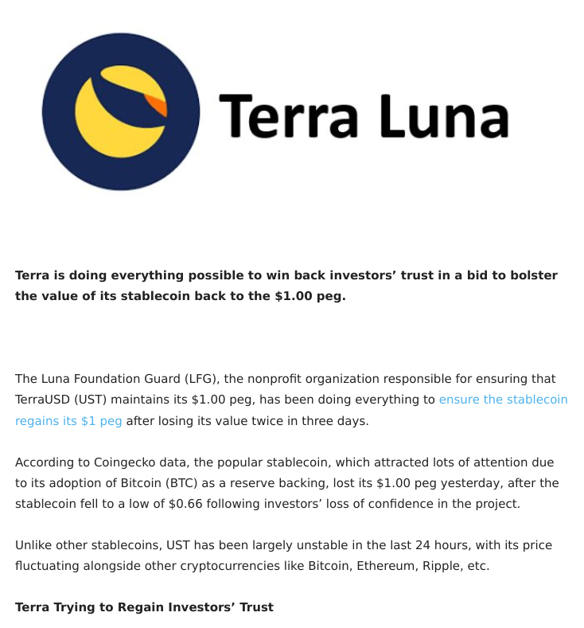
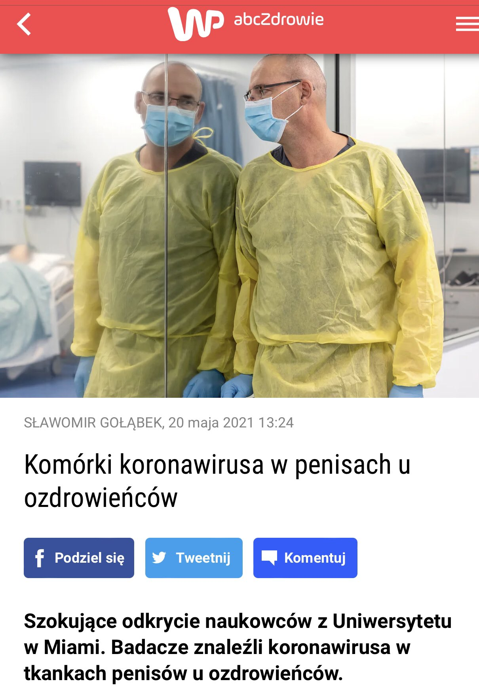
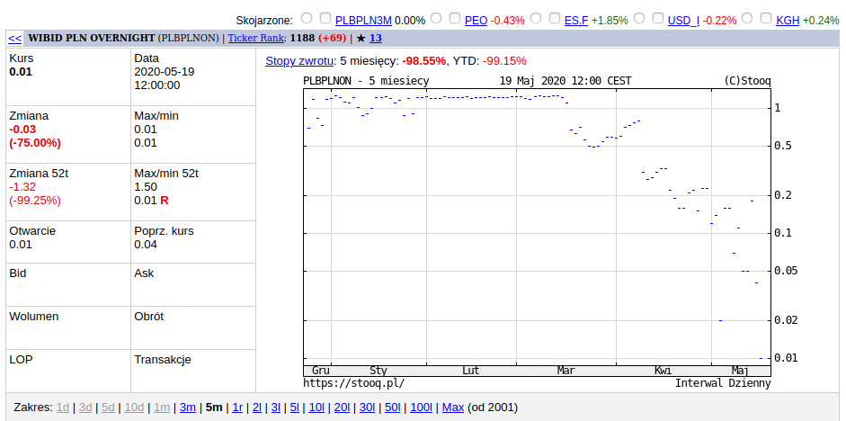
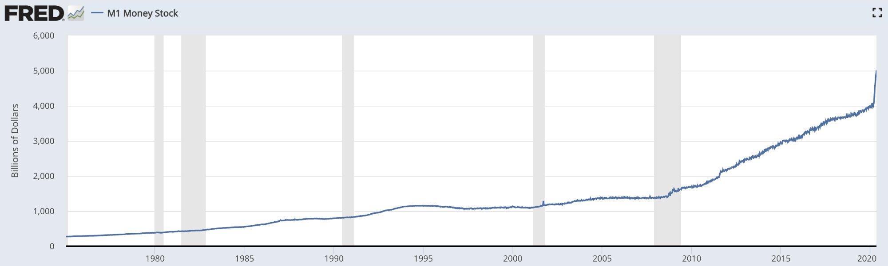
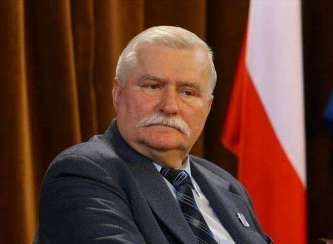
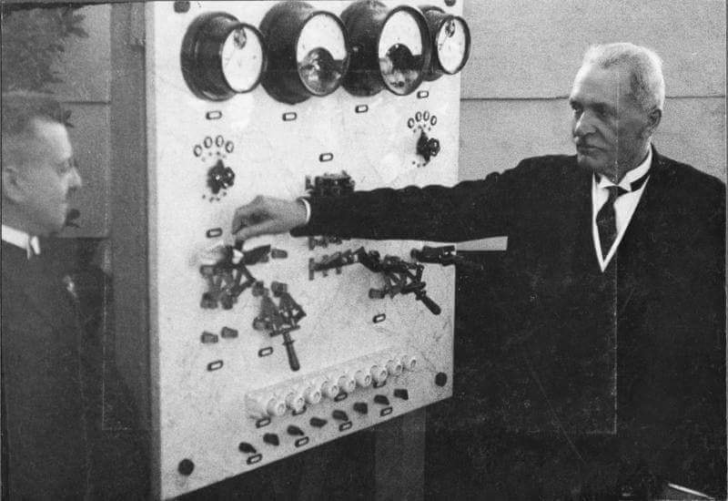

### 2022

  

### 2021

  

### 2020

WIBID Over Night = 0,01%

Wyglada jakby banki miały nadmiar gotówki, która parzy w ręce.

Zastanawiające!

  

Mamy fatalną politykę monetarną (m. in. kreacja sztucznego pieniądza i zaniżanie stóp proc.), obciążenia fikalne kurczącego się sektora prywatnego, ogromne wydatki państwa, dług publiczny, ograniczenia i problemy regulacyjno - administracyjne, a do tego obłąkańczą redystrybucję.

---

<video width="640" height="480" controls loop>
  <source src="./movies/may/brrr.mp4" type="video/mp4">
Your browser does not support the video tag.
</video>

  

### 1991

Lech Wałęsa, jako pierwszy prezydent w historii Polski, złożył wizytę w Izraelu.
Przemawiając w Knesecie prezydent , w imieniu całego narodu polskiego prosił o wybaczenie krzywd jakich doznali Żydzi na ziemiach polskich. Podczas wizyty została podpisana umowa o współpracy kulturalnej, naukowej i oświatowej, a także umowa o wymianie młodzieży. W 1991 roku została podpisana umowa o komunikacji lotniczej, a w roku następnym o współpracy gospodarczej i naukowo-technicznej w dziedzinie rolnictwa i przemysłu spożywczego. Została również powołana komisja ds. podręczników. Przy prezydencie Polski powstała też Rada ds. Stosunków Polsko-Żydowskich.
Ciekawie do wystąpienia Lecha Wałęsy w Knesecie odniósł się Jan Karski w wywiadzie dla Tygodnika Powszechnego. Na pytanie Jerzego Korczaka ,,Co sądzi Pan o wizycie Lecha Wałęsy w Izraelu, a zwłaszcza o jego słynnym już "prosimy o wybaczenie", które wzbudziło w kraju tyle emocji, i o zarzutach, jakie pod adresem polskiego społeczeństwa wysunął premier Szamir?'' - Jan Karski odpowiedział : ,,Było to bardzo mądre ze strony prezydenta Wałęsy, że zwrócił się do światowej społeczności żydowskiej. Kiedy był w Waszyngtonie, odwiedził The Holocaust Memorial Council. Ja tam też wtedy byłem. Przywódcy żydowscy przedstawili mnie Wałęsie. Wygłosił bardzo ładne przemówienie o konieczności współpracy polsko-żydowskiej, o tragedii Zagłady, której świat nie powinien zapomnieć... To jest bardzo mądre z jego strony. Pojechał do Izraela. Bardzo mądrze. To, że Izrael go zaprosił, to też duża mądrość, gest szlachetny... My wchodzimy teraz także w diasporę Mamy dwanaście milionów Polaków, którzy żyją poza granicami, czyli jedna trzecia narodu już jest w diasporze. Uczmy się od Żydów, z ich doświadczeń. Ale to można tylko robić, okazując dobrą wolę... Ja słyszałem, ludzie mi mówili, że Wałęsa nieostrożnie powiedział, że prosimy o wybaczenie. No, a co przebaczać? Nie spodziewa się Pan chyba, że ja siedzę w sumieniu prezydenta Wałęsy? Powiedział to, co uważał za stosowne. Co do Szamira: on nie po raz pierwszy mówi rzeczy niesłuszne o Polakach. On kiedyś powiedział także, że każdy Polak wysysa z mlekiem matki antysemityzm. No, głupstwa. Jak tak można mówić. Begin też od czasu do czasu mówił podobne głupstwa, ale trzeba zrozumieć, że Żydzi wciąż żyją jakby z otwartą raną. Nie chcą, żeby ta rana się zagoiła. A ta rana, to wspomnienie Holocaustu. Żydzi wymagają, żądają, aby świat znał i uznał jedyność, wyjątkowość Holocaustu. Bo przecież czegoś podobnego w historii świata nie było. I w tym ja się z Żydami zgadzam. Holocaust nie był porównywalny z cierpieniami żadnego innego narodu. My Polacy cierpieliśmy, ponosiliśmy ogromne ofiary, ale przecież właściwie wszyscy Żydzi zginęli.
Powtarzam raz jeszcze: tragedia Żydów jest nieporównywalna, czegoś podobnego nie było w historii ludzkości. Jeżeli więc ktokolwiek powiada, że za mało o tym powiedzieliśmy, że cokolwiek ma sugerować, że straty Żydów są zaniżane, to ja zawsze będę podkreślał niepowtarzalność tej tragedii. Nie można mówić, że Żydzi ginęli i my Polacy także ginęliśmy. To jest nieprawda, bo to jest nieporównywalne. Natomiast ja staram się mówić do społeczności żydowskiej, podkreślam stale, przy każdej okazji, że mało który naród może tak wiele mówić o cierpieniu, co naród polski. Dobrze wiemy, co znaczą przegrane wojny, przegrane rewolucje i powstania, my ciągle przegrywamy, ciągle nas męczą, burzą nam miasta, burzą nam kościoły, trzymają naród w zacofaniu, my naprawdę wiemy, co to jest cierpienie. Ale my także musimy wiedzieć, że Holocaust jest nieporównywalny. O tym zapomnieć nie wolno. Ja cokolwiek będę robił, cokolwiek robię, staram się przyłożyć swoją cegiełkę, aby inni o tym nie zapomnieli.''

  

### 1922

Z inicjatywy profesora Ignacego Mościckiego powstał Instytut Chemii Przemysłowej we Lwowie. Była to pierwsza w Polsce placówka naukowa związana z przemysłem chemicznym. Instytut figurował pod nazwą Chemiczny Instytut Badawczy (w skrócie ChIB). W 1926 roku, siedziba Instytutu została przeniesiona do Warszawy.
Na zdjęciu profesor Ignacy Mościcki podczas uruchamiania aparatury półfabrycznej do wyrobu glinu z glin krajowych.
Z lewej dyrektor Martynowicz.

  

### 1960

Poniżej przedstawiam fragment raportu Instytutu Meteorologii i Gospodarki Wodnej opisujący zjawisko trąby powietrznej, które miało miejsce 20 maja 1960 roku na terenie ówczesnych województw rzeszowskiego i lubelskiego.
" Strefa zniszczeń, wyraźnie zaznaczona, ciągnęła się wąskim pasem (najczęściej 100 - 300 m szerokości) od wsi Niechórz, gdzie wystąpiły poważne zniszczenia (wieś położona wzdłuż wąskiej doliny) przez Rzeszów do Tomaszowa. Natężenie zniszczeń nie było jednakowe w całym tym pasie. W jednych miejscowościach zniszczeniu uległy całe wsie, w innych tylko pojedyncze domy. Powalone zostały setki hektarów lasu (Nadl. Ruda Różaniecka - 100 ha). O sile wiatru świadczą powyrywane z ziemi wraz z betonowymi podporami dwa słupy wysokiego napięcia. W wielu miejscach widać wyraźne ślady działania trąby powietrznej (skręcone drzewa, efekty ssania itp.)"
Kolejny tekst to bardzo obrazowy opis tego, co miało miejsce.
" We wsi Gorliczyna w powiecie przeworskim wichura łamie przydrożne drzewa. Za jednym z nich szuka schronienia mieszkaniec wsi. Ginie od uderzenia złamanym jak zapałka pniem.
Huragan zaskakuje w ruchu pociąg między
Dynowem i Przeworskiem . Maszynista nie przejmuje się ciemnościami i wichurą. Jedzie dalej. To błąd. Huragan przewraca ostatnie pięć wagonów. Ginie ośmioletnia dziewczynka, 20 pasażerów jest rannych.
Pod Rzeszowem wichura zrywa dach z wagonu pociągu osobowego. Struchleli pasażerowie siedzą w strugach gwałtownego deszczu. Jakimś cudem nikt nie został poważnie poraniony.
Największych zniszczeń dokonuje huragan w miejscowości Uhlówek. Niemal 300 domów idzie w gruzy. Pod uderzeniami wichury zawalają się budynki szkoły, prezydium Gminnej Rady Narodowej i magazyn Gminnej Spółdzielni.
W Rzeszowie władze miejskie usiłują wezwać pomoc z Warszawy. Bezskutecznie. Zerwane są wszelkie połączenia telefoniczne i linie energetyczne. Karetki z trudem, powoli, krążą po ulicach zasłanych odłamkami dachówek i tynków.
Wieczorem z rzeszowskiego garnizonu wyjeżdżają pododdziały żołnierzy z wojskowymi namiotami i kuchniami polowymi. Mają jak najprędzej dotrzeć do najbardziej zniszczonych wsi, rozbić namioty, nakarmić kartoflanką i przenocować bezdomnych."

### 1866

https://pl.wikipedia.org/wiki/Tadeusz_Rozwadowski

---

<a href="https://github.com/TomaszWaszczyk/historia.waszczyk.com/edit/master/src/content/may-20.md" target="_blank">Edytuj tę stronę dzieląc się własnymi notatkami!</a>
