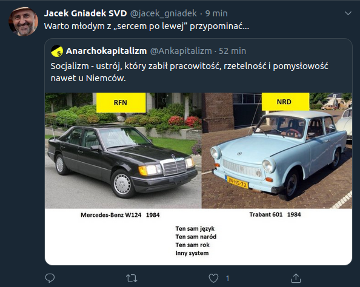
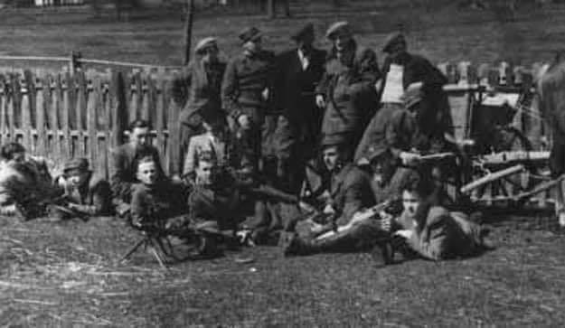

### 2020

  

### 1945

W Rudzie Różanieckiej zamojskie dowództwo zrzeszenia Wolność i Niezawisłość oraz przedstawiciele Ukraińskiej Powstańczej Armii podpisali porozumienie, które kończyło walki w tym rejonie. W rozmowach pośredniczyli katoliccy i prawosławni duchowni. Rozgraniczone zostały strefy wzajemnych wpływów, ustalone sposoby wzajemnego kontaktowania się oraz przekazywania informacji dotyczących działalności komunistów.
Na zdjęciu oddział AK-WiN z okręgu lubelskiego.

  

---

<a href="https://github.com/TomaszWaszczyk/historia.waszczyk.com/edit/master/src/content/may-21.md" target="_blank">Edytuj tę stronę dzieląc się własnymi notatkami!</a>
