### 2023

> Inflacja rozpędzona jak nigdy. Powrót do celu zajmie lata
> To jednak nie koniec. Jak pisaliśmy w money.pl, inflacja liczona rok do roku być może i się obniża, ale miesiąc w miesiąc konsekwentnie przyspiesza. I tak w marcu względem lutego tego roku wzrosła o ok. 1 proc. Nie jest więc tak, że ceny spadły. Po prostu wolniej rosły.
> Ekonomiści Santandera, wykorzystując własne autorskie wyliczenia, doszli do wniosku, że ceny w Polsce są niepokojąco rozpędzone i na razie nie widzą oni żadnego sygnału, że miałyby zwolnić. "Rozpęd cen nie słabnie" – podsumowują.

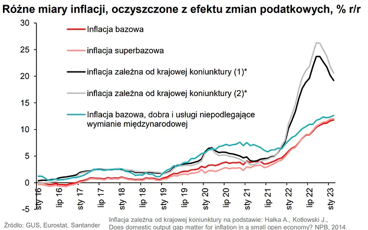  

> Walka z inflacją może trwać nawet 9 lat?
> Przez jak długi czas przyjdzie więc nam walczyć z inflacją w Polsce? Niestety, ekonomiści nie mają tutaj dobrych informacji. Nasze portfele mogą otrzymywać cios za ciosem jeszcze przez wiele lat. Tyle ma zająć Polsce powrót do celu inflacyjnego NBP. Najwięksi optymiści mówią o trzech latach cenowego bólu. Nie brakuje jednak innych głosów.

---

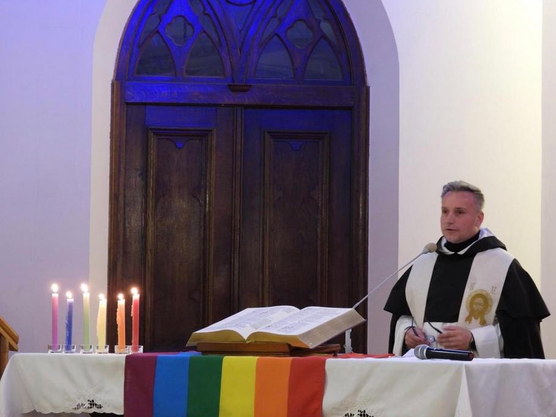  

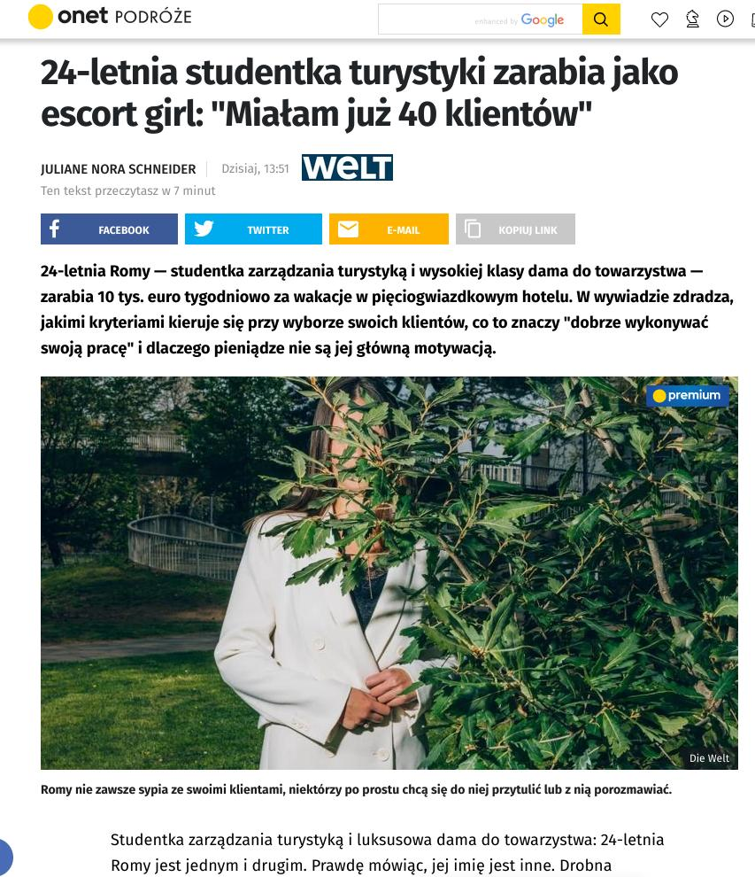  

---

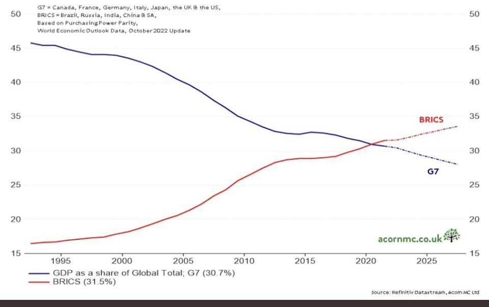  

---

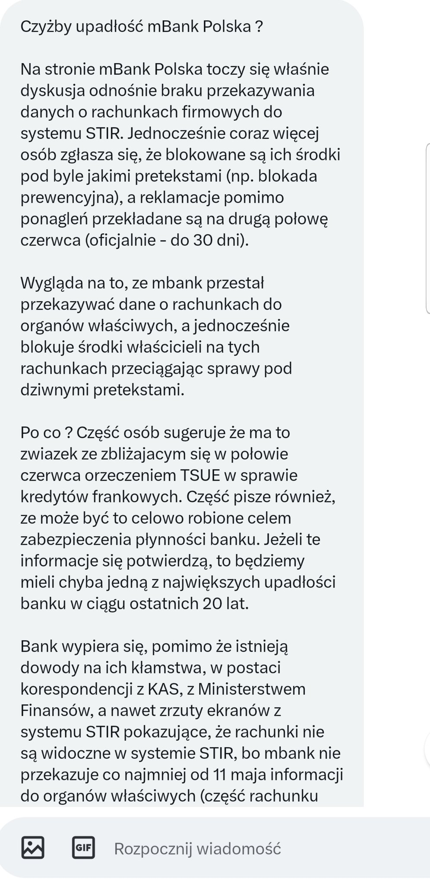  

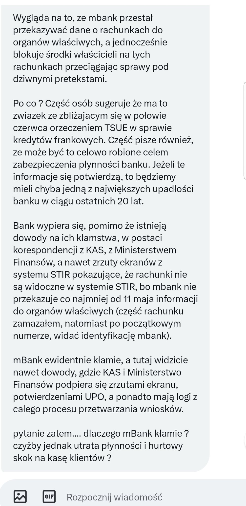  

---

<a href="./documents/may/bisbull73.pdf" target="_blank">Stablecoins versus tokenised deposits: implications for the singleness of money</a>

### 2022

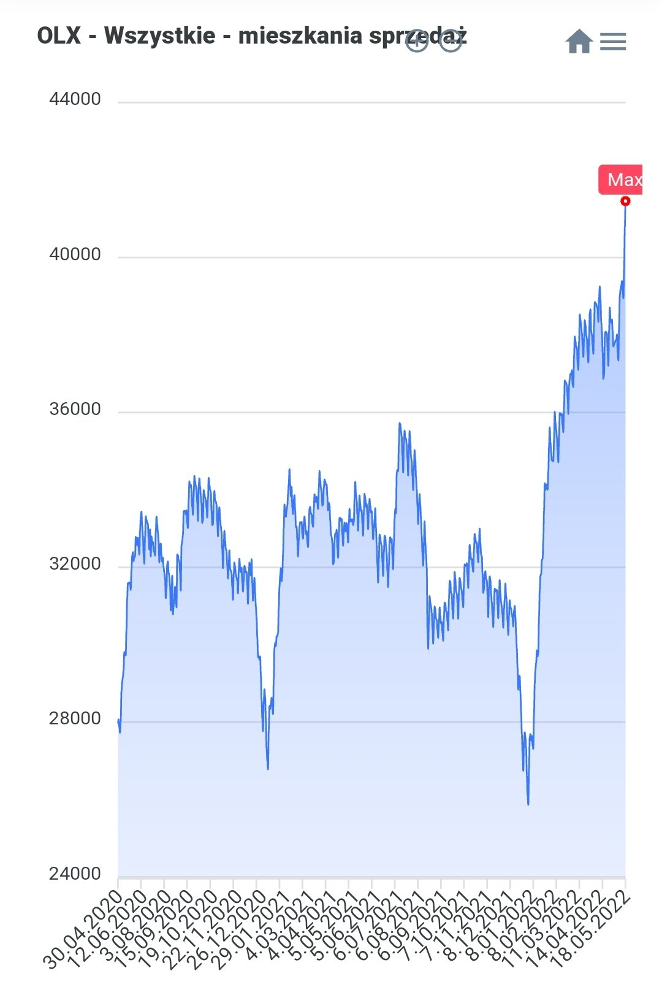  

### 2020

  

---

Charles Hoskinson
@IMOK_Charles
Bitcoin will be dead by 2023 replaced by a PoS coin with treasury governance model. Satoshi was brilliant by 2009 standards but that was 11 years. The sooner we realize this the better.

### 2018

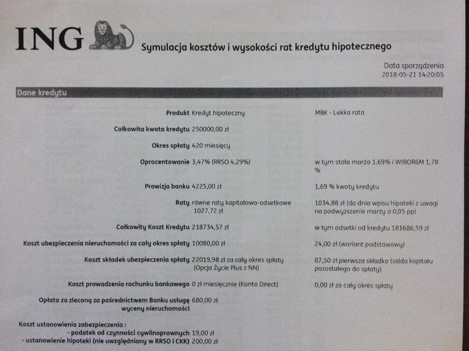  

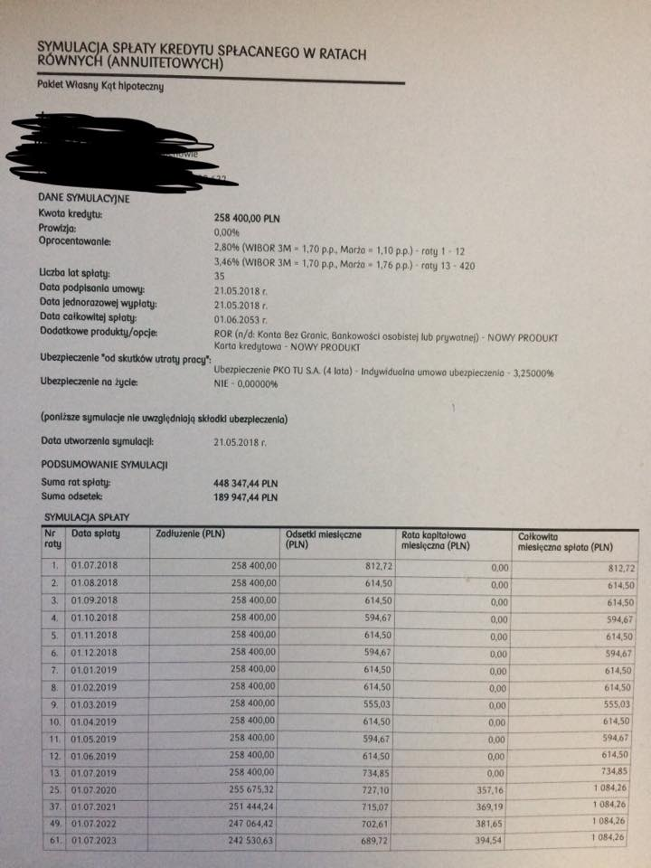  

### 1945

W Rudzie Różanieckiej zamojskie dowództwo zrzeszenia Wolność i Niezawisłość oraz przedstawiciele Ukraińskiej Powstańczej Armii podpisali porozumienie, które kończyło walki w tym rejonie. W rozmowach pośredniczyli katoliccy i prawosławni duchowni. Rozgraniczone zostały strefy wzajemnych wpływów, ustalone sposoby wzajemnego kontaktowania się oraz przekazywania informacji dotyczących działalności komunistów.
Na zdjęciu oddział AK-WiN z okręgu lubelskiego.

  

### 1926

Jak przed wojną wyglądała polityka prorodzinna?

W 1926 r. prezydent Mościcki wydał dekret, w myśl którego każdy siódmy chłopiec w rodzinie zostawał wpisany jako jego chrześniak. Chrześniacy prezydenta dostawali od państwa książeczkę oszczędnościową, a na niej 50 zł (równowartość połowy ówczesnej pensji nauczycielskiej) na 6 proc. Mieli też przywilej bezpłatnej nauki w kraju i za granicą, także na studiach wyższych, stypendium, bezpłatne przejazdy i opiekę zdrowotną. Ulgi na komunikację miało też rodzeństwo chrześniaka. Przed wojną było ich blisko 900. Dziś żyje około 300, a zrzeszają się w Stowarzyszeniu Chrześniaków Prezydenta II RP Ignacego Mościckiego.

### 1919

W Kielcach urodził się Gustaw Herling-Grudziński - pisarz, krytyk literacki, eseista, publicysta, tłumacz.
Kawaler Orderu Orła Białego. Autor książki ,,Inny Świat'', w której opisał swoje doświadczenia z pobytu w gułagu w Jercewie pod Archangielskiem w latach 1940–1942, łącząc w niej walory dokumentu z filozoficzno-moralistycznym uogólnieniem.

Pochodził ze spolonizowanej i bardzo patriotycznej rodziny żydowskiej. Był czwartym dzieckiem Józefa i Doroty z Bryczkowskich. Jego ojciec był właścicielem niewielkiego majątku w Skrzelczycach w okolicach Buska. Studiował 2 lata filologię polską na Uniwersytecie Warszawskim, pisał dla czasopism „Ateneum”, „Pion”, „Nowy Wyraz” oraz redagował tygodnik „Orka na Ugorze. 5 października 1939, założył wraz z kolegami jedną z pierwszych polskich organizacji konspiracyjnych Polską Ludową Akcję Niepodległościową (PLAN). Był jej szefem przez 2 miesiące. Wyjechał do Lwowa, gdzie czasowo korzystał z protekcji Marii Dąbrowskiej i Juliusza Kleinera, następnie udał się do Grodna i tam znalazł pracę w teatrzyku kukiełkowym. W marcu 1940 próbował przedostać się na Litwę. Został aresztowany przez NKWD,. Oskarżono go o szpiegostwo na rzecz Niemiec. Przebywał w więzieniach w Witebsku, Leningradzie i Wołogdzie, a następne został przewieziony do obozu pracy przymusowej w Jercewie koło Archangielska. Opuścił terytorium ZSRR wraz z Armią generała Władysława Andersa. Walczył pod Monte Casino jako radiotelegrafista 3 Dywizji Strzelców Karpackich. Został odznaczony Krzyżem Virtuti Militari. Po zakończeniu wojny przebywał na emigracji. Był współzałożycielem i początkowo współredaktor wydawanej wówczas w Rzymie "Kultury". Po przeniesieniu pisma osiadł w Londynie, a w 1952 r. przeniósł się do Włoch. Do 1988 roku jego dzieła były zakazane w Polsce. Ukazywały się nielicznie w przedrukach poza cenzurą. Był autorem szkiców literackich (Żywi i umarli), opowiadań (Wieża, Skrzydła ołtarza), refleksyjnego Dziennika pisanego nocą.
Był laureatem licznych nagród: paryskiej „Kultury” (1958), Fundacji im. A. Jurzykowskiego (1965)l, Fundacji im. Kościelskich (1967), francuskiego Pen Clubu (1985), polskiego Pen Clubu (1990), Premio Siracusa (1996). Został również odznaczony Orderem Orła Białego, czyli najwyższym odznaczeniem państwowym (1998).
Zmarł 4 czerwca 2000 roku w Neapolu, w wieku 81 lat.

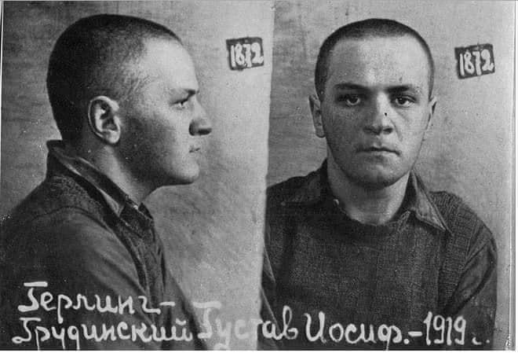  

### 1895

W Krynicy urodził się Nikifor Krynicki, właściwie Epifaniusz (Epifan) Drowniak - ,,Matejko z Krynicy'', samouk, zaliczany do grona najwybitniejszych na świecie malarzy naiwnych - prymitywistów.

Jego ojciec był Polakiem, według legendy - uznanym malarzem, kryptonimowanym jako "T", matką zaś była Jewdokia Drowniak, córka Hryhoria i Tatiany z domu Krynickiej ze wsi Poworoznyk. Jewdokia była nędzną żebraczką, która w krynickich pensjonatach wykonywała najpodlejsze roboty. Ze swym nieślubnym dzieckiem żyła w całkowitej izolacji. Kiedy szła do pracy zawiniątko z chłopcem zostawiała pod mostem.

Po matce, która wychowywała go samotnie, w wielkiej biedzie i poniewierce, najmując się do różnych prac gospodarskich, Nikifor odziedziczył wadę słuchu i wymowy. Osierocony podczas I wojny światowej, nie umiejący porozumieć się z otoczeniem, traktowany był początkowo przez krynicką społeczność jako odmieniec - izolowany fizycznie i psychicznie, wyśmiewany.
Kiedy po wielu latach (w latach 50.) etnograf Aleksander Jackowski zaprowadził Nikifora do laryngologa, okazało się, że miał on wrodzona wadę, przyrośnięty język, co istotnie utrudniało mówienie. W normalnych warunkach wystarczyłaby prosta interwencja chirurgiczna, jednak sytuacja w jakiej był Nikifor uniemożliwiała to.

Początkowo Nikifor prowadził tułacze życie, wędrując po wsiach i miasteczkach Galicji. Około 1915 roku zaczął malować obrazki, do czego wykorzystywał podarowane skrawki - na przykład austriackie druki urzędowe, zużyte zeszyty szkolne, opakowania po czekoladkach, papierosach, papier pakowy.
Najwcześniejsze zachowane prace Nikifora pochodzą sprzed 1920 roku. Jest wśród nich wiele takich, które uwidaczniają trud doskonalenia umiejętności przyszłego artysty.
Był barwną postacią. Swoją "przenośną pracownię" rozkładał codziennie w różnych punktach uzdrowiska, tak więc z widzenia znali go wszyscy mieszkańcy i kuracjusze. Większość prac zaopatrywał w inskrypcje, trudno zrozumiałe ze względu na swój analfabetyzm.
Od początku Drowniak przejawiał ogromną wolę dążenia do celu, jaki sobie wyznaczył - być malarzem, być Matejką z Krynicy. Czuł się zresztą krynickim patriotą lokalnym - dwukrotnie w ramach akcji "Wisła" wywożony w odległy koniec Polski, z uporem wracał do rodzinnego miasta.
Najchętniej malował akwarelą, czasami łączoną z temperą bądź farbą olejną, rzadziej - w ostatnich latach życia - używał kredek.

Dorobek Nikifora liczy kilkadziesiąt tysięcy prac. Najwybitniejsze - zdaniem znawców - pochodzą z lat 20.-30. Wtedy określił zarówno swoje zainteresowania ikonograficzne, jak i estetyczne.
Znaczną ilość swoich dzieł rozdał bądź sprzedał za przysłowiowe grosze, w latach największej biedy. Jego talent odkrył ukraiński malarz, Roman Turyn. Był on również pierwszym zbieraczem akwarelowych kompozycji Nikifora (kolekcja, którą zgromadził, obejmowała blisko dwieście prac). Będąc w Paryżu, w 1932 roku, pokazał je przebywającym tam członkom Komitetu Paryskiego, z którymi łączyła go przyjaźń. Kapiści byli zachwyceni. Próbowali doprowadzić do indywidualnej wystawy prac Nikifora w Paryżu, ale zamiar ten nie powiódł się. Część "obrazków" włączono jednak do zbiorowej ekspozycji malarzy lwowskich i przedstawicieli École de Paris, przygotowanej przez lwowskie Ukraińskie Muzeum Narodowe w 1932 roku.

Dopiero w latach 50., a zwłaszcza w 60. jego pozycja jako artysty zaczęła wzrastać (chociaż jeszcze z lat 50. zachował się ilustrowany list żebraczy, w którym malarz prosił o "kawałek płótna czy też jedzenie czy pieniądze" i oferował do sprzedaży swoje "obrazki", za które żądał, jak przejmująco pisał, "bardzo tanio, aby tylko żyć"). Stopniowo jednak osiągnął popularność, przede wszystkim dzięki powtórnemu odkryciu - przez małżeństwo Elę i Andrzeja Banachów.

Przełomowym momentem dla międzynarodowej kariery Nikifora stała się pierwsza indywidualna wystawa w galerii Diny Vierny w Paryżu, w kwietniu 1959 r. Dała ona początek wielu następnym ekspozycjom malarstwa Nikifora na całym świecie.
Najważniejsza w Polsce, retrospektywna wystawa twórczości Nikifora, miała miejsce w 1967 r. w warszawskiej "Zachęcie".
Wkrótce też został honorowym członkiem Związku Polskich Artystów Plastyków. Kuracjusze zaczęli chętnie kupować obrazki, dzięki czemu poprawiła się jego sytuacja materialna. Popularność, jaką się wtedy cieszył nie wpłynęła jednak w żaden sposób na zmianę jego stylu życia. Nikifor, dopóki starczyło mu sił, przemierzał codziennie Krynicę w drodze "do pracy" tak jak robił to niezmiennie przez całe swoje życie.

Oddanym, z czasem również prawnym opiekunem malarza, towarzyszącym mu od początku lat 60. w codziennym życiu, stał się Marian Włosiński - również malarz, który jednak poświęcił swoją twórczość, podobnie jak swoje życie, Nikiforowi, gdyż uważał go za geniusza.

Dzieje tej niezwykłej przyjaźni opowiada film fabularny „Mój Nikifor” Krzysztofa Krauzego (rolę Nikifora zagrała w nim Krystyna Feldman). Premiera filmu w 2004 roku przyczyniła się do ponownego, wzrostu zainteresowania krynickim samoukiem, a co za tym idzie - spowodowała kilka wystaw oraz wznowienie niektórych publikacji dotyczących jego i jego sztuki.

Artysta zmarł 10.10. 1968 roku w sanatorium w Foluszu k. Jasła. Pochowany został na cmentarzu w Krynicy.

Piśmiennictwo: folusz.dps.pl

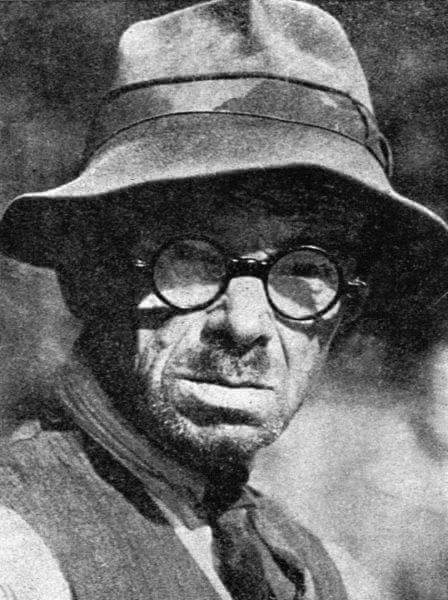  

### 1674

Jan III Sobieski został wybrany królem Polski, panował do 17 czerwca 1696 r. W 1684 r. został odznaczony przez papieża Innocentego XI tytułem fidei defensor (obrońcy wiary), przez Turków bywał nazywany Lwem Lechistanu.

### 1420

Podpisano francusko-angielski traktat w Troyes, który w swoich założeniach miał zakończyć wojnę stuletnią, odsuwając dynastię Walezjuszy od tronu francuskiego i zaprowadzając unię personalną obydwu krajów pod berłem Henryka V Lancastera.

Królowie z dynastii Lancasterów dążyli do odebrania francuskiej korony Walezjuszom, przy czym apogeum sukcesów angielskich władców przypada na panowanie Henryka V, który wstąpił na tron wiosną 1413 r., a zatem najpewniej niedługo po narodzinach bohaterki tej książki. Na mocy traktatu zawartego 21 V 1420 r. w Troyes zapewnił on sobie godność regenta Francji przy obłąkanym królu Karolu VI, otrzymując za żonę jego córkę Katarzynę. Ich potomstwo — jak się wówczas spodziewano — miało w przyszłości połączyć w swym ręku panowanie nad obydwoma tymi królestwami, w czym też upatrywano nadzieję na ostateczne zakończenie toczących się od dziesięcioleci zmagań orężnych, które zniszczenia (nie wspominając o dezorganizacji życia społecznego) przyniosły wprawdzie tylko ziemiom francuskim, będącym areną owych walk, ale i Anglia pogrążała się coraz bardziej w kryzysie ekonomicznym, gdyż prowadzenie długotrwałej wojny wymagało ogromnych nakładów finansowych i zarazem angażowało znaczne siły ludzkie.

Wspomniany tu traktat z Troyes miał zatem położyć kres wyniszczającym walkom i jednocześnie doprowadzić do powstania kolejnej na mapie politycznej Europy potęgi zasadzającej się na unii personalnej odrębnych dotąd monarchii.

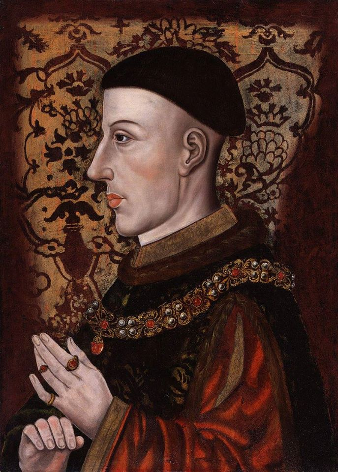  

---

<a href="https://github.com/TomaszWaszczyk/historia.waszczyk.com/edit/master/src/content/may-21.md" target="_blank">Edytuj tę stronę dzieląc się własnymi notatkami!</a>
