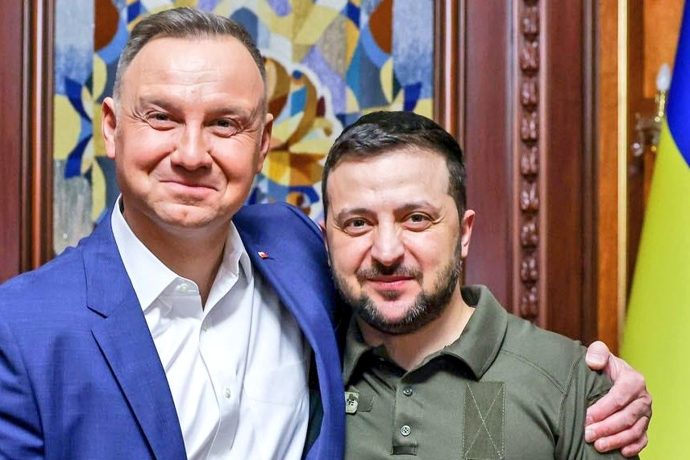
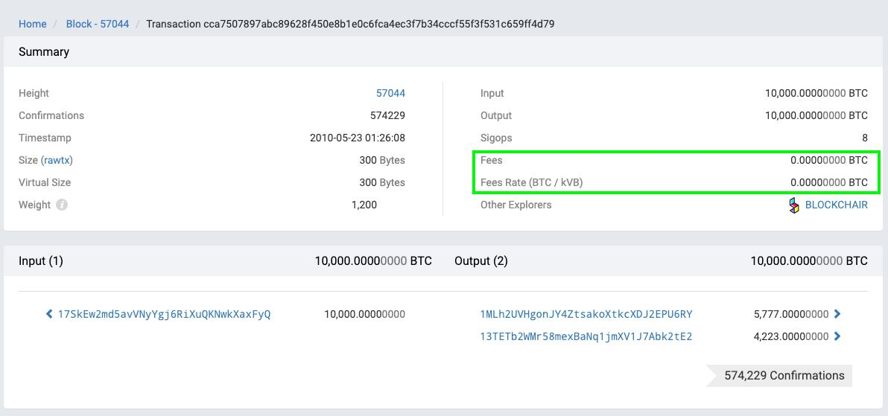
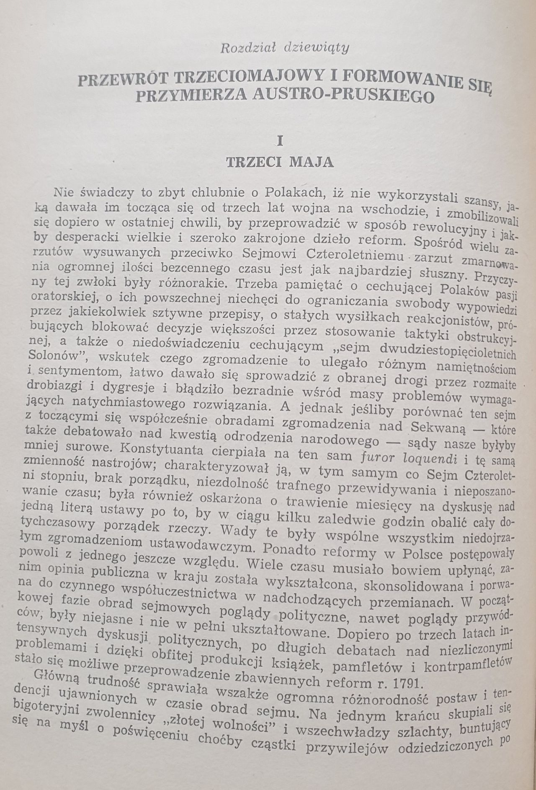
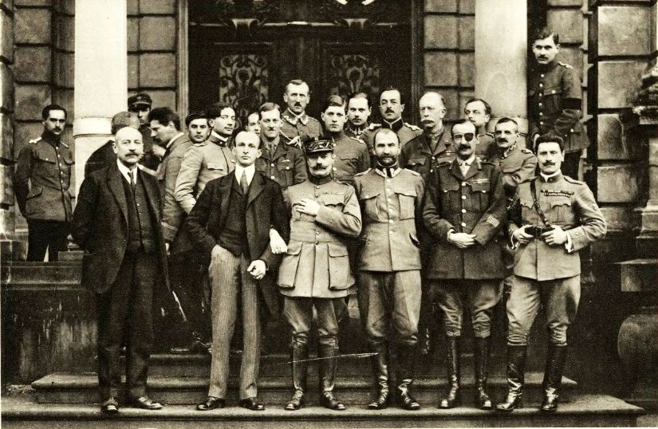
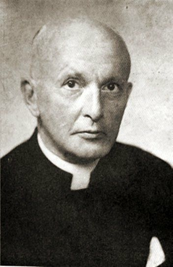
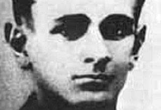
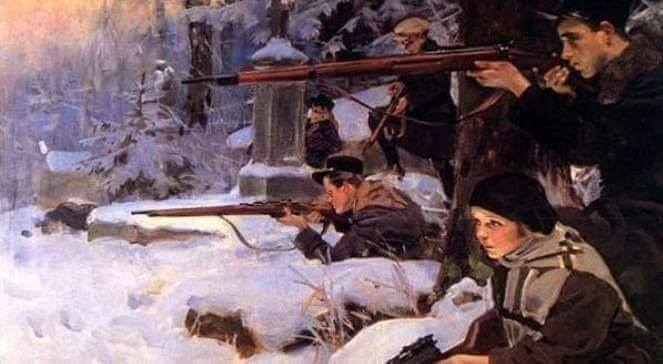
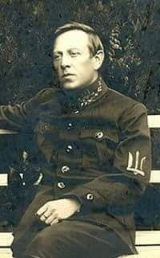

### 2022

  

---

Christine Lagarde, prezes Europejskiego Banku Centralnego, ponownie wypowiedziała się na temat kryptowalut. Stwierdziła, że te są „oparte na niczym” i powinny być tak uregulowane, aby odciągnąć inwestorów od spekulacji za ich pomocą przy częstym używaniu do tego swoich oszczędności życia.
Christine Lagarde ostrzega przed kryptowalutami

Lagarde była gościem holenderskiej telewizji. W czasie wywiadu powiedziała, że obawia się o ludzi, którzy nie mają pojęcia o ryzykach związanych z inwestycjami w kryptowaluty, a mimo tego lokują na tym rynku oszczędności. Jej zdaniem to powód, by uregulować branżę blockchaina.

– Według mojej bardzo skromnej oceny, kryptowaluty nie są nic warte, nie mają żadnego oparcia ani ukrytego zasobu, który działałby jako kotwica bezpieczeństwa – powiedziała.

Przyznała, że sama nie posiada ani jednego bitcoina. W cyfrowe aktywa inwestuje jednak… jej syn.

– Jest wolnym człowiekiem – stwierdziła szefowa EBC.

Sytuacja przypomina więc tą sprzed paru lat – dotyczącą Jamie’ego Dimona, CEO JP Morgan. Szef jednego z największych banków w USA krytykował kryptowaluty i uważał, że są bezwartościowe. Tyle że – jak sam przyznał – w tym samym czasie inwestowała w nie jego córka.

Podobny konflikt o kryptowaluty toczył ze swoim synem inwestor z rynku złota Peter Schiff. Spencer Schiff otwarcie krytykował ojca na Twitterze za to, że ten uparcie atakuje BTC.

---

### 2020

"W Polsce jeszcze tego nie widać, ale np. w Wielkiej Brytanii zmienia się dyskusja o rynku pracy. Wcześniej podział był na wykwalifikowanych i niewykwalifikowanych pracowników. W tej chwili podział przebiega wzdłuż pojęć „essential” (niezbędni) i „non-essential” (zbędni). I okazuje się, że ci, którzy zarabiają najwięcej, jak traderzy walutowi czy finansiści, należą do tej drugiej grupy. Ich praca nie ma kluczowego znaczenia dla funkcjonowania gospodarki w głębokim kryzysie. Co innego praca śmieciarzy, kasjerów, pielęgniarek, którzy zarabiają znacznie mniej, a bez nich zupełnie byśmy sobie nie poradzili. Zmiana postrzegania ich roli może przynieść wiele dobrego. Młodzi ludzie, zastanawiając się, na jakie studia pójść, będą coraz częściej wybierać te kierunki, które przysłużą się najlepiej społeczeństwu. Każdy przecież chce być w jakiś sposób „niezbędny”. Mam nadzieję, że takie myślenie rozprzestrzeni się na więcej krajów".

---

GUS: Sprzedaż detaliczna (ceny stałe) spadła o 22,9% r/r w kwietniu

Warszawa, 22.05.2020 (ISBnews) - Sprzedaż detaliczna (w cenach stałych) spadła o 22,9% r/r w kwietniu 2020 r., podał Główny Urząd Statystyczny (GUS). W ujęciu miesięcznym odnotowano spadek o 12,3%.

### 2010

  

### 1954

Robert Howard Lord to historyk i dyplomata, dzięki któremu Prezydent USA Woodrow Wilson reprezentował zdecydowanie propolskie stanowisko na Konferencji Paryskiej w Wersalu.

To jedyny na świecie historyk, który pisząc książkę o przyczynach rozbioru Polski i Konstytucji 3 Maja dostał się do całości archiwów rosyjskich w Petersburgu (w tym do wszystkich tajnych do dziś dokumentów).
Nie mając żadnych związków z Polską prof. Lord uznał, że to nie Polacy doprowadzili do rozbiorów (choć często nieumiejętnie się bronili, nie znając swoich faktycznych możliwości i ulegając dezinformacjom ze strony swoich sąsiadów) a Rosja, Prusy i Austria dokonały wspólnie największej zbrodni politycznej tysiąclecia (która bez udziału Anglii nie byłaby możliwa) polegającej na likwidacji pokojowo nastawionego, całkiem dobrze zorganizowanego państwa sąsiedzkiego zamieszkałego przez wielki osobny naród.

To z tej przyczyny Lord uważał, (wbrew Anglikom i Francuzom), że w Wersalu powinno się przywrócić Polskę w jej granicach przedrozbiorowych. Co dziwne Książka ta, choć będąca najlepiej udokumentowaną pracą na ten temat i przerywała polskie fałszywe polemiki odnośnie upadku Rzeczpospolitej w trybie "win własnych czy cudzych" nie została zauważona przez 60 lat przez polską historiografię i została przetłumaczona i wydana (tylko raz) w 1984 r. z entuzjastycznym wstępem prof. Jerzego Łojka.

Jest to do dziś chyba najbardziej niedoceniona pozycja na temat upadku Rzeczpospolitej, notorycznie pomijana we wszystkich opracowaniach i przez wszystkie uniwersytety. Przy czym logiczne, ze pomijają ją i pomijali historycy niemieccy, rosyjscy, austriaccy czy angielscy, bo obala ona wygodną dla ówczesnych mocarstw tezę, że "Polacy sami byli sobie winni" wskazując na jawne dowody dyplomatycznego spisku mającego doprowadzić do bandyckiego podzielenia się zasobami zamożnego kraju (co wynika z właśnie z tajnych archiwów rosyjskich Katarzyny II). Usilne pomijanie tej pozycji także przez uniwersytety polskie zarówno II RP, PRL jak i obecne jest natomiast kompletnie nie zrozumiałe, chyba, że przyjmiemy, że ich uczeni dotowani z obcych funduszy nie reprezentują interesu Polski w ustaleniu prawdy historycznej lub że z jakichś względów wciąż wygodna jest dyskusja na temat "warcholstwa polskiej szlachty" które by rzekomo miało doprowadzić do rozbiorów.

Co do samego Roberta Howarda Lorda, ostatecznie tak zachwycił się polskim duchem i polskim katolicyzmem, że będąc pastorem protestanckim porzucił naukę (był szefem katedry nowożytnej historii Europy w Harvard University) w wieku 41 lat i wstąpił do katolickiego seminarium duchownego w Massachusetts, aby po święceniach zostać najpierw wikarym parafii Św. Cecylii w Bostonie, a ostatecznie profesorem historii w seminarium Św. Jana w Brighton. Ten badacz uznany za jednego z najlepszych historyków ds. Europy w USA zmarł jako wicerektor tej instytucji i członek zarządu słynnej Boston Public Library 22 maja 1954 r.

  

  

  

### 1943

"W środku sali, gdzie dawano program, usłyszałem strzał -najpierw jeden, potem drugi, trzeci, czwarty, piąty... O parę kroków ode mnie, po prawej stronie zrobił się zgiełk. Przewracano stoły, naczynia, stołki, butelki. Wycie i krzyki. Po kilku minutach grupa żołnierzy poruszonych do ostatnich granic utorowała sobie przejście wśród tłumu krzycząc: 'Zamach' i trzymając rewolwery
w ręku. Wysoki młodzieniec z twarzą zbroczoną krwią padł na ziemię, gdy rzucono w niego kilkoma krzesłami" - wspominał
Alceo Valcini włoski dziennikarz przebywającego wtedy w Warszawie. Niemcy rzucili się na niego i zmasakrowali, bijąc flaszkami i stołkami.
Przy mnie wyzionął ducha, w swym
brązowym ubraniu, za obszernym jak na gruźlika. Zmarł, gdy agent gestapo usiłował wydobyć od niego jakąś tajemnicę".
22 maja 1943 roku 21 letni Jan Kryst ps Alan ( zdj.) dokonał zamachu na lokal Adria w Warszawie,w którym spotykali się Gestapowcy.
Była to planowa akcja AK.
Kryst przed śmiercią zabił kapitana oraz dwóch poruczników gestapo (meldunek niemiecki wymienia dwóch urzędników cywilnych gestapo i kaprala) oraz prawdopodobnie ranił dwóch innych.
Niemcy natychmiast rozpoczęli śledztwo -aresztowano personel lokalu a do "Adrii" przybył gubernator Warszawy gen. Ludwig
Fischer. Hitlerowcy byli przekonani, że zamachowiec był Żydem z getta. Ciało "Alana" przewieziono do kostnicy przy ul. Oczki, skąd zostało wykradzione przez
żołnierzy podziemia i pochowane na cmentarzu Wolskim.
Za ten czyn Alan został pośmiertnie odznaczony Krzyżem Walecznych.

  

### 1919

Obrona Lwowa – polsko-ukraiński konflikt zbrojny o Lwów, trwający od 1 listopada 1918 do 22 maja 1919 roku, zakończony zniesieniem ukraińskiego okrążenia. Walki o Lwów rozpoczęły się od opanowania 1 listopada przez żołnierzy austro-węgierskich pochodzenia ukraińskiego większości gmachów publicznych we Lwowie. Proklamowano utworzenie Zachodnioukraińskiej Republiki Ludowej. Przeciw temu aktowi agresji  wystąpili polscy mieszkańcy Lwowa, w tym młodzież, nazwana później Orlętami Lwowskimi. W późniejszym okresie wsparcia udzieliło im powstające Wojsko Polskie. Pierwszy etap konfliktu 1918–1919 roku zakończył się w nocy z 22 na 23 listopada 1918 roku, zmuszeniem do wycofania się oddziałów Armii Halickiej ze Lwowa. Jednak wycofanie miasta nie oznaczało jeszcze obrony Lwowa. Rozpoczęło się oblężenie miasta. Wobec ofensywy Wojska Polskiego wojska ukraińskie  wycofały się 22 maja 1919 i przestały oblegać Lwów. Miasto zostało obronione, ale nie na zawsze. W 1939 roku utracono je i nie wróciło do teraz do Rzeczpospolitej. Obecnie Lwów leży w granicach Ukrainy.

  

### 1879

W Połtawie na Ukrainie urodził się Symon Petlura (zdjęcie) przywódca Ukraińakiej Republiki Ludowej, polityk, działacz narodowy, naczelny dowódca wojsk ukraińskich, sprzymierzeniec Polaków w wojnie polsko- bolszewickiej.

Był uczniem seminarium duchownego, którego ze względu na samokształcenie się patriotyczne nigdy nie ukończył. Pochodził z rodziny o tradycjach kozackich. Polską kulturą i z Polską ogólnie zainteresował się za sprawą nestora ukraińskich socjalistów Mykoły Hankiewicza, który był zwolennikiem bliskiej współpracy z Polakami. Warto również dodać, że Petlura bardzo dobrze znał polską literaturę i świetnie władał językiem polskim.
Tak między innymi pisał w o Wyspiańskim w roku 1907:
" Głęboko kochał swój kraj, swój naród. […] Spoglądając wstecz, w mroczne wieki minionych dziejów narodu polskiego upajał się bohaterstwem mas ludowych. On kochał ten lud, kochał za ofiary, jakie ponosił dla szczęścia kraju. […] On wiedział, że zdrowe ziarno życia narodowego ukryte jest w masach ludu polskiego i wierzył, że masy te w końcu staną się twórcami – sprawcami dziejów własnego kraju."

Jedną z istotnych kart w jego życiorysie była współpraca z Józefem Piłsudskim, z którym spotkał się między innymi 9 grudnia 1919 roku, kiedy uzgodnione zostały kwestie współpracy wojskowej.

Odniesione przez Polaków przy istotnym udziale wojsk Petlury zwycięstwo w wojnie polsko- bolszewickiej miało jednak dla Ukraińców dosyć gorzki smak, ponieważ podpisanie przez Polskę w Rydze preliminariów pokojowych stawiało Petlurę w bardzo trudnym położeniu. Przez wielu Ukraińców, chociaż nie do końca przez samego ich przywódcę fakt ten został uznany za zdradę. W zaistniałej sytuacji Petlura jesienią 1920 roku podjął jeszcze samodzielną wyprawę na Ukrainę. Niestety zakończyła się już 21 listopada, kiedy to ukraińscy powstańcy zmuszeni byli do wycofania się za Zbrucz. Warto również wspomnieć, że Petlura rezygnując z części Wołynia i etnicznie mieszanej Galicji Wschodniej, domagał się, aby państwo polskie stworzyło pełne możliwości rozwoju dla żyjącej tam ludności ukraińskiej.
Symon Petlura został zamordowany przez zamachowca Szolema Szwarcbarda 25 maja 1926 roku. Zginął najpewniej z inspiracji OGPU, choć kwestia inspiracji zamachu nie została wyjaśniona jednoznacznie.

  

---

<a href="https://github.com/TomaszWaszczyk/historia.waszczyk.com/edit/master/src/content/may-22.md" target="_blank">Edytuj tę stronę dzieląc się własnymi notatkami!</a>
