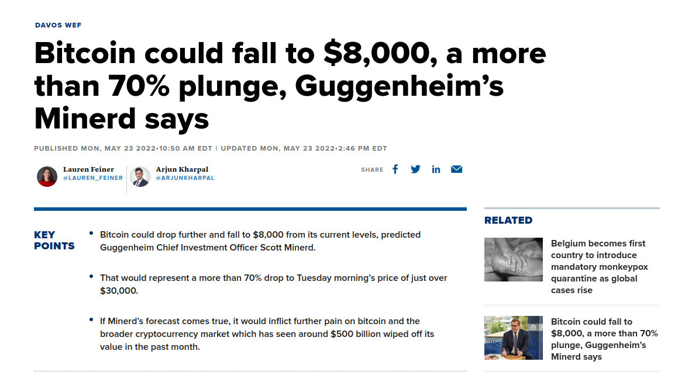
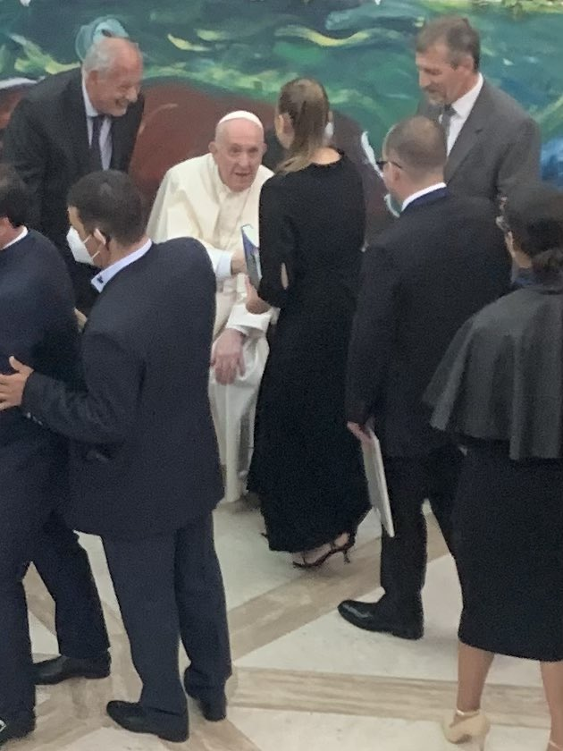
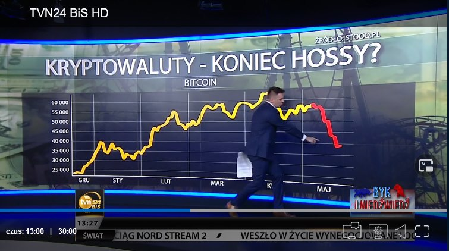
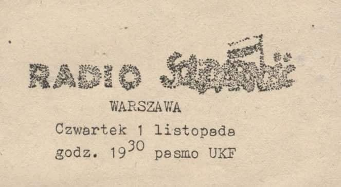
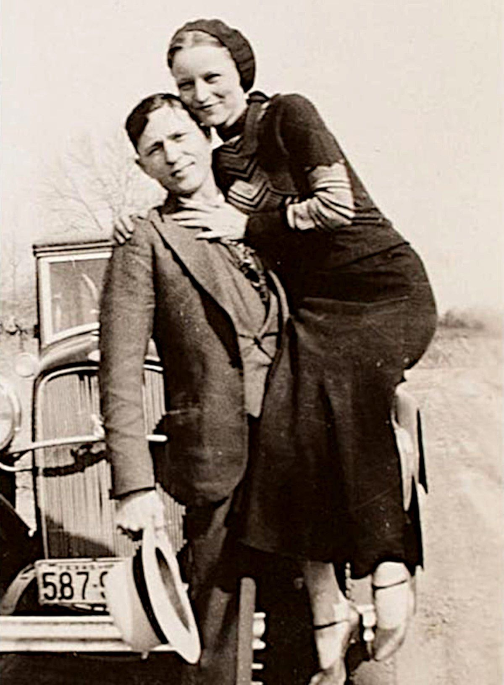
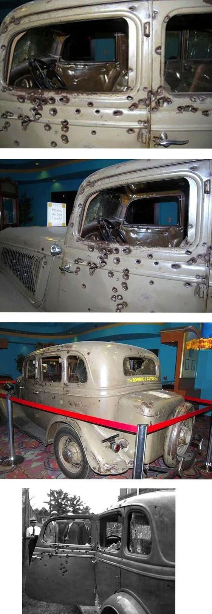
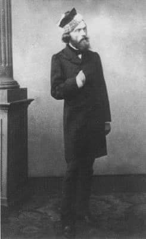
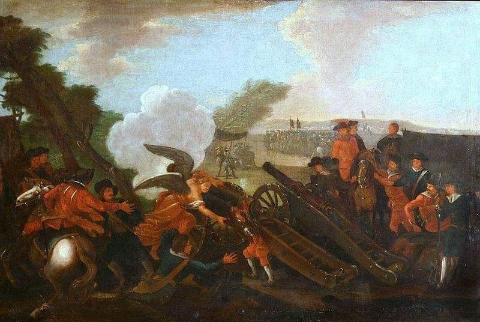

### 2022

  

---

Książka o Ethereum dla Papieża:

  

---

### 2021

  

---

Białoruś: porwany samolot linii Ryanair przez białoruskie KGB. Morawiecki interweniuje. "Akt terroryzmu". Tusk: "Łukaszenka stał się zagrożeniem"

„W 1975 r. KGB porwało w Wiedniu kapitana marynarki wojennej Nikołaja Artamonowa, który uciekł na Zachód. Artamanow zmarł w drodze do Moskwy, bo porywacze wstrzyknęli mu zbyt mocną dawkę środka usypiającego.
Rosyjskie służby kontynuują tę tradycję. W 2012 r. działacz opozycji antykremlowskiej Leonid Razwozżajew na oczach przechodniów został porwany przez nieznanych sprawców na ulicy w Kijowie. Ślad po nim zaginął — do następnego dnia, gdy pojawił się w sądzie w Moskwie oskarżony o nakłanianie do przemocy. Dostał cztery i pół roku obozu pracy.
Białoruskie KGB (Łukaszenko nie uważał, że po upadku ZSRR należy zmienić nazwę tajnej policji) rozzuchwalone dokonaniami swych rosyjskich towarzyszy sięgnęło po podobne metody. Ich celem stał się znany dysydent, chroniony litewskim azylem, porwany z pokładu polskiego samolotu lecącego na trasie wewnątrz Unii Europejskiej.”

„Teraz pora na stanowczą reakcję Litwy, Polski i całej Unii Europejskiej. Inaczej mamy niemal pewność, że po Londynie i Berlinie ludzie, których nie lubi Łukaszenko, zaczną ginąć, a w najlepszych razie znikać, również na naszych i z naszych ulic.”

---

### 1989

Chińscy robotnicy zasłaniający ubrudzony farbą portret Mao Tse -Tunga.

Zdjęcie wykonano w trakcie trwania zamieszek na placu Tiananmen
23 Maja 1989 roku

  

### 1984

Warszawski Sąd Wojskowy skazał zaocznie na karę śmierci pułkownika Ryszarda Kuklińskiego (zdjęcie). Dodatkowo został on zdegradowany do stopnia szeregowca, a jego cały majątek został zajęty. Kuklińskiego oskarżono o zdradę, dezercję i działanie na szkodę państwa. 11 lat później wyrok ten został zamieniony na 25 lat pozbawienia wolności. W roku 1997 śledztwo przeciwko Kuklińskiemu zostało umorzone, on sam został przywrócony do rangi pułkownika. W uzasadnieniu umorzenia stwierdzono, iż dział w stanie wyższej konieczności.

  

### 1982

Założone między innymi przez Zbigniewa i Zofię Romaszewskich Radio Solidarność nadało swoją drugą audycję. Pierwsza audycja ukazała się w eterze 12 kwietnia 1982 roku. Ostatnia audycja warszawskiego Radia Solidarność została nadana w dniu 22 czerwca 1989 roku.

  

### 1945

Popełnił samobójstwo Heinrich Himmler - Reichsfuhrer SS. Z zawodu agronom. Podlegało mu Gestapo oraz obozy koncentracyjne. Ambitny i pozbawiony skrupułów biurokrata i antysemita. Twórca planu germanizacji ziem Polskich i terenów Europy Wschodniej. Główny realizator zagłady biologicznej Żydów.

Heinrich Himmler ukrywał się w północnych Niemczech do 21 maja.
Zgolił wąsy, zasłonił oko czarną opaską oraz przywdział mundur oficera Tajnej Policji Polowej, czyli Geheime Feldpolizei. Na punkcie kontrolnym okazał dokumenty, co wydało się bardzo podejrzane, gdyż w tamtych czasach niewielu je posiadało. Nosił także mundur formacji, której członkowie byli poszukiwani przez aliancki wymiar sprawiedliwości. Został zatrzymany. Skierowano go do ośrodka przesłuchań w Barfeld. Ujawnił swą tożsamość podczas przesłuchań. Został przewieziony do kwatery dowódców 2. Armii. Tam popełnił samobójstwo, przegryzając ampułkę z trucizną, którą miał ukrytą w ustach.

  

### 1939

W Berlinie odbyło się spotkanie Adolfa Hitlera z wysokimi rangą oficerami. W jego czasie fuhrer stwierdził:
" Nie może być mowy o oszczędzaniu Polski i pozostaje nam decyzja; zaatakować Polskę przy pierwszej dobrej sposobności. Nie można przy tym zakładać, że powtórzyć się wariant czechosłowacki. Dojdzie do wojny. Zadaniem jest wyizolowanie Polski. Gdy odizolowanie Polski się uda, będzie miało znaczenie decydujące".

  

### 1934

Bonnie Elizabeth Parker and Clyde... Początkowo popełniali drobne wykroczenia, takie jak kradzieże (najczęściej portfeli), rozboje czy włamania. Z czasem zaczęli się dopuszczać morderstw. Zginęli 23 maja 1934 roku w policyjnej zasadzce, podczas której zostali zastrzeleni.

  

  

### 1933

Glass-Steagall was passed by the House of Representatives. It was passed by the Senate on May 25, 1933. It was signed into law by President Roosevelt on June 16, 1933, as part of the New Deal. It became a permanent measure in 1945.

After the law passed, banks had one year to decide whether they would become investment or commercial banks.

### 1924

Weszła w życie ustawa o powszechnym obowiązku wojskowym. Artykuł 6 tego dokumentu mówił:
" Wiek poborowy rozpoczyna się z dniem 1 stycznia tego roku, w którym podlegający powszechnemu obowiązkowi wojskowemu kończy 21 lat życia i trwa do końca tego roku kalendarzowego, w którym kończy on 23 lat życia.

W razie wybuchu wojny wiek poborowy rozpoczyna się z dniem 1 stycznia tego roku kalendarzowego, w którym podlegający powszechnemu obowiązkowi wojskowemu kończy 19 lat życia.

Urodzeni w tym samym roku kalendarzowym stanowią jeden rocznik, oznaczany według roku ich urodzenia."

### 1900

https://pl.wikipedia.org/wiki/Hans_Frank - wprowadził prawo 50:1, za jednego zabitego niemca, 50 zabitych polskich obywateli

### 1871

W okrążonym przez wojska wersalskie i pruskie Paryżu, na ulicy Myrrha poległ Jarosław Dąbrowski - generał i naczelny wódz sił zbrojnych Komuny Paryskiej. Generał został śmiertelnie ranny, gdy prowadził do kontrataku kompanię marynarzy. Rannego generała przeniesiono do szpitala Lariboisiere. Tam bezskuteczną próbę uratowania jego życia podjął polski lekarz, weteran powstania styczniowego, Henryk Gierszyński. Jak wspominał Gierszyński: ''Dąbrowski chwycił mnie za głowę i pocałował. To był ostatni jego gest w życiu i ostatnie pożegnanie z rodakami”. W czasie tzw. Krwawego tygodnia, trwającego od 21 do 28 maja 1871 roku, wojska wierne rządowi (wersalczycy) krwawo stłumiły Komunę Paryską oraz dopuściły się masowych egzekucji schwytanych komunardów.

  

### 1883

W przytułku dla ubogich w Paryżu zmarł Cyprian Kamil Norwid - poeta i plastyk; od 1842 roku przebywający za granicą. Odkryty został przez Młodą Polskę (Z. Przesmycki). Tworzył nowatorską, zintelektualizowaną lirykę (cykl Vade - mecum), poematy (Quidam, Assunta, Promethidion), utwory dramatyczne (Pierścień wielkiej damy), nowele (Bransoletka, Ad leones), filozoficzne eseje wspomnieniowe ( Białe kwiaty, Czarne kwiaty). Pierwotnie spoczął na cmentarzu w Ivry.
W 1888 roku pochowany został w zbiorowej mogile na cmentarzu polskim Montmorency we Francji, symboliczna ziemia z jego grobu została w 2001 roku przewieziona do Polski i umieszczona w Krypcie Wieszczów Narodowych w Katedrze na Wawelu.
Artysta był uważany za dziwaka i samotnika. Niewiele osób potrafiło dostrzec jego artystyczną i twórczą duszę. Bardzo lubił pisać listy. Próbował angażować się w sprawy polityczne. Tworzył teksty publicystyczne i aktywnie komentował aktualny bieg wydarzeń w polityce, tworzył programy polityczne, jednak bez większych sukcesów.

  

### 1733

Sejm Konwokacyjny przyjął uchwałę o wykluczeniu kandydatur cudzoziemców do tronu polskiego. Uchwała ta była odpowiedzią polskiej szlachty na tzw "pakt czarnego orła", który w roku 1732 zawarły Rosja i Austria, które prowadziły zabiegi o to, by do władzy nie doszedł Stanisław Leszczyński. Wspólnym pretendentem do korony polskiej był infant portugalski Dom Emanuel Bragança (grafika).
Wnioskodawcą nieprzychylnej dla cudzoziemców uchwały był stronnik Stanisława Leszczyńskiego prymas Teodor Potocki. Ustalenia szlachty przekreśliły dążenia Rosji, Austrii i Prus do osadzenia na tronie polskim kandydata z Portugalii.

  

### 1702

W czasie III wojny północej wojska szwedzkie pod dowództwem Karola XII wkroczyły do opuszczonej przez króla Augusta II Warszawy. Szwedzi natychmiast zażądali, by prymas Michał Radziejowski zdetronizował Augusta II, co nie spodobało się szlachcie. Pretekstem do zbrojnego rozwiązana tej sprawy były przedłużające się z Radziejowskim rozmowy, który nie chciał się zgodzić na detronizację. Jedną z głównych bitew tej wojny była bitwa pod Kliszowem (zdj.), która miała miejsce 9 lipca 1702 roku.

  

---

<a href="https://github.com/TomaszWaszczyk/historia.waszczyk.com/edit/master/src/content/may-23.md" target="_blank">Edytuj tę stronę dzieląc się własnymi notatkami!</a>
