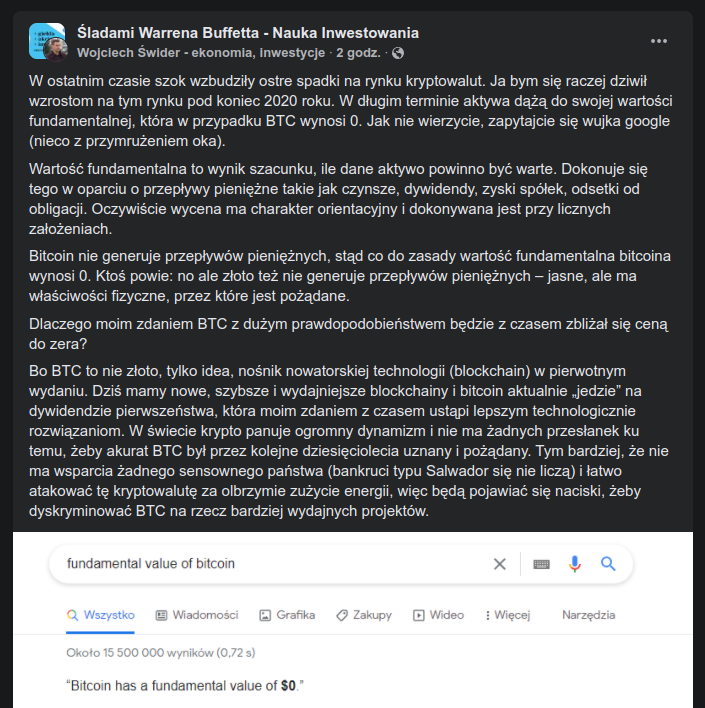
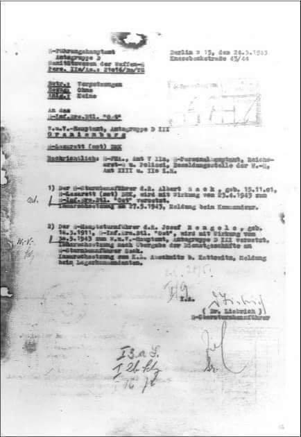
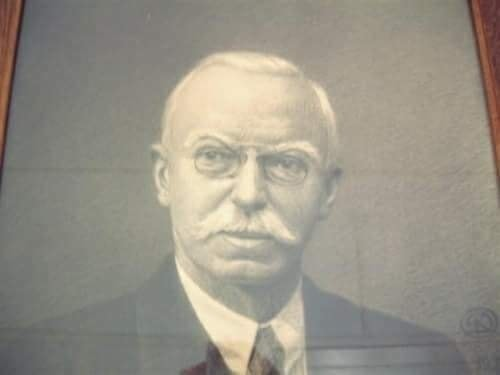
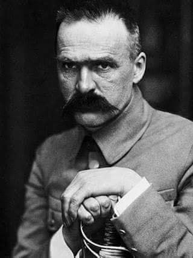

### 2023

> YELLEN: BĘDĄ NIEKTÓRE ZOBOWIĄZANIA, KTÓRYCH NIE BĘDZIEMY W STANIE SPŁACIĆ

### 2022

  

  

  

<video width="640" height="480" controls>
<source src="./movies/may/lagarde.mp4" type="video/mp4">
Your browser does not support the video tag.
</video>

---

<video width="640" height="480" controls>
<source src="./movies/may/informatyktozlo.mp4" type="video/mp4">
Your browser does not support the video tag.
</video>

  

  

---

<video width="640" height="480" controls>
<source src="./movies/may/carbonfootprint.mp4" type="video/mp4">
Your browser does not support the video tag.
</video>

---

### 2021

Tayyip Erdogan i Andrzej Duda podpisali w dniu 24 maja porozumienie o bezpiecznej turystyce, umowę o wzajemnej ochronie informacji niejawnych w dziedzinie przemysłu obronnego oraz umowę w sprawie zakupów tureckich dronów.

- Turcja "po raz pierwszy w swojej historii" będzie eksportować drony do Polski, kraju członkowskiego NATO i UE - powiedział Erdogan. Polska zakupi cztery zestawy bezzałogowych dronów bojowych Bayraktar TB2, czyli 24 maszyny.

Dodał, że Turcja i Polska "twardo kroczą" w kierunku osiągnięcia celu 10 mld dolarów w dwustronnej wymianie handlowej. - Turcja w ramach misji NATO w regionie Morza Bałtyckiego rozmieści wkrótce w Polsce swoje odrzutowce F-16 - zapowiedział.

Erdogan mówił również, że z zadowoleniem przyjmuje rozmieszczenie polskich sił w bazie lotniczej Incirlik na południu kraju. Stacjonują tam polscy żołnierze w ramach misji obserwacyjno-patrolowej. Ich zadaniem jest patrolowanie rejonu Morza Czarnego i Śródziemnego.

### 2020

  

### 1943

Pismo z dnia 24 maja 1943 roku o przeniesieniu J. Mengele do KL Auschwitz. (APMAB: nr. mikr. 1613/98)

  

### 1941

W wieku 82 lat zmarł Emil Gerlach (zdjęcie) przemysłowiec, działacz społeczny, założyciel Polskiego Towarzystwa Pomocy Ofiarom Wojny oraz inicjator budowy sanatorium w Rudce.
Z pochodzenia był Niemcem. Razem z bratem Gerhardem prowadził w Warszawie firmę wytwarzającą instrumenty geodezyjne i chirurgiczne. Angażował się w walkę z gruźlicą: pełnił funkcję prezesa Warszawskiego Towarzystwa Przeciwgruźliczego, w 1924 roku ufundował pracownię rentgenologiczną w Szpitalu Ewangelickim w Warszawie. Za zasługi odznaczony Krzyżem Oficerskim Orderu Odrodzenia Polski.

  

### 1899

Józef Piłsudski wystąpił z Kościoła Katolickiego.
Główną przyczyną tego wydarzenia był zamiar wzięcia ślubu z ewangeliczką Marią Koplewską.
Oto treść aktu przejścia Piłsudskiego na wyznanie ewangelicko- augsburskie :
" Działo się w mieście Łomży dwunastego (dwudziestego czwartego) maja tysiąc osiemset dziewięćdziesiątego dziewiątego roku o godzinie dziesiątej rano. Ogłaszamy, że w obecności świadków Tytusa Mikulskiego,
dwudziestu jeden lat, technika, i Fryderyka Szymańskiego, lat trzydziestu sześciu, zakrystianina, obu zamieszkałych w Łomży, po
dostatecznym przygotowaniu i pełnym wewnętrznym przekonaniu przeszedł z wyznania Rzymsko-Katolickiego na wyznanie Ewangelicko-Augsburskie w tutejszym Ewangelicko -Augsburskim kościele Józef Klemens Piłsudski lat trzydziestu jeden, kawaler, zamieszkały w Łapach, urodzony w majątku Zułowie, syn szlachcica Józefa i
zmarłej Marii z domu Billewicz małżonków Piłsudskich. Przy tym uzupełnia się, że Józef Klemens Piłsudski tejże daty był konfirmowany, odbył spowiedź i przyjął komunię świętą. Akt ten ogłaszanemu i świadkom przeczytany przez nich i przez nas podpisany został.
Józef Klemens Piłsudski (po polsku)
Tytus Mikulski (po polsku)
Fridrich Szimanski (po rosyjsku)
Pastor G. Nikulski (po rosyjsku)"

  

---

<a href="https://github.com/TomaszWaszczyk/historia.waszczyk.com/edit/master/src/content/may-24.md" target="_blank">Edytuj tę stronę dzieląc się własnymi notatkami!</a>
