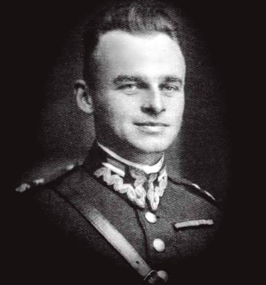
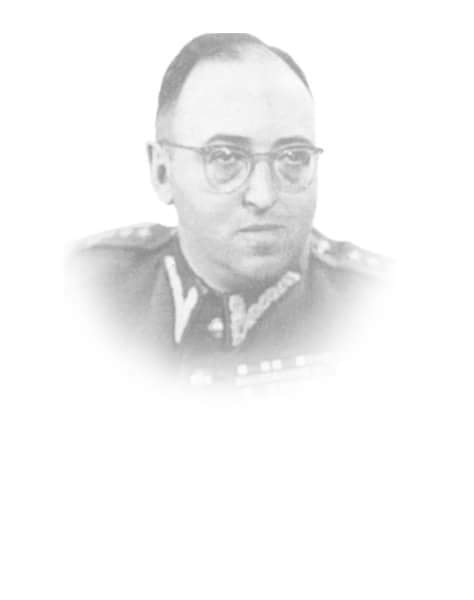
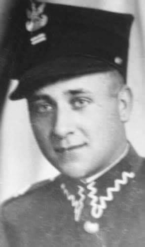
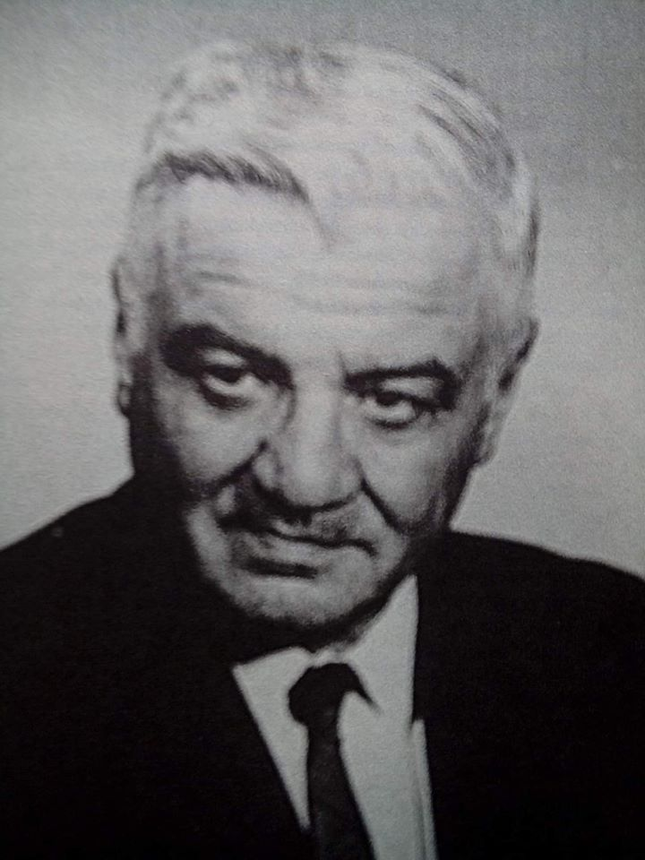

### 2020

Szef unijnej dyplomacji Josep Borrell:

> Na naszych oczach kończy się porządek zdominowany przez USA, a zaczyna "azjatyckie stulecie".

### 2018

GDPR rusza w Polsce.

### 1948

O godz. 21.30 w obecności Wiceprokuratora Naczelnej Prokuratury Wojska Polskiego mjr S. Cypryszewskiego, Naczelnika więzienia Mokotowskiego – por. Ryszarda Mońko, lekarza por. dr. Kazimierza Jezierskiego, duchownego – ks. kpt. Wincentego Martusiewicza rozstrzelano Witolda Pileckiego, a ciało potajemnie pogrzebano prawdopodobnie na tzw. „Łączce” dziś kwatera „Ł” cmentarza Powązkowskiego. Wyrok śmierci na rotmistrzu Pileckim osobiście wykonał dowódca jednoosobowego plutonu egzekucyjnego Piotr Śmietański. Kat Śmietański za pozbawienie życia rotmistrza Pileckiego otrzymywał kwotę tysiąca złotych. Mordu dokonano na podstawie wyroku sądu wojskowego, który zapadł 15 marca 1948 r. Unieważnienie wyroku nastąpiło w 1990 roku.
W uzasadnieniu wyroku z 15 marca 1948 r. odnoszącym się również do Marii Szelągowskiej i Tadeusza Płużańskiego czytamy:
" Dopuścili się najcięższej zbrodni stanu i zdrady narodu, cechowało ich wyjątkowe napięcie złej woli, przejawiali nienawiść do Polski Ludowej i reform społecznych, zaprzedali się obcemu wywiadowi i wykazali szczególną gorliwość w akcji szpiegowskiej”.

  

### 1946

Wojskowy Sąd Rejonowy skazał na 10 lat więzienia Lidię Struzikiewicz telefonistkę Wojewódzkiego Urzędu Bezpieczeństwa Publicznego we Wrocławiu, informatorkę Inspektoratu "Afryka" Zrzeszenia Wolność i Niezawisłość, w czasie okupacji łączniczkę i sanitariuszkę Armii Krajowej, a następnie Armii Ludowej. Przewodniczącym składu sędziowskiego był pułkownik Aleksander Warecki (zdjęcie), ten sam, który w lutym 1951 roku poparł wniosek prokurator Heleny Wolińskiej o aresztowanie generała Augusta Fieldorfa "Nila".

  

### 1940

Heinrich Himmler w swoim tajnym memorandum pt "Traktowanie obcych rasowo na wschodzie" pisał:

> "Musimy podzielić Polskę na na tak wiele różnych grup etnicznych,na wiele części i podzielonych grup jak tylko to możliwe. Musimy starać się uznawać i podtrzymywać jak najwięcej odrębnych narodowości, a więc obok Polaków i Żydów także Ukraińców, Białorusinów, Górali, Łemków i Kaszubów. Jeśli gdziekolwiek jeszcze się da znaleźć jakieś odłamy narodowościowe – to te także.(...) Chcę przez to powiedzieć, że najbardziej zainteresowani jesteśmy nie tym ażeby ludność wschodu jednoczyć, lecz przeciwnie, ażeby ją rozbić na możliwie wiele części i odłamów. Nie leży w naszym interesie doprowadzanie wymienionych narodowości do jedności i wielkości i stopniowe budzenie wśród nich świadomości narodowej i rozwijanie kultury narodowej, lecz przeciwnie, rozbicie ich na niezliczone małe odłamy i cząstki. (...)W ciągu (...) 4 do 5 lat np. pojęcie Kaszubów musi stać się nieznane, ponieważ wówczas kaszubskiego narodu już nie będzie (odnosi się to szczególnie do Prus Zachodnich). Musi być także możliwe w okresie nieco dłuższym spowodowanie zniknięcia na naszym obszarze narodowych pojęć Ukraińców, Górali i Łemków. To co zostało powiedziane o tych odłamach narodowych, odnosi się w odpowiednio większych rozmiarach także do Polaków”

  

### 1926

Kaczyńskich nauczał Jan Józef Lipski: https://pl.wikipedia.org/wiki/Jan_J%C3%B3zef_Lipski

### 1918

W Kozicach Górnych urodził się Józef Franczak ps " Lalek" zwany też " ostatnim z żołnierzy wyklętych".
Był sierżantem Wojska Polskiego, uczestnikiem wojny obronnej 1939 roku, żołnierzem Związku Walki Zbrojnej Armii Krajowej,aktywnym działaczem polskiego podziemia antykomunistycznego. Swój pseudonim zyskał dzięki zawsze schludnemu wyglądowi.
Lalek brał udział w wielu zamachach na tzw. utrwalaczy władzy ludowej –milicjantów i żołnierzy formacji bezpieczeństwa. Kilka razy był ranny, a raz aresztowany. W czerwcu 1946 roku Urząd Bezpieczeństwa zrobił w okolicy, w której ukrywał się Franczak wielką obławę. Po zatrzymaniu kilku osób, w tym Lalka, który miał jednak dokumenty na inne nazwisko, ubecy pojechali do wsi Chmiel na wesele.
Kiedy po zabawie. ciężarówka z
aresztowanymi jechała do Lublina,
partyzanci rzucili się na będących pod wpływem alkoholu ubeków, obezwładnili ich i zabili pięciu z nich.
Od 1953 roku, jako jeden z ostatnich partyzantów, ograniczył zbrojny udział w zwalczaniu nowej
władzy i rozpoczął samotną walkę o przetrwanie. Ukrywał się na prowincji, dzięki pomocy zwykłych ludzi, choć groziły za nią wysokie kary. Według źródeł SB, z "Lalkiem"
współpracowało ok. 200 osób.
We wrześniu 1961 roku poszukujące go władze komunistyczne wysłały za nim list gończy, w którym nazwano go " bandytą stanowiącym postrach dla mieszkańców podlubelskich wsi". Wyznaczono za niego wysoką nagrodę. Za 5 tysięcy złotych wydał go jego dawny współpracownik Stanisław Mazur pseudonim operacyjny " Michał".
Towarzysz "Michał" nawiązał kontakt z nie przeczuwającym zdrady Franczakiem. Informacje przekazane bezpiece przez konfidenta pozwoliły na dotarcie do miejsca ukrywania się "Lalka" wytropiono go na podstawie numeru rejestracyjnego motoru,
którym Franczak przyjechał na spotkanie z Mazurem. Trop prowadził do gospodarstwa Wacława Becia z Majdanu Kozic Górnych.
Współpraca Mazura z SB wyjdzie na jaw dopiero w 2005 r., dzięki badaniom Stanisława Poleszaka, historyka z lubelskiego oddziału IPN.
21 października 1963 roku gospodarstwo zostało otoczone przez funkcjonariuszy SB i ZOMO, łącznie 37 ludzi. "Widząc zagrożenie, "Lalek" oddał w kierunku komunistów kilka strzałów. W tej sytuacji grupa likwidacyjna ZOMO przystąpiła do likwidacji. Franczak mimo wzywania go do zdania się podjął obronę i wykorzystując słabe punkty obstawy, pod osłoną zabudowań wycofał się około 300 metrów od meliny, gdzie podczas wymiany strzałów został śmiertelnie ranny i po kilku minutach zmarł" - napisano w raporcie po obławie.
Sekcja zwłok Franczaka wykazała, że jego zgon nastąpił w wyniku ostrzału serca. W chwili śmierci ostatni polski partyzant miał 45 lat.

  

### 1905

W Strzyżowie na Lubelszczyźnie urodził się Mieczysław Grzegorz Bekker (zdjęcie) inżynier, naukowiec, konstruktor pojazdu księżycowego.
Był absolwentem Gimnazjum imienia Tadeusza Kościuszki w Koninie, a także Wydziału Mechanicznego Politechniki Warszawskiej. W latach 1929-1931 odbył służbę wojskową w Szkole Podchorążych Saperów w Modlinie. Przeniesiony do rezerwy w stopniu podporucznika. Po studiach podjął pracę w Wojskowym Instytucie Badań Technicznych. Równocześnie prowadził wykłady w Szkole Inżynierii Wojskowej. Specjalizował się w mechanice pojazdów samochodowych. Jeszcze w okresie studiów odbył staż w fabryce Reanault we Francji, gdzie pracował nad projektami pojazdów dla Dowództwa Wojsk Pancernych. Stworzył między innymi takie konstrukcje jak Fiat 508 "Łazik", Polski Fiat 508/518.
Na krótko przed wybuchem wojny został zmobilizowany. Uczestniczył w wojnie obronnej. Po jej upadku przedostał się do Rumunii, gdzie przebywał przez pół roku, a następnie do Francji, gdzie jako znany już specjalista podjął pracę w Wydziale Czołgów Ministerstwa Uzbrojenia w Paryżu. W roku 1942 wyjechał do Ottawy w Kanadzie, gdzie na prośbę władz kandyjskich podjął pracę w Biurze Badań Broni Pancernej. W roku 1943 wstąpił do armii kanadyjskiej i opracowywał dla niej projekty pojazdów militarnych, zdolnych do swobodnego poruszania się, nawet w najtrudniejszym terenie. W roku 1956 wyjechał do USA, gdzie pracował w Wojskowym Laboratorium Pojazdów Terenowych i prowadził wykłady na politechnice. W niedługim czasie został profesorem University of Michigan w Ann Arbor i przyjął propozycję objęcia stanowiska dyrektora Instytutu Badań koncernu samochodowego General Motors w Santa Barbara. Pięć lat później NASA ogłosiła konkurs na budowę pojazdu zdolnego do poruszania się po powierzchni Księżyca. Do rywalizacji przystąpiło 80 firm. Ale wygrał go zespół kierowany przez Bekkera. Pojazd jego konstrucji nazwany został Lunar Roving Vehicle-LRV (Wędrujący Pojazd Księżycowy). Zespół Bekkera opracował w sumie trzy projekty pojazdów księżycowych, które wykorzystane zostały w trzech wyprawach załogowych Apollo.
Po przejściu na emeryturę na początku lat siedemdziesiątych zamieszkał wraz z żoną Jadwigą w swojej willi w Santa Barbara. Prowadził bardzo aktywny tryb życia. Pracował w komitecie rady naukowej przy prezydencie Stanów Zjednoczonych. Współpracował z instytucjami wojskowymi USA i Kanady jako doradca i rzeczoznawca. Pisał wspomnienia i malował akwarele.
Zmarł 8 stycznia 1989 roku w Santa Barbara w Kaliforni.

  

---

<a href="https://github.com/TomaszWaszczyk/historia.waszczyk.com/edit/master/src/content/may-25.md" target="_blank">Edytuj tę stronę dzieląc się własnymi notatkami!</a>
