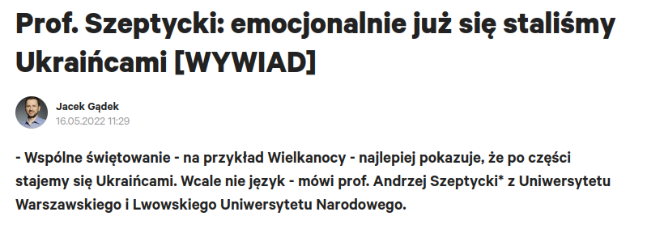
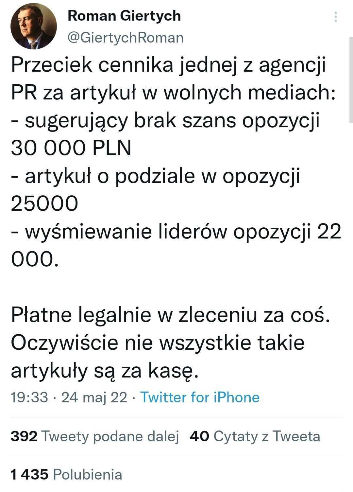
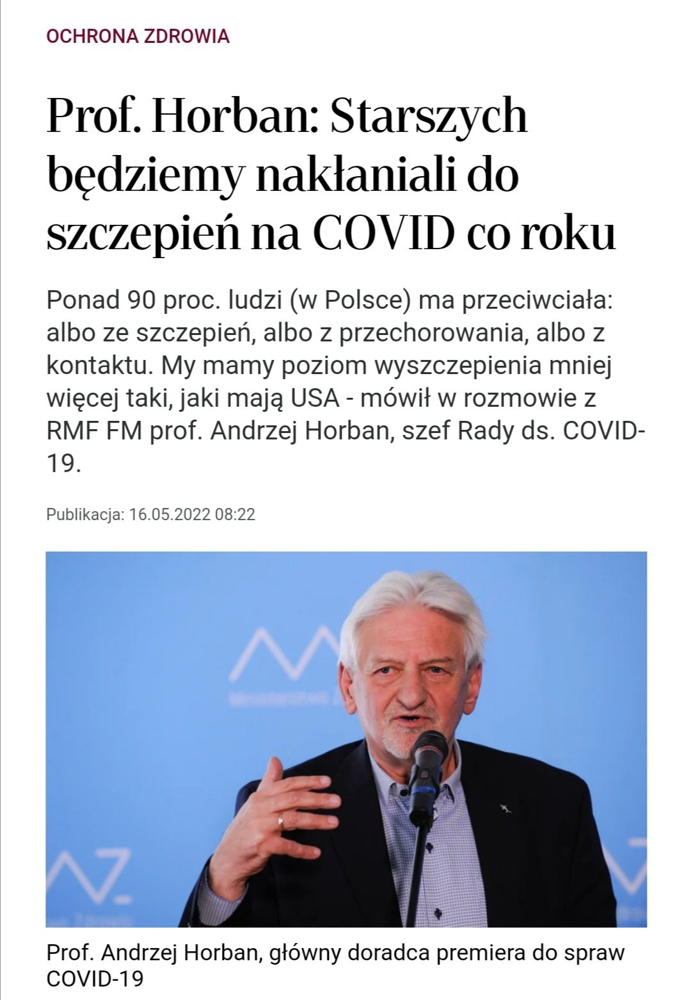
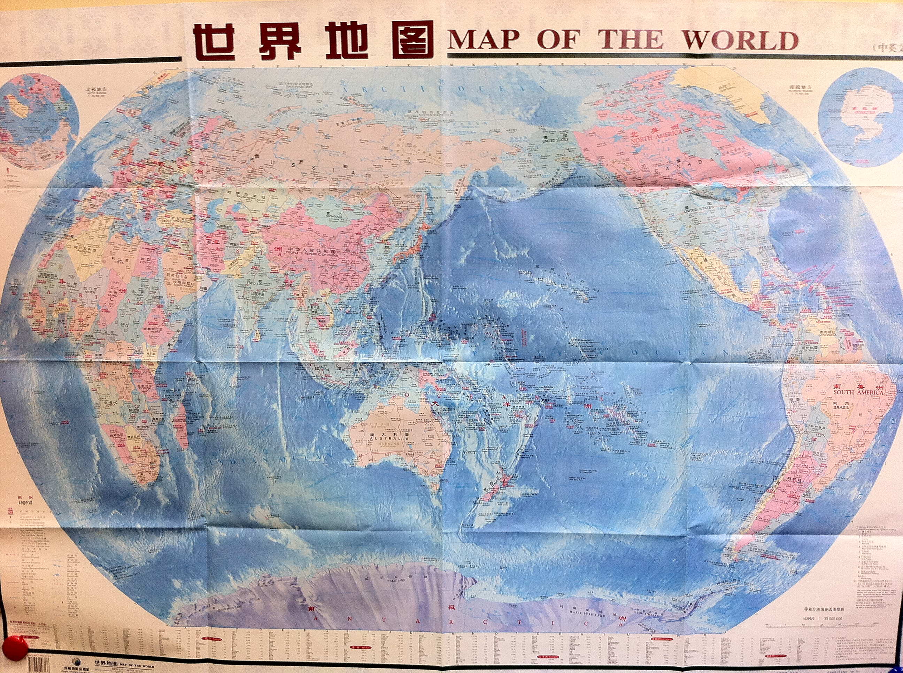
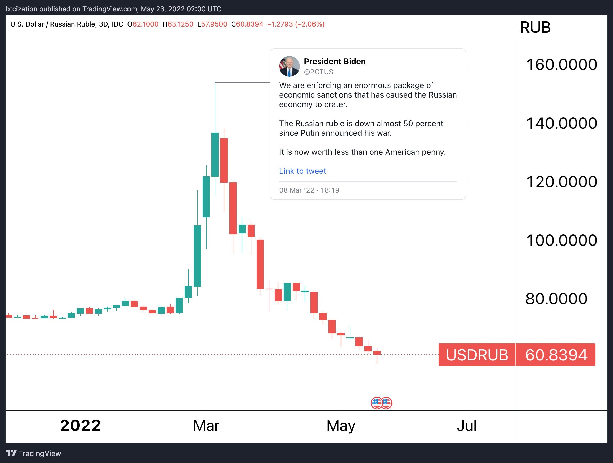
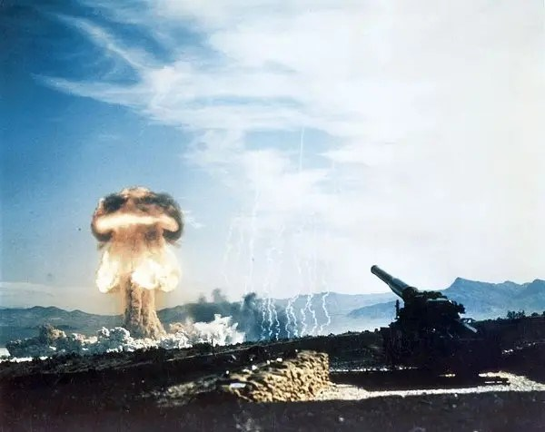
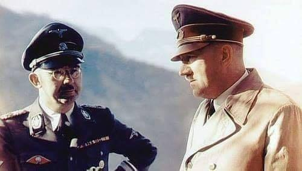
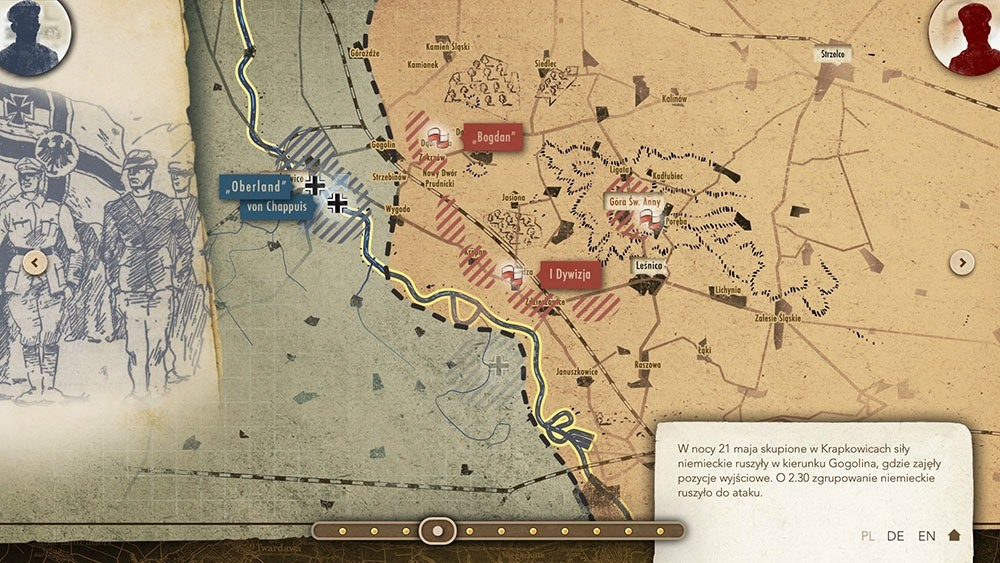

### 2023

Resort finansów oferuje promocję przy zakupie obligacji detalicznych w drodze zamiany
publikacja

Resort finansów utrzymał na czerwiec oprocentowanie obligacji detalicznych na poziomie z maja, ale przygotował promocję dla klientów, którzy będą chcieli kupić nowe obligacje w drodze zamiany - podało MF w komunikacie.

> "Obligacje z czerwcowej oferty, z wyjątkiem obligacji 3-miesięcznych OTS0923, będą sprzedawane w drodze zamiany, po znacznie atrakcyjniejszej cenie w stosunku do standardowej. Dla każdego rodzaju obligacji będzie możliwe uzyskanie innego dyskonta. Znacznie wyższe dyskonto uzyska się wybierając dłuższą obligację"

---

TVP VOD usunęło wszystkie odcinki programu „Warto rozmawiać”

---

### 2022

Average price of a new home in the US...

2012: 288k

2013: 337k

2104: 325k

2015: 340k

2016: 369k

2017: 366k

2018: 385k

2019: 385k

2020: 360k

2021: 435k (+21% YoY)

2022: 570k (+31% YoY)

---

  

---

  

  

  

  

  

  

---

### 2021

  

### 2020

Szef unijnej dyplomacji Josep Borrell:

> Na naszych oczach kończy się porządek zdominowany przez USA, a zaczyna "azjatyckie stulecie".

<!-- Zwyrodnialec IV RP
Ilustracja patologii w Sądzie Najwyższym jest to, że sędzią dyscyplinarnym jest były prokurator - sadysta, który od kobiety wymuszał zeznania między skurczami porodowymi.
Historię Marysi (imię autentyczne) opisałem rok temu w książce o Ziobrze. Jest dla mnie koronnym dowodem zwyrodnialstwa i bezkarności polskich prokuratorów. I tego, że sprawiedliwość jest w naszym wymiarze sprawiedliwości tylko ładnym szyldem i pustosłowiem, za którym nic się nie kryje. I to niezależnie od tego kto rządzi.
Mamy rok 2002. Marysia rozpoczyna pracę jako księgowa w firmie, która należy do człowieka o nazwisku nic jeszcze nikomu nie mówiącym: Marek Dochnal. Praca jak praca, formalności, dokumenty, podatki, deklaracje. Wszystko układa się dobrze, firma się rozwija a Marysia regularnie pobiera pensję i to całkiem atrakcyjną. Wszystko kończy się gdy jej szef trafia do aresztu za udział w aferze korupcyjnej a media ujawniają szczegóły procederu: wręczanie łapówek posłom SLD w zamian za korzystne rozwiązania legislacyjne. Dochnal trafia do aresztu i przechodzi do historii jako człowiek odsiadujący lata za kratkami bez wyroku.
Marysia, chcąc nie chcąc, staje się głównym świadkiem w sprawie. Katowicka prokuratura wzywa ją na przesłuchania. Marysia stawia się na każde wezwanie, odpowiada na pytania precyzyjnie ale zgodnie z prawdą. Mówi to, co wie i to, czego jest pewna. Nie mówi tego, czego nie wie, co gniewa prowadzącego sprawę prokuratora.
W 2006 roku sprawę przejmuje prokurator Adam Roch - "pistolet" ukierunkowany na jej dokończenie za wszelką cenę. Wiadomo, Dochnal to SLD, SLD to postkomuniści, postkomuniści to wróg PiS-u. Za ujawnienie wielkiej afery można by dostać nagrodę od samego Ziobry. Prokurator Roch zabiera się więc do działania.
24 listopada 2006 pod dom Marysi przyjeżdża policja i zatrzymuje ją. Prokurator Roch stawia jej zarzuty przestępstw gospodarczych na wiele milionów złotych. Zarzuty sformułowane są dość ogólnie. Prokurator Roch chce, aby Marysia pogrążyła swojego szefa zeznaniami, których oczekuje od niej prokuratura. Kobieta odmawia - nie będzie kłamać pod przysięgą. Rozgniewany prokurator Roch kieruje więc do sądu wniosek o areszt. Uzasadnia go tym, że... Marysia nie przyznała się do winy. To novum nawet jak na standardy IV RP - nieprzyznanie się staje się argumentem za aresztem. Sąd wniosek akceptuje. Sprawa ma dramatyczną wymowę. Marysia jest w dziewiątym miesiącu ciąży i to ciąży, którą lekarze uznają za zagrożoną. Z sądu w Katowicach policyjną suką jedzie przez całą Polskę do Grudziądza, bo tam się znajduje więzienny oddział położniczo - ginekologiczny. Autostrady A-1 jeszcze nie ma, droga jest dziurawa i podróż trwa bardzo długo. Dla ciężarnej Marysi jest to dodatkowa męka. Co więcej: prokuratura odmawia jej widzeń z mężem, choć takie prawo gwarantuje jej kodeks.
Po miesiącu, za kratkami, dla Marysi następuje czas rozwiązania. Staje się to przedmiotem "targów" z policją i prokuraturą. Marysia słyszy: "jak nie zeznasz (tego, co chcemy) to będziesz rodzić w celi". Rozumiecie to dobrze?
Szczegóły porodu znane są z listu, który przerażona Marysia wysyła do ówczesnej Pierwszej Damy - Marii Kaczyńskiej. List cytuję w książce o Ziobrze "Uwikłany" - kto ciekaw niech tam zajrzy. W skrócie: policjanci odbierali od Marysi zeznania między skurczami porodowymi. Oczywiście dbając o to, aby zeznania miały oczekiwaną treść, niekoniecznie zgodną z prawdą. Wyobrażacie to sobie? Sam list Marysi do prezydentowej jest jednym z bardziej wstrząsających dokumentów, jakie czytałem w życiu.
Marysia ma szczęście: dziecko rodzi się zdrowe. Wkrótce potem odzyskuje wolność. Kieruje sprawę do Trybunału w Strasburgu a ten stwierdza,że stosowane wobec niej metody "mają znamiona tortur". To, co sędziowie ze Strasburga piszą o postępowaniu polskich władz wystawia naszemu państwu jak najgorszą opinię. Normalnie do sprawy powinien wkroczyć prokurator i szybko (i na bardzo długo) za kratki posłać pana Rocha. Ostatecznie Marysia zgadza się na ugodę i dostaje odszkodowanie (z pieniędzy podatników).
Po ośmiu latach PiS wraca do władzy i bierze się za walkę z Sądem Najwyższym. Powstaje Izba Dyscyplinarna, która ma piętnować przestępstwa sędziów i prokuratorów. W niej sędzią, z nadania PiS i samego Ziobry, zostaje... Adam Roch. Nie wierzycie? To sprawdźcie w Internecie. Bandyta i zwyrodnialec ma teraz w majestacie prawa rozsądzać sprawy dotyczące nieprawidłowości w działaniach sądów i prokuratur. Jakie te wyroki będą - nietrudno się domyśleć. 
Gdyby w naszym kraju panowała elementarna sprawiedliwość, Roch zgniłby w więzieniu, z którego mógłby wyjść po wielu latach do przytułku dla bezdomnych, bo w tym czasie cały jego majątek (i pieniądze zarobione na pracy w więzieniu) powinien zostać skonfiskowany na odszkodowanie dla Marysi. Niby dlaczego za jego zwyrodnialstwo płacić ma podatnik? -->

### 2018

GDPR rusza w Polsce.

### 1953

Na amerykańskim poligonie atomowym Nevada Test Site z działa M65 Atomic Annie wystrzelono po raz pierwszy pocisk atomowy.
Po zakończeniu II wojny światowej Amerykanie zintensyfikowali prace nad rozwojem arsenału nuklearnego. Oprócz bomb lotniczych planowano wprowadzić do uzbrojenia również mniejsze rodzaje uzbrojenia atomowego. Testowano wiele nośników broni nuklearnej a wśród nich jednym z ciekawszych jest działo atomowe M65 nazywane często Atomic Annie.
Prace nad systemem artyleryjskim M65 rozpoczęły się w 1949 roku pod kierownictwem Roberta Szwartza w Picatinny Arsenal. W maju 1950 roku rozpoczęto budowę prototypowego działa w Watervliet Arsenal. Otrzymało ono oznaczenie 280 mm Gun T131 i miało być przystosowane do wystrzeliwania pocisków T124 wyposażonych w 15-kilotonowe głowice.
Równocześnie firma Kenworth Motor Company rozpoczęła budowę ciągników artyleryjskich M249 4×4 Heavy Gun-Lifting Front i M250 4×4 Heavy Gun-Lifting Rear Truck przeznaczonych dla całego zestawu. Każde działo miało być holowane przez dwa pojazdy, oba dysponujące własnym systemem kierowania. Dzięki temu ustawienie działa na pozycji było łatwiejsze.
Każdy z ciągników posiadał 6-cylindrowy silnik Continental AO-895-4 o mocy 375 KM, pozwalający na osiągnięcie prędkości około 70 km/h. M249 ważył 19 ton a M250 18 ton. Warto dodać, że ustawienie działa na pozycji i przygotowanie do działania zajmowało 12 minut, a złożenie zestawu zajmowało 15 minut. Cały zestaw ważył 86 ton.
Wiosną 1951 roku gotowe działo zamontowano na specjalnym łożu T72 Gun Carriage i rozpoczęto testy fabryczne zestawu. Były one na tyle udane, że wojsko zamówiło 20 zestawów artyleryjskich jeszcze zanim przeprowadzono próbne strzelanie pociskami atomowymi. Koszt jednego zestawu wynosił 800 000 dolarów (współcześnie około 7 mln dolarów).
25 maja 1953 roku jeden zestaw M65 wysłano na próby na poligonie Nevada Test Site, a dokładnie na równinę Frenchman. W ramach operacji Upshot-Knothole w trakcie której planowano zdetonować 11 urządzeń nuklearnych, M65 miało oddać swój pierwszy i jak się później okazało ostatni strzał.
O godzinie 8.30 rano, M65 wystrzelił pocisk z 15-kilotonową głowicą na odległość około 11 km (maksymalny zasięg działa T131 to 32 km, ale niektórzy wojskowi sugerowali, że faktyczny zasięg wynosił aż 56 km). Pocisk wybuchł 160 m nad ziemią bardzo blisko punktu celowania.
Próba zakończyła się pomyślnie, w związku z tym zestawy M65 postanowiono wysłać do Korei i Europy. Kariera Atomic Annie (nieoficjalna nazwa zestawu) szybko dobiegła jednak końca, wraz z opracowaniem lżejszych i mniejszych pocisków z ładunkami nuklearnymi, dla dział kalibru 203 i 155 mm. W związku z tym wszystkie M65 wycofano z eksploatacji, a 12 zezłomowano. Pozostałe 8 można znaleźć w różnych muzeach w USA.
Warto dodać, że równolegle z M65 opracowano pociski z ładunkami nuklearnymi przystosowane do wystrzeliwania z armat kalibru 406 mm w które uzbrojone były pancerniki typu Iowa.

  

### 1948

O godz. 21.30 w obecności Wiceprokuratora Naczelnej Prokuratury Wojska Polskiego mjr S. Cypryszewskiego, Naczelnika więzienia Mokotowskiego – por. Ryszarda Mońko, lekarza por. dr. Kazimierza Jezierskiego, duchownego – ks. kpt. Wincentego Martusiewicza rozstrzelano Witolda Pileckiego, a ciało potajemnie pogrzebano prawdopodobnie na tzw. „Łączce” dziś kwatera „Ł” cmentarza Powązkowskiego. Wyrok śmierci na rotmistrzu Pileckim osobiście wykonał dowódca jednoosobowego plutonu egzekucyjnego Piotr Śmietański. Kat Śmietański za pozbawienie życia rotmistrza Pileckiego otrzymywał kwotę tysiąca złotych. Mordu dokonano na podstawie wyroku sądu wojskowego, który zapadł 15 marca 1948 r. Unieważnienie wyroku nastąpiło w 1990 roku.
W uzasadnieniu wyroku z 15 marca 1948 r. odnoszącym się również do Marii Szelągowskiej i Tadeusza Płużańskiego czytamy:
" Dopuścili się najcięższej zbrodni stanu i zdrady narodu, cechowało ich wyjątkowe napięcie złej woli, przejawiali nienawiść do Polski Ludowej i reform społecznych, zaprzedali się obcemu wywiadowi i wykazali szczególną gorliwość w akcji szpiegowskiej”.

  

### 1946

Wojskowy Sąd Rejonowy skazał na 10 lat więzienia Lidię Struzikiewicz telefonistkę Wojewódzkiego Urzędu Bezpieczeństwa Publicznego we Wrocławiu, informatorkę Inspektoratu "Afryka" Zrzeszenia Wolność i Niezawisłość, w czasie okupacji łączniczkę i sanitariuszkę Armii Krajowej, a następnie Armii Ludowej. Przewodniczącym składu sędziowskiego był pułkownik Aleksander Warecki (zdjęcie), ten sam, który w lutym 1951 roku poparł wniosek prokurator Heleny Wolińskiej o aresztowanie generała Augusta Fieldorfa "Nila".

  

### 1940

Heinrich Himmler w swoim tajnym memorandum pt "Traktowanie obcych rasowo na wschodzie" pisał:

> "Musimy podzielić Polskę na na tak wiele różnych grup etnicznych,na wiele części i podzielonych grup jak tylko to możliwe. Musimy starać się uznawać i podtrzymywać jak najwięcej odrębnych narodowości, a więc obok Polaków i Żydów także Ukraińców, Białorusinów, Górali, Łemków i Kaszubów. Jeśli gdziekolwiek jeszcze się da znaleźć jakieś odłamy narodowościowe – to te także.(...) Chcę przez to powiedzieć, że najbardziej zainteresowani jesteśmy nie tym ażeby ludność wschodu jednoczyć, lecz przeciwnie, ażeby ją rozbić na możliwie wiele części i odłamów. Nie leży w naszym interesie doprowadzanie wymienionych narodowości do jedności i wielkości i stopniowe budzenie wśród nich świadomości narodowej i rozwijanie kultury narodowej, lecz przeciwnie, rozbicie ich na niezliczone małe odłamy i cząstki. (...)W ciągu (...) 4 do 5 lat np. pojęcie Kaszubów musi stać się nieznane, ponieważ wówczas kaszubskiego narodu już nie będzie (odnosi się to szczególnie do Prus Zachodnich). Musi być także możliwe w okresie nieco dłuższym spowodowanie zniknięcia na naszym obszarze narodowych pojęć Ukraińców, Górali i Łemków. To co zostało powiedziane o tych odłamach narodowych, odnosi się w odpowiednio większych rozmiarach także do Polaków”

  

### 1926

Kaczyńskich nauczał Jan Józef Lipski: https://pl.wikipedia.org/wiki/Jan_J%C3%B3zef_Lipski

### 1921

III powstanie śląskie: Zakończyła się nierozstrzygnięta bitwa w rejonie Góry św. Anny (21-26 maja).
Walki o Górę Świętej Anny, toczone w trakcie III powstania śląskiego były punktem wyjścia dla Niemców, bez kontroli nad tym wzniesieniem i drogami biegnącymi w stronę Okręgu Przemysłowego, nie można było myśleć o sukcesie. Stąd tak duża zaciętość tych walk, które trwały prawie pięć dni.
20 marca 1921 roku odbył się plebiscyt. W głosowaniu dopuszczono udział osób, które wcześniej wyemigrowały ze Śląska. W tym celu z Niemiec przyjechało 182 tys. emigrantów, z Polski -10 tys. Ostatecznie w plebiscycie wzięło udział ok. 97 proc. uprawnionych osób, z czego ok. 19 proc. stanowili wcześniejsi emigranci. Za przynależnością do Polski głosowała mniejszość, 40,3 proc. głosujących.
Komisja Plebiscytowa zdecydowała o przyznaniu prawie całego obszaru Niemcom. Na tę wieść wcześniejsze pojedyncze strajki niezadowolonych z trudnych warunków materialnych i bezrobocia mieszkańców regionu przekształciły się 2 maja w strajk generalny.
W nocy z 2 na 3 maja rozpoczęło się III powstanie. Na jego czele stanął znany działacz społeczny, a wcześniej komisarz plebiscytowy Wojciech Korfanty. - Zwycięstwo osiągniemy za wszelka cenę i nie ma takiego mocarza na świecie, który by mógł nas okuć ponownie w kajdany germańskie - pisał 3 maja w odezwie do rodaków Korfanty.
III powstanie śląskie było ostatnim zbrojnym zrywem polskiej ludności na Śląsku w latach 1919-1921. Ważyła się wtedy sprawa przynależności państwowej tego obszaru, należącego wcześniej do państwa niemieckiego. Powstanie niepodległej Polski w 1918 roku wzmogło działający tam polski ruch narodowy, zwalczany przez niemiecką administrację i wojsko.
Walki trwały dwa miesiące - powstańcy zdołali opanować prawie cały obszar plebiscytowy, później broniąc go przed siłami niemieckimi. Najpoważniejsze starcia miały miejsce w okolicach Góry św. Anny. W III powstaniu śląskim wzięło udział około 60 tys. Polaków -1218 spośród nich poległo, 794 odniosło rany.
W wyniku tego zrywu Rada Ambasadorów zdecydowała o korzystniejszym dla Polski podziale Śląska. Z obszaru plebiscytowego, czyli ponad 11 tys. km kw., zamieszkanego przez ponad 2 mln ludzi, do Polski przyłączono 29 procent terenu i 46 procent ludności. W Polsce znalazły się m.in. Katowice, Świętochłowice, Królewska Huta (obecny Chorzów), Rybnik, Lubliniec, Tarnowskie Góry i Pszczyna. Podział był też korzystny dla Polski gospodarczo - na przyłączonym terenie znajdowały się 53 z 67 istniejących kopalni, 22 z 37 wielkich pieców oraz 9 z 14 stalowni.

  

### 1918

W Kozicach Górnych urodził się Józef Franczak ps " Lalek" zwany też " ostatnim z żołnierzy wyklętych".
Był sierżantem Wojska Polskiego, uczestnikiem wojny obronnej 1939 roku, żołnierzem Związku Walki Zbrojnej Armii Krajowej,aktywnym działaczem polskiego podziemia antykomunistycznego. Swój pseudonim zyskał dzięki zawsze schludnemu wyglądowi.
Lalek brał udział w wielu zamachach na tzw. utrwalaczy władzy ludowej –milicjantów i żołnierzy formacji bezpieczeństwa. Kilka razy był ranny, a raz aresztowany. W czerwcu 1946 roku Urząd Bezpieczeństwa zrobił w okolicy, w której ukrywał się Franczak wielką obławę. Po zatrzymaniu kilku osób, w tym Lalka, który miał jednak dokumenty na inne nazwisko, ubecy pojechali do wsi Chmiel na wesele.
Kiedy po zabawie. ciężarówka z
aresztowanymi jechała do Lublina,
partyzanci rzucili się na będących pod wpływem alkoholu ubeków, obezwładnili ich i zabili pięciu z nich.
Od 1953 roku, jako jeden z ostatnich partyzantów, ograniczył zbrojny udział w zwalczaniu nowej
władzy i rozpoczął samotną walkę o przetrwanie. Ukrywał się na prowincji, dzięki pomocy zwykłych ludzi, choć groziły za nią wysokie kary. Według źródeł SB, z "Lalkiem"
współpracowało ok. 200 osób.
We wrześniu 1961 roku poszukujące go władze komunistyczne wysłały za nim list gończy, w którym nazwano go " bandytą stanowiącym postrach dla mieszkańców podlubelskich wsi". Wyznaczono za niego wysoką nagrodę. Za 5 tysięcy złotych wydał go jego dawny współpracownik Stanisław Mazur pseudonim operacyjny " Michał".
Towarzysz "Michał" nawiązał kontakt z nie przeczuwającym zdrady Franczakiem. Informacje przekazane bezpiece przez konfidenta pozwoliły na dotarcie do miejsca ukrywania się "Lalka" wytropiono go na podstawie numeru rejestracyjnego motoru,
którym Franczak przyjechał na spotkanie z Mazurem. Trop prowadził do gospodarstwa Wacława Becia z Majdanu Kozic Górnych.
Współpraca Mazura z SB wyjdzie na jaw dopiero w 2005 r., dzięki badaniom Stanisława Poleszaka, historyka z lubelskiego oddziału IPN.
21 października 1963 roku gospodarstwo zostało otoczone przez funkcjonariuszy SB i ZOMO, łącznie 37 ludzi. "Widząc zagrożenie, "Lalek" oddał w kierunku komunistów kilka strzałów. W tej sytuacji grupa likwidacyjna ZOMO przystąpiła do likwidacji. Franczak mimo wzywania go do zdania się podjął obronę i wykorzystując słabe punkty obstawy, pod osłoną zabudowań wycofał się około 300 metrów od meliny, gdzie podczas wymiany strzałów został śmiertelnie ranny i po kilku minutach zmarł" - napisano w raporcie po obławie.
Sekcja zwłok Franczaka wykazała, że jego zgon nastąpił w wyniku ostrzału serca. W chwili śmierci ostatni polski partyzant miał 45 lat.

  

### 1905

W Strzyżowie na Lubelszczyźnie urodził się Mieczysław Grzegorz Bekker (zdjęcie) inżynier, naukowiec, konstruktor pojazdu księżycowego.
Był absolwentem Gimnazjum imienia Tadeusza Kościuszki w Koninie, a także Wydziału Mechanicznego Politechniki Warszawskiej. W latach 1929-1931 odbył służbę wojskową w Szkole Podchorążych Saperów w Modlinie. Przeniesiony do rezerwy w stopniu podporucznika. Po studiach podjął pracę w Wojskowym Instytucie Badań Technicznych. Równocześnie prowadził wykłady w Szkole Inżynierii Wojskowej. Specjalizował się w mechanice pojazdów samochodowych. Jeszcze w okresie studiów odbył staż w fabryce Reanault we Francji, gdzie pracował nad projektami pojazdów dla Dowództwa Wojsk Pancernych. Stworzył między innymi takie konstrukcje jak Fiat 508 "Łazik", Polski Fiat 508/518.
Na krótko przed wybuchem wojny został zmobilizowany. Uczestniczył w wojnie obronnej. Po jej upadku przedostał się do Rumunii, gdzie przebywał przez pół roku, a następnie do Francji, gdzie jako znany już specjalista podjął pracę w Wydziale Czołgów Ministerstwa Uzbrojenia w Paryżu. W roku 1942 wyjechał do Ottawy w Kanadzie, gdzie na prośbę władz kandyjskich podjął pracę w Biurze Badań Broni Pancernej. W roku 1943 wstąpił do armii kanadyjskiej i opracowywał dla niej projekty pojazdów militarnych, zdolnych do swobodnego poruszania się, nawet w najtrudniejszym terenie. W roku 1956 wyjechał do USA, gdzie pracował w Wojskowym Laboratorium Pojazdów Terenowych i prowadził wykłady na politechnice. W niedługim czasie został profesorem University of Michigan w Ann Arbor i przyjął propozycję objęcia stanowiska dyrektora Instytutu Badań koncernu samochodowego General Motors w Santa Barbara. Pięć lat później NASA ogłosiła konkurs na budowę pojazdu zdolnego do poruszania się po powierzchni Księżyca. Do rywalizacji przystąpiło 80 firm. Ale wygrał go zespół kierowany przez Bekkera. Pojazd jego konstrucji nazwany został Lunar Roving Vehicle-LRV (Wędrujący Pojazd Księżycowy). Zespół Bekkera opracował w sumie trzy projekty pojazdów księżycowych, które wykorzystane zostały w trzech wyprawach załogowych Apollo.
Po przejściu na emeryturę na początku lat siedemdziesiątych zamieszkał wraz z żoną Jadwigą w swojej willi w Santa Barbara. Prowadził bardzo aktywny tryb życia. Pracował w komitecie rady naukowej przy prezydencie Stanów Zjednoczonych. Współpracował z instytucjami wojskowymi USA i Kanady jako doradca i rzeczoznawca. Pisał wspomnienia i malował akwarele.
Zmarł 8 stycznia 1989 roku w Santa Barbara w Kaliforni.

  

---

<a href="https://github.com/TomaszWaszczyk/historia.waszczyk.com/edit/master/src/content/may-25.md" target="_blank">Edytuj tę stronę dzieląc się własnymi notatkami!</a>
