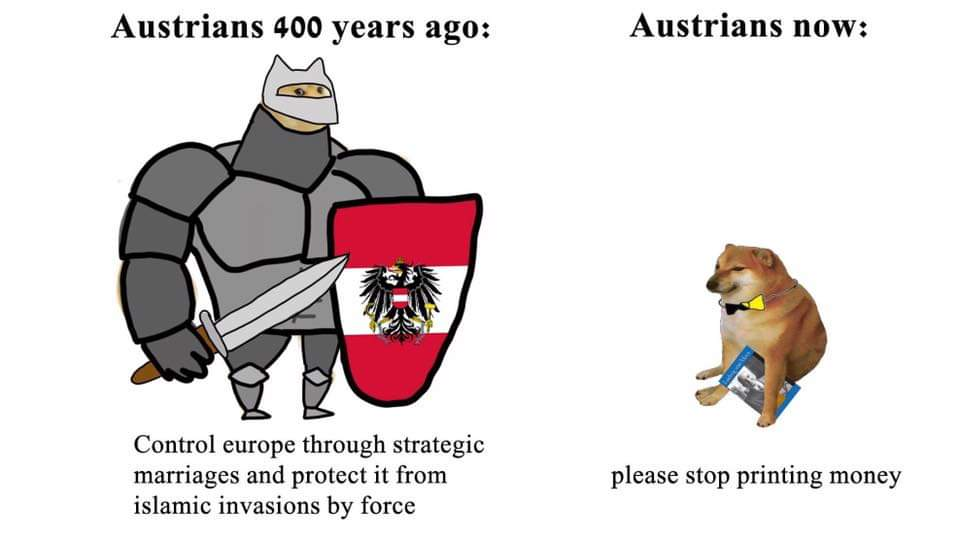

### 2020 - W3F Initiates Launch: Polkadot is Live

• Polkadot’s highly-anticipated release follows three years of development work.

• Launch builds on the success of Kusama canary network release in 2019.

26 May 2020, Zug, Switzerland – Web3 Foundation today launched the initial version of Polkadot, a sharded protocol that allows decentralized blockchain networks to operate together, seamlessly and at scale. Polkadot gives peer-to-peer applications, organizations, businesses, economies – entire digital societies – the agency required to form, grow, govern themselves, and interact without the need for the centralized institutions that we are forced to place our trust in today.

Polkadot is a sharded blockchain, meaning it connects several chains together in a unified network, allowing them to process in parallel and exchange data with strong security guarantees between chains. By parallelizing the workload, Polkadot solves major throughput issues that have thus far hampered decentralized application development. Polkadot’s design offers several distinct advantages over existing and legacy networks, including heterogeneous sharding, scalability, upgradeability, transparent governance and cross-chain composability. Applications from decentralized finance and energy to Internet of Things (IoT) and gaming will thrive on Polkadot.

The development of Polkadot began in 2016. The protocol represents a significant step towards Web3 Foundation founder and President Dr. Gavin Wood’s vision of a decentralized internet, known as Web 3.0. Dr. Wood, a co-founder and former chief technology officer of Ethereum, led the development of Polkadot along with two co-founders and the team at Parity Technologies, led by Dr. Jutta Steiner, CEO.

“Polkadot is, in many respects, the biggest bet in this ecosystem against chain maximalism. Even if there were one perfect chain, I don’t think it would stay perfect for very long. I would argue that it's really not such a good plan to be so focused on backing one winner above all others,” Dr. Wood noted, when discussing the vision for Polkadot.

In response to a question about what he hopes Polkadot and Substrate - its primary blockchain-building framework - will offer, Dr. Wood said: “I really hope we can create a whole new class of development teams and development application where you don't have to know everything, you don't have to do everything to develop your whole new blockchain. But you can do just enough that you do have a domain-specific chain that has its own parameterization and its own features that allow you to get a particular job done – and done well – that wouldn't have been possible before because smart contracts are too bloaty and writing your own chain is too much work.”

“Everything our team has learned since we first built and launched Ethereum in 2015, including the Parity Ethereum client, the World Food Programme’s Building Blocks project, a Zcash client and dozens of private enterprise networks have been wrapped into Substrate,” said Parity Technologies CEO Jutta Steiner, who was previously Chief of Security at the Ethereum Foundation overseeing its launch. “Our team has more experience in building, launching and supporting public networks than nearly any other team in the world. They have all worked incredibly hard to get us to this point, and I want to thank them and everyone who has helped us along the way.”

“Since we began developing Polkadot, we’ve focused on solving critical problems faced by blockchain developers to date,” said Polkadot co-founder, Parity Technologies Core Developer and Thiel Fellowship recipient Robert Habermeier. He continued, “Polkadot is a protocol built by developers for developers. At Parity, we’ve gone to great lengths to generalize our blockchain building framework Substrate to provide a neutral foundation upon which other developers can build the application they want, the way they want it.”

"Since the release of the Polkadot paper three years ago, we have been researching and building the Polkadot protocol, which has greatly advanced our collective understanding of these systems since our early work building Ethereum,” said Polkadot and Web3 Foundation co-founder Peter Czaban. “In particular, we believe Polkadot’s open governance system will allow the network to innovate and grow much more quickly than legacy networks, accelerating the development of mainstream decentralized applications."
Initial phase covers code logic and security audits

During this initial phase, Web3 Foundation will retain superuser control of the network via a “Sudo module.” This period will allow the Foundation and Parity Technologies to execute critical logic and security audits and calibrate final aspects of the network. Independent teams of security auditors will continue working to identify and rectify any vulnerabilities. This process is detailed in the roadmap below:

  

Kusama canary network: The Alpha release of Polkadot’s technology
This release follows Web3 Foundation’s September 2019 launch of Kusama, a canary network that has served as a proving ground for Polkadot’s technology and functionality. At present, a global community of thousands of developers, infrastructure providers and enthusiasts are building on Kusama. Kusama will continue to operate as long as the community finds it useful to build fast and iterate on their ideas in a lower stake, lower security environment built on Polkadot’s core technology.

Kusama has been invaluable to ensure Polkadot's enterprise-grade, production-ready environment is secure and stable. Polkadot's mainnet chain candidate(s) – the potential chain specification(s) we develop and test for stability – will follow much the same launch process used for Kusama, with a few subtle differences. Rather than releasing the "Sudo module" earlier in the process to hand off control to DOT holders, Web3 Foundation will potentially wait to conduct a DOT allocation sale to further decentralize the token distribution. Then the Foundation would relinquish the Sudo module in compliance with applicable rules and regulations in the locations that we operate.

Subsequently, the network will be fully decentralized, and DOT tokens will be issued and released by the Polkadot network once a network-wide governance vote approves it.
Teams building the Polkadot network

Top development teams from around the world have been flocking to Polkadot and Kusama networks. Some highlights include Acala, who are building a cross-chain stablecoin platform; Moonbeam, a smart contract parachain that allows developers to use their existing Ethereum applications on Polkadot; Chainlink, who will be bringing their oracle technology to Polkadot users, KILT, who are building self-sovereign credentials for Web 3.0; Plasm, a layer-2 Dapp scaling platform for Substrate-based chains, Phala, a privacy-preserving data protocol for Polkadot; Laminar, an open finance platform powering synthetic assets; and Darwinia, who are developing a protocol for cross-chain bridges.

Thus far, Web3 Foundation’s Grants Program has distributed nearly five million U.S. dollars to one hundred open-source projects contributing to the Polkadot ecosystem. The program includes two additional Polkadot Host implementations, dozens of components like wallets and block explorers, bridges, and other critical infrastructure and tooling. These teams are spread across the globe, and Web3 Foundation is proud to have them supporting Polkadot. Read more about the 100 Projects Milestone.

---

  

  

### 1986

Wspólnota Europejska przyjęła flagę Unii Europejskiej.

Flaga europejska jest symbolem nie tylko Unii Europejskiej, ale również jedności i tożsamości Europy w szerszym znaczeniu. Na fladze przedstawiony jest okrąg złożony z dwunastu złotych gwiazd na błękitnym tle. Gwiazdy symbolizują jedność, solidarność i harmonię między narodami Europy. Krąg gwiazd jest symbolem jedności, a ich liczba nie zależy od liczby państw członkowskich.

Historia flagi sięga roku 1955, kiedy to Rada Europy – stojąca na straży praw człowieka oraz promująca kulturę europejską – przyjęła obecny projekt. W kolejnych latach Rada Europy zachęcała powstające instytucje europejskie do używania tej samej flagi.

W 1983 r. Parlament Europejski zadecydował, że flaga Rady Europy będzie również oficjalną flagą Unii Europejskiej (wówczas nazywanej Wspólnotami Europejskimi). W 1985 r. przywódcy państw UE opowiedzieli się za jej zatwierdzeniem. Instytucje i organy UE posługują się oprócz flagi europejskiej także własnymi logo.

  

### 1944

Odbyło się w bloku 11 w KL Auschwitz posiedzenie policyjnego sądu doraźnego Gestapo katowickiego, podczas którego, skazano na śmierć około 160-170 osób. Byli wśród nich członkowie ruchu oporu okręgu śląskiego: Kazimierz Jędrzejowski, inżynier Cezary Uthke i prof. Jan Jumach. Na osadzenie w KL Auschwitz skazano około 17 do 20 osób. Wśród osadzonych w obozie był Stanisław Bies, którego w tym samym dniu oznaczono numerem 188478.

Foto: Cezary Uthke - inżynier, dowódca Gwardii Ludowej PPS - WRN w Zagłębiu Dąbrowskim, zastępca komendanta Śląskiego Okręgu Armii Krajowej. Został skazany przez sąd doraźny na karę śmierci. Wyrok wykonano.

  

---

Rząd Rzeczpospolitej Polskiej na uchodźdztwie oddał do brytyjskiej dyspozycji 1 Brygadę Spadochronową generała Stanisława Sosabowskiego sformowaną 9 października 1941 roku.
W początkowych założeniach powstała ona do wykonywania zadań desantowych w Polsce, ale ostatecznie jej działania skupiały się na uczestnictwie w operacjach alianckich na zachodzie Europy ,takich jak, chociażby operacja " Market Garden"przeprowadzona we wrześniu 1944 roku pod Arnhem.
Brygada z dniem 6 czerwca 1944 roku
ostatecznie została podporządkowana
dowództwu brytyjskiemu i weszła w skład 1 Korpusu Powietrznego dowodzonego przez
gen. Browninga.

  

### 1863

W czasie powstania styczniowego pod Salichą na Wołyniu miała miejsce bitwa wojsk polskich pod dowództwem generała Edmunda Różyckiego (grafika) z wojskami rosyjskimi dowodzonymi przez kapitana Łomonosowa.
Bitwa zakończyła się jednym z najbardziej spektakularnych zwycięstw wojsk polskich w historii polskiego oręża, a także całego powstania styczniowego.

  

### 1831

W czasie powstania listopadowego miała miejsce pod Ostrołęką bitwa polskich oddziałów powstańczych pod dowództwem generała Jana Zygmunta Skrzyneckiego z wojskami rosyjskimi pod wodzą generała Iwana Dybicza.
Liczące 30 tysięcy żołnierzy wojska Królestwa Polskiego zostały pokonane przez 35 tysięczne siły wroga. Straty polskie wyniosły około 6,5 tysiąca żołnierzy, straty rosyjskie 5,9 tysiąca.
W 1847 na osobiste polecenie Mikołaja I nad Narwią został wzniesiony pomnik upamiętniający rosyjskie zwycięstwo w bitwie. Został on rozebrany po odzyskaniu niepodległości przez Polskę.

  

### 1648

W czasie Powstania Chmielnickiego miała miejsce bitwa pod Korsuniem.
Przeciwko sobie stanęły- dowodzona przez hetmanów Mikołaja Potockiego i Marcina Kalinowskiego siedmiotysięczna armia polska oraz dwudziestotysięczne wojska kozacko -tatarskie pod dowództwem Bohdana Chmielnickiego i Tuhaj-beja.
Niestety, na skutek wprowadzenia złej taktyki i licznych błędów polskich dowódców bitwa ta zakończyła się klęską, z której ocalało tylko 650 żołnierzy Polskich. Zaś Potocki i Kalinowski trafili do kozackiej niewoli.

  

### 1331

W Chęcinach w województwie świętokrzyskim król Polski Władysław Łokietek zwołał na tamtejszym zamku Zjazd Ziem Polskich. Wydarzenie, które uznawane jest jako początek polskiego parlamentaryzmu Jan Długosz opisał jako generalis omnium terrarum conventus, co można tłumaczyć jako walny zjazd wszystkich ziem Polski.

  

---

<a href="https://github.com/TomaszWaszczyk/historia.waszczyk.com/edit/master/src/content/may-26.md" target="_blank">Edytuj tę stronę dzieląc się własnymi notatkami!</a>
