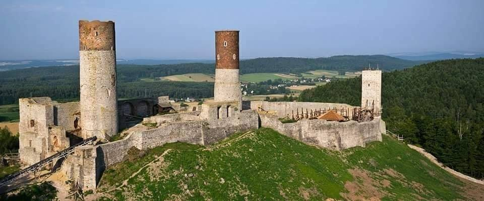

### 2020

  

  

### 1986

Wspólnota Europejska przyjęła flagę Unii Europejskiej.

Flaga europejska jest symbolem nie tylko Unii Europejskiej, ale również jedności i tożsamości Europy w szerszym znaczeniu. Na fladze przedstawiony jest okrąg złożony z dwunastu złotych gwiazd na błękitnym tle. Gwiazdy symbolizują jedność, solidarność i harmonię między narodami Europy. Krąg gwiazd jest symbolem jedności, a ich liczba nie zależy od liczby państw członkowskich.

Historia flagi sięga roku 1955, kiedy to Rada Europy – stojąca na straży praw człowieka oraz promująca kulturę europejską – przyjęła obecny projekt. W kolejnych latach Rada Europy zachęcała powstające instytucje europejskie do używania tej samej flagi.

W 1983 r. Parlament Europejski zadecydował, że flaga Rady Europy będzie również oficjalną flagą Unii Europejskiej (wówczas nazywanej Wspólnotami Europejskimi). W 1985 r. przywódcy państw UE opowiedzieli się za jej zatwierdzeniem. Instytucje i organy UE posługują się oprócz flagi europejskiej także własnymi logo.

  

### 1944

Odbyło się w bloku 11 w KL Auschwitz posiedzenie policyjnego sądu doraźnego Gestapo katowickiego, podczas którego, skazano na śmierć około 160-170 osób. Byli wśród nich członkowie ruchu oporu okręgu śląskiego: Kazimierz Jędrzejowski, inżynier Cezary Uthke i prof. Jan Jumach. Na osadzenie w KL Auschwitz skazano około 17 do 20 osób. Wśród osadzonych w obozie był Stanisław Bies, którego w tym samym dniu oznaczono numerem 188478.

Foto: Cezary Uthke - inżynier, dowódca Gwardii Ludowej PPS - WRN w Zagłębiu Dąbrowskim, zastępca komendanta Śląskiego Okręgu Armii Krajowej. Został skazany przez sąd doraźny na karę śmierci. Wyrok wykonano.

  

---

Rząd Rzeczpospolitej Polskiej na uchodźdztwie oddał do brytyjskiej dyspozycji 1 Brygadę Spadochronową generała Stanisława Sosabowskiego sformowaną 9 października 1941 roku.
W początkowych założeniach powstała ona do wykonywania zadań desantowych w Polsce, ale ostatecznie jej działania skupiały się na uczestnictwie w operacjach alianckich na zachodzie Europy ,takich jak, chociażby operacja " Market Garden"przeprowadzona we wrześniu 1944 roku pod Arnhem.
Brygada z dniem 6 czerwca 1944 roku
ostatecznie została podporządkowana
dowództwu brytyjskiemu i weszła w skład 1 Korpusu Powietrznego dowodzonego przez
gen. Browninga.

  

### 1863

W czasie powstania styczniowego pod Salichą na Wołyniu miała miejsce bitwa wojsk polskich pod dowództwem generała Edmunda Różyckiego (grafika) z wojskami rosyjskimi dowodzonymi przez kapitana Łomonosowa.
Bitwa zakończyła się jednym z najbardziej spektakularnych zwycięstw wojsk polskich w historii polskiego oręża, a także całego powstania styczniowego.

  

### 1831

W czasie powstania listopadowego miała miejsce pod Ostrołęką bitwa polskich oddziałów powstańczych pod dowództwem generała Jana Zygmunta Skrzyneckiego z wojskami rosyjskimi pod wodzą generała Iwana Dybicza.
Liczące 30 tysięcy żołnierzy wojska Królestwa Polskiego zostały pokonane przez 35 tysięczne siły wroga. Straty polskie wyniosły około 6,5 tysiąca żołnierzy, straty rosyjskie 5,9 tysiąca.
W 1847 na osobiste polecenie Mikołaja I nad Narwią został wzniesiony pomnik upamiętniający rosyjskie zwycięstwo w bitwie. Został on rozebrany po odzyskaniu niepodległości przez Polskę.

  

### 1648

W czasie Powstania Chmielnickiego miała miejsce bitwa pod Korsuniem.
Przeciwko sobie stanęły- dowodzona przez hetmanów Mikołaja Potockiego i Marcina Kalinowskiego siedmiotysięczna armia polska oraz dwudziestotysięczne wojska kozacko -tatarskie pod dowództwem Bohdana Chmielnickiego i Tuhaj-beja.
Niestety, na skutek wprowadzenia złej taktyki i licznych błędów polskich dowódców bitwa ta zakończyła się klęską, z której ocalało tylko 650 żołnierzy Polskich. Zaś Potocki i Kalinowski trafili do kozackiej niewoli.

  

### 1331

W Chęcinach w województwie świętokrzyskim król Polski Władysław Łokietek zwołał na tamtejszym zamku Zjazd Ziem Polskich. Wydarzenie, które uznawane jest jako początek polskiego parlamentaryzmu Jan Długosz opisał jako generalis omnium terrarum conventus, co można tłumaczyć jako walny zjazd wszystkich ziem Polski.

  

---

<a href="https://github.com/TomaszWaszczyk/historia.waszczyk.com/edit/master/src/content/may-26.md" target="_blank">Edytuj tę stronę dzieląc się własnymi notatkami!</a>
