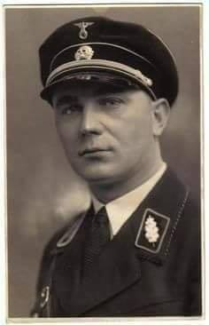
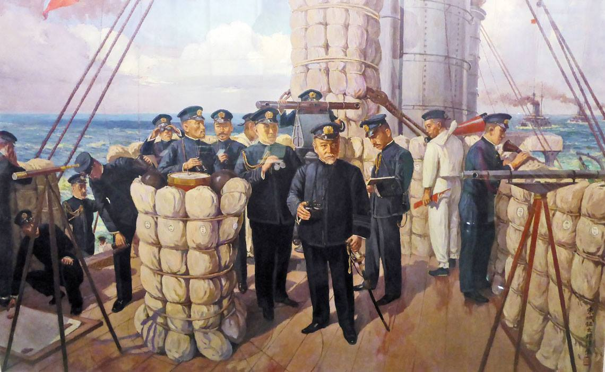

### 2020 - Niemcy zjednoczone czy niezjednoczone..?

"Bild": Landy zbuntowały się przeciw Merkel

Mimo że Niemcy są państwem federalnym, to w ostatnich tygodniach wiele decyzji zapadało na szczeblu centralnym. Kanclerz Merkel od tygodni pozostawała sceptyczna wobec pomysłów luzowania obostrzeń.
Część landów jednak już nie chce słuchać zaleceń władz centralnych i premierzy regionów sami podejmują decyzje odnośnie obostrzeń. Prym wiedzie tutaj Winfried Kretschmann premier Badenii-Wirtembergii.
Władze centralne próbowały przedłużyć do 5 lipca zakaz spotkań powyżej 10 osób w prywatnych domach. Ten zakaz miałby obejmować całe Niemcy. Te plany jednak spaliły na panewce, a kolejne niemieckie landy powoli zaczynają zdejmować obostrzenia.
Brandenburgia ma już od jutra zezwolić na msze oraz demonstracje z udziałem do 150 osób. Władze landu przygotowują się też do obchodów 30. rocznicy zjednoczenia Niemiec.
Z kolei Badenia-Wirtembergia zezwoliła od 1 czerwca na organizację imprez urodzinowych i wesel na wolnym powietrzu. Może w nich brać udział do 20 osób. Władze landu zezwoliły od 2 czerwca na otwarcie barów i restauracji. Kolejne kraje związkowe pozwalają również na otwieranie kin.

> Zjednoczenie Niemiec to był projekt dla mediów i biednych ludzi. W rzeczywistości nic takiego nie miało miejsca. (rzeczywistość = kapitał)
<!-- Relayr - I am not German, I am Bavarian-->

---

  

### 1941

Władze Kraju Warty wprowadziły dla księży zakaz oddawania posług duchownych Niemcom. Nie był to pierwszy tego typu akt prawny zakazujący praktyk religijnych. Wcześniej wprowadzono zakaz używania jezyka polskiego przez dzieci przygotowujące się do pierwszej komunii świętej oraz nakaz usunięcia wszystkich symboli i emblematów religijnych z polskimi napisami.
Zdjęcie namiestnik Rzeszy w Kraju Warty obergruppenführer SS Arthur Greiser.

  

### 1905

Tōjō Shōtarō - Admirał Heihachirō Tōgō na mostku flagowego pancernika Mikasa podczas bitwy pod Cuszimą.

Stoczona w dniach 27-28 maja 1905 roku bitwa pod Cuszimą jest jedną z najważniejszych bitew morskich w historii. Miażdżące zwycięstwo Japończyków nie tylko doprowadziło do unicestwienia rosyjskiej floty, ale również sprawiło, że Japonia dołączyła do grona światowych mocarstw. Jednym z istotnych skutków bitwy było również całkowite zrewidowanie dotychczasowych taktyk walki na morzu.

  

---

<a href="https://github.com/TomaszWaszczyk/historia.waszczyk.com/edit/master/src/content/may-27.md" target="_blank">Edytuj tę stronę dzieląc się własnymi notatkami!</a>
