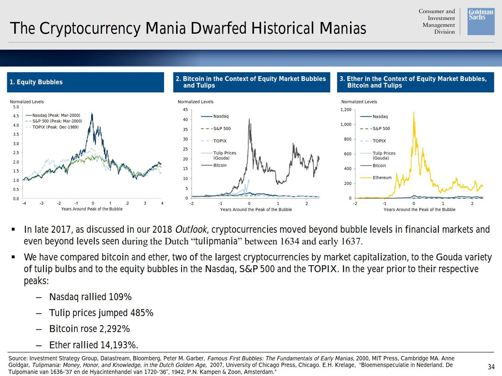

### 2020

### RPP drastycznie tnie stopy procentowe niemal do zera, ponieważ obawia się... zbyt niskiej inflacji

Na czwartkowym posiedzeniu Rada Polityki Pieniężnej (RPP) zadecydowała o kolejnej znacznej obniżce stóp procentowych, w tym najważniejszą referencyjnej z 0,5 do zaledwie 0,1 proc. Przez pięć lat ze stopami nic się nie działo, a teraz od 17 marca do dziś zostały one ścięte niemal do zera (referencyjna z 1,5 do 0,1 proc.).
W komunikacie czytamy, że NBP nadal będzie prowadził skup skarbowych papierów wartościowych oraz papierów wartościowych gwarantowanych przez Skarb Państwa na rynku wtórnym, a także oferował kredyt wekslowy na refinansowanie kredytów udzielonych przedsiębiorstwom przez banki.

  

---

  

---

### Minister wysyła nauczycieli na zbiory. Mogą tam zarobić kilka razy więcej niż w szkole

Minister rolnictwa proponuje, by nauczyciele bez pracy zatrudnili się sezonowo u rolników - na przykład przy zbiorach owoców. "Nauczyciele biorą sobie do serca takie rady" - słyszymy w ZNP. I dorabiają, bo zarobki są niemal wszędzie wyższe niż w edukacji.

  

### 1981

Po ciężkiej chorobie zmarł Stefan Wyszyński - prymas Polski.

Święcenia kapłańskie przyjął 3 sierpnia 1924 we włocławskiej bazylice katedralnej z rąk biskupa Wojciecha Owczarka. W latach 1925–1929 był studentem Wydziału Prawa Kanonicznego oraz Wydziału Prawa i Nauk Ekonomiczno-Społecznych Katolickiego Uniwersytetu Lubelskiego, który ukończył z doktoratem na temat Prawa rodziny, Kościoła i państwa do szkoły.
W 1931 był wikariuszem w parafii Świętej Rodziny w Przedczu.
Pełnił stanowisko duszpasterza w Stowarzyszeniu Młodzieży Akademickiej ,,Odrodzenie'' i Chrześcijańskich Związkach Zawodowych. Był redaktorem naczelny ,,Ateneum Kapłańskiego''. Od 1937 roku był członkiem Rady Społecznej przy prymasie Polski. W czasie okupacji był poszukiwany przez Niemców, ukrywał się m.in. w Laskach pod Warszawą. W czasie powstania warszawskiego sprawowała obowiązki kapelana grupy "Kampinos" Armii Krajowej. W latach 1946-48 był biskupem lubelskim, od 1948 arcybiskupem metropolitą gnieźnieński i warszawski, prymasem Polski w latach 1948–1981, a od 1953 kardynałem. Był internowany (IX 1953-X 1956) przez władze Polski Ludowej. Był inicjatorem Ślubów Narodu na Jasnej Górze (1956), orędzia do biskupów niemieckich w sprawie pojednania obu narodów (1965), obchodów millenium chrześcijaństwa w Polsce (1966) Jako Prymas Tysiąclecia przyczynił się do zachowania niezależności Kościoła zagrożonego przez system komunistyczny, wielokrotnie występował w obronie praw człowieka i narodu. Jego autorytet moralny odegrał istotną rolę w łagodzeniu napięć i konfliktów społecznych w Polsce, m.in. 1980-81. Był autorem licznych publikacji, m.in. Kazania świętokrzyskie, autobiografia Zapiski więzienne. Pochowany w bazylice archikatedralnej św. Jana Chrzciciela w Warszawie. Od 20 maja 1989 roku przysługuje mu tytuł Sługi Bożego w związku ze wszczętym procesem beatyfikacyjnym. W 1994 roku pośmiertnie odznaczony Orderem Orła Białego. W 1999 roku Akademia Teologii Katolickiej w Warszawie zmieniła nazwę swej placówki edukacyjnej na Uwiersytet Kradynała Stefana Wyszyńskiego.

  

### 1975

Sejm PRL uchwalił o nowym podziale administracyjnym kraju.
Utworzono 49 województw, zlikwidowano pośredni szczebel administracyjny, czyli powiaty . Najbardziej charakterystyczne dla
dawnego podziału było to, iż tylko nieliczne województwa miały więcej niż 1 mln mieszkańców oraz fakt, że stolicami nowych województw zostały w wielu przypadkach średnie bądź małe, prowincjonalne miasta.
Nie było podziału na gminy miejskie, miejsko-wiejskie i wiejskie , lecz na miasta i gminy jako podstawowe jednostki administracyjne. W pierwszym dniu obowiązującego nowego podziału, czyli 1 czerwca 1975 roku, Polska dzieliła się na 2343 gminy i 814 miast (w tym 4 miasta o szczególnym statusie – Warszawa , Łódź, Kraków i Wrocław – z wewnętrznym podziałem na dzielnice jako pomocnicze
jednostki administracyjne), a więc na 3157 jednostek najniższego rzędu.
Podział ten obowiązywał do 31 grudnia 1998 roku,kiedy to wprowadzono istniejący obecnie.

  

### 1945

W Warszawie odbyło się spotkanie prezydenta Krajowej Rady Narodowej Bolesława Bieruta z szefem misji wojskowej ZSRR w Polsce generałem Siergiejem Szatiłowem. Ustalono wówczas, że będąca do tego czasu w rękach komendantów wojennych władza regionalna przejdzie w ręce specjalnych pełnomocników. Kompetencje komendantów zostaną zaś ograniczone do zarządzania podległymi garnizonami oraz sprawami zaopatrzenia wojsk.

  

### 1942

W lesie sękocińskim w okolicach Magdalenki komando SS dokonało zbrodni na 223 więźniach Pawiaka.
Ofiarami byli przedstawiciele polskiego ruchu oporu oraz ludzie reprezentujący środowiska kulturalne i inteligenckie. Wśród zamordowanych znalazły się 22 kobiety.
Egzekucja w Lesie Sękocińskim rozpoczęła się 28 maja ok. godziny 3:00 i trwała mniej więcej do godziny 14:00. Mieszkańcy
Magdalenki oraz pobliskich wsi Lesznowola i Łazy słyszeli wówczas dochodzące z lasu
odgłosy strzałów. W międzyczasie
gestapowskie „budy” kilkukrotnie
wyjeżdżały i powracały na Pawiak po kolejne partie skazańców. Jako ostatnie wywieziono na śmierć przetrzymywane w kaplicy kobiety – m.in. 70-letnią Mariannę Wawer oraz obłożnie chore Janinę Górską i Janinę Kardej-Zamajską (zabrane na noszach z więziennego szpitala). W skład plutonu egzekucyjnego weszli niemieccy i ukraińscy wachmani z załogi Pawiaka.
Tragizm całej sytuacji pogarsza fakt, że w celu ukrycia miejsca tej zbrodni posadzono tam las brzozowy.

  

### 1914

Zamach dokonany przez Gavrilo Principa na arcyksięcia Franciszka Ferdynanda. Iskra, która podpaliła lont

  

### 1871

Nastąpił upadek Komuny Paryskiej.

Zakończył się tzw. krwawy tydzień, podczas którego wojska wierne urzędującemu w Wersalu rządowi Ludwika Thiersa stłumiły Komunę Paryską, lewicową rewoltę w stolicy Francji. Jej wybuch w nocy z 17 na 18 marca sprowokował cały ciąg wydarzeń: porażkę w wojnie z Niemcami, upokarzające warunki kapitulacji (m.in. strata Alzacji i niemiecka defilada w centrum Paryża), ale także zapowiedzianą restaurację monarchii, co dla lewicowych ugrupowań reprezentujących tysiące żyjących w nędzy robotników było nie do przyjęcia. Powstańcy opanowali miasto, proklamowali komunę i po wyborach ogłosili nowe władze. Utrzymali Paryż ponad dwa miesiące, a podczas "krwawego tygodnia" wersalczycy rozstrzelali ok. 30 tys. komunardów.

  

### 1642

Miały miejsce we Wloszczowej objawienia maryjne.
Maryja ukazała się w towarzystwie św. Józefa i św. Joachima.
Matka Boska ukazała się w ubogim, niezamieszkanym domu leżącym przy rynku. Towarzyszyły temu liczne uzdrowienia.
Zdarzenie zostało opisane i udokumentowane.
Na podstawie świadectw ludzi, którzy doświadczyli łask i skrupulatnych studiów nad
nimi, ówczesny Prymas Polski Maciej Łupieński wydał zgodę na wybudowanie w mieście kaplicy, do której w 1646 r. uroczyście
wprowadzono obraz Matki Bożej
Włoszczowskiej.
Obraz przedstawiający Matkę Bożą
Niepokalanie Poczętą z Dzieciątkiem na ręku, w otoczeniu św. Joachima i św. Józefa sprowadził z Krakowa ks. Jakub Chrostkiewicz kanonik kolegiaty kurzelowskiej. Dwa lata później włoszczowska kaplica została
konsekrowana, a w jedną z jej ścian wmurowano tablicę upamiętniającą historię objawień.

  

### 1349

Doszło do wystąpień antyżydowskich we Wrocławiu i Świdnicy. Żydów posądzono o roznoszenie zarazy dżumy. Spalono w tych miastach dzielnice żydowskie , a ocalałych mieszkańców zmuszono do osiedlenia się poza murami miasta. Rok później doszło do pogromu w Złotym Stoku.

  

---

<a href="https://github.com/TomaszWaszczyk/historia.waszczyk.com/edit/master/src/content/may-28.md" target="_blank">Edytuj tę stronę dzieląc się własnymi notatkami!</a>
