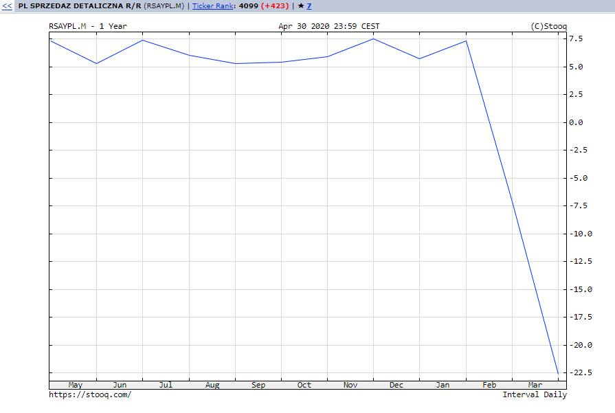
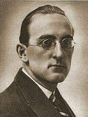
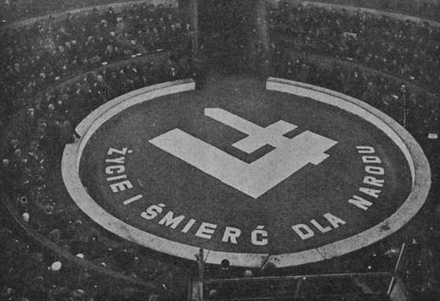
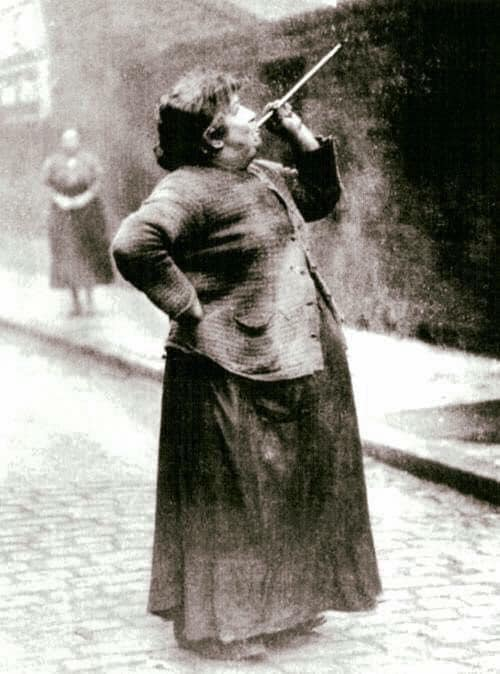
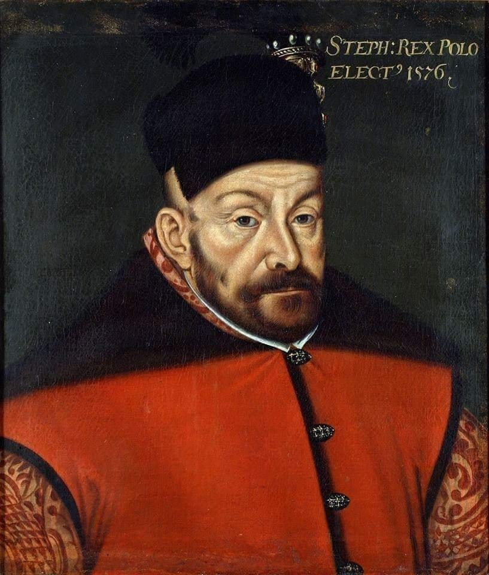
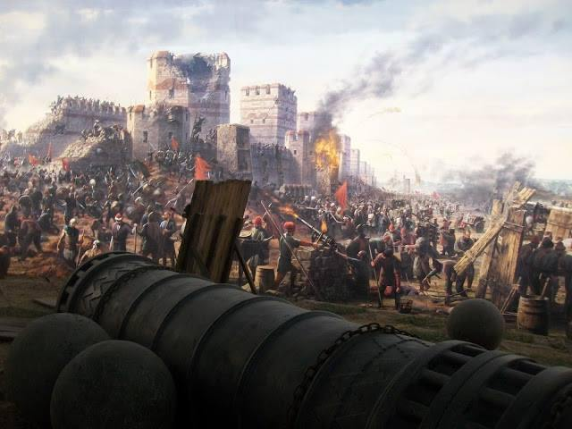
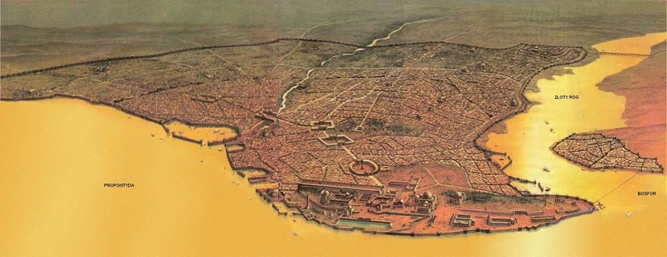
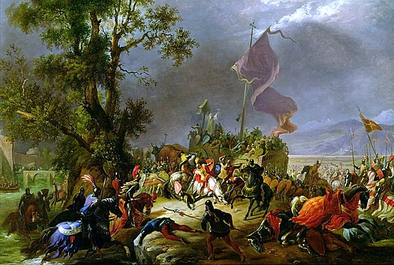

### 2020

> "Z trudem przyszłoby mi poszukać tak absurdalnej decyzji banku centralnego jak dzisiejsza obniżka stóp procentowych przez RPP. Nie znajduję ani jednego merytorycznego argumentu na poparcie tej decyzji"

skomentował Janusz Jankowiak, główny ekonomista Polskiej Rady Biznesu.

> Janusz Jankowiak: Zostawcie stopy w spokoju

Jankowiak: NBP doprowadzi do kryzysu w sektorze bankowym
"Niski koszt pieniądza ma spowodować m.in. wzrost zainteresowania kredytem zarówno po stronie firm, jak i gospodarstw domowych. Tymczasem gospodarstwa domowe z całą siłą » włączyły« tryb oszczędzania, na co wskazuje raportowany przez banki spadek popytu na kredyty konsumpcyjne i hipoteczne, firmy zaś widząc brak popytu na ich towary i usługi, także nie chcą się zadłużać. Z drugiej strony sektor bankowy, już przed kryzysem istotnie obciążony, z jeszcze większą ostrożnością musi analizować komu i na jakich warunkach może pożyczać pieniądze. Niestety zbyt duże obniżki stóp procentowych mogą prowadzić do destabilizacji systemu finansowego" – ostrzega ekonomistka Banku Pocztowego.

---

  

---

### 1942

Fragment listu Jana Lechonia (zdjęcie) poety i prozaika, współzałożyciela grupy poetyckiej Skamander do Juliana Tuwima z dnia 29 maja 1942 roku:
" Mój Drogi !
Ostatnia nasza rozmowa telefoniczna, dopełniając miary Twoich niezliczonych odezwań się pełnych ślepej miłości do bolszewików, katów i morderców narodu polskiego, przekonała mnie, że nie uda mi się już dłużej oddzielać Twoich poglądów politycznych od Twojej osoby i że będzie ona między nami na zawsze ostatnią".

  

### 1934

W Warszawie bojówka Obozu Narodowego Radykalnego ostrzelała siedzibę Polskiej Partii Socjalistycznej na Woli. Rany odniosło 7 osób. PPS-owskie bojówki w odwecie zaatakowały lokale należące do narodowców. Tak te wydarzenia wspominał działacz PPS pułkownik Tadeusz Koral, w latach 1945-48 wojewoda olsztyński:
"Warszawska PPS mobilizuje swoje siły. Członkowie partii, OMTUR i ZNMS przystępują do akcji bojowej. Robotnicy czynnie likwidują bojówki oenerowskie. Odbywa się zrywanie „mieczyków Chrobrego” – oznak ONR. Już nie tylko na Woli, Mokotowie czy Pradze, ale na ulicach centrum Warszawy trwają walki. W tym czasie oznaką ruchu socjalistycznego były trzy strzały: Przeciw wojnie, faszyzmowi i nacjonalizmowi. Wszyscy te oznaki nosili w klapie. (…) Na uczelniach razem z nami walczyli towarzysze z „Życia”. Broniliśmy kolegów Żydów, którym kazano zajmować miejsca w audytoriach po lewej stronie".

  

### 1895

W czasach, kiedy budziki nie były łatwo dostępnym towarem i co więcej drogim i ekskluzywnym, ludzie jak Mary Smith na tym zdjęciu, byli zatrudniani, aby budzić ludzi rano o określonej porze na zamówienie.
Na fotografii widzimy Panią Smith strzelającą z rurki suszonym groszkiem w okna klienta. Londyn, 1895.

  

### 1580

Król Stefan Batory otrzymał od papieża Grzegorza XIII tytuł "Fidei defensor". Było to papieskie uznanie zasług Batorego w obronie wiary i tradycji chrześcijańskich, a także nagroda za zasługi i zachęta do dalszych działań przeciwko Turkom i Tatarom.

  

### 1453

https://pl.wikipedia.org/wiki/Upadek_Konstantynopola

Po trwającym od 6 kwietnia oblężeniu Konstantynopol został zdobyty  przez wojska osmańskie pod wodzą sułtana Mehmeda II. W czasie obrony  miasta poległ ostatni cesarz bizantyński Konstantyn XI Paleolog.

Bizancjum nigdy się nie podniosło po pamiętnym roku 1204, w którym  krzyżowcy IV wyprawy zdobyli i splądrowali Konstantynopol. Mimo upadku  Cesarstwa Łacińskiego (katolickiego tworu powstałego na gruzach  Bizancjum), mimo sławnych Nieszporów Sycylijskich i zażegnania  niebezpieczeństwa ze strony Karola Andegaweńskiego, restaurowane  imperium było już tylko skarlałym tworem, ekonomicznie podporządkowanym  republikom włoskim i nieustannie cierpiącym na brak pieniędzy. W 1347  doszło do symbolicznego wydarzenia - klejnoty w diademach użytych do  koronacji cesarza i jego żony zostały zrobione ze szkła.

Wciąż  jednak istniał sam Konstantynopol, najsławniejsze i najwspanialsze  miasto, w którym kiedyś była ¼ część skarbów całego świata. Jednak gdy  przyszło do kolejnej wojny w pamiętnym roku 1453, w ogromnym mieście  otoczonym prawie trzydziestokilometrowymi murami było zaledwie 4983  ludzi zaznajomionych z bronią … Bez pomocy Zachodu atak tureckiej armii,  najnowocześniejszej na świecie i składającej się z 80 tys. regularnego  wojska, wyposażonego w znakomitą artylerię, po prostu musiał się  skończyć sukcesem.

Postać Konstantyna XI  Paleologa, ostatniego bazyleusa, przeszła do legendy tuż po jego  śmierci, podczas zdobycia Konstantynopola przez Turków osmańskich, 29  maja 1453 r. Gdy wojska Mehmeda II wdarły się na mury Konstantynopola,  cesarza miał uratować Anioł, który zamienił go w marmur i ukrył w Złotej  Bramie. Tam śpiący władca miał czekać na przebudzenie, aby wyzwolić  miasto od niewiernych. Osmanowie doskonale rozumieli wpływ tego  proroctwa na greckich poddanych i kazali zamurować Złotą Bramę, aby nikt  nie próbował szukać tam ciała Konstantyna.

Konstantyn XI urodził  się 8 lutego 1405 r. jako czwarty z siedmiu synów cesarza Manuela II  Paleologa i Heleny Dragasz. Początkowo nikt nie brał go pod uwagę jako  przyszłego cesarza. Chociaż w Bizancjum to nie prawo starszeństwa  odgrywało decydującą rolę – inaczej niż w Europie Zachodniej – to  następcą Manuela zostać miał starszy brat Konstantyna, Jan. Tak też się  stało – po śmierci Manuela II w 1425 r., na tronie zasiadł Jan VIII.  Konstantyn doceniany przez brata jako dobry strateg i polityk pozostawał  jego bliskim współpracownikiem. Jednocześnie sprawował rządy w Morei –  jednej z ostatnich posiadłości bizantyńskich na Peloponezie. Pozostali  synowie Manuela II patrzyli mało przychylnym okiem na współpracę cesarza  z Konstantynem, zwłaszcza, kiedy stało się jasne, że Jan nie doczeka  się potomka, a swoim następcą namaści Konstantyna.

Jako władca w  Mistrze, Konstantyn pragnął rozszerzyć bizantyńskie wpływy. W roku 1444,  wykorzystując zaangażowanie Osmanów w odparcie nadciągających z Europy  wojsk pod przewodnictwem króla Polski i Węgier, Władysława Warneńczyka,  zaatakował terytoria w środkowej Grecji. Jego sukcesy były znaczące –  zdobył Ateny oraz Teby i znaczny obszar Grecji. W listopadzie 1446 r.  sułtan osmański, Murad II skierował wojska do Grecji, którą szybko  zajął. Konstantynowi pozwolono utrzymać szczątki niezależności, w zamian  za płacenie corocznego trybutu. Konstantyn zmuszony do rezygnacji z  ekspansji, uwagę poświęcił kulturalnemu rozwojowi Morei, która w latach  jego panowania stała się prężnym ośrodkiem nauki i sztuki.

31  października 1448 r. zmarł Jan VIII. Matka cesarza, Helena, aby nie  dopuścić do przejęcia tronu przez swoich starszych synów, Tomasza i  Demetriusza, ogłosiła się regentką oczekując przybycia najmłodszego  syna. Koronacja Konstantyna XI miała miejsce w mieście Mistra na  Peloponezie i choć istniały zastrzeżenia co do jej prawomocności (m.in.  koronacji dokonał miejscowy biskup, a nie, jak było praktykowane dotąd,  patriarcha Konstantynopola), to nikt nie miał wątpliwości, kto jest  bazyleusem.

Konstantyn przybył do stolicy 12 marca 1449 r. Jednym  z jego pierwszych działań było wysłanie poselstwa do sułtana w celu  podpisania pokoju zabezpieczającego zarówno Konstantynopol, jak i  despotat Morei. Kolejnym, niezwykle ważnym problemem była kwestia  następstwa tronu. Konstantyn nie miał potomka, a obydwie jego żony  zmarły przedwcześnie. Jego bracia także nie mieli synów. Jednak sytuacja  polityczna i niebezpieczeństwo wojny utrudniały wyszukanie odpowiedniej  kandydatki i sprowadzenie jej nad Bosfor.

Dodatkowo, sytuacja  wewnętrzna Cesarstwa nie była łatwa z powodu, który wstrząsał jego  jednością przynajmniej od czasów sporu o Filioque w VIII w. Była ta  jedna z kluczowych spraw doktrynalnych i dotyczyła pochodzenia Ducha  Świętego; w późniejszym czasie chodziło o utrzymanie niezależności  Kościoła Wschodniego albo podporządkowanie papieżowi – z tego powodu  dochodziło w Bizancjum do licznych rozłamów, a nawet wojen domowych.

Od momentu podpisania unii we Florencji (1439 r.), środowisko w  Konstantynopolu po raz kolejny podzieliło się na zwolenników i  przeciwników porozumienia z Rzymem. Konstantyn nie był entuzjastą  zjednoczenia Kościołów, ale wiedział, że tylko unia może gwarantować  pomoc zbrojną z Zachodu przeciwko Turkom. Czuł, że wojna jest  nieunikniona i może być to ostatnie starcie Cesarstwa.

Sułtan Murad II zmarł w lutym 1451 r. Jego następcą został  dziewiętnastoletni Mehmed. Młody sułtan zrobił dobre wrażenie na  posłach, którzy przybyli do Adrianopola z różnych części Europy –  odnawiał przymierza, podpisywał traktaty i nawiązywał kontakty handlowe.  Wobec bizantyńskich wysłanników przysięgał na Allaha i Koran, że do  końca życia pozostanie w pokojowych stosunkach z Konstantynopolem i  cesarzem Konstantynem. Jednak kiedy w kwietniu 1452 r. rozpoczął budowę  twierdzy Rumeli Hisar u ujścia Bosforu, naprzeciwko istniejącej już  Anadolu Hisar, stało się jasne, że to początek wojny. Od tej chwili  Osmanowie całkowicie kontrolowali ruch przez cieśninę.

Konstantyn  XI ostatnie nadzieje pokładał w obiecywanej pomocy z Zachodu: wysyłał  emisariuszy do Hunyady’ego na Węgrzech, Alfonsa, króla Neapolu,  Genueńczyków i Wenecjan oraz papieża Mikołaja V, którego szczera troska  nie przerodziła się ostatecznie w żadną wymierną pomoc. Cesarz  rzymsko-niemiecki Fryderyk III wysłał Mehmedowi ultimatum bez pokrycia, a  Alfons Aragoński przysłał do Konstantynopola statek z pożywieniem.  Pomocy udzieliła Wenecja, której handel był zagrożony przez politykę  Mehmeda.

Mehmed II ze swoją armią stanął pod murami  Konstantynopola 5 kwietnia 1453 r. Teraz od postawy cesarza zależało,  czy obrońcy wytrzymają nierówną walkę: naprzeciwko 7 tys. Bizantyńczyków  i Wenecjan stało 80 tys. Turków. Otuchy dodawało jednak istnienie  słynnych murów okalających Konstantynopol, których nikt nigdy nie  zdobył. 6 kwietnia cesarz opuścił swój pałac i na stałe przeniósł się na  mury, aby z bliska obserwować działania Turków, którzy rozłożyli wielki  obóz pod Miastem. W obozie wojskowym pod murami pozostał aż do jego  zdobycia, dowodząc obroną z pierwszej linii.

Konstantyn zdawał  się nie upadać na duchu, chociaż bombardowania tureckie nasilały się z  każdym dniem. Nocą 18 kwietnia pierwszy raz zaczęto szturmować mury,  jednak bezskutecznie – obrona wytrzymała. Cesarz wciąż czekał na pomoc z  Zachodu, będąc pewnym, że statki wysłane w sukurs obleganemu Miastu,  muszą być już blisko, a jedynie boją się przepłynąć blisko tureckiej  floty. 3 maja wysłał kilka mniejszych okrętów, których załogi przebrane  za Turków, miały wypatrzeć przypływające z pomocą statki. Jednak jeszcze  tego samego dnia do Konstantynopola dotarły złe wieści – na horyzoncie  żadnej floty nie było widać. Bazyleus powierzył sprawę miasta oraz  siebie Jezusowi Chrystusowi i Jego Matce Świętej Maryi.

Konstantyn, choć stracił nadzieję na ocalenie, nie zamierzał się  poddawać. Dowiedziawszy się, że Osmanowie próbują wysadzić mury,  podkopując je i podkładając bomby, rozkazał drążyć tunele pod murami od  strony Miasta i zabijać kryjących się tam Turków. W ten sposób  kilkukrotnie udało się uratować mury przed wysadzaniem.

Oblężenie  Konstantynopola przedłużało się, bombardowania tureckie stawały się  coraz silniejsze, a liczba obrońców miasta była coraz mniejsza.  Konstantyn wiedział, że ostateczny szturm nastąpi wkrótce. 28 maja w  obozie tureckim panowała niezwykła i złowróżbna cisza – odpoczywano  przed walką. Wspólne niebezpieczeństwo zjednoczyło wszystkich  podzielonych dotąd mieszkańców Konstantynopola i jego obrońców we  wspólnej procesji i nabożeństwie w bazylice Hagia Sophia. Procesję  poprowadził Konstantyn. Na jej zakończenie która – choć jej treść nie  przetrwała do naszych czasów – przeszła do historii. Mowa bazyleusa była  wedle historyka Edwarda Gibbona żałobną oracją na pogrzebie cesarstwa  rzymskiego, jednak przede wszystkim nawołaniem do walki, dowodem odwagi i  niezłomności ducha. Dla obrońców Konstantynopola kluczowym było, że  cesarz zachował spokój, pokazał przywiązanie do Cesarstwa i poddanych  oraz silny charakter.

29 maja Konstantyn XI stał na swoim  posterunku przy bramie Świętego Romana. Cesarz przeczuwał, że tego dnia  nastąpi ostateczny atak. Z jego rozkazu zabiły dzwony we wszystkich  kościołach w mieście. Wraz ze wschodem słońca na mury wdarły się  oddziały osmańskie przez wyłom pod bramą Świętego Romana.
Od tego  momentu brak w źródłach pewnych informacji na temat losu cesarza. Jedna  z wersji, przytoczona przez weneckiego kronikarza Nicolo Barbaro mówi,  że gdy tylko Turcy weszli do miasta, Konstantyn miał błagać swoich  towarzyszy, aby go zabili, a gdy ci odmówili, cesarz rzucił się ze swym  mieczem do walki z furią, upadał i podnosił się, aż zginął. Według wielu  relacji Konstantyn XI miał umrzeć jak zwykły żołnierz, zdejmując  jeszcze przed szturmem wszystkie insygnia. Z tego powodu Osmanowie z  trudem mogli odnaleźć później jego ciało pośród setek poległych. Cesarza  poznano jedynie po purpurowych butach. Głowa Konstantyna stała się  najcenniejszych trofeum Mehmeda II, które z dumą wywieziono do  Adrianopola.

Znamiennym jest, że pierwszym z bizantyńskich cesarzy był Konstantyn  Wielki (notabene, jego matką była również Helena, mająca niebagatelny  wpływ na losy syna), który chrześcijaństwo uczynił równoprawną religią w  Cesarstwie, ostatnim zaś Konstantyn XI Paleolog, który w obronie  Bizancjum i chrześcijaństwa zginął.
Konstantyn przez cały okres  swego panowania pragnął ocalić to, co pozostało z Cesarstwa  Bizantyńskiego. Osamotniony w świecie chrześcijańskim, dopiero kosztem  wyrzeczenia się ortodoksji, uzyskał obietnicę pomocy zbrojnej z Zachodu,  która nigdy nie nadeszła. Podczas oblężenia Konstantynopola cesarz  pokazał, że jest silnym władcą, który w najtrudniejszych chwilach jest  blisko poddanych. Mając możliwość ucieczki z miasta miał powiedzieć, że  zostaje, by umierać ze swym ludem. Pozostał z nim do końca, stojąc na  murach i strzegąc ostatniego bastionu Cesarstwa Bizantyńskiego przed  osmańskim naporem.

Po zdobyciu miasta sułtan swe pierwsze kroki  skierował do najwspanialszej budowli świata, do kościoła-bazyliki, Hagia  Sofia, budowli wyjątkowej jak samo miasto. Przed wrotami zsiadł z konia  i wysypał garść ziemi na swój turban, po czym otoczony przez janczarów  wszedł do środka. Jeden z ulemów zaintonował z ambony „nie ma Boga prócz  Allaha” i tak najważniejszy kościół świata stał się najważniejszym  meczetem, sułtan zaś został cesarzem rzymskim. Skończył się  Konstantynopol a powstał Stambuł.

Być może niektórzy z was  zdziwią się owym tytułem „cesarza Rzymu”, ale tak naprawdę było. Mehmed  II był jednym z najinteligentniejszych i najlepiej wykształconych  władców w historii. Był zakochany w antyku i uwielbiał legendy o  Achillesie. Znał też doskonale i rozumiał historię Imperium Romanum,  zresztą nawet przez Greków szybko zaczął być traktowany jak prawdziwy  spadkobierca cesarzy. Jego uwielbienie dla sztuki i literatury, no i  oczywiście hojne traktowanie artystów, dało temu swój wyraz.

  

  

### 1176

V wojna włoska Fryderyka Barbarossy: rycerstwo cesarskie poniosło klęskę w bitwie z oddziałami Ligi Lombardzkiej pod Legnano. Fryderyk I Barbarossa uznał autonomię miast włoskich.

W maju 1176 roku do północnej Italii dotarły posiłki wojskowe z Niemiec w liczbie około dwóch tysięcy zbrojnych. W tym czasie w okolicach Bolonii przebywał ze swoją zwycięską armią biskup Chrystian z Moguncji. Pod koniec poprzedniego roku pokonał w bitwie pod Castel de' Britti armię Bolonii, a 14 marca zwyciężył pod Carsoli wojska króla Sycylii Wilhelma.

Cesarz liczył na połączenie tych dwóch armii, aby z wystarczającymi siłami przystąpić do działań przeciwko Włochom. Do tego nie chcieli dopuścić dowódcy Ligi Lombardzkiej, którzy, nie czekając na koncentrację całej armii, ruszyli w kierunku wojsk znienawidzonego cesarza. Mimo to ich armia miała kilkukrotną przewagę. Fryderyk I Barbarossa widząc to powinien był unikać potyczki przed połączeniem swych sił, ale widocznie liczył na cud i bitwę przyjął.

29 maja 1176 roku obie armie zajęły pozycje pod Legnano nad rzeką Oloną. Liczący trzystu rycerzy niemiecki oddział przedni wpadł na składającą się z siedmiuset jezdnych szpicę Lombardczyków. Cesarz musiał pośpieszyć im z pomocą. W innym miejscu niemieckie rycerstwo uderzyło z dużym impetem na lombardzką jazdę, która w dzikiej ucieczce stratowała szeregi własnych wojsk. Niemcy, prowadzeni przez cesarza, dotarli do głównego sztandaru nieprzyjaciela. Włosi uznali bitwę za przegraną i umknęli, chroniąc się za murami Mediolanu.

W tym czasie niemiecki atak załamał się w miejscu, gdzie broniły się dwa piesze oddziały mediolańskie pod dowództwem Alberto Giussano. Tutaj na włóczniach mediolańczyków zatrzymał się impet niemieckiego ataku. Kiedy sytuacja na polu bitwy zmieniła się na korzyść walczących pod sztandarami Ligi, zza murów Mediolanu powróciła mediolańska jazda i przechyliła szalę zwycięstwa.

Sam cesarz spadł z konia i został przez niego przygnieciony. Większość Niemców myślała, że Fryderyk I Barbarossa już nie żyje i w popłochu uciekła z pola bitwy.

  

---

<a href="https://github.com/TomaszWaszczyk/historia.waszczyk.com/edit/master/src/content/may-29.md" target="_blank">Edytuj tę stronę dzieląc się własnymi notatkami!</a>
