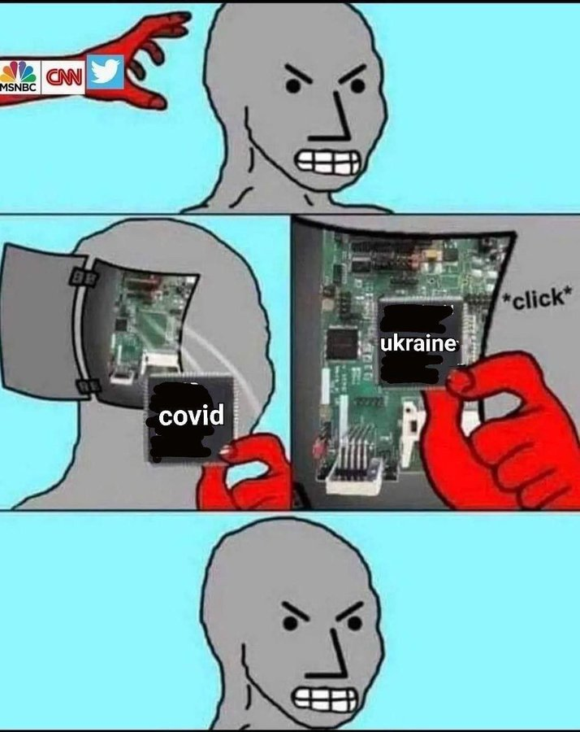
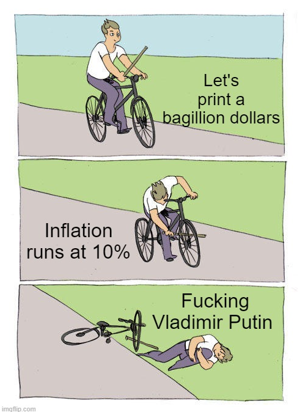
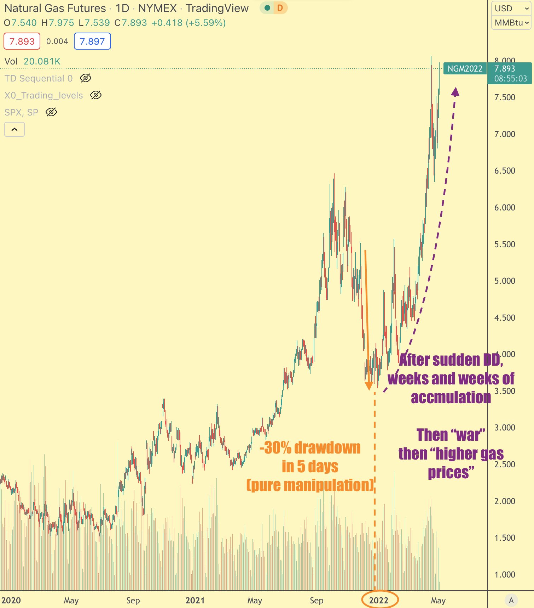
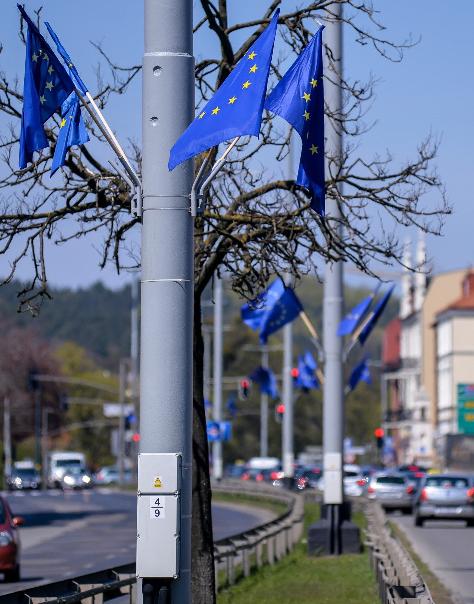

### 2022

🇪🇺🇷🇺 

There is no "russia side" vs "euro side". 💣this war is SUPRA-NATIONAL ELITES vs the rest.

in the process, all they need is to place an enemy: citizens blaming to Putin= total success from elites

Elites are funding the war, both sides. because war is against citizens.

> Current thing

  

  

By christmas 2021 it was all about COVID distraction.

Gas prices -30% decline, for the insiders just to accumulate at cheap prices during WEEKS.

Then covid goes offline, bring Putin to the screen.

"oh look energy prices"and german PPI 30% up!

  

---

  

<!--
 total value locked (TVL) in:

              ██
              ██ 
              ██ 
              ██
              ██
              ██                                                                               
 pen & paper contracts         smart contracts -->

### 2020

Warren Buffett sprzedał wszystkie swoje udziały w liniach lotniczych

"Świat się zmienia. Pandemia będzie miała niezwykle szeroką gamę możliwych skutków. Nie będziemy finansować firm, które w naszej ocenie w przyszłości będą przeżuwać pieniądze" - stwierdził Buffett.

89-letni inwestor przyznał, że w odróżnieniu od 2008 roku nie zdecydował się wesprzeć żadnej firmy w obecnym kryzysie, ponieważ nie widzi odpowiednio "atrakcyjnych" opcji.

---

Philip Lane, zdecydowanie najlepszy ekonomista wsrod obecnych czlonkow zarzadu EBC, przedstawil rzeczowo 3 scenariusze dla strefy euro. Zalozone w modelu egzogeniczne parametry tegorocznej recesji pozwolily oszacowac, kiedy gospodarka strefy dojdzie do poziomu z konca 2019 roku.

1. W scenariuszu glebokiej 12% recesji nastepuje to nie wczesniej niz w roku 2023;
2. W scenariuszu sredniej 8% recesji jest to rok 2022;
3. W scenariuszu lagodnej 5% recesji pelna odbudowa nastapilaby w polowie 2021 roku. 

Do poszczegolnych scenariuszy mozna oczywiscie przypisac odpowiednie prawdopodobienstwo w postaci dobrze znanych wykresow wachlarzowych (fan charts). Ale tego - slusznie - glowny ekonomista EBC nie zrobil. Bo po co? W najlepszym razie powrot do gospodarki w strefie euro do tej wielkosci, ktora  znamy z roku 2019, nastapi przeciez dopiero za 12 miesiecy; w najgorszym zajmie to miesiecy 36.
W zadnym wypadku nie jest to wiec z pewnoscia V-shaped recovery. Bez zludzen.

<!-- Tak to wygląda mniej więcej :

Niemiecki wirusolog twierdzi, że epidemia potrwa aż do wynalezienia skutecznej szczepionki. Francuski wirusolog twierdzi, że epidemia samoczynnie wygaśnie za kilka tygodni.
Chiński wirusolog twierdzi, że Covid będzie powracał jak grypa sezonowa.
Włoski lekarz twierdzi, że wyleczeni pacjenci nabierają trwałej odporności.
Brytyjski lekarz twierdzi, że pacjenci mogą być odporni tylko przez kilka tygodni lub miesięcy.
Polscy lekarze twierdzą, że wyleczeni pacjenci nie mogą nikogo zarazić.
Chiński lekarz twierdzi, że wyleczeni pacjenci mogą nadal zakażać.
UK podjęła decyzję o wytwarzaniu "odporności stadnej", by po 2 tygodniach w obliczu tysięcy zakażeń w panice zamknąć wszystko.
Polska podjęła decyzję o zamknięciu wszystkiego w obliczu kilku przypadków, by w szczycie epidemii zacząć "odmrażać gospodarkę".
Nakazał też noszenie masek, do czego połowa ludzi się w ogóle nie stosuje.
Szwecja kazała przygotować się obywatelom na "miesiące lub lata pełne bólu, śmierci i cierpienia", by po 2-3 tygodniach stwierdzić że najgorsze mają już za sobą.
Łukaszenka twierdził, że wirusa wyleczy sauna, wódka i traktor. Jego obywatele byli przeciwnego zdania i sami postanowili bojkotować mecze i nosić maski.
W przeciwieństwie do WHO, która cały czas twierdzi że maski nic nie dają, a wirusa wyleczą testy i zamknięcie wszystkiego na 2 lata.
Trump twierdził, że koronawirus to nic groźniejszego od grypy. Po kilku tygodniach wprowadził stan wyjątkowy i zamknął cały kraj w kwarantannie, zapowiadając wielomiesięczną izolację. Spowodował tym samym panikę, krach i rekordowe bezrobocie. Po kolejnych paru tygodniach stwierdził, że trzeba powoli wracać do normalności.
Rząd Polski zakazał spacerów po pustych lasach i łąkach, jednocześnie pozostawiając czynne fabryki, autobusy i tramwaje.
Rząd Hiszpanii postanowił karać 30-tysięcznym mandatem każdego, kto wyjdzie na spacer w pustej okolicy, jednocześnie pozwalając na jazdę 20 minut autobusem do wielkiego hipermarketu, w celu zakupu 2 bułek i butelki coli.
Rząd Danii zamknął kościoły nawet dla mszy z 5 wiernymi, jednocześnie otwierając przedszkola.
Rząd Rosji w ogóle nie zamknął cerkwii, takie decyzje podjęli natomiast biskupi i księża.
Rząd Grecji zamknął cerkwie, mimo potężnego oporu i gróźb patriarchów, doszło nawet do aresztowań duchownych.
Chiny twierdzą, że COVID-19 to amerykańska broń biologiczna.
USA twierdzi, że COVID-19 to chińska broń biologiczna.
Większość naukowców twierdzi, że wirus jest naturalny jak grypa, a powstał z hybrydy wirusa z łuskowca, nietoperza i czort wie czego jeszcze, a potem nagle przeniósł się na człowieka (nie wolno twierdzić że od zjedzenia gacka bo to rasizm!) i zaczął masowo zakażać miliony ludzi w różnych miejscach na świecie.
W zasadzie nikt nie wie ilu jest naprawdę zakażonych.
Nikt nie ma pojęcia, ilu będzie ich jutro, nie mówiąc o przewidywaniu na miesiąc.
Nikt nie potrafi powiedzieć, jakie czynniki - klimatyczne, genetyczne, społeczne, czy jeszcze inne, mają na niego największy wpływ.
Niech żyją domorośli eksperci kanapowi!
Niech żyją mędrcy komentarzy internetowych!
Macie swoje 5 minut. W zasadzie możecie ogłosić tutaj każdą teorię na temat tego wirusa i będzie ona tak samo prawdopodobna jak wywody profesorów uniwersytetu...". -->

### 1946

W Krakowie doszło do tragicznych w skutkach zamieszek między studentami Akademii Górniczo Hutniczej, a milicją.
Studenci AGH, którzy za zgodą rektora uczelni chcąc uczcić święto 3 maja wyruszyli spod jej gmachu w stronę Kościoła Mariackiego.
Na rogu ul. Jagiellońskiej i Szewskiej (nr 1 na ilustracji) kilku agentów UB po cywilnemu wezwało maszerujących do przerwania nielegalnej manifestacji. Grozili nawet studentom bronią. Dwaj studenci Lech Kobyliński (prezes SSAG) oraz Antoni Kleczkowski w celu wyjaśnienie tego zamieszania zgodzili się na trójstronną wizytę u rektora. Jednak zamiast do rektora trafili do aresztu UB przy Pl. Inwalidów.
Nie mogący doczekać się na swoich kolegów studenci postanowili kontynuować marsz bez nich. Do uczestników uroczystości spontanicznie dołączali się zwykli mieszkańcy Krakowa. Po pewnym czasie marsz doszedł pod Kościół Mariacki, gdzie odbyła się msza święta.
Po jej zakończeniu postanowiono zgodnie z założeniami okrążyć Rynek, by ul. Św. Anny wrócić pod gmach AGH. Jednak na rogu ul. Wiślnej i Św. Anny pod siedzibą PPR doszło do eskalacji konfliktu. Padło kilka przypadkowych strzałów, lecz nikt nie został ranny ani zabity. Demonstranci zaczęli wykrzykiwać różne „antypaństwowe” okrzyki np. „Precz z Bierutem”, czy „Precz z okupacją sowiecką”.
Dla partii to było już zbyt wiele. Do stłumienia protestu użyto m.in. samochód pancerny ustawiony na plantach w okolicy ul. Szewskiej i kawalerię Korpusu Bezpieczeństwa Wewnętrznego. Byli zabici i ranni. Nazajutrz zszokowani masakrą Krakowianie składali kwiaty i znicze w miejscach śmierci protestujących.

  

### ~~1942

  

### 1792

Wmurowany został kamień węgielny pod budowę Świątyni Opatrzności Bożej w Warszawie.
Decyzja o jej budowie zapadła rok wcześniej.
Świątynia ta miała być wotum wdzięczności narodu polskiego za Konstytucję 3 maja. Zawirowania historyczne i rozbiór w 1793 roku nie pozwoliły jednak na jej realizację. Do planów jej budowy powrócono w 1918 roku. Miała ona powstać na Polu Mokotowskim według projektu architekta Bohdana Pniewskiego. Wybuch II wojny światowej uniemożliwił jej realizację przez następnych kilkadziesiąt lat.
Z kolejną inicjatywą budowy świątyni wystąpił w 1989 roku prymas Józef Glemp.
Budowa Świątyni Opatrzności Bożej na Polach (Błoniach) Wilanowskich zakończyła się 11 listopada 2016 roku.

  

### 1791

Uchwalono akt prawny utrwalony w dziejach Polski jako Konstytucja 3-maja.

Dokument przygotowywany był przez dłuższy czas w tajemnicy, z obawy, aby konserwatywna część posłów nie udaremniła jego realizacji. Złamano regulamin sejmowy i nie zapoznano izby poselskiej z projektem. Projekt był znany tylko nielicznym posłom. Głosowanie zaplanowano na 3 maja 1791 roku. Rozwiązanie to poparł ówczesny marszałek sejmu Stanisław Małachowski.
Do konstytucji wcielono wcześniejsze postanowienia praw o miastach. Konstytucja wprowadziła poważne zmiany w zakresie organizacji władzy. Zniesiono odrębne instytucje centralne w Litwie i w Koronie. Organem władzy ustawodawczej był sejm. Zniesiono liberum veto i konfederacje. Najwyższym organem władzy wykonawczej była Straż Praw. Zlikwidowano wolną elekcję i wprowadzono dziedziczność tronu.

Przeciwko konstytucji zaprotestowali przywódcy stronnictwa hetmańskiego. Franciszek Ksawery Branicki, Szczęsny Potocki i Seweryn Rzewuski pojechali do Petersburga, aby uzyskać pomoc od carycy Katarzyny II.

Radość z Konstytucji nie trwała długo, ponieważ już w kwietniu 1792 roku w Petersburgu w porozumieniu z carskim dworem opracowany został akt konfederacji, który zniósł postanowienia Konstytucji z dnia 3 maja. Akt ten odczytano w miasteczku Targowica. Konfederacja targowicka stała się symbolem zdrady narodowej.

W maju 1792 roku do Rzeczpospolitej wkroczyło 100 tysięcy rosyjskich żołnierzy. Austria i Prusy uznały interwencję wojskową za uzasadnioną. Na terenach zajętych przez Rosjan władzę objęli targowiczanie. Rzeczpospolita podjęła walkę jednak nie była w stanie odeprzeć ataku wroga. W lipcu król Stanisław August Poniatowski przekonany o zbliżającej się klęsce przyłączył się do Targowicy. Działania wojenne wstrzymano. Wielu patriotów udało się na emigrację między innymi Tadeusz Kościuszko.

Na zdjęciu obraz Konstytucja 3 Maja 1791 roku - obraz jest autorstwa Jana Matejki.

  

---

<a href="https://github.com/TomaszWaszczyk/historia.waszczyk.com/edit/master/src/content/may-3.md" target="_blank">Edytuj tę stronę dzieląc się własnymi notatkami!</a>
