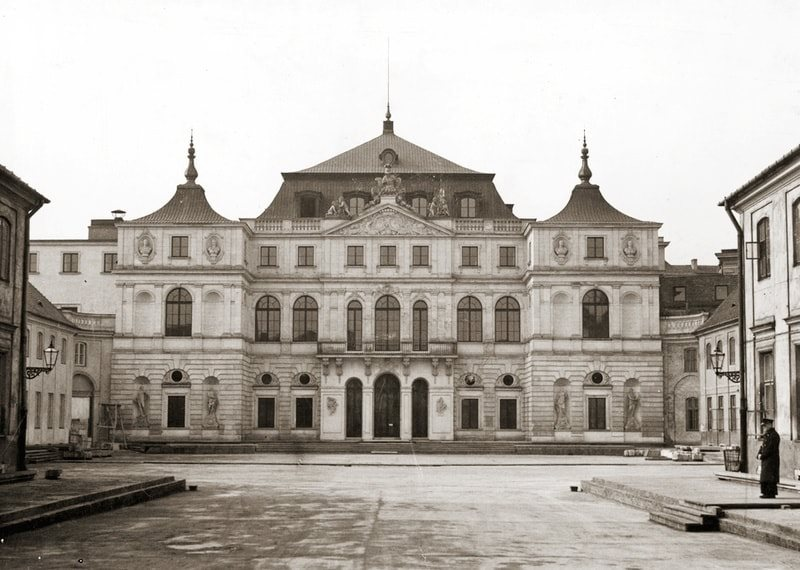

### 2020

"Za decyzją o obniżeniu stóp procentowych NBP stał telefon z rządu" – komentarz byłego prezesa NBP

"Nie do końca wiemy, jakimi przesłankami kierowała się Rada Polityki Pieniężnej" - mówi Marek Belka o obniżce stóp procentowych.

### 1960

W Zielonej Górze miał miejsce kilkutysięczny protest mieszkańców tego miasta w obronie przed planami władz województwa poznańskiego dotyczącymi Domu Katolickiego (obecnie stary budynek Filharmonii Zielonogórskiej).
W myśl zasad laicyzacji życia w Polsce wojewoda poznański podjął decyzję o likwidacji tej placówki, w której znajdowały się między innymi redakcja Słowa Powszechnego, Caritas i Polski Czerwony Krzyż. Budynek miał zostać w całości przeznaczony do dyspozycji orkiestry. Jednym z powodów likwidacji Domu Katolickiego miały być prowadzone w nim lekcje religii.
Dowiedziawszy się o tym miejscowy proboszcz Kazimierz Michalski powiadomił parafian, którzy podjęli próbę zablokowania tej decyzji. Władze województwa, które spodziewały się takiego obrotu spraw skierowały na miejsce milicję i ZOMO. Początkowo niezbyt liczna demonstracja przerodziła się z czasem w kilkutysięczne zamieszki brutalnie tłumione przez uzbrojonych w pałki funkcjonariuszy.
Wiele osób było poszkodowanych, znaczna część protestujących została zatrzymana (333 osoby), aresztowana (część osób zatrzymano w ciągu następnych paru dni na podstawie fotografii wykonanych na miejscu zamieszek przez funkcjonariuszy SB) i potem skazana (przed sądem łącznie 196 osób, w kolegiach orzekających – 48 osób) na kary więzienia (ponad 2 miesiące, w tym dwie osoby nawet na 5 lat) lub grzywny. Represje dosięgły protestujących także w ich miejscach pracy lub nauki – niektórzy pozostawali przez długi czas bez pracy. Część uczestników wraz z rodzinami została zmuszona do opuszczenia Zielonej Góry na zawsze.

  

### 1941

Polska Marynarka Wojenna objęła, przejęty od Brytyjczyków, niszczyciel eskortowy typu Hunt II. Polacy zmienili nazwę okrętu z HMS "Oakley" na ORP "Kujawiak".
Pierwszym dowódcą tej jednostki został kapitan marynarki Ludwik Lichodziejewski, dotychczasowy zastępca dowódcy niszczyciela ORP Piorun. Między 31 maja a 17 czerwca okręt oraz jego młoda załoga przeprowadziła serię testów i szkoleń, m.in. próby maszyn oraz ćwiczenia obsługi artylerii. Nie był to łatwy czas, gdyż jak pisał w sprawozdaniu z tego okresu Lichodziejewski, jedynie oficerowie
charakteryzowali się wysoką dyscypliną i
morale, zaś podoficerowie i marynarze byli
zbieraniną ludzi wyzbieranych z rozmaitych
resztek, często o konduicie niedwuznacznie
podejrzanej i z wyrokami sądów [w] ewidencji.
Jednakże do 25 lipca, kiedy to zakończono
wszystkie ćwiczenia, dyscyplina i morale
poszły w górę. Marynarze przywiązali się do
swojego okrętu, są z niego dumni. Mam
bardzo wielkie trudności w wypadku
przeokrętowania – marynarze stają do raportu
i często ze łzami proszą o zatrzymanie ich.
Po krótkim okresie szkolenia i zgrywania
załogi, do końca 1941 r. Kujawiak osłaniał
liczne konwoje na Kanale La Manche, w tym
jako okręt dowódcy grupy eskortowej.
Wielokrotnie w tym czasie polscy artylerzyści
mieli okazję walczyć z nieprzyjacielskim
lotnictwem. Umiejętności te potwierdzili
podczas alianckiej wyprawy na Lofoty
(operacja „Anklet”, 24-28 grudnia 1941) oraz
po powrocie w styczniu 1942 r. do eskorty
konwojów, kiedy to 14 marca przez siedem
godzin Kujawiak odpierał 10 ataków na statki,
zestrzeliwując jeden samolot wroga.
4 czerwca 1942 r. Kujawiak wszedł w skład
Force „X” będącej częścią Force „T”,
eskortującej konwój WS 19 z Greenock (w
ujściu Clyde) na Maltę. Konwój, który opuścił
Londonderry (Płn. Irlandia) 5 czerwca o godz.
09.00, składał się z 6 statków, zaś jego
prędkość wynosiła około 12,5 w. Przejście do Gibraltaru minęło bez wydarzeń i ugrupowanie zawinęło tam 10 czerwca o godz. 10.00. Po dwóch dniach postoju konwój wyruszył w
kierunku Malty. Rankiem 14 czerwca, został wykryty przez samotny samolot rozpoznawczy, który trzymał się od niego w odległości około 10 Mm. Choć samolot został prędko przegoniony przez myśliwce, to jednak było oczywistym, że już niedługo dojdzie do
falowych ataków nieprzyjacielskiego lotnictwa.
Pierwszy nalot rozpoczął się o 10.25, gdy nastąpił atak 6 Ju 88 z wysokości około 2500 m [2 SM 79 i 8 CR 42]. Rzucono kilkanaście bomb na konwój i eskortę, jednak na szczęście obyło się bez strat.

  

### 1918

Powstał Związek Legionistów Polskich- organizacja zrzeszająca byłych żołnierzy Legionów Polskich Józefa Piłsudskiego oraz rodziny tych żołnierzy,a później również wszystkie osoby identyfikujące się z ideą czynu niepodległościowego.
Pierwszym komendantem tej organizacji został późniejszy marszałek Edward Rydz- Śmigły.
Po wybuchu II wojny światowej Związek
Legionistów Polskich został
zdelegalizowany dekretem generalnego
gubernatora Hansa Franka, jednakże, wbrew
często pojawiającym się w różnych
opracowaniach błędnym informacjom, nie
zaprzestał swojej działalności, działając
pod konspiracyjną nazwą "Grupa Oleandry.
Organizacja ta począwszy od lat 60 tych XX wieku kilka razy była delegalizowana i na nowo powoływana. Ostatnie jej rejestracja miała miejsce 3 sierpnia 1990 roku.
Związek Legionistów Polskich istnieje do dziś.

  

### 1901

W Warszawie urodził się Mieczysław Fogg. Jego prawdziwe nazwisko to Mieczysław Fogiel.
Był uczestnikiem wojny polsko-bolszewickiej w 1920 roku. Po tym ,jak został ranny na froncie rozpoczął w 1921 roku pracę jako kasjer w warszawskiej Dyrekcji Kolei Państowej.
Karierę artystyczną zawdzięcza samemu Ludwikowi Sempolińskiemu, który słysząc go śpiewającego chórze kościelnym skierował go na naukę śpiewu na Wydział Wokalistyki warszawskiej Szkoły Muzycznej im. Fryderyka Chopina.
W 1928 roku wykształcony już wokalnie Fogg rozpoczął występy w chórze Dana. Od tego czasu zaczęła się jego wielka kariera artystyczna.
Koncertował za granicą, m.in. w Niemczech, Estonii, na Łotwie, w ZSRR, Finlandii, Norwegii, Szwecji, Austrii, we Włoszech i w
USA, gdzie wystąpił w 31 stanach. Dla
firmy fonograficznej Odeon nagrywał
100-150 piosenek rocznie, otrzymując
przezwisko "śpiewająca mrówka".
Towarzyszył w koncertach i nagraniach
sławnym polskim artystom kabaretowym,
m.in.: Hance Ordonównie , Stefci Górskiej, Zuli Pogorzelskiej i Adolfowi Dymszy.
Lata okupacji niemieckiej spędził w
Warszawie. Występował (za zgodą władz
Podziemnej Polski) w kawiarniach
dostępnych polskiej publiczności, m.in. w
Cafe Bodo i Swann , U Aktorek i Lucyna.
Mieczysław Fogg brał udział w powstaniu
warszawskim jako żołnierz AK , a jego
zadaniem było podtrzymywanie na duchu
powstańców i mieszkańców Warszawy –
śpiewał w szpitalach, na barykadach i w
schronach. Brał udział w powstaniu jako
starszy strzelec I Batalionu Szturmowego
Odwet . Za udział w powstaniu otrzymał
wysokie odznaczenie – Krzyż Zasługi z
Mieczami (jego powstańcza opaska
znajduje się w Muzeum Powstania
Warszawskiego). Mieczysław Fogg, przed
wojną jeden z najbardziej znanych
piosenkarzy polskich, nie opuścił
żydowskich przyjaciół podczas okupacji. Z
inicjatywy Fogga Ignacy Singer (znany jako
Ivo Wesby), kierownik muzyczny kabaretu
„Qui pro Quo”, uciekł z getta
warszawskiego wraz z żoną Lolą i córką.
Fogg udzielił schronienia Singerom w
swoim mieszkaniu, gdzie przebywali do
zakończenia wojny. Fogg przez kilka dni
ukrywał także w swoim mieszkaniu
przyjaciela, Stanisława Templa, inżyniera z
Wilna, który pracował dla wytwórni
płytowej. Mimo ostrzeżeń Fogga Tempel
udał się do getta, aby połączyć się ze swoją
rodziną.
Również nauczyciel śpiewu, Stanisław Kopf,
znalazł schronienie w mieszkaniu Fogga, aż
do momentu uzyskania fałszywych
dokumentów, dzięki którym mógł wyjechać
z Warszawy.
Po wojnie przez krótki czas Mieczysław Fogg prowadził w Warszawie własny lokal "Cafe Fogg".
W trwającej ponad sześćdziesiąt lat
karierze wystąpił na blisko szesnastu
tysiącach koncertów. Śpiewał w dwudziestu
pięciu krajach Europy oraz w Brazylii,
Izraelu , na Cejlonie, w ośrodkach
polonijnych Nowej Zelandii , Australii i
wielokrotnie w USA i Kanadzie.
Zaśpiewał on między innymi takie utwory,jak "Tango Milonga", "Cisza", "Ostania niedziela", "Jesienne róże" lub "Pierwszy siwy włos".
Zmarł 3 września 1990 roku w Warszawie.

  

### 1787

W Warszawie Rada Nieustająca zakupiła za pieniądze z budżetu przeznaczone na uzbrojenie polskiej armii Pałac Brühla. Budowla pozostała po zmarłym w 1763 roku ministrze gabinetu i konfederacji na dworze króla Augusta III Heinrichu Brühlrze przeznaczona miała zostać na siedzibę ambasady rosyjskiej.

  

### 1505

Podczas sejmu w Radomiu uchwalona zostala konstytucja Nihili novi. Dokument, którego uchwalenie miało miejsce kościele farnym pod wezwaniem świętego Jana Chrzciciela ograniczał kompetencje prawodawcze polskich monarchów, co w praktyce przekładało się na obowiązujący króla zakaz wydawania ustaw bez zgody szlachty, reprezentowanej przez Senat i izbę poselską. Królowi pozostawiono natomiast swobodę w wydawaniu edyktów dotycząchc spraw miast królewskich, spraw górniczych, Żydów, lenn i chłopstwa. Konstytucja ta unieważniała również wydany cztery lata wcześniej przez Aleksandra Jagiellończyka przywilej mielnicki ograniczający znacznie władzę królewską na rzecz senatu i praktycznie wprowadzający w Polsce republikę oligarchiczno-arystokratyczną z odwoływalnym królem stojącym na czele senatu.

---

<a href="https://github.com/TomaszWaszczyk/historia.waszczyk.com/edit/master/src/content/may-30.md" target="_blank">Edytuj tę stronę dzieląc się własnymi notatkami!</a>
