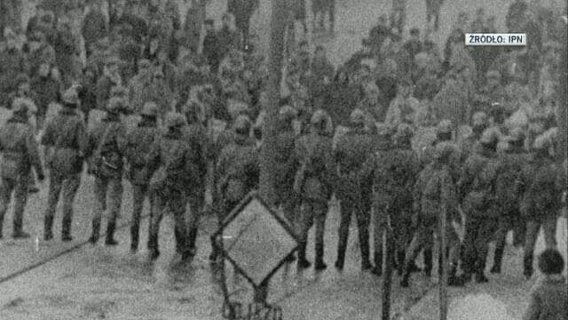
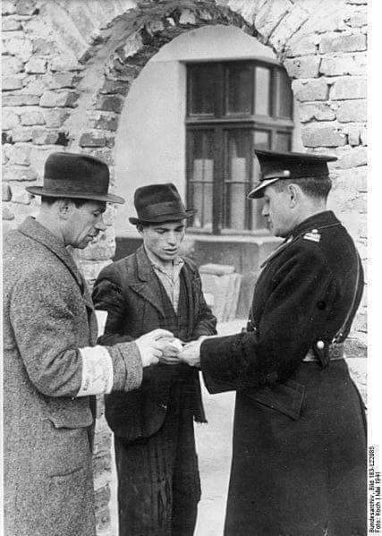
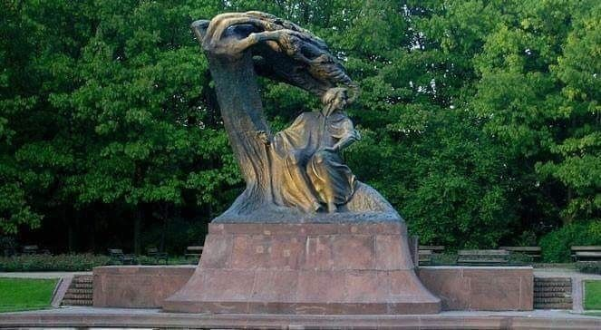
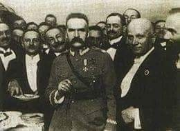
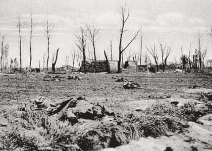
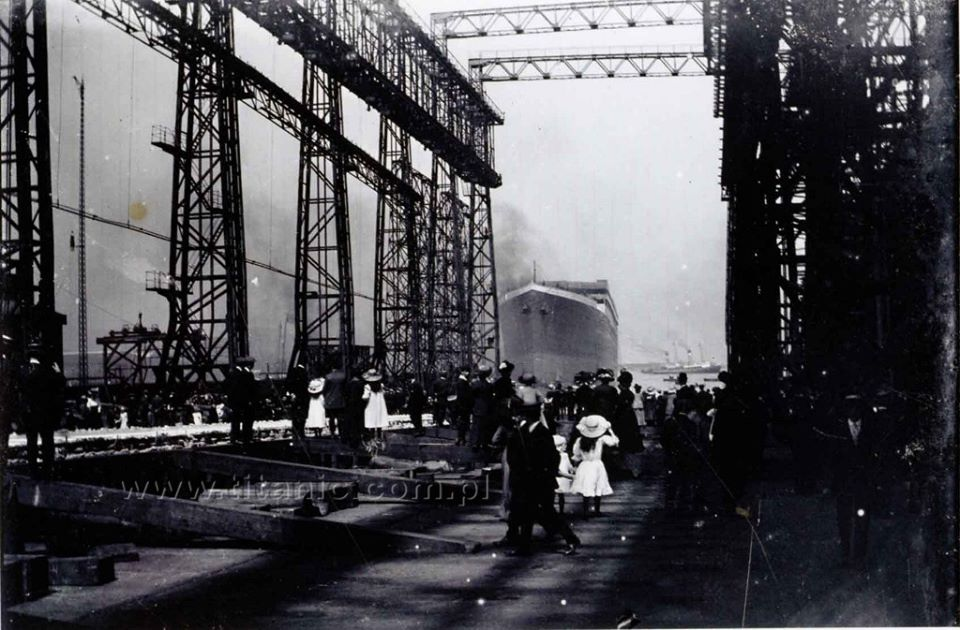
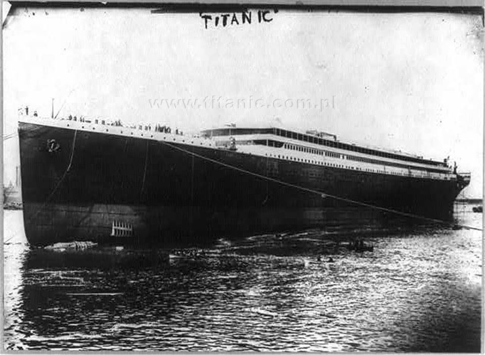

### 2020 - Banki stracą miliardy na niskich stopach. Dla tych mniejszych to zagrożenie

Zamiast wzrostu, ograniczenie akcji kredytowej, prawdopodobne wprowadzenie nowych opłat i likwidacja promocji. Analitycy i ekonomiści czwartkową obniżkę stóp procentowych oceniają krytycznie. Choć kredytobiorcy zaoszczędzą na ratach, to banki może dotknąć kryzys. A to niebezpieczne dla gospodarki.

* Obniżka stóp procentowych to mniejsze raty dla kredytobiorców, ale dla banków konieczność szukania zysków gdzie indziej i robienia oszczędności
* Pytani ekonomiści i analitycy uważają, że decyzja jest zła. Zysk sektora bankowego spadnie o połowę, a w poważne problemy mogą wpaść mniejsze banki
* Mechanizmy, które rozpoczęły niskie stopy mogą w Polsce prowadzić do zmniejszenia akcji kredytowej, choć teoretycznie obniżka stóp powinna działać odwrotnie

### 2007

Sąd Okręgowy w Katowicach skazał za popełnienie zbrodni komunistycznej 15 z 17 funkcjonariuszy plutonu ZOMO, którzy 16 grudnia 1981 roku podczas pacyfikacji Kopalni Wujek oddali strzały, wyniku czego śmierć poniosło 9 górników, a 23 odniosło rany. Sąd ustalił, iż to dowódca plutonu specjalnego ZOMO Romuald C. jako pierwszy oddał strzał, a następnie podał komendę "Walimy", co jego podwładni odebrali jednoznacznie. C. Otrzymał wyrok 11 lat pozbawienia wolności, pozostali zomowcy od 2,5 do 3 lat.
Był to jeden z czterech procesów w tej sprawie. Ostatni miał miejsce w kwietniu 2009 roku. Sąd Najwyższy oddalił wtedy kasacje obrony, uznając je za niezasadne, a wyroki sądów niższych instancji – za zgodne z prawem. Według SN sądy dwóch instancji słusznie uznały, że zomowcy broni użyli bezprawnie, gdyż strzelając, nie byli w bezpośrednim zwarciu z górnikami, oddawali strzały z bezpiecznej odległości, a ich życiu nie groziło bezpośrednie niebezpieczeństwo. SN podkreślił, że obrażenia górników świadczą, że "strzały były mierzone", bo spośród 9 zabitych górników, 4 trafiono w głowę, 1 - w szyję, 2 - w pierś, 2 - w brzuch, a spośród rannych tylko 2 doznało ran od rykoszetów.

  

---

Andrey Lugovoy calls himself victim in Litvinenko case

Russian businessman Andrey Lugovoy at a press conference in Moscow has called himself a victim, not the murderer in the Litvinenko case, saying the British special services used him as a scapegoat.

Before November, 2006, almost no one had heard the name Aleksandr Litvinenko. Now it’s almost impossible not to.

The former Russian security officer died last November three weeks after falling ill on November 1. He was admitted to hospital and for weeks it was unclear what was causing him to deteriorate.

With the launch of an investigation a media sensation broke out in the UK-the country obsessed by the “Spy Story” with new speculation each day and almost all fingers pointing at the Kremlin.

“The police investigation will proceed and I think people should know that there is no diplomatic or political barrier in the way of that investigation going wherever it needs to go,” British Prime Minister Tony Blair stressed.

Specialist narrowed down the lethal poison to the radio-active substance polonium 210 shortly before Litvinenko died. The fatal dose could have cost close to 20 MLN pounds.

---

### 1942

W getcie krakowskim funkcjonariusze Gminy Żydowskiej, przy pomocy policjantów z Judischer Ordungsdienst przeprowadzili kontrolę tzw kart rozpoznawczych, co stało się bezpośrednim pretekstem do rozpoczęcia wysiedlenia około 5 tysięcy ludzi. Większość z nich trafiła do obozu zagłady w Bełżcu.

  

### 1940

Niemcy wysadzili w powietrze znajdujący się w Warszawskich Łazienkach istniejący od 1901 roku pomnik Fryderyka Chopina. Akt ten był częścią realizacji odezwy gubernatora Warszawy Hansa Franka,który wzywał do zbiórki metali kolorowych na potrzeby niemieckiej armii.
16-tonowa rzeźba została pocięta palnikami
na mniejsze części i wywieziona do Rzeszy.
Większość fragmentów pomnika przetopiono i
wykorzystano do produkcji amunicji.

  

### 1926

Zgromadzenie Narodowe wybrało Józefa Piłsudskiego na prezydenta Polski, jednak godności tej nie przyjął, argumentując to zbyt małymi prerogatywami prezydenta w konstytucji marcowej. W drugim głosowaniu Zgromadzenie Narodowe wybrało na prezydenta protegowanego przez niego Ignacego Mościckiego.

  

### 1915

W okolicach Bolimowa i Sochaczewa doszło do wielkiego ataku z wykorzystaniem broni chemicznej. Wojska niemieckie użyły 264 tony ciekłego chloru ,
wypuszczonego z 12 tysięcy butli
rozmieszczonych przed linią okopów
rosyjskich. Ilość ta ponad dwukrotnie
przewyższała ilość gazu użytą podczas
ataku gazowego przeprowadzonego w
kwietniu 1915 roku pod Ypres . W ciągu
kilkunastu minut zginęło kilka tysięcy
rosyjskich żołnierzy (dokładna liczba jest
nie do ustalenia).

  

### 1911

Titanic został oficjalnie zwodowany przed tysiącami widzów, zgromadzonymi w stoczni Harland and Wolff w Belfaście. Byli wśród nich m. in. amerykański finansjer J. P. Morgan (założyciel amerykańskiej grupy finansowej o tej samej nazwie), właściciel towarzystwa International Mercantile Marine and the Oceanic Steam Navigational Company (IMM) oraz linii The White Star, a także jej prezes Bruce Ismay, wraz z Lordem Williamem Pirrie, byłym burmistrzem Belfastu. Około godziny 12:15, Titanic został spuszczony do specjalnie przygotowanego dla niego basenu wodnego, o nazwie "River Logan".

  

  

---

<a href="https://github.com/TomaszWaszczyk/historia.waszczyk.com/edit/master/src/content/may-31.md" target="_blank">Edytuj tę stronę dzieląc się własnymi notatkami!</a>
