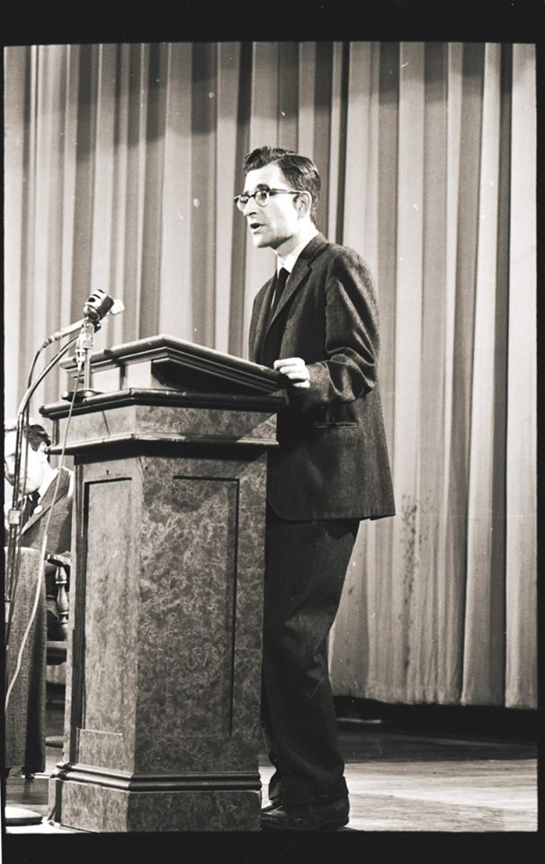
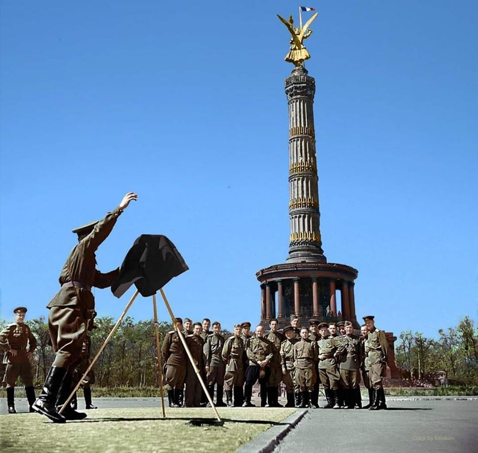
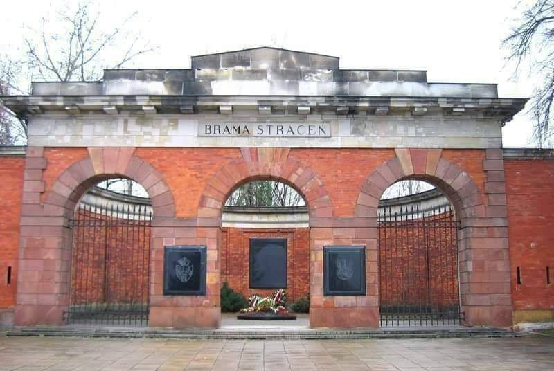

### 2020

W obliczu koronawirusa, nadmiernego trollingu ze strony wszystkich rosyjskich służb na temat 5G oraz innych kwestii siania dezinformacji warto przypomnieć sobie kilka słów od Noama Chomsky`ego. Ważne jest to w kontekście obecnego kryzysu, gdzie codziennie praktycznie zawodzą jakieś źródła informacyjne. Jesteśmy zalewani często fakenewsami, sprostowaniami, modelami, które służą politykom do oceny sytuacji, często modele są sprzeczne. Inna sprawa też chodzi o gadające głowy nt. giełdy.

> Noam Chomsky (ur. 7 grudnia 1928 w Filadelfii) – amerykański językoznawca, filozof, działacz polityczny. Profesor językoznawstwa w Massachusetts Institute of Technology (katedra językoznawstwa i filozofii), współtwórca (wraz z Morrisem Halle) gramatyki transformacyjno-generatywnej, wniósł wkład w rozwój psycholingwistyki, informatyki (w zakresie teorii języków programowania, lingwistyki komputerowej). Laureat Nagrody Kioto w dziedzinie nauk podstawowych z 1988 roku. Jeden z najczęściej cytowanych naukowców na świecie. Język jest według Chomsky’ego nieskończonym zbiorem zdań, generowanych za pomocą skończonej liczby reguł i słów, cechą szczególną rodzaju ludzkiego. Opracował tzw. hierarchię Chomsky’ego – klasyfikację gramatyk języków formalnych.

#### TEORIA MANIPULACJI Noama Chomsky'ego

1. Rozpraszanie uwagi:
Kluczowym elementem kontroli społecznej jest odwrócenie uwagi od istotnych spraw i zmian dokonywanych przez polityczne i ekonomiczne elity, poprzez ciągłe rozpraszanie uwagi i zalew opinii publicznej nieistotnymi informacjami. Strategia odwrócenia uwagi jest kluczowa, aby zapobiegać zainteresowaniu społeczeństwa podstawową wiedzą z zakresu nauki, ekonomii, psychologii, neurobiologii i cybernetyki.
„Utrzymuj opinię publiczną odwróconą od realnych problemów społecznych, poprzez zniewolenie nieważnymi sprawami. Społeczeństwo musi być cały czas bardzo zajęte, bez czasu na myślenie”.

2. Wygeneruj problem i zaproponuj rozwiązanie:
Ta metoda jest również określana jako „problem – reakcja – rozwiązanie”. Stwórz taką sytuację (problem), która wywoła u odbiorców żądanie podjęcia natychmiastowych kroków, mających na celu rozwiązanie problemu lub zapobieganie mu w przyszłości. Na przykład: pozwól, by rozprzestrzeniła się przemoc, aby społeczeństwo zgodziło się na zaostrzenie norm prawnych w ochronie własnego bezpieczeństwa, za cenę swojej wolności. Wykreuj kryzys ekonomiczny, aby usprawiedliwić radykalne cięcia świadczeń socjalnych.

3. Zmiany wprowadzaj stopniowo:
Nie wprowadzaj radykalnych zmian drastycznie lecz stopniowo, przesuwaj granicę wytrzymałości i akceptacji krok po kroku, aż do granic wytrzymałości, rozbijając zmiany na kolejne lata. W ten sposób przeforsowano radykalne zmiany społeczno-ekonomiczne latach 80. i 90., które doprowadziły do ukształtowania się ekonomii neoliberalnej: minimum świadczeń, prywatyzacja, niepewność jutra, elastyczność zatrudnienia, masowe bezrobocie, wypłaty na niskim poziomie, brak gwarancji godnego zarobku – wprowadzenie takich zmian jednocześnie wywołałoby rewolucję.

4. Strategia odroczenia:
Kolejny sposób na wprowadzenie niemile widzianej zmiany to przedstawienie jej jako „bolesnej konieczności”, którą koniecznie będziemy musieli wprowadzić w przyszłości.
Ludziom łatwiej jest zaakceptować widmo przyszłego poświęcenie, niż wprowadzić zmianę od razu. Ponadto społeczeństwa mają tendencję do naiwnej wiary, że „wszystko będzie dobrze” i że być może uda się uniknąć poświęcenia. Taka strategia daje więcej czasu na oswojenie się ze świadomością zmiany, a także przyjęcie jej w atmosferze rezygnacji, kiedy przyjdzie czas by wcielić ją w życie.

5. Mów do społeczeństwa jak do dziecka:
Większość reklam i komunikatów kierowanych do opinii publicznej wykorzystuje język oraz sposób argumentowania, jakiego używa się, przemawiając do dzieci lub osób umysłowo chorych, a więc uproszczony i wręcz infantylny. Im bardziej chcesz zamglić obraz rzeczywistości swojemu rozmówcy, tym bardziej staraj się infantylizować komunikat. Dlaczego?
„Jeśli będziesz mówić do osoby, jakby miała ona 12 lat, to po wpływem sugestii prawdopodobnie odpowie lub zareaguje bezkrytycznie, tak jakby rzeczywiście miała 12 lub mniej lat”.

6. Skup się na emocjach, a nie na racjonalności:
Wykorzystywanie emocji to klasyczna technika mająca na celu odstawienie racjonalnej analizy i zdrowego rozsądku jednostki na bok. Co więcej, użycie języka odpowiednio nacechowanego emocjonalnie daje możliwość podświadomego zaszczepienia idei, pragnień, lęków, niepokojów, impulsów, a przez to wywołanie określonych zachowań.

7. Utrzymuj ludzi w ignorancji:
Uczyń społeczeństwo niezdolnym do zrozumienia metod sprawowania kontroli.
„Edukacja oferowana niższym klasom musi być na tyle uboga i na przeciętnym poziomie, aby przepaść ignorancji pomiędzy niższymi a wyższymi klasami utrzymywała się, a techniki kontroli pozostawały niezrozumiałe dla niższych klas”.

8. Promuj przeciętność:
Spraw, aby społeczeństwo uwierzyło, że bycie głupim, wulgarnym i niewykształconym jest w porządku.

9. Wzmacniaj w ludziach poczucie winy:
Pozwól, aby jednostki uwierzyły, że są jedyną osobą winną swoich niepowodzeń przez niedostatek inteligencji, zdolności lub własnych starań. Dzięki temu, zamiast buntować się przeciwko systemowi ekonomicznemu, który stawia jednostkę w niekorzystnej sytuacji, będzie ona żyła w poczuciu winy i dewaluacji własnej wartości, prowadząc do depresji. W takim stanie osoba stanie się bierna i niezdolna do podejmowania działań mających na celu zmianę systemu. Bierność oznacza brak rewolucji.

10. Poznaj ludzi lepiej niż oni są w stanie poznać siebie:
Przez ostatnich 50 lat szybki postęp w nauce spowodował rosnącą przepaść pomiędzy zasobami wygenerowanej wiedzy a tym, co jest dostępne (i tłumaczone) dla szerokich mas. Dzięki biologii, neurobiologii i psychologii elity władzy są w stanie posiąść zaawansowaną wiedzę na temat jednostek, jak i społeczeństwa, co pozwala im poznać człowieka lepiej, niż on sam może znać siebie. Oznacza to, że będąc w posiadaniu tej wiedzy można mieć większą kontrolę nad jednostkami, niż one same nad sobą."

  

---

### 1945

Został aresztowany Hans Frank.
W obliczy zbliżającej się do Krakowa Armii Czerwonej generalny gubernator okupowanych ziem polskich Hans Frank uciekł do Bawarii. Został on aresztowany  4 maja 1945 roku w bawarskiej miejscowości Neuhaus am Schliersee.  Zatrzymania dokonał  porucznik amerykańskiego wywiadu wojskowego Walter Stein.  Frank próbował popełnić samobójstwo podcinając sobie żyły, ale przy okazji uszkodził ścięgna przez co jego lewa dłoń została sparaliżowana. Amerykanom przekazał swój 38 tomowy dziennik,  który był świadectwem popełnianych zbrodni i stał się głównym dowodem w  procesie Norymberskim.
18 sierpnia 1942 Hans Frank zanotował w nim: „Ten jedyny w swoim rodzaju dokument pracy będzie po wsze czasy świadectwem, z jaką powagą przystąpiłem do powierzonego mi zadania, oraz z jaką gorliwością wypełniali swe zadania wszyscy moi cenni współpracownicy”. Innym razem napisał -"wodzu melduję że dziś znowu zgładziłem ponad 100 tysięcy ludzi" lub "gdy nastąpi ostateczne zwycięstwo chcę zrobić z Polaków Żydów oraz z wszystkiego innego co się tu kręci siekaninę".
Podczas procesu w Norymberdze Frankowi przedstawiono zarzutu zbrodni przeciw pokojowi, zbrodni wojennych i przeciw ludzkości, znęcania się nad ludnością cywilną oraz rabunku własności publicznej i prywatnej. Dowodów jego działalności było aż nadto. 1 października 1946 roku został wydany wyrok. Sędziom Trybunału Norymberskiego zajęło to  mniej niż 20 minut, wszyscy byli jednomyślni- kara śmierci! Wyrok przez powieszenie wykonał sierżant John C. Woods . Tego samego dnia co egzekucja zwłoki niemieckiego zbrodniarza zostały spalone, a jego prochy  rozrzucone z samolotu.  Hans Frank w chwili śmierci miał 46 lat.
Leszek Admaczewski w książce –W królestwie Hansa Franka. Sensacje z Generalnego Gubernatorstwa”- Prowadzi czytelników na tajne narady dygnitarzy hitlerowskich, zagląda za kulisy przygotowań do zamachów Armii Krajowej na Franza Kutscherę oraz Hansa Franka i Wilhelma Koppego. Odwiedza schrony dwóch kwater Führera zbudowanych w Generalnym Gubernatorstwie. Próbuje także ustalić, czy Adolf Hitler mógł gościć w klasztorze jasnogórskim w Częstochowie. Porusza też losy skarbów kultury oraz testy rakiet V-2. .

---

  

---

### 1909

https://pl.wikipedia.org/wiki/Wac%C5%82aw_Komar

### 1834

Otwarto warszawską Cytadelę- carski areszt wybudowany na rozkaz cara Mikołaja I. Projektantem tego obiektu był Iwan Dehn. Budowa ruszyła w 1832 roku. Sprowadzono w tym celu do Warszawy robotników z Rosji. Początkowo nosiła ona nazwę Cytadeli Aleksandrowskiej. Cytadela miała być skutecznym narzędziem służącym do zastraszania i inwigilacji warszawskiego ruchu niepodległościowego. Co prawda oficjalna data jej otwarcia to 1834 rok,ale prace nad jej rozbudową i modernizacją trwały jeszcze przez 40 lat.

  

---

<a href="https://github.com/TomaszWaszczyk/historia.waszczyk.com/edit/master/src/content/may-4.md" target="_blank">Edytuj tę stronę dzieląc się własnymi notatkami!</a>
