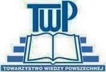

### 2020

Trump and the Fed are edging closer to negative interest rates—something legendary investor Warren Buffett has warned could have "extreme consequences"..

---

Sondaże

  

---

  

### 1994

Zastępca szefa Służby Bezpieczeństwa Ukrainy generał Andrij Chomicz przekazał na ręce zastępcy prokuratora generalnego RP Stefana Śnieżko Ukraińską Listę Katyńską- dokument zawierający dane blisko 3500 obywateli polskich zamordowanych przez NKWD w miejscach egzekucji na terenie Ukrainy.
Na mocy tego dokumentu, który powstał na bazie korespondencji z 25 listopada 1940 roku, składającej się z pięciu worków więziennych akt osobowych Polaków między naczelnikem 1 Wydziału Specjalnego NKWD Ukraińskiej Socjalistycznej Republiki Radzieckiej starszym lejtnantem bezpieczeństwa państwowego Cwietuchinem, a majorem bezpieczeństwa państwowego ZSRR Leonidem Basztakowem ustalono, że skazani zostali umieszczeni na 12 listach dyspozycyjnych wysyłanych przez 1 Wydział Specjalny NKWD w Moskwie, na podstawie których tworzono transporty więźniów kierowanych do miejsc egzekucji.
Na Ukraińskiej Liście Katyńskiej figuruje 726 oficerów Wojska Polskiego (218 oficerów służby stałej i 10 podoficerów, 380 oficerów rezerwy i pospolitego ruszenia oraz 118 oficerów w stanie spoczynku), 746 policjantów i 24 wyższych funkcjonariuszy Policji Państwowej, 24 funkcjonariuszy Straży Więziennej i 4 naczelników więzień. Ponadto 7 generałów, 26 pułkowników i 46 podpułkowników Wojska Polskiego (wśród oficerów byli obrońcy Lwowa 1939, 74 ziemian, 46 nauczycieli, 70 inżynierów, 15 lekarzy, 174 prawników (w tym 2 sędziów Sądu Najwyższego), 19 starostów, 91 urzędników, a także kilkuset obywateli II RP narodowości żydowskiej i ukraińskiej.

  

### 1950

Powstało w Warszawie Towarzystwo Wiedzy Powszechnej - pierwsze powojenne stowarzyszenie które oferowało naukę dla dorosłych. Powstało ono w miejsce zlikwidowanego Towarzystwa Uniwersytetu Robotniczego i Ludowego.
Głównymi celami tej uczelni były : podnoszenie standardu życia intelektualnego iupowszechnianie uniwersalnych wartości i norm humanistycznych, prowadzenie szeroko rozumianej edukacji obywatelskiej, kształtowanie społeczeństwa kierującego się zasadami demokracji, praworządności, tolerancji, pluralizmu politycznego i światopoglądowego ,krzewienie kultury narodowej i wiedzy historycznej, kształtowanie poczucia współodpowiedzialności za naród i państwo sprzyjanie rozwojowi osobowości
uczestników procesów edukacyjnych,
krzewienie zaradności życiowej, działania i
pracy w warunkach gospodarki wolnorynkowej.

  

### 1943

Generał Władysław Sikorski wygłosił radiowe przemówienie.
Oto jego treść:
"Kaci hitlerowscy 19-go kwietnia o godzinie 4-tej nad ranem przystąpili do >>zlikwidowania<<, znaną nam metodą, resztek getta warszawskiego, gdzie wegetowało jeszcze kilkadziesiąt tysięcy Żydów. Zamknąwszy wszystkie wyjścia, najechali je samochodami pancernymi i lekkimi czołgami, by przy pomocy karabinów maszynowych wybić resztki mężczyzn, kobiet i dzieci. Ludność żydowska, doprowadzona do rozpaczy, stawiła bohaterski opór zbrojny. Od tego czasu walka trwa. Terkot karabinów maszynowych, wybuchy bomb, pożary ściągnęły w pobliże ludność warszawską, która przejęta zgrozą pomaga, gdzie może i jak może nieszczęsnym ofiarom nieznanego w dziejach barbarzyństwa.

Dziękuję Rodakom w imieniu Rządu oraz własnym za ten szlachetny odruch. Proszę ich o użyczenie wszelkiej pomocy i ochrony mordowanym, a równocześnie piętnuję wobec całej, zachowującej zbyt długo milczenie ludzkości, te wszystkie okrucieństwa"

### 1939

Min Beck wyglasza slynne przemowienie w Sejmie.

  

Minister spraw zagranicznych Józef Beck udzielił odpowiedzi kanclerzowi III Rzeszy Adolfowi Hitlerowi na wypowiedzenie przez III Rzeszę paktu o nieużywaniu siły w stosunkach wzajemnych. Podczas przemówienia minister Beck wypowiedział słynne słowa:

> Pokój jest rzeczą cenną i pożądaną. Nasza generacja skrwawiona w wojnach na pewno na pokój zasługuje. Ale pokój, jak prawie wszystkie sprawy tego świata ma swoją cenę wysoką, ale wymierną. My w Polsce nie znamy pojęcia pokoju za wszelką cenę. Jest jedna tylko rzecz w życiu ludzi, narodów i państw, która jest bezcenna. Tą rzeczą jest honor.

---

<a href="https://github.com/TomaszWaszczyk/historia.waszczyk.com/edit/master/src/content/may-5.md" target="_blank">Edytuj tę stronę dzieląc się własnymi notatkami!</a>
