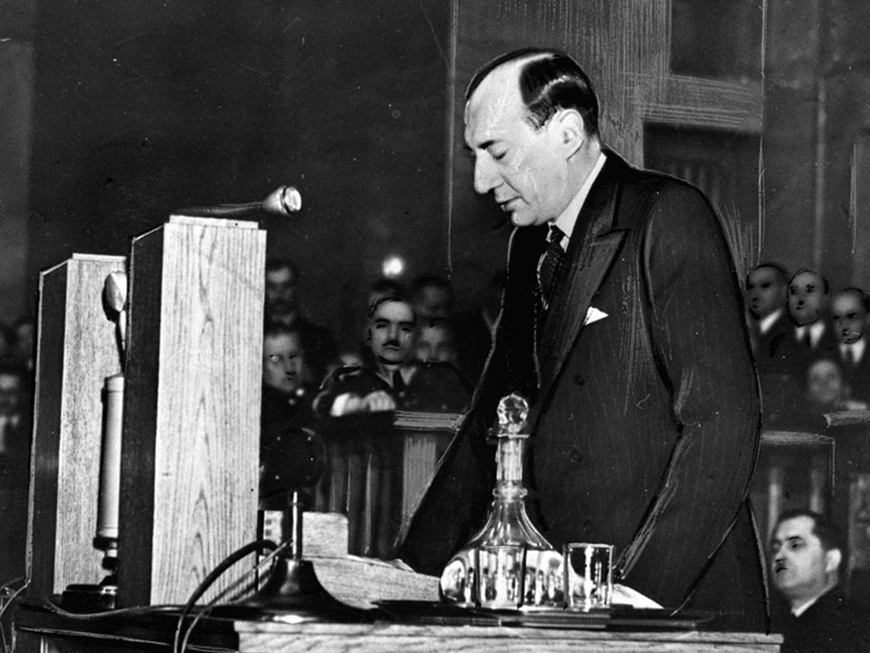

### 2022

Devalued dollar. Both parents at work. Stressed out. Bills up. Stocks down. Divorced. Unemployed. Death.

---

Już siedmiu rosyjskich oligarchów zginęło w tajemniczych okolicznościach od początku wojny na Ukrainie! Jedni się powiesili, inni zostali znalezieni martwi wokół pozabijanych bliskich. Czy były to prawdziwe samobójstwa, w tym rozszerzone? Anders Aslund, szwedzki ekonomista i doradca rządowy ds. krajów byłego ZSRR ma swoje podejrzenia. Uważa, że sprawa może mieć przerażające drugie dno.

---

### 2020

Trump and the Fed are edging closer to negative interest rates—something legendary investor Warren Buffett has warned could have "extreme consequences"..

The coronavirus pandemic and the lockdowns put in place to slow its spread have ravaged the U.S. economy—with the Fed and the Trump administration pumping a staggering $6 trillion in to the system since March and taking interest rates back to record lows to keep it on its feet.

---

Federalny Trybunał Konstytucyjny Niemiec orzekł, iż program zakupu papierowych aktywów przez Europejski Bank Centralny w ramach programu PSPP (w ilości ponad 2bln euro począwszy od 2015 roku) odbył się z pogwałceniem mandatu ECB.

"W oparciu o odpowiedzialność za integrację europejską Rząd Federalny i Bundestag mają obowiązek podjąć aktywne kroki przeciwko PSPP w obecnej formie."

  

---

Sondaże

  

---

  

---

### 2018

Pięciometrowy pomnik Karola Marksa odsłonięty w Trewirze. To podarek od Chin.

### 1994

Zastępca szefa Służby Bezpieczeństwa Ukrainy generał Andrij Chomicz przekazał na ręce zastępcy prokuratora generalnego RP Stefana Śnieżko Ukraińską Listę Katyńską- dokument zawierający dane blisko 3500 obywateli polskich zamordowanych przez NKWD w miejscach egzekucji na terenie Ukrainy.
Na mocy tego dokumentu, który powstał na bazie korespondencji z 25 listopada 1940 roku, składającej się z pięciu worków więziennych akt osobowych Polaków między naczelnikem 1 Wydziału Specjalnego NKWD Ukraińskiej Socjalistycznej Republiki Radzieckiej starszym lejtnantem bezpieczeństwa państwowego Cwietuchinem, a majorem bezpieczeństwa państwowego ZSRR Leonidem Basztakowem ustalono, że skazani zostali umieszczeni na 12 listach dyspozycyjnych wysyłanych przez 1 Wydział Specjalny NKWD w Moskwie, na podstawie których tworzono transporty więźniów kierowanych do miejsc egzekucji.
Na Ukraińskiej Liście Katyńskiej figuruje 726 oficerów Wojska Polskiego (218 oficerów służby stałej i 10 podoficerów, 380 oficerów rezerwy i pospolitego ruszenia oraz 118 oficerów w stanie spoczynku), 746 policjantów i 24 wyższych funkcjonariuszy Policji Państwowej, 24 funkcjonariuszy Straży Więziennej i 4 naczelników więzień. Ponadto 7 generałów, 26 pułkowników i 46 podpułkowników Wojska Polskiego (wśród oficerów byli obrońcy Lwowa 1939, 74 ziemian, 46 nauczycieli, 70 inżynierów, 15 lekarzy, 174 prawników (w tym 2 sędziów Sądu Najwyższego), 19 starostów, 91 urzędników, a także kilkuset obywateli II RP narodowości żydowskiej i ukraińskiej.

  

### 5 maja 39 lat temu zmarł w Belfaście Boby Sands członek IRA (Irlandzkiej Armii Republikańskiej) Odszedł po 66 dniowym strajku głodowym w wieku 27 lat

Bobby Sands był lidrem strajku głodowego 1981 w Belfaście.
Strajk był protestem przeciwko odebraniu członkom IRA I działaczom ruchu republikańskiego statusu więźnia politycznego.

Strajk rozpoczął się 1 marca 1981, kiedy to Bobby Sands odmówił przyjęcia posiłku. Do strajku wkrótce dołączyli też inni więźniowie, aby nadać mu większe znaczenie.
Strajk głodowy skoncentrował się na 5 postulatach;
1. Prawo do nie noszenia więziennych uniformów
2. Prawo do odmowy pracy w więzieniu
3. Prawo do swobodnego zrzeszania się z innymi więźniami oraz organizowania zajęć edukacyjnych i rekreacyjnych;
4. Prawo do jednej wizyty, jednego listu i jednej paczki tygodniowo
5. Prawo do wcześniejszego zwolnienia, które zostało utracone w skutek protest

Pomimo rozgłosu ten strajk nie mógł się zakończyć sukcesem bowiem na czele Rządu Jej Królewskiej Mości stała “Żelazna Dama” (Margaret Thatcher), którastwierdziła iż; “„przestępstwo jest przestępstwem, i nie jest to kwestia polityki”.

Sands zmarł 5 maja 1981 w szpitalu więzienia Maze bo 66 dniowym strajku głodowym.

Po śmierci Sands został okrzyknięty męczennikiem “irlandzkiego ruchu republikanskiego”. Wiadomość o jego śmierci doprowadziłą do wielu zmieszek społecznych na terenie Irlandii Północnej. Jego pogrzeb zgroamdził ponad 100 tysięcy osób.

Po tym jak kolejnych 9 więźniów zagłodziło się na śmierć, w obliczu wzrastającej nienawiści po obu stronach granicy oraz przy rozszerzającym się niepokoju, zdecydowano się na przywrócenie pewnych uprawnień więźniom będącym byłymi członkami grup paramilitarnych – takich m.in. jak IRA, jednak nigdy nie otrzymali statusu więźniów politycznych.

Na podstawie tych wydarzeń w 2008 powstał wielokrotnie nagradzany film Głód (Hunger) w reżyserii Steve’a McQueena

### 1950

Powstało w Warszawie Towarzystwo Wiedzy Powszechnej - pierwsze powojenne stowarzyszenie które oferowało naukę dla dorosłych. Powstało ono w miejsce zlikwidowanego Towarzystwa Uniwersytetu Robotniczego i Ludowego.
Głównymi celami tej uczelni były : podnoszenie standardu życia intelektualnego iupowszechnianie uniwersalnych wartości i norm humanistycznych, prowadzenie szeroko rozumianej edukacji obywatelskiej, kształtowanie społeczeństwa kierującego się zasadami demokracji, praworządności, tolerancji, pluralizmu politycznego i światopoglądowego ,krzewienie kultury narodowej i wiedzy historycznej, kształtowanie poczucia współodpowiedzialności za naród i państwo sprzyjanie rozwojowi osobowości
uczestników procesów edukacyjnych,
krzewienie zaradności życiowej, działania i
pracy w warunkach gospodarki wolnorynkowej.

  

### 1943

Generał Władysław Sikorski wygłosił radiowe przemówienie.
Oto jego treść:
"Kaci hitlerowscy 19-go kwietnia o godzinie 4-tej nad ranem przystąpili do >>zlikwidowania<<, znaną nam metodą, resztek getta warszawskiego, gdzie wegetowało jeszcze kilkadziesiąt tysięcy Żydów. Zamknąwszy wszystkie wyjścia, najechali je samochodami pancernymi i lekkimi czołgami, by przy pomocy karabinów maszynowych wybić resztki mężczyzn, kobiet i dzieci. Ludność żydowska, doprowadzona do rozpaczy, stawiła bohaterski opór zbrojny. Od tego czasu walka trwa. Terkot karabinów maszynowych, wybuchy bomb, pożary ściągnęły w pobliże ludność warszawską, która przejęta zgrozą pomaga, gdzie może i jak może nieszczęsnym ofiarom nieznanego w dziejach barbarzyństwa.

Dziękuję Rodakom w imieniu Rządu oraz własnym za ten szlachetny odruch. Proszę ich o użyczenie wszelkiej pomocy i ochrony mordowanym, a równocześnie piętnuję wobec całej, zachowującej zbyt długo milczenie ludzkości, te wszystkie okrucieństwa"

### 1939

Min Beck wyglasza slynne przemowienie w Sejmie.

  

Minister spraw zagranicznych Józef Beck udzielił odpowiedzi kanclerzowi III Rzeszy Adolfowi Hitlerowi na wypowiedzenie przez III Rzeszę paktu o nieużywaniu siły w stosunkach wzajemnych. Podczas przemówienia minister Beck wypowiedział słynne słowa:

> Pokój jest rzeczą cenną i pożądaną. Nasza generacja skrwawiona w wojnach na pewno na pokój zasługuje. Ale pokój, jak prawie wszystkie sprawy tego świata ma swoją cenę wysoką, ale wymierną. My w Polsce nie znamy pojęcia pokoju za wszelką cenę. Jest jedna tylko rzecz w życiu ludzi, narodów i państw, która jest bezcenna. Tą rzeczą jest honor.

https://pl.wikisource.org/wiki/Przem%C3%B3wienie_J%C3%B3zefa_Becka_w_Sejmie_RP_5_maja_1939_r

### 1350

W bitwie pod Żukowem król Kazimierz III Wielki rozgromił wojska litewskie, odzyskując Ruś halicko-wołyńską.
"...Według tradycji mazowieckiej, utrwalonej w tzw. Spominkach sochaczewskich, w roku 1350 „pewien książę litewski ze swoim wojskiem spustoszył ziemię łęczycką w Zielone Świątki", które wypadały wówczas 16 maja. Wielu ludzi zginęło. Kazimierz postępował za najeźdźcą i 20 maja dopadł jego wojsko we wsi Żukowo koło Sochaczewa. Natarł na nie i zadał mu klęskę. Wielu Litwinów zatonęło w rzece Bzurze. Autor kończy swoją relację morałem, że „dlatego tak licho zginęli, ponieważ byli złodziejami"..."

---

<a href="https://github.com/TomaszWaszczyk/historia.waszczyk.com/edit/master/src/content/may-5.md" target="_blank">Edytuj tę stronę dzieląc się własnymi notatkami!</a>
