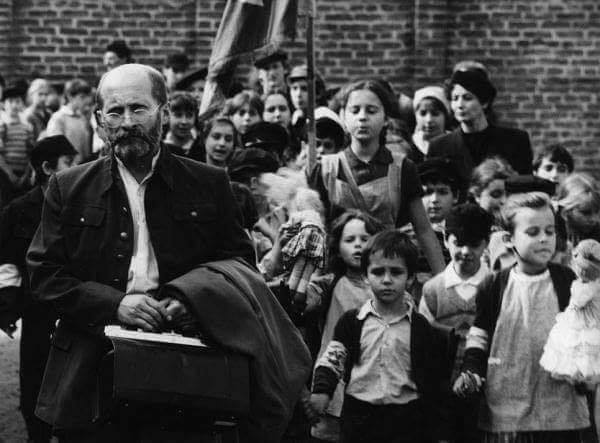
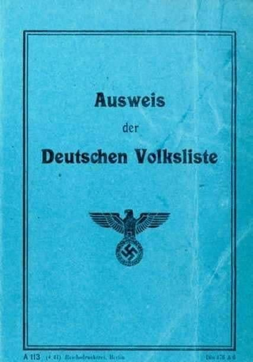
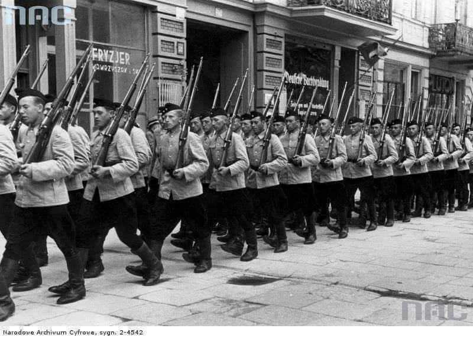
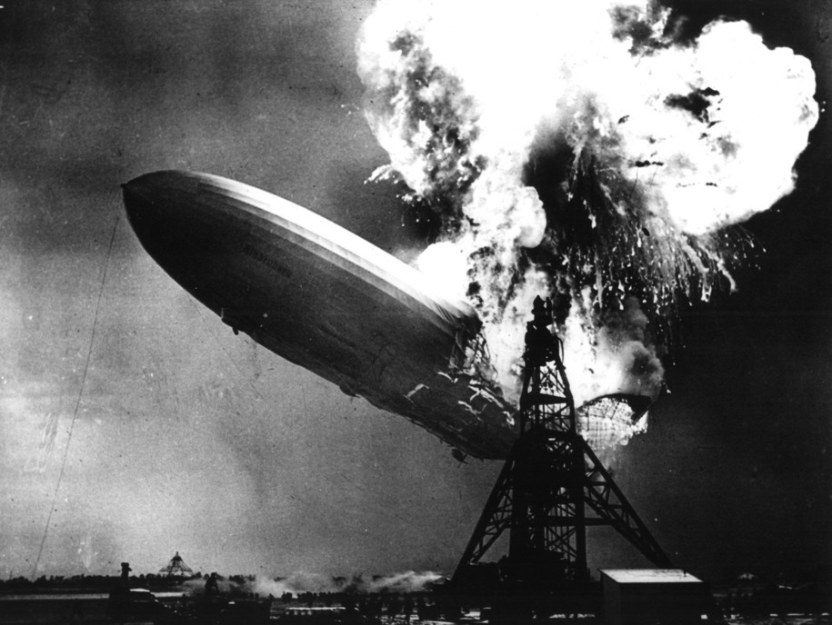
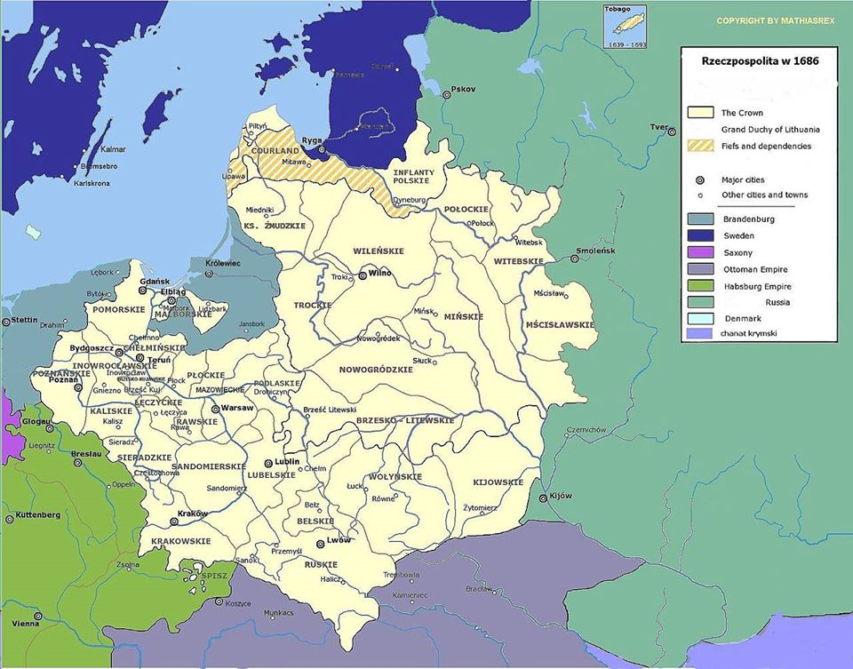

### 2010

<video width="640" height="480" controls>
  <source src="./movies/may/StockMarketCrash- Flash Crash May 6,2010.mp4" type="video/mp4">
Your browser does not support the video tag.
</video>

---

### 1990

Odbyła się premiera filmu fabularnego "Korczak" w reżyserii Andrzeja Wajdy. Film opowiada historię Janusza Korczaka - polsko-żydowskiego lekarza i społecznika, dyrektora Domu Sierot, który został zamordowany w Treblince wraz z wychowankami Domu Sierot i najbliższymi asystentami.
Scenariusz do filmu napisała Agnieszka Holland.
W roli doktora Korczaka wystąpił Wojciech Pszoniak.
Film otrzymał specjalne uznanie jury na festiwalu w Cannes.
Ciekawie o filmie ,,Korczak'' wypowiedziała się na łamach "Messager Européen" pani Elisabeth de Fontenay - francuska filozof i eseistka:
Pytanie, wyprzedzające wszystkie inne: czy nie-Żyd ma prawo dotykać spraw "czysto" żydowskich? Trzeba odpowiedzieć od razu i szczerze: twierdzić, że nie-Żyd nie ma prawa tworzyć dzieła o Shoah, to prawie tak, jakby powiedzieć, że Korczak nic nie wiedział o dzieciństwie, bo nie miał własnych dzieci. Eksterminacja uderzyła w Żydów i Cyganów, ale dotyczy ona całej ludzkości. Zakazywać historii Korczaka nie-Żydowi, to brać odpowiedzialność za zawężanie znaczenia katastrofy do tych, w których ugodziła, i rezygnować z indagowania ludzi, z żądania, by zdali sobie sprawę z nieodwracalnej szkody, jaką lagry, transporty w zaplombowanych wagonach i uśmiercające gazowanie wyrządziły ludzkości. (...) Mówi się, że filmowiec i jego scenarzystka, Agnieszka Holland, przekształcili żydowskiego doktora w świętego, katolickiego i polskiego. Trzeba powtórzyć, że Polakiem Korczak był głęboko, do swego sierocińca, przed wojną, przyjmował dzieci żydowskie i nieżydowskie. Co więcej, jego idee praw dzieci, nawet wspierając się na odwiecznych zasadach sprawiedliwości i miłosierdzia, pozostawały obce tradycji judaistycznej. (...) Co może się wydać najbardziej zaskakujące, skoro pochodzi od reżysera o zbyt pochopnie sfabrykowanej reputacji antysemity, to sposób, w jaki sfilmował kabaret i kolaborantów robiących w getcie interesy. W tej sekwencji i w innych momentach filmu widzimy młodego Żyda, szlachetnego aferzystę, od którego Korczak się nie dystansuje, ani któremu nie prawi morałów. Zobaczymy go w zakończeniu, gdy przy ładowaniu wagonu po raz ostatni próbuje skłonić do ucieczki człowieka, którego tak kocha i podziwia. Aby wrócić do sekwencji kabaretu: ten dionizyjski moment piosenek jidysz, kursowania banknotów i biżuterii może być oceniony jako antysemicki tylko przez tych, którzy angelizują Żydów, sakralizują getto, albo nie wiedzą, że w tej społeczności oblężonej przez śmierć życie toczyło się nieprzerwanie. (...) Korczak Wajdy, a bardziej jeszcze Umschlagplatz Rymkiewicza, mogą zwiastować początek tej symbiozy żydowsko-polskiej, która byłaby ostateczną klęską hitleryzmu.''

  

### 1945

Po zaciekłej, a wręcz fanatycznej obronie padła Twierdza Wrocław (Festung Breslau).

W Moskwie kapitulację Breslau uczczono salutem z 224 dział.

Ogłoszono następujący komunikat: ,,Breslau padł.Wojska 1. Frontu Ukraińskiego, po długotrwałym oblężeniu, 7 maja całkowicie zawładnęły miastem i twierdzą Breslau. Garnizon niemieckich wojsk broniący miasta z komendantem generałem piechoty Niehoffem na czele i jego sztabem zaprzestał oporu, złożył broń i poddał się do niewoli. 7 maja do godziny 19:00 wojska nasze wzięły do niewoli w mieście Wrocław przeszło 40000 niemieckich żołnierzy i oficerów.''

Była to jedna z najkrwawszych bitew II Wojny Światowej. Obrona Festung Breslau jest porównywana do Powstania w Warszawie z uwagi na ogrom zniszczeń. Breslau bronił się dłużej od stolicy III Rzeszy, która skapitulowała 2 maja 1945 roku.

Zniszczenia były przerażające. Zniszczono 21 tysięcy budynków, 60 procent obiektów przemysłowych, wywieziono z miasta 18 milionów ton gruzu.
Zginęło 80 tysięcy ludności cywilnej. Poległo 6 tysięcy niemieckich żołnierzy, a zaginęło 23 tysiące. Na wrocławskim cmentarzu spoczęły ciała 800 sowieckich żołnierzy, ale straty wśród sowietów musiały być znacznie większe.

Warto też dodać, że wielu ewakuowanych mieszkańców Breslau zginęło 14 lutego 1945 podczas nalotu dywanowego na Dresden (Drezno). Mordu tego dokonali alianci.

Po wojnie miasto przyznano Polsce.

Foto: Parlamentariusze niemieccy zmierzają ulicą Gutenberg Strasse do dowództwa sowieckiego.

  

---

Weszła w życie Ustawa o wyłączeniu ze społeczeństwa polskiego wrogich elementów.
Artykuł 10 tego dokumentu głosił:
"Za zrehabilitowanego może być uznany ten, kto udowodni, że został wpisany do grupy niemieckiej listy narodowościowej wbrew swojej woli pod przymusem, a swoim postępowaniem wykazał polską odrębność narodowościową".

  

### 1940

Z rozkazu gubernatora Hansa Franka utworzona została formacja policyjna Sonderdienst- służba specjalna nazywana również prywatną policją Hansa Franka. Jej członkowie wywodzili się z działającego na terenie Generalnej Gubernii Volksdeutscher Selbstschutzu.
Członkowie Sonderdienstu byli umundurowani i uzbrojeni według sortu mundurowego obowiązującego w Wehrmachcie. Wyglądali podobnie do innych jednostek wojska niemieckiego. Odróżniały ich czerwone opaski noszone na lewym przedramieniu z czarnym napisem „Generalgouverment Polen Sonderdienst” oraz naszywka z napisem "Sonderdienst Generalgouverment" wokół godła Generalnego Gubernatorstwa.
Sonderdienst była jednostką pełniącą rolę pomocniczą dla policji niemieckiej i innych służb bezpieczeństwa podlegających niemieckiej administracji.
Sonderdienst wykorzystywana była również do przeprowadzania i pomocy w pogromach polskich wsi.

  

### 1937

W trakcie cumowania na lotnisku w Lakehurst w amerykańskim stanie New Jersey spłonął niemiecki sterowiec LZ-129 „Hindenburg”, przewożący 97 osób. Zginęło 36 osób:13 pasażerów i 22 członków załogi oraz główny członek załogi naziemnej, kapitan Ernst Lehmann.

  

### 1882

https://en.wikipedia.org/wiki/Chinese_Exclusion_Act

### 1856

Urodził się lekarz, neurolog i twórca psychoanalizy Sigmund Freud

... był pionierem nowego sposobu myślenia o ludzkiej psychice - wprowadził pojęcie podświadomości i zasugerował, że warto próbować do niej zajrzeć. Przekonał nas, że już sama rozmowa może mieć działanie terapeutyczne, dając tym samym zajęcie i niezły dochód rzeszom psychoanalityków. Dał wreszcie podstawy do traktowania snów w sposób, w jaki człowiek chciał je traktować - nie jako przypadkowe, ale znaczące obrazy.

<a href="./documents/may/01_01_Czernianin-W_Czernianin-H_Zarys-teorii-psychoanalitycznej.pdf" target="_blank">Zarys teorii psychoanalitycznej</a>

### 1686

W Moskwie podpisano tzw. traktat Grzymułtowskiego utrwalający warunki rozejmu andruszowskiego, kończącego IV wojnę polsko-rosyjską.

W wyniku walnego zwycięstwa króla Jana III Sobieskiego nad Turkami pod Wiedniem powstała szeroka koalicja pod patronatem papieża Innocentego XI zwana Świętą Ligą. W jej skład oprócz Stolicy Apostolskiej i Rzeczypospolitej weszły Cesarstwo Niemieckie oraz Wenecja, czyli kraje bezpośrednio zaangażowane w walki z Turkami. Stosowny traktat podpisany został 5 marca 1684 r., a jego sygnatariusze mieli nadzieję na dalsze kontynuowanie wojny aż do wyzwolenia Europy od islamskiego zagrożenia. Koalicjanci potrzebowali jednak dodatkowego wsparcia, dlatego też naciskano na króla Jana III, aby zawarł pokój z Moskwą, co ułatwiłoby jej skłonienie do udziału we froncie antytureckim i wzmocnienia wspólnych sił (dla Rzymu była to również sprawa o wymiarze prestiżowym ), tym bardziej że rozmowy z innymi potencjalnymi sojusznikami - Chanatem Krymskim i Persją - spełzły na niczym.

Strona polska przystąpiła więc do rokowań pokojowych w stolicy carów, opierając się na dotychczas obowiązującym rozejmie andruszowskim z 1667 r. W końcu 6 maja 1686 r. w Moskwie podpisano pokój wieczysty między wysłannikami Rzeczypospolitej, wojewodą poznańskim Krzysztofem Grzymułtowskim i kanclerzem wielkim litewskim Marcjanem Ogińskim, a regentką Zofią Aleksiejewną (w imieniu jej niepełnoletnich braci Iwana V i Piotra I) - przeszedł on do historii jako pokój Grzymułtowskiego. Potwierdzono w nim warunki traktatu z 1667 r., pozostawiając ziemie smoleńską, siewierską, czernihowską oraz lewobrzeżną Ukrainę wraz z Kijowem we władaniu Moskwy. Wzajemnie zagwarantowano również wolność religijną - strona moskiewska katolikom, strona polska prawosławnym. Dzięki temu można było następnie myśleć o kolacji przeciw Turcji.

Król Jan III oficjalnie zaprzysiągł postanowienia moskiewskiego traktatu kilka miesięcy później, we Lwowie 21 grudnia 1686 r. Traktat ten kładł kres polsko-rosyjskim zmaganiom w XVII wieku, stając się podstawą wzajemnych stosunków w następnym stuleciu, i obowiązywał aż do rozbiorów.

  

---

<a href="https://github.com/TomaszWaszczyk/historia.waszczyk.com/edit/master/src/content/may-6.md" target="_blank">Edytuj tę stronę dzieląc się własnymi notatkami!</a>
