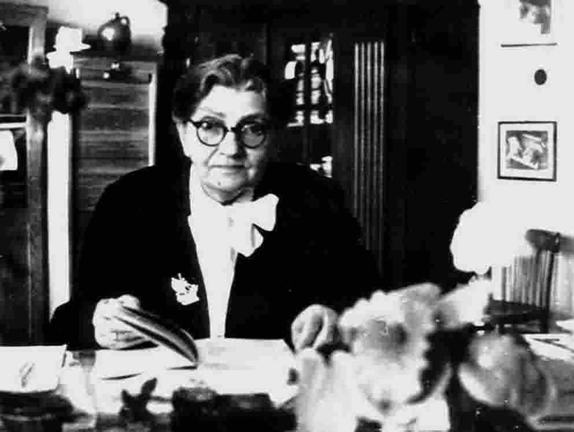
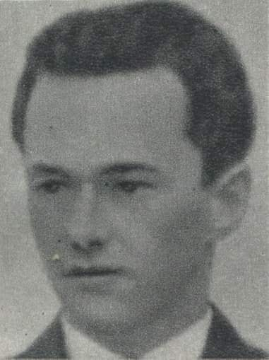
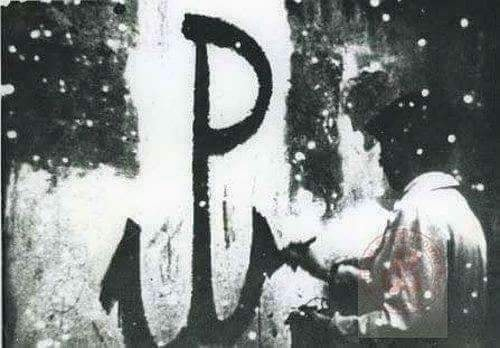
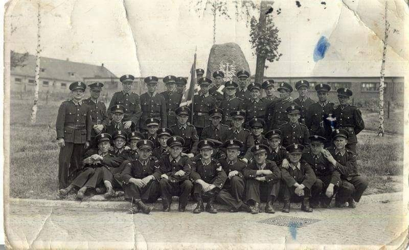
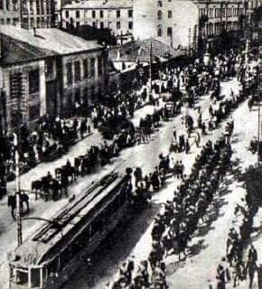
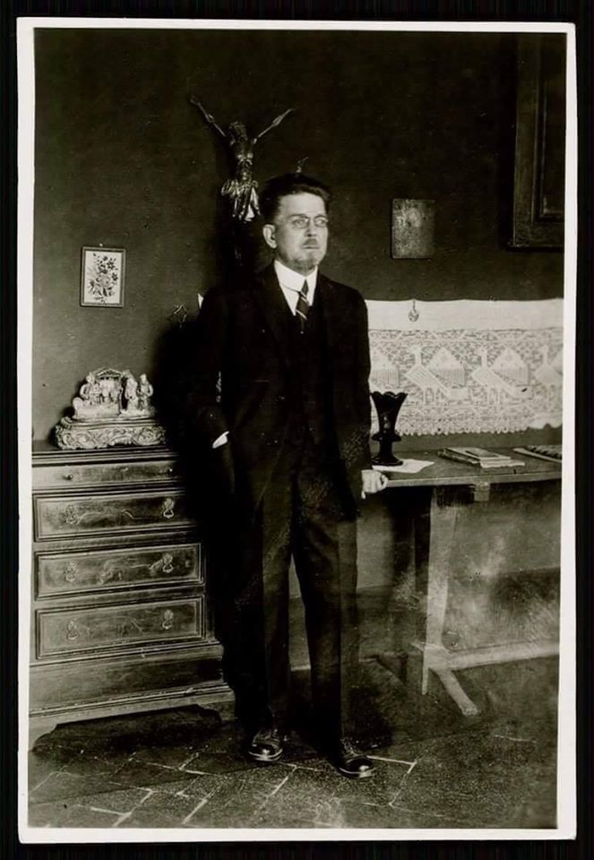

### 2020

  

---

> Paul Tudor Jones: “The best profit-maximizing strategy is to own the fastest horse... If I am forced to forecast, my bet is it will be Bitcoin.”

  

  

### 1967

"Poza przygotowaniem zawodowym człowieka, poza jego wykształceniem, najkorzystniejszą, najbardziej podstawową i decydującą wartością w jego życiu jest jego człowieczeństwo".

W Warszawie zmarła na zawał profesor Maria Grzegorzewska-polska pedagog, prekursorka i twórczyni polskiej pedagogiki specjalnej. Swoje życie poświęciła niesieniu pomocy osobom chorym i kalekim.

W okresie II Wojny Światowej profesor Maria Grzegorzewska pracowała w szkole specjalnej numer 177 w Warszawie jako nauczycielka. Miała poważne problemy z sercem, a mimo to brała udział w tajnej działalności oświatowej Delegatury Rządu Londyńskiego. Prowadziła roczne studium kształcące nauczycieli, a także działała w konspiracji , z narażeniem własnego życia udzielała pomocy Żydom, brała udział w Powstaniu Warszawskim- pełniła funkcję sanitariuszki. W czasie Powstania spłonął jej dom wraz z pracami Pani profesor oraz jej uczniów - nie udało się ich odtworzyć.

Pochowana na warszawskich Powązkach.

  

Ciekawostka: Jako mała dziewczynka bardzo bała się osób niepełnosprawnych.

### 1943

W ruinach getta przy ulicy Dzielnej 27 w Warszawie rozstrzelany został przez Niemców Jan Wilhelm Hörl (zdjęcie) podporucznik broni pancernych, Cichociemny, członek Okręgu Lublin Armii Krajowej.
Był synem podpułkownika piechoty Wojska Polskiego Wilhelma Franciszka Hörla. W roku 1939, po ukończeniu 1 klasy licealnej w VI Państwowym Liceum i Gimnazjum im. Tadeusza Reytana w Warszawie nie został zmobilizowany, ale tydzień po wkroczeniu do Polski wojsk sowieckich przekroczył granicę polsko-węgierską, by już w październiku dotrzeć do Francji, gdzie gdzie został skierowany do Szkoły Podchorążych Broni Pancernej w Sérignan. Walczył w szeregach 10 Brygady Kawalerii Pancernej. W czerwcu 1940 roku został razem z brygadą ewakuowany do Wielkiej Brytanii, gdzie został przydzielony do 14 pułku, a następnie do 66 batalionu czołgów. Do Polski powrócił jako Cichociemny w marcu 1943 roku, a już w kwietniu tego samego roku został aresztowany w Warszawie przez niemiecką policję kryminalną. Był więźniem Pawiaka, przesłuchiwanym przez gestapo. Miał niespełna 22 lata. W lipcu 1944 roku został odznaczony pośmiertnie Krzyżem Srebrnym Orderu Virtuti Militari.

  

### 1942

Kierownictwo Walki Cywilnej wydało 10 przykazań walki cywilnej.

1) Polska walczy z wrogiem nie tylko poza granicami Kraju, ale i na swoich obecnie okupowanych ziemiach.
2) Do chwili rozpoczęcia rozprawy zbrojnej - wyrazem wojny na ziemiach polskich jest walka cywilna.
3) Udział w walce cywilnej jest obowiązkiem każdego obywatela polskiego.
4) Podstawowym nakazem i obowiązkiem jest poszanowanie prawowitych władz polskich na emigracji, oraz posłuch wobec zarządzeń Czynników Miarodajnych w Kraju.
5) Nakazem walki cywilnej w stosunku do okupanta jest bojkot jego zarządzeń i wezwań, utrudnianie mu wszelkiej akcji - w granicach nakreślonych przez Kierownictwo życia polskiego oraz absolutny bojkot w stosunkach handlowych, kulturalnych i towarzyskich.
6) Obowiązuje konieczność solidarności społeczeństwa, wspieranie bliźniego Polaka wszędzie gdzie grozi mu zguba lub nędza.
7) Utrzymywać należy na najwyższym poziomie poczucie honoru narodowego i zgodnie z tym honorem postępować.
8) Należy przeciwdziałać w spotykanych wypadkach odstępstwa Polaka od obowiązujących go zasad postępowania, a to drogą perswazji, napomnień, bojkotu towarzyskiego, wreszcie rejestrowania występnych faktów i przekazania ich odpowiednim czynnikom polskim.
9) Wobec odstępców i zaprzańców obowiązuje bojkot, jak wobec wroga, oraz rejestrowanie ich jako zdrajców.
10) Powinnością każdego Polaka jest troska o ocalenie i zachowanie polskości we wszelkiej postaci, a więc ludzkiej, kulturalnej i materialnej jako sił potrzebnych do wywalczenia wolności i odbudowania Ojczyzny.
Polacy! Stopień podporządkowania się powyższym zasadom i nakazom będzie sprawdzianem naszej wartości obywatelskiej wobec przyszłych pokoleń. Pamiętajcie, że w dniach wolności wszyscy będziemy musieli zdać rachunek z naszego obecnego stanowiska i naszych czynów.

  

### 1940

W Warszawie gestapo dokonało aresztowania 69 oficerów Policji Polskiej Dystryktu Warszawskiego.
Głównym aresztowanym był podpułkownik Marian Stefan Kozielewski -brat Jana Karskiego.
Aresztowanych osadzono w areszcie na Pawiaku, a następnie wywieziono do KL Auschwitz.
Aresztowanie było częścią przeprowadzanej między majem, a lipcem 1940 roku akcji pacyfikacyjnej AB i miało na celu zlikwidowanie struktur Polskiego Państwa Podziemnego w Policji Polskiej.

  

### 1928

https://en.wikipedia.org/wiki/Felix_Zandman

### 1920

W czasie wojny polsko-bolszewickiej wojska polskie i ukraińskie wkroczyły do Kijowa.
Fakt ten był zwieńczeniem rozpoczętej 25 kwietnia 1920 roku wspólnej ofensywy polsko-ukraińskiej przeciwko bolszewikom.
Wspierane przez Ukraińców dowodzonych przez Semena Petlurę Wojsko Polskie zajęło całą Ukrainę po prawej stronie Dniepru tracąc zaledwie 150 żołnierzy.
Wejście Polaków do Kijowa początkowo nie spotkało się z powszechną akceptacją ludności ukraińskiej, ale za to zostało entuzjastycznie przyjęte przez mieszkających tam Polaków.
Zdobycie Kijowa było sukcesem oręża polskiego porównywalnym do innych polskich zwycięstw pod Kircholmem i Chocimiem.
Zaledwie tydzień po zajęciu Kijowa przez polsko-ukraińskie siły, Armia Czerwona rozpoczęła kontrnatarcie, które - choć początkowo odparte - w czerwcu zmusiło wojska polskie do odwrotu. Oddziały bolszewickie zajęły Żytomierz, oblegały Lwów i coraz bardziej zagrażały Warszawie. Armii polskiej w bitwie warszawskiej w sierpniu 1920 roku udało się jednak pokonać Armię Czerwoną.

  

### 1892

https://pl.wikipedia.org/wiki/Josip_Broz_Tito

### 1867

We wsi Kobiele Wielkie przyszedł na świat Władysław Stanisław Reymont- polski pisarz, nowelista, prozaik, noblista w dziedzinie literatury, a prywatnie przyjaciel Romana Dmowskiego.

Właściwie nazywał się Stanisław Władysław Rejment - kolejność imion tudzież pisownię własnego nazwiska zmienił sobie sam.
Miał liczne rodzeństwo, bo aż siedmioro. Jego ojciec pracował jako organista kościelny. Wbrew pozorom rodzina Państwa Rejment była dość zamożna. Władysław, przyszły noblista, nie pałał zbytnią chęcią do nauki. Ojciec posłał go do warszawskiej szkoły krawiectwa, którą ukończył. W wieku 18 lat przyłączył się do trupy aktorskiej. Rodzina zapewniła mu pracę na stanowisku niższego funkcjonariusza kolei. Praca ta była dość nużąca dla Władysława, dlatego spróbował swoich sił w aktorstwie. W roku 1890 związał się z adeptem wiedzy tajemnej, Puszowem i wyjechał z nim do Niemiec, aby szerzyć spirytyzm. Starał się o odbycie nowicjatu w klasztorze na Jasnej Górze. Władysław ponownie powrócił na stanowisko niższego funkcjonariusza kolei Warszawsko-Wiedeńskiej. Literacko debiutował w 1894 roku. Przeniósł się do Warszawy. Żył dzięki pisaniu. Dzięki zarobionym funduszom dużo podróżował - w Paryżu poznał m.in. Stefana Żeromskiego, a także przyszłego tłumacza Chłopów Franka-Luisa Schoella.
W 1900 uległ wypadkowi kolejowemu. Miał 12 złamanych żeber. Opiekowała się nim Aurelia Szabłowska- jego przyszła żona.
Pełnił funkcję prezesa Związku Pisarzy i Dziennikarzy, potem prezesa Warszawskiej Kasy Przezorności i Pomocy dla Literatów i Dziennikarzy. 10 grudnia 1924 roku w Sztokholmie w imieniu chorego Władysława Literacką Nagrodę Nobla za powieść ,,Chłopi'' odebrał Alfred Wysocki. Oprócz nagrody Nobla został mu przyznany czek na łączną kwotę 116 718 koron. Władysław odszedł z tego świata 5 grudnia 1925 roku, a pochowany został na Cmentarzu Powązkowskim w Warszawie, zaś jego serce spoczęło w kościele Świętego Krzyża. Utwory Reymonta tłumaczone są na kilkanaście języków. W jego dawnym majątku Kołaczkowie znajduje się obecnie Muzeum Reymontowskie.
Powieść ,,Chłopi'' doczekała się dwóch ekranizacji filmowych. Po raz pierwszy filmowe odcinki wyreżyserował Eugeniusz Modzelewski w 1922 roku. Po raz drugi ekranizację powieści przygotował reżyser Jan Rybkowski w 1973 roku.

  

---

<a href="https://github.com/TomaszWaszczyk/historia.waszczyk.com/edit/master/src/content/may-7.md" target="_blank">Edytuj tę stronę dzieląc się własnymi notatkami!</a>
