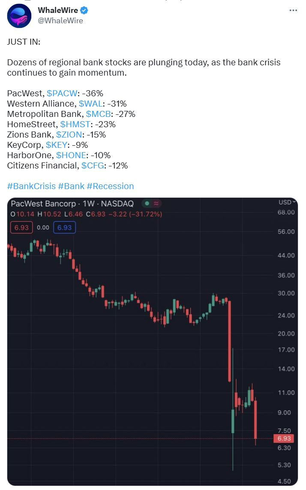
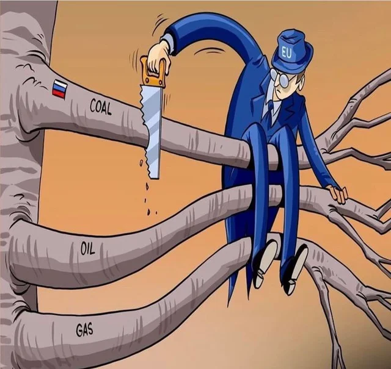
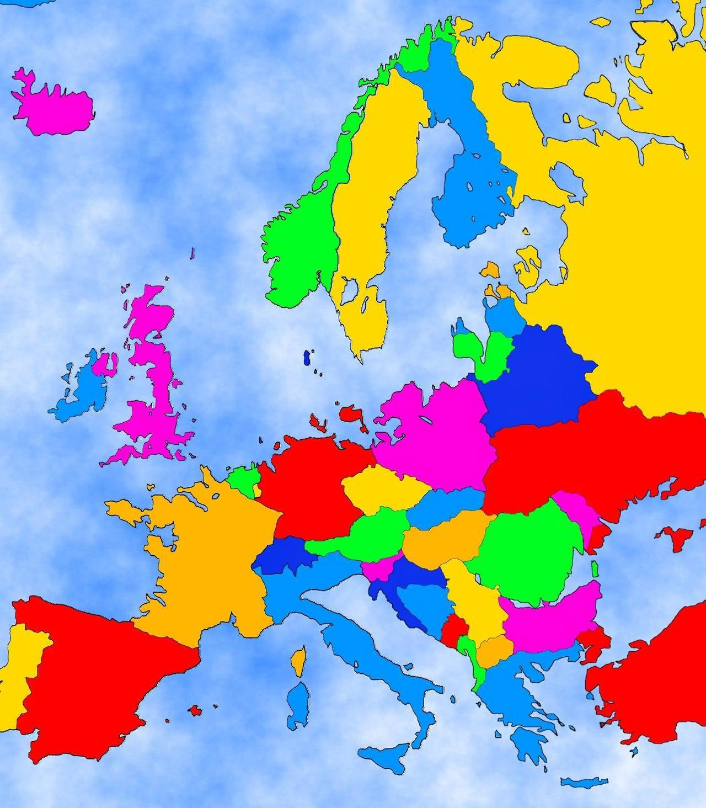
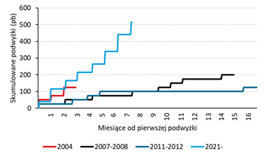
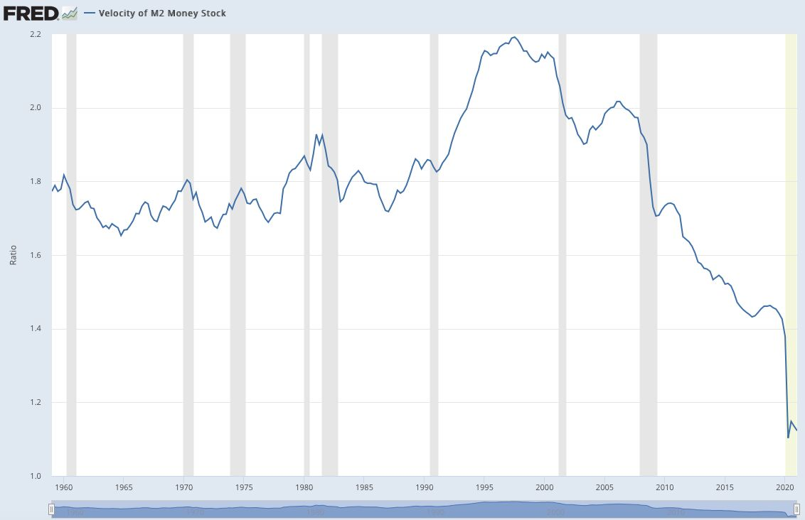
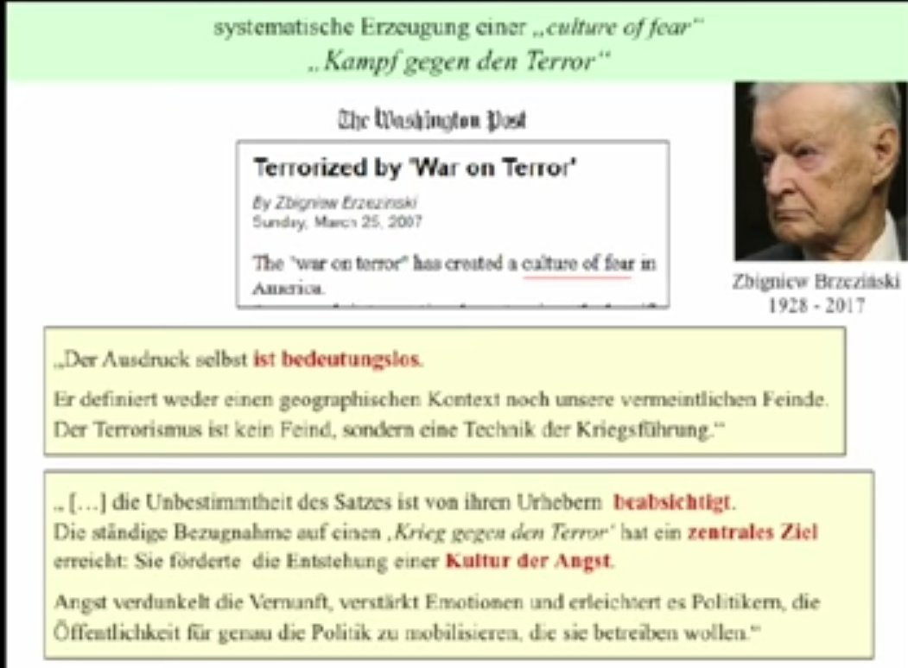
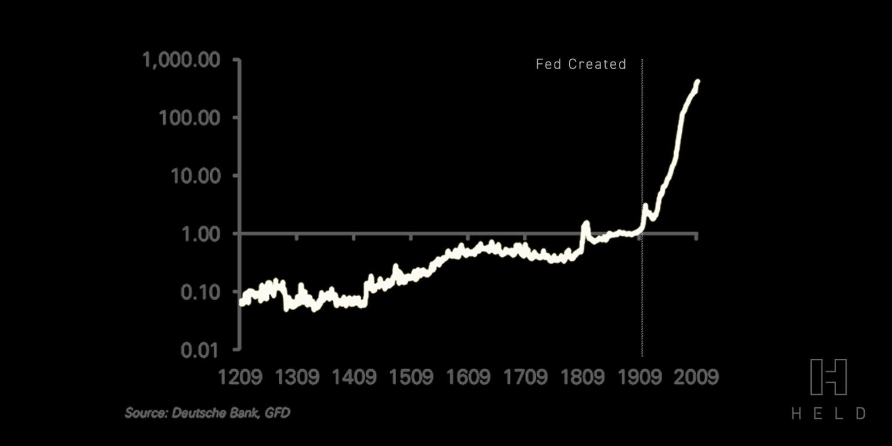
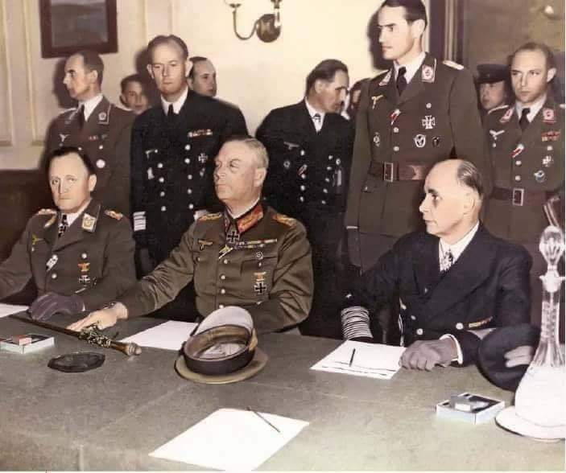
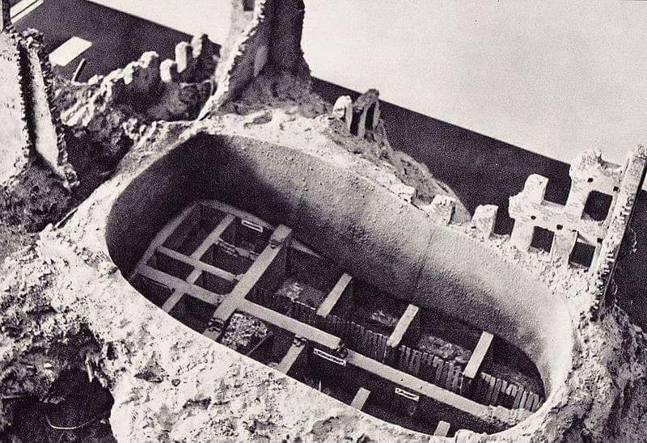

### 2023

It looks like the US banking crisis is NOT over. Dozens of regional bank stocks are plunging, as the bank crisis continues to gain momentum.

Is it just the beginnings.

A month ago, Jay Powell and Treasury Secretary Janet Yellen said risks were limited to the banks under question (SVB, Signature, Silverbank), i.e, risks were idiosyncratic and not structural.

With the failure of First Republic, it is getting clearer that this is becoming something more structural. One year after the start of the fastest rate hike since the 80s, credit accidents are becoming "a feature not a bug" of the current system. the weakest links of the economy (regional banks, commercial banks, etc.) are throwing the towel one by one. The relative complacency of the #equity market (VIX way below 20) might not last.

  

<!-- <video width="640" height="480" controls>
<source src="./movies/may/gandalf.mp4" type="video/mp4">
Your browser does not support the video tag.
</video> -->

### 2022

Nigeria będzie pierwszym krajem, który w poniedziałek wstrzyma połączenia lotnicze - poinformowała w sobotę agencja Bloomberg.

Rosnące ceny paliwa lotniczego sprawiają, że biznes staje się nieopłacalny.

Operatorzy linii lotniczych „wstrzymają działalność w całym kraju” do odwołania, poinformował w oświadczeniu związek przewoźników lotniczych. To kolejny skutek inwazji Rosji na Ukrainę.

  

  

---

  

  

---

### 2021

  

### 2020

Czekamy na chińską cyfrową walutę "backed by gold".

---

  

  

---

  

### 2019

  

<video width="640" height="480" controls>
  <source src="./movies/20190508_israel.mp4" type="video/mp4">
Your browser does not support the video tag.
</video>

---

### 1993

Sąd Wojewódzki w Warszawie wydał wyrok w sprawie reklamy porównawczej płynów do mycia naczyń Sunlicht i Ludwik, w której zastosowano hasło reklamowe "Mam nowego przyjaciela. A co z Ludwikiem? "
Warszawski sąd orzekł, że reklama ta poprzez porównanie dyskredytuje konkurenta oraz godzi w jego renomę.

  

### 1946

https://pl.wikipedia.org/wiki/Dariusz_Przywieczerski (to NIE jest głowa FOZZ - generałem afery była Moskwa)

Jan Boniuk

Janusz Sawicki

Bogusław Kot - Bank Millenium

Centrale Handlu Zagranicznego

Anatol Lawina

Ireneusz Sekuła

### 1945

Niemcy w berlińskiej Szkole Saperów w miejscowości Karlhorst,  Niemcy podpisały bezwarunkowy akt kapitulacji wobec czterech mocarstw, kończąc tym samym II wojnę światową w Europie - największą w historii wojnę rozpoczętą 1 września 1939 roku swoją agresją na Polskę, mającą zapewnić panowanie tysiącletniej III Rzeszy nad całym światem poprzez poddanie swojemu władztwu a następnie biologiczne wyniszczanie podbitych narodów, poczynając od biologicznego wyniszczenia Żydów. Wojna rozprzestrzeniła się na inne kontynenty. Dla Polski wojna ta trwała 5 lat 8 miesięcy i 8 dni. Przez cały ten czas setki tysięcy Polaków walczyło na lądzie , morzu w powietrzu, wspólnie z innymi armiami aliantów, o jeden jedyny cel - odbudowę swojego wolnego i suwerennego państwa w wolnej, demokratycznej Europie. W ostatniej fazie II wojny światowej w jednostkach regularnych wszystkich państw alianckich walczyło łącznie ok. 600 tys. Polaków oraz kilkaset tysięcy w armii podziemnej w kraju. Straty wśród ludności polskiej wyniosły 6 027 000. Szacuje się, że całkowita liczba poległych żołnierzy polskich w Europie w latach 1939- 1945 wynosi 300 000 tysięcy. W liczbę poległych żołnierzy polskich wlicza się także żołnierzy z AK oraz WP pod kierownictwem sowieckim.Głównym celem bombardowań w latach 1939-44 była Warszawa, liczba ofiar bombardowań wśród ludności cywilnej wyniosła 90 000. 
Zgładzono około 3 milionów polskich Żydów i około 3 milionów Żydów - obywateli innych krajów, wymordowanych przez nazistów w ośrodkach zagłady założonych przez aparat terroru państwa Hitlera w poważnej części na okupowanym terytorium Polski. Ofiarą krwawego terroru padło równocześnie ponad 2 miliony polskich chrześcijan. Co czwarty polski ksiądz katolicki i co czwarty polski uczony, co piąty polski nauczyciel padli ofiarą zbrodni. Liczby te nie obejmują ciężkich doświadczeń ok. 2,3 miliona ludzi wysiedlonych przymusowo ze swych domów, ponad 2,5 miliona robotników przymusowych z Polski oraz ok. 200 tys. dzieci wywiezionych w celach germanizacyjnych, z czego 3/4 nie wróciło nigdy do swych rodzin, do Polski.
Trudno oszacował ofiary całej II wojny światowej. Jedno z ostrożniejszych źródeł podaje liczbę 14 201 000 ofiar wśród żołnierzy, 24 042 000 ofiar wśród ludności cywilnej i ogólną liczbę 38 243 000, włączając w to Stany Zjednoczone, Chiny i Japonię. Jeśli odejmiemy od tego liczbę ofiar odnoszącą się do Ameryki Północnej, Dalekiego Wschodu i Wspólnoty Brytyjskiej, otrzymuje się wiarygodną liczbę ofiar śmiertelnych związanych z wojną w Europie : 
wojskowi 9 326 000
ludność cywilna:16 625 000.
Straty odnotowane w rejestrach (Niemcy, Włochy, Austria, Finlandia, Zjednoczone Królestwo, Francja, kraje Beneluksu, Norwegia) 2 961 000
Straty szacowane na podstawie prognoz (ZSRR, Rumunia, Włochy, Polska, Czechosłowacja, Jugosławia, Grecja, Bułgaria, Albania) 25 327 000. Łącznie 28 288 000.
AKT KAPITULACJI TRZECIEJ RZESZY Z 8 MAJA 1945 r.
My niżej podpisani, działając z upoważnienia Naczelnego Dowództwa Niemieckich Sił Zbrojnych, niniejszym bezwarunkowo poddajemy przed Najwyższym Dowództwem Alianckich Sił Ekspedycyjnych i jednocześnie przed Najwyższym Dowództwem Armii Czerwonej wszystkie siły na lądzie, morzu i powietrzu, które pozostają w dniu dzisiejszym pod niemiecką kontrolą.
Naczelne Dowództwo Niemieckich Sił Zbrojnych natychmiast wyda rozkazy niemieckim władzom wojskowym, wodnym, powietrznym i wszystkim siłom pod niemiecką kontrolą zaprzestania aktywnych działań o godzinie 2301 czasu środkowoeuropejskiego 8 maja i pozostania na pozycjach zajmowanych w tym czasie. Żaden statek, jednostka pływająca ani też statek powietrzny nie zostanie zatopiony, ani też nie zostaną dokonane żadne uszkodzenia w ich kadłubach, maszynach lub wyposażeniu, ani też w jakichkolwiek urządzeniach, wyposażeniu, aparatach i wszelkich środkach technicznych służących ogólnie do prowadzenia wojny.
Naczelne Dowództwo Niemieckich Sił Zbrojnych natychmiast wyda odpowiednim dowódcom, i zapewni przekazywanie wszelkich innych rozkazów wydanych przez Najwyższe Dowództwo Alianckich Sił Ekspedycyjnych i przez Najwyższe Dowództwo Armii Czerwonej.
Niniejszy akt kapitulacji nie będzie obowiązywał, i zostanie zastąpiony przez, ogólny dokument kapitulacji nałożony przez, lub w imieniu Narodów Zjednoczonych w stosunku do Niemiec i niemieckich sił zbrojnych jako całości.
W przypadku, jeżeli Naczelne Dowództwo Niemieckich Sił Zbrojnych lub też jakiekolwiek siły pod jego kontrolą będą działać w sprzeczności z niniejszym Aktem Kapitulacji, Najwyższe Dowództwo Alianckich Sił Ekspedycyjnych i Najwyższe Dowództwo Armii Czerwonej podejmą działania karne bądź takie, jakie uznają za stosowne.
Niniejszy Akt został sporządzony w języku angielskim, rosyjskim i niemieckim. Tylko wersje angielska i rosyjska są autorytatywne.
Podpisano 8 maja 1945 r. w Berlinie.
W imieniu Naczelnego Dowództwa Niemieckich Sił Zbrojnych
Von Friedeburg, Keitel, Stumpff

W obecności:
W imieniu Najwyższego Dowództwa Armii Czerwonej
Marszałek Związku Radzieckiego
G. Żukow
W imieniu Najwyższego Dowództwa Alianckich Sił Ekspedycyjnych
Marszałek Lotnictwa
Tedder
W podpisaniu uczestniczyli także jako świadkowie:
Generał Dowodzący Strategicznymi Siłami Powietrznymi Stanów Zjednoczonych
Spaaz
Generał Dowódca Pierwszej Armii Francuskiej
F. de Lattre-Tassigny
Foto: Podpisywanie aktu bezwarunkowej kapitulacji Niemiec. 
Od lewej siedzą: generał Stumpf, feldmarszałek Keitel oraz admirał Friedeburg.

  

### 1943

Znajdujący się w Warszawie przy ulicy Miłej 18 tzw Bunkier Anielewicza, w którym skryło się 300 członków Żydowskiej Organizacji Bojowej otoczyły połączone oddziały niemieckie i ukraińskie.
Większość ukrywających się w nim Żydów nie chciała się poddać, więc oprawcy wpuścili do jego wnętrza gaz. Części znajdujących się w nim ludzi udało się wydostać, ale pozostałe 120 osób, wobec braku szans na wyjście z tego cało popełniło zbiorowe samobójstwo.
Zasypany bunkier stał się jednocześnie zbiorowym grobem, gdyż po 1945 przy Miłej 18 nie przeprowadzono prac ekshumacyjnych.

  

---

<a href="https://github.com/TomaszWaszczyk/historia.waszczyk.com/edit/master/src/content/may-8.md" target="_blank">Edytuj tę stronę dzieląc się własnymi notatkami!</a>
