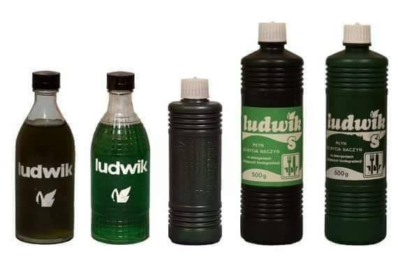

### 2020

Czekamy na chińską cyfrową walutę "backed by gold".

---

  

  

---

  

### 2019

  

<video width="640" height="480" controls>
  <source src="./movies/20190508_israel.mp4" type="video/mp4">
Your browser does not support the video tag.
</video>

---

### 1993

Sąd Wojewódzki w Warszawie wydał wyrok w sprawie reklamy porównawczej płynów do mycia naczyń Sunlicht i Ludwik, w której zastosowano hasło reklamowe "Mam nowego przyjaciela. A co z Ludwikiem? "
Warszawski sąd orzekł, że reklama ta poprzez porównanie dyskredytuje konkurenta oraz godzi w jego renomę.

  

### 1943

Znajdujący się w Warszawie przy ulicy Miłej 18 tzw Bunkier Anielewicza, w którym skryło się 300 członków Żydowskiej Organizacji Bojowej otoczyły połączone oddziały niemieckie i ukraińskie.
Większość ukrywających się w nim Żydów nie chciała się poddać, więc oprawcy wpuścili do jego wnętrza gaz. Części znajdujących się w nim ludzi udało się wydostać, ale pozostałe 120 osób, wobec braku szans na wyjście z tego cało popełniło zbiorowe samobójstwo.
Zasypany bunkier stał się jednocześnie zbiorowym grobem, gdyż po 1945 przy Miłej 18 nie przeprowadzono prac ekshumacyjnych.

  

---

<a href="https://github.com/TomaszWaszczyk/historia.waszczyk.com/edit/master/src/content/may-8.md" target="_blank">Edytuj tę stronę dzieląc się własnymi notatkami!</a>
