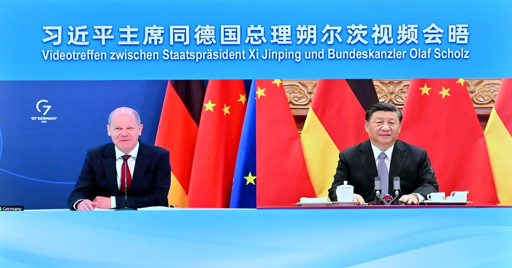

### 2023

> Arabia Saudyjska, Zjednoczone Emiraty Arabskie, Algieria, Egipt, Bahrajn i Iran formalnie poprosiły o dołączenie do grupy krajów BRICS, która przygotowuje się do corocznego szczytu w Afryce Południowej.

  

---

<video width="640" height="480" controls>
<source src="./movies/may/developers.mp4" type="video/mp4">
Your browser does not support the video tag.
</video>

---

Kolonizacja "Made by China".

  

  

> "głębia strategiczna" Bartosiaka w praktyce:

  

---

### 2022

New Zealand is reaching new levels of insanity for absolutely no scientific reason AT ALL!

  

...but for economically-based reasons for sure.

---

  

---

Dziś swoją misję na planecie Ziemia, zakończył Pan Andrzej Bibiński, główny technolog zakładów MERA ERA w latach ich największej świetności. Spotkałem się z Panem Andrzejem dwukrotnie. Rozmawialiśmy głównie o jego pracy w MERA ERA, o procesie przygotowania linii produkcyjnej mikrokomputera MAZOVIA 1016 oraz o problemach z uruchomieniem seryjnej produkcji.
Przypomnę tylko, że w zakładach MERA ERA w latach 1973-1988 produkowano pakiety do komputerów MERA 300, MERA 400, drukarek DW3, pamięci kasetowej PK1, pamięci taśmowej PT105, pamięci 9425, systemów SM, MERA NUCON 400, drukarek DZM180, pamięci taśmowej PT3M, czytnika taśmy CT-301, komputera Mazovia 1016.

  

---

Ambasador Rosji Siergiej Andriejew został oblany czerwoną farbą przed Cmentarzem Żołnierzy Radzieckich w Warszawie. Incydent zarejestrowała kamera Polsat News. Informacja o oblaniu ambasadora Rosji dotarła do Chin. Internauci sugerują, że Polska prosi się o atak lub zniknięcie z map.

  

Następny powód by Rosja wniosła wyzwolenie Polsce..

  

---

### 2021

> ..na granicy Stanów Zjednoczonych i Kanady, tam u góry, w Montanie, jest rezerwat indian, jest to plemie czarnych stóp..

<video width="640" height="480" controls>
<source src="./movies/may/rezerwat_czarnych_stop_2021.mp4" type="video/mp4">
Your browser does not support the video tag.
</video>

---

> "W czterech zakładach firmy Żywiec Zdrój SA, należącej do koncernu Danone, trwa spór zbiorowy z pracodawcą. W ubiegłym roku zwolniono część pracowników produkcji. Jednocześnie otrzymali oni propozycję zatrudnienia w Żywcu Zdrój SA poprzez agencję pracy tymczasowej, jednak na znacznie gorszych warunkach"

---

Wszechobecne propagandowo-infantylizujące zwroty takie jak "bądź sobą", "bądź, kim chcesz", "możesz wszystko", "spełniaj marzenia", "kochaj siebie", "nie pozwalaj się osądzać" itp. można odbierać dwojako. Z jednej strony można się nauczyć je całkowicie ignorować jako lukrowane pustosłowie i pop-psychologiczną mowę-trawę - i to jest dla zdecydowanej większości osób wybór optymalny. Z drugiej jednak strony można do tego stopnia bezwiednie przesiąknąć ich wpływem, że sukcesywnie traci się wskutek tego zdolność do rozumowania w poważnych normatywnych kategoriach, takich jak obowiązki, cnoty, przywary, wyrzeczenia, samodyscyplina, skrucha czy sprawiedliwa kara. To zaś może być z moralnego punktu widzenia wyjątkowo i nieodwracalnie wyniszczające.
Dla porównania, bycie konsekwentnie indoktrynowanym abstrakcyjnymi, pseudonaukowymi frazami powiązanymi z ideologią udającą logicznie skonstruowany system myślowy może być w ostatecznym rachunku mniej groźne. Jeśli np. słyszy się bezustannie o "wartości poznawczej materializmu dialektycznego", "niewątpliwych ustaleniach laborystycznej teorii wartości" czy "walce klas jako o sile napędowej historii", to w pewnym momencie próbuje się przeanalizować wszystkie te ezoteryczne stwierdzenia i zrekonstruować we własnym umyśle opartą na nich doktrynę. Wówczas nasze zdolności dedukcyjne zostają mimo wszystko pobudzone do działania - i możemy wówczas dojść do wniosku, że rzeczona doktryna jest w ostatecznym rachunku jednym wielkim zbiorem sofizmatów i przekłamań.
Jeśli natomiast nasze zdolności dedukcyjne i nasza moralna wrażliwość zostaną wystarczająco rozmiękczone "byciem sobą", "kochaniem siebie" i resztą wspomnianej wcześniej lakierowanej paplaniny (wszakże logika to, jak wiadomo, etyka myślenia), wówczas możemy być całkowicie - choć bezwiednie - gotowi na to, by w następnej kolejności ochoczo połykać sałatki słowne na temat "zrównoważonego rozwoju", "holistycznej ekologii", "bezwarunkowego dochodu" czy "gospodarki inkluzywnej". Innymi słowy, tam, gdzie marksizm-leninizm ze swoimi naukowo-filozoficznymi pretensjami może się rozbić o mur obronny naszego zdrowego rozsądku, tam marksizm-lennonizm ze swoim upupiająco-sztubackim trajkotem może obrócić ten mur obronny w kartonową atrapę.
Podsumowując, przed wielopiętrowymi ideologiami należy się mieć w równym stopniu na baczności, co przed parowyrazowymi sloganami. Zwłaszcza, że intelektualne spustoszenie wywołane przez te pierwsze może być niczym innym, jak przygotowaniem gruntu pod skuteczne rozpanoszenie się tych drugich - najpierw trzeba zrujnować kulturę intelektualną, żeby potem zbudować w jej miejsce brokatową imitację. A zatem to przede wszystkim tę ostatnią należy starannie usunąć, żeby móc cokolwiek odbudować na stałych fundamentach rozumu, sumienia i dobrego smaku - w innym razie będzie się jedynie coraz dalej brnęło na manowce iluzji.

---

Łukaszenka podpisał dekret „O ochronie suwerenności i porządku konstytucyjnego”.
Teraz, w przypadku śmierci Łukaszenki, wszystkie agencje rządowe będą działać zgodnie z rezolucjami Rady Bezpieczeństwa.
Na terytorium kraju natychmiast zostanie wprowadzony stan wyjątkowy lub stan wojenny, po którym Rada Bezpieczeństwa z udziałem zarządzających obwodów podejmie decyzję o przeprowadzeniu wyborów.

---

### 2020

Protesty przedsiębiorców w Polsce oraz protesty w Niemczech dotyczące 'social distancing'

---

https://en.wikipedia.org/wiki/Victory_Day_(9_May)

  

---

### 2013

W Warszawie, w wieku 90 lat zmarł profesor doktor Krzysztof Dunin-Wąsowicz ps. "Mirski"- historyk dziejów najnowszych, autor licznych prac varsavianistycznych, dziejów okupacji, obozów koncentracyjnych, historii ruchu ludowego,PPS. Biograf Ludwika Bergera, założyciela "Baszty"
W czasie II wojny światowej był plutonowym podchorążym batalionu ,,Baszta'' Armii Krajowej, członkiem organizacji młodzieży socjalistycznej „Płomienie”, redaktorem pisma o tej same nazwie. Współpracował z Radą Pomocy Żydom „Żegota”. Został aresztowany 13 kwietnia 1944, po pobycie w Alei Szucha i na Pawiaku został wywieziony do niemieckiego obozu koncentracyjnego Stutthof, z którego uciekł podczas ewakuacji w lutym 1945. Po wojnie był pracownikiem Instytutu Historycznego UW 1946-1948 oraz Instytutu Historii PAN 1953-1993. Działał w Związku Niezależnej Młodzieży Socjalistycznej i Polskiej Partii Socjalistycznej. W latach 1988-90 należał do Rady Ochrony Pamięci Walk i Męczeństwa, Był autorem ponad 20 książek. Wybrane publikacje: "O powstańczym generale" (Iskry, 1966), "Obóz koncentracyjny Stutthof" (Wydawnictwo Morskie, 1970), "Warszawa w pamiętnikach pierwszej wojny światowej" (PIW, 1971), "Na Żoliborzu. 1939-1945" (KiW, 1984), "Historia i trochę polityki" (Wydawnictwo "Lampa i Iskra Boża", 2006), "Stutthof. Ze wspomnień więźnia obozu koncentracyjnego" (Wydawnictwo Muzeum Stutthof w Sztutowie, 2011).
Odznaczony Krzyżem Komandorskim z Gwiazdą Polonia Restituta, medalem Sprawiedliwy wśród Narodów Świata.

  

---

### 2011

<video width="640" height="480" controls>
<source src="./movies/may/greenspan.mp4" type="video/mp4">
Your browser does not support the video tag.
</video>

### 2002

Władimir Putin był odprowadzany po polskich zakładach zbrojeniowych. Tu w towarzystwie http://m.in. prezesa strategicznych spółek zbrojeniowych za rządów PO-PSL.

  

### 1975

W ramach serii "Wielcy" Narodowy Bank Polski wyemitował banknot o nominale 50 zł upamiętniając umieszczeniem na nim wizerunku generała Karola Świerczewskiego.
Ciekawostką jest fakt, że banknot, który wypuszczony został do obiegu był drugą wersją tego nominału.
Pierwsza przedstawiała generała bez czapki.

  

### 1971

Po siedmiu latach budowy oddano znajdującą się w Katowicach halę widowiskowo-sportową Spodek.
Projekt autorstwa trójki architektów; Macieja Gintowta, Macieja Krasińskiego i Jerzego Hryniewieckiego został zlokalizowany przy ulicy Korfantego 35, chociaż jego pierwotna lokalizacja, uwzględniana w ramach planu z 1955 roku miała znajdować się na obrzeżach Katowic na terenie Wojewódzkiego Parku Kultury i Wypoczynku. O obecnej lokalizacji Spodka zdecydował ówczesny wojewoda katowicki Jerzy Ziętek, któremu bardzo spodobał się ten dosyć futurystyczny jak na tamte czasy projekt. Pierwotnie w tym miejscu znajdowała się hałda hutnicza.
Pierwsze prace konstrukcyjne rozpoczęły się w 1964. Wkrótce pracę nad konstrukcją przerwano na 18 miesięcy z powodu podejrzeń o błędy konstrukcyjne. Podejrzenia nie sprawdziły się. W 1969 był oddany pierwszy budynek – przylegające do Spodka lodowisko. Ostatecznie halę ukończono w 1971.
Koszt budowy Spodka szacuje się na 800 milionów ówczesnych złotych.
Po dziś dzień obiekt ten jest miejscem organizowania wielkich imprez sportowych i kulturalnych. To właśnie tutaj koncertowały takie grupy jak Metallica, Deep Purple czy Depeche Mode. Jednymi z wielu organizowanych tu cyklicznie imprez muzycznych są Metalmania i Rawa Blues Festival.

  

### 1965

Na terenie poznańskiej Cytadeli otwarto Muzeum Uzbrojenia.

Muzeum w swoich zbiorach posiada oprócz
ikonografii, fotografii i militariów także
dużą kolekcję sprzętu wojskowego. W
zbiorach znajdują się czołgi, samochody,
samoloty, śmigłowce, haubice i armaty,
będące także na wyposażeniu Wojska
Polskiego .
Ciekawostką jest fakt, że to właśnie tam można zobaczyć jeden z dwóch czołgów, którymi jeździli Czterej Pancerni. Czołg ma wycięte w korpusie otwory na kamerę, ponieważ to w nim nagrywano sceny odbywające się w jego wnętrzu

### 1946

> Your money is not here! Well your money is in Joe’s house. That is right next to yours and in the Kennedys house and Miss Madeleine`s house and 100 others!!” - It's A Wonderful Life (1946)

<video width="640" height="480" controls>
<source src="./movies/may/wonderful.mp4" type="video/mp4">
Your browser does not support the video tag.
</video>

### 1945

Dekretem ustanowionym przez Krajową Radę Narodową prezydent Bolesław Bierut ustanowił w Polsce Narodowe Święto Zwycięstwa i Wolności.
W naszym kraju oficjalne obchody tego dnia trwały do 1989 roku. W Moskwie i na Ukrainie dzień ten do dziś jest czasem wolnym od pracy ,a polscy żołnierze biorą nieregularnie udział w paradach organizowanych z tej okazji.

  

### 1940

Poniższy tekst to fragment książki Emanuela Ringebluma pt "Kronika Getta Warszawskiego".
"9 maja [1940]. Podczas „łapanki” Polaków kazano niektórym Żydom o rysach aryjskich mówić po żydowsku; słuzyło to za dowód [że nie jest się Polakiem]. […] Słyszałem, ze Niemcy wtargneli do kościoła na Grzybowie. Ksiądz uspokajał obecnych, mimo to powstał straszny popłoch. To samo miało miejsce przed kilku dniami w kościele na [placu] Trzech Krzyży, skąd łapano do roboty"

  

### 1917

I wojna światowa: na froncie zachodnim zakończyła się nieudana ofensywa Nivelle’a. Ofensywa była krótka lecz obfita w straty dla... atakujących. Francuzi - 187 tysięcy, Brytyjczycy - 160 tysięcy. W końcu Francuzi mieli tego dość. 27 V 1917 roku wybuchł w Armii Francuskiej otwarty bunt.
Ofensywa wojsk francuskich i brytyjskich przeprowadzona na froncie zachodnim podczas I wojny światowej przeciwko siłom niemieckim. Rozpoczęta 9 kwietnia, trwała do 9 maja 1917. Plan jej opracował szef Sztabu Generalnego generał Robert Nivelle. Ofensywa zakończyła się niepowodzeniem wojsk francuskich i usunięciem ze stanowiska Roberta Nivelle’a.

  

### 1831

W czasie powstania listopadowego pod Firlejem w województwie lubelskim miała miejsce bitwa powstańców dowodzonych przez generała Chrzanowskiego z rosyjskim korpusem generała Kreutza.
W zwycięskiej dla Polaków bitwie
Rosjanie stracili ogółem niemal 1/3 sił. Z 2800 ludzi Polacy wzięli do niewoli 500 jeńców, ponadto zginęło 300 żołnierzy
carskich.

### 1794

"Król gdzieś w oknie stoi ponoć
Nic dziwnego że się kryje
Różnie może być z koroną
Gdy hetmańskie cierpną szyje”
Tak śpiewał kiedyś Jacek Kaczmarski.
9 maja 1794 roku w Warszawie wykonano publiczne egzekucje na przywódcach konfederacji targowickiej: Józefie Ankwiczu, biskupie inflancko-piltyńskim Józefie Kazimierzu Kossakowskim , hetmanie
wielkim koronnym Piotrze Ożarowskim i hetmanie polnym litewskim Józefie Zabielle.
W nocy w Warszawie rozeszła się pogłoska
o ucieczce króla. Lud ogarnęło wzburzenie.
W nocy jakobini wystawili szubienice na
ulicach. 9 maja tłum wtargnął do Ratusza
Staromiejskiego, gdzie obradowała Rada
Zastępcza Tymczasowa. Nie było wyboru.
Należało przychylić się do żądań wzburzonych warszawian. Presja tłumu
zgromadzonego na Rynku Starego Miasta była zbyt silna. Natychmiast Sąd Kryminalny Księstwa Mazowieckiego przystąpił do osądzenia przywódców konfederacji targowickiej.
Jeden z celów insurekcji kościuszkowskiej został osiągnięty. Zdrajców narodu ukarano.

  

---

<a href="https://github.com/TomaszWaszczyk/historia.waszczyk.com/edit/master/src/content/may-9.md" target="_blank">Edytuj tę stronę dzieląc się własnymi notatkami!</a>
