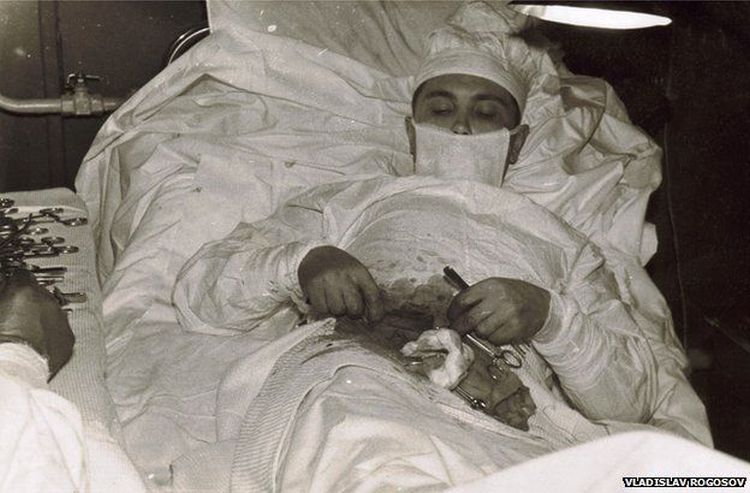
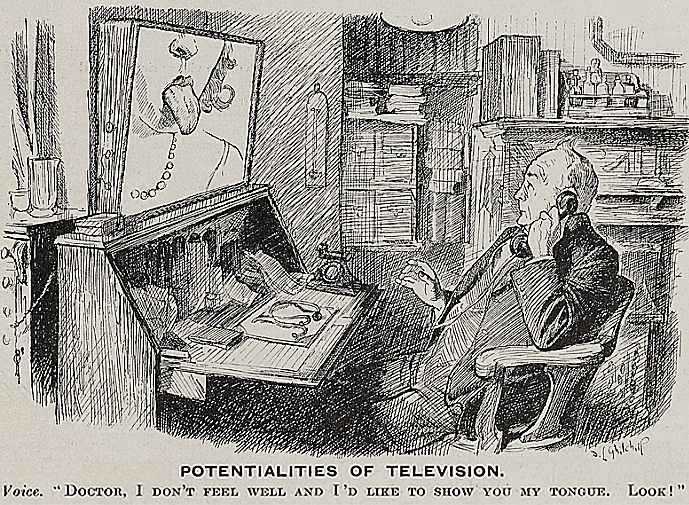

https://en.wikipedia.org/wiki/Histology

https://en.wikipedia.org/wiki/Blue_Zone

https://pl.wikipedia.org/wiki/Marian_Grzybowski_%28dermatolog%29

### #TBT Einthoven and Electrocardiography

Einthoven, a Dutch physician, invented the string galvanometer in 1903, inaugurating the discipline of electrocardiography.

Early ECGs were done on healthy subjects, as patients confined to the hospitals were too ill to be transported for recording.

The original apparatus occupied 2 rooms and required 5 men to operate. Pictured here are the immersion electrodes on a healthy volunteer, published in 1906.

Early on, Einthoven himself did not fully appreciate the power of his invention. It was Sir Thomas Lewis, the father of electrophysiology, whose studies of heart rhythms that advanced the field forward.

For his invention, Einthoven received the 1924 Nobel Prize in Medicine. In his acceptance speech, he credited Lewis as follows:

‘It is my conviction that the general interest in the ECG would certainly not be so high nowadays if we had to do without his [Lewis'] work, and I doubt whether without his valuable contribution I should have the privilege of standing before you today’.

---

W dobie walki o usunięcie niebezpiecznych zapisów z umów lekarskich, warto czasem się zatrzymać i zrobić coś innego, na przykład napisać felieton.

Dzisiaj napiszę tekst na temat, według mnie, jednej z przyczyn braku zmian w publicznym systemie opieki zdrowotnej.

Niewolnicy

Wiele mówi się o lekarskich wynagrodzeniach. O ich zróżnicowaniu od kilku do nawet kilkudziesięciu tysięcy złotych miesięcznie. O różnych formach zatrudnienia od standardowej umowy o pracę, przez umowę zlecenie, do umowy kontaktowej. Można rzec: ilu lekarzy, tyle grup interesów (poza homogenicznymi grupami, jak na przykład lekarze rezydenci, którzy mają ustalone warunki płacy i kształcenia oraz formę zatrudnienia).

Przechodząc jednak do meritum... Już jakiś czas temu otrzymałem pytanie: „jak to możliwe, że lekarzy jest tak mało, a nie mogą wynegocjować skutecznie postulowanych przez siebie warunków wynagrodzenia?”. Ponad rok zajęło mi poszukiwanie odpowiedzi na to pytanie, ale chyba ją znalazłem. Ba, odpowiedź na to pytanie wiąże się pośrednio z brakiem widocznych, realnych zmian w publicznym sektorze ochrony zdrowia.

Lekarze (nie jako jedyni pracownicy ochrony zdrowia, o czym w post scriptum) otrzymali w 1999 roku możliwość zawierania tzw. umów kontraktowych, które zwiększyły znacząco ich uposażenia. Sprawiły, że stali się oni „mini-przedsiębiorcami”, mogli brać kredyty firmowe czy leasingować auta. I w wielu przypadkach tak właśnie się stało.

Ogromne zobowiązania (hipoteki, leasingi) spowodowały, że wielu z nas przestało być wolnych. Przestaliśmy mieć możliwość wyboru, być asertywnymi, nie godzić się na niegodne.

Pracodawcy skrzętnie, a organizatorzy systemu opieki zdrowotnej (parlamentarzyści, Narodowy Fundusz Zdrowia) jeszcze skrzętniej, to wykorzystali. To z tego powodu wielokrotnie otrzymujemy do podpisania nienegocjowalne warunki umów. Bardzo często jesteśmy zmuszeni, z powodu zobowiązań, podpisać umowę z niekorzystnymi warunkami.

W Polsce, według szacunków, brakuje od 30 do 50, a ostatnio mówi się nawet o 68 tys., lekarzy. Pomimo ogromnych niedoborów kadrowych, w dalszym ciągu nie możemy wynegocjować postulowanych wysokości wynagrodzeń (1 średnia krajowa dla lekarza stażysty, 2 średnie krajowe dla lekarza w trakcie szkolenia specjalizacyjnego, 3 średnie krajowe dla lekarzy specjalistów). Czechom udało się zreformować ich system opieki zdrowotnej, włącznie z wynagrodzeniami (lata 2010/2011).

Od Czechów różnią nas co najmniej 3 wątki:
1. W Czechach nie ma polaryzacji form zatrudnienia (dominuje standardowa umowa o pracę).
2. W Czechach nie ma polaryzacji sektorów ochrony zdrowia (dominuje publiczny sektor ochrony zdrowia).
3. Czesi, wtenczas, nie żyli ponad stan.

Przede wszystkim dzięki trzeciemu wątkowi Czesi mogli zrezygnować z pracy, z czego skorzystali. Ten siłowy ruch zmusił ówczesny rząd czeski do przeprowadzenia całościowej reformy ochrony zdrowia.

W Polsce jest to obecnie niemożliwe. Dlaczego? Niektóre odpowiedzi:
„Nie zrezygnuję z pracy, bo mam kredyt”
„Nie zmniejszę liczby dyżurów, bo nie starczy mi do pierwszego”
„Nie odpuszczę trzeciego etatu, bo nie będzie mnie stać na zobowiązania”
Itd., itd.

Doskonale wiemy, że ograniczenie czasu pracy przez obecnie aktywną kadrę lekarską, spowodowałoby paraliż w ochronie zdrowia po 2-3 tygodniach i wpłynęłoby na ustalenie wynagrodzeń na postulowanym poziomie.

Doskonale wiemy, że ograniczenie czasu pracy przez obecnie aktywną kadrę lekarską, spowodowałoby paraliż w ochronie zdrowia po 2-3 tygodniach i wpłynęłoby na konieczność przeprowadzenia całościowej reformy systemu opieki zdrowotnej.

To właśnie zobowiązania, które na siebie narzuciliśmy, są jednym z „hamulcowych” zmian warunków pracy i płacy lekarzy, ale również, pośrednio nie pozwalają na podjęcie siłowych rozwiązań, które zmusiłyby decydentów do podjęcia się natychmiastowej reformy ochrony zdrowia.

Jesteśmy w jakimś stopniu zakładnikami systemu oraz niewolnikami pracodawców i parlamentarzystów.

Żyję w wynajmowanym mieszkaniu, w kwietniu przyszłego roku kończę spłacać kredyt na średniej klasy samochód, którym jeżdżę. Oczywiście chciałbym mieszkać w większym, a przede wszystkim swoim, mieszkaniu. Moim marzeniem jest jeździć Mercedesem klasy E. I gdy będzie mnie na to stać, na pewno swoje marzenia zrealizuję. Kluczem jednak jest tutaj konstrukcja: jeśli będzie mnie na to stać.

Przed tygodniem zakończyłem szkolenie specjalizacyjne w trybie rezydentury w dziedzinie reumatologii. Teraz mam czas na zrealizowanie biurokracji dopuszczającej mnie do państwowego egzaminu specjalizacyjnego. Najważniejsze jednak, że z powodu niedużych zobowiązań, mam możliwość wyboru. Wyboru pracodawcy, miejsca pracy, nawet kraju. W przypadku niekorzystnych warunków pracy i płacy w Bydgoszczy, mogę podjąć się pracy we Wrocławiu czy Gdańsku, a w przypadku złych warunków pracy na terenie kraju, mogę z niego wyjechać leczyć w warunkach dużo bardziej ergonomicznych, korzystnych i lepiej płatnych niż w Polsce. Co więcej, mogę przez kilka miesięcy nie pracować w ogóle.

Gdyby może nie każdy, ale większość lekarzy miało takie możliwości, wolność, moglibyśmy wręcz zmusić rząd do zmian. Oczywiście nie do nas należy, de facto, reforma tego systemu, ale podobnie do Czechów moglibyśmy wziąć sprawy w swoje ręce, bo woli ze strony decydentów nie widać.

Na tę chwilę uważam, że system opieki zdrowotnej szybciej zawali się sam niż my do tego doprowadzimy.

B. Fiałek

PS Wiele z powyższych sformułowań można przypiąć do zawodu pielęgniarki i położnej. Trudnego, bardzo potrzebnego, będącego częścią zespołu, zmagającego się z ogromnymi, nawet większymi niż lekarskie, brakami kadrowymi, a również niemogącego wynegocjować adekwatnych warunków zatrudnienia.

---

Przed II wojną światową w Niemczech panował narkotykowy szał. Firma Temmler wprowadziła na rynek Pervitin, czyli metamfetaminę, która była dostępna dla każdego jako panaceum na całe zło tego świata.
Idąc za ciosem – powstały pralinki z metamfetaminą, a każda czekoladka zawierała 14 mg mety – czyli jakieś pięć razy więcej niż było w zwykłej tabletce Pervitinu. „Pralinki Hildebranda zawsze cieszą” – tak zachwalał slogan zakładu cukierniczego Mother’s Little Helper. Śmiała rekomendacja dziennego spożycia pralinek przez producenta zakładała spożycie od 3 do 9 pralinek dziennie. Zachwalano produkt również w ten sposób, że w porównaniu z kofeiną  jest całkiem bezpieczny. Zażywając czekoladki z metą można było łatwiej uporać się z pracami domowymi, a prócz tego traciło się kilogramy, gdyż Pervitin był również reklamowany jako środek na odchudzanie.
@czekoada – co Ty na takie pralinki?
Zdjęcie i informacje o pralinkach pochodzą z książki „Trzecia Rzesza na haju – narkotyki w hitlerowskich Niemczech”.

### 1961

Leonid Rogozow – radziecki chirurg, który przeprowadził operację na samym sobie. W 1961 r. grupa składająca się z 12 rosyjskich naukowców, przebywała na stacji polarnej Novolazarevskaya na Antarktydzie. Wśród uczestników znajdował się chirurg Rogozow, który z założenia miał dbać o dobry stan zdrowia swoich towarzyszy i był jedynym lekarzem w ekipie.
Podczas ekspedycji Rogozov poważnie zachorował. Zdiagnozował u siebie ostre zapalenie wyrostka robaczkowego. W obliczu zagrożenia życia i niemożliwości uzyskania pomocy z zewnątrz, podjął decyzję o operowaniu samego siebie.
Ogólna narkoza nie wchodziła w grę. Chirurg zastosował miejscowe znieczulenie. Po dwugodzinnej, udanej operacji założył ostatni szew, wziął antybiotyki i leki nasenne. Lekarz wrócił do normalnych obowiązków zaledwie dwa tygodnie później.

  

### 1937

Remote medicine (Punch).

  

---

<a href="https://github.com/TomaszWaszczyk/historia.waszczyk.com/edit/master/src/content/medicine.md" target="_blank">Edytuj tę stronę dzieląc się własnymi notatkami!</a>
