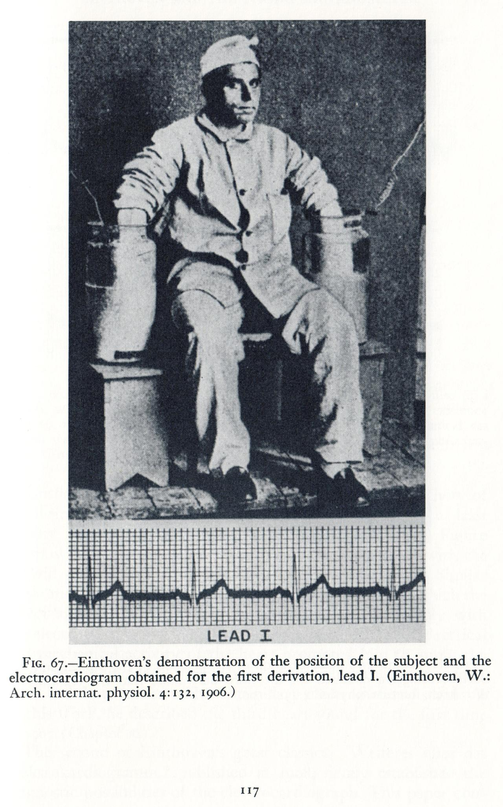
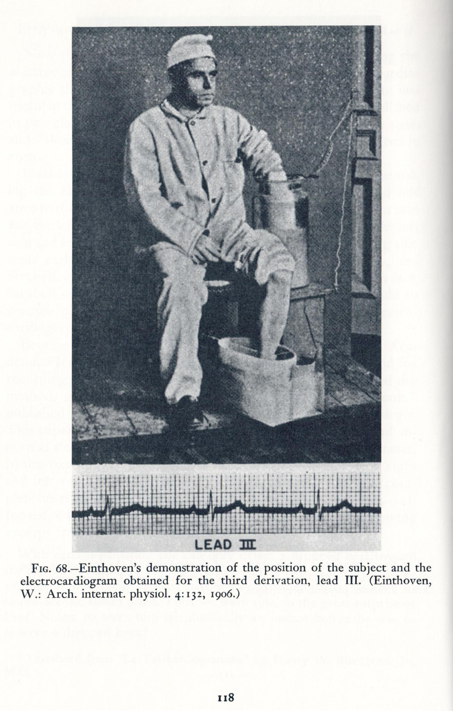

### #TBT Einthoven and Electrocardiography

Einthoven, a Dutch physician, invented the string galvanometer in 1903, inaugurating the discipline of electrocardiography. 

Early ECGs were done on healthy subjects, as patients confined to the hospitals were too ill to be transported for recording.

The original apparatus occupied 2 rooms and required 5 men to operate. Pictured here are the immersion electrodes on a healthy volunteer, published in 1906.

Early on, Einthoven himself did not fully appreciate the power of his invention. It was Sir Thomas Lewis, the father of electrophysiology, whose studies of heart rhythms that advanced the field forward.

For his invention, Einthoven received the 1924 Nobel Prize in Medicine. In his acceptance speech, he credited Lewis as follows:

‘It is my conviction that the general interest in the ECG would certainly not be so high nowadays if we had to do without his [Lewis'] work, and I doubt whether without his valuable contribution I should have the privilege of standing before you today’.

---

<a href="https://github.com/TomaszWaszczyk/historia.waszczyk.com/edit/master/src/content/medicine.md" target="_blank">Edytuj tę stronę dzieląc się własnymi notatkami!</a>
