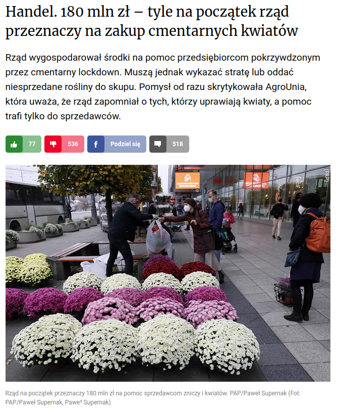
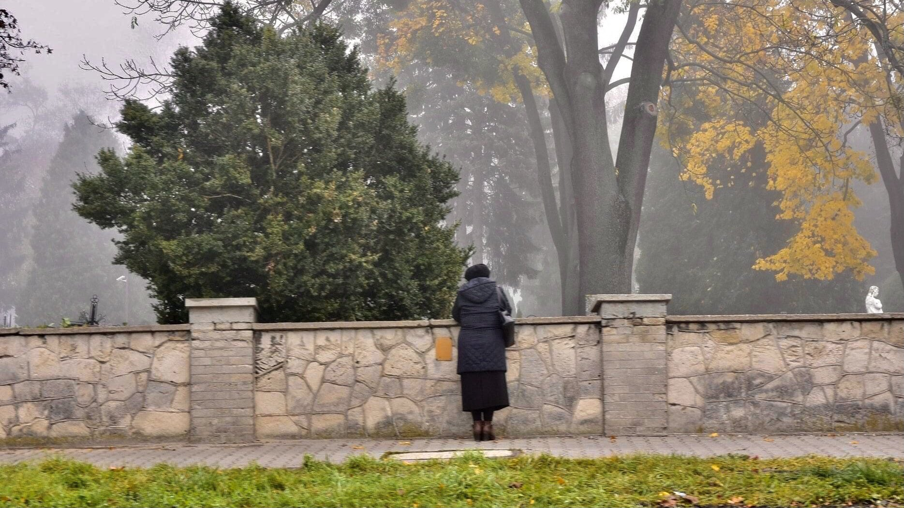
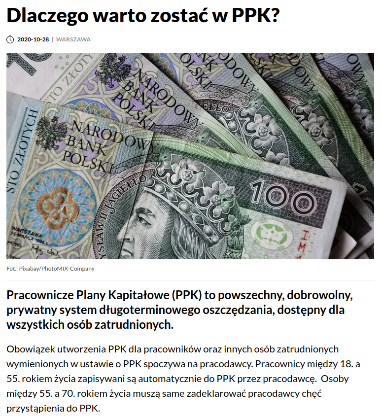
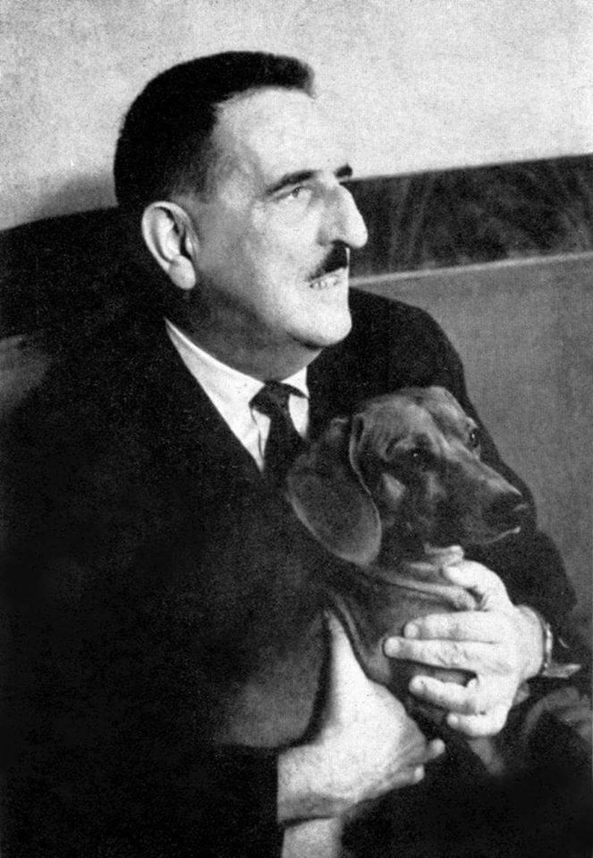
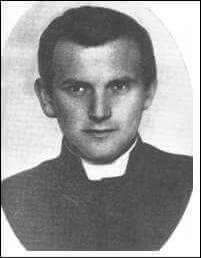
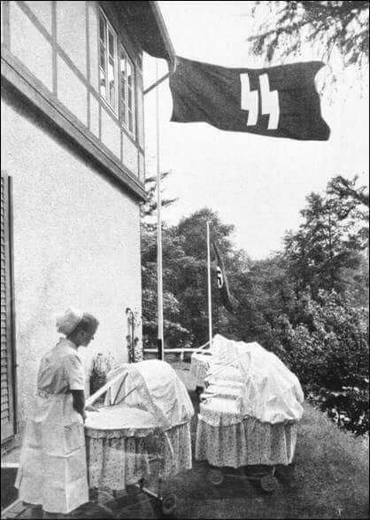
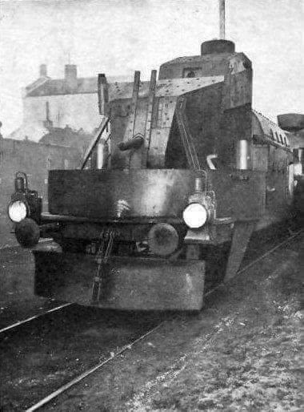
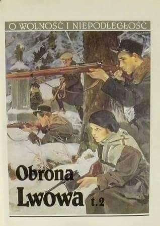

### 2020

Wszystkich Świętych 2020. Zamknięte cmentarze 1 i 2 listopada.

Stwórz problem a później go rozwiąż jak bohater - praktyka:

  

---

Więcej niż tysiąc słów:

  

---

Materiał TVP zachęcający do PPK:

  

---

W ten weekend na Słowacji przeprowadzono ponad 1 mln testów na obecność COVID. Wyniki zostaną ogłoszone w poniedziałek przed południem. Dla wielu noże to być szok - gdy te wyniki zostaną ogłoszone. Wykrytych zakażeń może być nawet 200-300k jednorazowo.

Ciekawe jak tę informacje odbiorą rynki finansowe? Dla wielu może to być totalne zaskoczenie..

---

### 1975

Odbyła się pierwsza kwesta artystów polskich na warszawskich Powązkach. Celem akcji było zbieranie funduszy na rzecz ratowania zabytkowych i niszczejących nagrobków. Jednym z pomysłodawców akcji był polski pisarz, publicysta, krytyk muzyczny i działacz społeczny Jerzy Waldorff (na zdjęciu). Waldorff osobiście dzwonił do znanych osobistości kultury i mediów namawiając ich do wzięcia udziału w zbiórce pieniędzy. Przyszło wtedy około 200 osób. Udział w kweście wzięli m.in. Irena Kwiatkowska, Danuta Szaflarska i Maja Komorowska. Coroczna zbiórka pieniędzy trwa do dziś.

  

### 1961

https://en.wikipedia.org/wiki/London_Gold_Pool

### 1946

W prywatnej kaplicy Biskupów Krakowskich kleryk Karol Wojtyła otrzymał święcenia kapłańskie z rąk kardynała Adama Sapiehy.

  

### 1942

Sprawozdanie Delegatury Rządu na Kraj, w sprawie zakładu stowarzyszenia Lebensborn w Helenowie pod Łodzią.
ZBRODNICZE EKSPERYMENTY
Na wniosek "grupy naukowej" NSDAP w okręgu łódzkim - latem ub. roku utworzony został w okolicach Helenowa pod Łodzią eksperymentalny "obóz poprawy rasy nordyckiej", jako pierwsza tego typu placówka "na odzyskanych ziemiach wschodnich".
W samej Rzeszy tego typu obozy istnieją pod inną nazwą i na innych zasadach organizacyjnych już od kilku lat i cieszą się wielkim poparciem władz lekarskich, szkolnych, itp. Informowała o nich kilkakrotnie przed wojną prasa polska, lecz wiadomości te, przyjęte za kaczkę dziennikarską, przeszły bez większego wrażenia. W roku 1939 było takich obozów w Niemczech około 10. Obecnie, prawdopodobnie, liczba ta uległa zwiększeniu.
Helenowski obóz poprawy rasy, jak wskazuje sama nazwa, ma na celu podniesienie nordyckiego typu rasowego do ideałów Gobineau i współczesnych "naukowych rasistów". W pierwszej fazie organizacji obozu przywieziono do niego kilkadziesiąt dziewcząt niemieckich w wieku 15-18 lat. Z kolei przystąpiono do urządzania boisk sportowych, pływalni, sal szkolnych, świetlicy i szeregu dwuosobowych domków letniskowych na terenie obozu. Na jesieni, kiedy prace wstępne zostały zakończone, społeczeństwo polskie w Łódzkim i Poznańskim przeraziły masowe zaginięcia młodych chłopców i dziewcząt o wzorowej budowie fizycznej, niebieskich oczach, itp. Część zaginionych po kilkunastu dniach powróciła do domów. Po reszcie na razie zaginął wszelki ślad: później przyszły od nich wiadomości z Helenowa, oczywiście drogą nielegalną.
Złapaną na ulicach czy w pociągach młodzież polską kierowano do Łodzi, gdzie poddawane były wszechstronnemu badaniu lekarskiemu. Przy stwierdzeniu jakichkolwiek chorób chronicznych i niedomóg fizycznych - młodzież ta zwalniana była do domów. Resztę, po przyjęciu szeregu ochronnych zaszczepień i zabiegów lekarskich, kierowano do Helenowa gdzie następował podział według wieku i płci. Po ukończeniu tych przedwstępnych czynności pensjonariusze i pensjonariuszki rozpoczęli swoją gehennę, tak tragiczną, że wydaje się ona aż nieprawdopodobną (dane do niniejszej notatki otrzymane od osoby bezwzględnie dobrze poinformowanej).
We wrześniu każdy z domków na terenie obozu zamieszkały został przez młodocianą parę: Niemca i Polkę lub Polaka i Niemkę. Program dnia obozowego był następujący: o godzinie 6 pobudka, sprzątanie w domku, gimnastyka, mycie, itp. O godz. 7 wspólne śniadanie pod gołym niebem lub, w razie niepogody, w świetlicy. Z kolei 2 godziny zajęć szkolnych, lekcje niemieckiego, fizyki, przyrody, matematyki. Od godz. 11 do 13-tej zajęcia sportowe: gry, pływanie, lekkoatletyka, itp. O 13 obiad, potem dwie godziny wypoczynku. Od 15 do 17 co drugi dzień na przemian zajęcia sportowe i lekcje. O 17 podwieczorek, po czym wspólne grupowe wycieczki, marsze, a dla młodzieży męskiej ćwiczenia wojskowe z zakresu przysposobienia wojskowego. O 20 kolacja po czym gawędy obozowe przy ognisku lub świetlicy. Dzień obozowy kończył się o godz. 22-iej gaszeniem świateł w domkach. Warto podkreślić doskonałe odżywianie w obozie: codziennie mięso, mleko, świeże owoce, duże ilości białego pieczywa i jarzyn. Tyle o zewnętrznej stronie obozu.
Przy stosunkowo dużej, mimo obszernego programu zajęć dziennych, swobodzie życia obozowego i jednakowym traktowaniu Niemców i Polaków - jedynym obowiązkiem, od którego nie wolno było uchylić się - było utrzymywanie stosunków płciowych między mieszkańcami domków. Obowiązek ten był kontrolowany przez personel lekarski obozu, jakiekolwiek wykroczenia przeciw niemu karano najsurowiej. Na tle zmuszania dziewcząt polskich do obcowania płciowego z Niemcami zanotowano w obozie kilka prób samobójstwa, niestety nieudanego. Aby zapobiec im w przyszłości - kierownictwo "ideowe" obozu zorganizowało cykl socjalnych pogadanek, propagujących obcowanie płciowe zamieszkującej obóz młodzieży i podnoszących znaczenie czystości rasy w życiu narodów... niemieckiego i polskiego.
Obóz helenowski został ostatnio znacznie rozszerzony i zamieszkuje go obecnie ponad 500 dziewcząt i chłopców, w tym większość młodzieży polskiej. Skład osobowy obozu ulega stałym zmianom: dziewczęta, u których stwierdzono poważny stan wywożone są na stałe do Niemiec. Jaki będzie ich los po urodzeniu dziecka... łatwo przewidzieć. W najlepszym wypadku zatrudnione zostaną na roli lub w zakładach zbrojeniowych, w najgorszym - zwiększą kadry "kobiet dla armii". Chłopcy zapewne wrócą kiedyś do swych rodzin. Ślady psychiczne jednak, jakie pozostawi na nich "obóz poprawy rasy nordyckiej" nie dadzą się już zatrzeć.
W latach bezprzykładnego barbarzyństwa, jakie raz jeszcze zademonstrował światu naród niemiecki, obóz helenowski pozostanie jednym z najtragiczniejszych i najwstrętniejszych przejawów degeneracji, zdziczenia i zbrodni.
Delegatura Rządu na Kraj 1 listopada 1941-15 stycznia 1942

  

### 1918

W Płaszowie koło Krakowa oddziały polskie zdobyły austriacki wojskowy tabor kolejowy, z którego następnie utworzono pociągi pancerne "Śmiały" i "Piłsudczyk" Brały one udział w konflikcie polsko-ukraińskim w 1918 roku oraz w wojnie obronnej w 1939 roku.
Na zdjęciu pociąg "Śmiały".

  

---

Rozpoczął się trwający do 22 maja 1919 roku polsko-ukraiński konflikt zbrojny o Lwów.
Genezą tej batalii było opanowanie przez żołnierzy austro-węgierskich pochodzenia ukraińskiego większości lwowskich budynków użyteczności publicznej. Nie spodobało się to polskim organizacjom konspiracyjnym, polskim mieszkańcom Lwowa,a także młodzieży polskiej znanej pózniej jako Orlęta Lwowskie. Wszystko to doprowadziło do ofensywy Wojska Polskiego, która zakończyła się wyparciem oddziałów ukraińskich ze Lwowa.

  

### 1912

https://pl.wikipedia.org/wiki/Wac%C5%82aw_Stykowski

### 1862

Urodził się Feliks Koneczny: https://pl.wikipedia.org/wiki/Feliks_Koneczny

---

<a href="https://github.com/TomaszWaszczyk/historia.waszczyk.com/edit/master/src/content/november-1.md" target="_blank">Edytuj tę stronę dzieląc się własnymi notatkami!</a>
